# 整体架构设计

## 引言

Claude Code 是 Anthropic 推出的 AI 驱动的命令行代码编辑器，它将强大的 Claude AI 模型与完整的开发工具链深度集成。本文将深入探讨 Claude Code 的整体架构设计，帮助你理解这款工具的技术基础和设计理念。

### 为什么需要了解架构？

1. **更好地使用工具**：理解架构能帮助你更高效地使用 Claude Code
2. **开发自定义扩展**：为后续开发 MCP Server 和自定义工具打基础
3. **构建类似产品**：为开发自己的 AI 编程助手提供参考
4. **技术选型参考**：学习成熟产品的架构设计思路


## 一、技术栈概览

### 1.1 核心技术选择

```mermaid
graph TB
    A[Claude Code技术栈] --> B[前端层]
    A --> C[通信层]
    A --> D[AI层]
    A --> E[工具层]
    A --> F[存储层]

    B --> B1[Node.js]
    B --> B2[TypeScript]
    B --> B3[Commander.js CLI框架]

    C --> C1[HTTP/HTTPS]
    C --> C2[WebSocket实时通信]
    C --> C3[SSE流式传输]

    D --> D1[Claude 3.5 Sonnet]
    D --> D2[Anthropic API]
    D --> D3[Tool Calling]

    E --> E1[文件系统操作]
    E --> E2[进程管理]
    E --> E3[MCP协议]

    F --> F1[SQLite本地存储]
    F --> F2[文件系统缓存]
    F --> F3[JSON配置文件]

    style A fill:#e1f5ff,stroke:#333,stroke-width:3px
    style D1 fill:#ffe1f5,stroke:#333,stroke-width:2px
```



### 1.2 技术栈详解

| 层级 | 技术 | 作用 | 选择理由 |
|------|------|------|---------|
| **前端交互** | Node.js + TypeScript | CLI 应用主框架 | 跨平台、生态丰富、类型安全 |
| **命令解析** | Commander.js | 命令行参数处理 | 成熟稳定、易用 |
| **AI 引擎** | Claude 3.5 Sonnet | 核心 AI 能力 | 强大的代码理解和生成能力 |
| **通信协议** | HTTP + SSE | 与 Anthropic API 通信 | 支持流式响应 |
| **工具调用** | Tool Calling | AI 调用系统工具 | Anthropic 原生支持 |
| **扩展协议** | MCP (Model Context Protocol) | 第三方工具集成 | 标准化、可扩展 |
| **数据存储** | SQLite + 文件系统 | 会话和配置持久化 | 轻量、无需额外服务 |
| **进程管理** | child_process | 执行系统命令 | Node.js 原生支持 |


## 二、整体架构设计

### 2.1 四层架构模型

Claude Code 采用经典的分层架构设计：

```mermaid
graph TB
    subgraph "用户交互层"
        A1[CLI命令接口]
        A2[交互式对话]
        A3[文件监听]
    end

    subgraph "核心引擎层"
        B1[会话管理器]
        B2[上下文管理器]
        B3[AI引擎]
        B4[工具调度器]
    end

    subgraph "工具执行层"
        C1[文件操作工具]
        C2[代码搜索工具]
        C3[终端工具]
        C4[MCP工具]
        C5[浏览器工具]
    end

    subgraph "系统接口层"
        D1[文件系统]
        D2[进程管理]
        D3[网络通信]
        D4[外部服务]
    end

    A1 --> B1
    A2 --> B2
    A3 --> B2

    B1 --> B3
    B2 --> B3
    B3 --> B4

    B4 --> C1
    B4 --> C2
    B4 --> C3
    B4 --> C4
    B4 --> C5

    C1 --> D1
    C2 --> D1
    C3 --> D2
    C4 --> D3
    C5 --> D4

    style B3 fill:#ffe1f5,stroke:#333,stroke-width:2px
    style B4 fill:#e1f5ff,stroke:#333,stroke-width:2px
```



### 2.2 架构层级详解

#### **第一层：用户交互层**

负责接收用户输入和展示输出。

**核心组件**：
- **CLI 命令接口**：处理命令行参数和子命令
- **交互式对话**：管理多轮对话的输入输出
- **文件监听**：监控文件变化，触发相关处理

**代码示例**：
```typescript
// CLI 入口点简化示例
import { Command } from 'commander';

const program = new Command();

program
  .name('claude-code')
  .description('AI-powered code editor')
  .version('1.0.0');

// 主对话命令
program
  .command('chat')
  .description('Start interactive chat')
  .option('-m, --message <text>', 'Initial message')
  .option('-f, --file <path>', 'Context file')
  .action(async (options) => {
    const session = new ChatSession(options);
    await session.start();
  });

// 执行单个任务
program
  .command('do <task>')
  .description('Execute a single task')
  .action(async (task) => {
    const executor = new TaskExecutor();
    await executor.run(task);
  });

program.parse();
```


#### **第二层：核心引擎层**

这是 Claude Code 的"大脑"，负责决策和协调。

**核心组件**：

1. **会话管理器 (Session Manager)**
   - 管理用户会话生命周期
   - 维护会话状态和元数据
   - 处理会话切换和恢复

2. **上下文管理器 (Context Manager)**
   - 收集和组织上下文信息
   - Token 预算管理
   - 智能截断和优先级排序

3. **AI 引擎 (AI Engine)**
   - 与 Claude API 通信
   - 处理流式响应
   - 解析 AI 输出

4. **工具调度器 (Tool Dispatcher)**
   - 解析工具调用请求
   - 路由到对应工具
   - 聚合工具执行结果

**核心引擎流程**：

```mermaid
sequenceDiagram
    participant User as 用户
    participant Session as 会话管理器
    participant Context as 上下文管理器
    participant AI as AI引擎
    participant Tool as 工具调度器

    User->>Session: 发送消息
    Session->>Context: 收集上下文
    Context->>Context: Token预算计算
    Context->>Context: 优先级排序
    Context-->>Session: 返回优化后上下文

    Session->>AI: 构造API请求
    AI->>AI: 调用Claude API
    AI-->>Session: 流式返回响应

    alt AI请求工具调用
        AI->>Tool: 工具调用请求
        Tool->>Tool: 执行工具
        Tool-->>AI: 工具执行结果
        AI->>AI: 继续生成
    end

    AI-->>Session: 最终响应
    Session-->>User: 显示结果
```



**代码示例**：
```typescript
// AI 引擎核心逻辑简化示例
class AIEngine {
  private client: Anthropic;
  private toolDispatcher: ToolDispatcher;

  async processMessage(
    messages: Message[],
    tools: Tool[],
    options: AIOptions
  ): Promise<AIResponse> {
    // 构造 API 请求
    const request = {
      model: 'claude-3-5-sonnet-20250929',
      max_tokens: options.maxTokens || 8000,
      messages: messages,
      tools: tools,
      stream: true
    };

    // 流式处理响应
    const stream = await this.client.messages.create(request);

    let fullResponse = '';
    const toolCalls: ToolCall[] = [];

    for await (const chunk of stream) {
      if (chunk.type === 'content_block_start') {
        // 处理内容块开始
      } else if (chunk.type === 'content_block_delta') {
        // 处理内容增量
        if (chunk.delta.type === 'text_delta') {
          fullResponse += chunk.delta.text;
          // 实时输出给用户
          process.stdout.write(chunk.delta.text);
        } else if (chunk.delta.type === 'tool_use') {
          // 收集工具调用
          toolCalls.push(chunk.delta);
        }
      }
    }

    // 如果有工具调用，执行工具
    if (toolCalls.length > 0) {
      const toolResults = await this.toolDispatcher.execute(toolCalls);
      // 将工具结果返回给AI，继续对话
      return this.processMessage(
        [...messages, { role: 'assistant', content: toolCalls }, { role: 'user', content: toolResults }],
        tools,
        options
      );
    }

    return { content: fullResponse, toolCalls };
  }
}
```


#### **第三层：工具执行层**

提供 AI 可调用的各种工具能力。

**核心工具分类**：

```mermaid
graph LR
    A[工具系统] --> B[文件操作类]
    A --> C[代码搜索类]
    A --> D[系统执行类]
    A --> E[扩展工具类]

    B --> B1[Read - 读取文件]
    B --> B2[Write - 写入文件]
    B --> B3[Edit - 编辑文件]

    C --> C1[Glob - 文件匹配]
    C --> C2[Grep - 内容搜索]

    D --> D1[Bash - 命令执行]
    D --> D2[BashOutput - 输出获取]

    E --> E1[MCP工具 - 外部集成]
    E --> E2[Browser - 浏览器操作]

    style A fill:#e1f5ff,stroke:#333,stroke-width:3px
```



**工具定义示例**：
```typescript
// 工具定义规范
interface ToolDefinition {
  name: string;
  description: string;
  input_schema: {
    type: 'object';
    properties: Record<string, any>;
    required: string[];
  };
}

// Read 工具定义
const ReadTool: ToolDefinition = {
  name: 'Read',
  description: 'Reads a file from the local filesystem. Returns file contents.',
  input_schema: {
    type: 'object',
    properties: {
      file_path: {
        type: 'string',
        description: 'The absolute path to the file to read'
      },
      offset: {
        type: 'number',
        description: 'The line number to start reading from (optional)'
      },
      limit: {
        type: 'number',
        description: 'The number of lines to read (optional)'
      }
    },
    required: ['file_path']
  }
};

// 工具执行器
class ReadToolExecutor implements ToolExecutor {
  async execute(input: ToolInput): Promise<ToolResult> {
    const { file_path, offset = 0, limit } = input;

    try {
      // 读取文件
      const content = await fs.readFile(file_path, 'utf-8');
      const lines = content.split('\n');

      // 应用偏移和限制
      const selectedLines = limit
        ? lines.slice(offset, offset + limit)
        : lines.slice(offset);

      // 添加行号（cat -n 格式）
      const numberedLines = selectedLines.map(
        (line, idx) => `${offset + idx + 1}\t${line}`
      );

      return {
        success: true,
        content: numberedLines.join('\n')
      };
    } catch (error) {
      return {
        success: false,
        error: `Failed to read file: ${error.message}`
      };
    }
  }
}
```


#### **第四层：系统接口层**

与操作系统和外部服务交互。

**核心能力**：
- **文件系统操作**：读写文件、目录遍历、权限管理
- **进程管理**：创建子进程、管理 PTY、信号处理
- **网络通信**：HTTP 请求、WebSocket、SSE
- **外部服务**：数据库连接、API 调用、云服务集成


### 2.3 数据流动

完整的请求-响应流程：

```mermaid
sequenceDiagram
    participant U as 用户
    participant CLI as CLI层
    participant SM as 会话管理
    participant CM as 上下文管理
    participant AI as AI引擎
    participant TD as 工具调度
    participant FS as 文件系统

    U->>CLI: 输入命令/消息
    CLI->>SM: 创建/恢复会话
    SM->>CM: 请求上下文

    CM->>FS: 读取相关文件
    FS-->>CM: 文件内容
    CM->>CM: 计算Token预算
    CM-->>SM: 优化后上下文

    SM->>AI: 发送请求
    Note over AI: 构造API请求<br/>包含messages + tools

    AI->>AI: 调用Claude API
    AI-->>SM: 流式响应（文本）
    SM-->>U: 实时显示

    alt 需要工具调用
        AI->>TD: 工具调用请求
        TD->>TD: 参数验证
        TD->>FS: 执行文件操作
        FS-->>TD: 操作结果
        TD-->>AI: 工具结果

        AI->>AI: 继续生成
        AI-->>SM: 后续响应
        SM-->>U: 显示结果
    end

    SM->>SM: 保存会话
    SM-->>U: 完成
```




## 三、与传统 IDE 的对比

### 3.1 架构差异

| 维度 | 传统 IDE (VS Code) | Claude Code |
|------|-------------------|------------|
| **核心驱动** | 插件系统 + 用户操作 | AI Agent + 自主决策 |
| **交互方式** | GUI + 命令面板 | 自然语言对话 |
| **扩展机制** | Extension API | MCP Protocol + Tools |
| **文件操作** | 用户手动编辑 | AI 自动执行 |
| **任务执行** | 需要用户逐步操作 | AI 自主分解和执行 |
| **上下文管理** | 依赖用户记忆 | 智能上下文收集 |

### 3.2 架构图对比

**传统 IDE 架构**：

```mermaid
graph TB
    A[用户] --> B[GUI界面]
    B --> C[编辑器核心]
    C --> D[插件系统]
    D --> E1[文件系统]
    D --> E2[Git插件]
    D --> E3[调试器]
    D --> E4[终端]

    style A fill:#e8f5e9
    style B fill:#fff4e1
```


**Claude Code 架构**：

```mermaid
graph TB
    A[用户] --> B[自然语言对话]
    B --> C[AI Agent]
    C --> D[工具调度系统]
    D --> E1[文件操作]
    D --> E2[代码搜索]
    D --> E3[命令执行]
    D --> E4[浏览器自动化]
    D --> E5[MCP扩展]

    style A fill:#e8f5e9
    style C fill:#ffe1f5,stroke:#333,stroke-width:2px
```


### 3.3 优势与限制

**Claude Code 的优势**：
- ✅ 自然语言交互，学习成本低
- ✅ AI 自主决策，减少重复操作
- ✅ 智能理解上下文，减少手动指定
- ✅ 跨工具协同，一站式完成任务

**Claude Code 的限制**：
- ⚠️ 依赖网络连接（API 调用）
- ⚠️ 有 API 成本
- ⚠️ AI 可能产生幻觉或错误
- ⚠️ 不适合需要精细控制的场景

## 四、核心设计理念

### 4.1 Agent First

Claude Code 的核心理念是 **AI Agent 优先**，而非传统的工具优先。

**传统方式**：
```
用户 → 选择工具 → 配置参数 → 执行 → 查看结果 → 下一步操作
```

**Claude Code 方式**：
```
用户 → 描述需求 → AI自主决策 → 选择工具 → 执行 → 综合结果 → 继续或完成
```

**代码体现**：
```typescript
// 传统工具调用（用户驱动）
async function traditionalApproach() {
  // 用户手动调用每个工具
  const files = await glob('**/*.ts');
  const content = await readFile(files[0]);
  const analysis = await analyzeCode(content);
  // ...需要用户决定每一步
}

// Claude Code 方式（AI驱动）
async function claudeCodeApproach(userRequest: string) {
  // AI理解需求，自主决策
  const response = await aiEngine.process(userRequest);
  // AI 内部会：
  // 1. 理解需求："分析TypeScript代码"
  // 2. 决策：需要先找到文件
  // 3. 调用Glob工具
  // 4. 调用Read工具
  // 5. 分析代码
  // 6. 生成报告
  // 所有这些步骤AI自主完成
}
```

### 4.2 Context is King

上下文是 Claude Code 能够高效工作的关键。

**上下文来源**：
1. **文件内容**：当前编辑的文件、相关代码文件
2. **项目信息**：package.json、README、git 状态
3. **对话历史**：之前的对话和操作记录
4. **系统信息**：OS、路径、环境变量
5. **工具输出**：执行命令的结果、错误信息

**上下文优先级**（当 Token 预算不足时）：
```typescript
// 上下文优先级策略
const contextPriority = [
  { type: 'current_file', priority: 10 },        // 最高优先级
  { type: 'recent_edits', priority: 9 },
  { type: 'error_messages', priority: 8 },
  { type: 'related_files', priority: 7 },
  { type: 'project_structure', priority: 6 },
  { type: 'recent_conversation', priority: 5 },
  { type: 'git_diff', priority: 4 },
  { type: 'documentation', priority: 3 },
  { type: 'old_conversation', priority: 2 },     // 最低优先级
];
```

### 4.3 Tool Calling Native

Claude 原生支持 Tool Calling，这是架构的核心基础。

**Tool Calling 工作流**：

```mermaid
graph LR
    A[用户请求] --> B[AI分析]
    B --> C{需要工具?}
    C -->|是| D[选择工具]
    C -->|否| E[直接回答]

    D --> F[构造参数]
    F --> G[调用工具]
    G --> H[获取结果]
    H --> I[继续推理]
    I --> C

    E --> J[返回结果]
    I --> J

    style B fill:#ffe1f5
    style G fill:#e1f5ff
```


**API 层面的实现**：
```typescript
// Anthropic API 的 Tool Calling
const response = await anthropic.messages.create({
  model: 'claude-3-5-sonnet-20250929',
  max_tokens: 8000,
  messages: [
    { role: 'user', content: '帮我读取README.md并总结内容' }
  ],
  tools: [
    {
      name: 'read_file',
      description: 'Read a file from the filesystem',
      input_schema: {
        type: 'object',
        properties: {
          path: { type: 'string', description: 'File path' }
        },
        required: ['path']
      }
    }
  ]
});

// Claude 会决定调用工具
if (response.stop_reason === 'tool_use') {
  const toolUse = response.content.find(c => c.type === 'tool_use');
  // toolUse.name === 'read_file'
  // toolUse.input === { path: 'README.md' }

  // 执行工具
  const result = await executeTools(toolUse);

  // 将结果返回给Claude
  const finalResponse = await anthropic.messages.create({
    model: 'claude-3-5-sonnet-20250929',
    messages: [
      ...previousMessages,
      { role: 'assistant', content: response.content },
      { role: 'user', content: [{ type: 'tool_result', tool_use_id: toolUse.id, content: result }] }
    ]
  });
}
```

### 4.4 Extensibility via MCP

MCP (Model Context Protocol) 是扩展性的核心。

**MCP 的作用**：
- 标准化工具定义
- 支持第三方工具集成
- 插件化架构
- 社区生态建设

**MCP 工作原理**（简化）：
```typescript
// MCP Server 接口
interface MCPServer {
  name: string;
  tools: ToolDefinition[];
  execute(toolName: string, params: any): Promise<any>;
}

// Claude Code 加载 MCP Server
class MCPLoader {
  private servers: Map<string, MCPServer> = new Map();

  async loadServer(serverPath: string) {
    const server = await import(serverPath);
    this.servers.set(server.name, server);

    // 将 MCP 工具注册到工具系统
    server.tools.forEach(tool => {
      toolRegistry.register(tool, (params) => {
        return server.execute(tool.name, params);
      });
    });
  }
}

// 示例：Git MCP Server
const GitMCPServer: MCPServer = {
  name: 'git',
  tools: [
    {
      name: 'git_status',
      description: 'Get git status',
      input_schema: { type: 'object', properties: {} }
    },
    {
      name: 'git_commit',
      description: 'Create a git commit',
      input_schema: {
        type: 'object',
        properties: {
          message: { type: 'string' }
        },
        required: ['message']
      }
    }
  ],
  async execute(toolName, params) {
    if (toolName === 'git_status') {
      return await execCommand('git status');
    } else if (toolName === 'git_commit') {
      return await execCommand(`git commit -m "${params.message}"`);
    }
  }
};
```


## 五、性能与可扩展性

### 5.1 性能优化策略

**1. 流式响应**
```typescript
// 使用 Server-Sent Events 实现流式响应
async function* streamResponse(prompt: string) {
  const stream = await anthropic.messages.stream({
    model: 'claude-3-5-sonnet-20250929',
    messages: [{ role: 'user', content: prompt }],
    max_tokens: 8000
  });

  for await (const chunk of stream) {
    if (chunk.type === 'content_block_delta') {
      yield chunk.delta.text;  // 立即输出
    }
  }
}
```

**2. 并行工具执行**
```typescript
// 当多个工具调用相互独立时，并行执行
async function executeToolsInParallel(toolCalls: ToolCall[]) {
  const results = await Promise.all(
    toolCalls.map(call => toolDispatcher.execute(call))
  );
  return results;
}
```

**3. 智能缓存**
```typescript
// 缓存文件内容和搜索结果
class SmartCache {
  private fileCache: Map<string, { content: string; mtime: number }> = new Map();
  private searchCache: Map<string, SearchResult> = new Map();

  async readFile(path: string): Promise<string> {
    const stat = await fs.stat(path);
    const cached = this.fileCache.get(path);

    if (cached && cached.mtime === stat.mtimeMs) {
      return cached.content;  // 返回缓存
    }

    const content = await fs.readFile(path, 'utf-8');
    this.fileCache.set(path, { content, mtime: stat.mtimeMs });
    return content;
  }
}
```

### 5.2 可扩展性设计

**1. 插件化工具系统**
```typescript
// 工具注册表
class ToolRegistry {
  private tools: Map<string, ToolExecutor> = new Map();

  register(definition: ToolDefinition, executor: ToolExecutor) {
    this.tools.set(definition.name, executor);
  }

  getAll(): ToolDefinition[] {
    return Array.from(this.tools.keys()).map(name => ({
      name,
      // ... 其他定义
    }));
  }

  async execute(name: string, params: any): Promise<ToolResult> {
    const executor = this.tools.get(name);
    if (!executor) {
      throw new Error(`Tool ${name} not found`);
    }
    return executor.execute(params);
  }
}
```

**2. MCP Server 动态加载**
```typescript
// 从配置文件加载 MCP Servers
async function loadMCPServers(config: Config) {
  const servers = config.mcpServers || [];

  for (const serverConfig of servers) {
    try {
      const server = await MCPLoader.load(serverConfig);
      console.log(`Loaded MCP Server: ${server.name}`);
    } catch (error) {
      console.error(`Failed to load ${serverConfig.name}:`, error);
    }
  }
}
```


## 六、安全性设计

### 6.1 多层安全机制

```mermaid
graph TB
    A[用户请求] --> B{权限检查}
    B -->|通过| C{参数验证}
    B -->|拒绝| X1[返回错误]

    C -->|通过| D{需要确认?}
    C -->|失败| X2[返回错误]

    D -->|是| E[用户确认]
    D -->|否| F[执行工具]

    E -->|同意| F
    E -->|拒绝| X3[取消执行]

    F --> G{执行成功?}
    G -->|是| H[返回结果]
    G -->|否| I[错误处理]

    style B fill:#ffe1e1
    style D fill:#fff4e1
    style F fill:#e1f5ff
```



### 6.2 安全措施

**1. 命令白名单/黑名单**
```typescript
// 危险命令黑名单
const DANGEROUS_COMMANDS = [
  'rm -rf /',
  'mkfs',
  'dd if=/dev/zero',
  'fork bomb',
  // ...
];

function validateCommand(command: string): boolean {
  for (const dangerous of DANGEROUS_COMMANDS) {
    if (command.includes(dangerous)) {
      return false;
    }
  }
  return true;
}
```

**2. 文件访问权限控制**
```typescript
// 限制文件访问范围
class FileAccessController {
  private workspaceRoot: string;
  private allowedPaths: Set<string>;

  async checkAccess(filePath: string): Promise<boolean> {
    const resolved = path.resolve(filePath);

    // 检查是否在工作区内
    if (!resolved.startsWith(this.workspaceRoot)) {
      throw new Error('Access denied: outside workspace');
    }

    // 检查是否在允许列表中
    if (this.allowedPaths.size > 0 && !this.allowedPaths.has(resolved)) {
      throw new Error('Access denied: not in allowed paths');
    }

    return true;
  }
}
```

**3. 敏感信息过滤**
```typescript
// 过滤敏感信息
function filterSensitiveInfo(content: string): string {
  // 过滤 API keys
  content = content.replace(/[A-Za-z0-9]{32,}/g, '***REDACTED***');

  // 过滤密码
  content = content.replace(/password\s*[:=]\s*\S+/gi, 'password: ***REDACTED***');

  // 过滤 tokens
  content = content.replace(/token\s*[:=]\s*\S+/gi, 'token: ***REDACTED***');

  return content;
}
```


## 七、最佳实践

### 7.1 架构设计建议

1. **分层清晰**
   - 严格遵守分层架构
   - 避免跨层调用
   - 每层职责单一

2. **接口优先**
   - 定义清晰的接口
   - 面向接口编程
   - 便于测试和替换

3. **可观测性**
   - 完善的日志记录
   - 性能监控
   - 错误追踪

4. **容错设计**
   - 优雅的错误处理
   - 降级策略
   - 重试机制

### 7.2 开发建议

**模块化开发**：
```typescript
// 推荐的模块结构
src/
├── core/                 # 核心引擎
│   ├── ai-engine.ts
│   ├── context-manager.ts
│   └── session-manager.ts
├── tools/               # 工具实现
│   ├── file-tools.ts
│   ├── search-tools.ts
│   └── bash-tools.ts
├── mcp/                 # MCP 相关
│   ├── loader.ts
│   └── registry.ts
├── utils/               # 工具函数
│   ├── token-counter.ts
│   └── file-watcher.ts
└── cli/                 # CLI 入口
    └── index.ts
```

**类型安全**：
```typescript
// 使用 TypeScript 严格模式
// tsconfig.json
{
  "compilerOptions": {
    "strict": true,
    "noImplicitAny": true,
    "strictNullChecks": true
  }
}

// 定义清晰的类型
interface Message {
  role: 'user' | 'assistant' | 'system';
  content: string | ContentBlock[];
  timestamp: Date;
}

interface ToolCall {
  id: string;
  type: 'tool_use';
  name: string;
  input: Record<string, any>;
}
```


## 八、常见问题

### Q1: Claude Code 是否开源？
A: 目前 Claude Code 不是开源的，但 Anthropic 开源了 MCP 协议和部分示例代码。

### Q2: 可以在本地运行吗？
A: Claude Code 需要调用 Anthropic API，因此需要网络连接。核心推理在云端进行，本地主要是工具执行和界面。

### Q3: 如何开发自定义工具？
A: 可以通过两种方式：
1. 开发 MCP Server（推荐）
2. 直接贡献到 Claude Code 项目（如果开源）

### Q4: 性能如何？
A: 取决于：
- 网络延迟（API 调用）
- 上下文大小（Token 数量）
- 工具执行效率
- 一般情况下响应速度在 1-5 秒

### Q5: 成本如何？
A: 基于 Anthropic API 定价：
- Claude 3.5 Sonnet: $3/M input tokens, $15/M output tokens
- 一般对话成本约 $0.01-0.05
- 大型项目分析可能达到 $0.5-1


## 九、扩展阅读

### 推荐资源
- [Anthropic API 文档](https://docs.anthropic.com/)
- [MCP 协议规范](https://modelcontextprotocol.io/)
- [Tool Calling 指南](https://docs.anthropic.com/claude/docs/tool-use)
- [Claude Code 官方文档](https://docs.claude.com/claude-code)

### 相关技术
- **LangChain**：另一个流行的 LLM 应用框架
- **LlamaIndex**：专注于 RAG 的框架
- **AutoGPT**：自主 AI Agent
- **VS Code Extension API**：传统 IDE 扩展开发


## 十、总结

Claude Code 的架构设计体现了现代 AI 应用的最佳实践：

✅ **分层清晰**：四层架构，职责明确
✅ **Agent 优先**：AI 自主决策，减少用户操作
✅ **工具驱动**：强大的工具系统，可扩展性强
✅ **上下文为王**：智能上下文管理，提升效果
✅ **安全可靠**：多层安全机制，错误处理完善


## 下一篇预告

在下一篇文章中，我们将深入探讨 **[核心引擎实现](./02-核心引擎实现.md)**，包括：
- AI 引擎的详细实现
- Prompt 工程和系统提示词设计
- 流式响应处理技术
- 错误恢复机制

敬请期待！ 🚀


**如果觉得这篇文章对你有帮助，欢迎分享给更多的朋友！**
