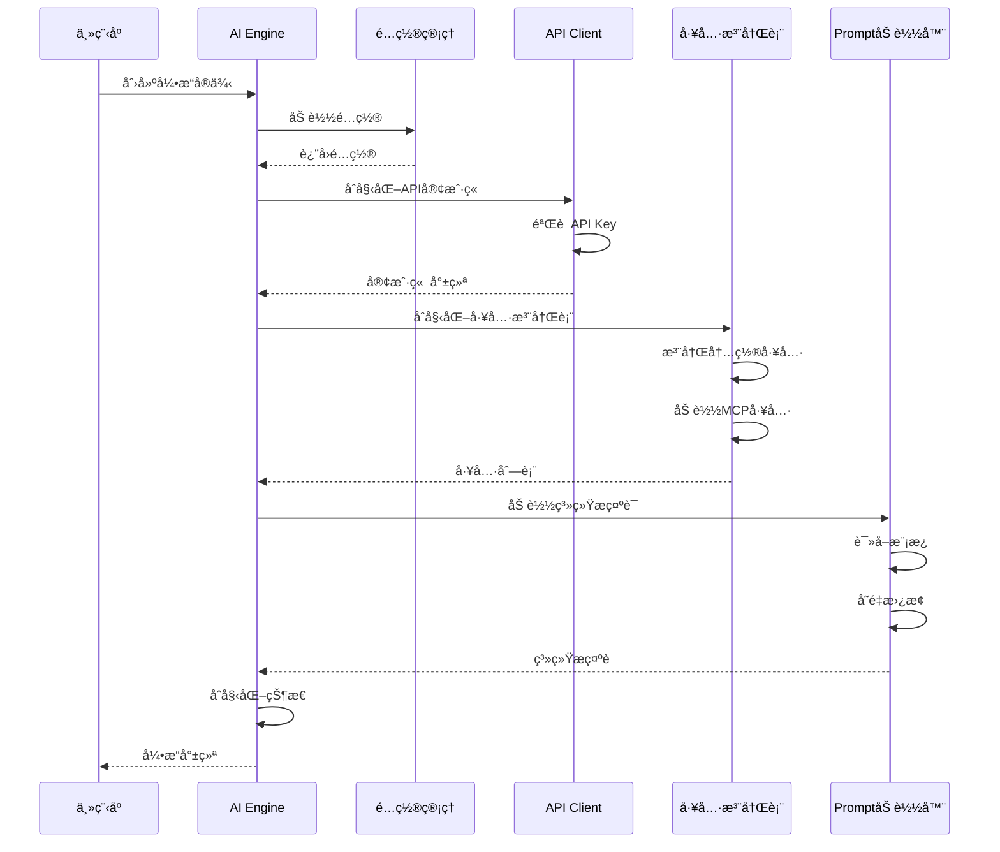
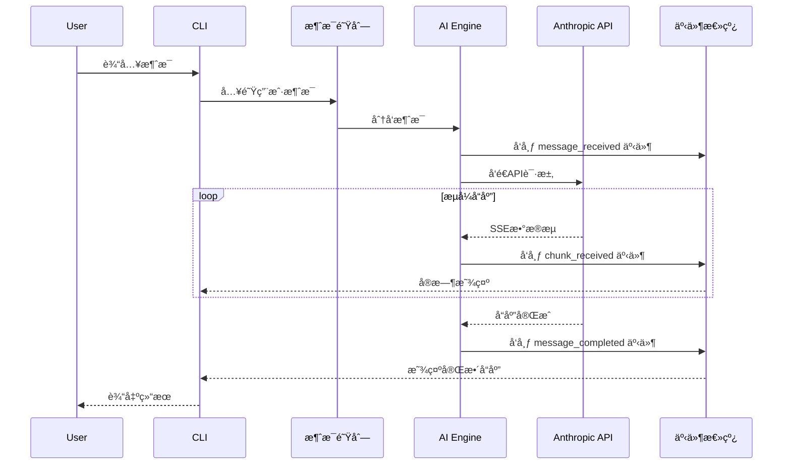
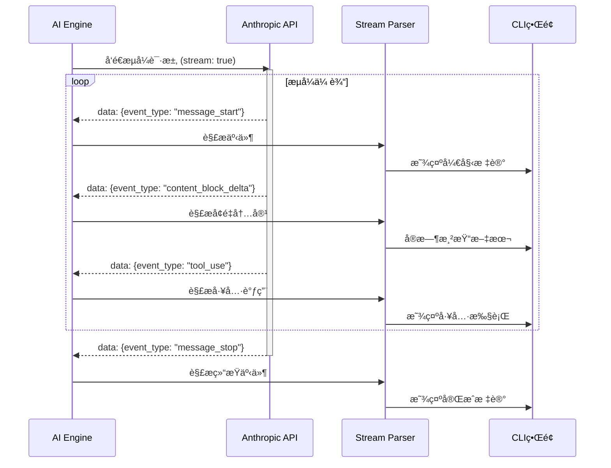
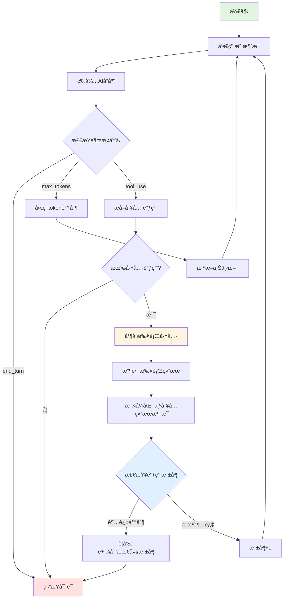

# 核心引æ“å®ç°

## 引言

AI 引æ“是 Claude Code çš„"大脑"，负责ç†è§£ç”¨æˆ·æ„图ã€åšå‡ºå†³ç­–ã€è°ƒç”¨å·¥å…·ã€ç”Ÿæˆå“应。本文将深入剖æ AI 引æ“çš„å®ç°åŸç†ï¼ŒåŒ…括åˆå§‹åŒ–æµç¨‹ã€Prompt 工程ã€æ¶ˆæ¯å¤„ç†ã€æµå¼å“应和错误æ¢å¤ç­‰æ ¸å¿ƒæŠ€æœ¯ã€‚

### 为什么è¦ç†è§£ AI 引æ“？

1. **优化交互体验**：ç†è§£å¼•æ“工作åŸç†ï¼Œèƒ½æ›´å¥½åœ°ä¸ AI 沟通
2. **定制化开å‘**：为开å‘自己的 AI 应用打基础
3. **问题诊断**：快速定ä½å’Œè§£å†³ä½¿ç”¨ä¸­çš„问题
4. **性能优化**：了解性能瓶颈，åšé’ˆå¯¹æ€§ä¼˜åŒ–

### ä¸ä¼ ç»Ÿç¼–程的区别

**传统编程**：
```
输入 → 确定性逻辑 → 输出
```

**AI 驱动编程**：
```
输入 → AIæ¨ç†ï¼ˆæ¦‚ç‡æ€§ï¼‰â†’ 工具调用 → 结æœæ•´åˆ → 输出
```

关键差异：
- ⌠ä¸æ˜¯å®Œå…¨ç¡®å®šæ€§çš„
- ✅ 能够ç†è§£è‡ªç„¶è¯­è¨€
- ✅ 具有上下文感知能力
- ✅ å¯ä»¥è‡ªä¸»å†³ç­–和调用工具

## 一ã€AI 引æ“整体æ¶æ„

### 1.1 核心组件


### 1.2 组件èŒè´£

| 组件 | èŒè´£ | 关键功能 |
|------|------|---------|
| **Engine Core** | 引æ“核心å调器 | 生命周期管ç†ã€æµç¨‹ç¼–æ’ |
| **Message Manager** | 消æ¯ç®¡ç† | 消æ¯æ ¼å¼åŒ–ã€å†å²ç®¡ç† |
| **API Client** | API通信 | HTTP请求ã€è®¤è¯ã€é‡è¯• |
| **Stream Processor** | æµå¼å¤„ç† | SSE解æã€å¢é‡è¾“出 |
| **Tool Handler** | å·¥å…·å¤„ç† | 工具调用ã€ç»“æœæ”¶é›† |
| **Response Parser** | å“应解æ | 内容æå–ã€æ ¼å¼è½¬æ¢ |
| **Error Handler** | é”™è¯¯å¤„ç† | 异常æ•è·ã€æ¢å¤ç­–ç•¥ |


## 二ã€åˆå§‹åŒ–æµç¨‹

### 2.1 åˆå§‹åŒ–æµç¨‹å›¾



### 2.2 åˆå§‹åŒ–代ç å®ç°

```typescript
import Anthropic from '@anthropic-ai/sdk';
import { ToolRegistry } from './tools/registry';
import { ContextManager } from './context/manager';
import { SessionStore } from './session/store';

/**
 * AI 引æ“é…ç½®æ¥å£
 */
interface AIEngineConfig {
  apiKey: string;                    // Anthropic API Key
  model?: string;                    // 模å‹å称
  maxTokens?: number;                // 最大token数
  temperature?: number;              // 温度å‚æ•°
  systemPromptPath?: string;         // 系统æ示è¯è·¯å¾„
  enableStreaming?: boolean;         // 是å¦å¯ç”¨æµå¼å“应
  enableToolCalling?: boolean;       // 是å¦å¯ç”¨å·¥å…·è°ƒç”¨
  maxToolCallDepth?: number;         // 工具调用最大深度
}

/**
 * AI 引æ“核心类
 */
class AIEngine {
  private client: Anthropic;
  private config: AIEngineConfig;
  private toolRegistry: ToolRegistry;
  private contextManager: ContextManager;
  private sessionStore: SessionStore;
  private systemPrompt: string;
  private isInitialized: boolean = false;

  constructor(config: AIEngineConfig) {
    this.config = this.normalizeConfig(config);
    this.validateConfig();
  }

  /**
   * åˆå§‹åŒ–引æ“
   */
  async initialize(): Promise<void> {
    console.log('🚀 åˆå§‹åŒ– AI 引æ“...');

    try {
      // 1. åˆå§‹åŒ– API 客户端
      await this.initializeAPIClient();

      // 2. åˆå§‹åŒ–工具注册表
      await this.initializeTools();

      // 3. 加载系统æ示è¯
      await this.loadSystemPrompt();

      // 4. åˆå§‹åŒ–上下文管ç†å™¨
      this.contextManager = new ContextManager({
        maxTokens: this.config.maxTokens || 100000
      });

      // 5. åˆå§‹åŒ–会è¯å­˜å‚¨
      this.sessionStore = new SessionStore();

      this.isInitialized = true;
      console.log('✅ AI 引æ“åˆå§‹åŒ–完æˆ');
    } catch (error) {
      console.error('⌠AI 引æ“åˆå§‹åŒ–失败:', error);
      throw new Error(`Engine initialization failed: ${error.message}`);
    }
  }

  /**
   * åˆå§‹åŒ– API 客户端
   */
  private async initializeAPIClient(): Promise<void> {
    console.log('  📡 åˆå§‹åŒ– API 客户端...');

    this.client = new Anthropic({
      apiKey: this.config.apiKey,
      // å¯é€‰ï¼šè‡ªå®šä¹‰è¶…æ—¶ã€é‡è¯•ç­‰
      timeout: 60000,
      maxRetries: 3
    });

    // éªŒè¯ API Key（å‘é€ä¸€ä¸ªç®€å•è¯·æ±‚）
    try {
      await this.client.messages.create({
        model: this.config.model!,
        max_tokens: 10,
        messages: [{ role: 'user', content: 'test' }]
      });
      console.log('  ✅ API 客户端就绪');
    } catch (error) {
      throw new Error(`API Key validation failed: ${error.message}`);
    }
  }

  /**
   * åˆå§‹åŒ–工具注册表
   */
  private async initializeTools(): Promise<void> {
    console.log('  🔧 åˆå§‹åŒ–工具注册表...');

    this.toolRegistry = new ToolRegistry();

    // 注册内置工具
    await this.toolRegistry.registerBuiltinTools();

    // 加载 MCP 工具
    await this.toolRegistry.loadMCPTools();

    const toolCount = this.toolRegistry.getToolCount();
    console.log(`  ✅ 已加载 ${toolCount} 个工具`);
  }

  /**
   * 加载系统æ示è¯
   */
  private async loadSystemPrompt(): Promise<void> {
    console.log('  📠加载系统æ示è¯...');

    const promptLoader = new SystemPromptLoader();
    this.systemPrompt = await promptLoader.load(
      this.config.systemPromptPath || './prompts/system.md'
    );

    // å˜é‡æ›¿æ¢
    this.systemPrompt = this.replaceVariables(this.systemPrompt, {
      currentDate: new Date().toISOString().split('T')[0],
      platform: process.platform,
      workingDirectory: process.cwd()
    });

    console.log('  ✅ 系统æ示è¯åŠ è½½å®Œæˆ');
  }

  /**
   * é…置标准化
   */
  private normalizeConfig(config: AIEngineConfig): AIEngineConfig {
    return {
      model: 'claude-3-5-sonnet-20250929',
      maxTokens: 8000,
      temperature: 0,
      enableStreaming: true,
      enableToolCalling: true,
      maxToolCallDepth: 5,
      ...config
    };
  }

  /**
   * é…置验è¯
   */
  private validateConfig(): void {
    if (!this.config.apiKey) {
      throw new Error('API Key is required');
    }

    if (this.config.maxTokens! < 1 || this.config.maxTokens! > 200000) {
      throw new Error('maxTokens must be between 1 and 200000');
    }

    if (this.config.temperature! < 0 || this.config.temperature! > 1) {
      throw new Error('temperature must be between 0 and 1');
    }
  }

  /**
   * å˜é‡æ›¿æ¢
   */
  private replaceVariables(
    template: string,
    variables: Record<string, string>
  ): string {
    let result = template;
    for (const [key, value] of Object.entries(variables)) {
      result = result.replace(new RegExp(`{{${key}}}`, 'g'), value);
    }
    return result;
  }

  /**
   * 检查是å¦å·²åˆå§‹åŒ–
   */
  private ensureInitialized(): void {
    if (!this.isInitialized) {
      throw new Error('Engine not initialized. Call initialize() first.');
    }
  }
}

export { AIEngine, AIEngineConfig };
```


## 三ã€Prompt 工程详解

### 3.1 系统æ示è¯çš„作用

系统æ示è¯ï¼ˆSystem Prompt）是 AI 引æ“çš„"æ“作手册"，定义了：
- ✅ AI 的角色和能力
- ✅ 行为准则和é™åˆ¶
- ✅ 工具使用指å—
- ✅ 输出格å¼è¦æ±‚

### 3.2 Claude Code 系统æ示è¯ç»“æ„

```markdown
# System Prompt 结æ„

## 1. 角色定义（Role Definition）
你是 Claude Code，Anthropic 的官方 CLI 代ç ç¼–辑器...

## 2. 能力说æ˜ï¼ˆCapabilities）
ä½ å¯ä»¥è®¿é—®ä»¥ä¸‹å·¥å…·ï¼š
- Read: 读å–文件
- Write: 写入文件
- Edit: 编辑文件
- Bash: 执行命令
...

## 3. 行为准则（Guidelines）
- 在执行破å性æ“作å‰å¿…须询问用户
- æ供清晰的解释和ç†ç”±
- éµå¾ªç¼–程最佳å®è·µ
...

## 4. 工具使用示例（Tool Usage Examples）
### 示例 1：读å–文件
用户："帮我看看 README.md 的内容"
ä½ çš„æ€è€ƒï¼šéœ€è¦ä½¿ç”¨ Read 工具
工具调用：Read(file_path="/path/to/README.md")
...

## 5. 输出格å¼ï¼ˆOutput Format）
- 使用 Markdown æ ¼å¼
- 代ç å—指定语言
- 文件引用使用 file_path:line_number æ ¼å¼
...

## 6. ç¯å¢ƒä¿¡æ¯ï¼ˆEnvironment）
- 当å‰æ—¥æœŸï¼š{{currentDate}}
- æ“作系统：{{platform}}
- 工作目录：{{workingDirectory}}
...
```

### 3.3 动æ€æ示è¯ç”Ÿæˆ

```typescript
/**
 * 系统æ示è¯åŠ è½½å™¨
 */
class SystemPromptLoader {
  /**
   * 加载系统æ示è¯
   */
  async load(promptPath: string): Promise<string> {
    // 1. 读å–基础模æ¿
    const template = await fs.readFile(promptPath, 'utf-8');

    // 2. 添加工具文档
    const toolDocs = await this.generateToolDocumentation();

    // 3. 添加项目特定信æ¯
    const projectInfo = await this.getProjectInfo();

    // 4. 组åˆ
    return this.combinePrompt(template, toolDocs, projectInfo);
  }

  /**
   * 生æˆå·¥å…·æ–‡æ¡£
   */
  private async generateToolDocumentation(): Promise<string> {
    const tools = toolRegistry.getAllTools();

    let docs = '\n## Available Tools\n\n';

    for (const tool of tools) {
      docs += `### ${tool.name}\n`;
      docs += `${tool.description}\n\n`;
      docs += `**Parameters:**\n`;

      for (const [name, schema] of Object.entries(tool.input_schema.properties)) {
        const required = tool.input_schema.required?.includes(name) ? '(required)' : '(optional)';
        docs += `- \`${name}\` ${required}: ${schema.description}\n`;
      }

      docs += '\n';
    }

    return docs;
  }

  /**
   * è·å–项目信æ¯
   */
  private async getProjectInfo(): Promise<string> {
    let info = '\n## Project Context\n\n';

    // Git ä¿¡æ¯
    try {
      const branch = await execCommand('git rev-parse --abbrev-ref HEAD');
      info += `- Current branch: ${branch}\n`;
    } catch {
      info += '- Not a git repository\n';
    }

    // package.json
    try {
      const pkg = await fs.readJSON('./package.json');
      info += `- Project: ${pkg.name}\n`;
      info += `- Version: ${pkg.version}\n`;
    } catch {
      // 忽略
    }

    return info;
  }

  /**
   * 组åˆæ示è¯
   */
  private combinePrompt(
    template: string,
    toolDocs: string,
    projectInfo: string
  ): string {
    // 在模æ¿ä¸­æ’入动æ€å†…容
    return template
      .replace('{{TOOL_DOCS}}', toolDocs)
      .replace('{{PROJECT_INFO}}', projectInfo);
  }
}
```

### 3.4 Few-Shot 示例设计

Few-shot 示例能显著æå‡ AI 的表ç°ã€‚

**示例选择åŸåˆ™**：
1. **覆盖常è§åœºæ™¯**：文件æ“作ã€ä»£ç æœç´¢ã€è°ƒè¯•ç­‰
2. **展示最佳å®è·µ**：如何正确使用工具
3. **包å«è¾¹ç•Œæƒ…况**：错误处ç†ã€æƒé™é—®é¢˜ç­‰
4. **简æ´æ˜äº†**：æ¯ä¸ªç¤ºä¾‹3-5轮对è¯

**Few-Shot 示例模æ¿**：
```markdown
## Example: 文件读å–和分æ

User: "帮我分æ一下 src/index.ts 的代ç ç»“æ„"

Assistant: "好的,我æ¥å¸®ä½ åˆ†æ src/index.ts 的代ç ç»“æ„。"

<tool_call>
{
  "name": "Read",
  "parameters": {
    "file_path": "/project/src/index.ts"
  }
}
</tool_call>

<tool_result>
// src/index.ts
import express from 'express';
import { router } from './routes';

const app = express();
app.use(express.json());
app.use('/api', router);

app.listen(3000, () => {
  console.log('Server running on port 3000');
});
</tool_result>

Assistant: "我已ç»è¯»å–了 src/index.ts 文件。这是一个简å•çš„ExpressæœåŠ¡å™¨é…置文件:

**代ç ç»“æ„分æ**:

1. **导入模å—** (第1-2è¡Œ):
   - 导入Express框æ¶
   - 导入本地路由模å—

2. **应用é…ç½®** (第4-6è¡Œ):
   - 创建Express应用å®ä¾‹
   - 添加JSON中间件
   - 将路由挂载到/api路径

3. **æœåŠ¡å™¨å¯åŠ¨** (第8-10è¡Œ):
   - 监å¬3000端å£
   - 输出å¯åŠ¨æ—¥å¿—

**建议**:
- å¯ä»¥è€ƒè™‘将端å£å·æå–为ç¯å¢ƒå˜é‡
- 添加错误处ç†ä¸­é—´ä»¶
- 考虑添加CORSé…ç½®"
```

**示例2：批é‡å·¥å…·è°ƒç”¨**:
```markdown
## Example: 批é‡æ–‡ä»¶æ“作

User: "帮我把tests目录下所有.spec.ts文件改æˆ.test.ts"

Assistant: "好的,我需è¦å…ˆæ‰¾åˆ°æ‰€æœ‰.spec.ts文件,然åé€ä¸ªé‡å‘½å。"

<tool_call>
{
  "name": "Glob",
  "parameters": {
    "pattern": "tests/**/*.spec.ts"
  }
}
</tool_call>

<tool_result>
tests/unit/user.spec.ts
tests/unit/auth.spec.ts
tests/integration/api.spec.ts
</tool_result>

Assistant: "找到了3个.spec.ts文件。ç°åœ¨æˆ‘å°†é€ä¸ªé‡å‘½å:"

<tool_call>
{
  "name": "Bash",
  "parameters": {
    "command": "mv tests/unit/user.spec.ts tests/unit/user.test.ts && mv tests/unit/auth.spec.ts tests/unit/auth.test.ts && mv tests/integration/api.spec.ts tests/integration/api.test.ts"
  }
}
</tool_call>

<tool_result>
[命令执行æˆåŠŸ]
</tool_result>

Assistant: "✅ 已完æˆé‡å‘½å:
- tests/unit/user.spec.ts → user.test.ts
- tests/unit/auth.spec.ts → auth.test.ts  
- tests/integration/api.spec.ts → api.test.ts

所有测试文件已更新为.test.ts扩展å。"
```


## å››ã€æ¶ˆæ¯é˜Ÿåˆ—和事件驱动æ¶æ„

### 4.1 消æ¯æµè½¬æµç¨‹

Claude Code 使用事件驱动æ¶æ„处ç†ç”¨æˆ·è¾“入和AIå“应。



### 4.2 消æ¯é˜Ÿåˆ—å®ç°

```typescript
import { EventEmitter } from 'events';

/**
 * 消æ¯ç±»å‹å®šä¹‰
 */
interface Message {
  id: string;                  // 消æ¯å”¯ä¸€ID
  role: 'user' | 'assistant'; // 角色
  content: string | Content[]; // 内容
  timestamp: number;           // 时间戳
  metadata?: Record<string, any>; // 元数æ®
}

/**
 * 消æ¯é˜Ÿåˆ—
 */
class MessageQueue extends EventEmitter {
  private queue: Message[] = [];
  private processing: boolean = false;
  private maxSize: number;

  constructor(maxSize: number = 1000) {
    super();
    this.maxSize = maxSize;
  }

  /**
   * 添加消æ¯åˆ°é˜Ÿåˆ—
   */
  enqueue(message: Message): void {
    // 检查队列大å°
    if (this.queue.length >= this.maxSize) {
      this.emit('queue_full', this.queue.length);
      // 移除最旧的消æ¯
      this.queue.shift();
    }

    // 添加消æ¯
    this.queue.push(message);
    this.emit('message_enqueued', message);

    // 触å‘处ç†
    this.processNext();
  }

  /**
   * 处ç†ä¸‹ä¸€æ¡æ¶ˆæ¯
   */
  private async processNext(): Promise<void> {
    // 如æœæ­£åœ¨å¤„ç†æˆ–队列为空,ç›´æ¥è¿”å›
    if (this.processing || this.queue.length === 0) {
      return;
    }

    this.processing = true;
    const message = this.queue[0]; // 查看但ä¸ç§»é™¤

    try {
      // å‘布消æ¯å¤„ç†äº‹ä»¶
      this.emit('message_processing', message);

      // 等待处ç†å®Œæˆ
      await this.processMessage(message);

      // 处ç†æˆåŠŸ,移除消æ¯
      this.queue.shift();
      this.emit('message_processed', message);
    } catch (error) {
      this.emit('message_error', { message, error });
      // 错误处ç†ç­–ç•¥
      this.handleError(message, error);
    } finally {
      this.processing = false;
      // 继续处ç†ä¸‹ä¸€æ¡
      setImmediate(() => this.processNext());
    }
  }

  /**
   * 处ç†å•æ¡æ¶ˆæ¯
   */
  private async processMessage(message: Message): Promise<void> {
    return new Promise((resolve, reject) => {
      // 由外部处ç†å™¨å¤„ç†
      this.emit('message_ready', message, (error?: Error) => {
        if (error) {
          reject(error);
        } else {
          resolve();
        }
      });
    });
  }

  /**
   * 错误处ç†
   */
  private handleError(message: Message, error: Error): void {
    console.error(`消æ¯å¤„ç†å¤±è´¥ [${message.id}]:`, error);
    
    // å¯ä»¥å®ç°é‡è¯•é€»è¾‘
    const retryCount = message.metadata?.retryCount || 0;
    if (retryCount < 3) {
      // é‡æ–°å…¥é˜Ÿ
      message.metadata = {
        ...message.metadata,
        retryCount: retryCount + 1
      };
      this.queue.shift(); // 移除当å‰
      this.queue.unshift(message); // é‡æ–°æ·»åŠ åˆ°é˜Ÿé¦–
    } else {
      // 超过é‡è¯•æ¬¡æ•°,移除消æ¯
      this.queue.shift();
      this.emit('message_failed', { message, error });
    }
  }

  /**
   * è·å–队列状æ€
   */
  getStatus(): { size: number; processing: boolean } {
    return {
      size: this.queue.length,
      processing: this.processing
    };
  }

  /**
   * 清空队列
   */
  clear(): void {
    this.queue = [];
    this.emit('queue_cleared');
  }
}

export { MessageQueue, Message };
```

### 4.3 事件总线å®ç°

```typescript
/**
 * 事件总线 - 用äºè§£è€¦ç»„件通信
 */
class EventBus {
  private static instance: EventBus;
  private emitter: EventEmitter;
  private listeners: Map<string, number>;

  private constructor() {
    this.emitter = new EventEmitter();
    this.listeners = new Map();
    // å¢åŠ æœ€å¤§ç›‘å¬å™¨æ•°é‡
    this.emitter.setMaxListeners(100);
  }

  /**
   * è·å–å•ä¾‹å®ä¾‹
   */
  static getInstance(): EventBus {
    if (\!EventBus.instance) {
      EventBus.instance = new EventBus();
    }
    return EventBus.instance;
  }

  /**
   * 订阅事件
   */
  on(event: string, handler: (...args: any[]) => void): void {
    this.emitter.on(event, handler);
    
    // 记录监å¬å™¨æ•°é‡
    const count = this.listeners.get(event) || 0;
    this.listeners.set(event, count + 1);
  }

  /**
   * 订阅一次性事件
   */
  once(event: string, handler: (...args: any[]) => void): void {
    this.emitter.once(event, handler);
  }

  /**
   * å‘布事件
   */
  emit(event: string, ...args: any[]): boolean {
    return this.emitter.emit(event, ...args);
  }

  /**
   * å–消订阅
   */
  off(event: string, handler: (...args: any[]) => void): void {
    this.emitter.off(event, handler);
    
    // 更新监å¬å™¨æ•°é‡
    const count = this.listeners.get(event) || 0;
    if (count > 0) {
      this.listeners.set(event, count - 1);
    }
  }

  /**
   * 移除所有监å¬å™¨
   */
  removeAllListeners(event?: string): void {
    if (event) {
      this.emitter.removeAllListeners(event);
      this.listeners.delete(event);
    } else {
      this.emitter.removeAllListeners();
      this.listeners.clear();
    }
  }

  /**
   * è·å–事件统计
   */
  getStats(): Record<string, number> {
    const stats: Record<string, number> = {};
    this.listeners.forEach((count, event) => {
      stats[event] = count;
    });
    return stats;
  }
}

// 导出å•ä¾‹
export default EventBus.getInstance();
```

### 4.4 事件类å‹å®šä¹‰

```typescript
/**
 * 系统事件类å‹
 */
enum SystemEvent {
  // 引æ“生命周期
  ENGINE_INITIALIZED = 'engine:initialized',
  ENGINE_SHUTDOWN = 'engine:shutdown',
  
  // 消æ¯äº‹ä»¶
  MESSAGE_RECEIVED = 'message:received',
  MESSAGE_PROCESSING = 'message:processing',
  MESSAGE_COMPLETED = 'message:completed',
  MESSAGE_ERROR = 'message:error',
  
  // æµå¼å“应事件
  STREAM_START = 'stream:start',
  STREAM_CHUNK = 'stream:chunk',
  STREAM_END = 'stream:end',
  STREAM_ERROR = 'stream:error',
  
  // 工具调用事件
  TOOL_CALL_START = 'tool:call:start',
  TOOL_CALL_COMPLETE = 'tool:call:complete',
  TOOL_CALL_ERROR = 'tool:call:error',
  
  // 上下文事件
  CONTEXT_UPDATED = 'context:updated',
  CONTEXT_CLEARED = 'context:cleared',
}

export { SystemEvent };
```


## 五ã€æµå¼å“应处ç†

### 5.1 SSE (Server-Sent Events) åŸç†

Anthropic API 使用 SSE åè®®å®ç°æµå¼å“应,这让 Claude Code 能够å®æ—¶æ˜¾ç¤ºAIçš„æ€è€ƒè¿‡ç¨‹ã€‚



### 5.2 æµå¼å¤„ç†å™¨å®ç°

```typescript
import { Anthropic } from '@anthropic-ai/sdk';

/**
 * SSE事件类å‹
 */
enum SSEEventType {
  MESSAGE_START = 'message_start',
  CONTENT_BLOCK_START = 'content_block_start',
  CONTENT_BLOCK_DELTA = 'content_block_delta',
  CONTENT_BLOCK_STOP = 'content_block_stop',
  MESSAGE_DELTA = 'message_delta',
  MESSAGE_STOP = 'message_stop',
  PING = 'ping',
  ERROR = 'error'
}

/**
 * æµå¼å“应处ç†å™¨
 */
class StreamProcessor {
  private buffer: string = '';
  private currentBlock: any = null;
  private messageId: string = '';

  /**
   * 处ç†æµå¼å“应
   */
  async processStream(
    stream: AsyncIterable<Anthropic.MessageStreamEvent>,
    onChunk: (chunk: ProcessedChunk) => void,
    onComplete: (message: any) => void,
    onError: (error: Error) => void
  ): Promise<void> {
    try {
      for await (const event of stream) {
        const processed = this.processEvent(event);

        if (processed) {
          onChunk(processed);
        }

        // 检查是å¦å®Œæˆ
        if (event.type === 'message_stop') {
          onComplete(this.buildCompleteMessage());
        }
      }
    } catch (error) {
      onError(error as Error);
    }
  }

  /**
   * 处ç†å•ä¸ªSSE事件
   */
  private processEvent(event: Anthropic.MessageStreamEvent): ProcessedChunk | null {
    switch (event.type) {
      case 'message_start':
        return this.handleMessageStart(event);

      case 'content_block_start':
        return this.handleContentBlockStart(event);

      case 'content_block_delta':
        return this.handleContentBlockDelta(event);

      case 'content_block_stop':
        return this.handleContentBlockStop(event);

      case 'message_delta':
        return this.handleMessageDelta(event);

      default:
        return null;
    }
  }

  /**
   * 处ç†æ¶ˆæ¯å¼€å§‹
   */
  private handleMessageStart(event: any): ProcessedChunk {
    this.messageId = event.message.id;

    return {
      type: 'message_start',
      messageId: this.messageId,
      model: event.message.model,
      role: event.message.role
    };
  }

  /**
   * 处ç†å†…容å—开始
   */
  private handleContentBlockStart(event: any): ProcessedChunk {
    const block = event.content_block;
    this.currentBlock = block;

    if (block.type === 'text') {
      return {
        type: 'text_start',
        index: event.index
      };
    } else if (block.type === 'tool_use') {
      return {
        type: 'tool_start',
        toolName: block.name,
        toolId: block.id,
        index: event.index
      };
    }

    return null;
  }

  /**
   * 处ç†å†…容å—å¢é‡
   */
  private handleContentBlockDelta(event: any): ProcessedChunk {
    const delta = event.delta;

    if (delta.type === 'text_delta') {
      // 文本å¢é‡
      this.buffer += delta.text;

      return {
        type: 'text_delta',
        text: delta.text,
        index: event.index
      };
    } else if (delta.type === 'input_json_delta') {
      // 工具输入JSONå¢é‡
      return {
        type: 'tool_input_delta',
        partialJson: delta.partial_json,
        index: event.index
      };
    }

    return null;
  }

  /**
   * 处ç†å†…容å—åœæ­¢
   */
  private handleContentBlockStop(event: any): ProcessedChunk {
    const result: ProcessedChunk = {
      type: 'block_stop',
      index: event.index
    };

    // 如æœæ˜¯æ–‡æœ¬å—,附加完整文本
    if (this.currentBlock?.type === 'text') {
      result.completeText = this.buffer;
      this.buffer = '';
    }

    this.currentBlock = null;
    return result;
  }

  /**
   * 处ç†æ¶ˆæ¯å¢é‡ï¼ˆusage等）
   */
  private handleMessageDelta(event: any): ProcessedChunk | null {
    if (event.delta.stop_reason) {
      return {
        type: 'stop_reason',
        reason: event.delta.stop_reason,
        usage: event.usage
      };
    }
    return null;
  }

  /**
   * æ„建完整消æ¯
   */
  private buildCompleteMessage(): any {
    return {
      id: this.messageId,
      // ... 其他消æ¯å­—段
    };
  }
}

/**
 * 处ç†åçš„æ•°æ®å—
 */
interface ProcessedChunk {
  type: string;
  [key: string]: any;
}

export { StreamProcessor, SSEEventType, ProcessedChunk };
```

### 5.3 å¢é‡è§£æ器

```typescript
/**
 * JSONå¢é‡è§£æ器 - 用äºè§£æ工具调用的JSONå‚æ•°
 */
class IncrementalJSONParser {
  private buffer: string = '';
  private depth: number = 0;
  private inString: boolean = false;
  private escapeNext: boolean = false;

  /**
   * 添加新的JSON片段
   */
  append(chunk: string): void {
    this.buffer += chunk;
  }

  /**
   * å°è¯•è§£æ当å‰ç¼“冲区
   * @returns 如æœèƒ½è§£æ为完整JSON则返å›å¯¹è±¡,å¦åˆ™è¿”å›null
   */
  tryParse(): any | null {
    try {
      return JSON.parse(this.buffer);
    } catch {
      return null;
    }
  }

  /**
   * 检查当å‰æ˜¯å¦å¯èƒ½æ˜¯å®Œæ•´JSON
   */
  isComplete(): boolean {
    // 简å•çš„完整性检查
    if (!this.buffer.trim()) {
      return false;
    }

    let depth = 0;
    let inString = false;
    let escape = false;

    for (const char of this.buffer) {
      if (escape) {
        escape = false;
        continue;
      }

      if (char === '\\') {
        escape = true;
        continue;
      }

      if (char === '"') {
        inString = !inString;
        continue;
      }

      if (inString) {
        continue;
      }

      if (char === '{' || char === '[') {
        depth++;
      } else if (char === '}' || char === ']') {
        depth--;
      }
    }

    return depth === 0 && !inString;
  }

  /**
   * è·å–部分解æ的结æœï¼ˆç”¨äºæ˜¾ç¤ºï¼‰
   */
  getPartialResult(): Record<string, any> {
    // å°è¯•è§£æ已完整的键值对
    const result: Record<string, any> = {};

    // 使用正则æå–完整的键值对
    const regex = /"(\w+)"\s*:\s*("(?:[^"\\]|\\.)*"|[^,}\]]+)/g;
    let match;

    while ((match = regex.exec(this.buffer)) !== null) {
      const key = match[1];
      let value = match[2].trim();

      // 解æ值
      try {
        if (value.startsWith('"') && value.endsWith('"')) {
          value = JSON.parse(value);
        } else if (value === 'true') {
          value = true;
        } else if (value === 'false') {
          value = false;
        } else if (value === 'null') {
          value = null;
        } else if (!isNaN(Number(value))) {
          value = Number(value);
        }

        result[key] = value;
      } catch {
        // 忽略解æ错误
      }
    }

    return result;
  }

  /**
   * é‡ç½®è§£æ器
   */
  reset(): void {
    this.buffer = '';
    this.depth = 0;
    this.inString = false;
    this.escapeNext = false;
  }
}

export { IncrementalJSONParser };
```

### 5.4 æµå¼æ¸²æŸ“示例

```typescript
import EventBus from './event-bus';
import { SystemEvent } from './events';
import { StreamProcessor } from './stream-processor';

/**
 * æµå¼å“应管ç†å™¨
 */
class StreamingResponseManager {
  private streamProcessor: StreamProcessor;
  private currentToolCall: { name: string; input: string } | null = null;

  constructor() {
    this.streamProcessor = new StreamProcessor();
    this.setupEventHandlers();
  }

  /**
   * 开始处ç†æµå¼å“应
   */
  async handleStreamingResponse(
    stream: AsyncIterable<any>
  ): Promise<void> {
    await this.streamProcessor.processStream(
      stream,
      (chunk) => this.onChunk(chunk),
      (message) => this.onComplete(message),
      (error) => this.onError(error)
    );
  }

  /**
   * 处ç†æ•°æ®å—
   */
  private onChunk(chunk: any): void {
    switch (chunk.type) {
      case 'message_start':
        console.log(`\n[AI开始å“应 - ${chunk.model}]`);
        EventBus.emit(SystemEvent.STREAM_START, chunk);
        break;

      case 'text_delta':
        // å®æ—¶è¾“出文本
        process.stdout.write(chunk.text);
        EventBus.emit(SystemEvent.STREAM_CHUNK, chunk);
        break;

      case 'tool_start':
        console.log(`\n🔧 调用工具: ${chunk.toolName}`);
        this.currentToolCall = {
          name: chunk.toolName,
          input: ''
        };
        break;

      case 'tool_input_delta':
        // 累积工具输入
        if (this.currentToolCall) {
          this.currentToolCall.input += chunk.partialJson;
        }
        break;

      case 'block_stop':
        if (this.currentToolCall) {
          try {
            const input = JSON.parse(this.currentToolCall.input);
            console.log('  å‚æ•°:', JSON.stringify(input, null, 2));

            EventBus.emit(SystemEvent.TOOL_CALL_START, {
              name: this.currentToolCall.name,
              input
            });
          } catch {
            console.log('  å‚数解æ中...');
          }
          this.currentToolCall = null;
        }
        break;

      case 'stop_reason':
        console.log(`\n[åœæ­¢åŸå› : ${chunk.reason}]`);
        if (chunk.usage) {
          console.log(`[Token使用: 输入=${chunk.usage.input_tokens}, 输出=${chunk.usage.output_tokens}]`);
        }
        break;
    }
  }

  /**
   * å“应完æˆ
   */
  private onComplete(message: any): void {
    console.log('\n[AIå“应完æˆ]\n');
    EventBus.emit(SystemEvent.STREAM_END, message);
  }

  /**
   * 错误处ç†
   */
  private onError(error: Error): void {
    console.error('\n⌠æµå¼å“应错误:', error.message);
    EventBus.emit(SystemEvent.STREAM_ERROR, error);
  }

  /**
   * 设置事件处ç†å™¨
   */
  private setupEventHandlers(): void {
    EventBus.on(SystemEvent.TOOL_CALL_COMPLETE, (result) => {
      console.log('✅ 工具执行完æˆ');
    });

    EventBus.on(SystemEvent.TOOL_CALL_ERROR, (error) => {
      console.error('⌠工具执行失败:', error.message);
    });
  }
}

export { StreamingResponseManager };
```


## å…­ã€å·¥å…·è°ƒç”¨å¾ªç¯

### 6.1 工具调用æµç¨‹



### 6.2 工具调用循ç¯å®ç°

```typescript
/**
 * 工具调用循ç¯ç®¡ç†å™¨
 */
class ToolCallLoop {
  private client: Anthropic;
  private toolRegistry: ToolRegistry;
  private maxDepth: number;
  private currentDepth: number = 0;

  constructor(
    client: Anthropic,
    toolRegistry: ToolRegistry,
    maxDepth: number = 5
  ) {
    this.client = client;
    this.toolRegistry = toolRegistry;
    this.maxDepth = maxDepth;
  }

  /**
   * 执行对è¯å¾ªç¯ï¼ˆå¸¦å·¥å…·è°ƒç”¨ï¼‰
   */
  async executeConversation(
    messages: Anthropic.MessageParam[],
    systemPrompt: string
  ): Promise<Anthropic.Message> {
    let currentMessages = [...messages];
    this.currentDepth = 0;

    while (this.currentDepth < this.maxDepth) {
      console.log(`\n=== 循ç¯è½®æ¬¡ ${this.currentDepth + 1} ===`);

      // 1. 调用API
      const response = await this.client.messages.create({
        model: 'claude-3-5-sonnet-20250929',
        max_tokens: 8000,
        system: systemPrompt,
        messages: currentMessages,
        tools: this.toolRegistry.getToolDefinitions(),
        stream: true
      });

      // 2. 处ç†æµå¼å“应
      const message = await this.processStreamResponse(response);

      // 3. 添加AIå“应到消æ¯å†å²
      currentMessages.push({
        role: 'assistant',
        content: message.content
      });

      // 4. 检查åœæ­¢åŸå› 
      if (message.stop_reason === 'end_turn') {
        console.log('✅ 对è¯æ­£å¸¸ç»“æŸ');
        return message;
      }

      if (message.stop_reason === 'max_tokens') {
        console.log('âš ï¸  达到tokené™åˆ¶,å°è¯•æˆªæ–­ä¸Šä¸‹æ–‡');
        currentMessages = this.truncateContext(currentMessages);
        continue;
      }

      if (message.stop_reason === 'tool_use') {
        console.log('🔧 检测到工具调用');

        // 5. æå–并执行工具
        const toolCalls = this.extractToolCalls(message.content);
        if (toolCalls.length === 0) {
          console.log('âš ï¸  未找到工具调用,结æŸå¾ªç¯');
          return message;
        }

        // 6. 并å‘执行工具
        const toolResults = await this.executeTools(toolCalls);

        // 7. 添加工具结æœåˆ°æ¶ˆæ¯å†å²
        currentMessages.push({
          role: 'user',
          content: toolResults
        });

        // 8. å¢åŠ æ·±åº¦è®¡æ•°
        this.currentDepth++;
      } else {
        // 未知åœæ­¢åŸå› 
        console.log(`âš ï¸  未知åœæ­¢åŸå› : ${message.stop_reason}`);
        return message;
      }
    }

    // 达到最大深度
    console.warn(`âš ï¸  达到最大工具调用深度: ${this.maxDepth}`);
    throw new Error(`Maximum tool call depth (${this.maxDepth}) exceeded`);
  }

  /**
   * 处ç†æµå¼å“应
   */
  private async processStreamResponse(
    stream: AsyncIterable<Anthropic.MessageStreamEvent>
  ): Promise<Anthropic.Message> {
    const message: Partial<Anthropic.Message> = {
      id: '',
      model: '',
      role: 'assistant',
      content: [],
      stop_reason: null,
      usage: { input_tokens: 0, output_tokens: 0 }
    };

    for await (const event of stream) {
      switch (event.type) {
        case 'message_start':
          message.id = event.message.id;
          message.model = event.message.model;
          message.role = event.message.role;
          message.usage = event.message.usage;
          break;

        case 'content_block_start':
          message.content!.push(event.content_block);
          break;

        case 'content_block_delta':
          const lastBlock = message.content![message.content!.length - 1];
          if (event.delta.type === 'text_delta') {
            (lastBlock as any).text += event.delta.text;
            process.stdout.write(event.delta.text);
          } else if (event.delta.type === 'input_json_delta') {
            (lastBlock as any).input += event.delta.partial_json;
          }
          break;

        case 'message_delta':
          if (event.delta.stop_reason) {
            message.stop_reason = event.delta.stop_reason;
          }
          if (event.usage) {
            message.usage!.output_tokens = event.usage.output_tokens;
          }
          break;
      }
    }

    return message as Anthropic.Message;
  }

  /**
   * æå–工具调用
   */
  private extractToolCalls(content: any[]): ToolCall[] {
    return content
      .filter(block => block.type === 'tool_use')
      .map(block => ({
        id: block.id,
        name: block.name,
        input: block.input
      }));
  }

  /**
   * 并å‘执行多个工具
   */
  private async executeTools(toolCalls: ToolCall[]): Promise<any[]> {
    console.log(`\n执行 ${toolCalls.length} 个工具调用...`);

    const results = await Promise.allSettled(
      toolCalls.map(async (call) => {
        try {
          console.log(`  • ${call.name}...`);
          const result = await this.toolRegistry.executeTool(
            call.name,
            call.input
          );
          console.log(`    ✅ ${call.name} 完æˆ`);

          return {
            type: 'tool_result',
            tool_use_id: call.id,
            content: JSON.stringify(result)
          };
        } catch (error) {
          console.error(`    ⌠${call.name} 失败:`, error.message);

          return {
            type: 'tool_result',
            tool_use_id: call.id,
            content: `Error: ${error.message}`,
            is_error: true
          };
        }
      })
    );

    // æå–结æœï¼ˆåŒ…括æˆåŠŸå’Œå¤±è´¥çš„）
    return results.map(r =>
      r.status === 'fulfilled' ? r.value : r.reason
    );
  }

  /**
   * 截断上下文（当达到tokené™åˆ¶æ—¶ï¼‰
   */
  private truncateContext(messages: Anthropic.MessageParam[]): Anthropic.MessageParam[] {
    // ä¿ç•™æœ€è¿‘çš„Næ¡æ¶ˆæ¯
    const keepCount = Math.floor(messages.length * 0.7);
    return messages.slice(-keepCount);
  }
}

interface ToolCall {
  id: string;
  name: string;
  input: Record<string, any>;
}

export { ToolCallLoop, ToolCall };
```

### 6.3 完整使用示例

```typescript
/**
 * 完整示例：处ç†ç”¨æˆ·è¯·æ±‚并自动调用工具
 */
async function handleUserRequest(userMessage: string): Promise<void> {
  // 1. åˆå§‹åŒ–
  const engine = new AIEngine({
    apiKey: process.env.ANTHROPIC_API_KEY!
  });
  await engine.initialize();

  // 2. 创建工具调用循ç¯
  const toolLoop = new ToolCallLoop(
    engine.client,
    engine.toolRegistry,
    5 // 最大深度
  );

  // 3. 准备消æ¯
  const messages: Anthropic.MessageParam[] = [
    {
      role: 'user',
      content: userMessage
    }
  ];

  try {
    // 4. 执行对è¯å¾ªç¯
    const finalResponse = await toolLoop.executeConversation(
      messages,
      engine.systemPrompt
    );

    // 5. æå–最终文本å“应
    const textContent = finalResponse.content
      .filter(block => block.type === 'text')
      .map(block => (block as any).text)
      .join('\n');

    console.log('\n\n=== 最终å“应 ===');
    console.log(textContent);

    // 6. 显示统计信æ¯
    console.log('\n=== ç»Ÿè®¡ä¿¡æ¯ ===');
    console.log(`Token使用: 输入=${finalResponse.usage.input_tokens}, 输出=${finalResponse.usage.output_tokens}`);
    console.log(`工具调用深度: ${toolLoop.currentDepth}`);
  } catch (error) {
    console.error('⌠处ç†å¤±è´¥:', error.message);
  }
}

// 使用示例
handleUserRequest('帮我分æ项目中所有TypeScript文件的导入ä¾èµ–关系');
```


## 七ã€é”™è¯¯æ¢å¤æœºåˆ¶

### 7.1 错误类å‹å’Œå¤„ç†ç­–ç•¥

```typescript
/**
 * 错误类å‹æšä¸¾
 */
enum ErrorType {
  // API错误
  API_ERROR = 'api_error',
  AUTH_ERROR = 'auth_error',
  RATE_LIMIT = 'rate_limit',
  NETWORK_ERROR = 'network_error',
  TIMEOUT = 'timeout',

  // 工具错误
  TOOL_NOT_FOUND = 'tool_not_found',
  TOOL_EXECUTION_ERROR = 'tool_execution_error',
  TOOL_TIMEOUT = 'tool_timeout',

  // 上下文错误
  CONTEXT_TOO_LARGE = 'context_too_large',
  INVALID_MESSAGE = 'invalid_message',

  // 系统错误
  INTERNAL_ERROR = 'internal_error',
  OUT_OF_MEMORY = 'out_of_memory'
}

/**
 * 错误æ¢å¤ç­–ç•¥
 */
interface RecoveryStrategy {
  maxRetries: number;      // 最大é‡è¯•æ¬¡æ•°
  retryDelay: number;      // é‡è¯•å»¶è¿Ÿ(ms)
  backoffMultiplier: number; // 退é¿ä¹˜æ•°
  fallback?: () => Promise<any>; // å›é€€æ–¹æ¡ˆ
}

/**
 * 错误处ç†å™¨
 */
class ErrorHandler {
  private retryCount: Map<string, number> = new Map();
  private strategies: Map<ErrorType, RecoveryStrategy> = new Map();

  constructor() {
    this.initializeStrategies();
  }

  /**
   * åˆå§‹åŒ–错误æ¢å¤ç­–ç•¥
   */
  private initializeStrategies(): void {
    // API错误 - é‡è¯•3次
    this.strategies.set(ErrorType.API_ERROR, {
      maxRetries: 3,
      retryDelay: 1000,
      backoffMultiplier: 2
    });

    // 速ç‡é™åˆ¶ - é‡è¯•5次,长延迟
    this.strategies.set(ErrorType.RATE_LIMIT, {
      maxRetries: 5,
      retryDelay: 5000,
      backoffMultiplier: 2
    });

    // 网络错误 - é‡è¯•5次
    this.strategies.set(ErrorType.NETWORK_ERROR, {
      maxRetries: 5,
      retryDelay: 2000,
      backoffMultiplier: 1.5
    });

    // 超时 - é‡è¯•2次
    this.strategies.set(ErrorType.TIMEOUT, {
      maxRetries: 2,
      retryDelay: 3000,
      backoffMultiplier: 1
    });

    // 工具执行错误 - ä¸é‡è¯•,使用å›é€€
    this.strategies.set(ErrorType.TOOL_EXECUTION_ERROR, {
      maxRetries: 0,
      retryDelay: 0,
      backoffMultiplier: 1,
      fallback: async () => {
        return { error: '工具执行失败', success: false };
      }
    });

    // 上下文过大 - ä¸é‡è¯•,ç«‹å³æˆªæ–­
    this.strategies.set(ErrorType.CONTEXT_TOO_LARGE, {
      maxRetries: 0,
      retryDelay: 0,
      backoffMultiplier: 1
    });
  }

  /**
   * 处ç†é”™è¯¯å¹¶å°è¯•æ¢å¤
   */
  async handleError<T>(
    operation: () => Promise<T>,
    errorType: ErrorType,
    operationId: string
  ): Promise<T> {
    const strategy = this.strategies.get(errorType);
    if (!strategy) {
      throw new Error(`No recovery strategy for error type: ${errorType}`);
    }

    let lastError: Error;
    const retryKey = `${errorType}:${operationId}`;
    const currentRetries = this.retryCount.get(retryKey) || 0;

    for (let attempt = 0; attempt <= strategy.maxRetries; attempt++) {
      try {
        const result = await operation();
        // æˆåŠŸ,é‡ç½®é‡è¯•è®¡æ•°
        this.retryCount.delete(retryKey);
        return result;
      } catch (error) {
        lastError = error as Error;

        console.warn(
          `æ“作失败 (å°è¯• ${attempt + 1}/${strategy.maxRetries + 1}):`,
          error.message
        );

        // 检查是å¦è¿˜èƒ½é‡è¯•
        if (attempt < strategy.maxRetries) {
          // 计算延迟（指数退é¿ï¼‰
          const delay = strategy.retryDelay * Math.pow(
            strategy.backoffMultiplier,
            attempt
          );

          console.log(`等待 ${delay}ms åé‡è¯•...`);
          await this.sleep(delay);

          // æ›´æ–°é‡è¯•è®¡æ•°
          this.retryCount.set(retryKey, currentRetries + 1);
        }
      }
    }

    // 所有é‡è¯•éƒ½å¤±è´¥äº†
    console.error(`æ“作最终失败: ${lastError!.message}`);

    // å°è¯•å›é€€æ–¹æ¡ˆ
    if (strategy.fallback) {
      console.log('å°è¯•å›é€€æ–¹æ¡ˆ...');
      try {
        return await strategy.fallback();
      } catch (fallbackError) {
        console.error('å›é€€æ–¹æ¡ˆä¹Ÿå¤±è´¥äº†:', fallbackError);
      }
    }

    // 抛出åŸå§‹é”™è¯¯
    throw lastError!;
  }

  /**
   * 辅助:ç¡çœ å‡½æ•°
   */
  private sleep(ms: number): Promise<void> {
    return new Promise(resolve => setTimeout(resolve, ms));
  }

  /**
   * 分类错误类å‹
   */
  classifyError(error: any): ErrorType {
    const message = error.message?.toLowerCase() || '';
    const status = error.status || error.statusCode;

    // 认è¯é”™è¯¯
    if (status === 401 || message.includes('unauthorized')) {
      return ErrorType.AUTH_ERROR;
    }

    // 速ç‡é™åˆ¶
    if (status === 429 || message.includes('rate limit')) {
      return ErrorType.RATE_LIMIT;
    }

    // 超时
    if (message.includes('timeout') || message.includes('timed out')) {
      return ErrorType.TIMEOUT;
    }

    // 网络错误
    if (message.includes('network') || message.includes('connect')) {
      return ErrorType.NETWORK_ERROR;
    }

    // 上下文过大
    if (message.includes('context') || message.includes('too large')) {
      return ErrorType.CONTEXT_TOO_LARGE;
    }

    // 默认为API错误
    return ErrorType.API_ERROR;
  }

  /**
   * è·å–é‡è¯•ç»Ÿè®¡
   */
  getRetryStats(): Map<string, number> {
    return new Map(this.retryCount);
  }

  /**
   * 清空é‡è¯•è®¡æ•°
   */
  clearRetryStats(): void {
    this.retryCount.clear();
  }
}

export { ErrorHandler, ErrorType, RecoveryStrategy };
```

### 7.2 å®é™…使用示例

```typescript
/**
 * 在AI引æ“中集æˆé”™è¯¯å¤„ç†
 */
class AIEngineWithErrorHandling {
  private client: Anthropic;
  private errorHandler: ErrorHandler;

  constructor(config: AIEngineConfig) {
    this.client = new Anthropic({ apiKey: config.apiKey });
    this.errorHandler = new ErrorHandler();
  }

  /**
   * å‘é€æ¶ˆæ¯(带错误处ç†)
   */
  async sendMessage(messages: Anthropic.MessageParam[]): Promise<Anthropic.Message> {
    return this.errorHandler.handleError(
      async () => {
        return await this.client.messages.create({
          model: 'claude-3-5-sonnet-20250929',
          max_tokens: 8000,
          messages
        });
      },
      ErrorType.API_ERROR,
      'send_message'
    );
  }

  /**
   * 执行工具(带错误处ç†)
   */
  async executeTool(toolName: string, input: any): Promise<any> {
    return this.errorHandler.handleError(
      async () => {
        const tool = this.toolRegistry.getTool(toolName);
        if (!tool) {
          throw new Error(`Tool not found: ${toolName}`);
        }
        return await tool.execute(input);
      },
      ErrorType.TOOL_EXECUTION_ERROR,
      `tool_${toolName}`
    );
  }

  /**
   * 全局错误处ç†
   */
  async executeWithErrorHandling<T>(
    operation: () => Promise<T>
  ): Promise<T> {
    try {
      return await operation();
    } catch (error) {
      // 分类错误
      const errorType = this.errorHandler.classifyError(error);

      // å°è¯•æ¢å¤
      return await this.errorHandler.handleError(
        operation,
        errorType,
        'global_operation'
      );
    }
  }
}
```


## å…«ã€æ€§èƒ½ä¼˜åŒ–

### 8.1 性能优化策略

| 优化点 | ç­–ç•¥ | æ•ˆæœ |
|--------|------|------|
| **API调用** | 请求åˆå¹¶ã€æ‰¹å¤„ç† | å‡å°‘网络往返 |
| **上下文管ç†** | 智能截断ã€å‹ç¼© | é™ä½Token消耗 |
| **工具执行** | 并å‘执行ã€ç¼“å­˜ | æå‡å“应速度 |
| **æµå¼æ¸²æŸ“** | å¢é‡æ›´æ–°ã€èŠ‚æµ | 优化UI性能 |
| **内存管ç†** | 对象池ã€åŠæ—¶é‡Šæ”¾ | å‡å°‘GCå‹åŠ› |

### 8.2 上下文优化

```typescript
/**
 * 上下文优化器
 */
class ContextOptimizer {
  private maxTokens: number;
  private tokenCounter: TokenCounter;

  constructor(maxTokens: number = 100000) {
    this.maxTokens = maxTokens;
    this.tokenCounter = new TokenCounter();
  }

  /**
   * 优化消æ¯å†å²
   */
  optimizeMessages(messages: Anthropic.MessageParam[]): Anthropic.MessageParam[] {
    // 1. 计算当å‰tokenæ•°
    const currentTokens = this.tokenCounter.countMessages(messages);

    if (currentTokens <= this.maxTokens * 0.8) {
      // 未达到阈值,无需优化
      return messages;
    }

    console.log(`上下文优化: ${currentTokens} tokens -> 目标: ${this.maxTokens * 0.7} tokens`);

    // 2. 执行优化策略
    let optimized = messages;

    // ç­–ç•¥1: 移除旧消æ¯ï¼ˆä¿ç•™ç³»ç»Ÿæ¶ˆæ¯å’Œæœ€è¿‘Næ¡ï¼‰
    optimized = this.removeOldMessages(optimized);

    // ç­–ç•¥2: å‹ç¼©å·¥å…·ç»“æœ
    optimized = this.compressToolResults(optimized);

    // ç­–ç•¥3: 总结å†å²å¯¹è¯
    // optimized = await this.summarizeHistory(optimized);

    const newTokens = this.tokenCounter.countMessages(optimized);
    console.log(`优化完æˆ: ${newTokens} tokens (å‡å°‘ ${currentTokens - newTokens})`);

    return optimized;
  }

  /**
   * 移除旧消æ¯
   */
  private removeOldMessages(messages: Anthropic.MessageParam[]): Anthropic.MessageParam[] {
    // ä¿ç•™æœ€è¿‘20æ¡æ¶ˆæ¯
    const keepCount = Math.min(20, messages.length);
    return messages.slice(-keepCount);
  }

  /**
   * å‹ç¼©å·¥å…·ç»“æœ
   */
  private compressToolResults(messages: Anthropic.MessageParam[]): Anthropic.MessageParam[] {
    return messages.map(msg => {
      if (msg.role === 'user' && Array.isArray(msg.content)) {
        // 查找工具结æœ
        const compressed = msg.content.map(block => {
          if (block.type === 'tool_result') {
            const content = block.content;
            if (typeof content === 'string' && content.length > 1000) {
              // 截断长内容
              return {
                ...block,
                content: content.slice(0, 1000) + '\n... (truncated)'
              };
            }
          }
          return block;
        });

        return { ...msg, content: compressed };
      }
      return msg;
    });
  }
}

/**
 * Token计数器（简化版）
 */
class TokenCounter {
  /**
   * 计算消æ¯çš„token数（粗略估算）
   */
  countMessages(messages: Anthropic.MessageParam[]): number {
    let total = 0;

    for (const msg of messages) {
      if (typeof msg.content === 'string') {
        total += this.estimateTokens(msg.content);
      } else if (Array.isArray(msg.content)) {
        for (const block of msg.content) {
          if ('text' in block) {
            total += this.estimateTokens(block.text);
          } else if ('content' in block) {
            total += this.estimateTokens(String(block.content));
          }
        }
      }
    }

    return total;
  }

  /**
   * 估算文本的token数
   * 简化算法: 英文约4字符=1 token, 中文约1.5字符=1 token
   */
  private estimateTokens(text: string): number {
    // 统计中英文字符
    const chineseChars = (text.match(/[\u4e00-\u9fa5]/g) || []).length;
    const otherChars = text.length - chineseChars;

    return Math.ceil(chineseChars / 1.5 + otherChars / 4);
  }
}

export { ContextOptimizer, TokenCounter };
```

### 8.3 工具执行并å‘æ§åˆ¶

```typescript
/**
 * 并å‘é™åˆ¶å™¨
 */
class ConcurrencyLimiter {
  private maxConcurrent: number;
  private running: number = 0;
  private queue: Array<() => void> = [];

  constructor(maxConcurrent: number = 5) {
    this.maxConcurrent = maxConcurrent;
  }

  /**
   * 执行任务(带并å‘æ§åˆ¶)
   */
  async execute<T>(task: () => Promise<T>): Promise<T> {
    // 等待è·å–执行æƒ
    await this.waitForSlot();

    this.running++;

    try {
      return await task();
    } finally {
      this.running--;
      this.releaseSlot();
    }
  }

  /**
   * 等待空闲槽ä½
   */
  private waitForSlot(): Promise<void> {
    if (this.running < this.maxConcurrent) {
      return Promise.resolve();
    }

    return new Promise(resolve => {
      this.queue.push(resolve);
    });
  }

  /**
   * 释放槽ä½
   */
  private releaseSlot(): void {
    const next = this.queue.shift();
    if (next) {
      next();
    }
  }

  /**
   * è·å–状æ€
   */
  getStatus(): { running: number; queued: number } {
    return {
      running: this.running,
      queued: this.queue.length
    };
  }
}

/**
 * 带缓存的工具执行器
 */
class CachedToolExecutor {
  private cache: Map<string, { result: any; timestamp: number }> = new Map();
  private cacheTTL: number = 60000; // 1分钟
  private limiter: ConcurrencyLimiter;

  constructor(maxConcurrent: number = 5) {
    this.limiter = new ConcurrencyLimiter(maxConcurrent);
  }

  /**
   * 执行工具(带缓存)
   */
  async executeTool(
    toolName: string,
    input: any,
    options: { useCache?: boolean } = {}
  ): Promise<any> {
    // 生æˆç¼“存键
    const cacheKey = this.generateCacheKey(toolName, input);

    // 检查缓存
    if (options.useCache !== false) {
      const cached = this.getFromCache(cacheKey);
      if (cached) {
        console.log(`✅ 使用缓存: ${toolName}`);
        return cached;
      }
    }

    // 执行工具(带并å‘æ§åˆ¶)
    const result = await this.limiter.execute(async () => {
      console.log(`🔧 执行: ${toolName}`);
      const tool = toolRegistry.getTool(toolName);
      return await tool.execute(input);
    });

    // 存入缓存
    if (options.useCache !== false) {
      this.setToCache(cacheKey, result);
    }

    return result;
  }

  /**
   * 生æˆç¼“存键
   */
  private generateCacheKey(toolName: string, input: any): string {
    return `${toolName}:${JSON.stringify(input)}`;
  }

  /**
   * ä»ç¼“å­˜è·å–
   */
  private getFromCache(key: string): any | null {
    const entry = this.cache.get(key);
    if (!entry) {
      return null;
    }

    // 检查是å¦è¿‡æœŸ
    if (Date.now() - entry.timestamp > this.cacheTTL) {
      this.cache.delete(key);
      return null;
    }

    return entry.result;
  }

  /**
   * 存入缓存
   */
  private setToCache(key: string, result: any): void {
    this.cache.set(key, {
      result,
      timestamp: Date.now()
    });
  }

  /**
   * 清ç†è¿‡æœŸç¼“å­˜
   */
  cleanupCache(): void {
    const now = Date.now();
    for (const [key, entry] of this.cache.entries()) {
      if (now - entry.timestamp > this.cacheTTL) {
        this.cache.delete(key);
      }
    }
  }
}

export { ConcurrencyLimiter, CachedToolExecutor };
```


## ä¹ã€å¸¸è§é—®é¢˜ FAQ

### Q1: 为什么AI有时会"幻觉"？

**åŸå› **:
- 训练数æ®ä¸­çš„错误信æ¯
- 对ä¸ç¡®å®šä¿¡æ¯çš„过度æ¨æµ‹
- 上下文信æ¯ä¸è¶³

**解决方案**:
```typescript
// 1. 在系统æ示è¯ä¸­å¼ºè°ƒå‡†ç¡®æ€§
const systemPrompt = `
ä½ å¿…é¡»:
- 对ä¸ç¡®å®šçš„ä¿¡æ¯æ˜ç¡®è¯´æ˜
- 引用工具返å›çš„å®é™…æ•°æ®
- ä¸è¦æ¨æµ‹æˆ–编造信æ¯
`;

// 2. 使用工具验è¯ä¿¡æ¯
if (needsVerification) {
  await toolRegistry.executeTool('Read', { file_path: '/path/to/file' });
}
```

### Q2: 如何æ§åˆ¶AIçš„Token消耗？

**方法**:

1. **优化系统æ示è¯**: 移除冗余说æ˜
2. **智能截断上下文**: åªä¿ç•™å¿…è¦çš„å†å²æ¶ˆæ¯
3. **å‹ç¼©å·¥å…·ç»“æœ**: 截断长输出
4. **使用æµå¼å“应**: å¯ä»¥æå‰ä¸­æ–­

```typescript
// 示例:设置åˆç†çš„max_tokens
const response = await client.messages.create({
  model: 'claude-3-5-sonnet-20250929',
  max_tokens: 2000, // 而ä¸æ˜¯8000
  messages: optimizedMessages
});
```

### Q3: 工具调用失败如何处ç†ï¼Ÿ

**ç­–ç•¥**:

```typescript
// 1. è¿”å›é”™è¯¯ä¿¡æ¯ç»™AI,让它决定如何处ç†
const toolResult = {
  type: 'tool_result',
  tool_use_id: callId,
  content: `Error: ${error.message}`,
  is_error: true
};

// 2. å®ç°é‡è¯•æœºåˆ¶
const result = await retryWithBackoff(
  () => tool.execute(input),
  { maxRetries: 3, delay: 1000 }
);

// 3. æä¾›å›é€€æ–¹æ¡ˆ
try {
  return await primaryTool.execute(input);
} catch {
  return await fallbackTool.execute(input);
}
```

### Q4: 如何调试AI的决策过程？

**方法**:

```typescript
// 1. å¯ç”¨è¯¦ç»†æ—¥å¿—
EventBus.on(SystemEvent.TOOL_CALL_START, (event) => {
  console.log('工具调用:', JSON.stringify(event, null, 2));
});

// 2. ä¿å­˜å®Œæ•´å¯¹è¯å†å²
const debugLog = messages.map(msg => ({
  role: msg.role,
  content: JSON.stringify(msg.content)
}));
fs.writeFileSync('debug.json', JSON.stringify(debugLog, null, 2));

// 3. 在æ示è¯ä¸­è¦æ±‚AI解释æ¨ç†
const systemPrompt = `
在执行æ“作å‰,请简è¦è¯´æ˜ä½ çš„æ¨ç†è¿‡ç¨‹ã€‚
`;
```

### Q5: æµå¼å“应中断如何处ç†ï¼Ÿ

```typescript
// 设置超时和中断处ç†
const controller = new AbortController();
const timeout = setTimeout(() => controller.abort(), 30000);

try {
  const stream = await client.messages.create({
    model: 'claude-3-5-sonnet-20250929',
    messages,
    stream: true,
    signal: controller.signal // 传入信å·
  });

  for await (const event of stream) {
    // 处ç†äº‹ä»¶
  }
} catch (error) {
  if (error.name === 'AbortError') {
    console.log('æµå¼å“应超时,使用部分结æœ');
  }
} finally {
  clearTimeout(timeout);
}
```


## åã€æ‰©å±•é˜…读

### 10.1 官方文档

1. **Anthropic API 文档**
   - URL: https://docs.anthropic.com/
   - 内容: API完整å‚考ã€æœ€ä½³å®è·µ

2. **Tool Use 指å—**
   - URL: https://docs.anthropic.com/claude/docs/tool-use
   - 内容: 工具调用的详细说æ˜

3. **Prompt Engineering**
   - URL: https://docs.anthropic.com/claude/docs/prompt-engineering
   - 内容: æ示è¯å·¥ç¨‹æœ€ä½³å®è·µ

### 10.2 相关技术

1. **Server-Sent Events (SSE)**
   - MDN: https://developer.mozilla.org/en-US/docs/Web/API/Server-sent_events
   - 了解æµå¼ä¼ è¾“åè®®

2. **Event-Driven Architecture**
   - 事件驱动æ¶æ„模å¼
   - 消æ¯é˜Ÿåˆ—设计

3. **TypeScript æ³›å‹å’Œç±»å‹ç³»ç»Ÿ**
   - 用äºæ„建类å‹å®‰å…¨çš„AI应用

### 10.3 å¼€æºé¡¹ç›®å‚考

1. **LangChain**
   - GitHub: https://github.com/langchain-ai/langchainjs
   - AI应用开å‘框æ¶

2. **Vercel AI SDK**
   - GitHub: https://github.com/vercel/ai
   - æµå¼AIå“应处ç†

3. **AutoGPT**
   - GitHub: https://github.com/Significant-Gravitas/AutoGPT
   - 自主AI代ç†å®ç°

## 总结

本文深入讲解了Claude Code的核心引æ“å®ç°,涵盖了以下关键技术:

### 核心è¦ç‚¹å›é¡¾

1. **AI引æ“æ¶æ„**
   - 模å—化设计,èŒè´£æ¸…æ™°
   - 事件驱动,æ¾è€¦åˆ
   - 支æŒæ‰©å±•å’Œå®šåˆ¶

2. **Prompt工程**
   - 系统æ示è¯æ˜¯AIçš„"æ“作手册"
   - 动æ€ç”Ÿæˆ,包å«å·¥å…·æ–‡æ¡£å’Œä¸Šä¸‹æ–‡
   - Few-shot示例æå‡æ€§èƒ½

3. **消æ¯é˜Ÿåˆ—和事件总线**
   - 异步处ç†ç”¨æˆ·è¯·æ±‚
   - 事件解耦组件通信
   - 支æŒé”™è¯¯æ¢å¤å’Œé‡è¯•

4. **æµå¼å“应处ç†**
   - SSEåè®®å®ç°å®æ—¶è¾“出
   - å¢é‡è§£ææå‡ä½“验
   - 支æŒå·¥å…·è°ƒç”¨çš„æµå¼å¤„ç†

5. **工具调用循ç¯**
   - 自动执行工具并继续对è¯
   - 深度æ§åˆ¶é˜²æ­¢æ— é™å¾ªç¯
   - 并å‘执行æå‡æ•ˆç‡

6. **错误æ¢å¤æœºåˆ¶**
   - 分类错误,差异化处ç†
   - 指数退é¿é‡è¯•
   - å›é€€æ–¹æ¡ˆä¿è¯å¯ç”¨æ€§

7. **性能优化**
   - 上下文智能å‹ç¼©
   - 工具执行并å‘æ§åˆ¶
   - 结æœç¼“å­˜å‡å°‘é‡å¤è®¡ç®—
