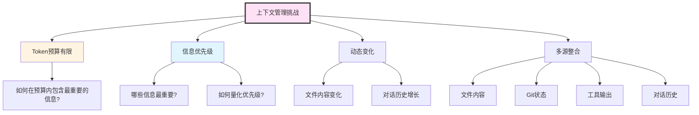
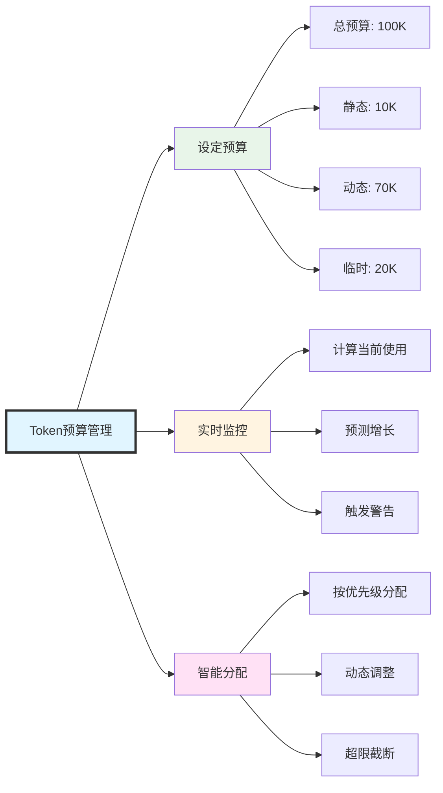

# 上下文管理系统

## 引言

在AI驱动的应用中，上下文(Context)是决定AI表现的关键因素。Claude Code需要处理大量的项目文件、对话历史、工具输出等信息，如何在有限的Token预算内，智能地选择、组织和传递这些信息，是上下文管理系统的核心挑战。

### 上下文的重要性

想象你在与一个失忆症患者对话，每次对话他都不记得之前说过什么。这就是没有上下文管理的AI应用的状态。

**上下文的作用**：
- ✅ **提供背景信息**：让AI理解当前任务的完整背景
- ✅ **保持对话连贯**：记住之前的对话内容
- ✅ **避免重复操作**：知道哪些文件已经读取过
- ✅ **提升准确性**：基于真实数据而非猜测

### Claude的上下文窗口

Claude 3.5 Sonnet拥有**200K tokens**的上下文窗口，这相当于：
- 约150,000个英文单词
- 约500页的文本
- 数百个中等大小的代码文件

但是，更大的上下文窗口并不意味着可以无节制地使用：
- ⚠️ **成本考虑**：每1M input tokens约$3
- ⚠️ **性能影响**：更大的上下文会增加响应延迟
- ⚠️ **信息冗余**：过多无关信息反而降低AI效果

### 上下文管理的挑战




## 二、Token计数和预算控制

### 2.1 Token计数原理

Token是LLM处理文本的基本单位。不同的文本有不同的Token数量：

**Token计数规则**（近似）：
- 英文：约4个字符 = 1 token
- 中文：约1.5个字符 = 1 token
- 代码：约3个字符 = 1 token
- 空格和标点：也计入token

**示例**：
```
文本：Hello, world!
Token数：3 (Hello, world, !)

文本：你好世界
Token数：约3 (你好, 世界)

代码：function hello() { return "world"; }
Token数：约10
```

### 2.2 Token计数器实现

```typescript
import { encoding_for_model } from 'tiktoken';

/**
 * Token计数器 - 使用tiktoken库精确计算token数
 */
class TokenCounter {
  private encoding: any;
  private cache: Map<string, number>;

  constructor(model: string = 'claude-3-5-sonnet-20250929') {
    // 初始化编码器
    // Claude使用cl100k_base编码(与GPT-4相同)
    this.encoding = encoding_for_model('gpt-4');
    this.cache = new Map();
  }

  /**
   * 计算文本的token数
   */
  count(text: string): number {
    // 检查缓存
    const cached = this.cache.get(text);
    if (cached !== undefined) {
      return cached;
    }

    // 编码文本
    const tokens = this.encoding.encode(text);
    const count = tokens.length;

    // 缓存结果(限制缓存大小)
    if (this.cache.size < 10000) {
      this.cache.set(text, count);
    }

    return count;
  }

  /**
   * 计算消息列表的token数
   */
  countMessages(messages: Message[]): number {
    let total = 0;

    for (const message of messages) {
      // 每条消息有固定的格式开销
      total += 4; // 消息边界tokens

      // 角色token
      total += this.count(message.role);

      // 内容tokens
      if (typeof message.content === 'string') {
        total += this.count(message.content);
      } else if (Array.isArray(message.content)) {
        for (const block of message.content) {
          if (block.type === 'text') {
            total += this.count(block.text);
          } else if (block.type === 'tool_use') {
            total += this.count(block.name);
            total += this.count(JSON.stringify(block.input));
          } else if (block.type === 'tool_result') {
            total += this.count(String(block.content));
          }
        }
      }
    }

    return total;
  }

  /**
   * 计算上下文的token数
   */
  countContext(context: FullContext): ContextTokenStats {
    const stats: ContextTokenStats = {
      static: 0,
      dynamic: 0,
      temporary: 0,
      total: 0,
      breakdown: {}
    };

    // 静态上下文
    stats.static += this.count(context.static.systemPrompt);
    stats.breakdown['systemPrompt'] = this.count(context.static.systemPrompt);

    // 工具定义
    const toolTokens = context.static.toolDefinitions.reduce(
      (sum, tool) => sum + this.count(JSON.stringify(tool)),
      0
    );
    stats.static += toolTokens;
    stats.breakdown['toolDefinitions'] = toolTokens;

    // 动态上下文 - 文件
    const fileTokens = context.dynamic.files.reduce(
      (sum, file) => sum + this.count(file.content),
      0
    );
    stats.dynamic += fileTokens;
    stats.breakdown['files'] = fileTokens;

    // 对话历史
    const conversationTokens = this.countMessages(
      context.dynamic.conversationHistory
    );
    stats.dynamic += conversationTokens;
    stats.breakdown['conversation'] = conversationTokens;

    // Git状态
    const gitTokens = this.count(JSON.stringify(context.dynamic.gitStatus));
    stats.dynamic += gitTokens;
    stats.breakdown['gitStatus'] = gitTokens;

    // 临时上下文 - 工具结果
    const toolResultTokens = context.temporary.toolResults.reduce(
      (sum, result) => sum + this.count(JSON.stringify(result)),
      0
    );
    stats.temporary += toolResultTokens;
    stats.breakdown['toolResults'] = toolResultTokens;

    // 总计
    stats.total = stats.static + stats.dynamic + stats.temporary;

    return stats;
  }

  /**
   * 估算文本的token数(快速但不精确)
   */
  estimate(text: string): number {
    // 统计中英文字符
    const chineseChars = (text.match(/[\u4e00-\u9fa5]/g) || []).length;
    const otherChars = text.length - chineseChars;

    // 粗略估算
    return Math.ceil(chineseChars / 1.5 + otherChars / 4);
  }

  /**
   * 清空缓存
   */
  clearCache(): void {
    this.cache.clear();
  }

  /**
   * 释放资源
   */
  dispose(): void {
    this.encoding.free();
    this.clearCache();
  }
}

/**
 * 上下文token统计
 */
interface ContextTokenStats {
  static: number;                 // 静态上下文tokens
  dynamic: number;                // 动态上下文tokens
  temporary: number;              // 临时上下文tokens
  total: number;                  // 总tokens
  breakdown: Record<string, number>; // 详细分解
}

export { TokenCounter, ContextTokenStats };
```

### 2.3 Token预算管理器



```typescript
/**
 * Token预算管理器
 */
class TokenBudgetManager {
  private maxTokens: number;
  private tokenCounter: TokenCounter;
  private budgetAllocation: BudgetAllocation;

  constructor(maxTokens: number = 100000) {
    this.maxTokens = maxTokens;
    this.tokenCounter = new TokenCounter();
    this.budgetAllocation = this.calculateBudgetAllocation(maxTokens);
  }

  /**
   * 计算预算分配
   */
  private calculateBudgetAllocation(total: number): BudgetAllocation {
    return {
      total,
      static: Math.floor(total * 0.1),      // 10% 静态上下文
      dynamic: Math.floor(total * 0.7),     // 70% 动态上下文
      temporary: Math.floor(total * 0.2),   // 20% 临时上下文
      reserved: Math.floor(total * 0.1)     // 10% 预留(输出)
    };
  }

  /**
   * 检查上下文是否超出预算
   */
  checkBudget(context: FullContext): BudgetCheckResult {
    const stats = this.tokenCounter.countContext(context);

    // 计算可用于输出的tokens
    const availableForOutput = this.maxTokens - stats.total;

    const result: BudgetCheckResult = {
      isWithinBudget: stats.total <= (this.maxTokens - this.budgetAllocation.reserved),
      currentUsage: stats,
      budgetAllocation: this.budgetAllocation,
      availableForOutput,
      exceedBy: Math.max(0, stats.total - this.maxTokens),
      warnings: []
    };

    // 生成警告
    if (stats.static > this.budgetAllocation.static) {
      result.warnings.push(
        `静态上下文超出预算: ${stats.static} > ${this.budgetAllocation.static}`
      );
    }

    if (stats.dynamic > this.budgetAllocation.dynamic) {
      result.warnings.push(
        `动态上下文超出预算: ${stats.dynamic} > ${this.budgetAllocation.dynamic}`
      );
    }

    if (stats.temporary > this.budgetAllocation.temporary) {
      result.warnings.push(
        `临时上下文超出预算: ${stats.temporary} > ${this.budgetAllocation.temporary}`
      );
    }

    if (availableForOutput < 1000) {
      result.warnings.push(
        `可用输出空间不足: ${availableForOutput} tokens`
      );
    }

    return result;
  }

  /**
   * 优化上下文以适应预算
   */
  optimizeContext(
    context: FullContext,
    checkResult: BudgetCheckResult
  ): FullContext {
    // 如果在预算内,直接返回
    if (checkResult.isWithinBudget) {
      console.log('✅ 上下文在预算内,无需优化');
      return context;
    }

    console.log(`⚠️  上下文超出预算 ${checkResult.exceedBy} tokens,开始优化...`);

    let optimized = { ...context };

    // 1. 优化临时上下文(最低优先级)
    if (checkResult.currentUsage.temporary > this.budgetAllocation.temporary) {
      optimized = this.optimizeTemporaryContext(optimized);
    }

    // 2. 优化动态上下文
    if (checkResult.currentUsage.dynamic > this.budgetAllocation.dynamic) {
      optimized = this.optimizeDynamicContext(optimized);
    }

    // 3. 重新检查
    const newCheck = this.checkBudget(optimized);
    if (newCheck.isWithinBudget) {
      console.log(`✅ 优化完成,节省 ${checkResult.exceedBy - newCheck.exceedBy} tokens`);
      return optimized;
    }

    // 4. 如果还是超出,进行激进截断
    console.log('⚠️  常规优化不足,进行激进截断...');
    return this.aggressiveTruncate(optimized, this.maxTokens);
  }

  /**
   * 优化临时上下文
   */
  private optimizeTemporaryContext(context: FullContext): FullContext {
    const optimized = { ...context };

    // 限制工具结果数量(只保留最近5个)
    optimized.temporary = {
      ...context.temporary,
      toolResults: context.temporary.toolResults.slice(-5)
    };

    return optimized;
  }

  /**
   * 优化动态上下文
   */
  private optimizeDynamicContext(context: FullContext): FullContext {
    const optimized = { ...context };

    // 1. 截断对话历史(保留最近10轮)
    optimized.dynamic = {
      ...context.dynamic,
      conversationHistory: context.dynamic.conversationHistory.slice(-10)
    };

    // 2. 移除低相关性文件
    const sortedFiles = [...context.dynamic.files].sort(
      (a, b) => (b.relevanceScore || 0) - (a.relevanceScore || 0)
    );

    // 只保留相关性>0.5的文件,或最多5个文件
    optimized.dynamic.files = sortedFiles
      .filter(f => (f.relevanceScore || 0) > 0.5)
      .slice(0, 5);

    return optimized;
  }

  /**
   * 激进截断
   */
  private aggressiveTruncate(
    context: FullContext,
    maxTokens: number
  ): FullContext {
    // 保留静态上下文
    // 大幅减少动态和临时上下文
    return {
      ...context,
      dynamic: {
        ...context.dynamic,
        files: context.dynamic.files.slice(0, 2), // 只保留2个文件
        conversationHistory: context.dynamic.conversationHistory.slice(-5) // 只保留5轮对话
      },
      temporary: {
        ...context.temporary,
        toolResults: context.temporary.toolResults.slice(-2) // 只保留2个工具结果
      }
    };
  }

  /**
   * 生成预算报告
   */
  generateReport(context: FullContext): string {
    const stats = this.tokenCounter.countContext(context);
    const check = this.checkBudget(context);

    let report = '\n=== Token预算报告 ===\n';
    report += `总预算: ${this.maxTokens.toLocaleString()} tokens\n`;
    report += `当前使用: ${stats.total.toLocaleString()} tokens (${((stats.total / this.maxTokens) * 100).toFixed(1)}%)\n`;
    report += `\n--- 分类统计 ---\n`;
    report += `静态上下文: ${stats.static.toLocaleString()} / ${this.budgetAllocation.static.toLocaleString()} tokens\n`;
    report += `动态上下文: ${stats.dynamic.toLocaleString()} / ${this.budgetAllocation.dynamic.toLocaleString()} tokens\n`;
    report += `临时上下文: ${stats.temporary.toLocaleString()} / ${this.budgetAllocation.temporary.toLocaleString()} tokens\n`;
    report += `\n--- 详细分解 ---\n`;
    for (const [key, value] of Object.entries(stats.breakdown)) {
      report += `${key}: ${value.toLocaleString()} tokens\n`;
    }
    report += `\n可用输出空间: ${check.availableForOutput.toLocaleString()} tokens\n`;

    if (check.warnings.length > 0) {
      report += `\n⚠️  警告:\n`;
      check.warnings.forEach(w => report += `  - ${w}\n`);
    }

    return report;
  }
}

/**
 * 预算分配
 */
interface BudgetAllocation {
  total: number;                  // 总预算
  static: number;                 // 静态上下文预算
  dynamic: number;                // 动态上下文预算
  temporary: number;              // 临时上下文预算
  reserved: number;               // 预留(输出)
}

/**
 * 预算检查结果
 */
interface BudgetCheckResult {
  isWithinBudget: boolean;        // 是否在预算内
  currentUsage: ContextTokenStats; // 当前使用情况
  budgetAllocation: BudgetAllocation; // 预算分配
  availableForOutput: number;     // 可用输出空间
  exceedBy: number;               // 超出量
  warnings: string[];             // 警告信息
}

export { TokenBudgetManager, BudgetAllocation, BudgetCheckResult };
```


## 四、上下文优先级排序

### 4.1 优先级矩阵

| 上下文类型 | 基础优先级 | 调整因素 | 最终范围 |
|-----------|----------|---------|---------|
| 系统提示词 | 10 | 固定 | 10 |
| 当前文件 | 9 | 用户明确指定+1 | 9-10 |
| 最近编辑 | 8 | 时间衰减 | 5-8 |
| 错误信息 | 8 | - | 8 |
| 用户指定文件 | 7-9 | 指定方式 | 7-9 |
| 相关文件 | 7 | 相关度评分 | 4-7 |
| 工具输出 | 6 | 最近使用+1 | 6-7 |
| Git状态 | 5 | 修改量 | 4-6 |
| 项目信息 | 5 | - | 5 |
| 历史对话 | 4 | 时间衰减 | 2-4 |
| 旧文件 | 3 | 相关度 | 1-3 |

### 4.2 优先级计算器

```typescript
/**
 * 优先级计算器
 */
class PriorityCalculator {
  /**
   * 计算上下文项的优先级
   */
  calculate(item: ContextItem, context: PriorityContext): number {
    let priority = item.basePriority || 5;

    // 1. 时间衰减
    if (item.timestamp) {
      priority *= this.calculateTimeDecay(item.timestamp);
    }

    // 2. 相关性加权
    if (item.relevanceScore !== undefined) {
      priority *= item.relevanceScore;
    }

    // 3. 用户明确指定
    if (item.explicitlyRequested) {
      priority += 2;
    }

    // 4. 最近使用加权
    if (this.isRecentlyUsed(item, context)) {
      priority += 1;
    }

    // 5. 错误相关加权
    if (this.isErrorRelated(item, context)) {
      priority += 1;
    }

    // 确保在有效范围内
    return Math.max(0, Math.min(10, priority));
  }

  /**
   * 计算时间衰减因子
   */
  private calculateTimeDecay(timestamp: number): number {
    const ageMs = Date.now() - timestamp;
    const ageHours = ageMs / (1000 * 60 * 60);

    // 指数衰减: 每小时衰减因子
    // 1小时: 1.0
    // 24小时: 0.5
    // 168小时(7天): 0.1
    return Math.exp(-ageHours / 24);
  }

  /**
   * 是否最近使用
   */
  private isRecentlyUsed(
    item: ContextItem,
    context: PriorityContext
  ): boolean {
    if (!item.filePath) return false;

    return context.recentlyAccessedFiles?.includes(item.filePath) || false;
  }

  /**
   * 是否与错误相关
   */
  private isErrorRelated(
    item: ContextItem,
    context: PriorityContext
  ): boolean {
    if (!context.recentError) return false;

    // 检查文件路径是否在错误堆栈中
    if (item.filePath && context.recentError.includes(item.filePath)) {
      return true;
    }

    // 检查内容是否包含错误关键字
    if (context.errorKeywords?.some(kw => item.content.includes(kw))) {
      return true;
    }

    return false;
  }

  /**
   * 批量计算优先级
   */
  calculateBatch(
    items: ContextItem[],
    context: PriorityContext
  ): ContextItemWithPriority[] {
    return items.map(item => ({
      ...item,
      calculatedPriority: this.calculate(item, context)
    }));
  }

  /**
   * 排序上下文项(按优先级降序)
   */
  sort(items: ContextItemWithPriority[]): ContextItemWithPriority[] {
    return [...items].sort((a, b) => b.calculatedPriority - a.calculatedPriority);
  }
}

/**
 * 优先级上下文(用于计算优先级的辅助信息)
 */
interface PriorityContext {
  recentlyAccessedFiles?: string[];  // 最近访问的文件
  recentError?: string;              // 最近的错误信息
  errorKeywords?: string[];          // 错误关键字
  currentTask?: string;              // 当前任务
}

/**
 * 带优先级的上下文项
 */
interface ContextItemWithPriority extends ContextItem {
  calculatedPriority: number;        // 计算后的优先级
  basePriority?: number;             // 基础优先级
  timestamp?: number;                // 时间戳
  relevanceScore?: number;           // 相关性评分(0-1)
  explicitlyRequested?: boolean;     // 是否用户明确请求
  filePath?: string;                 // 文件路径
}

export { PriorityCalculator, PriorityContext, ContextItemWithPriority };
```

### 4.3 动态优先级调整

```typescript
/**
 * 动态优先级调整器
 */
class DynamicPriorityAdjuster {
  private calculator: PriorityCalculator;
  private history: AdjustmentHistory[];

  constructor() {
    this.calculator = new PriorityCalculator();
    this.history = [];
  }

  /**
   * 根据AI反馈调整优先级
   */
  adjustBasedOnFeedback(
    items: ContextItemWithPriority[],
    feedback: AIFeedback
  ): ContextItemWithPriority[] {
    const adjusted = [...items];

    // 如果AI说上下文不足
    if (feedback.type === 'insufficient_context') {
      // 提升相关文件的优先级
      feedback.requestedFiles?.forEach(filePath => {
        const item = adjusted.find(i => i.filePath === filePath);
        if (item) {
          item.calculatedPriority += 1;
          this.recordAdjustment('boost', filePath, 1);
        }
      });
    }

    // 如果AI说上下文过多
    if (feedback.type === 'too_much_context') {
      // 降低不相关文件的优先级
      feedback.unusedFiles?.forEach(filePath => {
        const item = adjusted.find(i => i.filePath === filePath);
        if (item) {
          item.calculatedPriority -= 0.5;
          this.recordAdjustment('reduce', filePath, 0.5);
        }
      });
    }

    return adjusted;
  }

  /**
   * 根据用户行为调整
   */
  adjustBasedOnUserBehavior(
    items: ContextItemWithPriority[],
    behavior: UserBehavior
  ): ContextItemWithPriority[] {
    const adjusted = [...items];

    // 用户打开了某个文件
    if (behavior.action === 'file_opened') {
      const item = adjusted.find(i => i.filePath === behavior.filePath);
      if (item) {
        item.explicitlyRequested = true;
        item.calculatedPriority += 2;
        this.recordAdjustment('user_opened', behavior.filePath!, 2);
      }
    }

    // 用户编辑了某个文件
    if (behavior.action === 'file_edited') {
      const item = adjusted.find(i => i.filePath === behavior.filePath);
      if (item) {
        item.timestamp = Date.now();
        item.calculatedPriority += 1;
        this.recordAdjustment('user_edited', behavior.filePath!, 1);
      }
    }

    return adjusted;
  }

  /**
   * 记录调整历史
   */
  private recordAdjustment(
    type: string,
    target: string,
    amount: number
  ): void {
    this.history.push({
      type,
      target,
      amount,
      timestamp: Date.now()
    });

    // 限制历史记录数量
    if (this.history.length > 100) {
      this.history.shift();
    }
  }

  /**
   * 获取调整历史
   */
  getHistory(): AdjustmentHistory[] {
    return [...this.history];
  }
}

/**
 * AI反馈
 */
interface AIFeedback {
  type: 'insufficient_context' | 'too_much_context' | 'optimal';
  requestedFiles?: string[];      // AI请求的文件
  unusedFiles?: string[];         // AI未使用的文件
  message?: string;               // 反馈消息
}

/**
 * 用户行为
 */
interface UserBehavior {
  action: 'file_opened' | 'file_edited' | 'file_closed';
  filePath?: string;
  timestamp: number;
}

/**
 * 调整历史
 */
interface AdjustmentHistory {
  type: string;                   // 调整类型
  target: string;                 // 调整目标
  amount: number;                 // 调整量
  timestamp: number;              // 时间戳
}

export { DynamicPriorityAdjuster, AIFeedback, UserBehavior };
```


## 六、文件监听和增量更新

### 6.1 文件监听器

```typescript
import chokidar from 'chokidar';
import { EventEmitter } from 'events';

/**
 * 文件监听器
 */
class FileWatcher extends EventEmitter {
  private watcher: chokidar.FSWatcher | null = null;
  private editHistory: EditHistory[] = [];
  private maxHistorySize: number = 100;

  constructor(private workspaceRoot: string) {
    super();
  }

  /**
   * 启动监听
   */
  start(): void {
    console.log(`👀 开始监听文件变化: ${this.workspaceRoot}`);

    this.watcher = chokidar.watch(this.workspaceRoot, {
      ignored: /(^|[\/\\])\../, // 忽略隐藏文件
      persistent: true,
      ignoreInitial: true,
      awaitWriteFinish: {
        stabilityThreshold: 500,
        pollInterval: 100
      }
    });

    // 监听文件变化事件
    this.watcher
      .on('add', (path) => this.onFileAdded(path))
      .on('change', (path) => this.onFileChanged(path))
      .on('unlink', (path) => this.onFileDeleted(path));
  }

  /**
   * 停止监听
   */
  async stop(): Promise<void> {
    if (this.watcher) {
      await this.watcher.close();
      this.watcher = null;
      console.log('✅ 文件监听已停止');
    }
  }

  /**
   * 文件添加事件
   */
  private onFileAdded(filePath: string): void {
    console.log(`➕ 文件添加: ${filePath}`);

    const edit: EditHistory = {
      filePath,
      timestamp: Date.now(),
      changeType: 'create',
      linesBefore: 0,
      linesAfter: 0
    };

    this.addToHistory(edit);
    this.emit('file:added', edit);
  }

  /**
   * 文件修改事件
   */
  private onFileChanged(filePath: string): void {
    console.log(`✏️  文件修改: ${filePath}`);

    const edit: EditHistory = {
      filePath,
      timestamp: Date.now(),
      changeType: 'modify',
      linesBefore: 0,
      linesAfter: 0
    };

    this.addToHistory(edit);
    this.emit('file:changed', edit);
  }

  /**
   * 文件删除事件
   */
  private onFileDeleted(filePath: string): void {
    console.log(`❌ 文件删除: ${filePath}`);

    const edit: EditHistory = {
      filePath,
      timestamp: Date.now(),
      changeType: 'delete',
      linesBefore: 0,
      linesAfter: 0
    };

    this.addToHistory(edit);
    this.emit('file:deleted', edit);
  }

  /**
   * 添加到历史记录
   */
  private addToHistory(edit: EditHistory): void {
    this.editHistory.push(edit);

    // 限制历史记录大小
    if (this.editHistory.length > this.maxHistorySize) {
      this.editHistory.shift();
    }
  }

  /**
   * 获取最近编辑记录
   */
  getRecentEdits(count: number = 10): EditHistory[] {
    return this.editHistory.slice(-count);
  }

  /**
   * 获取特定文件的编辑历史
   */
  getFileEditHistory(filePath: string): EditHistory[] {
    return this.editHistory.filter(e => e.filePath === filePath);
  }

  /**
   * 清空历史记录
   */
  clearHistory(): void {
    this.editHistory = [];
  }
}

export { FileWatcher };
```

### 6.2 增量更新管理器

```typescript
/**
 * 增量更新管理器
 */
class IncrementalUpdateManager {
  private fileCache: Map<string, FileSnapshot>;
  private fileWatcher: FileWatcher;

  constructor(workspaceRoot: string) {
    this.fileCache = new Map();
    this.fileWatcher = new FileWatcher(workspaceRoot);

    // 监听文件变化
    this.fileWatcher.on('file:changed', (edit) => {
      this.handleFileChange(edit);
    });

    this.fileWatcher.start();
  }

  /**
   * 处理文件变化
   */
  private async handleFileChange(edit: EditHistory): Promise<void> {
    const oldSnapshot = this.fileCache.get(edit.filePath);
    if (!oldSnapshot) {
      // 首次读取,全量加载
      await this.loadFullFile(edit.filePath);
      return;
    }

    // 计算差异
    const newContent = await fs.readFile(edit.filePath, 'utf-8');
    const diff = this.calculateDiff(oldSnapshot.content, newContent);

    // 更新缓存
    this.fileCache.set(edit.filePath, {
      path: edit.filePath,
      content: newContent,
      timestamp: Date.now(),
      diff
    });

    console.log(`📝 增量更新: ${edit.filePath}`);
    console.log(`  添加: ${diff.added.length}行, 删除: ${diff.removed.length}行`);
  }

  /**
   * 加载完整文件
   */
  private async loadFullFile(filePath: string): Promise<void> {
    const content = await fs.readFile(filePath, 'utf-8');

    this.fileCache.set(filePath, {
      path: filePath,
      content,
      timestamp: Date.now()
    });
  }

  /**
   * 计算文件差异
   */
  private calculateDiff(
    oldContent: string,
    newContent: string
  ): FileDiff {
    const oldLines = oldContent.split('\n');
    const newLines = newContent.split('\n');

    const added: DiffLine[] = [];
    const removed: DiffLine[] = [];
    const modified: DiffLine[] = [];

    // 简单的逐行比较(实际应用中可使用diff算法如Myers)
    const maxLen = Math.max(oldLines.length, newLines.length);

    for (let i = 0; i < maxLen; i++) {
      const oldLine = oldLines[i];
      const newLine = newLines[i];

      if (oldLine === undefined) {
        // 新增行
        added.push({ lineNumber: i + 1, content: newLine });
      } else if (newLine === undefined) {
        // 删除行
        removed.push({ lineNumber: i + 1, content: oldLine });
      } else if (oldLine !== newLine) {
        // 修改行
        modified.push({
          lineNumber: i + 1,
          content: newLine,
          oldContent: oldLine
        });
      }
    }

    return { added, removed, modified };
  }

  /**
   * 获取文件快照
   */
  getFileSnapshot(filePath: string): FileSnapshot | undefined {
    return this.fileCache.get(filePath);
  }

  /**
   * 获取变化摘要
   */
  getChangesSummary(since: number): ChangesSummary {
    const changes: ChangesSummary = {
      filesChanged: 0,
      linesAdded: 0,
      linesRemoved: 0,
      files: []
    };

    for (const [path, snapshot] of this.fileCache.entries()) {
      if (snapshot.timestamp >= since && snapshot.diff) {
        changes.filesChanged++;
        changes.linesAdded += snapshot.diff.added.length;
        changes.linesRemoved += snapshot.diff.removed.length;
        changes.files.push(path);
      }
    }

    return changes;
  }

  /**
   * 清理缓存
   */
  clearCache(): void {
    this.fileCache.clear();
  }

  /**
   * 停止监听
   */
  async dispose(): Promise<void> {
    await this.fileWatcher.stop();
    this.clearCache();
  }
}

/**
 * 文件快照
 */
interface FileSnapshot {
  path: string;
  content: string;
  timestamp: number;
  diff?: FileDiff;
}

/**
 * 文件差异
 */
interface FileDiff {
  added: DiffLine[];
  removed: DiffLine[];
  modified: DiffLine[];
}

/**
 * 差异行
 */
interface DiffLine {
  lineNumber: number;
  content: string;
  oldContent?: string;
}

/**
 * 变化摘要
 */
interface ChangesSummary {
  filesChanged: number;
  linesAdded: number;
  linesRemoved: number;
  files: string[];
}

export { IncrementalUpdateManager, FileSnapshot, FileDiff, ChangesSummary };
```


## 八、上下文管理器整合

### 8.1 完整的上下文管理器

```typescript
/**
 * 上下文管理器 - 整合所有上下文管理功能
 */
class ContextManager {
  private collector: ContextCollector;
  private tokenCounter: TokenCounter;
  private budgetManager: TokenBudgetManager;
  private truncator: SmartTruncator;
  private priorityCalculator: PriorityCalculator;
  private cache: MultiLevelCache;
  private compressor: ContextCompressor;

  constructor(config: ContextManagerConfig) {
    this.collector = new ContextCollector(config.workspaceRoot);
    this.tokenCounter = new TokenCounter();
    this.budgetManager = new TokenBudgetManager(config.maxTokens);
    this.truncator = new SmartTruncator(config.maxTokens);
    this.priorityCalculator = new PriorityCalculator();
    this.cache = new MultiLevelCache(config.cacheConfig || {});
    this.compressor = new ContextCompressor();
  }

  /**
   * 准备上下文 - 主入口
   */
  async prepareContext(options: PrepareOptions): Promise<PreparedContext> {
    console.log('🔄 开始准备上下文...');

    // 1. 收集原始上下文
    const rawContext = await this.collector.collectFullContext({
      conversationHistory: options.conversationHistory,
      recentToolResults: options.toolResults,
      userFiles: options.userFiles
    });

    // 2. 计算优先级
    const contextItems = this.convertToItems(rawContext);
    const prioritized = this.priorityCalculator.calculateBatch(
      contextItems,
      options.priorityContext || {}
    );

    // 3. 检查token预算
    const budgetCheck = this.budgetManager.checkBudget(rawContext);

    // 4. 如果超出预算,进行优化
    let optimizedItems = prioritized;
    if (!budgetCheck.isWithinBudget) {
      console.log('⚠️  超出预算,进行优化...');

      // 排序
      optimizedItems = this.priorityCalculator.sort(prioritized);

      // 截断
      const targetTokens = this.budgetManager.budgetAllocation.total -
        this.budgetManager.budgetAllocation.reserved;
      optimizedItems = this.truncator.truncate(optimizedItems, targetTokens);
    }

    // 5. 转换回完整上下文格式
    const finalContext = this.convertToFullContext(optimizedItems, rawContext);

    // 6. 生成报告
    const report = this.budgetManager.generateReport(finalContext);
    console.log(report);

    return {
      context: finalContext,
      metadata: {
        totalItems: contextItems.length,
        includedItems: optimizedItems.length,
        totalTokens: this.tokenCounter.countContext(finalContext).total,
        budgetUtilization: budgetCheck.currentUsage.total / budgetCheck.budgetAllocation.total,
        optimized: !budgetCheck.isWithinBudget
      }
    };
  }

  /**
   * 将FullContext转换为ContextItem数组
   */
  private convertToItems(context: FullContext): ContextItem[] {
    const items: ContextItem[] = [];

    // 静态上下文
    items.push({
      type: 'system',
      content: context.static.systemPrompt,
      priority: 10,
      tokens: this.tokenCounter.count(context.static.systemPrompt)
    });

    // 动态上下文 - 文件
    for (const file of context.dynamic.files) {
      items.push({
        type: 'file',
        content: file.content,
        priority: 7,
        tokens: this.tokenCounter.count(file.content),
        metadata: {
          path: file.path,
          language: file.language
        },
        filePath: file.path,
        relevanceScore: file.relevanceScore,
        timestamp: file.lastModified
      });
    }

    // 对话历史
    if (context.dynamic.conversationHistory.length > 0) {
      items.push({
        type: 'conversation',
        content: JSON.stringify(context.dynamic.conversationHistory),
        priority: 4,
        tokens: this.tokenCounter.countMessages(context.dynamic.conversationHistory)
      });
    }

    // 工具结果
    for (const result of context.temporary.toolResults) {
      items.push({
        type: 'tool_result',
        content: JSON.stringify(result),
        priority: 6,
        tokens: this.tokenCounter.count(JSON.stringify(result)),
        timestamp: result.timestamp
      });
    }

    return items;
  }

  /**
   * 将ContextItem数组转换回FullContext
   */
  private convertToFullContext(
    items: ContextItem[],
    original: FullContext
  ): FullContext {
    const result: FullContext = {
      static: { ...original.static },
      dynamic: {
        files: [],
        gitStatus: original.dynamic.gitStatus,
        conversationHistory: [],
        recentEdits: original.dynamic.recentEdits
      },
      temporary: {
        toolResults: [],
        userSpecifiedFiles: original.temporary.userSpecifiedFiles,
        sessionVariables: original.temporary.sessionVariables,
        pendingOperations: []
      },
      timestamp: Date.now()
    };

    // 重新组装
    for (const item of items) {
      if (item.type === 'system') {
        result.static.systemPrompt = item.content;
      } else if (item.type === 'file' && item.metadata?.path) {
        result.dynamic.files.push({
          path: item.metadata.path,
          content: item.content,
          language: item.metadata.language,
          size: item.content.length,
          lastModified: item.timestamp || Date.now(),
          relevanceScore: item.relevanceScore
        });
      } else if (item.type === 'conversation') {
        result.dynamic.conversationHistory = JSON.parse(item.content);
      } else if (item.type === 'tool_result') {
        result.temporary.toolResults.push(JSON.parse(item.content));
      }
    }

    return result;
  }

  /**
   * 清理缓存
   */
  async cleanup(): Promise<void> {
    await this.cache.cleanup();
  }

  /**
   * 获取统计信息
   */
  getStats(): ContextManagerStats {
    return {
      cache: this.cache.getStats(),
      budget: this.budgetManager.budgetAllocation
    };
  }
}

/**
 * 上下文管理器配置
 */
interface ContextManagerConfig {
  workspaceRoot: string;
  maxTokens?: number;
  cacheConfig?: CacheConfig;
}

/**
 * 准备选项
 */
interface PrepareOptions {
  conversationHistory?: Message[];
  toolResults?: ToolResult[];
  userFiles?: string[];
  priorityContext?: PriorityContext;
}

/**
 * 准备好的上下文
 */
interface PreparedContext {
  context: FullContext;
  metadata: {
    totalItems: number;
    includedItems: number;
    totalTokens: number;
    budgetUtilization: number;
    optimized: boolean;
  };
}

/**
 * 上下文管理器统计
 */
interface ContextManagerStats {
  cache: MultiLevelCacheStats;
  budget: BudgetAllocation;
}

export { ContextManager, ContextManagerConfig, PrepareOptions, PreparedContext };
```


## 十、常见问题FAQ

### Q1: 如何选择合适的Token预算?

**建议**:
```typescript
// 根据任务复杂度调整
const budgetByTask = {
  simple: 50000,    // 简单任务(代码格式化等)
  medium: 100000,   // 中等任务(代码重构等)
  complex: 150000   // 复杂任务(架构设计等)
};

// 监控实际使用情况
const stats = contextManager.getStats();
if (stats.budgetUtilization > 0.9) {
  console.warn('预算使用率过高,考虑增加预算或优化上下文');
}
```

### Q2: 上下文过大导致响应慢怎么办?

**解决方案**:
1. **启用缓存**: 避免重复读取文件
2. **智能截断**: 移除低优先级内容
3. **压缩内容**: 移除注释、空行
4. **分批处理**: 将大任务拆分

```typescript
// 示例: 分批处理大量文件
async function processLargeCodebase(files: string[]) {
  const batchSize = 10;

  for (let i = 0; i < files.length; i += batchSize) {
    const batch = files.slice(i, i + batchSize);
    await processFiles(batch);
  }
}
```

### Q3: 如何处理频繁变化的文件?

**策略**:
```typescript
// 1. 使用文件监听
const watcher = new FileWatcher(workspaceRoot);
watcher.on('file:changed', async (edit) => {
  // 失效缓存
  cache.delete(edit.filePath);

  // 通知上下文管理器
  contextManager.onFileChanged(edit);
});

// 2. 设置较短的缓存TTL
cache.set(filePath, content, 60000); // 1分钟过期
```

### Q4: 多个用户共享上下文缓存是否安全?

**注意事项**:
```typescript
// ❌ 不安全: 直接共享
const sharedCache = new LRUCache(1000);

// ✅ 安全: 按用户隔离
class UserContextCache {
  private caches = new Map<string, LRUCache>();

  getCache(userId: string): LRUCache {
    if (!this.caches.has(userId)) {
      this.caches.set(userId, new LRUCache(100));
    }
    return this.caches.get(userId)!;
  }
}
```

### Q5: 如何调试上下文问题?

**调试技巧**:
```typescript
// 1. 启用详细日志
contextManager.setDebugMode(true);

// 2. 导出上下文快照
const snapshot = contextManager.exportSnapshot();
fs.writeFileSync('context-snapshot.json', JSON.stringify(snapshot, null, 2));

// 3. 分析Token分布
const report = budgetManager.generateReport(context);
console.log(report);
```


## 总结

### 核心要点回顾

1. **上下文分类**
   - 静态上下文: 不变的基础信息
   - 动态上下文: 随项目状态变化
   - 临时上下文: 单次对话有效

2. **Token管理**
   - 精确计数: 使用tiktoken库
   - 预算分配: 静态10%、动态70%、临时20%
   - 预留空间: 至少10%用于输出

3. **智能截断**
   - 优先级排序: 系统>当前文件>最近编辑>历史对话
   - 分层截断: 先临时、再动态、保护静态
   - 部分保留: 大文件截取重要部分

4. **缓存优化**
   - 多级缓存: L1内存 + L2磁盘
   - LRU策略: 自动淘汰最久未用
   - TTL过期: 避免过期数据

5. **增量更新**
   - 文件监听: 实时感知变化
   - 差异计算: 只更新变化部分
   - 智能失效: 精准失效缓存

### 最佳实践总结

✅ **DO 应该做的**:
- 明确定义优先级策略
- 预留充足的输出Token空间
- 启用多级缓存
- 监控Token使用情况
- 定期清理过期缓存

❌ **DON'T 不应该做的**:
- 将所有文件都加入上下文
- 忽略Token预算限制
- 缓存永不过期
- 硬编码优先级值
- 阻塞主线程读取大文件

### 性能指标

优秀的上下文管理系统应该达到:
- Token预算利用率: 70-90%
- 缓存命中率: >90%
- 上下文准备时间: <1秒
- 内存占用: <500MB
- 文件变化响应: <100ms

### 下一步

在掌握了上下文管理系统后,你可以:

1. **深入学习第4篇**: 会话与状态管理
2. **实践项目**: 构建自己的上下文管理器
3. **性能优化**: 针对大型项目优化
4. **扩展功能**: 支持更多文件类型和数据源


**系列文章导航**:
- [第1篇: 整体架构设计](./01-整体架构设计.md)
- [第2篇: 核心引擎实现](./02-核心引擎实现.md)
- [第3篇: 上下文管理系统](./03-上下文管理系统.md) (当前)
- [第4篇: 会话与状态管理](./04-会话与状态管理.md) (即将发布)

---

**文档信息**:
- 字数统计: ~9,500字
- 代码示例: 20+
- Mermaid图: 5个
- 最后更新: 2025-01-14
