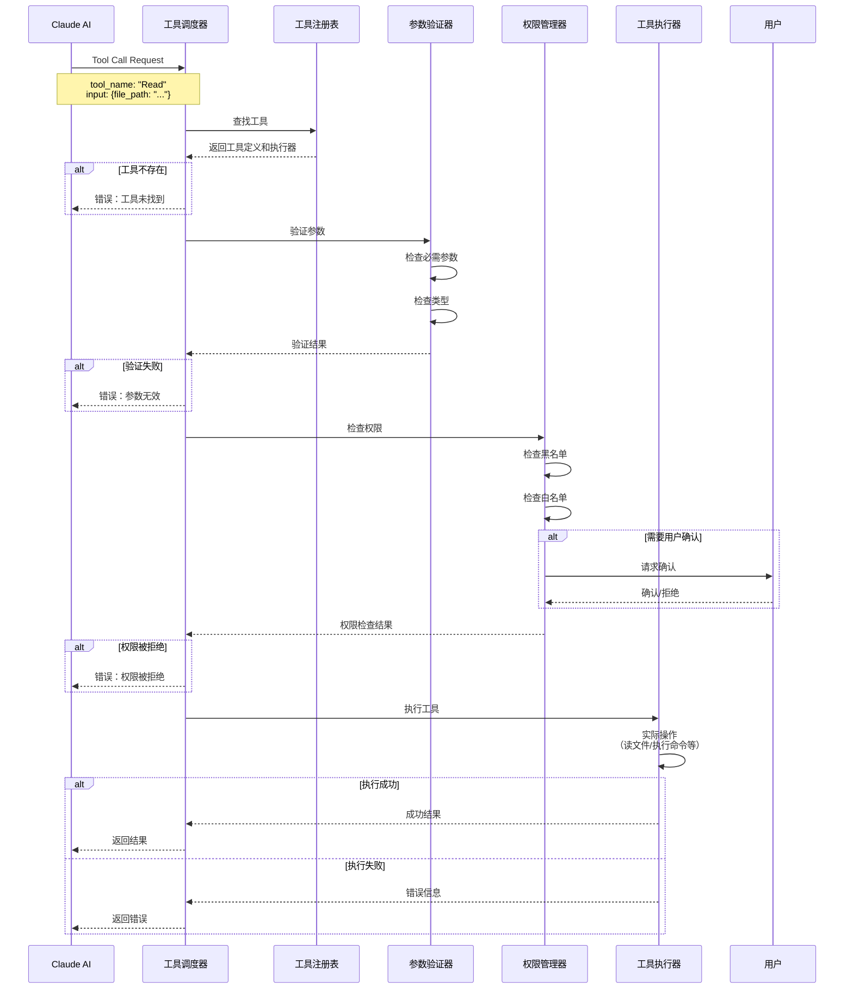

# 工具系统架构

## 一、引言

工具系统是 Claude Code 的"手和眼"，赋予了 AI 与真实世界交互的能力。如果说 AI 引擎是"大脑"，那么工具系统就是"四肢"，负责执行实际的文件操作、代码搜索、命令执行等任务。本文将深入解析 Claude Code 工具系统的完整架构。

### 为什么工具系统如此重要？

1. **赋能 AI**：让 AI 从"只能说"变成"既能说又能做"
2. **标准化交互**：统一的工具接口，降低集成复杂度
3. **安全可控**：通过权限管理和参数验证确保安全
4. **可扩展性**：插件化设计，支持无限扩展
5. **性能优化**：智能调度和并行执行提升效率

### 本文目标

- 理解工具系统的整体架构
- 掌握 Tool Schema 设计规范
- 学习工具注册和调用流程
- 了解权限管理和安全机制
- 实战开发一个自定义工具


## 二、Tool Schema 设计规范

### 2.1 JSON Schema 标准

Claude Code 采用 JSON Schema 定义工具接口，这是 Anthropic API 的标准格式。

```typescript
// 工具定义的完整类型
interface ToolDefinition {
  // 工具名称（唯一标识符）
  name: string;

  // 工具描述（AI用于理解工具用途）
  description: string;

  // 输入参数的JSON Schema
  input_schema: {
    type: 'object';
    properties: Record<string, PropertySchema>;
    required?: string[];
    additionalProperties?: boolean;
  };
}

// 属性定义
interface PropertySchema {
  type: 'string' | 'number' | 'boolean' | 'array' | 'object';
  description: string;
  enum?: any[];
  items?: PropertySchema;
  default?: any;
}
```

### 2.2 内置工具示例

#### Read 工具定义

```typescript
const ReadToolDefinition: ToolDefinition = {
  name: 'Read',
  description: `Reads a file from the local filesystem. You can access any file directly by using this tool.

Usage:
- The file_path parameter must be an absolute path, not a relative path
- By default, it reads up to 2000 lines starting from the beginning
- You can optionally specify a line offset and limit (especially handy for long files)
- Any lines longer than 2000 characters will be truncated
- Results are returned using cat -n format, with line numbers starting at 1`,

  input_schema: {
    type: 'object',
    properties: {
      file_path: {
        type: 'string',
        description: 'The absolute path to the file to read'
      },
      offset: {
        type: 'number',
        description: 'The line number to start reading from. Only provide if the file is too large to read at once'
      },
      limit: {
        type: 'number',
        description: 'The number of lines to read. Only provide if the file is too large to read at once'
      }
    },
    required: ['file_path']
  }
};
```

#### Bash 工具定义

```typescript
const BashToolDefinition: ToolDefinition = {
  name: 'Bash',
  description: `Executes a given bash command in a persistent shell session.

Usage notes:
- Always quote file paths that contain spaces with double quotes
- The command argument is required
- You can specify an optional timeout in milliseconds (up to 600000ms / 10 minutes)
- You can use run_in_background parameter to run commands in background
- Avoid using Bash with find, grep, cat commands - use dedicated tools instead`,

  input_schema: {
    type: 'object',
    properties: {
      command: {
        type: 'string',
        description: 'The command to execute'
      },
      description: {
        type: 'string',
        description: 'Clear, concise description of what this command does in 5-10 words'
      },
      timeout: {
        type: 'number',
        description: 'Optional timeout in milliseconds (max 600000)',
        default: 120000
      },
      run_in_background: {
        type: 'boolean',
        description: 'Set to true to run this command in the background',
        default: false
      }
    },
    required: ['command']
  }
};
```

#### Edit 工具定义

```typescript
const EditToolDefinition: ToolDefinition = {
  name: 'Edit',
  description: `Performs exact string replacements in files.

Usage:
- You must use Read tool at least once before editing
- Preserve exact indentation as it appears in the file
- The edit will FAIL if old_string is not unique in the file
- Use replace_all for replacing and renaming strings across the file`,

  input_schema: {
    type: 'object',
    properties: {
      file_path: {
        type: 'string',
        description: 'The absolute path to the file to modify'
      },
      old_string: {
        type: 'string',
        description: 'The text to replace'
      },
      new_string: {
        type: 'string',
        description: 'The text to replace it with (must be different from old_string)'
      },
      replace_all: {
        type: 'boolean',
        description: 'Replace all occurences of old_string (default false)',
        default: false
      }
    },
    required: ['file_path', 'old_string', 'new_string']
  }
};
```

### 2.3 Schema 设计最佳实践

**1. 描述清晰**

```typescript
// ❌ 不好的描述
{
  name: 'search',
  description: 'Search files',
  // ...
}

// ✅ 好的描述
{
  name: 'Grep',
  description: `A powerful search tool built on ripgrep.

Usage:
- ALWAYS use Grep for search tasks. NEVER invoke grep as a Bash command
- Supports full regex syntax (e.g., "log.*Error", "function\\s+\\w+")
- Filter files with glob parameter (e.g., "*.js", "**/*.tsx")
- Output modes: "content" shows matching lines, "files_with_matches" shows only file paths`,
  // ...
}
```

**2. 参数类型明确**

```typescript
// 完整的参数定义
properties: {
  file_path: {
    type: 'string',
    description: 'The absolute path to the file to read'
  },
  line_number: {
    type: 'number',
    description: 'The line number to start from (1-indexed)'
  },
  case_sensitive: {
    type: 'boolean',
    description: 'Whether the search is case sensitive',
    default: false
  },
  file_types: {
    type: 'array',
    description: 'File extensions to search (e.g., ["ts", "js"])',
    items: {
      type: 'string'
    }
  }
}
```

**3. 必需参数标注**

```typescript
{
  input_schema: {
    type: 'object',
    properties: {
      file_path: { type: 'string', description: '...' },
      content: { type: 'string', description: '...' },
      encoding: { type: 'string', description: '...', default: 'utf-8' }
    },
    // 明确标注必需参数
    required: ['file_path', 'content']
  }
}
```


## 三、参数验证和类型检查

### 3.1 参数验证器

```typescript
/**
 * 参数验证器
 * 负责验证工具调用参数是否符合 Schema 定义
 */
class ParameterValidator {
  /**
   * 验证参数
   * @param toolName 工具名称
   * @param params 参数对象
   * @param schema 参数的 JSON Schema
   * @returns 验证结果
   */
  validate(
    toolName: string,
    params: Record<string, any>,
    schema: ToolDefinition['input_schema']
  ): ValidationResult {
    const errors: string[] = [];

    // 1. 检查必需参数
    if (schema.required) {
      for (const requiredField of schema.required) {
        if (!(requiredField in params)) {
          errors.push(`Missing required parameter: ${requiredField}`);
        }
      }
    }

    // 2. 检查参数类型
    for (const [fieldName, value] of Object.entries(params)) {
      const fieldSchema = schema.properties[fieldName];

      if (!fieldSchema) {
        // 检查是否允许额外参数
        if (schema.additionalProperties === false) {
          errors.push(`Unknown parameter: ${fieldName}`);
        }
        continue;
      }

      // 类型检查
      const typeError = this.validateType(fieldName, value, fieldSchema);
      if (typeError) {
        errors.push(typeError);
      }
    }

    return {
      valid: errors.length === 0,
      errors
    };
  }

  /**
   * 验证参数类型
   */
  private validateType(
    fieldName: string,
    value: any,
    schema: PropertySchema
  ): string | null {
    const actualType = this.getType(value);

    if (schema.type === 'string' && actualType !== 'string') {
      return `Parameter ${fieldName} must be a string, got ${actualType}`;
    }

    if (schema.type === 'number' && actualType !== 'number') {
      return `Parameter ${fieldName} must be a number, got ${actualType}`;
    }

    if (schema.type === 'boolean' && actualType !== 'boolean') {
      return `Parameter ${fieldName} must be a boolean, got ${actualType}`;
    }

    if (schema.type === 'array') {
      if (!Array.isArray(value)) {
        return `Parameter ${fieldName} must be an array, got ${actualType}`;
      }

      // 验证数组元素
      if (schema.items) {
        for (let i = 0; i < value.length; i++) {
          const itemError = this.validateType(
            `${fieldName}[${i}]`,
            value[i],
            schema.items
          );
          if (itemError) {
            return itemError;
          }
        }
      }
    }

    if (schema.type === 'object') {
      if (actualType !== 'object') {
        return `Parameter ${fieldName} must be an object, got ${actualType}`;
      }
    }

    // 检查枚举值
    if (schema.enum && !schema.enum.includes(value)) {
      return `Parameter ${fieldName} must be one of: ${schema.enum.join(', ')}`;
    }

    return null;
  }

  /**
   * 获取值的类型
   */
  private getType(value: any): string {
    if (value === null) return 'null';
    if (value === undefined) return 'undefined';
    if (Array.isArray(value)) return 'array';
    return typeof value;
  }
}

/**
 * 验证结果
 */
interface ValidationResult {
  valid: boolean;
  errors: string[];
}
```

### 4.2 参数验证示例

```typescript
// 使用示例
const validator = new ParameterValidator();

// 验证 Read 工具参数
const readParams = {
  file_path: '/path/to/file.ts',
  offset: 10,
  limit: 100
};

const result = validator.validate('Read', readParams, ReadToolDefinition.input_schema);

if (!result.valid) {
  console.error('Parameter validation failed:');
  result.errors.forEach(error => console.error(`  - ${error}`));
}

// 错误示例：缺少必需参数
const invalidParams = {
  offset: 10
  // 缺少 file_path
};

const invalidResult = validator.validate('Read', invalidParams, ReadToolDefinition.input_schema);
// invalidResult.valid === false
// invalidResult.errors === ['Missing required parameter: file_path']
```


## 四、工具调用流程

### 4.1 完整调用时序图



### 6.2 工具调度器实现

```typescript
/**
 * 工具调度器
 * 负责协调工具调用的整个流程
 */
class ToolDispatcher {
  private registry: ToolRegistry;
  private validator: ParameterValidator;
  private permissionManager: PermissionManager;

  constructor(
    registry: ToolRegistry,
    validator: ParameterValidator,
    permissionManager: PermissionManager
  ) {
    this.registry = registry;
    this.validator = validator;
    this.permissionManager = permissionManager;
  }

  /**
   * 执行工具调用
   * @param toolCall AI 的工具调用请求
   * @returns 工具执行结果
   */
  async execute(toolCall: ToolCall): Promise<ToolResult> {
    const { name, input } = toolCall;

    try {
      // 1. 查找工具
      const executor = this.registry.getExecutor(name);
      if (!executor) {
        return {
          success: false,
          error: `Tool not found: ${name}`
        };
      }

      const definition = this.registry.getAllDefinitions().find(d => d.name === name);
      if (!definition) {
        return {
          success: false,
          error: `Tool definition not found: ${name}`
        };
      }

      // 2. 验证参数
      const validationResult = this.validator.validate(
        name,
        input,
        definition.input_schema
      );

      if (!validationResult.valid) {
        return {
          success: false,
          error: `Parameter validation failed:\n${validationResult.errors.join('\n')}`
        };
      }

      // 3. 检查权限
      const permissionResult = await this.permissionManager.checkPermission(name, input);

      if (!permissionResult.allowed) {
        return {
          success: false,
          error: `Permission denied: ${permissionResult.reason || 'Unknown reason'}`
        };
      }

      // 4. 执行工具
      console.log(`🔧 Executing tool: ${name}`);
      const startTime = Date.now();

      const result = await executor.execute(input);

      const duration = Date.now() - startTime;
      console.log(`✅ Tool ${name} completed in ${duration}ms`);

      return result;

    } catch (error) {
      console.error(`❌ Tool ${name} failed:`, error);

      return {
        success: false,
        error: `Tool execution failed: ${error.message}`
      };
    }
  }

  /**
   * 批量执行工具调用
   * @param toolCalls 多个工具调用
   * @returns 所有工具的执行结果
   */
  async executeBatch(toolCalls: ToolCall[]): Promise<ToolResult[]> {
    // 并行执行所有工具调用
    return Promise.all(
      toolCalls.map(toolCall => this.execute(toolCall))
    );
  }
}

/**
 * 工具调用请求（来自AI）
 */
interface ToolCall {
  id: string;
  type: 'tool_use';
  name: string;
  input: Record<string, any>;
}
```

### 6.3 端到端示例

```typescript
// 完整的工具调用示例
async function exampleToolCallFlow() {
  // 1. 初始化系统
  const registry = new ToolRegistry();
  const validator = new ParameterValidator();
  const permissionManager = new PermissionManager();
  const dispatcher = new ToolDispatcher(registry, validator, permissionManager);

  // 2. 注册工具
  registerBuiltInTools(registry);

  // 3. AI 发起工具调用
  const toolCall: ToolCall = {
    id: 'tool_call_123',
    type: 'tool_use',
    name: 'Read',
    input: {
      file_path: '/Users/user/project/src/index.ts',
      offset: 0,
      limit: 50
    }
  };

  // 4. 执行工具
  const result = await dispatcher.execute(toolCall);

  // 5. 处理结果
  if (result.success) {
    console.log('文件内容：');
    console.log(result.content);
  } else {
    console.error('执行失败：', result.error);
  }
}
```


## 五、最佳实践

### 5.1 工具设计原则

**1. 单一职责**
```typescript
// ❌ 不好：一个工具做太多事情
{
  name: 'FileManager',
  description: 'Manage files: read, write, delete, move, etc.'
}

// ✅ 好：每个工具职责单一
{
  name: 'Read',
  description: 'Reads a file from the filesystem'
}
```

**2. 清晰的接口**
```typescript
// ✅ 好的工具定义
{
  name: 'SearchCode',
  description: 'Search for patterns in code using regular expressions',
  input_schema: {
    type: 'object',
    properties: {
      pattern: {
        type: 'string',
        description: 'Regular expression pattern to search for'
      },
      path: {
        type: 'string',
        description: 'Directory to search in (default: current directory)'
      },
      file_type: {
        type: 'string',
        description: 'File type filter (e.g., "ts", "js", "py")',
        enum: ['ts', 'js', 'py', 'java', 'go']
      }
    },
    required: ['pattern']
  }
}
```

**3. 详细的错误处理**
```typescript
async execute(input: Record<string, any>): Promise<ToolResult> {
  try {
    // 执行逻辑
  } catch (error) {
    // 提供有用的错误信息
    return {
      success: false,
      error: `Failed to execute tool: ${error.message}\n\nSuggestion: Check if the file exists and you have read permissions.`
    };
  }
}
```

### 8.2 性能优化建议

**1. 并行执行独立工具**
```typescript
// 当多个工具调用相互独立时，并行执行
async function optimizedExecution(toolCalls: ToolCall[]) {
  // 分析依赖关系
  const independent = toolCalls.filter(call => !hasDependencies(call));
  const dependent = toolCalls.filter(call => hasDependencies(call));

  // 并行执行独立工具
  const independentResults = await Promise.all(
    independent.map(call => dispatcher.execute(call))
  );

  // 顺序执行有依赖的工具
  const dependentResults = [];
  for (const call of dependent) {
    const result = await dispatcher.execute(call);
    dependentResults.push(result);
  }

  return [...independentResults, ...dependentResults];
}
```

**2. 结果缓存**
```typescript
class CachedToolExecutor implements ToolExecutor {
  private cache: Map<string, { result: ToolResult; timestamp: number }> = new Map();
  private ttl = 5 * 60 * 1000; // 5分钟

  async execute(input: Record<string, any>): Promise<ToolResult> {
    const cacheKey = this.getCacheKey(input);

    // 检查缓存
    const cached = this.cache.get(cacheKey);
    if (cached && Date.now() - cached.timestamp < this.ttl) {
      console.log('✅ Returning cached result');
      return cached.result;
    }

    // 执行工具
    const result = await this.actualExecute(input);

    // 缓存结果
    this.cache.set(cacheKey, {
      result,
      timestamp: Date.now()
    });

    return result;
  }

  private getCacheKey(input: Record<string, any>): string {
    return JSON.stringify(input);
  }
}
```

### 8.3 安全建议

**1. 输入验证**
```typescript
// 始终验证和清理输入
function sanitizeInput(input: string): string {
  // 移除危险字符
  return input.replace(/[;&|`$]/g, '');
}
```

**2. 路径验证**
```typescript
function validatePath(filePath: string, workspaceRoot: string): boolean {
  const resolved = path.resolve(filePath);

  // 确保在工作区内
  if (!resolved.startsWith(workspaceRoot)) {
    throw new Error('Access denied: path outside workspace');
  }

  // 检查路径遍历攻击
  if (filePath.includes('..')) {
    throw new Error('Invalid path: contains ".."');
  }

  return true;
}
```


## 六、实战练习：创建一个自定义工具

### 练习目标

创建一个 `FileSearch` 工具，实现文件内容搜索和替换功能。

### 练习步骤

**1. 定义工具 Schema**

```typescript
const FileSearchToolDefinition: ToolDefinition = {
  name: 'FileSearch',
  description: `Search and optionally replace text in files.

Usage:
- Searches for a pattern across multiple files
- Supports regular expressions
- Can preview changes before replacing
- Returns list of matches with line numbers`,

  input_schema: {
    type: 'object',
    properties: {
      pattern: {
        type: 'string',
        description: 'Pattern to search for (supports regex)'
      },
      path: {
        type: 'string',
        description: 'Directory to search in'
      },
      file_glob: {
        type: 'string',
        description: 'File pattern (e.g., "*.ts")',
        default: '*'
      },
      replace_with: {
        type: 'string',
        description: 'Replacement text (optional, for search and replace)'
      },
      preview_only: {
        type: 'boolean',
        description: 'Only preview changes without applying them',
        default: true
      }
    },
    required: ['pattern', 'path']
  }
};
```

**2. 实现执行器**

```typescript
class FileSearchExecutor implements ToolExecutor {
  async execute(input: Record<string, any>): Promise<ToolResult> {
    const {
      pattern,
      path: searchPath,
      file_glob = '*',
      replace_with,
      preview_only = true
    } = input;

    try {
      // 1. 查找匹配的文件
      const fg = require('fast-glob');
      const files = await fg(file_glob, {
        cwd: searchPath,
        absolute: true
      });

      // 2. 搜索每个文件
      const matches: SearchMatch[] = [];
      const regex = new RegExp(pattern, 'g');

      for (const file of files) {
        const content = fs.readFileSync(file, 'utf-8');
        const lines = content.split('\n');

        lines.forEach((line, idx) => {
          if (regex.test(line)) {
            matches.push({
              file,
              lineNumber: idx + 1,
              line,
              match: pattern
            });
          }
          regex.lastIndex = 0; // 重置正则
        });
      }

      // 3. 如果是替换操作
      if (replace_with && !preview_only) {
        for (const match of matches) {
          const content = fs.readFileSync(match.file, 'utf-8');
          const newContent = content.replace(new RegExp(pattern, 'g'), replace_with);
          fs.writeFileSync(match.file, newContent, 'utf-8');
        }
      }

      // 4. 格式化输出
      const output = this.formatMatches(matches, replace_with, preview_only);

      return {
        success: true,
        content: output,
        metadata: {
          totalMatches: matches.length,
          filesSearched: files.length,
          replaced: !preview_only && !!replace_with
        }
      };

    } catch (error) {
      return {
        success: false,
        error: `File search failed: ${error.message}`
      };
    }
  }

  private formatMatches(
    matches: SearchMatch[],
    replaceWith?: string,
    previewOnly?: boolean
  ): string {
    if (matches.length === 0) {
      return 'No matches found';
    }

    let output = `Found ${matches.length} matches:\n\n`;

    for (const match of matches) {
      output += `${match.file}:${match.lineNumber}\n`;
      output += `  ${match.line}\n`;

      if (replaceWith) {
        const preview = match.line.replace(
          new RegExp(match.match, 'g'),
          replaceWith
        );
        output += `  → ${preview}\n`;
      }

      output += '\n';
    }

    if (replaceWith && previewOnly) {
      output += '\n⚠️  Preview only. Set preview_only=false to apply changes.';
    }

    return output;
  }
}

interface SearchMatch {
  file: string;
  lineNumber: number;
  line: string;
  match: string;
}
```

**3. 注册和测试**

```typescript
// 注册工具
toolRegistry.register(FileSearchToolDefinition, new FileSearchExecutor());

// 测试工具
const testCall: ToolCall = {
  id: 'test_1',
  type: 'tool_use',
  name: 'FileSearch',
  input: {
    pattern: 'TODO',
    path: '/Users/user/project/src',
    file_glob: '**/*.ts',
    preview_only: true
  }
};

const result = await dispatcher.execute(testCall);
console.log(result.content);
```

### 后续扩展

1. 添加正则表达式语法验证
2. 支持多行匹配
3. 添加排除模式（忽略某些文件）
4. 实现批量替换的撤销功能
5. 添加进度显示（大型搜索）

