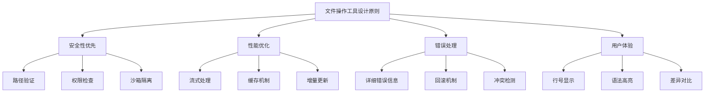
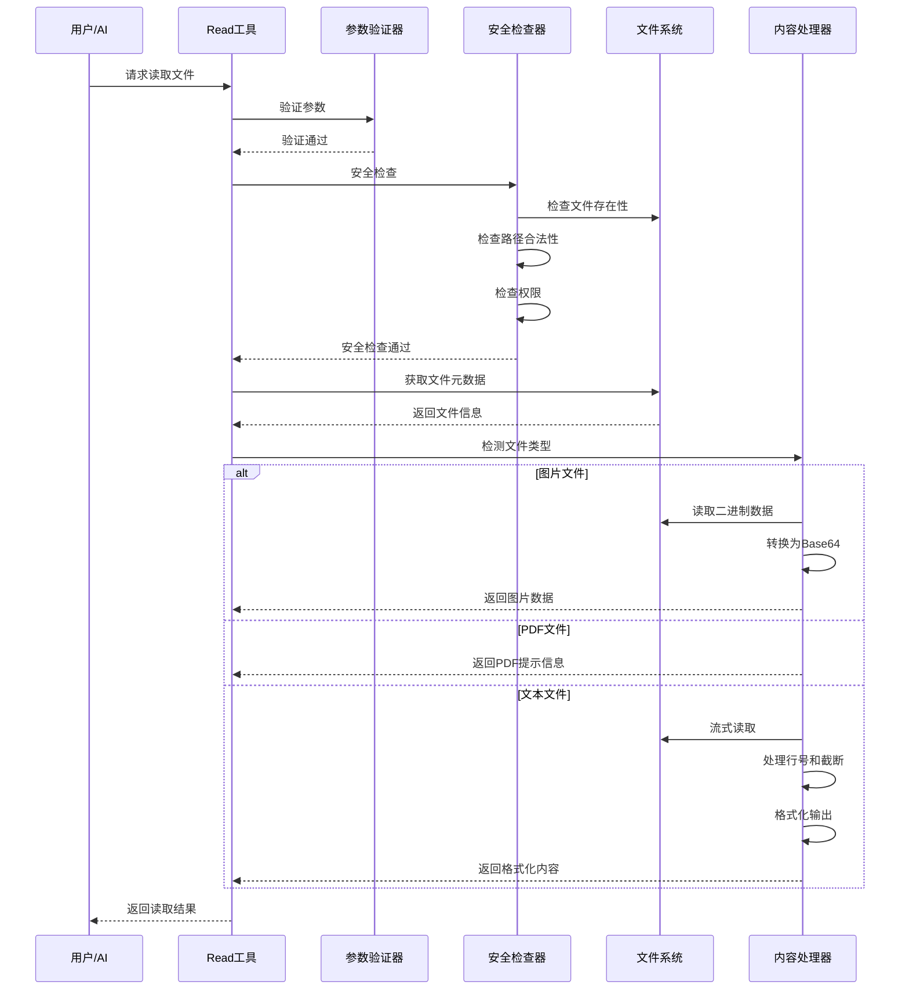
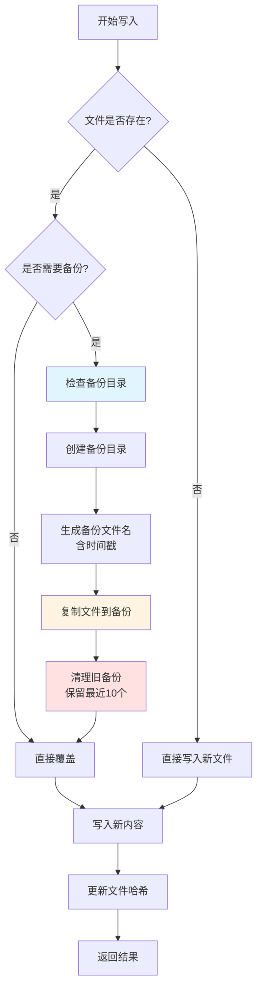
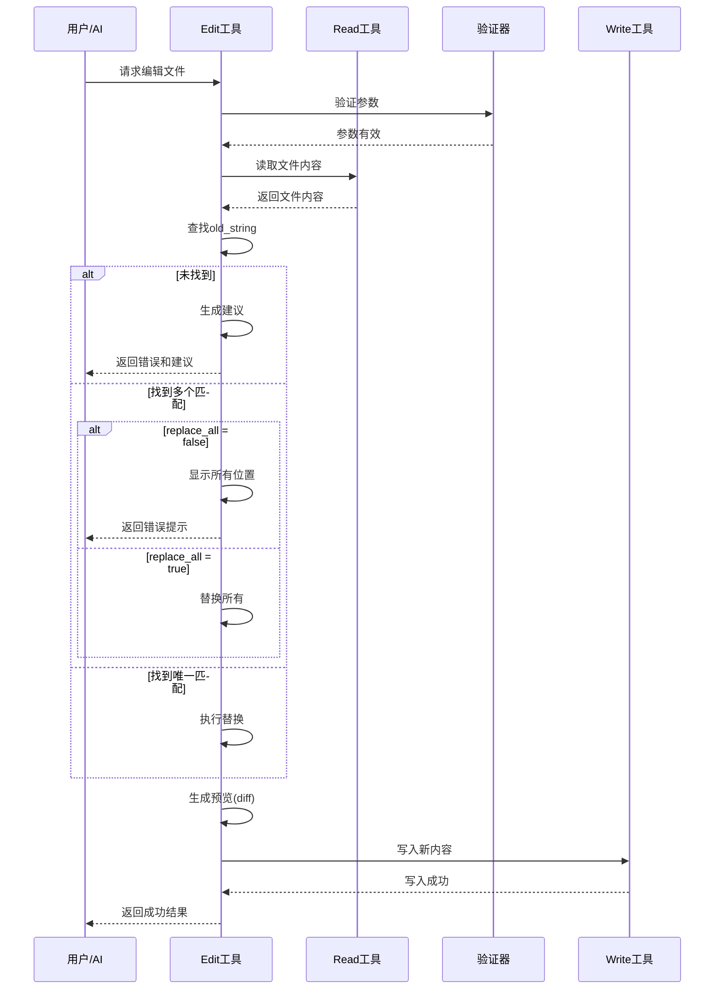
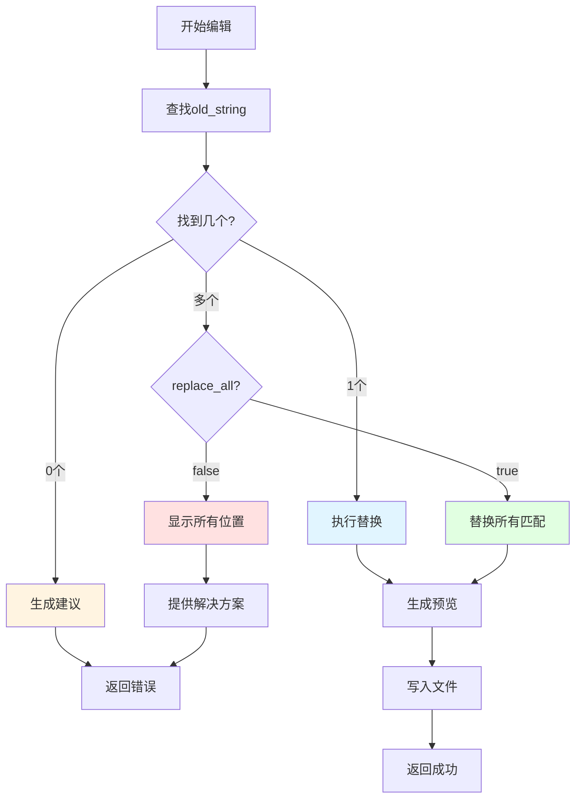
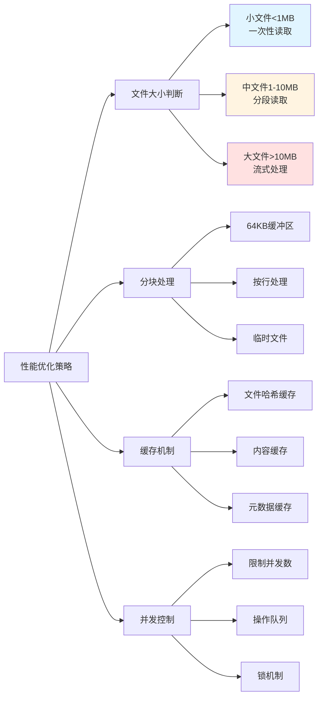
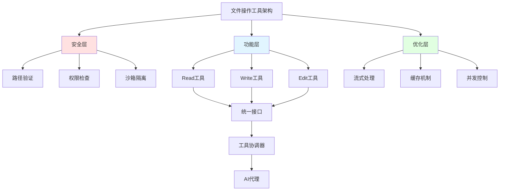

# 文件操作工具实现

## 1. 引言

文件操作是 Claude Code 最核心的功能之一，它允许 AI 代理与文件系统进行交互。本文将深入探讨三个核心文件操作工具的完整实现：Read、Write 和 Edit。我们将从基础实现到高级特性，包括安全机制、性能优化和错误处理等方面进行全面解析。

### 1.1 为什么需要专门的文件操作工具

在 AI 代码助手系统中，直接使用 Bash 命令（如 cat、echo、sed）进行文件操作存在诸多问题：

1. **权限和安全问题**：Bash 命令可能绕过安全检查
2. **错误处理困难**：难以捕获和处理各种边界情况
3. **性能问题**：大文件操作可能导致内存溢出
4. **用户体验**：缺乏统一的格式化输出和行号支持
5. **状态追踪**：无法有效追踪文件修改历史

### 1.2 核心设计原则



## 2. Read工具完整实现

Read 工具是最基础也是最常用的文件操作工具，用于读取文件内容。

### 2.1 核心接口定义

```typescript
/**
 * Read 工具参数接口
 */
interface ReadToolParams {
  /** 要读取的文件的绝对路径 */
  file_path: string;

  /** 起始行号（从1开始，可选） */
  offset?: number;

  /** 读取的行数限制（可选） */
  limit?: number;
}

/**
 * Read 工具返回结果接口
 */
interface ReadToolResult {
  /** 是否成功 */
  success: boolean;

  /** 文件内容（带行号） */
  content?: string;

  /** 文件元数据 */
  metadata?: {
    totalLines: number;
    fileSize: number;
    encoding: string;
    mimeType: string;
    readLines: number;
    truncated: boolean;
  };

  /** 错误信息 */
  error?: {
    code: string;
    message: string;
    details?: any;
  };
}
```

### 2.2 完整实现代码

```typescript
import * as fs from 'fs';
import * as path from 'path';
import * as readline from 'readline';
import { createReadStream } from 'fs';
import { promisify } from 'util';
import * as iconv from 'iconv-lite';
import * as chardet from 'chardet';

const stat = promisify(fs.stat);
const access = promisify(fs.access);

/**
 * Read 工具完整实现
 */
export class ReadTool {
  // 常量配置
  private static readonly MAX_LINE_LENGTH = 2000;
  private static readonly DEFAULT_LIMIT = 2000;
  private static readonly MAX_FILE_SIZE = 100 * 1024 * 1024; // 100MB

  // 支持的文本文件 MIME 类型
  private static readonly TEXT_MIME_TYPES = new Set([
    'text/plain',
    'text/html',
    'text/css',
    'text/javascript',
    'application/json',
    'application/xml',
    'application/javascript',
  ]);

  /**
   * 执行文件读取
   */
  async execute(params: ReadToolParams): Promise<ReadToolResult> {
    try {
      // 1. 参数验证
      this.validateParams(params);

      // 2. 安全检查
      await this.securityCheck(params.file_path);

      // 3. 文件元数据检查
      const fileInfo = await this.getFileInfo(params.file_path);

      // 4. 特殊文件类型处理
      if (fileInfo.isImage) {
        return await this.handleImageFile(params.file_path, fileInfo);
      }

      if (fileInfo.isPdf) {
        return await this.handlePdfFile(params.file_path, fileInfo);
      }

      if (fileInfo.isNotebook) {
        return await this.handleNotebookFile(params.file_path, fileInfo);
      }

      // 5. 二进制文件检测
      if (!fileInfo.isText) {
        return {
          success: false,
          error: {
            code: 'BINARY_FILE',
            message: `File appears to be binary (${fileInfo.mimeType}). Use appropriate tool for this file type.`,
          },
        };
      }

      // 6. 读取文件内容
      const result = await this.readFileContent(
        params.file_path,
        fileInfo,
        params.offset,
        params.limit
      );

      return {
        success: true,
        content: result.content,
        metadata: {
          totalLines: result.totalLines,
          fileSize: fileInfo.size,
          encoding: fileInfo.encoding,
          mimeType: fileInfo.mimeType,
          readLines: result.readLines,
          truncated: result.truncated,
        },
      };

    } catch (error) {
      return this.handleError(error);
    }
  }

  /**
   * 参数验证
   */
  private validateParams(params: ReadToolParams): void {
    if (!params.file_path) {
      throw new Error('file_path is required');
    }

    if (!path.isAbsolute(params.file_path)) {
      throw new Error('file_path must be an absolute path');
    }

    if (params.offset !== undefined && params.offset < 1) {
      throw new Error('offset must be >= 1');
    }

    if (params.limit !== undefined && params.limit < 1) {
      throw new Error('limit must be >= 1');
    }
  }

  /**
   * 安全检查
   */
  private async securityCheck(filePath: string): Promise<void> {
    // 1. 检查文件是否存在
    try {
      await access(filePath, fs.constants.F_OK);
    } catch {
      throw new Error(`File not found: ${filePath}`);
    }

    // 2. 检查读取权限
    try {
      await access(filePath, fs.constants.R_OK);
    } catch {
      throw new Error(`Permission denied: ${filePath}`);
    }

    // 3. 路径遍历攻击检查
    const allowedDirs = this.getAllowedDirectories();
    const resolvedPath = path.resolve(filePath);
    const isAllowed = allowedDirs.some(dir =>
      resolvedPath.startsWith(path.resolve(dir))
    );

    if (!isAllowed) {
      throw new Error(`Access denied: file is outside allowed directories`);
    }

    // 4. 符号链接检查
    const stats = await stat(filePath);
    if (stats.isSymbolicLink()) {
      const realPath = await fs.promises.realpath(filePath);
      const isRealPathAllowed = allowedDirs.some(dir =>
        realPath.startsWith(path.resolve(dir))
      );

      if (!isRealPathAllowed) {
        throw new Error(`Symbolic link points outside allowed directories`);
      }
    }
  }

  /**
   * 获取文件信息
   */
  private async getFileInfo(filePath: string): Promise<FileInfo> {
    const stats = await stat(filePath);

    // 检查文件大小
    if (stats.size > ReadTool.MAX_FILE_SIZE) {
      throw new Error(
        `File too large: ${stats.size} bytes (max: ${ReadTool.MAX_FILE_SIZE} bytes)`
      );
    }

    // 检测文件编码
    const encoding = await this.detectEncoding(filePath);

    // 检测 MIME 类型
    const mimeType = await this.detectMimeType(filePath);

    // 判断文件类型
    const ext = path.extname(filePath).toLowerCase();
    const isImage = ['.png', '.jpg', '.jpeg', '.gif', '.bmp', '.webp'].includes(ext);
    const isPdf = ext === '.pdf';
    const isNotebook = ext === '.ipynb';
    const isText = ReadTool.TEXT_MIME_TYPES.has(mimeType) ||
                   encoding !== 'binary';

    return {
      size: stats.size,
      encoding,
      mimeType,
      isImage,
      isPdf,
      isNotebook,
      isText,
      extension: ext,
    };
  }

  /**
   * 检测文件编码
   */
  private async detectEncoding(filePath: string): Promise<string> {
    const buffer = Buffer.alloc(4096);
    const fd = await fs.promises.open(filePath, 'r');

    try {
      const { bytesRead } = await fd.read(buffer, 0, 4096, 0);
      const sample = buffer.slice(0, bytesRead);

      // 使用 chardet 检测编码
      const detected = chardet.detect(sample);
      return detected || 'utf-8';
    } finally {
      await fd.close();
    }
  }

  /**
   * 检测 MIME 类型
   */
  private async detectMimeType(filePath: string): Promise<string> {
    // 简化版本，实际应该使用 file-type 或 mime-types 库
    const ext = path.extname(filePath).toLowerCase();
    const mimeMap: Record<string, string> = {
      '.txt': 'text/plain',
      '.js': 'text/javascript',
      '.ts': 'text/typescript',
      '.json': 'application/json',
      '.html': 'text/html',
      '.css': 'text/css',
      '.md': 'text/markdown',
      '.java': 'text/x-java',
      '.py': 'text/x-python',
      // ... 更多类型
    };

    return mimeMap[ext] || 'application/octet-stream';
  }

  /**
   * 读取文件内容（核心逻辑）
   */
  private async readFileContent(
    filePath: string,
    fileInfo: FileInfo,
    offset?: number,
    limit?: number
  ): Promise<ReadResult> {
    const startLine = offset || 1;
    const maxLines = limit || ReadTool.DEFAULT_LIMIT;

    const lines: string[] = [];
    let totalLines = 0;
    let currentLine = 0;
    let truncated = false;

    // 使用流式读取处理大文件
    const stream = createReadStream(filePath, {
      encoding: fileInfo.encoding === 'utf-8' ? 'utf-8' : undefined,
    });

    // 如果不是 UTF-8，需要转码
    let readStream = stream;
    if (fileInfo.encoding !== 'utf-8' && fileInfo.encoding !== 'ascii') {
      readStream = stream.pipe(iconv.decodeStream(fileInfo.encoding));
    }

    const rl = readline.createInterface({
      input: readStream,
      crlfDelay: Infinity,
    });

    for await (const line of rl) {
      totalLines++;
      currentLine++;

      // 跳过 offset 之前的行
      if (currentLine < startLine) {
        continue;
      }

      // 检查是否已达到限制
      if (lines.length >= maxLines) {
        truncated = true;
        break;
      }

      // 截断过长的行
      let processedLine = line;
      if (line.length > ReadTool.MAX_LINE_LENGTH) {
        processedLine = line.substring(0, ReadTool.MAX_LINE_LENGTH) +
                       ' ... [truncated]';
      }

      lines.push(processedLine);
    }

    // 格式化输出（带行号）
    const content = this.formatWithLineNumbers(lines, startLine);

    return {
      content,
      totalLines,
      readLines: lines.length,
      truncated,
    };
  }

  /**
   * 格式化输出（cat -n 格式）
   */
  private formatWithLineNumbers(lines: string[], startLine: number): string {
    if (lines.length === 0) {
      return '(empty file)';
    }

    const maxLineNum = startLine + lines.length - 1;
    const lineNumWidth = maxLineNum.toString().length;

    return lines.map((line, index) => {
      const lineNum = (startLine + index).toString().padStart(lineNumWidth, ' ');
      return `${lineNum}\t${line}`;
    }).join('\n');
  }

  /**
   * 处理图片文件
   */
  private async handleImageFile(
    filePath: string,
    fileInfo: FileInfo
  ): Promise<ReadToolResult> {
    // 读取图片并转换为 base64
    const imageBuffer = await fs.promises.readFile(filePath);
    const base64 = imageBuffer.toString('base64');
    const dataUrl = `data:${fileInfo.mimeType};base64,${base64}`;

    return {
      success: true,
      content: `[Image file: ${path.basename(filePath)}]`,
      metadata: {
        totalLines: 0,
        fileSize: fileInfo.size,
        encoding: 'binary',
        mimeType: fileInfo.mimeType,
        readLines: 0,
        truncated: false,
        imageData: dataUrl,
      } as any,
    };
  }

  /**
   * 处理 PDF 文件
   */
  private async handlePdfFile(
    filePath: string,
    fileInfo: FileInfo
  ): Promise<ReadToolResult> {
    // 这里应该集成 PDF 解析库（如 pdf-parse）
    return {
      success: true,
      content: `[PDF file: ${path.basename(filePath)}]\nUse a PDF reader tool to view this file.`,
      metadata: {
        totalLines: 0,
        fileSize: fileInfo.size,
        encoding: 'binary',
        mimeType: fileInfo.mimeType,
        readLines: 0,
        truncated: false,
      },
    };
  }

  /**
   * 处理 Jupyter Notebook 文件
   */
  private async handleNotebookFile(
    filePath: string,
    fileInfo: FileInfo
  ): Promise<ReadToolResult> {
    const content = await fs.promises.readFile(filePath, 'utf-8');
    const notebook = JSON.parse(content);

    // 格式化 notebook 内容
    const formattedContent = this.formatNotebook(notebook);

    return {
      success: true,
      content: formattedContent,
      metadata: {
        totalLines: formattedContent.split('\n').length,
        fileSize: fileInfo.size,
        encoding: 'utf-8',
        mimeType: 'application/x-ipynb+json',
        readLines: formattedContent.split('\n').length,
        truncated: false,
      },
    };
  }

  /**
   * 格式化 Notebook
   */
  private formatNotebook(notebook: any): string {
    let output = `Jupyter Notebook (${notebook.metadata?.kernelspec?.display_name || 'Unknown kernel'})\n\n`;

    notebook.cells.forEach((cell: any, index: number) => {
      output += `[Cell ${index + 1}] Type: ${cell.cell_type}\n`;
      output += '─'.repeat(60) + '\n';

      // 输出源代码
      if (cell.source) {
        const source = Array.isArray(cell.source)
          ? cell.source.join('')
          : cell.source;
        output += source + '\n';
      }

      // 输出执行结果
      if (cell.outputs && cell.outputs.length > 0) {
        output += '\nOutput:\n';
        cell.outputs.forEach((out: any) => {
          if (out.text) {
            const text = Array.isArray(out.text)
              ? out.text.join('')
              : out.text;
            output += text + '\n';
          }
        });
      }

      output += '\n';
    });

    return output;
  }

  /**
   * 错误处理
   */
  private handleError(error: any): ReadToolResult {
    let code = 'UNKNOWN_ERROR';
    let message = error.message || 'An unknown error occurred';

    if (error.code === 'ENOENT') {
      code = 'FILE_NOT_FOUND';
      message = 'File not found';
    } else if (error.code === 'EACCES') {
      code = 'PERMISSION_DENIED';
      message = 'Permission denied';
    } else if (error.code === 'EISDIR') {
      code = 'IS_DIRECTORY';
      message = 'Path is a directory, not a file';
    }

    return {
      success: false,
      error: {
        code,
        message,
        details: error,
      },
    };
  }

  /**
   * 获取允许的目录列表
   */
  private getAllowedDirectories(): string[] {
    // 从配置或环境变量中获取
    return [
      process.cwd(),
      '/tmp',
      // ... 其他允许的目录
    ];
  }
}

/**
 * 文件信息接口
 */
interface FileInfo {
  size: number;
  encoding: string;
  mimeType: string;
  isImage: boolean;
  isPdf: boolean;
  isNotebook: boolean;
  isText: boolean;
  extension: string;
}

/**
 * 读取结果接口
 */
interface ReadResult {
  content: string;
  totalLines: number;
  readLines: number;
  truncated: boolean;
}
```

### 2.3 工作流程图



### 2.4 使用示例

```typescript
// 示例 1: 基本读取
const readTool = new ReadTool();
const result1 = await readTool.execute({
  file_path: '/path/to/file.ts'
});
console.log(result1.content);

// 示例 2: 分页读取
const result2 = await readTool.execute({
  file_path: '/path/to/large-file.log',
  offset: 100,  // 从第100行开始
  limit: 50     // 读取50行
});

// 示例 3: 读取图片
const result3 = await readTool.execute({
  file_path: '/path/to/image.png'
});
// 返回 base64 编码的图片数据

// 示例 4: 读取 Jupyter Notebook
const result4 = await readTool.execute({
  file_path: '/path/to/notebook.ipynb'
});
// 返回格式化的 notebook 内容
```

## 3. Write工具完整实现

Write 工具用于创建新文件或覆盖现有文件，是文件修改操作的核心工具。

### 3.1 核心接口定义

```typescript
/**
 * Write 工具参数接口
 */
interface WriteToolParams {
  /** 要写入的文件的绝对路径 */
  file_path: string;

  /** 要写入的内容 */
  content: string;

  /** 是否创建备份（默认true） */
  create_backup?: boolean;

  /** 编码格式（默认utf-8） */
  encoding?: string;
}

/**
 * Write 工具返回结果接口
 */
interface WriteToolResult {
  success: boolean;
  message?: string;
  backupPath?: string;
  metadata?: {
    bytesWritten: number;
    linesWritten: number;
    wasCreated: boolean;
    wasOverwritten: boolean;
  };
  error?: {
    code: string;
    message: string;
    details?: any;
  };
}
```

### 3.2 完整实现代码

```typescript
import * as fs from 'fs';
import * as path from 'path';
import { promisify } from 'util';
import * as crypto from 'crypto';

const stat = promisify(fs.stat);
const access = promisify(fs.access);
const mkdir = promisify(fs.mkdir);
const writeFile = promisify(fs.writeFile);
const copyFile = promisify(fs.copyFile);

/**
 * Write 工具完整实现
 */
export class WriteTool {
  // 常量配置
  private static readonly MAX_FILE_SIZE = 10 * 1024 * 1024; // 10MB
  private static readonly BACKUP_DIR = '.claude-backups';

  // 文件历史记录（用于必读检查）
  private fileReadHistory: Map<string, string> = new Map();

  /**
   * 执行文件写入
   */
  async execute(params: WriteToolParams): Promise<WriteToolResult> {
    try {
      // 1. 参数验证
      this.validateParams(params);

      // 2. 安全检查
      await this.securityCheck(params.file_path);

      // 3. 检查文件是否存在
      const fileExists = await this.fileExists(params.file_path);

      // 4. 如果是现有文件，进行必读检查
      if (fileExists) {
        await this.enforceReadBeforeWrite(params.file_path);
      }

      // 5. 创建备份（如果需要）
      let backupPath: string | undefined;
      if (fileExists && params.create_backup !== false) {
        backupPath = await this.createBackup(params.file_path);
      }

      // 6. 确保目录存在
      await this.ensureDirectoryExists(path.dirname(params.file_path));

      // 7. 写入文件
      const metadata = await this.writeFileContent(
        params.file_path,
        params.content,
        params.encoding || 'utf-8'
      );

      // 8. 更新文件哈希（用于后续的必读检查）
      await this.updateFileHash(params.file_path);

      return {
        success: true,
        message: fileExists
          ? `File overwritten: ${params.file_path}`
          : `File created: ${params.file_path}`,
        backupPath,
        metadata: {
          ...metadata,
          wasCreated: !fileExists,
          wasOverwritten: fileExists,
        },
      };

    } catch (error) {
      return this.handleError(error);
    }
  }

  /**
   * 参数验证
   */
  private validateParams(params: WriteToolParams): void {
    if (!params.file_path) {
      throw new Error('file_path is required');
    }

    if (!path.isAbsolute(params.file_path)) {
      throw new Error('file_path must be an absolute path');
    }

    if (params.content === undefined || params.content === null) {
      throw new Error('content is required');
    }

    // 检查内容大小
    const contentSize = Buffer.byteLength(params.content, 'utf-8');
    if (contentSize > WriteTool.MAX_FILE_SIZE) {
      throw new Error(
        `Content too large: ${contentSize} bytes (max: ${WriteTool.MAX_FILE_SIZE} bytes)`
      );
    }

    // 验证编码
    if (params.encoding && !Buffer.isEncoding(params.encoding)) {
      throw new Error(`Invalid encoding: ${params.encoding}`);
    }
  }

  /**
   * 安全检查
   */
  private async securityCheck(filePath: string): Promise<void> {
    // 1. 路径遍历攻击检查
    const allowedDirs = this.getAllowedDirectories();
    const resolvedPath = path.resolve(filePath);
    const isAllowed = allowedDirs.some(dir =>
      resolvedPath.startsWith(path.resolve(dir))
    );

    if (!isAllowed) {
      throw new Error(`Access denied: file is outside allowed directories`);
    }

    // 2. 检查父目录的写权限
    const parentDir = path.dirname(filePath);
    try {
      await access(parentDir, fs.constants.W_OK);
    } catch {
      throw new Error(`Permission denied: cannot write to ${parentDir}`);
    }

    // 3. 检查是否为受保护的文件
    const protectedFiles = this.getProtectedFiles();
    if (protectedFiles.some(pattern => this.matchPattern(filePath, pattern))) {
      throw new Error(`Cannot modify protected file: ${filePath}`);
    }

    // 4. 检查文件扩展名
    const dangerousExts = ['.exe', '.dll', '.so', '.dylib', '.sh'];
    const ext = path.extname(filePath).toLowerCase();
    if (dangerousExts.includes(ext)) {
      console.warn(`Warning: Writing potentially dangerous file type: ${ext}`);
    }
  }

  /**
   * 检查文件是否存在
   */
  private async fileExists(filePath: string): Promise<boolean> {
    try {
      await access(filePath, fs.constants.F_OK);
      return true;
    } catch {
      return false;
    }
  }

  /**
   * 强制读取检查（必读机制）
   */
  private async enforceReadBeforeWrite(filePath: string): Promise<void> {
    // 计算当前文件的哈希值
    const currentHash = await this.calculateFileHash(filePath);

    // 检查是否已读取过该文件
    const lastReadHash = this.fileReadHistory.get(filePath);

    if (!lastReadHash || lastReadHash !== currentHash) {
      throw new Error(
        `You must read the file before writing to it. Use the Read tool first: ${filePath}`
      );
    }
  }

  /**
   * 计算文件哈希值
   */
  private async calculateFileHash(filePath: string): Promise<string> {
    const content = await fs.promises.readFile(filePath);
    return crypto.createHash('sha256').update(content).digest('hex');
  }

  /**
   * 更新文件哈希（记录已读取的文件）
   */
  private async updateFileHash(filePath: string): Promise<void> {
    const hash = await this.calculateFileHash(filePath);
    this.fileReadHistory.set(filePath, hash);
  }

  /**
   * 记录文件已被读取（由 Read 工具调用）
   */
  public async recordFileRead(filePath: string): Promise<void> {
    const hash = await this.calculateFileHash(filePath);
    this.fileReadHistory.set(filePath, hash);
  }

  /**
   * 创建备份
   */
  private async createBackup(filePath: string): Promise<string> {
    const backupDir = path.join(
      path.dirname(filePath),
      WriteTool.BACKUP_DIR
    );

    // 确保备份目录存在
    await this.ensureDirectoryExists(backupDir);

    // 生成备份文件名（包含时间戳）
    const timestamp = new Date().toISOString().replace(/[:.]/g, '-');
    const fileName = path.basename(filePath);
    const backupPath = path.join(backupDir, `${fileName}.${timestamp}.backup`);

    // 复制文件
    await copyFile(filePath, backupPath);

    // 清理旧备份（保留最近10个）
    await this.cleanupOldBackups(backupDir, fileName);

    return backupPath;
  }

  /**
   * 清理旧备份
   */
  private async cleanupOldBackups(
    backupDir: string,
    fileName: string
  ): Promise<void> {
    const files = await fs.promises.readdir(backupDir);
    const backups = files
      .filter(f => f.startsWith(fileName))
      .map(f => ({
        name: f,
        path: path.join(backupDir, f),
        stat: fs.statSync(path.join(backupDir, f)),
      }))
      .sort((a, b) => b.stat.mtimeMs - a.stat.mtimeMs);

    // 保留最近10个备份，删除其余的
    const toDelete = backups.slice(10);
    for (const backup of toDelete) {
      await fs.promises.unlink(backup.path);
    }
  }

  /**
   * 确保目录存在
   */
  private async ensureDirectoryExists(dirPath: string): Promise<void> {
    try {
      await access(dirPath, fs.constants.F_OK);
    } catch {
      await mkdir(dirPath, { recursive: true });
    }
  }

  /**
   * 写入文件内容
   */
  private async writeFileContent(
    filePath: string,
    content: string,
    encoding: string
  ): Promise<{ bytesWritten: number; linesWritten: number }> {
    // 写入文件
    await writeFile(filePath, content, encoding as BufferEncoding);

    // 计算统计信息
    const bytesWritten = Buffer.byteLength(content, encoding as BufferEncoding);
    const linesWritten = content.split('\n').length;

    return {
      bytesWritten,
      linesWritten,
    };
  }

  /**
   * 获取受保护的文件列表
   */
  private getProtectedFiles(): string[] {
    return [
      '**/.git/**',
      '**/node_modules/**',
      '**/.env',
      '**/.env.*',
      '**/package-lock.json',
      '**/yarn.lock',
      '**/pnpm-lock.yaml',
    ];
  }

  /**
   * 模式匹配
   */
  private matchPattern(filePath: string, pattern: string): boolean {
    // 简化版本，实际应该使用 micromatch 库
    const regexPattern = pattern
      .replace(/\*\*/g, '.*')
      .replace(/\*/g, '[^/]*')
      .replace(/\?/g, '.');

    return new RegExp(regexPattern).test(filePath);
  }

  /**
   * 获取允许的目录列表
   */
  private getAllowedDirectories(): string[] {
    return [
      process.cwd(),
      '/tmp',
    ];
  }

  /**
   * 错误处理
   */
  private handleError(error: any): WriteToolResult {
    let code = 'UNKNOWN_ERROR';
    let message = error.message || 'An unknown error occurred';

    if (error.code === 'EACCES') {
      code = 'PERMISSION_DENIED';
      message = 'Permission denied';
    } else if (error.code === 'ENOSPC') {
      code = 'NO_SPACE';
      message = 'No space left on device';
    } else if (error.code === 'EISDIR') {
      code = 'IS_DIRECTORY';
      message = 'Path is a directory, not a file';
    }

    return {
      success: false,
      error: {
        code,
        message,
        details: error,
      },
    };
  }
}
```

### 3.3 备份机制流程图



### 3.4 使用示例

```typescript
// 示例 1: 创建新文件
const writeTool = new WriteTool();
const result1 = await writeTool.execute({
  file_path: '/path/to/new-file.ts',
  content: 'export const greeting = "Hello World";'
});
console.log(result1.message); // "File created: /path/to/new-file.ts"

// 示例 2: 覆盖现有文件（需要先读取）
const readTool = new ReadTool();
await readTool.execute({ file_path: '/path/to/existing-file.ts' });

const result2 = await writeTool.execute({
  file_path: '/path/to/existing-file.ts',
  content: 'export const greeting = "Hello Claude";',
  create_backup: true
});
console.log(result2.backupPath); // 备份文件路径

// 示例 3: 不创建备份
const result3 = await writeTool.execute({
  file_path: '/path/to/temp-file.txt',
  content: 'Temporary content',
  create_backup: false
});

// 示例 4: 指定编码
const result4 = await writeTool.execute({
  file_path: '/path/to/file.txt',
  content: '中文内容',
  encoding: 'utf-8'
});
```

## 4. Edit工具完整实现

Edit 工具是最复杂的文件操作工具，用于精确地替换文件中的特定内容。

### 4.1 核心接口定义

```typescript
/**
 * Edit 工具参数接口
 */
interface EditToolParams {
  /** 要编辑的文件的绝对路径 */
  file_path: string;

  /** 要替换的旧字符串 */
  old_string: string;

  /** 新字符串 */
  new_string: string;

  /** 是否替换所有匹配项（默认false，只替换第一个） */
  replace_all?: boolean;
}

/**
 * Edit 工具返回结果接口
 */
interface EditToolResult {
  success: boolean;
  message?: string;
  replacements?: number;
  preview?: {
    before: string;
    after: string;
  };
  error?: {
    code: string;
    message: string;
    details?: any;
    suggestions?: string[];
  };
}
```

### 4.2 完整实现代码

```typescript
import * as fs from 'fs';
import * as path from 'path';
import { promisify } from 'util';
import * as diffLib from 'diff';

const readFile = promisify(fs.readFile);
const writeFile = promisify(fs.writeFile);

/**
 * Edit 工具完整实现
 */
export class EditTool {
  // 常量配置
  private static readonly CONTEXT_LINES = 3;
  private static readonly MAX_FILE_SIZE = 10 * 1024 * 1024; // 10MB

  // 依赖的其他工具
  private readTool: ReadTool;
  private writeTool: WriteTool;

  constructor(readTool: ReadTool, writeTool: WriteTool) {
    this.readTool = readTool;
    this.writeTool = writeTool;
  }

  /**
   * 执行文件编辑
   */
  async execute(params: EditToolParams): Promise<EditToolResult> {
    try {
      // 1. 参数验证
      this.validateParams(params);

      // 2. 读取文件内容
      const content = await this.readFileContent(params.file_path);

      // 3. 检查 old_string 是否存在
      if (!content.includes(params.old_string)) {
        return this.handleNotFound(params, content);
      }

      // 4. 检查唯一性（如果 replace_all 为 false）
      if (!params.replace_all) {
        const occurrences = this.countOccurrences(content, params.old_string);
        if (occurrences > 1) {
          return this.handleMultipleMatches(params, content, occurrences);
        }
      }

      // 5. 执行替换
      const newContent = params.replace_all
        ? this.replaceAll(content, params.old_string, params.new_string)
        : this.replaceFirst(content, params.old_string, params.new_string);

      // 6. 检查是否有实际变化
      if (content === newContent) {
        return {
          success: false,
          error: {
            code: 'NO_CHANGE',
            message: 'new_string must be different from old_string',
          },
        };
      }

      // 7. 生成预览
      const preview = this.generatePreview(content, newContent, params.old_string);

      // 8. 写入文件
      await this.writeTool.execute({
        file_path: params.file_path,
        content: newContent,
      });

      // 9. 统计替换次数
      const replacements = params.replace_all
        ? this.countOccurrences(content, params.old_string)
        : 1;

      return {
        success: true,
        message: `Successfully replaced ${replacements} occurrence(s) in ${params.file_path}`,
        replacements,
        preview,
      };

    } catch (error) {
      return this.handleError(error);
    }
  }

  /**
   * 参数验证
   */
  private validateParams(params: EditToolParams): void {
    if (!params.file_path) {
      throw new Error('file_path is required');
    }

    if (!path.isAbsolute(params.file_path)) {
      throw new Error('file_path must be an absolute path');
    }

    if (params.old_string === undefined || params.old_string === null) {
      throw new Error('old_string is required');
    }

    if (params.new_string === undefined || params.new_string === null) {
      throw new Error('new_string is required');
    }

    if (params.old_string === params.new_string) {
      throw new Error('old_string and new_string must be different');
    }

    if (params.old_string === '') {
      throw new Error('old_string cannot be empty');
    }
  }

  /**
   * 读取文件内容
   */
  private async readFileContent(filePath: string): Promise<string> {
    const result = await this.readTool.execute({ file_path: filePath });

    if (!result.success) {
      throw new Error(result.error?.message || 'Failed to read file');
    }

    // 移除行号前缀
    const content = this.removeLineNumbers(result.content!);

    return content;
  }

  /**
   * 移除行号前缀
   */
  private removeLineNumbers(content: string): string {
    return content
      .split('\n')
      .map(line => {
        // 匹配格式: "   123\t内容"
        const match = line.match(/^\s*\d+\t(.*)$/);
        return match ? match[1] : line;
      })
      .join('\n');
  }

  /**
   * 统计出现次数
   */
  private countOccurrences(content: string, searchString: string): number {
    let count = 0;
    let pos = 0;

    while ((pos = content.indexOf(searchString, pos)) !== -1) {
      count++;
      pos += searchString.length;
    }

    return count;
  }

  /**
   * 替换第一个匹配项
   */
  private replaceFirst(
    content: string,
    oldString: string,
    newString: string
  ): string {
    const index = content.indexOf(oldString);
    if (index === -1) {
      return content;
    }

    return (
      content.substring(0, index) +
      newString +
      content.substring(index + oldString.length)
    );
  }

  /**
   * 替换所有匹配项
   */
  private replaceAll(
    content: string,
    oldString: string,
    newString: string
  ): string {
    // 注意：需要转义特殊字符
    const escapedOld = this.escapeRegExp(oldString);
    return content.replace(new RegExp(escapedOld, 'g'), newString);
  }

  /**
   * 转义正则表达式特殊字符
   */
  private escapeRegExp(string: string): string {
    return string.replace(/[.*+?^${}()|[\]\\]/g, '\\$&');
  }

  /**
   * 生成预览（diff格式）
   */
  private generatePreview(
    oldContent: string,
    newContent: string,
    searchString: string
  ): { before: string; after: string } {
    // 找到修改位置
    const oldLines = oldContent.split('\n');
    const newLines = newContent.split('\n');

    // 使用 diff 库生成差异
    const diff = diffLib.diffLines(oldContent, newContent);

    // 提取修改上下文
    let beforeLines: string[] = [];
    let afterLines: string[] = [];
    let lineNum = 0;

    for (const part of diff) {
      const lines = part.value.split('\n').filter(l => l !== '');

      if (part.removed) {
        beforeLines = beforeLines.concat(
          lines.map(l => `- ${l}`)
        );
      } else if (part.added) {
        afterLines = afterLines.concat(
          lines.map(l => `+ ${l}`)
        );
      } else {
        // 上下文行
        const contextLines = lines.slice(-EditTool.CONTEXT_LINES);
        beforeLines = beforeLines.concat(
          contextLines.map(l => `  ${l}`)
        );
        afterLines = afterLines.concat(
          contextLines.map(l => `  ${l}`)
        );
      }
    }

    return {
      before: beforeLines.slice(-10).join('\n'),
      after: afterLines.slice(-10).join('\n'),
    };
  }

  /**
   * 处理未找到的情况
   */
  private handleNotFound(
    params: EditToolParams,
    content: string
  ): EditToolResult {
    // 生成建议
    const suggestions = this.generateSuggestions(params.old_string, content);

    return {
      success: false,
      error: {
        code: 'STRING_NOT_FOUND',
        message: `The string to replace was not found in ${params.file_path}`,
        details: {
          searchString: params.old_string,
          fileLength: content.length,
        },
        suggestions,
      },
    };
  }

  /**
   * 处理多个匹配项的情况
   */
  private handleMultipleMatches(
    params: EditToolParams,
    content: string,
    occurrences: number
  ): EditToolResult {
    // 显示所有匹配位置
    const locations = this.findAllLocations(content, params.old_string);

    return {
      success: false,
      error: {
        code: 'MULTIPLE_MATCHES',
        message: `Found ${occurrences} occurrences of the string. Either provide more context to make it unique, or use replace_all: true`,
        details: {
          occurrences,
          locations: locations.map(loc => ({
            line: loc.line,
            column: loc.column,
            context: loc.context,
          })),
        },
        suggestions: [
          'Provide more surrounding context in old_string to make it unique',
          'Use replace_all: true to replace all occurrences',
          'Specify the exact line number range using Read tool with offset/limit',
        ],
      },
    };
  }

  /**
   * 查找所有匹配位置
   */
  private findAllLocations(
    content: string,
    searchString: string
  ): Array<{ line: number; column: number; context: string }> {
    const lines = content.split('\n');
    const locations: Array<{ line: number; column: number; context: string }> = [];

    lines.forEach((line, lineIndex) => {
      let columnIndex = 0;
      while ((columnIndex = line.indexOf(searchString, columnIndex)) !== -1) {
        // 提取上下文（前后各2行）
        const startLine = Math.max(0, lineIndex - 2);
        const endLine = Math.min(lines.length, lineIndex + 3);
        const contextLines = lines.slice(startLine, endLine);

        locations.push({
          line: lineIndex + 1,
          column: columnIndex + 1,
          context: contextLines.join('\n'),
        });

        columnIndex += searchString.length;
      }
    });

    return locations;
  }

  /**
   * 生成建议（模糊匹配）
   */
  private generateSuggestions(
    searchString: string,
    content: string
  ): string[] {
    const suggestions: string[] = [];

    // 1. 尝试忽略空白字符的匹配
    const normalizedSearch = this.normalizeWhitespace(searchString);
    const normalizedContent = this.normalizeWhitespace(content);

    if (normalizedContent.includes(normalizedSearch)) {
      suggestions.push(
        'The string exists but with different whitespace. Check spaces, tabs, and line endings.'
      );
    }

    // 2. 尝试查找相似的字符串（使用编辑距离）
    const similar = this.findSimilarStrings(searchString, content, 0.8);
    if (similar.length > 0) {
      suggestions.push(
        `Similar strings found: ${similar.slice(0, 3).map(s => `"${s}"`).join(', ')}`
      );
    }

    // 3. 检查是否包含部分内容
    const words = searchString.split(/\s+/);
    const foundWords = words.filter(word => content.includes(word));
    if (foundWords.length > 0 && foundWords.length < words.length) {
      suggestions.push(
        `Some parts of the string exist in the file. Found: ${foundWords.join(', ')}`
      );
    }

    // 4. 检查大小写
    if (content.toLowerCase().includes(searchString.toLowerCase())) {
      suggestions.push(
        'The string exists but with different case. Check capitalization.'
      );
    }

    return suggestions;
  }

  /**
   * 标准化空白字符
   */
  private normalizeWhitespace(str: string): string {
    return str.replace(/\s+/g, ' ').trim();
  }

  /**
   * 查找相似字符串（简化版本）
   */
  private findSimilarStrings(
    target: string,
    content: string,
    threshold: number
  ): string[] {
    const similar: string[] = [];
    const lines = content.split('\n');

    for (const line of lines) {
      // 使用简单的相似度计算
      const similarity = this.calculateSimilarity(target, line);
      if (similarity >= threshold) {
        similar.push(line.trim());
      }
    }

    return similar;
  }

  /**
   * 计算字符串相似度（Levenshtein距离）
   */
  private calculateSimilarity(str1: string, str2: string): number {
    const longer = str1.length > str2.length ? str1 : str2;
    const shorter = str1.length > str2.length ? str2 : str1;

    if (longer.length === 0) {
      return 1.0;
    }

    const editDistance = this.levenshteinDistance(longer, shorter);
    return (longer.length - editDistance) / longer.length;
  }

  /**
   * Levenshtein距离算法
   */
  private levenshteinDistance(str1: string, str2: string): number {
    const matrix: number[][] = [];

    for (let i = 0; i <= str2.length; i++) {
      matrix[i] = [i];
    }

    for (let j = 0; j <= str1.length; j++) {
      matrix[0][j] = j;
    }

    for (let i = 1; i <= str2.length; i++) {
      for (let j = 1; j <= str1.length; j++) {
        if (str2.charAt(i - 1) === str1.charAt(j - 1)) {
          matrix[i][j] = matrix[i - 1][j - 1];
        } else {
          matrix[i][j] = Math.min(
            matrix[i - 1][j - 1] + 1,
            matrix[i][j - 1] + 1,
            matrix[i - 1][j] + 1
          );
        }
      }
    }

    return matrix[str2.length][str1.length];
  }

  /**
   * 错误处理
   */
  private handleError(error: any): EditToolResult {
    return {
      success: false,
      error: {
        code: 'EDIT_ERROR',
        message: error.message || 'An error occurred during editing',
        details: error,
      },
    };
  }
}
```

### 4.3 编辑流程图



### 4.4 唯一性检查流程



### 4.5 使用示例

```typescript
// 示例 1: 基本编辑（唯一匹配）
const editTool = new EditTool(readTool, writeTool);
const result1 = await editTool.execute({
  file_path: '/path/to/file.ts',
  old_string: 'const greeting = "Hello World";',
  new_string: 'const greeting = "Hello Claude";'
});
console.log(result1.preview);

// 示例 2: 多行编辑
const result2 = await editTool.execute({
  file_path: '/path/to/file.ts',
  old_string: `function greet() {
  return "Hello";
}`,
  new_string: `function greet(name: string) {
  return \`Hello \${name}\`;
}`
});

// 示例 3: 替换所有匹配项
const result3 = await editTool.execute({
  file_path: '/path/to/file.ts',
  old_string: 'var ',
  new_string: 'const ',
  replace_all: true
});
console.log(`Replaced ${result3.replacements} occurrences`);

// 示例 4: 处理未找到的情况
const result4 = await editTool.execute({
  file_path: '/path/to/file.ts',
  old_string: 'nonexistent string',
  new_string: 'new value'
});
if (!result4.success) {
  console.log('Suggestions:', result4.error?.suggestions);
}
```

## 5. 文件监听和变更检测

为了支持并发编辑和冲突检测，我们需要实现文件监听机制。

### 5.1 文件监听器实现

```typescript
import * as chokidar from 'chokidar';
import { EventEmitter } from 'events';

/**
 * 文件变更事件
 */
interface FileChangeEvent {
  path: string;
  type: 'add' | 'change' | 'unlink';
  timestamp: number;
  hash?: string;
}

/**
 * 文件监听器
 */
export class FileWatcher extends EventEmitter {
  private watcher: chokidar.FSWatcher | null = null;
  private watchedFiles: Map<string, string> = new Map(); // path -> hash

  /**
   * 开始监听目录
   */
  watch(paths: string | string[]): void {
    this.watcher = chokidar.watch(paths, {
      persistent: true,
      ignoreInitial: false,
      awaitWriteFinish: {
        stabilityThreshold: 100,
        pollInterval: 50,
      },
      ignored: [
        '**/node_modules/**',
        '**/.git/**',
        '**/.claude-backups/**',
      ],
    });

    this.watcher
      .on('add', path => this.handleFileAdd(path))
      .on('change', path => this.handleFileChange(path))
      .on('unlink', path => this.handleFileUnlink(path));
  }

  /**
   * 停止监听
   */
  async stop(): Promise<void> {
    if (this.watcher) {
      await this.watcher.close();
      this.watcher = null;
    }
  }

  /**
   * 处理文件添加
   */
  private async handleFileAdd(path: string): Promise<void> {
    const hash = await this.calculateFileHash(path);
    this.watchedFiles.set(path, hash);

    this.emit('change', {
      path,
      type: 'add',
      timestamp: Date.now(),
      hash,
    } as FileChangeEvent);
  }

  /**
   * 处理文件修改
   */
  private async handleFileChange(path: string): Promise<void> {
    const oldHash = this.watchedFiles.get(path);
    const newHash = await this.calculateFileHash(path);

    if (oldHash !== newHash) {
      this.watchedFiles.set(path, newHash);

      this.emit('change', {
        path,
        type: 'change',
        timestamp: Date.now(),
        hash: newHash,
      } as FileChangeEvent);
    }
  }

  /**
   * 处理文件删除
   */
  private handleFileUnlink(path: string): void {
    this.watchedFiles.delete(path);

    this.emit('change', {
      path,
      type: 'unlink',
      timestamp: Date.now(),
    } as FileChangeEvent);
  }

  /**
   * 计算文件哈希
   */
  private async calculateFileHash(path: string): Promise<string> {
    const content = await fs.promises.readFile(path);
    return crypto.createHash('sha256').update(content).digest('hex');
  }

  /**
   * 检查文件是否被外部修改
   */
  async checkExternalModification(path: string): Promise<boolean> {
    const currentHash = this.watchedFiles.get(path);
    if (!currentHash) {
      return false;
    }

    try {
      const actualHash = await this.calculateFileHash(path);
      return currentHash !== actualHash;
    } catch {
      return false;
    }
  }
}
```

### 5.2 冲突检测机制

```typescript
/**
 * 冲突检测器
 */
export class ConflictDetector {
  private watcher: FileWatcher;
  private pendingOperations: Map<string, OperationInfo> = new Map();

  constructor(watcher: FileWatcher) {
    this.watcher = watcher;

    // 监听文件变更
    this.watcher.on('change', (event: FileChangeEvent) => {
      this.handleFileChange(event);
    });
  }

  /**
   * 注册待执行的操作
   */
  registerOperation(path: string, operation: 'read' | 'write' | 'edit'): string {
    const operationId = this.generateOperationId();

    this.pendingOperations.set(operationId, {
      id: operationId,
      path,
      operation,
      timestamp: Date.now(),
    });

    return operationId;
  }

  /**
   * 检查是否存在冲突
   */
  async checkConflict(operationId: string): Promise<ConflictInfo | null> {
    const operation = this.pendingOperations.get(operationId);
    if (!operation) {
      return null;
    }

    // 检查是否有其他进程修改了文件
    const isModified = await this.watcher.checkExternalModification(operation.path);

    if (isModified) {
      return {
        type: 'external_modification',
        message: `File ${operation.path} was modified externally`,
        suggestion: 'Re-read the file before making changes',
      };
    }

    // 检查是否有并发操作
    const concurrentOps = Array.from(this.pendingOperations.values())
      .filter(op =>
        op.id !== operationId &&
        op.path === operation.path &&
        op.operation !== 'read'
      );

    if (concurrentOps.length > 0) {
      return {
        type: 'concurrent_operation',
        message: `Concurrent ${concurrentOps[0].operation} operation detected on ${operation.path}`,
        suggestion: 'Wait for other operations to complete',
      };
    }

    return null;
  }

  /**
   * 完成操作
   */
  completeOperation(operationId: string): void {
    this.pendingOperations.delete(operationId);
  }

  /**
   * 处理文件变更
   */
  private handleFileChange(event: FileChangeEvent): void {
    // 通知所有相关的待执行操作
    for (const [id, operation] of this.pendingOperations) {
      if (operation.path === event.path) {
        console.warn(
          `File ${event.path} changed while operation ${id} is pending`
        );
      }
    }
  }

  /**
   * 生成操作ID
   */
  private generateOperationId(): string {
    return `op_${Date.now()}_${Math.random().toString(36).substr(2, 9)}`;
  }
}

interface OperationInfo {
  id: string;
  path: string;
  operation: 'read' | 'write' | 'edit';
  timestamp: number;
}

interface ConflictInfo {
  type: 'external_modification' | 'concurrent_operation';
  message: string;
  suggestion: string;
}
```

## 6. 安全沙箱机制

### 6.1 路径验证器

```typescript
/**
 * 路径验证器
 */
export class PathValidator {
  private allowedDirs: Set<string>;
  private deniedDirs: Set<string>;
  private allowedExtensions: Set<string>;
  private deniedExtensions: Set<string>;

  constructor(config: PathValidatorConfig) {
    this.allowedDirs = new Set(config.allowedDirs.map(d => path.resolve(d)));
    this.deniedDirs = new Set(config.deniedDirs.map(d => path.resolve(d)));
    this.allowedExtensions = new Set(config.allowedExtensions);
    this.deniedExtensions = new Set(config.deniedExtensions);
  }

  /**
   * 验证路径是否安全
   */
  validate(filePath: string): ValidationResult {
    const resolvedPath = path.resolve(filePath);

    // 1. 检查路径遍历攻击
    if (this.containsPathTraversal(filePath)) {
      return {
        valid: false,
        reason: 'Path traversal detected',
      };
    }

    // 2. 检查是否在允许的目录内
    const isInAllowedDir = Array.from(this.allowedDirs).some(dir =>
      resolvedPath.startsWith(dir)
    );

    if (!isInAllowedDir) {
      return {
        valid: false,
        reason: 'Path is outside allowed directories',
      };
    }

    // 3. 检查是否在禁止的目录内
    const isInDeniedDir = Array.from(this.deniedDirs).some(dir =>
      resolvedPath.startsWith(dir)
    );

    if (isInDeniedDir) {
      return {
        valid: false,
        reason: 'Path is in a denied directory',
      };
    }

    // 4. 检查文件扩展名
    const ext = path.extname(filePath).toLowerCase();

    if (this.deniedExtensions.has(ext)) {
      return {
        valid: false,
        reason: `File extension ${ext} is not allowed`,
      };
    }

    if (this.allowedExtensions.size > 0 && !this.allowedExtensions.has(ext)) {
      return {
        valid: false,
        reason: `File extension ${ext} is not in allowed list`,
      };
    }

    return {
      valid: true,
    };
  }

  /**
   * 检查路径遍历
   */
  private containsPathTraversal(filePath: string): boolean {
    const normalized = path.normalize(filePath);
    return normalized.includes('..') || normalized !== filePath;
  }
}

interface PathValidatorConfig {
  allowedDirs: string[];
  deniedDirs: string[];
  allowedExtensions: string[];
  deniedExtensions: string[];
}

interface ValidationResult {
  valid: boolean;
  reason?: string;
}
```

### 6.2 权限检查器

```typescript
/**
 * 权限检查器
 */
export class PermissionChecker {
  /**
   * 检查文件权限
   */
  async check(
    filePath: string,
    operation: 'read' | 'write' | 'execute'
  ): Promise<PermissionResult> {
    try {
      const stats = await stat(filePath);

      // 检查基本权限
      const hasPermission = await this.hasPermission(filePath, operation);
      if (!hasPermission) {
        return {
          allowed: false,
          reason: `No ${operation} permission for ${filePath}`,
        };
      }

      // 检查文件所有权
      const isOwner = stats.uid === process.getuid();

      // 检查特殊文件
      if (stats.isSocket() || stats.isBlockDevice() || stats.isCharacterDevice()) {
        return {
          allowed: false,
          reason: 'Cannot operate on special files',
        };
      }

      return {
        allowed: true,
        isOwner,
      };

    } catch (error: any) {
      if (error.code === 'ENOENT') {
        // 文件不存在，对于写操作可能是创建新文件
        if (operation === 'write') {
          return await this.checkParentDirPermission(filePath);
        }
      }

      return {
        allowed: false,
        reason: error.message,
      };
    }
  }

  /**
   * 检查是否有特定权限
   */
  private async hasPermission(
    filePath: string,
    operation: 'read' | 'write' | 'execute'
  ): Promise<boolean> {
    const mode = operation === 'read'
      ? fs.constants.R_OK
      : operation === 'write'
      ? fs.constants.W_OK
      : fs.constants.X_OK;

    try {
      await access(filePath, mode);
      return true;
    } catch {
      return false;
    }
  }

  /**
   * 检查父目录权限
   */
  private async checkParentDirPermission(
    filePath: string
  ): Promise<PermissionResult> {
    const parentDir = path.dirname(filePath);

    try {
      await access(parentDir, fs.constants.W_OK);
      return {
        allowed: true,
        isOwner: false,
      };
    } catch {
      return {
        allowed: false,
        reason: `No write permission for parent directory ${parentDir}`,
      };
    }
  }
}

interface PermissionResult {
  allowed: boolean;
  reason?: string;
  isOwner?: boolean;
}
```

## 7. 大文件处理优化

### 7.1 流式读取器

```typescript
/**
 * 流式文件读取器
 */
export class StreamReader {
  /**
   * 分块读取大文件
   */
  async *readChunks(
    filePath: string,
    chunkSize: number = 64 * 1024 // 64KB
  ): AsyncGenerator<string> {
    const stream = createReadStream(filePath, {
      encoding: 'utf-8',
      highWaterMark: chunkSize,
    });

    for await (const chunk of stream) {
      yield chunk;
    }
  }

  /**
   * 按行读取大文件
   */
  async *readLines(filePath: string): AsyncGenerator<string> {
    const stream = createReadStream(filePath);
    const rl = readline.createInterface({
      input: stream,
      crlfDelay: Infinity,
    });

    for await (const line of rl) {
      yield line;
    }
  }

  /**
   * 读取文件的特定范围
   */
  async readRange(
    filePath: string,
    start: number,
    end: number
  ): Promise<string> {
    const stream = createReadStream(filePath, {
      start,
      end,
      encoding: 'utf-8',
    });

    let content = '';
    for await (const chunk of stream) {
      content += chunk;
    }

    return content;
  }
}
```

### 7.2 分块编辑器

```typescript
/**
 * 分块文件编辑器（用于处理超大文件）
 */
export class ChunkedEditor {
  private readonly CHUNK_SIZE = 10 * 1024 * 1024; // 10MB

  /**
   * 编辑大文件
   */
  async edit(
    filePath: string,
    oldString: string,
    newString: string
  ): Promise<void> {
    const tempPath = `${filePath}.tmp`;
    const writeStream = fs.createWriteStream(tempPath);

    try {
      let replaced = false;

      // 分块读取和写入
      const reader = new StreamReader();
      for await (const chunk of reader.readChunks(filePath, this.CHUNK_SIZE)) {
        let processedChunk = chunk;

        // 只替换第一个匹配项
        if (!replaced && chunk.includes(oldString)) {
          processedChunk = chunk.replace(oldString, newString);
          replaced = true;
        }

        writeStream.write(processedChunk);
      }

      writeStream.end();

      // 等待写入完成
      await new Promise((resolve, reject) => {
        writeStream.on('finish', resolve);
        writeStream.on('error', reject);
      });

      // 替换原文件
      await fs.promises.rename(tempPath, filePath);

    } catch (error) {
      // 清理临时文件
      try {
        await fs.promises.unlink(tempPath);
      } catch {}

      throw error;
    }
  }
}
```

## 8. 最佳实践

### 8.1 文件操作最佳实践

```typescript
/**
 * 文件操作最佳实践示例
 */
class FileOperationBestPractices {
  /**
   * 1. 始终使用绝对路径
   */
  goodExample1() {
    // 好的做法
    const filePath = path.resolve(process.cwd(), 'src/index.ts');

    // 不好的做法
    // const filePath = 'src/index.ts'; // 相对路径
  }

  /**
   * 2. 编辑前先读取
   */
  async goodExample2() {
    const readTool = new ReadTool();
    const editTool = new EditTool(readTool, new WriteTool());

    // 好的做法：先读取
    await readTool.execute({ file_path: '/path/to/file.ts' });
    await editTool.execute({
      file_path: '/path/to/file.ts',
      old_string: 'old',
      new_string: 'new'
    });

    // 不好的做法：直接编辑（会失败）
    // await editTool.execute({ ... });
  }

  /**
   * 3. 提供足够的上下文
   */
  goodExample3() {
    // 好的做法：包含足够的上下文
    const oldString = `export function greet(name: string) {
  return \`Hello \${name}\`;
}`;

    // 不好的做法：上下文太少（可能有多个匹配）
    // const oldString = 'greet';
  }

  /**
   * 4. 处理错误情况
   */
  async goodExample4() {
    const editTool = new EditTool(new ReadTool(), new WriteTool());

    const result = await editTool.execute({
      file_path: '/path/to/file.ts',
      old_string: 'old',
      new_string: 'new'
    });

    if (!result.success) {
      // 检查错误类型
      if (result.error?.code === 'MULTIPLE_MATCHES') {
        // 使用 replace_all 或提供更多上下文
        console.log('Suggestions:', result.error.suggestions);
      } else if (result.error?.code === 'STRING_NOT_FOUND') {
        // 检查建议的相似字符串
        console.log('Similar strings:', result.error.suggestions);
      }
    }
  }

  /**
   * 5. 使用备份机制
   */
  async goodExample5() {
    const writeTool = new WriteTool();

    // 好的做法：保留备份
    await writeTool.execute({
      file_path: '/path/to/important-file.ts',
      content: 'new content',
      create_backup: true  // 默认值
    });

    // 只在临时文件时禁用备份
    await writeTool.execute({
      file_path: '/tmp/temp-file.txt',
      content: 'temp content',
      create_backup: false
    });
  }
}
```

### 8.2 性能优化建议



## 9. 常见问题FAQ

### Q1: 为什么编辑文件前必须先读取?

**A:** 这是一个重要的安全机制，主要原因包括：

1. **防止意外覆盖**：确保 AI 了解文件的当前内容
2. **冲突检测**：检测文件是否被外部修改
3. **上下文理解**：帮助 AI 理解代码结构，做出更好的编辑决策
4. **错误预防**：避免基于过时信息进行编辑

```typescript
// 正确的流程
const readResult = await readTool.execute({ file_path: '/path/to/file.ts' });
// AI 分析文件内容，确定编辑策略
const editResult = await editTool.execute({
  file_path: '/path/to/file.ts',
  old_string: '...',
  new_string: '...'
});
```

### Q2: Edit工具找不到字符串怎么办?

**A:** 按以下步骤排查：

1. **检查空白字符**：确保空格、制表符、换行符完全匹配
2. **查看建议**：错误信息中包含相似字符串的建议
3. **增加上下文**：包含更多周围代码
4. **使用 Read 工具**：重新读取文件，确认实际内容

```typescript
// 示例：处理未找到的情况
const result = await editTool.execute({ ... });

if (!result.success && result.error?.code === 'STRING_NOT_FOUND') {
  console.log('错误原因:', result.error.message);
  console.log('建议:', result.error.suggestions);

  // 可能的原因：
  // 1. 空白字符不匹配
  // 2. 大小写不匹配
  // 3. 文件已被修改
}
```

### Q3: 如何处理多个匹配项?

**A:** 有两种策略：

```typescript
// 策略1：提供更多上下文使其唯一
await editTool.execute({
  file_path: '/path/to/file.ts',
  old_string: `function getData() {
  const result = fetchData();
  return result;
}`,  // 完整的函数定义
  new_string: '...'
});

// 策略2：使用 replace_all 替换所有
await editTool.execute({
  file_path: '/path/to/file.ts',
  old_string: 'var ',
  new_string: 'const ',
  replace_all: true  // 替换所有匹配
});
```

### Q4: 备份文件如何管理?

**A:** 备份管理策略：

- 备份存储在 `.claude-backups/` 目录
- 自动保留最近10个备份
- 文件名格式：`原文件名.时间戳.backup`
- 可以手动恢复或删除

```bash
# 备份目录结构
.claude-backups/
  ├── index.ts.2025-01-12T10-30-00-000Z.backup
  ├── index.ts.2025-01-12T10-35-00-000Z.backup
  └── index.ts.2025-01-12T10-40-00-000Z.backup

# 恢复备份
cp .claude-backups/index.ts.2025-01-12T10-30-00-000Z.backup index.ts
```

### Q5: 如何处理大文件?

**A:** 大文件处理策略：

```typescript
// 1. 使用偏移和限制
const result = await readTool.execute({
  file_path: '/path/to/large.log',
  offset: 1000,   // 从第1000行开始
  limit: 100      // 读取100行
});

// 2. 使用流式处理
const reader = new StreamReader();
for await (const line of reader.readLines('/path/to/large.log')) {
  // 逐行处理
  if (line.includes('ERROR')) {
    console.log(line);
  }
}

// 3. 使用分块编辑器
const editor = new ChunkedEditor();
await editor.edit('/path/to/large.log', 'old', 'new');
```

## 10. 总结

### 11.1 核心要点

1. **Read 工具**
   - 支持多种文件类型（文本、图片、PDF、Notebook）
   - 流式处理大文件
   - 行号格式化输出
   - 编码自动检测

2. **Write 工具**
   - 必读机制（Read before Write）
   - 自动备份机制
   - 安全路径验证
   - 完整的错误处理

3. **Edit 工具**
   - 唯一性检查
   - 智能建议系统
   - 差异预览
   - 模糊匹配

### 10.2 架构设计特点



### 10.3 实践建议

1. **安全第一**：始终进行路径验证和权限检查
2. **性能优化**：根据文件大小选择合适的处理策略
3. **错误处理**：提供详细的错误信息和建议
4. **用户体验**：清晰的输出格式和进度提示
5. **可维护性**：模块化设计，易于扩展

