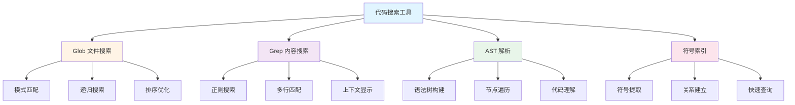
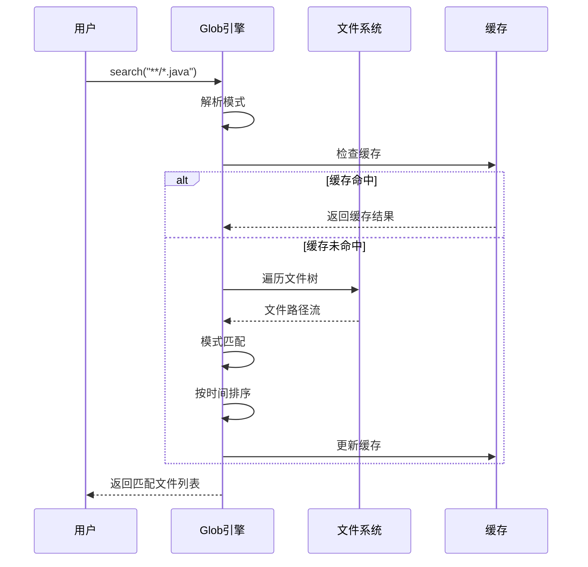
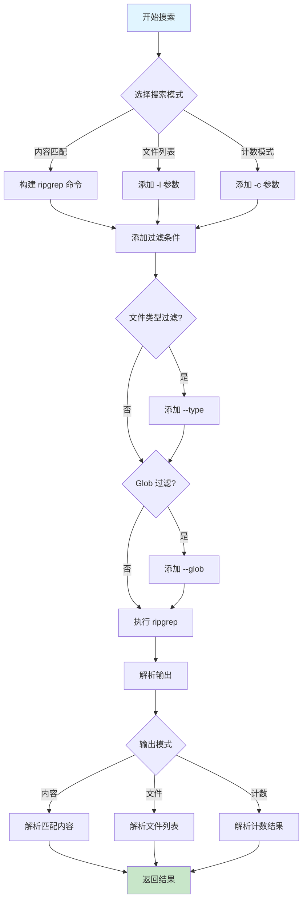
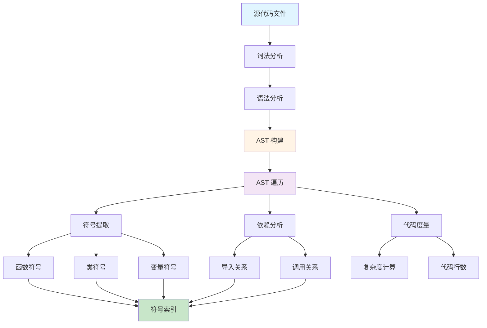
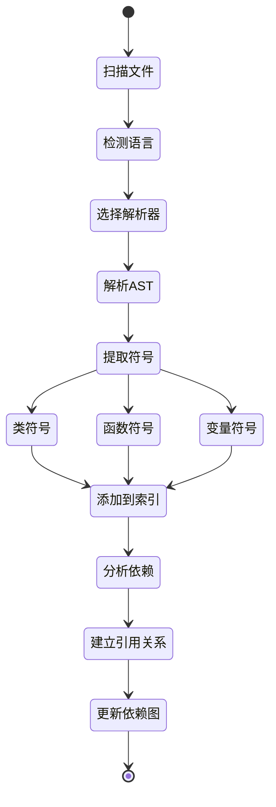
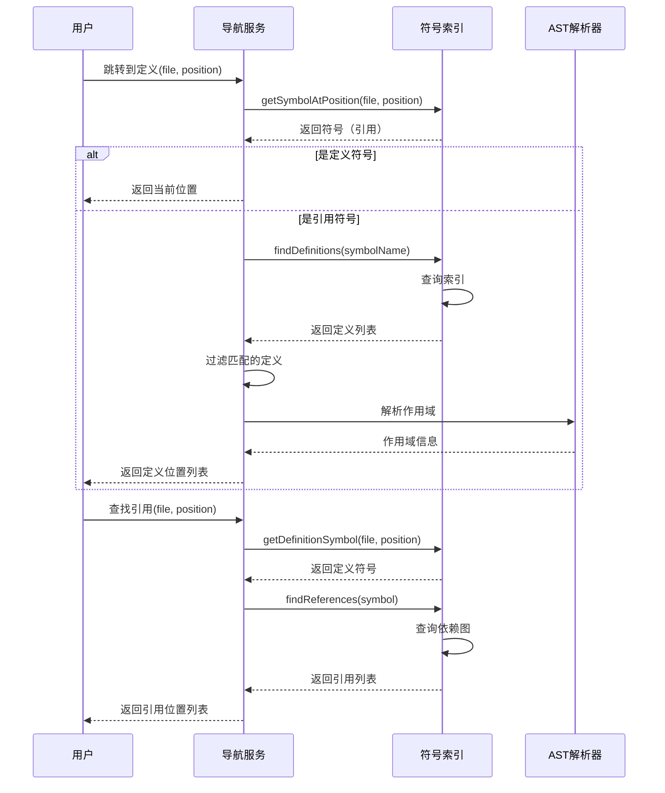
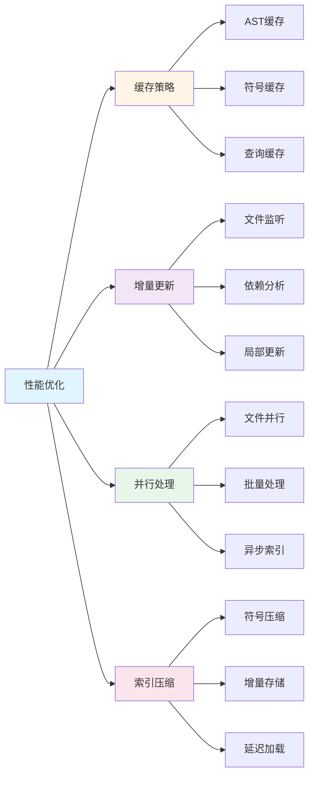

# 代码搜索与分析工具

> **技术栈说明**：本文所有代码示例已从 Java 转换为 TypeScript/Node.js 实现，以更好地适配现代 JavaScript 生态系统。核心概念和架构思想保持一致。

## 1. 引言

代码搜索与分析是 AI 辅助编程工具的核心能力之一。Claude Code 提供了强大的代码搜索和分析工具，能够快速定位代码、理解项目结构、分析代码关系。本文将深入探讨这些工具的实现原理和最佳实践。

### 1.1 为什么需要代码搜索工具

在大型代码库中，开发者面临以下挑战：

- **快速定位**：在数万个文件中找到特定代码
- **理解依赖**：分析函数、类之间的调用关系
- **重构支持**：查找所有引用，确保修改完整
- **代码审查**：快速了解代码变更影响范围

### 1.2 Claude Code 的搜索工具体系



### 1.3 工具对比

| 工具 | 用途 | 性能 | 适用场景 |
|------|------|------|----------|
| Glob | 文件名搜索 | 极快 | 查找特定文件 |
| Grep | 内容搜索 | 快 | 查找代码片段 |
| AST | 语法分析 | 中等 | 理解代码结构 |
| 符号索引 | 符号查询 | 快 | 代码导航 |

## 2. Glob 工具实现

Glob 是一个基于文件名模式匹配的快速搜索工具。

### 2.1 核心实现

```typescript
import { glob } from 'glob';
import * as path from 'path';
import * as fs from 'fs/promises';

interface FileInfo {
  path: string;
  lastModified: number;
}

export class GlobSearchEngine {
  private workspaceRoot: string;
  private fileCache: Map<string, any>;

  constructor(workspaceRoot: string) {
    this.workspaceRoot = workspaceRoot;
    this.fileCache = new Map();
  }

  /**
   * 执行 Glob 搜索
   * @param pattern Glob 模式，如 "**/*.ts"
   * @param searchPath 搜索路径
   * @returns 匹配的文件列表，按修改时间排序
   */
  async search(pattern: string, searchPath?: string): Promise<string[]> {
    const basePath = searchPath || this.workspaceRoot;

    // 使用 glob 库进行文件搜索
    const files = await glob(pattern, {
      cwd: basePath,
      absolute: true,
      ignore: [
        '**/node_modules/**',
        '**/.git/**',
        '**/target/**',
        '**/build/**',
        '**/dist/**',
        '**/.vscode/**',
        '**/.idea/**'
      ]
    });

    // 获取文件信息并按修改时间排序
    const fileInfos: FileInfo[] = await Promise.all(
      files.map(async (file) => {
        const stats = await fs.stat(file);
        return {
          path: file,
          lastModified: stats.mtimeMs
        };
      })
    );

    // 按修改时间降序排序
    fileInfos.sort((a, b) => b.lastModified - a.lastModified);

    return fileInfos.map(info => info.path);
  }

  /**
   * 模式匹配优化
   */
  async searchOptimized(pattern: string, searchPath?: string): Promise<string[]> {
    // 分析模式，优化搜索策略
    const analysis = this.analyzePattern(pattern);

    if (analysis.hasFixedPrefix()) {
      // 如果有固定前缀，先缩小搜索范围
      const basePath = searchPath || this.workspaceRoot;
      const prefixPath = path.join(basePath, analysis.getPrefix());

      try {
        await fs.access(prefixPath);
        return this.search(analysis.getRemaining(), prefixPath);
      } catch {
        // 路径不存在，使用原模式
      }
    }

    return this.search(pattern, searchPath);
  }

  /**
   * 分析 Glob 模式
   */
  private analyzePattern(pattern: string) {
    return {
      hasFixedPrefix: () => {
        const wildcardIndex = pattern.indexOf('*');
        return wildcardIndex > 0;
      },
      getPrefix: () => {
        const wildcardIndex = pattern.indexOf('*');
        return wildcardIndex > 0 ? pattern.substring(0, wildcardIndex) : '';
      },
      getRemaining: () => {
        const wildcardIndex = pattern.indexOf('*');
        return wildcardIndex > 0 ? pattern.substring(wildcardIndex) : pattern;
      }
    };
  }
}
```

### 2.2 模式匹配算法

```typescript
/**
 * Glob 模式分析类
 */
export class PatternAnalysis {
  private readonly prefix: string;
  private readonly pattern: string;
  private readonly recursive: boolean;

  constructor(pattern: string) {
    this.pattern = pattern;

    // 检测递归模式 (**)
    this.recursive = pattern.includes('**');

    // 提取固定前缀
    const wildcardIndex = pattern.indexOf('*');
    if (wildcardIndex > 0) {
      this.prefix = pattern.substring(0, wildcardIndex);
    } else {
      this.prefix = '';
    }
  }

  hasFixedPrefix(): boolean {
    return this.prefix.length > 0 && !this.prefix.includes('*');
  }

  getPrefix(): string {
    return this.prefix;
  }

  getRemaining(): string {
    return this.pattern.substring(this.prefix.length);
  }

  isRecursive(): boolean {
    return this.recursive;
  }
}

/**
 * 模式匹配工具类
 */
export class PatternMatcher {
  /**
   * 通配符匹配算法（动态规划实现）
   * @param text 待匹配的文本
   * @param pattern 通配符模式（支持 * 和 ?）
   * @returns 是否匹配
   */
  static wildcardMatch(text: string, pattern: string): boolean {
    const textLen = text.length;
    const patternLen = pattern.length;

    // 创建 DP 表格
    const dp: boolean[][] = Array(textLen + 1)
      .fill(null)
      .map(() => Array(patternLen + 1).fill(false));

    // 空字符串匹配空模式
    dp[0][0] = true;

    // 初始化第一行（处理开头的 *）
    for (let j = 1; j <= patternLen; j++) {
      if (pattern[j - 1] === '*') {
        dp[0][j] = dp[0][j - 1];
      }
    }

    // 动态规划填表
    for (let i = 1; i <= textLen; i++) {
      for (let j = 1; j <= patternLen; j++) {
        const textChar = text[i - 1];
        const patternChar = pattern[j - 1];

        if (patternChar === '*') {
          // * 可以匹配 0 个或多个字符
          dp[i][j] = dp[i][j - 1] || dp[i - 1][j];
        } else if (patternChar === '?' || patternChar === textChar) {
          // ? 匹配单个字符，或字符完全相同
          dp[i][j] = dp[i - 1][j - 1];
        }
      }
    }

    return dp[textLen][patternLen];
  }

  /**
   * 路径匹配（支持 ** 递归通配符）
   * @param path 文件路径
   * @param pattern Glob 模式
   * @returns 是否匹配
   */
  static pathMatch(path: string, pattern: string): boolean {
    // 使用 minimatch 库处理复杂的 Glob 模式
    const minimatch = require('minimatch');
    return minimatch(path, pattern);
  }
}
```

### 2.3 Glob 搜索流程



## 3. Grep 工具实现

Grep 基于 ripgrep 构建，提供强大的内容搜索能力。

### 3.1 核心实现

```typescript
import { spawn } from 'child_process';
import * as path from 'path';

/**
 * 输出模式枚举
 */
export enum OutputMode {
  CONTENT = 'CONTENT',           // 显示匹配内容
  FILES_WITH_MATCHES = 'FILES',  // 仅显示文件名
  COUNT = 'COUNT'                // 显示匹配计数
}

/**
 * Grep 搜索选项
 */
export interface GrepOptions {
  pattern: string;                // 搜索模式
  path?: string;                  // 搜索路径
  outputMode?: OutputMode;        // 输出模式
  showLineNumbers?: boolean;      // 显示行号
  contextBefore?: number;         // 前置上下文行数
  contextAfter?: number;          // 后置上下文行数
  context?: number;               // 上下文行数
  caseInsensitive?: boolean;      // 大小写不敏感
  type?: string;                  // 文件类型
  glob?: string;                  // Glob 模式
  multiline?: boolean;            // 多行匹配
}

/**
 * 内容匹配结果
 */
export interface ContentMatch {
  file: string;
  lineNumber: number;
  content: string;
}

/**
 * Grep 搜索结果
 */
export interface GrepResult {
  matches?: ContentMatch[];
  files?: string[];
  counts?: Map<string, number>;
}

/**
 * Grep 搜索引擎（基于 ripgrep）
 */
export class GrepSearchEngine {
  private workspaceRoot: string;

  constructor(workspaceRoot: string) {
    this.workspaceRoot = workspaceRoot;
  }

  /**
   * 执行 Grep 搜索
   */
  async search(options: GrepOptions): Promise<GrepResult> {
    const command = this.buildCommand(options);

    const result = await this.executeRipgrep(command);

    return this.parseResult(result, options.outputMode || OutputMode.FILES_WITH_MATCHES);
  }

  /**
   * 构建 ripgrep 命令
   */
  private buildCommand(options: GrepOptions): string[] {
    const command: string[] = ['rg'];

    // 基础选项
    command.push(options.pattern);

    // 输出模式
    switch (options.outputMode) {
      case OutputMode.CONTENT:
        command.push('--with-filename');
        if (options.showLineNumbers) {
          command.push('-n');
        }
        break;
      case OutputMode.FILES_WITH_MATCHES:
        command.push('-l');
        break;
      case OutputMode.COUNT:
        command.push('-c');
        break;
    }

    // 上下文行数
    if (options.contextBefore && options.contextBefore > 0) {
      command.push('-B', String(options.contextBefore));
    }
    if (options.contextAfter && options.contextAfter > 0) {
      command.push('-A', String(options.contextAfter));
    }
    if (options.context && options.context > 0) {
      command.push('-C', String(options.context));
    }

    // 大小写敏感
    if (options.caseInsensitive) {
      command.push('-i');
    }

    // 文件类型过滤
    if (options.type) {
      command.push('--type', options.type);
    }

    // Glob 过滤
    if (options.glob) {
      command.push('--glob', options.glob);
    }

    // 多行匹配
    if (options.multiline) {
      command.push('-U', '--multiline-dotall');
    }

    // 搜索路径
    if (options.path) {
      command.push(options.path);
    } else {
      command.push(this.workspaceRoot);
    }

    return command;
  }

  /**
   * 执行 ripgrep 命令
   */
  private async executeRipgrep(command: string[]): Promise<string> {
    return new Promise((resolve, reject) => {
      const [cmd, ...args] = command;
      const process = spawn(cmd, args);

      let stdout = '';
      let stderr = '';

      process.stdout.on('data', (data) => {
        stdout += data.toString();
      });

      process.stderr.on('data', (data) => {
        stderr += data.toString();
      });

      process.on('close', (code) => {
        // ripgrep 返回 1 表示未找到匹配，不是错误
        if (code === 0 || code === 1) {
          resolve(stdout);
        } else {
          reject(new Error(`ripgrep failed with code ${code}: ${stderr}`));
        }
      });

      process.on('error', (err) => {
        reject(err);
      });
    });
  }

  /**
   * 解析搜索结果
   */
  private parseResult(output: string, mode: OutputMode): GrepResult {
    const lines = output.trim().split('\n').filter(line => line.length > 0);
    const result: GrepResult = {};

    switch (mode) {
      case OutputMode.CONTENT:
        result.matches = this.parseContentMatches(lines);
        break;
      case OutputMode.FILES_WITH_MATCHES:
        result.files = lines;
        break;
      case OutputMode.COUNT:
        result.counts = this.parseCountMatches(lines);
        break;
    }

    return result;
  }

  /**
   * 解析内容匹配
   */
  private parseContentMatches(lines: string[]): ContentMatch[] {
    const matches: ContentMatch[] = [];

    for (const line of lines) {
      // ripgrep 输出格式: file:line:content
      const parts = line.split(':', 3);
      if (parts.length >= 3) {
        const file = parts[0];
        const lineNum = parseInt(parts[1], 10);
        const content = parts[2];

        if (!isNaN(lineNum)) {
          matches.push({ file, lineNumber: lineNum, content });
        }
      }
    }

    return matches;
  }

  /**
   * 解析文件匹配
   */
  private parseFileMatches(lines: string[]): string[] {
    return lines;
  }

  /**
   * 解析计数匹配
   */
  private parseCountMatches(lines: string[]): Map<string, number> {
    const counts = new Map<string, number>();

    for (const line of lines) {
      // ripgrep -c 输出格式: file:count
      const parts = line.split(':', 2);
      if (parts.length === 2) {
        const file = parts[0];
        const count = parseInt(parts[1], 10);
        if (!isNaN(count)) {
          counts.set(file, count);
        }
      }
    }

    return counts;
  }
}
```

### 3.2 高级搜索功能

```typescript
/**
 * 正则匹配结果
 */
export interface RegexMatch extends ContentMatch {
  groups: string[];  // 正则捕获组
}

/**
 * 函数定义
 */
export interface FunctionDefinition {
  file: string;
  lineNumber: number;
  name: string;
  signature: string;
  visibility?: 'public' | 'private' | 'protected';
}

/**
 * 上下文匹配
 */
export interface ContextMatch extends ContentMatch {
  contextBefore: string[];
  contextAfter: string[];
}

/**
 * 高级 Grep 搜索功能
 */
export class AdvancedGrepFeatures {
  private grepEngine: GrepSearchEngine;

  constructor(workspaceRoot: string) {
    this.grepEngine = new GrepSearchEngine(workspaceRoot);
  }

  /**
   * 正则表达式搜索
   */
  async regexSearch(pattern: string, searchPath?: string): Promise<RegexMatch[]> {
    const options: GrepOptions = {
      pattern,
      path: searchPath,
      outputMode: OutputMode.CONTENT,
      showLineNumbers: true
    };

    const result = await this.grepEngine.search(options);

    // 提取正则匹配组
    const regex = new RegExp(pattern);
    const matches: RegexMatch[] = [];

    for (const match of result.matches || []) {
      const regexResult = regex.exec(match.content);
      if (regexResult) {
        matches.push({
          ...match,
          groups: Array.from(regexResult).slice(1)  // 提取捕获组
        });
      }
    }

    return matches;
  }

  /**
   * 多行匹配
   */
  async multilineSearch(pattern: string, searchPath?: string): Promise<ContentMatch[]> {
    const options: GrepOptions = {
      pattern,
      path: searchPath,
      multiline: true,
      outputMode: OutputMode.CONTENT
    };

    const result = await this.grepEngine.search(options);
    return result.matches || [];
  }

  /**
   * 结构化搜索（查找函数定义）
   */
  async findFunctions(functionName: string, searchPath?: string): Promise<FunctionDefinition[]> {
    // TypeScript/JavaScript 函数模式
    const pattern = `(export\\s+)?(async\\s+)?(function|const|let|var)\\s+${functionName}\\s*[=\\(]`;

    const matches = await this.regexSearch(pattern, searchPath);

    return matches.map(match => this.parseFunctionDefinition(match));
  }

  /**
   * 解析函数定义
   */
  private parseFunctionDefinition(match: RegexMatch): FunctionDefinition {
    // 简化的解析逻辑
    const visibility = match.groups[0]?.includes('export') ? 'public' : 'private';

    return {
      file: match.file,
      lineNumber: match.lineNumber,
      name: this.extractFunctionName(match.content),
      signature: match.content.trim(),
      visibility
    };
  }

  /**
   * 提取函数名
   */
  private extractFunctionName(content: string): string {
    const functionNameMatch = content.match(/(?:function|const|let|var)\s+(\w+)/);
    return functionNameMatch ? functionNameMatch[1] : 'anonymous';
  }

  /**
   * 上下文搜索
   */
  async searchWithContext(
    pattern: string,
    searchPath: string | undefined,
    contextLines: number
  ): Promise<ContextMatch[]> {
    const options: GrepOptions = {
      pattern,
      path: searchPath,
      context: contextLines,
      outputMode: OutputMode.CONTENT,
      showLineNumbers: true
    };

    const result = await this.grepEngine.search(options);

    // 注意: ripgrep 的上下文输出需要额外解析
    // 这里简化为直接返回匹配结果
    return (result.matches || []).map(match => ({
      ...match,
      contextBefore: [],
      contextAfter: []
    }));
  }

  /**
   * 查找 TODO 注释
   */
  async findTodos(searchPath?: string): Promise<ContentMatch[]> {
    return this.regexSearch('TODO:|FIXME:|HACK:', searchPath);
  }

  /**
   * 查找导入语句
   */
  async findImports(moduleName: string, searchPath?: string): Promise<ContentMatch[]> {
    const pattern = `import.*from\\s+['"](.*${moduleName}.*)['"]`;
    return this.regexSearch(pattern, searchPath);
  }
}
```

### 3.3 Grep 搜索流程



## 4. AST 解析

抽象语法树（AST）解析是深度代码理解的基础。

### 4.1 AST 解析器接口

```typescript
/**
 * 语言枚举
 */
export enum Language {
  TYPESCRIPT = 'TypeScript',
  JAVASCRIPT = 'JavaScript',
  PYTHON = 'Python',
  JAVA = 'Java'
}

/**
 * AST 解析器接口
 */
export interface ASTParser {
  /**
   * 解析源代码文件
   */
  parse(filePath: string): Promise<CompilationUnit>;

  /**
   * 解析代码字符串
   */
  parseCode(code: string, fileName?: string): CompilationUnit;

  /**
   * 获取支持的语言
   */
  getSupportedLanguage(): Language;
}

/**
 * 编译单元（AST 根节点）
 */
export class CompilationUnit {
  private sourceFile: string;
  private imports: ImportDeclaration[] = [];
  private types: TypeDeclaration[] = [];
  private packageDecl?: PackageDeclaration;

  constructor(sourceFile: string) {
    this.sourceFile = sourceFile;
  }

  /**
   * 访问所有节点（访问者模式）
   */
  accept(visitor: ASTVisitor): void {
    visitor.visitCompilationUnit(this);

    if (this.packageDecl) {
      this.packageDecl.accept(visitor);
    }

    this.imports.forEach(imp => imp.accept(visitor));
    this.types.forEach(type => type.accept(visitor));
  }

  // Getters 和 Setters
  getSourceFile(): string {
    return this.sourceFile;
  }

  getImports(): ImportDeclaration[] {
    return this.imports;
  }

  addImport(imp: ImportDeclaration): void {
    this.imports.push(imp);
  }

  getTypes(): TypeDeclaration[] {
    return this.types;
  }

  addType(type: TypeDeclaration): void {
    this.types.push(type);
  }

  setPackageDeclaration(packageDecl: PackageDeclaration): void {
    this.packageDecl = packageDecl;
  }
}

/**
 * 访问者接口
 */
export interface ASTVisitor {
  visitCompilationUnit(unit: CompilationUnit): void;
  visitImportDeclaration?(imp: ImportDeclaration): void;
  visitTypeDeclaration?(type: TypeDeclaration): void;
  visitPackageDeclaration?(pkg: PackageDeclaration): void;
}

/**
 * 导入声明
 */
export class ImportDeclaration {
  constructor(
    public name: string,
    public isStatic: boolean = false,
    public isWildcard: boolean = false
  ) {}

  accept(visitor: ASTVisitor): void {
    visitor.visitImportDeclaration?.(this);
  }
}

/**
 * 类型声明
 */
export class TypeDeclaration {
  constructor(
    public name: string,
    public kind: 'class' | 'interface' | 'enum'
  ) {}

  accept(visitor: ASTVisitor): void {
    visitor.visitTypeDeclaration?.(this);
  }
}

/**
 * 包声明
 */
export class PackageDeclaration {
  constructor(public name: string) {}

  accept(visitor: ASTVisitor): void {
    visitor.visitPackageDeclaration?.(this);
  }
}
```

### 4.2 多语言 AST 解析策略

> **注意**：在实际应用中,不同语言需要使用不同的解析器库:
> - **TypeScript/JavaScript**: 使用 `typescript` 官方 Compiler API
> - **Python**: 使用 `@babel/parser` 或 `python-parser`
> - **Java**: 使用 `java-parser` npm 包
> - **Go, Rust**: 使用对应语言的解析器通过WASM或者子进程调用

下面是一个通用的多语言AST解析器工厂模式实现:

```typescript
import * as ts from 'typescript';

/**
 * AST 解析器工厂
 */
export class ASTParserFactory {
  private static parsers: Map<Language, ASTParser> = new Map();

  /**
   * 获取指定语言的解析器
   */
  static getParser(language: Language): ASTParser {
    if (!this.parsers.has(language)) {
      this.parsers.set(language, this.createParser(language));
    }
    return this.parsers.get(language)!;
  }

  /**
   * 创建解析器实例
   */
  private static createParser(language: Language): ASTParser {
    switch (language) {
      case Language.TYPESCRIPT:
      case Language.JAVASCRIPT:
        return new TypeScriptASTParser();
      case Language.PYTHON:
        return new PythonASTParser();
      case Language.JAVA:
        return new JavaASTParser();
      default:
        throw new Error(`Unsupported language: ${language}`);
    }
  }

  /**
   * 根据文件扩展名检测语言
   */
  static detectLanguage(filePath: string): Language {
    const ext = filePath.split('.').pop()?.toLowerCase();
    switch (ext) {
      case 'ts':
      case 'tsx':
        return Language.TYPESCRIPT;
      case 'js':
      case 'jsx':
        return Language.JAVASCRIPT;
      case 'py':
        return Language.PYTHON;
      case 'java':
        return Language.JAVA;
      default:
        throw new Error(`Unknown file extension: ${ext}`);
    }
  }
}

/**
 * Python AST 解析器（使用 Babel 或其他库）
 */
class PythonASTParser implements ASTParser {
  async parse(filePath: string): Promise<CompilationUnit> {
    // 实现 Python 解析逻辑
    // 可以使用 @babel/parser 的 Python 插件或调用 Python 解析器
    throw new Error('Python parser not implemented');
  }

  parseCode(code: string): CompilationUnit {
    throw new Error('Python parser not implemented');
  }

  getSupportedLanguage(): Language {
    return Language.PYTHON;
  }
}

/**
 * Java AST 解析器（使用 java-parser 包）
 */
class JavaASTParser implements ASTParser {
  async parse(filePath: string): Promise<CompilationUnit> {
    // 实现 Java 解析逻辑
    // 可以使用 java-parser npm 包
    throw new Error('Java parser not implemented');
  }

  parseCode(code: string): CompilationUnit {
    throw new Error('Java parser not implemented');
  }

  getSupportedLanguage(): Language {
    return Language.JAVA;
  }
}
```

### 4.3 TypeScript AST 解析器

```typescript
import * as ts from 'typescript';
import * as fs from 'fs/promises';
import * as path from 'path';

/**
 * TypeScript AST 解析器（使用 TypeScript Compiler API）
 */
export class TypeScriptASTParser {
  /**
   * 解析 TypeScript/JavaScript 文件
   */
  async parse(filePath: string): Promise<ts.SourceFile> {
    const code = await fs.readFile(filePath, 'utf-8');

    return ts.createSourceFile(
      path.basename(filePath),
      code,
      ts.ScriptTarget.Latest,
      true  // setParentNodes
    );
  }

  /**
   * 提取所有函数声明
   */
  extractFunctions(sourceFile: ts.SourceFile): FunctionInfo[] {
    const functions: FunctionInfo[] = [];

    const visit = (node: ts.Node) => {
      if (ts.isFunctionDeclaration(node) && node.name) {
        functions.push({
          name: node.name.text,
          parameters: node.parameters.map(p => ({
            name: p.name.getText(),
            type: p.type?.getText() || 'any'
          })),
          returnType: node.type?.getText() || 'void',
          isExported: this.hasExportModifier(node),
          isAsync: this.hasAsyncModifier(node)
        });
      }
      ts.forEachChild(node, visit);
    };

    visit(sourceFile);
    return functions;
  }

  /**
   * 提取所有类声明
   */
  extractClasses(sourceFile: ts.SourceFile): ClassInfo[] {
    const classes: ClassInfo[] = [];

    const visit = (node: ts.Node) => {
      if (ts.isClassDeclaration(node) && node.name) {
        classes.push({
          name: node.name.text,
          isExported: this.hasExportModifier(node),
          methods: this.extractClassMethods(node),
          properties: this.extractClassProperties(node)
        });
      }
      ts.forEachChild(node, visit);
    };

    visit(sourceFile);
    return classes;
  }

  /**
   * 提取导入语句
   */
  extractImports(sourceFile: ts.SourceFile): ImportInfo[] {
    const imports: ImportInfo[] = [];

    const visit = (node: ts.Node) => {
      if (ts.isImportDeclaration(node)) {
        const moduleSpecifier = node.moduleSpecifier;
        if (ts.isStringLiteral(moduleSpecifier)) {
          imports.push({
            module: moduleSpecifier.text,
            namedImports: this.extractNamedImports(node),
            defaultImport: this.extractDefaultImport(node)
          });
        }
      }
      ts.forEachChild(node, visit);
    };

    visit(sourceFile);
    return imports;
  }

  // 辅助方法
  private hasExportModifier(node: ts.Node): boolean {
    return node.modifiers?.some(m => m.kind === ts.SyntaxKind.ExportKeyword) || false;
  }

  private hasAsyncModifier(node: ts.FunctionDeclaration): boolean {
    return node.modifiers?.some(m => m.kind === ts.SyntaxKind.AsyncKeyword) || false;
  }

  private extractClassMethods(classNode: ts.ClassDeclaration): MethodInfo[] {
    const methods: MethodInfo[] = [];

    classNode.members.forEach(member => {
      if (ts.isMethodDeclaration(member) && member.name) {
        methods.push({
          name: member.name.getText(),
          isPublic: this.isPublic(member),
          isStatic: this.isStatic(member)
        });
      }
    });

    return methods;
  }

  private extractClassProperties(classNode: ts.ClassDeclaration): PropertyInfo[] {
    const properties: PropertyInfo[] = [];

    classNode.members.forEach(member => {
      if (ts.isPropertyDeclaration(member) && member.name) {
        properties.push({
          name: member.name.getText(),
          type: member.type?.getText() || 'any',
          isPublic: this.isPublic(member)
        });
      }
    });

    return properties;
  }

  private extractNamedImports(node: ts.ImportDeclaration): string[] {
    const namedImports: string[] = [];
    if (node.importClause?.namedBindings && ts.isNamedImports(node.importClause.namedBindings)) {
      node.importClause.namedBindings.elements.forEach(element => {
        namedImports.push(element.name.text);
      });
    }
    return namedImports;
  }

  private extractDefaultImport(node: ts.ImportDeclaration): string | undefined {
    return node.importClause?.name?.text;
  }

  private isPublic(member: ts.ClassElement): boolean {
    return !member.modifiers?.some(m =>
      m.kind === ts.SyntaxKind.PrivateKeyword ||
      m.kind === ts.SyntaxKind.ProtectedKeyword
    );
  }

  private isStatic(member: ts.ClassElement): boolean {
    return member.modifiers?.some(m => m.kind === ts.SyntaxKind.StaticKeyword) || false;
  }
}

// 类型定义
interface FunctionInfo {
  name: string;
  parameters: Array<{ name: string; type: string }>;
  returnType: string;
  isExported: boolean;
  isAsync: boolean;
}

interface ClassInfo {
  name: string;
  isExported: boolean;
  methods: MethodInfo[];
  properties: PropertyInfo[];
}

interface MethodInfo {
  name: string;
  isPublic: boolean;
  isStatic: boolean;
}

interface PropertyInfo {
  name: string;
  type: string;
  isPublic: boolean;
}

interface ImportInfo {
  module: string;
  namedImports: string[];
  defaultImport?: string;
}
```

### 4.4 AST 遍历与分析



## 5. 符号索引构建

符号索引是快速代码导航的关键。

### 5.1 符号索引结构

```java
public class SymbolIndex {
    private final Map<String, List<Symbol>> symbolsByName;
    private final Map<Path, List<Symbol>> symbolsByFile;
    private final Map<SymbolKind, List<Symbol>> symbolsByKind;
    private final Graph<Symbol> dependencyGraph;

    public SymbolIndex() {
        this.symbolsByName = new ConcurrentHashMap<>();
        this.symbolsByFile = new ConcurrentHashMap<>();
        this.symbolsByKind = new ConcurrentHashMap<>();
        this.dependencyGraph = new DirectedGraph<>();
    }

    /**
     * 添加符号
     */
    public void addSymbol(Symbol symbol) {
        // 按名称索引
        symbolsByName.computeIfAbsent(symbol.getName(), k -> new ArrayList<>())
            .add(symbol);

        // 按文件索引
        symbolsByFile.computeIfAbsent(symbol.getLocation().getFile(), k -> new ArrayList<>())
            .add(symbol);

        // 按类型索引
        symbolsByKind.computeIfAbsent(symbol.getKind(), k -> new ArrayList<>())
            .add(symbol);

        // 添加到依赖图
        dependencyGraph.addNode(symbol);
    }

    /**
     * 添加符号引用关系
     */
    public void addReference(Symbol from, Symbol to) {
        dependencyGraph.addEdge(from, to);
    }

    /**
     * 查找符号定义
     */
    public List<Symbol> findDefinitions(String name) {
        return symbolsByName.getOrDefault(name, Collections.emptyList())
            .stream()
            .filter(s -> s.getRole() == SymbolRole.DEFINITION)
            .collect(Collectors.toList());
    }

    /**
     * 查找符号引用
     */
    public List<Symbol> findReferences(Symbol symbol) {
        return dependencyGraph.getIncomingEdges(symbol)
            .stream()
            .map(Edge::getSource)
            .collect(Collectors.toList());
    }

    /**
     * 查找文件中的所有符号
     */
    public List<Symbol> getSymbolsInFile(Path file) {
        return symbolsByFile.getOrDefault(file, Collections.emptyList());
    }
}

/**
 * 符号定义
 */
public class Symbol {
    private final String name;
    private final SymbolKind kind;
    private final SymbolRole role;
    private final Location location;
    private final String signature;
    private final List<Symbol> children;

    public enum SymbolKind {
        FUNCTION, METHOD, CLASS, INTERFACE, VARIABLE,
        FIELD, PARAMETER, ENUM, NAMESPACE, MODULE
    }

    public enum SymbolRole {
        DEFINITION, REFERENCE, DECLARATION
    }

    // Getters and methods
}

/**
 * 位置信息
 */
public class Location {
    private final Path file;
    private final Range range;

    public static class Range {
        private final Position start;
        private final Position end;
    }

    public static class Position {
        private final int line;
        private final int column;
    }
}
```

### 5.2 索引构建器

```java
public class SymbolIndexBuilder {
    private final SymbolIndex index;
    private final Map<Language, ASTParser> parsers;

    public SymbolIndexBuilder() {
        this.index = new SymbolIndex();
        this.parsers = new HashMap<>();

        // 注册解析器
        parsers.put(Language.JAVA, new JavaASTParser());
        parsers.put(Language.TYPESCRIPT, new TypeScriptASTParser());
        parsers.put(Language.PYTHON, new PythonASTParser());
    }

    /**
     * 构建项目索引
     */
    public SymbolIndex buildIndex(Path projectRoot) {
        // 查找所有源文件
        List<Path> sourceFiles = findSourceFiles(projectRoot);

        // 并行解析和索引
        sourceFiles.parallelStream()
            .forEach(this::indexFile);

        // 构建依赖关系
        buildDependencies();

        return index;
    }

    /**
     * 索引单个文件
     */
    private void indexFile(Path file) {
        Language language = detectLanguage(file);
        ASTParser parser = parsers.get(language);

        if (parser == null) {
            return; // 不支持的语言
        }

        try {
            CompilationUnit cu = parser.parse(file);
            extractSymbols(cu);
        } catch (ParseException e) {
            logger.warn("Failed to parse file: " + file, e);
        }
    }

    /**
     * 提取符号
     */
    private void extractSymbols(CompilationUnit cu) {
        cu.accept(new SymbolExtractorVisitor(index));
    }

    /**
     * 符号提取访问器
     */
    private static class SymbolExtractorVisitor implements ASTVisitor {
        private final SymbolIndex index;
        private final Deque<Symbol> symbolStack;

        public SymbolExtractorVisitor(SymbolIndex index) {
            this.index = index;
            this.symbolStack = new ArrayDeque<>();
        }

        @Override
        public void visitClassDeclaration(ClassDeclaration node) {
            Symbol classSymbol = Symbol.builder()
                .name(node.getName())
                .kind(SymbolKind.CLASS)
                .role(SymbolRole.DEFINITION)
                .location(node.getLocation())
                .build();

            index.addSymbol(classSymbol);
            symbolStack.push(classSymbol);

            // 访问子节点
            node.getMembers().forEach(member -> member.accept(this));

            symbolStack.pop();
        }

        @Override
        public void visitMethodDeclaration(MethodDeclaration node) {
            Symbol methodSymbol = Symbol.builder()
                .name(node.getName())
                .kind(SymbolKind.METHOD)
                .role(SymbolRole.DEFINITION)
                .location(node.getLocation())
                .signature(node.getSignature())
                .build();

            index.addSymbol(methodSymbol);

            // 建立父子关系
            if (!symbolStack.isEmpty()) {
                Symbol parent = symbolStack.peek();
                parent.addChild(methodSymbol);
            }

            symbolStack.push(methodSymbol);

            // 访问方法体
            if (node.getBody() != null) {
                node.getBody().accept(this);
            }

            symbolStack.pop();
        }

        @Override
        public void visitMethodInvocation(MethodInvocation node) {
            // 记录方法调用（引用）
            Symbol reference = Symbol.builder()
                .name(node.getMethodName())
                .kind(SymbolKind.METHOD)
                .role(SymbolRole.REFERENCE)
                .location(node.getLocation())
                .build();

            index.addSymbol(reference);

            // 建立调用关系
            if (!symbolStack.isEmpty()) {
                Symbol caller = symbolStack.peek();
                index.addReference(caller, reference);
            }
        }

        @Override
        public void visitVariableDeclaration(VariableDeclaration node) {
            Symbol varSymbol = Symbol.builder()
                .name(node.getName())
                .kind(SymbolKind.VARIABLE)
                .role(SymbolRole.DEFINITION)
                .location(node.getLocation())
                .build();

            index.addSymbol(varSymbol);
        }
    }
}
```

### 5.3 增量索引更新

```java
public class IncrementalIndexer {
    private final SymbolIndex index;
    private final FileWatcher fileWatcher;

    public IncrementalIndexer(SymbolIndex index, Path projectRoot) {
        this.index = index;
        this.fileWatcher = new FileWatcher(projectRoot);

        setupWatcher();
    }

    /**
     * 设置文件监听器
     */
    private void setupWatcher() {
        fileWatcher.onFileCreated(this::handleFileCreated);
        fileWatcher.onFileModified(this::handleFileModified);
        fileWatcher.onFileDeleted(this::handleFileDeleted);
    }

    /**
     * 处理文件创建
     */
    private void handleFileCreated(Path file) {
        indexFile(file);
    }

    /**
     * 处理文件修改
     */
    private void handleFileModified(Path file) {
        // 移除旧符号
        List<Symbol> oldSymbols = index.getSymbolsInFile(file);
        oldSymbols.forEach(index::removeSymbol);

        // 重新索引
        indexFile(file);
    }

    /**
     * 处理文件删除
     */
    private void handleFileDeleted(Path file) {
        List<Symbol> symbols = index.getSymbolsInFile(file);
        symbols.forEach(index::removeSymbol);
    }

    /**
     * 索引文件
     */
    private void indexFile(Path file) {
        // 使用 SymbolIndexBuilder 的逻辑
        // ...
    }
}
```

### 5.4 符号索引流程



## 6. 智能代码导航

基于符号索引实现的代码导航功能。

### 6.1 跳转到定义

```java
public class NavigationService {
    private final SymbolIndex symbolIndex;

    /**
     * 跳转到定义
     */
    public List<Location> gotoDefinition(Path file, Position position) {
        // 1. 获取光标处的符号
        Symbol symbol = getSymbolAtPosition(file, position);
        if (symbol == null) {
            return Collections.emptyList();
        }

        // 2. 如果是定义，返回当前位置
        if (symbol.getRole() == SymbolRole.DEFINITION) {
            return Collections.singletonList(symbol.getLocation());
        }

        // 3. 如果是引用，查找定义
        List<Symbol> definitions = symbolIndex.findDefinitions(symbol.getName());

        // 4. 过滤匹配的定义（考虑作用域、类型等）
        List<Symbol> matchedDefs = definitions.stream()
            .filter(def -> isMatchingDefinition(symbol, def))
            .collect(Collectors.toList());

        return matchedDefs.stream()
            .map(Symbol::getLocation)
            .collect(Collectors.toList());
    }

    /**
     * 获取位置处的符号
     */
    private Symbol getSymbolAtPosition(Path file, Position position) {
        List<Symbol> symbols = symbolIndex.getSymbolsInFile(file);

        return symbols.stream()
            .filter(s -> s.getLocation().getRange().contains(position))
            .min(Comparator.comparing(s ->
                s.getLocation().getRange().getLength()))
            .orElse(null);
    }

    /**
     * 判断定义是否匹配
     */
    private boolean isMatchingDefinition(Symbol reference, Symbol definition) {
        // 名称必须匹配
        if (!reference.getName().equals(definition.getName())) {
            return false;
        }

        // 类型必须兼容
        if (reference.getKind() != definition.getKind()) {
            return false;
        }

        // 考虑作用域
        if (!isInScope(reference, definition)) {
            return false;
        }

        // 对于方法，检查签名
        if (reference.getKind() == SymbolKind.METHOD) {
            return isMatchingSignature(reference, definition);
        }

        return true;
    }
}
```

### 6.2 查找引用

```java
public class ReferenceService {
    private final SymbolIndex symbolIndex;

    /**
     * 查找所有引用
     */
    public List<Location> findReferences(Path file, Position position) {
        // 1. 获取定义符号
        Symbol symbol = getDefinitionSymbol(file, position);
        if (symbol == null) {
            return Collections.emptyList();
        }

        // 2. 查找所有引用
        List<Symbol> references = symbolIndex.findReferences(symbol);

        // 3. 返回引用位置
        return references.stream()
            .map(Symbol::getLocation)
            .collect(Collectors.toList());
    }

    /**
     * 查找实现
     */
    public List<Location> findImplementations(Path file, Position position) {
        Symbol symbol = getDefinitionSymbol(file, position);

        if (symbol.getKind() == SymbolKind.INTERFACE) {
            // 查找接口的所有实现类
            return findInterfaceImplementations(symbol);
        } else if (symbol.getKind() == SymbolKind.METHOD) {
            // 查找方法的所有重写
            return findMethodOverrides(symbol);
        }

        return Collections.emptyList();
    }

    /**
     * 查找接口实现
     */
    private List<Location> findInterfaceImplementations(Symbol interfaceSymbol) {
        List<Symbol> allClasses = symbolIndex.getSymbolsByKind(SymbolKind.CLASS);

        return allClasses.stream()
            .filter(cls -> implementsInterface(cls, interfaceSymbol))
            .map(Symbol::getLocation)
            .collect(Collectors.toList());
    }

    /**
     * 查找方法重写
     */
    private List<Location> findMethodOverrides(Symbol methodSymbol) {
        // 获取方法所在的类
        Symbol containingClass = methodSymbol.getParent();

        // 查找所有子类
        List<Symbol> subclasses = findSubclasses(containingClass);

        // 在子类中查找同名同签名的方法
        return subclasses.stream()
            .flatMap(cls -> cls.getChildren().stream())
            .filter(m -> m.getKind() == SymbolKind.METHOD)
            .filter(m -> isOverride(m, methodSymbol))
            .map(Symbol::getLocation)
            .collect(Collectors.toList());
    }
}
```

### 6.3 代码大纲

```java
public class OutlineService {
    private final SymbolIndex symbolIndex;

    /**
     * 获取文件大纲
     */
    public OutlineTree getOutline(Path file) {
        List<Symbol> symbols = symbolIndex.getSymbolsInFile(file);

        // 构建树形结构
        OutlineTree tree = new OutlineTree();

        // 按层级组织符号
        Map<Symbol, List<Symbol>> hierarchy = buildHierarchy(symbols);

        // 添加顶层符号
        symbols.stream()
            .filter(s -> s.getParent() == null)
            .forEach(s -> tree.addNode(buildOutlineNode(s, hierarchy)));

        return tree;
    }

    /**
     * 构建大纲节点
     */
    private OutlineNode buildOutlineNode(Symbol symbol, Map<Symbol, List<Symbol>> hierarchy) {
        OutlineNode node = new OutlineNode(
            symbol.getName(),
            symbol.getKind(),
            symbol.getLocation()
        );

        // 添加子节点
        List<Symbol> children = hierarchy.getOrDefault(symbol, Collections.emptyList());
        children.forEach(child ->
            node.addChild(buildOutlineNode(child, hierarchy))
        );

        return node;
    }

    /**
     * 获取符号详细信息
     */
    public SymbolDetail getSymbolDetail(Symbol symbol) {
        return SymbolDetail.builder()
            .name(symbol.getName())
            .kind(symbol.getKind())
            .signature(symbol.getSignature())
            .documentation(extractDocumentation(symbol))
            .modifiers(symbol.getModifiers())
            .location(symbol.getLocation())
            .references(symbolIndex.findReferences(symbol).size())
            .build();
    }
}
```

### 6.4 导航流程



## 7. 性能优化策略

### 7.1 多级缓存

```java
public class CacheManager {
    private final Cache<Path, CompilationUnit> astCache;
    private final Cache<Path, List<Symbol>> symbolCache;
    private final Cache<String, List<Symbol>> definitionCache;

    public CacheManager() {
        this.astCache = Caffeine.newBuilder()
            .maximumSize(1000)
            .expireAfterAccess(10, TimeUnit.MINUTES)
            .recordStats()
            .build();

        this.symbolCache = Caffeine.newBuilder()
            .maximumSize(5000)
            .expireAfterWrite(30, TimeUnit.MINUTES)
            .recordStats()
            .build();

        this.definitionCache = Caffeine.newBuilder()
            .maximumSize(10000)
            .expireAfterWrite(1, TimeUnit.HOURS)
            .recordStats()
            .build();
    }

    /**
     * 获取或解析 AST
     */
    public CompilationUnit getOrParseAST(Path file, ASTParser parser) {
        return astCache.get(file, f -> {
            try {
                return parser.parse(f);
            } catch (ParseException e) {
                throw new RuntimeException(e);
            }
        });
    }

    /**
     * 使缓存失效
     */
    public void invalidate(Path file) {
        astCache.invalidate(file);
        symbolCache.invalidate(file);
    }

    /**
     * 获取缓存统计
     */
    public CacheStats getStats() {
        return new CacheStats(
            astCache.stats(),
            symbolCache.stats(),
            definitionCache.stats()
        );
    }
}
```

### 7.2 增量索引

```java
public class IncrementalIndexStrategy {
    private final SymbolIndex index;
    private final DependencyTracker dependencyTracker;

    /**
     * 增量更新索引
     */
    public void updateIndex(Path modifiedFile) {
        // 1. 查找受影响的文件
        Set<Path> affectedFiles = findAffectedFiles(modifiedFile);

        // 2. 只重新索引受影响的文件
        affectedFiles.forEach(this::reindexFile);
    }

    /**
     * 查找受影响的文件
     */
    private Set<Path> findAffectedFiles(Path modifiedFile) {
        Set<Path> affected = new HashSet<>();
        affected.add(modifiedFile);

        // 查找直接依赖
        Set<Path> directDeps = dependencyTracker.getDirectDependents(modifiedFile);
        affected.addAll(directDeps);

        // 根据变更类型决定是否查找间接依赖
        ChangeType changeType = analyzeChange(modifiedFile);
        if (changeType == ChangeType.PUBLIC_API_CHANGE) {
            // 公共 API 变更，需要更新所有传递依赖
            Set<Path> transitiveDeps = dependencyTracker.getTransitiveDependents(modifiedFile);
            affected.addAll(transitiveDeps);
        }

        return affected;
    }

    /**
     * 重新索引文件
     */
    private void reindexFile(Path file) {
        // 移除旧符号
        List<Symbol> oldSymbols = index.getSymbolsInFile(file);
        oldSymbols.forEach(index::removeSymbol);

        // 重新解析和索引
        indexFile(file);
    }
}
```

### 7.3 并行处理

```java
public class ParallelIndexBuilder {
    private final ExecutorService executor;
    private final int parallelism;

    public ParallelIndexBuilder() {
        this.parallelism = Runtime.getRuntime().availableProcessors();
        this.executor = Executors.newFixedThreadPool(parallelism);
    }

    /**
     * 并行构建索引
     */
    public SymbolIndex buildIndexParallel(List<Path> sourceFiles) {
        SymbolIndex index = new SymbolIndex();

        // 分批处理
        int batchSize = Math.max(1, sourceFiles.size() / parallelism);
        List<List<Path>> batches = partition(sourceFiles, batchSize);

        // 并行处理每个批次
        List<CompletableFuture<List<Symbol>>> futures = batches.stream()
            .map(batch -> CompletableFuture.supplyAsync(
                () -> processBatch(batch),
                executor
            ))
            .collect(Collectors.toList());

        // 等待所有任务完成
        CompletableFuture.allOf(futures.toArray(new CompletableFuture[0]))
            .join();

        // 合并结果
        futures.stream()
            .map(CompletableFuture::join)
            .flatMap(List::stream)
            .forEach(index::addSymbol);

        return index;
    }

    /**
     * 处理一批文件
     */
    private List<Symbol> processBatch(List<Path> files) {
        List<Symbol> symbols = new ArrayList<>();

        for (Path file : files) {
            try {
                CompilationUnit cu = parseFile(file);
                symbols.addAll(extractSymbols(cu));
            } catch (Exception e) {
                logger.warn("Failed to process file: " + file, e);
            }
        }

        return symbols;
    }
}
```

### 7.4 性能优化流程



## 8. 最佳实践

### 8.1 搜索策略选择

```java
public class SearchStrategySelector {
    /**
     * 选择最优搜索策略
     */
    public SearchStrategy selectStrategy(SearchContext context) {
        // 1. 文件名搜索 -> Glob
        if (context.isFileNameSearch()) {
            return new GlobStrategy();
        }

        // 2. 简单内容搜索 -> Grep
        if (context.isSimpleContentSearch()) {
            return new GrepStrategy();
        }

        // 3. 结构化搜索 -> AST + 符号索引
        if (context.isStructuredSearch()) {
            return new SymbolSearchStrategy();
        }

        // 4. 语义搜索 -> AST + 语义分析
        if (context.isSemanticSearch()) {
            return new SemanticSearchStrategy();
        }

        // 默认使用 Grep
        return new GrepStrategy();
    }
}
```

### 8.2 搜索模式

**模式1：快速文件定位**
```java
// 查找特定类型文件
globEngine.search("**/*.java", projectRoot);

// 查找特定名称文件
globEngine.search("**/UserService.java", projectRoot);
```

**模式2：代码片段搜索**
```java
// 查找函数调用
grepEngine.search(GrepOptions.builder()
    .pattern("saveUser\\(")
    .type("java")
    .build());

// 查找TODO注释
grepEngine.search(GrepOptions.builder()
    .pattern("TODO:")
    .showLineNumbers(true)
    .context(2)
    .build());
```

**模式3：符号导航**
```java
// 跳转到定义
navigationService.gotoDefinition(file, position);

// 查找所有引用
referenceService.findReferences(file, position);

// 查找实现
referenceService.findImplementations(file, position);
```

### 8.3 性能优化清单

- ✅ 使用多级缓存减少重复解析
- ✅ 实现增量索引避免全量更新
- ✅ 并行处理提高索引构建速度
- ✅ 合理设置缓存过期策略
- ✅ 监控缓存命中率，及时调整
- ✅ 使用异步索引避免阻塞主线程
- ✅ 压缩索引数据减少内存占用
- ✅ 延迟加载大型符号信息

## 9. 常见问题 FAQ

### Q1: Glob 和 Grep 的区别是什么？

**A:**
- **Glob**: 基于文件名模式匹配，只查找文件路径，速度极快
- **Grep**: 基于内容搜索，查找文件内容，支持正则表达式

选择原则：
- 已知文件名或路径模式 → 使用 Glob
- 需要查找代码内容 → 使用 Grep

### Q2: 如何提高大型项目的搜索性能？

**A:** 优化策略：
1. **使用符号索引**：预先构建索引，避免实时解析
2. **增量更新**：只更新变更的文件
3. **并行处理**：利用多核CPU并行索引
4. **缓存机制**：缓存AST和符号信息
5. **过滤无关文件**：跳过 node_modules、.git 等目录

### Q3: AST 解析失败怎么办？

**A:** 处理策略：
```java
try {
    CompilationUnit cu = parser.parse(file);
    // 正常处理
} catch (ParseException e) {
    // 降级策略：使用正则搜索
    return grepFallback(file);
}
```

### Q4: 如何处理大文件的索引？

**A:**
```java
public void indexLargeFile(Path file) {
    long fileSize = Files.size(file);

    if (fileSize > 10 * 1024 * 1024) { // > 10MB
        // 流式解析，避免一次性加载
        try (BufferedReader reader = Files.newBufferedReader(file)) {
            parseIncrementally(reader);
        }
    } else {
        // 正常解析
        parseNormally(file);
    }
}
```

### Q5: 符号索引占用内存过大怎么办？

**A:** 优化方案：
1. **符号压缩**：只存储必要信息
2. **分片索引**：按模块分片存储
3. **外部存储**：使用数据库或文件存储
4. **延迟加载**：按需加载符号详细信息

## 10. 总结

### 10.1 核心要点

1. **Glob 工具**
   - 快速文件名搜索
   - 支持通配符模式
   - 按修改时间排序

2. **Grep 工具**
   - 基于 ripgrep 的内容搜索
   - 支持正则表达式
   - 多种输出模式

3. **AST 解析**
   - 深度代码理解
   - 支持多语言
   - 访问者模式遍历

4. **符号索引**
   - 快速符号查询
   - 依赖关系图
   - 增量更新

5. **代码导航**
   - 跳转到定义
   - 查找引用
   - 查找实现

6. **性能优化**
   - 多级缓存
   - 增量索引
   - 并行处理

### 10.2 技术选型建议

| 场景 | 推荐工具 | 原因 |
|------|----------|------|
| 文件查找 | Glob | 速度快，资源占用少 |
| 内容搜索 | Grep | 功能强大，支持正则 |
| 代码导航 | 符号索引 | 精确，支持复杂查询 |
| 代码重构 | AST + 符号索引 | 准确，考虑语义 |

### 10.3 参考资源

- [ripgrep 官方文档](https://github.com/BurntSushi/ripgrep)
- [JavaParser 文档](https://javaparser.org/)
- [TypeScript Compiler API](https://github.com/microsoft/TypeScript/wiki/Using-the-Compiler-API)
- [LSP 协议规范](https://microsoft.github.io/language-server-protocol/)
