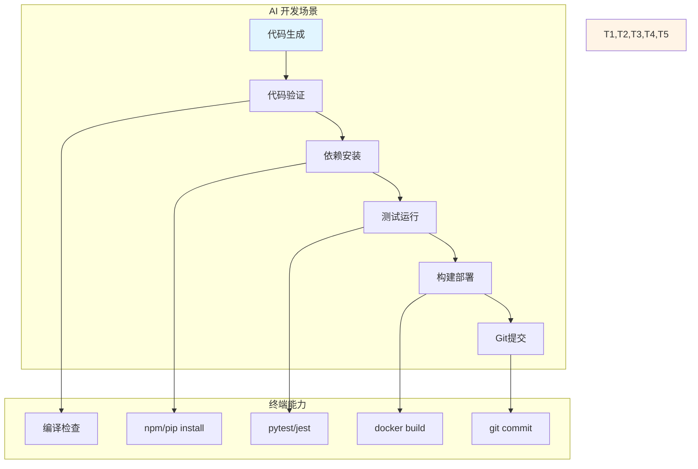
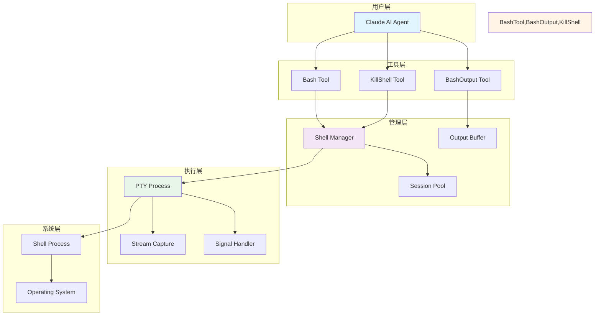
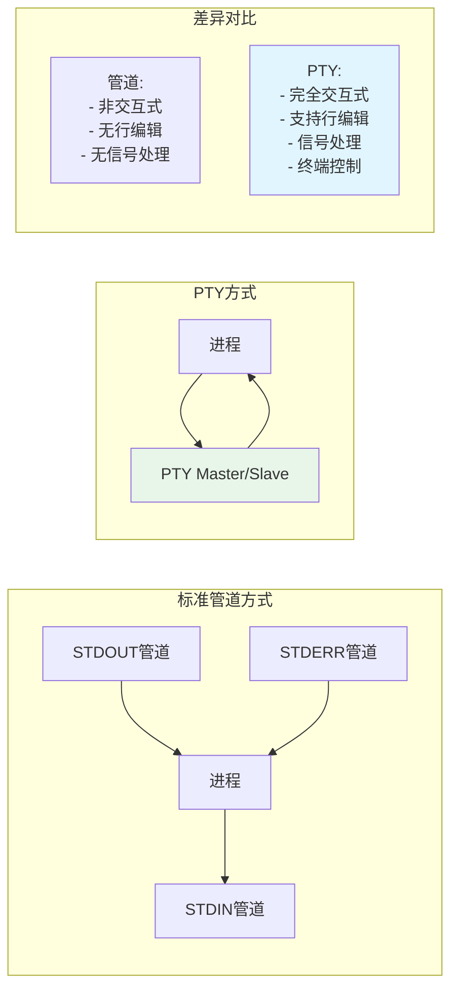
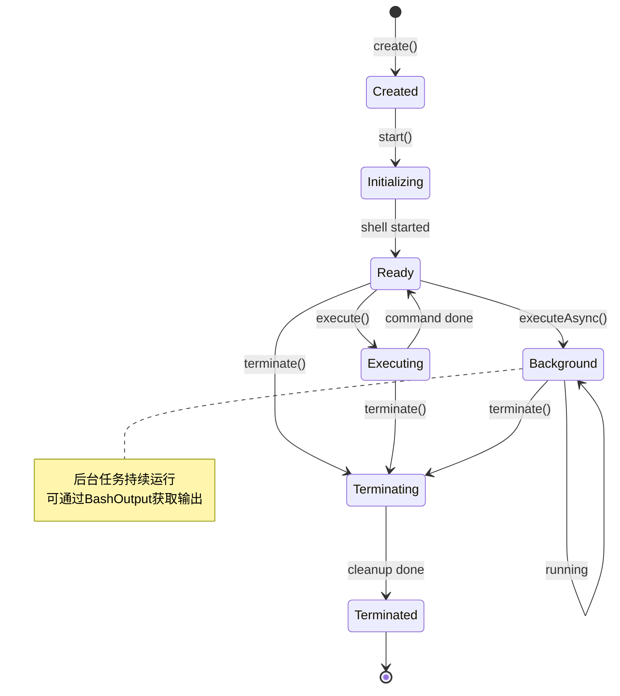
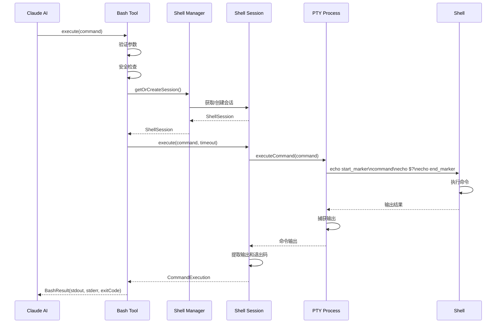
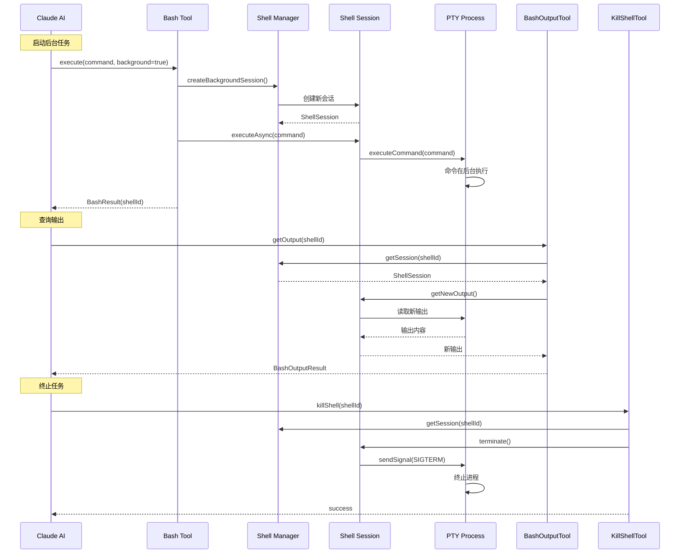

# 终端集成实现

> **技术栈说明**：本文所有代码示例已从 Java 转换为 TypeScript/Node.js 实现，使用 Node.js 原生的 `child_process` 模块和相关库。核心概念和架构思想保持一致。

## 1. 引言

终端集成是 Claude Code 最核心的能力之一，它使 AI 能够像人类开发者一样执行命令、运行脚本、管理进程。本文将深入探讨 Claude Code 如何实现强大而安全的终端集成能力。

### 1.1 为什么需要终端集成



终端集成解决的核心问题：
1. **命令执行**：运行编译、测试、构建等开发命令
2. **进程管理**：启动、监控、停止后台服务
3. **输出捕获**：获取命令执行结果和错误信息
4. **交互处理**：处理需要用户输入的命令
5. **安全控制**：防止危险命令执行

### 1.2 技术挑战

```typescript
/**
 * 终端集成面临的核心挑战
 */

// 1. 平台差异处理
interface PlatformCompatibility {
  // Windows: cmd.exe, PowerShell
  // Unix/Linux: bash, zsh, sh
  // macOS: zsh (默认), bash
  detectShell(): string;
  getShellCommand(command: string): { shell: string; args: string[] };
  normalizePath(path: string): string;
}

// 2. 异步输出流
interface OutputStreaming {
  // 命令可能产生大量输出
  // 需要实时捕获而不阻塞
  onStdout: (data: Buffer) => void;
  onStderr: (data: Buffer) => void;
  captureStreamingOutput(): AsyncIterable<string>;
}

// 3. 进程生命周期管理
interface ProcessLifecycle {
  // 长运行进程管理
  // 孤儿进程清理
  // 信号处理 (SIGTERM, SIGKILL, SIGINT)
  startProcess(command: string): Promise<ChildProcess>;
  stopProcess(pid: number, signal?: NodeJS.Signals): Promise<void>;
  cleanupOrphanProcesses(): Promise<void>;
}

// 4. 交互式命令处理
interface InteractiveCommands {
  // 需要用户输入的命令
  // PTY vs Pipe 模式选择
  createPTY(command: string): IPty;
  sendInput(input: string): void;
  handlePrompts(): Promise<void>;
}

// 5. 安全控制策略
interface SecurityControl {
  // 命令注入防护
  // 危险操作拦截
  // 资源限制 (CPU, 内存, 超时)
  validateCommand(command: string): boolean;
  sanitizeInput(input: string): string;
  enforceResourceLimits(limits: ResourceLimits): void;
}

// 资源限制配置
interface ResourceLimits {
  maxExecutionTime?: number;  // 最大执行时间(ms)
  maxMemory?: number;          // 最大内存(bytes)
  maxOutputSize?: number;      // 最大输出大小(bytes)
}
```

## 2. Bash工具架构设计

### 2.1 整体架构



### 2.2 核心组件实现

```typescript
import { spawn, ChildProcess } from 'child_process';
import { EventEmitter } from 'events';

/**
 * Bash 工具参数
 */
export interface BashParams {
  command: string;                // 必需：要执行的命令
  description?: string;           // 可选：命令描述
  timeout?: number;               // 可选：超时时间(ms)
  runInBackground?: boolean;      // 可选：是否后台运行
  cwd?: string;                   // 可选：工作目录
  env?: NodeJS.ProcessEnv;        // 可选：环境变量
}

/**
 * 执行结果
 */
export interface BashResult {
  stdout: string;                 // 标准输出
  stderr: string;                 // 标准错误
  exitCode: number | null;        // 退出码
  shellId?: string;               // 后台任务的 Shell ID
  executionTime: number;          // 执行时间(ms)
  isSuccess: boolean;             // 是否成功
}

/**
 * Bash 工具核心实现
 */
export class BashTool {
  private shellManager: ShellManager;
  private securityValidator: SecurityValidator;

  constructor() {
    this.shellManager = new ShellManager();
    this.securityValidator = new SecurityValidator();
  }

  /**
   * 执行 Bash 命令
   */
  async execute(params: BashParams): Promise<BashResult> {
    // 1. 参数验证
    this.validateParams(params);

    // 2. 安全检查
    this.securityValidator.validate(params.command);

    // 3. 根据执行模式分发
    if (params.runInBackground) {
      return this.executeInBackground(params);
    } else {
      return this.executeSynchronously(params);
    }
  }

  /**
   * 同步执行命令
   */
  private async executeSynchronously(params: BashParams): Promise<BashResult> {
    const startTime = Date.now();

    try {
      // 获取或创建 Shell 会话
      const session = await this.shellManager.getOrCreateSession();

      // 执行命令
      const timeout = params.timeout ?? 120000; // 默认 2 分钟
      const execution = await session.execute(params.command, timeout);

      // 等待完成并捕获输出
      await execution.waitForCompletion();

      return {
        stdout: execution.getStdout(),
        stderr: execution.getStderr(),
        exitCode: execution.getExitCode(),
        executionTime: Date.now() - startTime,
        isSuccess: execution.getExitCode() === 0
      };

    } catch (error: any) {
      if (error.name === 'TimeoutError') {
        return {
          stdout: '',
          stderr: `Command timed out after ${params.timeout}ms`,
          exitCode: -1,
          executionTime: Date.now() - startTime,
          isSuccess: false
        };
      }

      return {
        stdout: '',
        stderr: `Execution failed: ${error.message}`,
        exitCode: -1,
        executionTime: Date.now() - startTime,
        isSuccess: false
      };
    }
  }

  /**
   * 后台执行命令
   */
  private async executeInBackground(params: BashParams): Promise<BashResult> {
    try {
      // 创建新的后台 Shell 会话
      const backgroundSession = await this.shellManager.createBackgroundSession();

      // 启动命令
      await backgroundSession.executeAsync(params.command);

      const shellId = backgroundSession.getId();

      return {
        stdout: `Command started in background with shell ID: ${shellId}`,
        stderr: '',
        exitCode: 0,
        shellId,
        executionTime: 0,
        isSuccess: true
      };

    } catch (error: any) {
      return {
        stdout: '',
        stderr: `Failed to start background command: ${error.message}`,
        exitCode: -1,
        executionTime: 0,
        isSuccess: false
      };
    }
  }

  /**
   * 参数验证
   */
  private validateParams(params: BashParams): void {
    if (!params.command || params.command.trim().length === 0) {
      throw new Error('Command is required');
    }

    if (params.timeout !== undefined) {
      if (params.timeout < 0) {
        throw new Error('Timeout must be positive');
      }
      if (params.timeout > 600000) {
        throw new Error('Timeout cannot exceed 10 minutes (600000ms)');
      }
    }
  }
}

/**
 * BashOutput 参数
 */
export interface BashOutputParams {
  bashId: string;                  // 必需：Shell ID
  filter?: string;                 // 可选：正则过滤器
}

/**
 * BashOutput 结果
 */
export interface BashOutputResult {
  output: string;                  // 新输出
  status: 'running' | 'completed' | 'failed';  // 状态
  exitCode?: number;               // 退出码（如果已完成）
}

/**
 * BashOutput 工具 - 获取后台任务输出
 */
export class BashOutputTool {
  private shellManager: ShellManager;

  constructor() {
    this.shellManager = new ShellManager();
  }

  /**
   * 获取后台任务输出
   */
  async getOutput(params: BashOutputParams): Promise<BashOutputResult> {
    const session = this.shellManager.getSession(params.bashId);

    if (!session) {
      throw new Error(`Shell not found: ${params.bashId}`);
    }

    // 获取新输出（自上次读取以来）
    let output = session.getNewOutput();

    // 应用过滤器
    if (params.filter) {
      output = this.filterOutput(output, params.filter);
    }

    return {
      output,
      status: session.getStatus(),
      exitCode: session.getExitCode()
    };
  }

  /**
   * 使用正则表达式过滤输出
   */
  private filterOutput(output: string, regex: string): string {
    try {
      const pattern = new RegExp(regex);
      return output
        .split('\n')
        .filter(line => pattern.test(line))
        .join('\n');
    } catch (error) {
      // 如果正则表达式无效，返回原始输出
      console.warn(`Invalid regex filter: ${regex}`);
      return output;
    }
  }
}

/**
 * KillShell 参数
 */
export interface KillShellParams {
  shellId: string;                 // 必需：Shell ID
}

/**
 * KillShell 结果
 */
export interface KillShellResult {
  success: boolean;
  message: string;
}

/**
 * KillShell 工具 - 终止后台任务
 */
export class KillShellTool {
  private shellManager: ShellManager;

  constructor() {
    this.shellManager = new ShellManager();
  }

  /**
   * 终止 Shell 会话
   */
  async killShell(params: KillShellParams): Promise<KillShellResult> {
    const session = this.shellManager.getSession(params.shellId);

    if (!session) {
      return {
        success: false,
        message: `Shell not found: ${params.shellId}`
      };
    }

    try {
      await session.terminate();
      this.shellManager.removeSession(params.shellId);

      return {
        success: true,
        message: 'Shell terminated successfully'
      };

    } catch (error: any) {
      return {
        success: false,
        message: `Failed to terminate shell: ${error.message}`
      };
    }
  }
}
```

## 3. PTY（伪终端）技术详解

### 3.1 PTY vs 标准管道



### 3.2 PTY实现

```typescript
import { spawn, ChildProcess } from 'child_process';
import { IPty, spawn as ptySpawn } from 'node-pty';
import * as os from 'os';

/**
 * PTY 配置
 */
export interface PtyConfig {
  shell?: string;                  // Shell 路径
  workingDir?: string;             // 工作目录
  env?: NodeJS.ProcessEnv;         // 环境变量
  rows?: number;                   // 终端行数
  cols?: number;                   // 终端列数
}

/**
 * PTY（伪终端）实现
 * 使用 node-pty 库提供跨平台 PTY 支持
 */
export class PtyProcess {
  private pty: IPty;
  private outputBuffer: OutputBuffer;

  /**
   * 创建默认配置
   */
  static defaultConfig(): PtyConfig {
    return {
      shell: this.detectDefaultShell(),
      workingDir: process.cwd(),
      env: process.env,
      rows: 24,
      cols: 80
    };
  }

  /**
   * 检测默认 Shell
   */
  private static detectDefaultShell(): string {
    const platform = os.platform();

    if (platform === 'win32') {
      return process.env.COMSPEC || 'cmd.exe';
    } else if (platform === 'darwin') {
      return '/bin/zsh';  // macOS 默认
    } else {
      return process.env.SHELL || '/bin/bash';  // Linux 默认
    }
  }

  /**
   * 创建 PTY 进程
   */
  static create(config: PtyConfig): PtyProcess {
    const finalConfig = { ...this.defaultConfig(), ...config };

    // 使用 node-pty 创建 PTY
    const pty = ptySpawn(finalConfig.shell!, {
      name: 'xterm-256color',
      cols: finalConfig.cols || 80,
      rows: finalConfig.rows || 24,
      cwd: finalConfig.workingDir,
      env: finalConfig.env as any
    });

    return new PtyProcess(pty);
  }

  /**
   * 构造函数
   */
  private constructor(pty: IPty) {
    this.pty = pty;
    this.outputBuffer = new OutputBuffer();
    this.startOutputReader();
  }

  /**
   * 启动输出读取
   */
  private startOutputReader(): void {
    this.pty.onData((data: string) => {
      this.outputBuffer.append(data);
    });
  }

  /**
   * 执行命令
   */
  executeCommand(command: string): void {
    this.pty.write(command + '\n');
  }

  /**
   * 获取输出
   */
  getOutput(): string {
    return this.outputBuffer.getAndClear();
  }

  /**
   * 获取新输出（增量）
   */
  getNewOutput(): string {
    return this.outputBuffer.getAndClear();
  }

  /**
   * 发送信号
   */
  sendSignal(signal: Signal): void {
    switch (signal) {
      case Signal.SIGINT:
        // Ctrl+C
        this.pty.kill('SIGINT');
        break;
      case Signal.SIGTERM:
        // 终止
        this.pty.kill('SIGTERM');
        break;
      case Signal.SIGKILL:
        // 强制终止
        this.pty.kill('SIGKILL');
        break;
    }
  }

  /**
   * 调整终端大小
   */
  resize(rows: number, cols: number): void {
    this.pty.resize(cols, rows);
  }

  /**
   * 是否存活
   */
  isAlive(): boolean {
    try {
      // node-pty 的 process 属性不存在则已终止
      return this.pty.pid !== undefined;
    } catch {
      return false;
    }
  }

  /**
   * 等待退出
   */
  async waitFor(timeout: number): Promise<number> {
    return new Promise((resolve, reject) => {
      let exitCode: number | undefined;

      const timer = setTimeout(() => {
        reject(new Error('Process did not exit within timeout'));
      }, timeout);

      this.pty.onExit((event) => {
        clearTimeout(timer);
        resolve(event.exitCode);
      });
    });
  }

  /**
   * 销毁进程
   */
  destroy(): void {
    if (this.isAlive()) {
      this.pty.kill('SIGTERM');

      // 等待3秒后强制终止
      setTimeout(() => {
        if (this.isAlive()) {
          this.pty.kill('SIGKILL');
        }
      }, 3000);
    }
  }
}

/**
 * 信号枚举
 */
export enum Signal {
  SIGINT = 'SIGINT',    // Ctrl+C
  SIGTERM = 'SIGTERM',  // 终止
  SIGKILL = 'SIGKILL',  // 强制终止
  SIGWINCH = 'SIGWINCH' // 窗口大小变化
}

/**
 * 输出缓冲区 - 线程安全
 */
export class OutputBuffer {
  private buffer: string = '';
  private lastReadPosition: number = 0;

  /**
   * 追加输出
   */
  append(content: string): void {
    this.buffer += content;
  }

  /**
   * 获取所有输出
   */
  getAll(): string {
    return this.buffer;
  }

  /**
   * 获取新输出（增量）
   */
  getAndClear(): string {
    if (this.lastReadPosition >= this.buffer.length) {
      return '';
    }

    const newContent = this.buffer.substring(this.lastReadPosition);
    this.lastReadPosition = this.buffer.length;
    return newContent;
  }

  /**
   * 清空缓冲区
   */
  clear(): void {
    this.buffer = '';
    this.lastReadPosition = 0;
  }

  /**
   * 获取缓冲区大小
   */
  size(): number {
    return this.buffer.length;
  }
}
```

## 4. Shell会话管理

### 4.1 会话生命周期



### 4.2 ShellSession实现

```typescript
import { v4 as uuidv4 } from 'uuid';

/**
 * 会话状态枚举
 */
export enum SessionStatus {
  CREATED = 'CREATED',           // 已创建
  INITIALIZING = 'INITIALIZING', // 初始化中
  READY = 'READY',               // 就绪
  EXECUTING = 'EXECUTING',       // 执行中
  BACKGROUND = 'BACKGROUND',     // 后台运行
  TERMINATING = 'TERMINATING',   // 终止中
  TERMINATED = 'TERMINATED'      // 已终止
}

/**
 * Shell 会话实现
 */
export class ShellSession {
  private readonly id: string;
  private readonly ptyProcess: PtyProcess;
  private readonly workingDirectory: string;
  private status: SessionStatus;
  private exitCode: number | null = null;
  private readonly environment: NodeJS.ProcessEnv;

  /**
   * 私有构造函数
   */
  private constructor(id: string, ptyProcess: PtyProcess, workingDir: string) {
    this.id = id;
    this.ptyProcess = ptyProcess;
    this.workingDirectory = workingDir;
    this.status = SessionStatus.CREATED;
    this.environment = process.env;
  }

  /**
   * 创建会话
   */
  static async create(workingDir: string): Promise<ShellSession> {
    const sessionId = uuidv4().substring(0, 8);

    // 创建 PTY 进程
    const config: PtyConfig = {
      shell: PtyProcess.detectDefaultShell(),
      workingDir: workingDir,
      env: process.env
    };

    const ptyProcess = PtyProcess.create(config);

    const session = new ShellSession(sessionId, ptyProcess, workingDir);
    await session.initialize();

    return session;
  }

  /**
   * 初始化会话
   */
  private async initialize(): Promise<void> {
    this.status = SessionStatus.INITIALIZING;

    // 等待 Shell 启动
    await new Promise(resolve => setTimeout(resolve, 100));

    // 设置环境
    this.ptyProcess.executeCommand("export PS1='CLAUDE_PROMPT> '");
    this.ptyProcess.executeCommand(`cd "${this.workingDirectory}"`);

    // 清空启动输出
    this.ptyProcess.getOutput();

    this.status = SessionStatus.READY;
  }

  /**
   * 执行命令（同步）
   */
  async execute(command: string, timeoutMs: number): Promise<CommandExecution> {
    if (this.status !== SessionStatus.READY) {
      throw new Error(`Session not ready: ${this.status}`);
    }

    this.status = SessionStatus.EXECUTING;

    try {
      // 构建命令执行对象
      const execution = new CommandExecution(command, timeoutMs);

      // 清空之前的输出
      this.ptyProcess.getOutput();

      // 生成唯一标记
      const startMarker = `CLAUDE_CMD_START_${uuidv4()}`;
      const endMarker = `CLAUDE_CMD_END_${uuidv4()}`;

      // 执行命令并标记
      this.ptyProcess.executeCommand(`echo ${startMarker}`);
      this.ptyProcess.executeCommand(command);
      const exitCode = await this.captureExitCode();
      this.ptyProcess.executeCommand(`echo ${endMarker}`);

      // 等待完成并捕获输出
      const fullOutput = await this.waitForMarker(endMarker, timeoutMs);

      // 提取实际输出
      const actualOutput = this.extractOutput(fullOutput, startMarker, endMarker);

      execution.complete(actualOutput, '', exitCode);

      return execution;

    } finally {
      this.status = SessionStatus.READY;
    }
  }

  /**
   * 执行命令（异步）
   */
  executeAsync(command: string): void {
    if (this.status !== SessionStatus.READY) {
      throw new Error(`Session not ready: ${this.status}`);
    }

    this.status = SessionStatus.BACKGROUND;

    // 直接执行命令，不等待完成
    this.ptyProcess.executeCommand(command);
  }

  /**
   * 捕获退出码
   */
  private async captureExitCode(): Promise<number> {
    // 执行 echo $? 获取上一个命令的退出码
    this.ptyProcess.executeCommand('echo EXITCODE:$?');

    // 等待输出
    await new Promise(resolve => setTimeout(resolve, 50));

    const output = this.ptyProcess.getOutput();
    const pattern = /EXITCODE:(\d+)/;
    const match = output.match(pattern);

    if (match) {
      return parseInt(match[1], 10);
    }

    return 0;
  }

  /**
   * 等待输出标记
   */
  private async waitForMarker(marker: string, timeoutMs: number): Promise<string> {
    let output = '';
    const startTime = Date.now();

    while (true) {
      // 检查超时
      if (Date.now() - startTime > timeoutMs) {
        throw new Error('Command execution timeout');
      }

      // 获取新输出
      const newOutput = this.ptyProcess.getNewOutput();
      output += newOutput;

      // 检查是否包含结束标记
      if (output.includes(marker)) {
        return output;
      }

      // 短暂休眠
      await new Promise(resolve => setTimeout(resolve, 50));
    }
  }

  /**
   * 提取实际输出
   */
  private extractOutput(fullOutput: string, startMarker: string, endMarker: string): string {
    const startIndex = fullOutput.indexOf(startMarker);
    const endIndex = fullOutput.lastIndexOf(endMarker);

    if (startIndex === -1 || endIndex === -1) {
      return fullOutput;
    }

    // 提取标记之间的内容
    const extracted = fullOutput.substring(
      startIndex + startMarker.length,
      endIndex
    );

    // 移除首尾空白和提示符
    return extracted.trim()
      .replace(/^CLAUDE_PROMPT>\s*/g, '')
      .replace(/CLAUDE_PROMPT>\s*$/g, '')
      .trim();
  }

  /**
   * 获取新输出
   */
  getNewOutput(): string {
    if (this.status === SessionStatus.BACKGROUND) {
      return this.ptyProcess.getNewOutput();
    }
    return '';
  }

  /**
   * 获取状态
   */
  getStatus(): string {
    if (this.status === SessionStatus.BACKGROUND && !this.ptyProcess.isAlive()) {
      this.status = SessionStatus.TERMINATED;
      this.exitCode = 0; // PTY 进程已退出
    }
    return this.status.toLowerCase();
  }

  /**
   * 终止会话
   */
  async terminate(): Promise<void> {
    if (this.status === SessionStatus.TERMINATED) {
      return;
    }

    this.status = SessionStatus.TERMINATING;

    try {
      // 发送 SIGTERM
      this.ptyProcess.sendSignal(Signal.SIGTERM);

      // 等待 3 秒
      try {
        this.exitCode = await this.ptyProcess.waitFor(3000);
      } catch (error) {
        // 强制终止
        this.ptyProcess.sendSignal(Signal.SIGKILL);
      }

    } finally {
      this.ptyProcess.destroy();
      this.status = SessionStatus.TERMINATED;
    }
  }

  // Getters
  getId(): string { return this.id; }
  getExitCode(): number | null { return this.exitCode; }
  getWorkingDirectory(): string { return this.workingDirectory; }
}

/**
 * 命令执行结果
 */
export class CommandExecution {
  private readonly command: string;
  private readonly timeout: number;
  private stdout: string = '';
  private stderr: string = '';
  private exitCode: number | null = null;
  private completed: boolean = false;

  constructor(command: string, timeout: number) {
    this.command = command;
    this.timeout = timeout;
  }

  complete(stdout: string, stderr: string, exitCode: number): void {
    this.stdout = stdout;
    this.stderr = stderr;
    this.exitCode = exitCode;
    this.completed = true;
  }

  waitForCompletion(): void {
    // 已在 execute 中同步等待
  }

  // Getters
  getStdout(): string { return this.stdout; }
  getStderr(): string { return this.stderr; }
  getExitCode(): number | null { return this.exitCode; }
  isCompleted(): boolean { return this.completed; }
}
```

### 4.3 ShellManager实现

```typescript
/**
 * Shell 会话管理器
 */
export class ShellManager {
  private readonly sessions: Map<string, ShellSession> = new Map();
  private readonly defaultWorkingDir: string;
  private defaultSession: ShellSession | null = null;
  private cleanupInterval: NodeJS.Timeout | null = null;

  constructor(workingDir?: string) {
    this.defaultWorkingDir = workingDir || process.cwd();

    // 启动清理任务
    this.cleanupInterval = setInterval(() => {
      this.cleanupTerminatedSessions();
    }, 60000); // 1 分钟
  }

  /**
   * 获取或创建默认会话
   */
  async getOrCreateSession(): Promise<ShellSession> {
    if (this.defaultSession === null || this.defaultSession.getStatus() !== 'ready') {
      this.defaultSession = await ShellSession.create(this.defaultWorkingDir);
    }
    return this.defaultSession;
  }

  /**
   * 创建后台会话
   */
  async createBackgroundSession(): Promise<ShellSession> {
    const session = await ShellSession.create(this.defaultWorkingDir);
    this.sessions.set(session.getId(), session);
    return session;
  }

  /**
   * 获取会话
   */
  getSession(sessionId: string): ShellSession | undefined {
    return this.sessions.get(sessionId);
  }

  /**
   * 移除会话
   */
  async removeSession(sessionId: string): Promise<void> {
    const session = this.sessions.get(sessionId);
    if (session) {
      await session.terminate();
      this.sessions.delete(sessionId);
    }
  }

  /**
   * 清理已终止的会话
   */
  private cleanupTerminatedSessions(): void {
    const toRemove: string[] = [];

    for (const [sessionId, session] of this.sessions.entries()) {
      if (session.getStatus() === 'terminated') {
        toRemove.push(sessionId);
      }
    }

    toRemove.forEach(sessionId => {
      this.sessions.delete(sessionId);
    });
  }

  /**
   * 关闭所有会话
   */
  async shutdown(): Promise<void> {
    // 终止所有会话
    const terminatePromises = Array.from(this.sessions.values()).map(session =>
      session.terminate()
    );
    await Promise.all(terminatePromises);
    this.sessions.clear();

    if (this.defaultSession) {
      await this.defaultSession.terminate();
      this.defaultSession = null;
    }

    // 关闭清理任务
    if (this.cleanupInterval) {
      clearInterval(this.cleanupInterval);
      this.cleanupInterval = null;
    }
  }
}
```

## 5. 命令执行流程

### 5.1 同步执行流程



### 5.2 异步执行流程



## 6. 安全机制

### 6.1 安全验证器

```typescript
/**
 * 安全规则接口
 */
export interface SecurityRule {
  validate(command: string): ValidationResult;
}

/**
 * 验证结果
 */
export class ValidationResult {
  constructor(
    public readonly valid: boolean,
    public readonly reason: string | null = null
  ) {}

  static valid(): ValidationResult {
    return new ValidationResult(true, null);
  }

  static invalid(reason: string): ValidationResult {
    return new ValidationResult(false, reason);
  }

  isValid(): boolean { return this.valid; }
  getReason(): string | null { return this.reason; }
}

/**
 * 危险命令规则
 */
export class DangerousCommandRule implements SecurityRule {
  private static readonly DANGEROUS_COMMANDS: string[] = [
    'rm -rf /',
    ':(){ :|:& };:',  // Fork bomb
    'dd if=/dev/random',
    'mkfs',
    'chmod 777 -R /',
    '> /dev/sda'
  ];

  private static readonly DANGEROUS_PATTERNS: RegExp[] = [
    /rm\s+-rf\s+\//,
    /dd\s+.*of=\/dev\//,
    /mkfs\./,
    /chmod\s+777\s+-R\s+\//
  ];

  validate(command: string): ValidationResult {
    // 检查完全匹配
    for (const dangerous of DangerousCommandRule.DANGEROUS_COMMANDS) {
      if (command.includes(dangerous)) {
        return ValidationResult.invalid(
          `Dangerous command detected: ${dangerous}`
        );
      }
    }

    // 检查模式匹配
    for (const pattern of DangerousCommandRule.DANGEROUS_PATTERNS) {
      if (pattern.test(command)) {
        return ValidationResult.invalid(
          `Dangerous command pattern detected: ${pattern.source}`
        );
      }
    }

    return ValidationResult.valid();
  }
}

/**
 * 命令注入规则
 */
export class CommandInjectionRule implements SecurityRule {
  private static readonly INJECTION_CHARS: string[] = [
    ';', '&&', '||', '|', '`', '$(', '$('
  ];

  validate(command: string): ValidationResult {
    // 检查是否包含多个命令
    let commandCount = 0;
    for (const injectionChar of CommandInjectionRule.INJECTION_CHARS) {
      if (command.includes(injectionChar)) {
        commandCount++;
      }
    }

    // 允许合理的命令链接（如 cd && ls）
    // 但警惕复杂的注入尝试
    if (commandCount > 3) {
      return ValidationResult.invalid(
        'Possible command injection detected'
      );
    }

    return ValidationResult.valid();
  }
}

/**
 * 路径遍历规则
 */
export class PathTraversalRule implements SecurityRule {
  validate(command: string): ValidationResult {
    // 检查路径遍历攻击
    if (command.includes('../../../')) {
      return ValidationResult.invalid(
        'Path traversal attack detected'
      );
    }

    return ValidationResult.valid();
  }
}

/**
 * 权限提升规则
 */
export class PrivilegeEscalationRule implements SecurityRule {
  private static readonly PRIVILEGE_COMMANDS: string[] = [
    'sudo', 'su', 'doas'
  ];

  validate(command: string): ValidationResult {
    // 检查权限提升命令
    const parts = command.trim().split(/\s+/);
    if (parts.length > 0) {
      const firstCommand = parts[0];

      if (PrivilegeEscalationRule.PRIVILEGE_COMMANDS.includes(firstCommand)) {
        return ValidationResult.invalid(
          `Privilege escalation command blocked: ${firstCommand}`
        );
      }
    }

    return ValidationResult.valid();
  }
}

/**
 * 命令安全验证器
 */
export class SecurityValidator {
  private readonly rules: SecurityRule[] = [];

  constructor() {
    // 初始化安全规则
    this.initializeDefaultRules();
  }

  /**
   * 验证命令
   */
  validate(command: string): void {
    for (const rule of this.rules) {
      const result = rule.validate(command);

      if (!result.isValid()) {
        throw new Error(
          `Command blocked by security rule: ${result.getReason()}`
        );
      }
    }
  }

  /**
   * 初始化默认规则
   */
  private initializeDefaultRules(): void {
    // 1. 危险命令拦截
    this.rules.push(new DangerousCommandRule());

    // 2. 命令注入防护
    this.rules.push(new CommandInjectionRule());

    // 3. 路径遍历防护
    this.rules.push(new PathTraversalRule());

    // 4. 权限提升防护
    this.rules.push(new PrivilegeEscalationRule());
  }
}
```

### 6.2 超时控制

```typescript
/**
 * 超时控制器
 */
export class TimeoutController {
  /**
   * 执行带超时的任务
   */
  async executeWithTimeout<T>(
    task: () => Promise<T>,
    timeout: number
  ): Promise<T> {
    return new Promise((resolve, reject) => {
      const timer = setTimeout(() => {
        reject(new Error('Task timeout'));
      }, timeout);

      task()
        .then((result) => {
          clearTimeout(timer);
          resolve(result);
        })
        .catch((error) => {
          clearTimeout(timer);
          reject(error);
        });
    });
  }

  /**
   * 调度超时终止
   */
  scheduleTimeout(
    timeoutAction: () => void,
    delay: number
  ): NodeJS.Timeout {
    return setTimeout(timeoutAction, delay);
  }
}
```

## 7. 交互式命令处理

### 7.1 交互式场景

```typescript
/**
 * 交互式命令检测和处理
 */
export class InteractiveCommandHandler {
  // 已知的交互式命令
  private static readonly INTERACTIVE_COMMANDS: Set<string> = new Set([
    'vi', 'vim', 'nano', 'emacs',    // 编辑器
    'less', 'more',                   // 分页器
    'top', 'htop',                    // 监控工具
    'ssh', 'ftp',                     // 远程工具
    'python', 'node', 'irb'           // REPL
  ]);

  /**
   * 检测是否为交互式命令
   */
  isInteractive(command: string): boolean {
    const parts = command.trim().split(/\s+/);
    if (parts.length === 0) {
      return false;
    }

    const baseCommand = parts[0];

    // 检查是否在已知列表中
    if (InteractiveCommandHandler.INTERACTIVE_COMMANDS.has(baseCommand)) {
      return true;
    }

    // 检查是否有交互式标志
    // 例如：python 没有 -c 参数时是交互式的
    if (baseCommand === 'python' || baseCommand === 'python3') {
      return !command.includes('-c');
    }

    return false;
  }

  /**
   * 转换为非交互式命令
   */
  makeNonInteractive(command: string): string {
    const parts = command.trim().split(/\s+/);
    const baseCommand = parts[0];

    switch (baseCommand) {
      case 'vi':
      case 'vim':
        // vim -c 'command' -c 'wq' file
        return command + " -c 'wq'";

      case 'less':
      case 'more':
        // 使用 cat 替代
        return command.replace(/less/g, 'cat').replace(/more/g, 'cat');

      case 'top':
      case 'htop':
        // top -b -n 1 (批量模式，执行一次)
        return command + ' -b -n 1';

      default:
        throw new Error(
          `Cannot make command non-interactive: ${command}`
        );
    }
  }

  /**
   * 建议替代命令
   */
  suggestAlternative(command: string): string {
    const parts = command.trim().split(/\s+/);
    const baseCommand = parts[0];

    const alternatives: Record<string, string> = {
      'vi': "Consider using: echo 'content' > file",
      'vim': "Consider using: echo 'content' > file",
      'nano': "Consider using: echo 'content' > file",
      'less': 'Consider using: cat file',
      'top': 'Consider using: ps aux',
      'ssh': 'This command requires manual interaction',
      'python': "Use: python -c 'code' or python script.py"
    };

    return alternatives[baseCommand] ||
      'This command may require manual interaction';
  }
}
```

## 8. 实战案例

### 8.1 案例1：运行测试套件

```typescript
/**
 * 运行测试套件示例
 */
export class TestRunnerExample {
  private readonly bashTool: BashTool;

  constructor(bashTool: BashTool) {
    this.bashTool = bashTool;
  }

  async runTests(projectPath: string): Promise<void> {
    // 1. 检查项目类型
    const checkResult = await this.bashTool.execute({
      command: `cd "${projectPath}" && ls`,
      description: 'Check project structure'
    });

    const output = checkResult.stdout;

    // 2. 根据项目类型执行测试
    if (output.includes('package.json')) {
      await this.runNodeTests(projectPath);
    } else if (output.includes('pom.xml')) {
      await this.runMavenTests(projectPath);
    } else if (output.includes('requirements.txt')) {
      await this.runPythonTests(projectPath);
    }
  }

  private async runNodeTests(projectPath: string): Promise<void> {
    // 安装依赖
    const installResult = await this.bashTool.execute({
      command: `cd "${projectPath}" && npm install`,
      description: 'Install npm dependencies',
      timeout: 300000  // 5分钟
    });

    if (!installResult.isSuccess) {
      console.error('Failed to install dependencies:', installResult.stderr);
      return;
    }

    // 运行测试
    const testResult = await this.bashTool.execute({
      command: `cd "${projectPath}" && npm test`,
      description: 'Run npm tests',
      timeout: 600000  // 10分钟
    });

    // 分析测试结果
    this.analyzeTestOutput(testResult.stdout);
  }

  private async runMavenTests(projectPath: string): Promise<void> {
    const testResult = await this.bashTool.execute({
      command: `cd "${projectPath}" && mvn test`,
      description: 'Run Maven tests',
      timeout: 600000
    });

    this.analyzeTestOutput(testResult.stdout);
  }

  private analyzeTestOutput(output: string): void {
    // 提取测试统计
    const pattern = /Tests run: (\d+), Failures: (\d+), Errors: (\d+)/;
    const match = output.match(pattern);

    if (match) {
      const total = parseInt(match[1], 10);
      const failures = parseInt(match[2], 10);
      const errors = parseInt(match[3], 10);

      console.log('Test Results:');
      console.log(`  Total: ${total}`);
      console.log(`  Passed: ${total - failures - errors}`);
      console.log(`  Failed: ${failures}`);
      console.log(`  Errors: ${errors}`);
    }
  }
}
```

### 8.2 案例2：后台服务管理

```typescript
/**
 * 后台服务管理示例
 */
export class BackgroundServiceExample {
  private readonly bashTool: BashTool;
  private readonly outputTool: BashOutputTool;
  private readonly killTool: KillShellTool;

  constructor(
    bashTool: BashTool,
    outputTool: BashOutputTool,
    killTool: KillShellTool
  ) {
    this.bashTool = bashTool;
    this.outputTool = outputTool;
    this.killTool = killTool;
  }

  /**
   * 启动开发服务器
   */
  async startDevServer(projectPath: string): Promise<string> {
    // 启动服务器（后台运行）
    const startResult = await this.bashTool.execute({
      command: `cd "${projectPath}" && npm run dev`,
      description: 'Start development server',
      runInBackground: true
    });

    const shellId = startResult.shellId!;
    console.log(`Server started with shell ID: ${shellId}`);

    // 等待服务器启动
    await this.waitForServerReady(shellId);

    return shellId;
  }

  /**
   * 等待服务器就绪
   */
  private async waitForServerReady(shellId: string): Promise<void> {
    const maxAttempts = 30;
    let attempt = 0;

    while (attempt < maxAttempts) {
      await new Promise(resolve => setTimeout(resolve, 1000));

      // 检查输出
      const output = await this.outputTool.getOutput({
        bashId: shellId
      });

      // 检查是否包含就绪信号
      if (output.output.includes('Server running') ||
          output.output.includes('Compiled successfully')) {
        console.log('Server is ready!');
        return;
      }

      // 检查错误
      if (output.output.includes('Error') ||
          output.output.includes('EADDRINUSE')) {
        console.error('Server failed to start:');
        console.error(output.output);
        await this.killTool.killShell({ shellId });
        throw new Error('Server startup failed');
      }

      attempt++;
    }

    throw new Error('Server startup timeout');
  }

  /**
   * 监控服务器日志
   */
  async monitorServerLogs(shellId: string, durationSeconds: number): Promise<void> {
    const endTime = Date.now() + (durationSeconds * 1000);

    while (Date.now() < endTime) {
      const output = await this.outputTool.getOutput({
        bashId: shellId
      });

      if (output.output.length > 0) {
        console.log('=== Server Log ===');
        console.log(output.output);
      }

      // 检查服务器状态
      if (output.status === 'terminated') {
        console.error('Server has terminated!');
        break;
      }

      await new Promise(resolve => setTimeout(resolve, 2000));
    }
  }

  /**
   * 停止服务器
   */
  async stopServer(shellId: string): Promise<void> {
    console.log('Stopping server...');

    const result = await this.killTool.killShell({
      shellId
    });

    if (result.success) {
      console.log('Server stopped successfully');
    } else {
      console.error(`Failed to stop server: ${result.message}`);
    }
  }

  /**
   * 完整的服务器生命周期管理
   */
  async manageServerLifecycle(projectPath: string): Promise<void> {
    let shellId: string | null = null;

    try {
      // 启动服务器
      shellId = await this.startDevServer(projectPath);

      // 监控一段时间
      await this.monitorServerLogs(shellId, 60);

    } finally {
      // 确保清理
      if (shellId) {
        await this.stopServer(shellId);
      }
    }
  }
}
```

### 8.3 案例3：Git操作自动化

```typescript
/**
 * Git 操作自动化示例
 */
export class GitAutomationExample {
  private readonly bashTool: BashTool;

  constructor(bashTool: BashTool) {
    this.bashTool = bashTool;
  }

  /**
   * 创建分支并提交
   */
  async createBranchAndCommit(
    repoPath: string,
    branchName: string,
    commitMessage: string
  ): Promise<void> {
    // 1. 检查当前状态
    const statusResult = await this.bashTool.execute({
      command: `cd "${repoPath}" && git status --porcelain`,
      description: 'Check git status'
    });

    if (statusResult.stdout.trim().length > 0) {
      console.log('Uncommitted changes detected');
    }

    // 2. 创建新分支
    const branchResult = await this.bashTool.execute({
      command: `cd "${repoPath}" && git checkout -b ${branchName}`,
      description: 'Create new branch'
    });

    if (!branchResult.isSuccess) {
      throw new Error(`Failed to create branch: ${branchResult.stderr}`);
    }

    // 3. 添加文件
    await this.bashTool.execute({
      command: `cd "${repoPath}" && git add .`,
      description: 'Stage all changes'
    });

    // 4. 提交
    const commitResult = await this.bashTool.execute({
      command: `cd "${repoPath}" && git commit -m "${this.escapeCommitMessage(commitMessage)}"`,
      description: 'Commit changes'
    });

    if (commitResult.isSuccess) {
      console.log(`Committed successfully: ${commitMessage}`);
    } else {
      console.error(`Commit failed: ${commitResult.stderr}`);
    }
  }

  /**
   * 推送到远程
   */
  async pushToRemote(repoPath: string, branchName: string): Promise<void> {
    // 推送分支
    const pushResult = await this.bashTool.execute({
      command: `cd "${repoPath}" && git push -u origin ${branchName}`,
      description: 'Push to remote',
      timeout: 300000  // 5分钟
    });

    if (pushResult.isSuccess) {
      console.log(`Pushed successfully to origin/${branchName}`);
    } else {
      console.error(`Push failed: ${pushResult.stderr}`);
    }
  }

  /**
   * 创建 Pull Request（使用 gh CLI）
   */
  async createPullRequest(
    repoPath: string,
    title: string,
    body: string
  ): Promise<void> {
    const prResult = await this.bashTool.execute({
      command: `cd "${repoPath}" && gh pr create --title "${title}" --body "${body}"`,
      description: 'Create pull request'
    });

    if (prResult.isSuccess) {
      console.log('Pull request created:');
      console.log(prResult.stdout);
    } else {
      console.error(`Failed to create PR: ${prResult.stderr}`);
    }
  }

  /**
   * 转义提交消息
   */
  private escapeCommitMessage(message: string): string {
    return message
      .replace(/\\/g, '\\\\')
      .replace(/"/g, '\\"')
      .replace(/'/g, "\\'")
      .replace(/\n/g, '\\n');
  }
}
```

## 9. 最佳实践

### 9.1 命令执行最佳实践

```java
/**
 * 命令执行最佳实践
 */
public class CommandExecutionBestPractices {

    /**
     * 1. 始终设置工作目录
     */
    public void alwaysSetWorkingDirectory() {
        // ❌ 不好：依赖当前目录
        bashTool.execute(BashParams.builder()
            .command("npm install")
            .build());

        // ✅ 好：明确指定工作目录
        bashTool.execute(BashParams.builder()
            .command("cd /path/to/project && npm install")
            .build());
    }

    /**
     * 2. 处理路径中的空格
     */
    public void handleSpacesInPaths() {
        String pathWithSpaces = "/Users/name/My Documents/project";

        // ❌ 不好：未引用路径
        bashTool.execute(BashParams.builder()
            .command("cd " + pathWithSpaces)
            .build());

        // ✅ 好：使用引号
        bashTool.execute(BashParams.builder()
            .command("cd \"" + pathWithSpaces + "\"")
            .build());
    }

    /**
     * 3. 使用 && 链接相关命令
     */
    public void chainRelatedCommands() {
        // ❌ 不好：多次调用
        bashTool.execute(BashParams.builder()
            .command("cd /path/to/project")
            .build());
        bashTool.execute(BashParams.builder()
            .command("npm install")
            .build());

        // ✅ 好：链接命令
        bashTool.execute(BashParams.builder()
            .command("cd /path/to/project && npm install")
            .build());
    }

    /**
     * 4. 设置适当的超时
     */
    public void setAppropriateTi timeouts() {
        // 快速命令：短超时
        bashTool.execute(BashParams.builder()
            .command("ls -la")
            .timeout(5000L)  // 5秒
            .build());

        // 耗时命令：长超时
        bashTool.execute(BashParams.builder()
            .command("npm install")
            .timeout(300000L)  // 5分钟
            .build());

        // 非常耗时的命令：考虑后台执行
        bashTool.execute(BashParams.builder()
            .command("docker build -t myapp .")
            .runInBackground(true)
            .build());
    }

    /**
     * 5. 检查退出码
     */
    public void checkExitCodes() {
        BashResult result = bashTool.execute(BashParams.builder()
            .command("npm test")
            .build());

        if (!result.isSuccess()) {
            // 处理错误
            System.err.println("Tests failed:");
            System.err.println(result.getStderr());
            throw new RuntimeException("Test failure");
        }
    }

    /**
     * 6. 避免交互式命令
     */
    public void avoidInteractiveCommands() {
        // ❌ 不好：交互式命令
        bashTool.execute(BashParams.builder()
            .command("vim file.txt")
            .build());

        // ✅ 好：使用非交互式方式
        bashTool.execute(BashParams.builder()
            .command("echo 'content' > file.txt")
            .build());
    }

    /**
     * 7. 后台任务清理
     */
    public void cleanupBackgroundTasks() {
        String shellId = null;

        try {
            BashResult result = bashTool.execute(BashParams.builder()
                .command("npm run dev")
                .runInBackground(true)
                .build());

            shellId = result.getShellId();

            // 使用服务器...

        } finally {
            // 确保清理
            if (shellId != null) {
                killShellTool.killShell(KillShellParams.builder()
                    .shellId(shellId)
                    .build());
            }
        }
    }
}
```

### 9.2 错误处理模式

```java
/**
 * 错误处理模式
 */
public class ErrorHandlingPatterns {

    /**
     * 1. 重试机制
     */
    public BashResult executeWithRetry(
            BashParams params,
            int maxRetries) {

        int attempt = 0;
        BashResult lastResult = null;

        while (attempt < maxRetries) {
            lastResult = bashTool.execute(params);

            if (lastResult.isSuccess()) {
                return lastResult;
            }

            attempt++;
            System.out.println("Retry " + attempt + "/" + maxRetries);

            try {
                Thread.sleep(1000 * attempt);  // 指数退避
            } catch (InterruptedException e) {
                Thread.currentThread().interrupt();
                break;
            }
        }

        throw new RuntimeException("Command failed after " + maxRetries
            + " retries: " + lastResult.getStderr());
    }

    /**
     * 2. 回退机制
     */
    public void executeWithFallback() {
        try {
            // 尝试首选命令
            bashTool.execute(BashParams.builder()
                .command("npm run build")
                .build());
        } catch (Exception e) {
            // 回退到备用命令
            System.out.println("npm build failed, trying alternative...");
            bashTool.execute(BashParams.builder()
                .command("yarn build")
                .build());
        }
    }

    /**
     * 3. 超时恢复
     */
    public BashResult executeWithTimeoutRecovery(BashParams params) {
        try {
            return bashTool.execute(params);
        } catch (TimeoutException e) {
            System.err.println("Command timed out, attempting cleanup...");

            // 清理可能的孤儿进程
            bashTool.execute(BashParams.builder()
                .command("pkill -f '" + extractCommand(params.getCommand()) + "'")
                .build());

            throw e;
        }
    }

    private String extractCommand(String fullCommand) {
        return fullCommand.split("&&")[0].trim();
    }
}
```

## 10. 实战练习

### 练习1：实现智能测试运行器

```java
/**
 * 练习1：实现智能测试运行器
 *
 * 要求：
 * 1. 自动检测项目类型（Node.js, Java, Python等）
 * 2. 安装依赖
 * 3. 运行测试
 * 4. 解析测试结果
 * 5. 生成测试报告
 */
public class SmartTestRunner {

    private final BashTool bashTool;

    public TestReport runTests(String projectPath) {
        // TODO: 实现智能测试运行逻辑
        throw new UnsupportedOperationException("请实现此方法");
    }

    public static class TestReport {
        private int totalTests;
        private int passedTests;
        private int failedTests;
        private List<String> failures;
        private long executionTime;

        // Getters and setters
    }
}
```

### 练习2：实现进程监控器

```java
/**
 * 练习2：实现进程监控器
 *
 * 要求：
 * 1. 启动后台进程
 * 2. 实时监控输出
 * 3. 检测错误和警告
 * 4. 自动重启失败的进程
 * 5. 资源使用统计
 */
public class ProcessMonitor {

    private final BashTool bashTool;
    private final BashOutputTool outputTool;
    private final KillShellTool killTool;

    public void monitorProcess(
            String command,
            MonitorConfig config,
            ProcessCallback callback) {
        // TODO: 实现进程监控逻辑
        throw new UnsupportedOperationException("请实现此方法");
    }

    public interface ProcessCallback {
        void onOutput(String output);
        void onError(String error);
        void onExit(int exitCode);
    }

    public static class MonitorConfig {
        private boolean autoRestart;
        private int maxRestarts;
        private long healthCheckInterval;
        private Pattern errorPattern;
    }
}
```

### 练习3：实现部署流水线

```java
/**
 * 练习3：实现部署流水线
 *
 * 要求：
 * 1. 运行测试
 * 2. 构建应用
 * 3. 创建Docker镜像
 * 4. 推送到仓库
 * 5. 部署到目标环境
 * 6. 验证部署成功
 */
public class DeploymentPipeline {

    private final BashTool bashTool;

    public DeploymentResult deploy(DeploymentConfig config) {
        // TODO: 实现部署流水线
        throw new UnsupportedOperationException("请实现此方法");
    }

    public static class DeploymentConfig {
        private String projectPath;
        private String dockerRegistry;
        private String imageName;
        private String targetEnvironment;
    }

    public static class DeploymentResult {
        private boolean success;
        private String imageTag;
        private String deploymentUrl;
        private Map<String, Object> metrics;
    }
}
```

## 11. 常见问题FAQ

### Q1: 如何处理需要密码的命令？

```java
// 方案1：使用环境变量
bashTool.execute(BashParams.builder()
    .command("export MYSQL_PWD=password && mysql -u user")
    .build());

// 方案2：使用配置文件
bashTool.execute(BashParams.builder()
    .command("mysql --defaults-file=/path/to/config.cnf")
    .build());

// 方案3：使用密钥认证（推荐）
bashTool.execute(BashParams.builder()
    .command("ssh -i ~/.ssh/id_rsa user@host")
    .build());
```

### Q2: 如何处理大量输出？

```java
// 使用后台任务 + 流式读取
BashResult startResult = bashTool.execute(BashParams.builder()
    .command("large-output-command")
    .runInBackground(true)
    .build());

String shellId = startResult.getShellId();

// 定期读取输出
while (true) {
    BashOutputResult output = outputTool.getOutput(
        BashOutputParams.builder()
            .bashId(shellId)
            .build()
    );

    // 处理增量输出
    processOutput(output.getOutput());

    if ("completed".equals(output.getStatus())) {
        break;
    }

    Thread.sleep(1000);
}
```

### Q3: 如何跨平台兼容？

```java
public class CrossPlatformCommands {

    public String getListCommand() {
        if (isWindows()) {
            return "dir";
        } else {
            return "ls -la";
        }
    }

    public String getCopyCommand(String src, String dest) {
        if (isWindows()) {
            return "copy \"" + src + "\" \"" + dest + "\"";
        } else {
            return "cp \"" + src + "\" \"" + dest + "\"";
        }
    }

    private boolean isWindows() {
        return System.getProperty("os.name")
            .toLowerCase().contains("win");
    }
}
```

## 12. 总结

终端集成是 Claude Code 的核心能力，本文深入探讨了：

1. **PTY技术**：实现完整的终端模拟
2. **会话管理**：持久化Shell会话，支持工作目录
3. **同步/异步执行**：灵活的命令执行模式
4. **后台任务管理**：启动、监控、终止后台进程
5. **安全机制**：命令过滤、超时控制、权限管理
6. **最佳实践**：命令链接、错误处理、资源清理

通过这些技术，Claude Code 能够像人类开发者一样执行各种开发任务，从代码编译、测试运行到部署发布，实现真正的端到端自动化。

### 关键要点

1. 使用PTY而非标准管道，获得完整的终端能力
2. 合理设置超时，避免命令挂起
3. 后台任务务必清理，防止资源泄漏
4. 实施严格的安全策略，防止危险操作
5. 提供清晰的错误信息和重试机制
