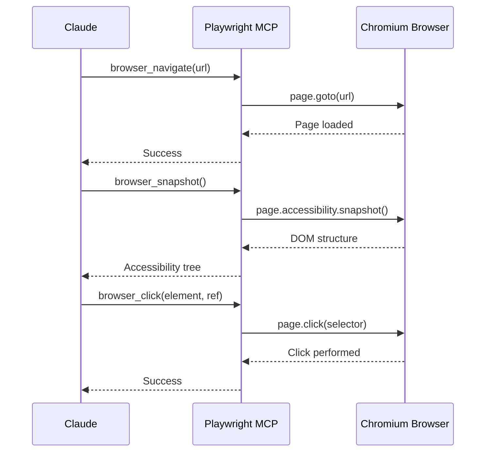

# 第9篇：MCP协议深入解析

## 引言

Model Context Protocol (MCP) 是 Claude Code 扩展性的核心基础，它提供了一套标准化的协议，让第三方开发者能够为 Claude Code 开发自定义工具和服务。本文将深入探讨 MCP 协议的设计理念、技术规范和实战开发。

### 为什么需要 MCP 协议？

在 MCP 出现之前，AI 应用集成外部工具面临诸多挑战：

1. **缺乏标准**：每个 AI 应用有自己的工具定义方式
2. **重复开发**：相同的工具需要为不同平台重复开发
3. **维护困难**：工具更新需要同步修改多个应用
4. **生态割裂**：无法共享工具和最佳实践

MCP 的出现解决了这些问题：

✅ **标准化接口**：统一的协议规范，工具定义一次，到处可用
✅ **松耦合设计**：MCP Server 独立运行，易于开发和维护
✅ **生态共享**：社区可以共享 MCP Server，加速生态建设
✅ **灵活扩展**：支持任意类型的工具和服务集成

### 本文目标

通过本文，你将学习到：
- MCP 协议的设计理念和技术架构
- JSON-RPC 通信协议详解
- 如何开发一个完整的 MCP Server
- 内置 MCP 工具的实现原理
- 生产环境的最佳实践


## 二、协议规范和消息格式

### 2.1 JSON-RPC 2.0 基础

MCP 基于 **JSON-RPC 2.0** 协议，这是一个轻量级的远程过程调用协议。

**JSON-RPC 请求格式**：
```json
{
  "jsonrpc": "2.0",
  "id": "1",
  "method": "tools/call",
  "params": {
    "name": "read_file",
    "arguments": {
      "path": "/path/to/file.txt"
    }
  }
}
```

**JSON-RPC 响应格式**：
```json
{
  "jsonrpc": "2.0",
  "id": "1",
  "result": {
    "content": "file content here...",
    "isError": false
  }
}
```

**错误响应格式**：
```json
{
  "jsonrpc": "2.0",
  "id": "1",
  "error": {
    "code": -32600,
    "message": "Invalid Request",
    "data": {
      "details": "Missing required parameter: path"
    }
  }
}
```

### 2.2 MCP 消息类型

MCP 定义了以下核心消息类型：

```mermaid
graph TB
    A[MCP消息类型] --> B[初始化类]
    A --> C[工具类]
    A --> D[资源类]
    A --> E[提示类]
    A --> F[日志类]

    B --> B1[initialize - 初始化连接]
    B --> B2[initialized - 初始化完成]

    C --> C1[tools/list - 列出工具]
    C --> C2[tools/call - 调用工具]

    D --> D1[resources/list - 列出资源]
    D --> D2[resources/read - 读取资源]

    E --> E1[prompts/list - 列出提示]
    E --> E2[prompts/get - 获取提示]

    F --> F1[logging/setLevel - 设置日志级别]
    F --> F2[notifications/message - 日志消息]

    style A fill:#e1f5ff,stroke:#333,stroke-width:3px
```



### 2.3 完整通信流程

```mermaid
sequenceDiagram
    participant Client as MCP Client<br/>(Claude Code)
    participant Server as MCP Server<br/>(Git Server)

    Note over Client,Server: 1. 初始化阶段
    Client->>Server: initialize
    Note right of Client: 请求服务器信息
    Server-->>Client: 返回服务器能力
    Client->>Server: initialized
    Note right of Client: 确认初始化完成

    Note over Client,Server: 2. 发现工具阶段
    Client->>Server: tools/list
    Server-->>Client: 返回工具列表
    Note left of Server: [git_status, git_commit, ...]

    Note over Client,Server: 3. 调用工具阶段
    Client->>Server: tools/call(git_status)
    Server->>Server: 执行 git status
    Server-->>Client: 返回执行结果

    Client->>Server: tools/call(git_commit)
    Server->>Server: 执行 git commit
    Server-->>Client: 返回执行结果

    Note over Client,Server: 4. 断开连接
    Client->>Server: close
```



### 2.4 MCP 工具定义规范

每个 MCP 工具必须包含以下字段：

```typescript
interface MCPTool {
  // 工具名称（唯一标识）
  name: string;

  // 工具描述（给 AI 看的，帮助 AI 理解何时使用）
  description: string;

  // 输入参数 Schema（JSON Schema 格式）
  inputSchema: {
    type: "object";
    properties: Record<string, JSONSchema>;
    required?: string[];
  };
}

// 示例：Git Status 工具定义
const gitStatusTool: MCPTool = {
  name: "git_status",
  description: "Get the current git status of the repository, including staged, unstaged, and untracked files.",
  inputSchema: {
    type: "object",
    properties: {
      path: {
        type: "string",
        description: "Repository path (optional, defaults to current directory)"
      },
      short: {
        type: "boolean",
        description: "Use short format"
      }
    },
    required: []
  }
};
```


## 四、开发 MCP Server 的完整流程

### 4.1 开发流程图

```mermaid
graph TB
    A[1. 需求分析] --> B[2. 工具设计]
    B --> C[3. 项目搭建]
    C --> D[4. 实现工具]
    D --> E[5. 测试]
    E --> F[6. 配置]
    F --> G[7. 部署]

    B --> B1[定义工具列表]
    B --> B2[设计参数Schema]
    B --> B3[编写工具描述]

    D --> D1[实现核心逻辑]
    D --> D2[错误处理]
    D --> D3[日志记录]

    E --> E1[单元测试]
    E --> E2[集成测试]
    E --> E3[手动测试]

    style A fill:#e1f5ff
    style B fill:#ffe1f5
    style C fill:#fff4e1
    style D fill:#e1ffe1
```



### 4.2 步骤详解

#### **步骤 1：需求分析**

明确要实现的功能：
- 需要哪些工具？
- 每个工具解决什么问题？
- 工具的输入输出是什么？

#### **步骤 2：工具设计**

设计工具接口：
```typescript
// 设计文档示例
/**
 * Git MCP Server 工具列表
 *
 * 1. git_status
 *    - 功能：获取 git 仓库状态
 *    - 输入：path (可选)
 *    - 输出：状态信息文本
 *
 * 2. git_commit
 *    - 功能：创建 git 提交
 *    - 输入：message (必需), files (可选)
 *    - 输出：提交结果
 *
 * 3. git_log
 *    - 功能：查看提交历史
 *    - 输入：count (可选), format (可选)
 *    - 输出：提交历史列表
 */
```

#### **步骤 3：项目搭建**

创建项目结构：
```bash
git-mcp-server/
├── package.json
├── tsconfig.json
├── src/
│   ├── index.ts        # 入口文件
│   ├── server.ts       # Server 主类
│   ├── tools/          # 工具实现
│   │   ├── status.ts
│   │   ├── commit.ts
│   │   └── log.ts
│   └── types.ts        # 类型定义
├── test/               # 测试文件
└── README.md
```

**package.json**：
```json
{
  "name": "git-mcp-server",
  "version": "1.0.0",
  "description": "MCP Server for Git operations",
  "main": "dist/index.js",
  "bin": {
    "git-mcp-server": "./dist/index.js"
  },
  "scripts": {
    "build": "tsc",
    "start": "node dist/index.js",
    "dev": "ts-node src/index.ts",
    "test": "jest"
  },
  "dependencies": {
    "simple-git": "^3.20.0"
  },
  "devDependencies": {
    "@types/node": "^20.0.0",
    "typescript": "^5.0.0",
    "ts-node": "^10.9.0",
    "jest": "^29.0.0"
  }
}
```

**tsconfig.json**：
```json
{
  "compilerOptions": {
    "target": "ES2020",
    "module": "commonjs",
    "lib": ["ES2020"],
    "outDir": "./dist",
    "rootDir": "./src",
    "strict": true,
    "esModuleInterop": true,
    "skipLibCheck": true,
    "forceConsistentCasingInFileNames": true,
    "declaration": true,
    "declarationMap": true,
    "sourceMap": true
  },
  "include": ["src/**/*"],
  "exclude": ["node_modules", "dist", "test"]
}
```


## 六、内置 MCP 工具解析

Claude Code 内置了几个重要的 MCP Server：

### 6.1 Playwright MCP Server

用于浏览器自动化和网页操作。

**核心工具**：
```typescript
// 浏览器操作工具
const playwrightTools = [
  {
    name: "browser_navigate",
    description: "Navigate to a URL",
    inputSchema: {
      type: "object",
      properties: {
        url: { type: "string", description: "URL to navigate to" }
      },
      required: ["url"]
    }
  },
  {
    name: "browser_snapshot",
    description: "Capture accessibility snapshot of the current page",
    inputSchema: {
      type: "object",
      properties: {}
    }
  },
  {
    name: "browser_click",
    description: "Click on an element",
    inputSchema: {
      type: "object",
      properties: {
        element: { type: "string", description: "Element description" },
        ref: { type: "string", description: "Element reference" }
      },
      required: ["element", "ref"]
    }
  },
  {
    name: "browser_type",
    description: "Type text into an element",
    inputSchema: {
      type: "object",
      properties: {
        element: { type: "string" },
        ref: { type: "string" },
        text: { type: "string" },
        submit: { type: "boolean", description: "Press Enter after typing" }
      },
      required: ["element", "ref", "text"]
    }
  },
  {
    name: "browser_take_screenshot",
    description: "Take a screenshot",
    inputSchema: {
      type: "object",
      properties: {
        filename: { type: "string" },
        fullPage: { type: "boolean" }
      }
    }
  }
];
```

**工作流程**：


### 6.2 Filesystem MCP Server

提供文件系统操作能力。

**核心工具**：
- `fs_read_file`: 读取文件
- `fs_write_file`: 写入文件
- `fs_list_directory`: 列出目录
- `fs_create_directory`: 创建目录
- `fs_delete_file`: 删除文件

### 6.3 工具发现和加载机制

```mermaid
graph TB
    A[Claude Code 启动] --> B[读取配置文件]
    B --> C[解析 MCP Server 配置]
    C --> D{Server类型}

    D -->|stdio| E1[启动子进程]
    D -->|sse| E2[建立 HTTP 连接]

    E1 --> F1[通过 stdio 通信]
    E2 --> F2[通过 SSE 通信]

    F1 --> G[发送 initialize]
    F2 --> G

    G --> H[接收服务器能力]
    H --> I[请求工具列表]
    I --> J[注册到工具系统]
    J --> K[Server 就绪]

    style A fill:#e1f5ff
    style K fill:#e1ffe1
```



**配置示例**：
```json
{
  "mcpServers": {
    "git": {
      "command": "node",
      "args": ["/path/to/git-mcp-server/dist/index.js"],
      "env": {}
    },
    "playwright": {
      "command": "npx",
      "args": ["-y", "@modelcontextprotocol/server-playwright"],
      "env": {}
    },
    "filesystem": {
      "command": "npx",
      "args": ["-y", "@modelcontextprotocol/server-filesystem", "/allowed/path"],
      "env": {}
    }
  }
}
```

**加载逻辑**：
```typescript
class MCPManager {
  private clients: Map<string, MCPClient> = new Map();

  async loadServers(config: MCPConfig): Promise<void> {
    for (const [name, serverConfig] of Object.entries(config.mcpServers)) {
      try {
        console.log(`Loading MCP Server: ${name}`);

        // 创建客户端
        const client = new MCPClient({
          name,
          command: serverConfig.command,
          args: serverConfig.args,
          env: serverConfig.env
        });

        // 启动 Server
        await client.start();

        // 初始化
        await client.initialize();

        // 获取工具列表
        const tools = await client.listTools();

        // 注册工具到全局工具注册表
        for (const tool of tools) {
          toolRegistry.register(tool, async (params) => {
            return await client.callTool(tool.name, params);
          });
        }

        this.clients.set(name, client);
        console.log(`✓ Loaded ${name}: ${tools.length} tools`);
      } catch (error) {
        console.error(`✗ Failed to load ${name}:`, error);
      }
    }
  }
}
```


## 八、配置 MCP Server

### 8.1 Claude Code 配置文件

MCP Server 需要在 Claude Code 的配置文件中注册。

**配置文件位置**：
- macOS: `~/Library/Application Support/Claude/claude_desktop_config.json`
- Windows: `%APPDATA%\Claude\claude_desktop_config.json`
- Linux: `~/.config/Claude/claude_desktop_config.json`

**完整配置示例**：
```json
{
  "mcpServers": {
    "git": {
      "command": "node",
      "args": ["/Users/you/git-mcp-server/dist/index.js"],
      "env": {}
    },
    "sqlite": {
      "command": "node",
      "args": ["/Users/you/sqlite-mcp-server/dist/index.js"],
      "env": {}
    },
    "http": {
      "command": "node",
      "args": ["/Users/you/http-mcp-server/dist/index.js"],
      "env": {}
    },
    "playwright": {
      "command": "npx",
      "args": ["-y", "@modelcontextprotocol/server-playwright"],
      "env": {
        "DISPLAY": ":0"
      }
    }
  },
  "globalShortcut": "Cmd+Shift+Space",
  "theme": "dark"
}
```

### 8.2 使用 Git MCP Server

**添加到配置**：
```json
{
  "mcpServers": {
    "git": {
      "command": "node",
      "args": ["/absolute/path/to/git-mcp-server/dist/index.js"],
      "env": {}
    }
  }
}
```

**重启 Claude Code**：
```bash
# 配置修改后需要重启 Claude Code
# 通过菜单或命令行重启
```

**验证加载**：
```bash
# 在 Claude Code 中询问
"What MCP tools are available?"

# Claude 会列出所有可用的 MCP 工具，包括：
# - git_status
# - git_commit
# - git_log
```

**使用示例**：
```
User: "Please show me the git status of the current repository"

Claude: [调用 git_status 工具]

Git Status (/path/to/repo)

On branch: main
Tracking: origin/main

Changes not staged for commit:
  modified: src/index.ts
  modified: README.md

Untracked files:
  test.txt
```


## 十、常见问题 FAQ

### Q1: MCP Server 无法启动怎么办？

**排查步骤**：
```bash
# 1. 检查配置文件路径是否正确
cat ~/Library/Application\ Support/Claude/claude_desktop_config.json

# 2. 手动测试 Server
node /path/to/mcp-server/dist/index.js

# 3. 查看 Claude Code 日志
tail -f ~/Library/Logs/Claude/mcp.log

# 4. 检查 Node.js 版本
node --version  # 需要 >= 18.0.0
```

### Q2: 工具调用失败如何调试？

**调试技巧**：
```typescript
// 在工具执行函数中添加详细日志
export async function executeTool(params: any): Promise<string> {
  // 记录到 stderr（不会干扰 JSON-RPC 通信）
  console.error("[DEBUG] Tool called with params:", JSON.stringify(params, null, 2));

  try {
    const result = await doSomething(params);
    console.error("[DEBUG] Tool execution successful");
    return result;
  } catch (error) {
    console.error("[ERROR] Tool execution failed:", error);
    throw error;
  }
}
```

### Q3: 如何支持多个仓库/项目？

**方案一：使用路径参数**
```typescript
// 每个工具接受 path 参数
{
  name: "git_status",
  inputSchema: {
    properties: {
      path: {
        type: "string",
        description: "Repository path (default: current directory)"
      }
    }
  }
}
```

**方案二：多个 Server 实例**
```json
{
  "mcpServers": {
    "git-project-a": {
      "command": "node",
      "args": ["/path/to/git-mcp-server/dist/index.js"],
      "env": {
        "DEFAULT_REPO": "/projects/project-a"
      }
    },
    "git-project-b": {
      "command": "node",
      "args": ["/path/to/git-mcp-server/dist/index.js"],
      "env": {
        "DEFAULT_REPO": "/projects/project-b"
      }
    }
  }
}
```

### Q4: MCP Server 可以访问网络吗？

**可以**。MCP Server 是独立的 Node.js 进程，可以：
- 发送 HTTP 请求
- 连接数据库
- 调用外部 API
- 使用 WebSocket
- 等等

示例：
```typescript
// 调用外部 API 的 MCP 工具
async function callExternalAPI(params: { endpoint: string }): Promise<string> {
  const response = await fetch(`https://api.example.com/${params.endpoint}`);
  const data = await response.json();
  return JSON.stringify(data, null, 2);
}
```

### Q5: 如何发布和分享 MCP Server？

**发布到 npm**：
```bash
# 1. 准备 package.json
{
  "name": "@your-org/git-mcp-server",
  "version": "1.0.0",
  "bin": {
    "git-mcp-server": "./dist/index.js"
  }
}

# 2. 发布
npm publish

# 3. 用户安装
npm install -g @your-org/git-mcp-server
```

**配置使用**：
```json
{
  "mcpServers": {
    "git": {
      "command": "git-mcp-server",
      "args": []
    }
  }
}
```


## 十二、扩展阅读

### 推荐资源
- [MCP 协议官方文档](https://modelcontextprotocol.io/)
- [JSON-RPC 2.0 规范](https://www.jsonrpc.org/specification)
- [Anthropic 官方 MCP 示例](https://github.com/anthropics/mcp-servers)
- [Claude Code 文档](https://docs.claude.com/claude-code)

### 社区 MCP Servers
- **@modelcontextprotocol/server-playwright**：浏览器自动化
- **@modelcontextprotocol/server-filesystem**：文件系统操作
- **@modelcontextprotocol/server-sqlite**：SQLite 数据库
- **@modelcontextprotocol/server-github**：GitHub API 集成

### 相关技术
- **LSP (Language Server Protocol)**：类似的协议，用于语言服务
- **DAP (Debug Adapter Protocol)**：调试器协议
- **JSON-RPC**：远程过程调用协议

---

**如果觉得这篇文章对你有帮助，欢迎分享给更多的朋友！**

下一篇我们将深入探讨 **[浏览器自动化集成](./10-浏览器自动化集成.md)**，敬请期待！ 🚀
