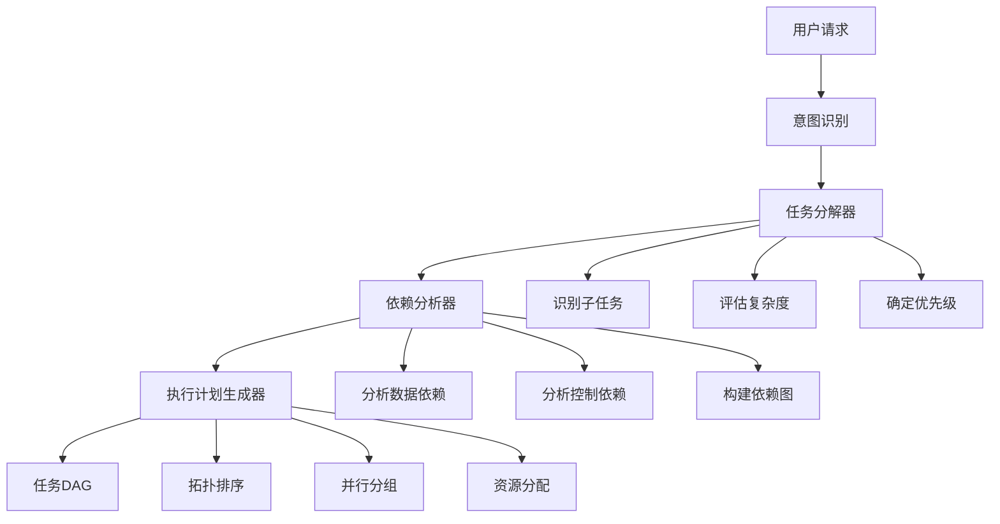
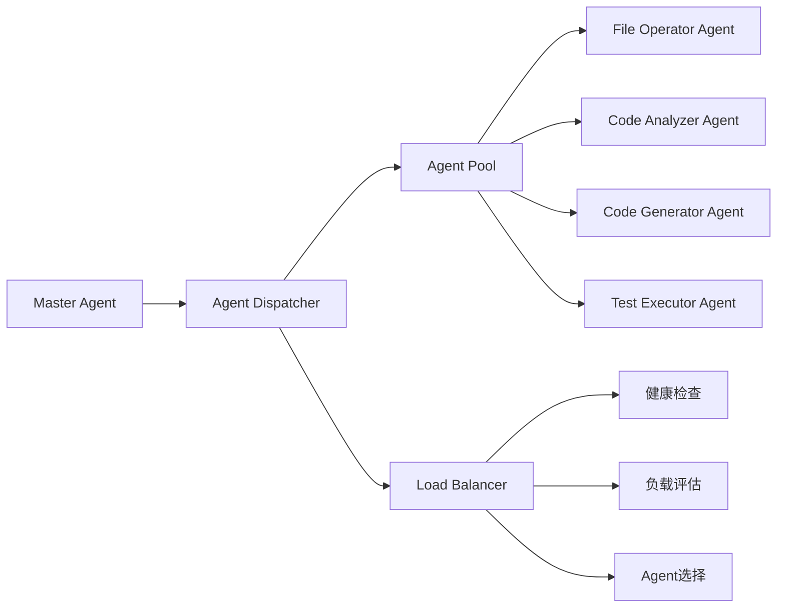
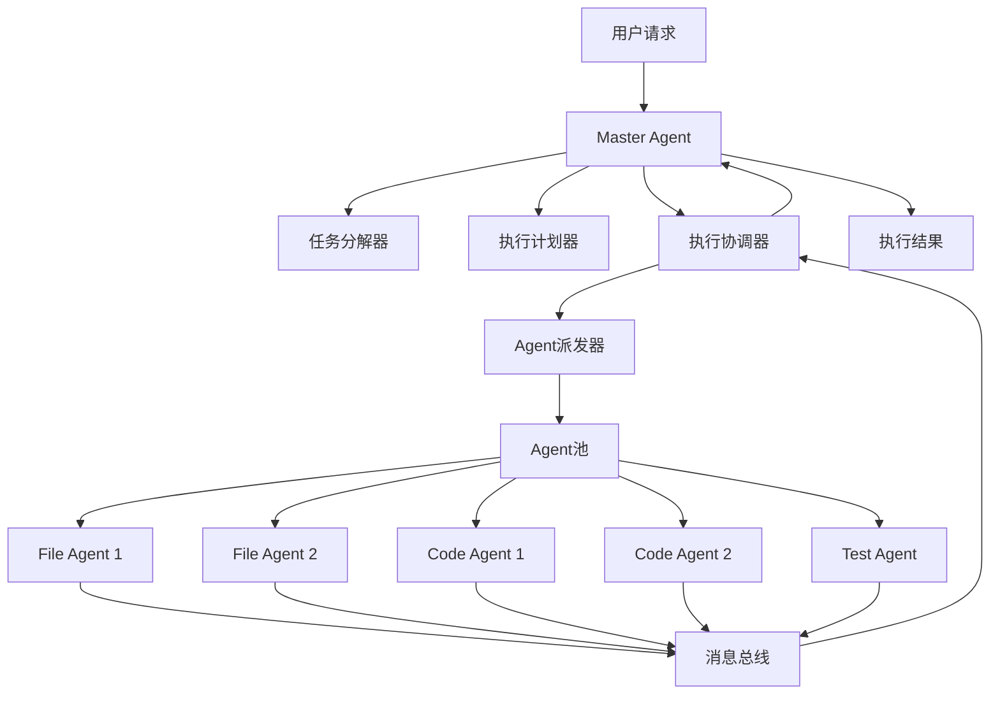
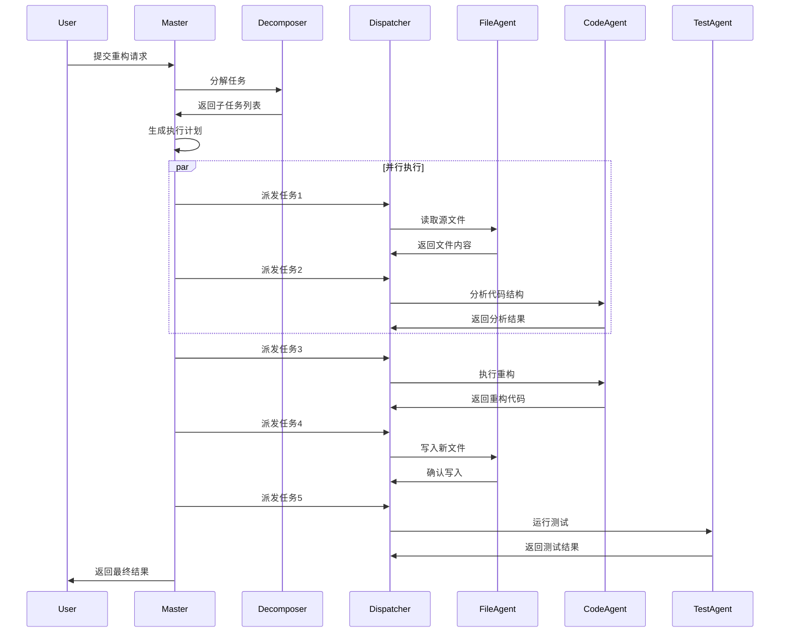

# Agent工作流引擎详解

## 1. 引言：Agent系统概述

### 1.1 什么是Agent系统

Agent系统是一种能够自主执行复杂任务的智能体架构。在Claude Code中，Agent系统负责将用户的高层次请求分解为可执行的子任务，并协调多个专门化的Agent协同完成任务。

**Agent系统的核心特征：**

- **自主性（Autonomy）**：能够在没有直接人工干预的情况下独立运作
- **反应性（Reactivity）**：能够感知环境并及时响应变化
- **主动性（Proactivity）**：能够主动采取行动以实现目标
- **社交性（Social Ability）**：能够与其他Agent通信和协作

### 1.2 Claude Code中的Agent架构

Claude Code采用分层的Agent架构：

```
┌─────────────────────────────────────────┐
│         User Request Layer              │
│    (用户请求解析和意图识别)              │
└───────────────┬─────────────────────────┘
                │
┌───────────────▼─────────────────────────┐
│      Master Agent (协调层)               │
│  - 任务分解                              │
│  - 任务规划                              │
│  - Agent派发                             │
│  - 结果聚合                              │
└───────────────┬─────────────────────────┘
                │
        ┌───────┴───────┐
        │               │
┌───────▼──────┐ ┌─────▼────────┐
│ Task Agent   │ │ Task Agent   │
│  (执行层)    │ │  (执行层)    │
│ - 文件操作   │ │ - 代码分析   │
│ - 工具调用   │ │ - 测试执行   │
└──────────────┘ └──────────────┘
```

### 1.3 Agent系统的应用场景

1. **代码重构**：分析代码结构 → 识别重构点 → 执行重构 → 验证测试
2. **功能开发**：需求分析 → 设计方案 → 实现代码 → 编写测试
3. **问题诊断**：收集信息 → 分析日志 → 定位问题 → 提供方案
4. **文档生成**：扫描代码 → 提取信息 → 生成文档 → 格式化输出

## 2. Task Agent实现原理

### 2.1 Task Agent核心架构

```java
/**
 * Task Agent基础抽象类
 * 定义了Agent的生命周期和核心能力
 */
public abstract class TaskAgent {

    private final String agentId;
    private final AgentType type;
    private final AgentContext context;
    private final ToolRegistry toolRegistry;
    private AgentState state;

    public TaskAgent(String agentId, AgentType type, AgentContext context) {
        this.agentId = agentId;
        this.type = type;
        this.context = context;
        this.toolRegistry = new ToolRegistry();
        this.state = AgentState.INITIALIZED;
    }

    /**
     * Agent生命周期：初始化
     */
    public void initialize() {
        this.state = AgentState.INITIALIZING;
        registerTools();
        loadConfiguration();
        this.state = AgentState.READY;
    }

    /**
     * Agent生命周期：执行任务
     */
    public AgentResult execute(Task task) {
        try {
            this.state = AgentState.RUNNING;

            // 1. 前置检查
            preExecute(task);

            // 2. 任务执行
            AgentResult result = doExecute(task);

            // 3. 后置处理
            postExecute(task, result);

            this.state = AgentState.COMPLETED;
            return result;

        } catch (Exception e) {
            this.state = AgentState.FAILED;
            return handleError(task, e);
        }
    }

    /**
     * 注册Agent可用的工具
     */
    protected abstract void registerTools();

    /**
     * 实际的任务执行逻辑
     */
    protected abstract AgentResult doExecute(Task task);

    /**
     * 任务执行前的检查
     */
    protected void preExecute(Task task) {
        validateTask(task);
        checkResources();
    }

    /**
     * 任务执行后的处理
     */
    protected void postExecute(Task task, AgentResult result) {
        saveExecutionLog(task, result);
        notifyObservers(result);
    }

    /**
     * 错误处理
     */
    protected AgentResult handleError(Task task, Exception e) {
        return AgentResult.failure(
            agentId,
            task.getTaskId(),
            "Execution failed: " + e.getMessage(),
            e
        );
    }

    // Getters
    public String getAgentId() { return agentId; }
    public AgentType getType() { return type; }
    public AgentState getState() { return state; }
}
```

### 2.2 Agent类型定义

```java
/**
 * Agent类型枚举
 */
public enum AgentType {

    /**
     * 主控Agent - 负责任务分解和协调
     */
    MASTER("master", "Master coordination agent"),

    /**
     * 代码分析Agent - 专注于代码理解和分析
     */
    CODE_ANALYZER("code_analyzer", "Code analysis and understanding"),

    /**
     * 文件操作Agent - 处理文件读写和搜索
     */
    FILE_OPERATOR("file_operator", "File operations and management"),

    /**
     * 测试执行Agent - 运行测试和验证
     */
    TEST_EXECUTOR("test_executor", "Test execution and validation"),

    /**
     * 代码生成Agent - 生成和修改代码
     */
    CODE_GENERATOR("code_generator", "Code generation and modification"),

    /**
     * 文档生成Agent - 创建和更新文档
     */
    DOC_GENERATOR("doc_generator", "Documentation generation");

    private final String code;
    private final String description;

    AgentType(String code, String description) {
        this.code = code;
        this.description = description;
    }

    public String getCode() { return code; }
    public String getDescription() { return description; }
}
```

### 2.3 具体Agent实现示例

```java
/**
 * 文件操作Agent实现
 */
public class FileOperatorAgent extends TaskAgent {

    private final FileSystem fileSystem;
    private final SearchEngine searchEngine;

    public FileOperatorAgent(String agentId, AgentContext context) {
        super(agentId, AgentType.FILE_OPERATOR, context);
        this.fileSystem = context.getFileSystem();
        this.searchEngine = context.getSearchEngine();
    }

    @Override
    protected void registerTools() {
        // 注册文件操作工具
        toolRegistry.register(new ReadFileTool(fileSystem));
        toolRegistry.register(new WriteFileTool(fileSystem));
        toolRegistry.register(new GlobSearchTool(searchEngine));
        toolRegistry.register(new GrepSearchTool(searchEngine));
    }

    @Override
    protected AgentResult doExecute(Task task) {
        FileOperationTask fileTask = (FileOperationTask) task;

        switch (fileTask.getOperation()) {
            case READ:
                return executeRead(fileTask);
            case WRITE:
                return executeWrite(fileTask);
            case SEARCH:
                return executeSearch(fileTask);
            default:
                throw new IllegalArgumentException(
                    "Unsupported operation: " + fileTask.getOperation()
                );
        }
    }

    private AgentResult executeRead(FileOperationTask task) {
        String filePath = task.getFilePath();

        // 使用Read工具读取文件
        ReadFileTool readTool = toolRegistry.getTool(ReadFileTool.class);
        String content = readTool.read(filePath);

        return AgentResult.success(
            getAgentId(),
            task.getTaskId(),
            content,
            Map.of("file_path", filePath, "size", content.length())
        );
    }

    private AgentResult executeWrite(FileOperationTask task) {
        String filePath = task.getFilePath();
        String content = task.getContent();

        // 使用Write工具写入文件
        WriteFileTool writeTool = toolRegistry.getTool(WriteFileTool.class);
        writeTool.write(filePath, content);

        return AgentResult.success(
            getAgentId(),
            task.getTaskId(),
            "File written successfully",
            Map.of("file_path", filePath, "size", content.length())
        );
    }

    private AgentResult executeSearch(FileOperationTask task) {
        String pattern = task.getSearchPattern();

        // 使用搜索工具
        GrepSearchTool grepTool = toolRegistry.getTool(GrepSearchTool.class);
        List<SearchResult> results = grepTool.search(pattern);

        return AgentResult.success(
            getAgentId(),
            task.getTaskId(),
            results,
            Map.of("pattern", pattern, "matches", results.size())
        );
    }
}
```

### 2.4 Agent状态管理

```java
/**
 * Agent状态枚举
 */
public enum AgentState {
    INITIALIZED("initialized", "Agent已初始化"),
    INITIALIZING("initializing", "Agent初始化中"),
    READY("ready", "Agent就绪"),
    RUNNING("running", "Agent执行中"),
    WAITING("waiting", "Agent等待中"),
    COMPLETED("completed", "Agent已完成"),
    FAILED("failed", "Agent执行失败"),
    CANCELLED("cancelled", "Agent已取消");

    private final String code;
    private final String description;

    AgentState(String code, String description) {
        this.code = code;
        this.description = description;
    }
}

/**
 * Agent状态机
 */
public class AgentStateMachine {

    private static final Map<AgentState, Set<AgentState>> VALID_TRANSITIONS =
        Map.of(
            AgentState.INITIALIZED, Set.of(AgentState.INITIALIZING),
            AgentState.INITIALIZING, Set.of(AgentState.READY, AgentState.FAILED),
            AgentState.READY, Set.of(AgentState.RUNNING),
            AgentState.RUNNING, Set.of(
                AgentState.WAITING,
                AgentState.COMPLETED,
                AgentState.FAILED,
                AgentState.CANCELLED
            ),
            AgentState.WAITING, Set.of(AgentState.RUNNING, AgentState.CANCELLED),
            AgentState.COMPLETED, Set.of(),
            AgentState.FAILED, Set.of(),
            AgentState.CANCELLED, Set.of()
        );

    private AgentState currentState;
    private final List<StateTransition> history;

    public AgentStateMachine(AgentState initialState) {
        this.currentState = initialState;
        this.history = new ArrayList<>();
    }

    /**
     * 状态转换
     */
    public void transition(AgentState newState) {
        if (!canTransition(newState)) {
            throw new IllegalStateTransitionException(
                "Cannot transition from " + currentState + " to " + newState
            );
        }

        StateTransition transition = new StateTransition(
            currentState, newState, Instant.now()
        );
        history.add(transition);
        currentState = newState;
    }

    /**
     * 检查是否可以转换到目标状态
     */
    public boolean canTransition(AgentState newState) {
        Set<AgentState> validNextStates = VALID_TRANSITIONS.get(currentState);
        return validNextStates != null && validNextStates.contains(newState);
    }

    public AgentState getCurrentState() {
        return currentState;
    }

    public List<StateTransition> getHistory() {
        return Collections.unmodifiableList(history);
    }
}
```

## 3. 多步任务规划算法

### 3.1 任务分解架构



### 3.2 任务分解器实现

```java
/**
 * 任务分解器
 * 将复杂任务分解为可执行的子任务
 */
public class TaskDecomposer {

    private final LLMClient llmClient;
    private final TaskTemplateRegistry templateRegistry;

    public TaskDecomposer(LLMClient llmClient) {
        this.llmClient = llmClient;
        this.templateRegistry = new TaskTemplateRegistry();
    }

    /**
     * 分解任务
     */
    public List<SubTask> decompose(UserRequest request) {
        // 1. 分析用户意图
        Intent intent = analyzeIntent(request);

        // 2. 匹配任务模板
        TaskTemplate template = templateRegistry.match(intent);

        // 3. 生成子任务
        List<SubTask> subTasks = template != null
            ? generateFromTemplate(template, request)
            : generateWithLLM(request);

        // 4. 评估和优化
        optimizeTaskDecomposition(subTasks);

        return subTasks;
    }

    /**
     * 分析用户意图
     */
    private Intent analyzeIntent(UserRequest request) {
        String prompt = """
            分析以下用户请求的意图：

            请求: %s

            返回JSON格式：
            {
              "intent_type": "code_refactor|feature_development|bug_fix|documentation",
              "complexity": "low|medium|high",
              "key_entities": ["entity1", "entity2"],
              "constraints": ["constraint1", "constraint2"]
            }
            """.formatted(request.getText());

        String response = llmClient.complete(prompt);
        return Intent.fromJson(response);
    }

    /**
     * 使用模板生成子任务
     */
    private List<SubTask> generateFromTemplate(
        TaskTemplate template,
        UserRequest request
    ) {
        List<SubTask> subTasks = new ArrayList<>();

        for (TaskStep step : template.getSteps()) {
            SubTask subTask = SubTask.builder()
                .taskId(UUID.randomUUID().toString())
                .name(step.getName())
                .description(step.getDescription())
                .type(step.getType())
                .agentType(step.getRequiredAgentType())
                .priority(step.getPriority())
                .estimatedDuration(step.getEstimatedDuration())
                .parameters(extractParameters(step, request))
                .build();

            subTasks.add(subTask);
        }

        return subTasks;
    }

    /**
     * 使用LLM生成子任务
     */
    private List<SubTask> generateWithLLM(UserRequest request) {
        String prompt = """
            将以下任务分解为具体的子任务：

            任务: %s

            返回JSON数组格式：
            [
              {
                "name": "子任务名称",
                "description": "详细描述",
                "type": "code_analysis|file_operation|code_generation|test_execution",
                "agent_type": "code_analyzer|file_operator|code_generator|test_executor",
                "priority": 1-10,
                "estimated_duration_seconds": 估计时长
              }
            ]

            要求：
            1. 子任务应该是原子性的、可独立执行的
            2. 按照执行顺序排列
            3. 考虑任务之间的依赖关系
            """.formatted(request.getText());

        String response = llmClient.complete(prompt);
        return parseSubTasksFromJson(response);
    }

    /**
     * 优化任务分解
     */
    private void optimizeTaskDecomposition(List<SubTask> subTasks) {
        // 1. 合并相似任务
        mergeSimilarTasks(subTasks);

        // 2. 消除冗余任务
        removeRedundantTasks(subTasks);

        // 3. 调整优先级
        adjustPriorities(subTasks);
    }

    private void mergeSimilarTasks(List<SubTask> subTasks) {
        // 使用余弦相似度检测相似任务
        for (int i = 0; i < subTasks.size(); i++) {
            for (int j = i + 1; j < subTasks.size(); j++) {
                SubTask task1 = subTasks.get(i);
                SubTask task2 = subTasks.get(j);

                if (calculateSimilarity(task1, task2) > 0.8) {
                    // 合并任务
                    SubTask merged = mergeSubTasks(task1, task2);
                    subTasks.set(i, merged);
                    subTasks.remove(j);
                    j--;
                }
            }
        }
    }
}
```

### 3.3 依赖分析器实现

```java
/**
 * 任务依赖分析器
 * 分析任务之间的依赖关系，构建依赖图
 */
public class DependencyAnalyzer {

    /**
     * 分析任务依赖关系
     */
    public TaskDependencyGraph analyze(List<SubTask> subTasks) {
        TaskDependencyGraph graph = new TaskDependencyGraph();

        // 1. 添加所有节点
        for (SubTask task : subTasks) {
            graph.addNode(task);
        }

        // 2. 分析数据依赖
        analyzeDataDependencies(subTasks, graph);

        // 3. 分析控制依赖
        analyzeControlDependencies(subTasks, graph);

        // 4. 检测循环依赖
        detectCircularDependencies(graph);

        return graph;
    }

    /**
     * 分析数据依赖
     * 如果任务B需要任务A的输出，则B依赖于A
     */
    private void analyzeDataDependencies(
        List<SubTask> subTasks,
        TaskDependencyGraph graph
    ) {
        // 构建输出映射：任务 -> 输出数据
        Map<SubTask, Set<String>> outputMap = new HashMap<>();
        for (SubTask task : subTasks) {
            outputMap.put(task, extractOutputs(task));
        }

        // 检查每个任务的输入需求
        for (SubTask task : subTasks) {
            Set<String> requiredInputs = extractInputs(task);

            // 查找能提供这些输入的任务
            for (SubTask potentialProvider : subTasks) {
                if (task.equals(potentialProvider)) continue;

                Set<String> providedOutputs = outputMap.get(potentialProvider);

                // 检查是否有交集
                Set<String> intersection = new HashSet<>(requiredInputs);
                intersection.retainAll(providedOutputs);

                if (!intersection.isEmpty()) {
                    // 添加数据依赖边
                    graph.addEdge(
                        potentialProvider,
                        task,
                        DependencyType.DATA,
                        intersection
                    );
                }
            }
        }
    }

    /**
     * 分析控制依赖
     * 某些任务必须在其他任务之前或之后执行
     */
    private void analyzeControlDependencies(
        List<SubTask> subTasks,
        TaskDependencyGraph graph
    ) {
        for (int i = 0; i < subTasks.size(); i++) {
            SubTask task = subTasks.get(i);

            // 检查任务的前置条件
            for (String precondition : task.getPreconditions()) {
                // 查找满足该前置条件的任务
                for (int j = 0; j < i; j++) {
                    SubTask candidate = subTasks.get(j);
                    if (candidate.satisfies(precondition)) {
                        graph.addEdge(
                            candidate,
                            task,
                            DependencyType.CONTROL,
                            Set.of(precondition)
                        );
                    }
                }
            }
        }
    }

    /**
     * 检测循环依赖
     */
    private void detectCircularDependencies(TaskDependencyGraph graph) {
        Set<SubTask> visited = new HashSet<>();
        Set<SubTask> recursionStack = new HashSet<>();

        for (SubTask task : graph.getAllNodes()) {
            if (hasCycle(task, graph, visited, recursionStack)) {
                throw new CircularDependencyException(
                    "Circular dependency detected involving task: " +
                    task.getName()
                );
            }
        }
    }

    private boolean hasCycle(
        SubTask task,
        TaskDependencyGraph graph,
        Set<SubTask> visited,
        Set<SubTask> recursionStack
    ) {
        if (recursionStack.contains(task)) {
            return true;
        }

        if (visited.contains(task)) {
            return false;
        }

        visited.add(task);
        recursionStack.add(task);

        for (SubTask dependency : graph.getDependencies(task)) {
            if (hasCycle(dependency, graph, visited, recursionStack)) {
                return true;
            }
        }

        recursionStack.remove(task);
        return false;
    }

    /**
     * 从任务描述中提取输入需求
     */
    private Set<String> extractInputs(SubTask task) {
        Set<String> inputs = new HashSet<>();

        // 从参数中提取
        Map<String, Object> params = task.getParameters();
        if (params.containsKey("input_file")) {
            inputs.add((String) params.get("input_file"));
        }
        if (params.containsKey("dependencies")) {
            inputs.addAll((Collection<String>) params.get("dependencies"));
        }

        return inputs;
    }

    /**
     * 从任务描述中提取输出
     */
    private Set<String> extractOutputs(SubTask task) {
        Set<String> outputs = new HashSet<>();

        // 从参数中提取
        Map<String, Object> params = task.getParameters();
        if (params.containsKey("output_file")) {
            outputs.add((String) params.get("output_file"));
        }
        if (params.containsKey("produces")) {
            outputs.addAll((Collection<String>) params.get("produces"));
        }

        return outputs;
    }
}
```

### 3.4 执行计划生成器

```java
/**
 * 执行计划生成器
 * 基于依赖图生成最优执行计划
 */
public class ExecutionPlanGenerator {

    /**
     * 生成执行计划
     */
    public ExecutionPlan generate(TaskDependencyGraph dependencyGraph) {
        // 1. 拓扑排序，确定执行顺序
        List<SubTask> orderedTasks = topologicalSort(dependencyGraph);

        // 2. 识别可并行执行的任务组
        List<TaskGroup> parallelGroups = identifyParallelGroups(
            orderedTasks,
            dependencyGraph
        );

        // 3. 资源分配和优化
        optimizeResourceAllocation(parallelGroups);

        // 4. 创建执行计划
        return ExecutionPlan.builder()
            .taskGroups(parallelGroups)
            .totalEstimatedDuration(calculateTotalDuration(parallelGroups))
            .criticalPath(findCriticalPath(dependencyGraph))
            .build();
    }

    /**
     * 拓扑排序
     */
    private List<SubTask> topologicalSort(TaskDependencyGraph graph) {
        List<SubTask> result = new ArrayList<>();
        Set<SubTask> visited = new HashSet<>();
        Map<SubTask, Integer> inDegree = calculateInDegree(graph);

        // 使用Kahn算法
        Queue<SubTask> queue = new LinkedList<>();

        // 找到所有入度为0的节点
        for (SubTask task : graph.getAllNodes()) {
            if (inDegree.get(task) == 0) {
                queue.offer(task);
            }
        }

        while (!queue.isEmpty()) {
            SubTask current = queue.poll();
            result.add(current);
            visited.add(current);

            // 更新依赖当前任务的节点的入度
            for (SubTask dependent : graph.getDependents(current)) {
                int newInDegree = inDegree.get(dependent) - 1;
                inDegree.put(dependent, newInDegree);

                if (newInDegree == 0) {
                    queue.offer(dependent);
                }
            }
        }

        // 检查是否所有节点都被访问（检测环）
        if (visited.size() != graph.size()) {
            throw new CircularDependencyException(
                "Cannot perform topological sort: circular dependency detected"
            );
        }

        return result;
    }

    /**
     * 识别可并行执行的任务组
     */
    private List<TaskGroup> identifyParallelGroups(
        List<SubTask> orderedTasks,
        TaskDependencyGraph graph
    ) {
        List<TaskGroup> groups = new ArrayList<>();
        Set<SubTask> processed = new HashSet<>();

        for (SubTask task : orderedTasks) {
            if (processed.contains(task)) continue;

            // 创建新的任务组
            TaskGroup group = new TaskGroup();
            group.add(task);
            processed.add(task);

            // 查找可以与当前任务并行的任务
            for (SubTask candidate : orderedTasks) {
                if (processed.contains(candidate)) continue;

                // 检查是否可以并行
                if (canRunInParallel(task, candidate, graph)) {
                    // 还需要检查与组内其他任务是否冲突
                    if (group.canAdd(candidate, graph)) {
                        group.add(candidate);
                        processed.add(candidate);
                    }
                }
            }

            groups.add(group);
        }

        return groups;
    }

    /**
     * 检查两个任务是否可以并行执行
     */
    private boolean canRunInParallel(
        SubTask task1,
        SubTask task2,
        TaskDependencyGraph graph
    ) {
        // 1. 检查是否有直接依赖
        if (graph.hasDependency(task1, task2) ||
            graph.hasDependency(task2, task1)) {
            return false;
        }

        // 2. 检查是否有资源冲突
        if (hasResourceConflict(task1, task2)) {
            return false;
        }

        // 3. 检查是否有数据竞争
        if (hasDataRace(task1, task2)) {
            return false;
        }

        return true;
    }

    /**
     * 计算入度
     */
    private Map<SubTask, Integer> calculateInDegree(TaskDependencyGraph graph) {
        Map<SubTask, Integer> inDegree = new HashMap<>();

        for (SubTask task : graph.getAllNodes()) {
            inDegree.put(task, 0);
        }

        for (SubTask task : graph.getAllNodes()) {
            for (SubTask dependent : graph.getDependents(task)) {
                inDegree.put(dependent, inDegree.get(dependent) + 1);
            }
        }

        return inDegree;
    }

    /**
     * 查找关键路径（最长路径）
     */
    private List<SubTask> findCriticalPath(TaskDependencyGraph graph) {
        Map<SubTask, Integer> longestPath = new HashMap<>();
        Map<SubTask, SubTask> predecessor = new HashMap<>();

        // 初始化
        for (SubTask task : graph.getAllNodes()) {
            longestPath.put(task, 0);
        }

        // 动态规划计算最长路径
        List<SubTask> sorted = topologicalSort(graph);
        for (SubTask task : sorted) {
            int currentLength = longestPath.get(task);

            for (SubTask dependent : graph.getDependents(task)) {
                int newLength = currentLength + task.getEstimatedDuration();
                if (newLength > longestPath.get(dependent)) {
                    longestPath.put(dependent, newLength);
                    predecessor.put(dependent, task);
                }
            }
        }

        // 找到最长路径的终点
        SubTask end = sorted.stream()
            .max(Comparator.comparingInt(longestPath::get))
            .orElseThrow();

        // 回溯构建路径
        List<SubTask> path = new ArrayList<>();
        SubTask current = end;
        while (current != null) {
            path.add(0, current);
            current = predecessor.get(current);
        }

        return path;
    }
}
```

## 4. 子Agent派发机制

### 4.1 Agent派发器架构



### 4.2 Agent派发器实现

```java
/**
 * Agent派发器
 * 负责将任务派发给合适的Agent执行
 */
public class AgentDispatcher {

    private final AgentPool agentPool;
    private final LoadBalancer loadBalancer;
    private final AgentHealthChecker healthChecker;
    private final ExecutorService executorService;

    public AgentDispatcher(AgentPool agentPool) {
        this.agentPool = agentPool;
        this.loadBalancer = new LoadBalancer();
        this.healthChecker = new AgentHealthChecker();
        this.executorService = Executors.newFixedThreadPool(10);
    }

    /**
     * 派发单个任务
     */
    public CompletableFuture<AgentResult> dispatch(SubTask task) {
        return CompletableFuture.supplyAsync(() -> {
            // 1. 选择合适的Agent
            TaskAgent agent = selectAgent(task);

            // 2. 执行任务
            try {
                return agent.execute(task);
            } catch (Exception e) {
                return AgentResult.failure(
                    agent.getAgentId(),
                    task.getTaskId(),
                    "Task execution failed",
                    e
                );
            }
        }, executorService);
    }

    /**
     * 批量派发任务
     */
    public List<CompletableFuture<AgentResult>> dispatchBatch(
        List<SubTask> tasks
    ) {
        return tasks.stream()
            .map(this::dispatch)
            .collect(Collectors.toList());
    }

    /**
     * 派发任务组（并行执行）
     */
    public CompletableFuture<List<AgentResult>> dispatchGroup(TaskGroup group) {
        List<CompletableFuture<AgentResult>> futures = group.getTasks()
            .stream()
            .map(this::dispatch)
            .collect(Collectors.toList());

        // 等待所有任务完成
        return CompletableFuture.allOf(
            futures.toArray(new CompletableFuture[0])
        ).thenApply(v ->
            futures.stream()
                .map(CompletableFuture::join)
                .collect(Collectors.toList())
        );
    }

    /**
     * 选择最合适的Agent
     */
    private TaskAgent selectAgent(SubTask task) {
        // 1. 获取该任务类型的所有可用Agent
        List<TaskAgent> candidates = agentPool.getAgents(task.getAgentType());

        if (candidates.isEmpty()) {
            throw new NoAvailableAgentException(
                "No available agent for type: " + task.getAgentType()
            );
        }

        // 2. 过滤健康的Agent
        List<TaskAgent> healthyAgents = candidates.stream()
            .filter(agent -> healthChecker.isHealthy(agent))
            .collect(Collectors.toList());

        if (healthyAgents.isEmpty()) {
            throw new NoHealthyAgentException(
                "No healthy agent available for type: " + task.getAgentType()
            );
        }

        // 3. 使用负载均衡器选择Agent
        return loadBalancer.select(healthyAgents, task);
    }
}
```

### 4.3 Agent池管理

```java
/**
 * Agent池
 * 管理和维护可用的Agent实例
 */
public class AgentPool {

    private final Map<AgentType, List<TaskAgent>> agentsByType;
    private final Map<String, TaskAgent> agentsById;
    private final AgentFactory agentFactory;
    private final int minAgentsPerType;
    private final int maxAgentsPerType;

    public AgentPool(AgentFactory factory, int minPerType, int maxPerType) {
        this.agentsByType = new ConcurrentHashMap<>();
        this.agentsById = new ConcurrentHashMap<>();
        this.agentFactory = factory;
        this.minAgentsPerType = minPerType;
        this.maxAgentsPerType = maxPerType;

        initializePool();
    }

    /**
     * 初始化Agent池
     */
    private void initializePool() {
        for (AgentType type : AgentType.values()) {
            if (type == AgentType.MASTER) continue;

            List<TaskAgent> agents = new ArrayList<>();
            for (int i = 0; i < minAgentsPerType; i++) {
                TaskAgent agent = agentFactory.createAgent(type);
                agent.initialize();
                agents.add(agent);
                agentsById.put(agent.getAgentId(), agent);
            }
            agentsByType.put(type, agents);
        }
    }

    /**
     * 获取指定类型的所有Agent
     */
    public List<TaskAgent> getAgents(AgentType type) {
        return new ArrayList<>(
            agentsByType.getOrDefault(type, Collections.emptyList())
        );
    }

    /**
     * 根据ID获取Agent
     */
    public TaskAgent getAgent(String agentId) {
        return agentsById.get(agentId);
    }

    /**
     * 动态扩展Agent
     */
    public TaskAgent scaleUp(AgentType type) {
        List<TaskAgent> agents = agentsByType.get(type);

        if (agents.size() >= maxAgentsPerType) {
            throw new MaxAgentLimitException(
                "Cannot create more agents of type: " + type
            );
        }

        TaskAgent newAgent = agentFactory.createAgent(type);
        newAgent.initialize();

        agents.add(newAgent);
        agentsById.put(newAgent.getAgentId(), newAgent);

        return newAgent;
    }

    /**
     * 缩减Agent
     */
    public void scaleDown(AgentType type) {
        List<TaskAgent> agents = agentsByType.get(type);

        if (agents.size() <= minAgentsPerType) {
            return;
        }

        // 找到最空闲的Agent
        TaskAgent toRemove = agents.stream()
            .filter(agent -> agent.getState() == AgentState.READY)
            .findFirst()
            .orElse(null);

        if (toRemove != null) {
            agents.remove(toRemove);
            agentsById.remove(toRemove.getAgentId());
        }
    }

    /**
     * 获取池的统计信息
     */
    public PoolStatistics getStatistics() {
        return PoolStatistics.builder()
            .totalAgents(agentsById.size())
            .agentsByType(agentsByType.entrySet().stream()
                .collect(Collectors.toMap(
                    Map.Entry::getKey,
                    e -> e.getValue().size()
                )))
            .agentsByState(calculateStateDistribution())
            .build();
    }

    private Map<AgentState, Integer> calculateStateDistribution() {
        Map<AgentState, Integer> distribution = new EnumMap<>(AgentState.class);

        for (TaskAgent agent : agentsById.values()) {
            AgentState state = agent.getState();
            distribution.put(state, distribution.getOrDefault(state, 0) + 1);
        }

        return distribution;
    }
}
```

### 4.4 负载均衡器

```java
/**
 * 负载均衡器
 * 实现多种负载均衡策略
 */
public class LoadBalancer {

    private LoadBalancingStrategy strategy;

    public LoadBalancer() {
        this.strategy = new WeightedRoundRobinStrategy();
    }

    /**
     * 选择Agent
     */
    public TaskAgent select(List<TaskAgent> agents, SubTask task) {
        return strategy.select(agents, task);
    }

    /**
     * 设置负载均衡策略
     */
    public void setStrategy(LoadBalancingStrategy strategy) {
        this.strategy = strategy;
    }
}

/**
 * 负载均衡策略接口
 */
public interface LoadBalancingStrategy {
    TaskAgent select(List<TaskAgent> agents, SubTask task);
}

/**
 * 轮询策略
 */
public class RoundRobinStrategy implements LoadBalancingStrategy {

    private final AtomicInteger counter = new AtomicInteger(0);

    @Override
    public TaskAgent select(List<TaskAgent> agents, SubTask task) {
        int index = counter.getAndIncrement() % agents.size();
        return agents.get(index);
    }
}

/**
 * 加权轮询策略
 * 根据Agent的当前负载和能力进行加权
 */
public class WeightedRoundRobinStrategy implements LoadBalancingStrategy {

    @Override
    public TaskAgent select(List<TaskAgent> agents, SubTask task) {
        // 计算每个Agent的权重
        List<WeightedAgent> weightedAgents = agents.stream()
            .map(agent -> new WeightedAgent(agent, calculateWeight(agent, task)))
            .sorted(Comparator.comparingDouble(WeightedAgent::getWeight).reversed())
            .collect(Collectors.toList());

        // 使用加权随机选择
        double totalWeight = weightedAgents.stream()
            .mapToDouble(WeightedAgent::getWeight)
            .sum();

        double random = Math.random() * totalWeight;
        double cumulativeWeight = 0;

        for (WeightedAgent wa : weightedAgents) {
            cumulativeWeight += wa.getWeight();
            if (random <= cumulativeWeight) {
                return wa.getAgent();
            }
        }

        return weightedAgents.get(0).getAgent();
    }

    /**
     * 计算Agent权重
     */
    private double calculateWeight(TaskAgent agent, SubTask task) {
        // 基础权重
        double weight = 1.0;

        // 根据Agent状态调整
        if (agent.getState() == AgentState.READY) {
            weight *= 1.5;
        } else if (agent.getState() == AgentState.RUNNING) {
            weight *= 0.5;
        }

        // 根据Agent负载调整
        int currentLoad = agent.getCurrentLoad();
        weight *= (1.0 / (1.0 + currentLoad * 0.1));

        // 根据任务匹配度调整
        double matchScore = calculateMatchScore(agent, task);
        weight *= matchScore;

        return weight;
    }

    private double calculateMatchScore(TaskAgent agent, SubTask task) {
        // 简单实现：检查Agent类型是否匹配
        return agent.getType() == task.getAgentType() ? 1.0 : 0.5;
    }

    private static class WeightedAgent {
        private final TaskAgent agent;
        private final double weight;

        public WeightedAgent(TaskAgent agent, double weight) {
            this.agent = agent;
            this.weight = weight;
        }

        public TaskAgent getAgent() { return agent; }
        public double getWeight() { return weight; }
    }
}

/**
 * 最少连接策略
 */
public class LeastConnectionStrategy implements LoadBalancingStrategy {

    @Override
    public TaskAgent select(List<TaskAgent> agents, SubTask task) {
        return agents.stream()
            .min(Comparator.comparingInt(TaskAgent::getCurrentLoad))
            .orElse(agents.get(0));
    }
}
```

## 5. 并行任务执行和协调

### 5.1 并行执行协调器

```java
/**
 * 并行执行协调器
 * 管理并行任务的执行和同步
 */
public class ParallelExecutionCoordinator {

    private final AgentDispatcher dispatcher;
    private final ExecutionPlan plan;
    private final ExecutorService executorService;
    private final Map<String, CompletableFuture<AgentResult>> taskFutures;
    private final CountDownLatch completionLatch;

    public ParallelExecutionCoordinator(
        AgentDispatcher dispatcher,
        ExecutionPlan plan
    ) {
        this.dispatcher = dispatcher;
        this.plan = plan;
        this.executorService = Executors.newCachedThreadPool();
        this.taskFutures = new ConcurrentHashMap<>();
        this.completionLatch = new CountDownLatch(plan.getTotalTaskCount());
    }

    /**
     * 执行计划
     */
    public ExecutionResult execute() {
        ExecutionResult result = new ExecutionResult();

        try {
            // 按照任务组顺序执行
            for (TaskGroup group : plan.getTaskGroups()) {
                executeGroup(group, result);
            }

            // 等待所有任务完成
            completionLatch.await();

        } catch (InterruptedException e) {
            Thread.currentThread().interrupt();
            result.setStatus(ExecutionStatus.INTERRUPTED);
        } catch (Exception e) {
            result.setStatus(ExecutionStatus.FAILED);
            result.setError(e);
        }

        return result;
    }

    /**
     * 执行任务组（并行）
     */
    private void executeGroup(TaskGroup group, ExecutionResult result) {
        List<CompletableFuture<AgentResult>> groupFutures = new ArrayList<>();

        // 并行启动组内所有任务
        for (SubTask task : group.getTasks()) {
            CompletableFuture<AgentResult> future = executeTask(task, result);
            groupFutures.add(future);
            taskFutures.put(task.getTaskId(), future);
        }

        // 等待组内所有任务完成
        CompletableFuture.allOf(
            groupFutures.toArray(new CompletableFuture[0])
        ).join();
    }

    /**
     * 执行单个任务
     */
    private CompletableFuture<AgentResult> executeTask(
        SubTask task,
        ExecutionResult result
    ) {
        return CompletableFuture.supplyAsync(() -> {
            try {
                // 等待依赖任务完成
                waitForDependencies(task);

                // 派发任务
                AgentResult agentResult = dispatcher.dispatch(task).join();

                // 记录结果
                result.addTaskResult(task.getTaskId(), agentResult);

                return agentResult;

            } catch (Exception e) {
                AgentResult errorResult = AgentResult.failure(
                    "unknown",
                    task.getTaskId(),
                    "Task execution failed",
                    e
                );
                result.addTaskResult(task.getTaskId(), errorResult);
                return errorResult;

            } finally {
                completionLatch.countDown();
            }
        }, executorService);
    }

    /**
     * 等待依赖任务完成
     */
    private void waitForDependencies(SubTask task) {
        List<String> dependencies = task.getDependencies();

        if (dependencies.isEmpty()) {
            return;
        }

        // 收集依赖任务的Future
        List<CompletableFuture<AgentResult>> dependencyFutures =
            dependencies.stream()
                .map(taskFutures::get)
                .filter(Objects::nonNull)
                .collect(Collectors.toList());

        // 等待所有依赖完成
        CompletableFuture.allOf(
            dependencyFutures.toArray(new CompletableFuture[0])
        ).join();

        // 检查依赖任务是否都成功
        for (CompletableFuture<AgentResult> future : dependencyFutures) {
            AgentResult depResult = future.join();
            if (!depResult.isSuccess()) {
                throw new DependencyFailedException(
                    "Dependency task failed: " + depResult.getTaskId()
                );
            }
        }
    }

    /**
     * 关闭协调器
     */
    public void shutdown() {
        executorService.shutdown();
        try {
            if (!executorService.awaitTermination(60, TimeUnit.SECONDS)) {
                executorService.shutdownNow();
            }
        } catch (InterruptedException e) {
            executorService.shutdownNow();
            Thread.currentThread().interrupt();
        }
    }
}
```

### 5.2 任务同步机制

```java
/**
 * 任务同步点
 * 用于协调多个任务的执行顺序
 */
public class TaskBarrier {

    private final int expectedTasks;
    private final AtomicInteger arrivedTasks;
    private final CountDownLatch latch;
    private final List<AgentResult> results;

    public TaskBarrier(int expectedTasks) {
        this.expectedTasks = expectedTasks;
        this.arrivedTasks = new AtomicInteger(0);
        this.latch = new CountDownLatch(expectedTasks);
        this.results = Collections.synchronizedList(new ArrayList<>());
    }

    /**
     * 任务到达同步点
     */
    public void arrive(AgentResult result) {
        results.add(result);
        int count = arrivedTasks.incrementAndGet();
        latch.countDown();

        if (count == expectedTasks) {
            onAllArrived();
        }
    }

    /**
     * 等待所有任务到达
     */
    public List<AgentResult> await() throws InterruptedException {
        latch.await();
        return new ArrayList<>(results);
    }

    /**
     * 带超时的等待
     */
    public List<AgentResult> await(long timeout, TimeUnit unit)
        throws InterruptedException, TimeoutException {

        if (!latch.await(timeout, unit)) {
            throw new TimeoutException(
                "Not all tasks arrived within timeout. " +
                "Expected: " + expectedTasks + ", Arrived: " + arrivedTasks.get()
            );
        }

        return new ArrayList<>(results);
    }

    /**
     * 所有任务到达时的回调
     */
    protected void onAllArrived() {
        // 可以在子类中重写以添加自定义逻辑
    }
}
```

### 5.3 数据流协调

```java
/**
 * 数据流协调器
 * 管理任务之间的数据传递
 */
public class DataFlowCoordinator {

    private final Map<String, BlockingQueue<Object>> dataChannels;
    private final Map<String, List<String>> dataFlowGraph;

    public DataFlowCoordinator() {
        this.dataChannels = new ConcurrentHashMap<>();
        this.dataFlowGraph = new ConcurrentHashMap<>();
    }

    /**
     * 注册数据流
     */
    public void registerDataFlow(String fromTask, String toTask, String dataKey) {
        String channelId = fromTask + "->" + toTask + ":" + dataKey;
        dataChannels.putIfAbsent(channelId, new LinkedBlockingQueue<>());

        dataFlowGraph.computeIfAbsent(fromTask, k -> new ArrayList<>())
            .add(channelId);
    }

    /**
     * 发送数据
     */
    public void sendData(String fromTask, String dataKey, Object data) {
        List<String> channels = dataFlowGraph.get(fromTask);
        if (channels == null) return;

        for (String channelId : channels) {
            if (channelId.contains(":" + dataKey)) {
                BlockingQueue<Object> channel = dataChannels.get(channelId);
                if (channel != null) {
                    try {
                        channel.put(data);
                    } catch (InterruptedException e) {
                        Thread.currentThread().interrupt();
                        throw new RuntimeException("Failed to send data", e);
                    }
                }
            }
        }
    }

    /**
     * 接收数据
     */
    public Object receiveData(String fromTask, String toTask, String dataKey) {
        String channelId = fromTask + "->" + toTask + ":" + dataKey;
        BlockingQueue<Object> channel = dataChannels.get(channelId);

        if (channel == null) {
            throw new IllegalStateException("Data channel not found: " + channelId);
        }

        try {
            return channel.take();
        } catch (InterruptedException e) {
            Thread.currentThread().interrupt();
            throw new RuntimeException("Failed to receive data", e);
        }
    }

    /**
     * 带超时的接收数据
     */
    public Object receiveData(
        String fromTask,
        String toTask,
        String dataKey,
        long timeout,
        TimeUnit unit
    ) throws TimeoutException {
        String channelId = fromTask + "->" + toTask + ":" + dataKey;
        BlockingQueue<Object> channel = dataChannels.get(channelId);

        if (channel == null) {
            throw new IllegalStateException("Data channel not found: " + channelId);
        }

        try {
            Object data = channel.poll(timeout, unit);
            if (data == null) {
                throw new TimeoutException(
                    "Data not received within timeout: " + channelId
                );
            }
            return data;
        } catch (InterruptedException e) {
            Thread.currentThread().interrupt();
            throw new RuntimeException("Failed to receive data", e);
        }
    }
}
```

## 6. 失败重试和回滚策略

### 6.1 重试策略实现

```java
/**
 * 重试策略接口
 */
public interface RetryStrategy {
    boolean shouldRetry(int attemptNumber, Exception lastException);
    long getRetryDelay(int attemptNumber);
}

/**
 * 指数退避重试策略
 */
public class ExponentialBackoffRetryStrategy implements RetryStrategy {

    private final int maxAttempts;
    private final long initialDelay;
    private final long maxDelay;
    private final double multiplier;

    public ExponentialBackoffRetryStrategy(
        int maxAttempts,
        long initialDelay,
        long maxDelay,
        double multiplier
    ) {
        this.maxAttempts = maxAttempts;
        this.initialDelay = initialDelay;
        this.maxDelay = maxDelay;
        this.multiplier = multiplier;
    }

    @Override
    public boolean shouldRetry(int attemptNumber, Exception lastException) {
        // 检查重试次数
        if (attemptNumber >= maxAttempts) {
            return false;
        }

        // 检查异常类型（某些异常不应重试）
        if (isNonRetryableException(lastException)) {
            return false;
        }

        return true;
    }

    @Override
    public long getRetryDelay(int attemptNumber) {
        long delay = (long) (initialDelay * Math.pow(multiplier, attemptNumber));
        return Math.min(delay, maxDelay);
    }

    private boolean isNonRetryableException(Exception e) {
        // 不可重试的异常类型
        return e instanceof IllegalArgumentException ||
               e instanceof SecurityException ||
               e instanceof CircularDependencyException;
    }
}

/**
 * 任务重试执行器
 */
public class RetryableTaskExecutor {

    private final RetryStrategy retryStrategy;
    private final AgentDispatcher dispatcher;

    public RetryableTaskExecutor(
        RetryStrategy retryStrategy,
        AgentDispatcher dispatcher
    ) {
        this.retryStrategy = retryStrategy;
        this.dispatcher = dispatcher;
    }

    /**
     * 带重试的任务执行
     */
    public AgentResult executeWithRetry(SubTask task) {
        int attemptNumber = 0;
        Exception lastException = null;

        while (true) {
            try {
                // 执行任务
                AgentResult result = dispatcher.dispatch(task).join();

                // 检查结果
                if (result.isSuccess()) {
                    return result;
                }

                // 任务失败，准备重试
                lastException = new TaskExecutionException(
                    "Task failed: " + result.getMessage()
                );

            } catch (Exception e) {
                lastException = e;
            }

            // 检查是否应该重试
            if (!retryStrategy.shouldRetry(attemptNumber, lastException)) {
                return AgentResult.failure(
                    "unknown",
                    task.getTaskId(),
                    "Task failed after " + attemptNumber + " attempts",
                    lastException
                );
            }

            // 等待后重试
            long delay = retryStrategy.getRetryDelay(attemptNumber);
            try {
                Thread.sleep(delay);
            } catch (InterruptedException e) {
                Thread.currentThread().interrupt();
                return AgentResult.failure(
                    "unknown",
                    task.getTaskId(),
                    "Task interrupted during retry",
                    e
                );
            }

            attemptNumber++;
        }
    }
}
```

### 6.2 回滚机制实现

```java
/**
 * 可回滚的任务接口
 */
public interface RollbackableTask extends Task {
    /**
     * 执行回滚操作
     */
    void rollback();

    /**
     * 检查是否支持回滚
     */
    boolean isRollbackSupported();
}

/**
 * 回滚管理器
 */
public class RollbackManager {

    private final Stack<RollbackAction> rollbackStack;
    private final Map<String, List<RollbackAction>> taskRollbacks;

    public RollbackManager() {
        this.rollbackStack = new Stack<>();
        this.taskRollbacks = new ConcurrentHashMap<>();
    }

    /**
     * 注册回滚动作
     */
    public void registerRollback(String taskId, RollbackAction action) {
        rollbackStack.push(action);
        taskRollbacks.computeIfAbsent(taskId, k -> new ArrayList<>())
            .add(action);
    }

    /**
     * 执行回滚
     */
    public void rollback() {
        while (!rollbackStack.isEmpty()) {
            RollbackAction action = rollbackStack.pop();
            try {
                action.execute();
            } catch (Exception e) {
                // 记录回滚失败，但继续执行其他回滚
                System.err.println("Rollback failed: " + e.getMessage());
            }
        }
    }

    /**
     * 回滚到特定任务
     */
    public void rollbackToTask(String taskId) {
        while (!rollbackStack.isEmpty()) {
            RollbackAction action = rollbackStack.peek();

            // 如果是目标任务的回滚动作，停止
            if (taskRollbacks.get(taskId).contains(action)) {
                break;
            }

            // 执行回滚
            rollbackStack.pop();
            try {
                action.execute();
            } catch (Exception e) {
                System.err.println("Rollback failed: " + e.getMessage());
            }
        }
    }

    /**
     * 清空回滚栈（成功完成后）
     */
    public void clear() {
        rollbackStack.clear();
        taskRollbacks.clear();
    }
}

/**
 * 回滚动作接口
 */
public interface RollbackAction {
    void execute() throws Exception;
    String getDescription();
}

/**
 * 文件回滚动作示例
 */
public class FileRollbackAction implements RollbackAction {

    private final String filePath;
    private final String originalContent;

    public FileRollbackAction(String filePath, String originalContent) {
        this.filePath = filePath;
        this.originalContent = originalContent;
    }

    @Override
    public void execute() throws Exception {
        // 恢复文件内容
        Files.writeString(Path.of(filePath), originalContent);
    }

    @Override
    public String getDescription() {
        return "Restore file: " + filePath;
    }
}
```

### 6.3 补偿事务模式

```java
/**
 * 补偿事务协调器
 * 实现Saga模式
 */
public class CompensationCoordinator {

    private final List<CompensableTask> executedTasks;
    private final RollbackManager rollbackManager;

    public CompensationCoordinator() {
        this.executedTasks = new ArrayList<>();
        this.rollbackManager = new RollbackManager();
    }

    /**
     * 执行补偿事务
     */
    public ExecutionResult executeWithCompensation(List<SubTask> tasks) {
        ExecutionResult result = new ExecutionResult();

        try {
            for (SubTask task : tasks) {
                // 执行任务
                AgentResult taskResult = executeTask(task);

                if (!taskResult.isSuccess()) {
                    // 任务失败，执行补偿
                    result.setStatus(ExecutionStatus.FAILED);
                    result.setError(new TaskExecutionException(
                        "Task failed: " + task.getName()
                    ));

                    compensate();
                    break;
                }

                result.addTaskResult(task.getTaskId(), taskResult);
            }

            if (result.getStatus() != ExecutionStatus.FAILED) {
                result.setStatus(ExecutionStatus.COMPLETED);
                rollbackManager.clear();
            }

        } catch (Exception e) {
            result.setStatus(ExecutionStatus.FAILED);
            result.setError(e);
            compensate();
        }

        return result;
    }

    /**
     * 执行单个任务
     */
    private AgentResult executeTask(SubTask task) {
        // 如果任务支持补偿，注册回滚动作
        if (task instanceof CompensableTask) {
            CompensableTask compensable = (CompensableTask) task;
            rollbackManager.registerRollback(
                task.getTaskId(),
                compensable.getCompensationAction()
            );
        }

        // 执行任务
        // ...
        return null; // 简化实现
    }

    /**
     * 执行补偿
     */
    private void compensate() {
        rollbackManager.rollback();
    }
}

/**
 * 可补偿的任务接口
 */
public interface CompensableTask extends Task {
    RollbackAction getCompensationAction();
}
```

## 7. Agent通信协议

### 7.1 消息协议定义

```java
/**
 * Agent消息
 */
public class AgentMessage {

    private final String messageId;
    private final String fromAgentId;
    private final String toAgentId;
    private final MessageType type;
    private final Object payload;
    private final Map<String, String> headers;
    private final Instant timestamp;

    public AgentMessage(
        String messageId,
        String fromAgentId,
        String toAgentId,
        MessageType type,
        Object payload
    ) {
        this.messageId = messageId;
        this.fromAgentId = fromAgentId;
        this.toAgentId = toAgentId;
        this.type = type;
        this.payload = payload;
        this.headers = new HashMap<>();
        this.timestamp = Instant.now();
    }

    // Getters and setters...
}

/**
 * 消息类型
 */
public enum MessageType {
    TASK_ASSIGNMENT,      // 任务分配
    TASK_RESULT,          // 任务结果
    STATUS_UPDATE,        // 状态更新
    DATA_TRANSFER,        // 数据传输
    ERROR_REPORT,         // 错误报告
    HEARTBEAT,            // 心跳
    COORDINATION_REQUEST, // 协调请求
    COORDINATION_RESPONSE // 协调响应
}
```

### 7.2 消息总线实现

```java
/**
 * Agent消息总线
 * 实现发布-订阅模式
 */
public class AgentMessageBus {

    private final Map<MessageType, List<MessageHandler>> handlers;
    private final BlockingQueue<AgentMessage> messageQueue;
    private final ExecutorService executorService;
    private final AtomicBoolean running;

    public AgentMessageBus() {
        this.handlers = new ConcurrentHashMap<>();
        this.messageQueue = new LinkedBlockingQueue<>();
        this.executorService = Executors.newFixedThreadPool(4);
        this.running = new AtomicBoolean(false);
    }

    /**
     * 启动消息总线
     */
    public void start() {
        if (running.compareAndSet(false, true)) {
            for (int i = 0; i < 4; i++) {
                executorService.submit(this::processMessages);
            }
        }
    }

    /**
     * 停止消息总线
     */
    public void stop() {
        running.set(false);
        executorService.shutdown();
    }

    /**
     * 发送消息
     */
    public void send(AgentMessage message) {
        try {
            messageQueue.put(message);
        } catch (InterruptedException e) {
            Thread.currentThread().interrupt();
            throw new RuntimeException("Failed to send message", e);
        }
    }

    /**
     * 订阅消息
     */
    public void subscribe(MessageType type, MessageHandler handler) {
        handlers.computeIfAbsent(type, k -> new ArrayList<>())
            .add(handler);
    }

    /**
     * 取消订阅
     */
    public void unsubscribe(MessageType type, MessageHandler handler) {
        List<MessageHandler> typeHandlers = handlers.get(type);
        if (typeHandlers != null) {
            typeHandlers.remove(handler);
        }
    }

    /**
     * 处理消息
     */
    private void processMessages() {
        while (running.get()) {
            try {
                AgentMessage message = messageQueue.poll(1, TimeUnit.SECONDS);
                if (message != null) {
                    dispatchMessage(message);
                }
            } catch (InterruptedException e) {
                Thread.currentThread().interrupt();
                break;
            }
        }
    }

    /**
     * 分发消息
     */
    private void dispatchMessage(AgentMessage message) {
        List<MessageHandler> typeHandlers = handlers.get(message.getType());
        if (typeHandlers == null) return;

        for (MessageHandler handler : typeHandlers) {
            try {
                handler.handle(message);
            } catch (Exception e) {
                System.err.println(
                    "Error handling message: " + e.getMessage()
                );
            }
        }
    }
}

/**
 * 消息处理器接口
 */
public interface MessageHandler {
    void handle(AgentMessage message);
}
```

### 7.3 Agent间通信示例

```java
/**
 * 具有通信能力的Agent
 */
public abstract class CommunicatingAgent extends TaskAgent {

    protected final AgentMessageBus messageBus;

    public CommunicatingAgent(
        String agentId,
        AgentType type,
        AgentContext context,
        AgentMessageBus messageBus
    ) {
        super(agentId, type, context);
        this.messageBus = messageBus;
        registerMessageHandlers();
    }

    /**
     * 注册消息处理器
     */
    protected void registerMessageHandlers() {
        messageBus.subscribe(MessageType.TASK_ASSIGNMENT, this::handleTaskAssignment);
        messageBus.subscribe(MessageType.DATA_TRANSFER, this::handleDataTransfer);
    }

    /**
     * 发送消息
     */
    protected void sendMessage(
        String toAgentId,
        MessageType type,
        Object payload
    ) {
        AgentMessage message = new AgentMessage(
            UUID.randomUUID().toString(),
            getAgentId(),
            toAgentId,
            type,
            payload
        );
        messageBus.send(message);
    }

    /**
     * 处理任务分配消息
     */
    private void handleTaskAssignment(AgentMessage message) {
        if (!message.getToAgentId().equals(getAgentId())) {
            return;
        }

        Task task = (Task) message.getPayload();
        AgentResult result = execute(task);

        // 发送结果回复
        sendMessage(
            message.getFromAgentId(),
            MessageType.TASK_RESULT,
            result
        );
    }

    /**
     * 处理数据传输消息
     */
    private void handleDataTransfer(AgentMessage message) {
        if (!message.getToAgentId().equals(getAgentId())) {
            return;
        }

        // 处理接收到的数据
        onDataReceived(message.getFromAgentId(), message.getPayload());
    }

    /**
     * 数据接收回调
     */
    protected abstract void onDataReceived(String fromAgentId, Object data);
}
```

## 8. 实战：构建Multi-Agent系统

### 8.1 系统架构



### 8.2 Master Agent实现

```java
/**
 * Master Agent
 * 负责整体协调和管理
 */
public class MasterAgent extends CommunicatingAgent {

    private final TaskDecomposer decomposer;
    private final DependencyAnalyzer dependencyAnalyzer;
    private final ExecutionPlanGenerator planGenerator;
    private final ParallelExecutionCoordinator coordinator;
    private final AgentDispatcher dispatcher;

    public MasterAgent(
        AgentContext context,
        AgentMessageBus messageBus,
        AgentPool agentPool
    ) {
        super("master", AgentType.MASTER, context, messageBus);

        LLMClient llmClient = context.getLLMClient();
        this.decomposer = new TaskDecomposer(llmClient);
        this.dependencyAnalyzer = new DependencyAnalyzer();
        this.planGenerator = new ExecutionPlanGenerator();
        this.dispatcher = new AgentDispatcher(agentPool);
        this.coordinator = null; // 将在execute中创建
    }

    @Override
    protected void registerTools() {
        // Master Agent不需要直接工具
    }

    @Override
    protected AgentResult doExecute(Task task) {
        UserRequest request = (UserRequest) task;

        try {
            // 1. 任务分解
            List<SubTask> subTasks = decomposer.decompose(request);

            // 2. 依赖分析
            TaskDependencyGraph dependencyGraph =
                dependencyAnalyzer.analyze(subTasks);

            // 3. 生成执行计划
            ExecutionPlan plan = planGenerator.generate(dependencyGraph);

            // 4. 执行计划
            ParallelExecutionCoordinator coordinator =
                new ParallelExecutionCoordinator(dispatcher, plan);

            ExecutionResult result = coordinator.execute();

            // 5. 聚合结果
            return aggregateResults(result);

        } catch (Exception e) {
            return AgentResult.failure(
                getAgentId(),
                task.getTaskId(),
                "Master agent execution failed",
                e
            );
        }
    }

    /**
     * 聚合子任务结果
     */
    private AgentResult aggregateResults(ExecutionResult executionResult) {
        Map<String, Object> aggregatedData = new HashMap<>();
        List<String> errors = new ArrayList<>();

        for (Map.Entry<String, AgentResult> entry :
             executionResult.getTaskResults().entrySet()) {

            AgentResult taskResult = entry.getValue();

            if (taskResult.isSuccess()) {
                aggregatedData.put(entry.getKey(), taskResult.getData());
            } else {
                errors.add(
                    entry.getKey() + ": " + taskResult.getMessage()
                );
            }
        }

        if (!errors.isEmpty()) {
            return AgentResult.failure(
                getAgentId(),
                "master_task",
                "Some tasks failed: " + String.join(", ", errors),
                null
            );
        }

        return AgentResult.success(
            getAgentId(),
            "master_task",
            aggregatedData,
            Map.of(
                "total_tasks", executionResult.getTaskResults().size(),
                "duration", executionResult.getDuration()
            )
        );
    }

    @Override
    protected void onDataReceived(String fromAgentId, Object data) {
        // Master Agent接收来自子Agent的数据
        System.out.println("Received data from: " + fromAgentId);
    }
}
```

### 8.3 完整示例：代码重构任务

```java
/**
 * 代码重构Multi-Agent系统示例
 */
public class CodeRefactoringExample {

    public static void main(String[] args) {
        // 1. 创建上下文和基础设施
        AgentContext context = createContext();
        AgentMessageBus messageBus = new AgentMessageBus();
        messageBus.start();

        // 2. 创建Agent池
        AgentFactory factory = new AgentFactory(context, messageBus);
        AgentPool agentPool = new AgentPool(factory, 2, 5);

        // 3. 创建Master Agent
        MasterAgent masterAgent = new MasterAgent(context, messageBus, agentPool);
        masterAgent.initialize();

        // 4. 创建用户请求
        UserRequest request = UserRequest.builder()
            .requestId(UUID.randomUUID().toString())
            .text("重构UserService类，提取通用方法到工具类")
            .context(Map.of(
                "target_file", "/path/to/UserService.java",
                "output_dir", "/path/to/refactored"
            ))
            .build();

        // 5. 执行任务
        AgentResult result = masterAgent.execute(request);

        // 6. 输出结果
        if (result.isSuccess()) {
            System.out.println("重构成功!");
            System.out.println("结果: " + result.getData());
        } else {
            System.err.println("重构失败: " + result.getMessage());
        }

        // 7. 清理
        messageBus.stop();
    }

    private static AgentContext createContext() {
        return AgentContext.builder()
            .workingDirectory("/path/to/project")
            .llmClient(new ClaudeClient("your-api-key"))
            .fileSystem(new LocalFileSystem())
            .searchEngine(new SearchEngine())
            .build();
    }
}
```

### 8.4 任务执行流程



## 9. 最佳实践和FAQ

### 9.1 最佳实践

#### 1. 任务粒度设计

**原则：**
- 任务应该足够原子化，但不要过度拆分
- 每个任务应该有明确的输入和输出
- 任务执行时间建议在10秒到2分钟之间

**示例：**

```java
// ❌ 不好的实践：任务太粗粒度
SubTask badTask = SubTask.builder()
    .name("重构整个项目")
    .build();

// ✅ 好的实践：合理的任务粒度
List<SubTask> goodTasks = List.of(
    SubTask.builder()
        .name("分析UserService依赖")
        .build(),
    SubTask.builder()
        .name("提取公共方法到Utils")
        .build(),
    SubTask.builder()
        .name("更新UserService引用")
        .build()
);
```

#### 2. 错误处理

**原则：**
- 区分可重试和不可重试的错误
- 提供详细的错误上下文
- 实现优雅降级

**示例：**

```java
public AgentResult handleError(Task task, Exception e) {
    // 分类错误
    ErrorCategory category = classifyError(e);

    // 记录详细日志
    logError(task, e, category);

    // 根据错误类型决定是否重试
    if (category.isRetryable()) {
        return AgentResult.retryable(
            getAgentId(),
            task.getTaskId(),
            "Task failed but retryable: " + e.getMessage(),
            e
        );
    } else {
        return AgentResult.failure(
            getAgentId(),
            task.getTaskId(),
            "Task failed permanently: " + e.getMessage(),
            e
        );
    }
}
```

#### 3. 资源管理

**原则：**
- 及时释放资源
- 使用连接池
- 实现超时机制

```java
// ✅ 使用try-with-resources
try (FileInputStream fis = new FileInputStream(file)) {
    // 处理文件
} catch (IOException e) {
    // 错误处理
}

// ✅ 设置超时
CompletableFuture<AgentResult> future = dispatcher.dispatch(task);
AgentResult result = future.get(30, TimeUnit.SECONDS);
```

#### 4. 监控和可观测性

**原则：**
- 记录关键指标
- 实现分布式追踪
- 提供健康检查端点

```java
public class AgentMetrics {

    private final Counter tasksExecuted;
    private final Timer executionTime;
    private final Gauge activeAgents;

    public void recordTaskExecution(String agentType, long durationMs) {
        tasksExecuted.labels(agentType).inc();
        executionTime.labels(agentType).observe(durationMs);
    }
}
```

### 9.2 常见问题FAQ

#### Q1: 如何处理Agent死锁？

**A:** 实现超时机制和死锁检测：

```java
public class DeadlockDetector {

    private final Map<String, Set<String>> waitGraph;

    public boolean detectDeadlock() {
        // 使用深度优先搜索检测环
        for (String agent : waitGraph.keySet()) {
            if (hasCycle(agent, new HashSet<>(), new HashSet<>())) {
                return true;
            }
        }
        return false;
    }

    public void handleDeadlock() {
        // 1. 记录死锁信息
        logDeadlock();

        // 2. 中断一个或多个任务
        interruptTasks();

        // 3. 回滚相关操作
        rollback();
    }
}
```

#### Q2: 如何优化Agent池的大小？

**A:** 基于负载动态调整：

```java
public class AdaptiveAgentPool extends AgentPool {

    private final ScheduledExecutorService scheduler;

    public void startAutoScaling() {
        scheduler.scheduleAtFixedRate(
            this::adjustPoolSize,
            0, 30, TimeUnit.SECONDS
        );
    }

    private void adjustPoolSize() {
        for (AgentType type : AgentType.values()) {
            double load = calculateLoad(type);

            if (load > 0.8) {
                // 负载高，扩容
                scaleUp(type);
            } else if (load < 0.2) {
                // 负载低，缩容
                scaleDown(type);
            }
        }
    }
}
```

#### Q3: 如何处理Agent版本升级？

**A:** 实现蓝绿部署：

```java
public class AgentVersionManager {

    private final Map<AgentType, AgentPool> bluePools;
    private final Map<AgentType, AgentPool> greenPools;
    private final Map<AgentType, String> activeVersion;

    public void deployNewVersion(AgentType type, AgentFactory newFactory) {
        // 1. 在绿色池中创建新版本Agent
        AgentPool greenPool = new AgentPool(newFactory, 2, 5);
        greenPools.put(type, greenPool);

        // 2. 预热新版本
        warmUp(greenPool);

        // 3. 切换流量
        switchTraffic(type);

        // 4. 清理旧版本
        cleanUpOldVersion(type);
    }
}
```

#### Q4: 如何实现跨进程Agent通信？

**A:** 使用消息队列：

```java
public class DistributedAgentMessageBus extends AgentMessageBus {

    private final MessageQueue messageQueue; // RabbitMQ, Kafka等

    @Override
    public void send(AgentMessage message) {
        // 序列化消息
        String serialized = JsonUtil.toJson(message);

        // 发送到消息队列
        messageQueue.publish(
            "agent.messages." + message.getType(),
            serialized
        );
    }

    @Override
    public void start() {
        super.start();

        // 订阅消息队列
        messageQueue.subscribe("agent.messages.*", this::handleRemoteMessage);
    }

    private void handleRemoteMessage(String message) {
        AgentMessage agentMessage = JsonUtil.fromJson(message, AgentMessage.class);
        dispatchMessage(agentMessage);
    }
}
```

#### Q5: 如何保证任务执行的幂等性？

**A:** 实现幂等性检查：

```java
public abstract class IdempotentTaskAgent extends TaskAgent {

    private final Set<String> executedTasks;

    @Override
    public AgentResult execute(Task task) {
        // 检查是否已执行
        String taskKey = generateTaskKey(task);

        if (executedTasks.contains(taskKey)) {
            return getCachedResult(taskKey);
        }

        // 执行任务
        AgentResult result = super.execute(task);

        // 缓存结果
        executedTasks.add(taskKey);
        cacheResult(taskKey, result);

        return result;
    }

    private String generateTaskKey(Task task) {
        // 基于任务内容生成唯一key
        return DigestUtils.sha256Hex(
            task.getTaskId() + task.getParameters().toString()
        );
    }
}
```

## 10. 总结

本文详细介绍了Claude Code的Agent工作流引擎，包括：

1. **Agent系统架构**：分层设计，职责明确
2. **任务分解**：智能分解，依赖分析，计划生成
3. **并行执行**：多Agent协同，高效并发
4. **容错机制**：重试策略，回滚机制，补偿事务
5. **通信协议**：消息总线，发布订阅
6. **实战应用**：完整的Multi-Agent系统实现

**关键要点：**
- Agent系统适合处理复杂的多步任务
- 任务分解和依赖分析是核心
- 并行执行可以显著提高效率
- 容错和重试机制保证可靠性
- 良好的通信机制是协作基础

**下一步学习：**
- 研究更高级的任务规划算法（如分层任务网络）
- 学习强化学习在Agent决策中的应用
- 探索Agent协商和协调机制
- 实践更复杂的Multi-Agent场景

## 参考资料

- [Multi-Agent Systems](https://www.cs.ox.ac.uk/people/michael.wooldridge/pubs/imas/IMAS2e.html)
- [Saga Pattern](https://microservices.io/patterns/data/saga.html)
- [Actor Model](https://en.wikipedia.org/wiki/Actor_model)
- [Distributed Task Queues](https://www.fullstackpython.com/task-queues.html)
