# 第12篇:多模态交互实现

## 引言

在现代AI应用中,仅仅处理文本已经远远不够。开发者经常需要:
- 分析UI截图并生成对应的代码
- 解析PDF文档提取关键信息
- 理解代码高亮后的显示效果
- 预览Markdown文档的渲染结果

Claude Code通过强大的多模态能力,支持图像、PDF、代码渲染等多种媒体类型的处理,让AI能够"看到"和"理解"更丰富的信息。

### 本文目标

学完本文,你将掌握:
- Claude Vision API的使用方法
- 截图分析和OCR实现
- PDF文档的智能解析
- 代码高亮和Markdown渲染
- 多模态上下文管理策略

---

## 一、多模态交互概述

### 1.1 什么是多模态

**多模态(Multimodal)**是指AI系统能够理解和处理多种类型的输入数据:

```mermaid
graph TB
    A[多模态输入] --> B[文本]
    A --> C[图像]
    A --> D[PDF]
    A --> E[代码]
    A --> F[音频]

    B --> G[AI处理引擎]
    C --> G
    D --> G
    E --> G
    F --> G

    G --> H[综合理解]
    H --> I[智能响应]

    style A fill:#e1f5ff,stroke:#333,stroke-width:3px
    style G fill:#ffe1f5,stroke:#333,stroke-width:2px
```



### 1.2 Claude Code支持的模态类型

| 模态类型 | 支持能力 | 典型场景 |
|---------|---------|---------|
| **文本** | 自然语言理解、代码理解 | 对话、代码分析 |
| **图像** | 截图分析、UI理解、OCR | 设计稿转代码 |
| **PDF** | 文档解析、表格提取 | 技术文档分析 |
| **代码** | 语法高亮、结构化展示 | 代码审查 |
| **Markdown** | 实时渲染预览 | 文档编写 |
| **Jupyter** | Notebook渲染 | 数据分析 |

### 1.3 多模态处理架构

```mermaid
graph TB
    subgraph "输入处理层"
        A1[图像输入]
        A2[PDF输入]
        A3[代码输入]
    end

    subgraph "预处理层"
        B1[图像编码]
        B2[PDF解析]
        B3[语法高亮]
    end

    subgraph "AI理解层"
        C[Claude Vision API]
    end

    subgraph "输出渲染层"
        D1[文本输出]
        D2[代码块渲染]
        D3[Markdown预览]
    end

    A1 --> B1 --> C
    A2 --> B2 --> C
    A3 --> B3 --> C

    C --> D1
    C --> D2
    C --> D3

    style C fill:#ffe1f5,stroke:#333,stroke-width:2px
```



---

## 二、图像处理能力(Claude Vision API)

### 2.1 Vision API基础

Claude 3.5 Sonnet支持原生的图像理解能力,可以:
- 识别图像内容
- 提取图像中的文本(OCR)
- 理解UI布局
- 分析图表和数据可视化

**API调用格式**:

```typescript
import Anthropic from '@anthropic-ai/sdk';
import fs from 'fs';

// 图像内容类型定义
interface ImageContent {
  type: 'image';
  source: {
    type: 'base64';
    media_type: 'image/png' | 'image/jpeg' | 'image/gif' | 'image/webp';
    data: string; // Base64编码的图像数据
  };
}

// Vision API调用
class VisionAPI {
  private client: Anthropic;

  constructor(apiKey: string) {
    this.client = new Anthropic({ apiKey });
  }

  /**
   * 分析图像
   * @param imagePath 图像文件路径
   * @param prompt 分析提示词
   */
  async analyzeImage(imagePath: string, prompt: string): Promise<string> {
    // 读取图像文件
    const imageBuffer = fs.readFileSync(imagePath);
    const base64Image = imageBuffer.toString('base64');

    // 检测图像类型
    const mediaType = this.detectMediaType(imagePath);

    // 构造消息
    const response = await this.client.messages.create({
      model: 'claude-3-5-sonnet-20250929',
      max_tokens: 4096,
      messages: [
        {
          role: 'user',
          content: [
            {
              type: 'image',
              source: {
                type: 'base64',
                media_type: mediaType,
                data: base64Image
              }
            },
            {
              type: 'text',
              text: prompt
            }
          ]
        }
      ]
    });

    return response.content[0].type === 'text'
      ? response.content[0].text
      : '';
  }

  /**
   * 检测图像MIME类型
   */
  private detectMediaType(filePath: string):
    'image/png' | 'image/jpeg' | 'image/gif' | 'image/webp' {
    const ext = filePath.toLowerCase().split('.').pop();

    switch (ext) {
      case 'png': return 'image/png';
      case 'jpg':
      case 'jpeg': return 'image/jpeg';
      case 'gif': return 'image/gif';
      case 'webp': return 'image/webp';
      default: return 'image/png';
    }
  }

  /**
   * 批量分析多张图像
   */
  async analyzeMultipleImages(
    images: Array<{ path: string; description?: string }>,
    prompt: string
  ): Promise<string> {
    const imageContents: Array<ImageContent | { type: 'text'; text: string }> = [];

    // 添加所有图像
    for (const img of images) {
      const imageBuffer = fs.readFileSync(img.path);
      const base64Image = imageBuffer.toString('base64');
      const mediaType = this.detectMediaType(img.path);

      imageContents.push({
        type: 'image',
        source: {
          type: 'base64',
          media_type: mediaType,
          data: base64Image
        }
      });

      // 如果有描述,添加文本说明
      if (img.description) {
        imageContents.push({
          type: 'text',
          text: `[图像说明: ${img.description}]`
        });
      }
    }

    // 添加分析提示
    imageContents.push({
      type: 'text',
      text: prompt
    });

    const response = await this.client.messages.create({
      model: 'claude-3-5-sonnet-20250929',
      max_tokens: 8000,
      messages: [
        {
          role: 'user',
          content: imageContents
        }
      ]
    });

    return response.content[0].type === 'text'
      ? response.content[0].text
      : '';
  }
}
```

### 2.2 图像预处理

在某些情况下,需要对图像进行预处理以提升识别效果:

```typescript
import sharp from 'sharp';

/**
 * 图像预处理工具
 */
class ImagePreprocessor {
  /**
   * 调整图像大小(保持宽高比)
   */
  async resize(
    inputPath: string,
    outputPath: string,
    maxWidth: number = 1568,
    maxHeight: number = 1568
  ): Promise<void> {
    await sharp(inputPath)
      .resize(maxWidth, maxHeight, {
        fit: 'inside',
        withoutEnlargement: true
      })
      .toFile(outputPath);
  }

  /**
   * 转换图像格式
   */
  async convert(
    inputPath: string,
    outputPath: string,
    format: 'png' | 'jpeg' | 'webp'
  ): Promise<void> {
    const image = sharp(inputPath);

    switch (format) {
      case 'png':
        await image.png().toFile(outputPath);
        break;
      case 'jpeg':
        await image.jpeg({ quality: 90 }).toFile(outputPath);
        break;
      case 'webp':
        await image.webp({ quality: 90 }).toFile(outputPath);
        break;
    }
  }

  /**
   * 增强对比度(提升OCR效果)
   */
  async enhanceContrast(
    inputPath: string,
    outputPath: string
  ): Promise<void> {
    await sharp(inputPath)
      .normalize() // 归一化
      .sharpen()   // 锐化
      .toFile(outputPath);
  }

  /**
   * 转换为灰度图(减小文件大小)
   */
  async toGrayscale(
    inputPath: string,
    outputPath: string
  ): Promise<void> {
    await sharp(inputPath)
      .grayscale()
      .toFile(outputPath);
  }

  /**
   * 获取图像元数据
   */
  async getMetadata(imagePath: string): Promise<sharp.Metadata> {
    return await sharp(imagePath).metadata();
  }
}
```

---

## 三、截图分析实现

### 3.1 UI截图转代码

这是最常见的多模态应用场景:用户提供UI设计稿,AI生成对应的前端代码。

```typescript
/**
 * UI截图分析器
 */
class UIScreenshotAnalyzer {
  private vision: VisionAPI;
  private preprocessor: ImagePreprocessor;

  constructor(apiKey: string) {
    this.vision = new VisionAPI(apiKey);
    this.preprocessor = new ImagePreprocessor();
  }

  /**
   * 分析UI截图并生成代码
   */
  async screenshotToCode(
    screenshotPath: string,
    options: {
      framework?: 'react' | 'vue' | 'html'; // 目标框架
      styling?: 'css' | 'tailwind' | 'styled-components'; // 样式方案
      responsive?: boolean; // 是否响应式
      accessibility?: boolean; // 是否考虑无障碍
    } = {}
  ): Promise<{
    code: string;
    analysis: string;
    suggestions: string[];
  }> {
    const {
      framework = 'react',
      styling = 'tailwind',
      responsive = true,
      accessibility = true
    } = options;

    // 构造详细的提示词
    const prompt = `
请分析这个UI截图,并生成对应的${framework}代码。

要求:
1. 框架: ${framework}
2. 样式: ${styling}
3. 响应式: ${responsive ? '是' : '否'}
4. 无障碍: ${accessibility ? '是' : '否'}

请提供:
1. 完整的可运行代码
2. UI结构分析
3. 改进建议

输出格式:
\`\`\`${framework}
// 代码
\`\`\`

## 分析
[UI结构分析]

## 建议
- [改进建议1]
- [改进建议2]
`;

    const result = await this.vision.analyzeImage(screenshotPath, prompt);

    // 解析响应
    return this.parseCodeResponse(result);
  }

  /**
   * 解析AI响应,提取代码和分析
   */
  private parseCodeResponse(response: string): {
    code: string;
    analysis: string;
    suggestions: string[];
  } {
    // 提取代码块
    const codeMatch = response.match(/```(?:\w+)?\n([\s\S]*?)```/);
    const code = codeMatch ? codeMatch[1].trim() : '';

    // 提取分析部分
    const analysisMatch = response.match(/## 分析\n([\s\S]*?)(?=## |$)/);
    const analysis = analysisMatch ? analysisMatch[1].trim() : '';

    // 提取建议
    const suggestionsMatch = response.match(/## 建议\n([\s\S]*?)$/);
    const suggestionsText = suggestionsMatch ? suggestionsMatch[1] : '';
    const suggestions = suggestionsText
      .split('\n')
      .filter(line => line.trim().startsWith('-'))
      .map(line => line.replace(/^-\s*/, '').trim());

    return { code, analysis, suggestions };
  }

  /**
   * 对比两个UI截图的差异
   */
  async compareScreenshots(
    beforePath: string,
    afterPath: string
  ): Promise<{
    differences: string[];
    improvements: string[];
    regressions: string[];
  }> {
    const prompt = `
请对比这两张UI截图(第一张是修改前,第二张是修改后):

1. 列出所有可见的差异
2. 识别改进之处
3. 识别可能的退步

输出格式:
## 差异
- [差异1]
- [差异2]

## 改进
- [改进1]

## 退步
- [退步1]
`;

    const result = await this.vision.analyzeMultipleImages(
      [
        { path: beforePath, description: '修改前' },
        { path: afterPath, description: '修改后' }
      ],
      prompt
    );

    return this.parseComparisonResponse(result);
  }

  /**
   * 解析对比响应
   */
  private parseComparisonResponse(response: string): {
    differences: string[];
    improvements: string[];
    regressions: string[];
  } {
    const extractList = (section: string): string[] => {
      const match = response.match(
        new RegExp(`## ${section}\\n([\\s\\S]*?)(?=## |$)`)
      );
      if (!match) return [];

      return match[1]
        .split('\n')
        .filter(line => line.trim().startsWith('-'))
        .map(line => line.replace(/^-\s*/, '').trim());
    };

    return {
      differences: extractList('差异'),
      improvements: extractList('改进'),
      regressions: extractList('退步')
    };
  }

  /**
   * 提取UI组件层次结构
   */
  async extractComponentHierarchy(screenshotPath: string): Promise<{
    hierarchy: UIComponent;
    components: string[];
  }> {
    const prompt = `
请分析这个UI截图,识别出:
1. 页面的组件层次结构
2. 每个组件的类型(Header、Button、Card等)
3. 推荐的组件拆分方案

以JSON格式输出:
\`\`\`json
{
  "hierarchy": {
    "type": "Page",
    "children": [
      {
        "type": "Header",
        "children": []
      }
    ]
  },
  "components": ["Header", "Navigation", "Button"]
}
\`\`\`
`;

    const result = await this.vision.analyzeImage(screenshotPath, prompt);

    // 提取JSON
    const jsonMatch = result.match(/```json\n([\s\S]*?)```/);
    if (!jsonMatch) {
      throw new Error('Failed to extract component hierarchy');
    }

    return JSON.parse(jsonMatch[1]);
  }
}

// UI组件类型定义
interface UIComponent {
  type: string;
  children: UIComponent[];
  props?: Record<string, any>;
}
```

### 3.2 OCR文字识别

```typescript
/**
 * OCR文字识别工具
 */
class OCRTool {
  private vision: VisionAPI;

  constructor(apiKey: string) {
    this.vision = new VisionAPI(apiKey);
  }

  /**
   * 提取图像中的所有文字
   */
  async extractText(imagePath: string): Promise<{
    text: string;
    confidence: number;
  }> {
    const prompt = `
请提取这张图片中的所有文字。

要求:
1. 保持原文布局和格式
2. 如果是多列,按从左到右、从上到下的顺序
3. 保留段落结构

输出格式:
\`\`\`text
[提取的文字]
\`\`\`

## 置信度
[high/medium/low]
`;

    const result = await this.vision.analyzeImage(imagePath, prompt);

    // 提取文字
    const textMatch = result.match(/```text\n([\s\S]*?)```/);
    const text = textMatch ? textMatch[1].trim() : '';

    // 提取置信度
    const confidenceMatch = result.match(/## 置信度\n(\w+)/);
    const confidenceStr = confidenceMatch ? confidenceMatch[1] : 'medium';

    const confidence = {
      'high': 0.9,
      'medium': 0.7,
      'low': 0.5
    }[confidenceStr] || 0.7;

    return { text, confidence };
  }

  /**
   * 提取图像中的表格数据
   */
  async extractTable(imagePath: string): Promise<{
    headers: string[];
    rows: string[][];
  }> {
    const prompt = `
请识别这张图片中的表格数据。

以JSON格式输出:
\`\`\`json
{
  "headers": ["列1", "列2"],
  "rows": [
    ["数据1", "数据2"],
    ["数据3", "数据4"]
  ]
}
\`\`\`
`;

    const result = await this.vision.analyzeImage(imagePath, prompt);

    const jsonMatch = result.match(/```json\n([\s\S]*?)```/);
    if (!jsonMatch) {
      return { headers: [], rows: [] };
    }

    return JSON.parse(jsonMatch[1]);
  }

  /**
   * 识别代码截图
   */
  async extractCode(imagePath: string): Promise<{
    code: string;
    language: string;
  }> {
    const prompt = `
请识别这张代码截图中的代码。

要求:
1. 保持原代码格式和缩进
2. 识别编程语言
3. 保留注释

输出格式:
\`\`\`[语言]
[代码]
\`\`\`

## 语言
[编程语言名称]
`;

    const result = await this.vision.analyzeImage(imagePath, prompt);

    // 提取代码
    const codeMatch = result.match(/```(\w+)?\n([\s\S]*?)```/);
    const language = codeMatch ? codeMatch[1] || 'text' : 'text';
    const code = codeMatch ? codeMatch[2].trim() : '';

    return { code, language };
  }
}
```

---

## 四、PDF文档解析

### 4.1 PDF处理基础

Claude可以直接处理PDF文档,提取文本和理解布局:

```typescript
import pdf from 'pdf-parse';
import { PDFDocument } from 'pdf-lib';

/**
 * PDF文档处理器
 */
class PDFProcessor {
  private vision: VisionAPI;

  constructor(apiKey: string) {
    this.vision = new VisionAPI(apiKey);
  }

  /**
   * 提取PDF文本
   */
  async extractText(pdfPath: string): Promise<{
    text: string;
    pages: number;
    metadata: any;
  }> {
    const dataBuffer = fs.readFileSync(pdfPath);
    const data = await pdf(dataBuffer);

    return {
      text: data.text,
      pages: data.numpages,
      metadata: data.metadata
    };
  }

  /**
   * 将PDF转换为图像进行分析
   */
  async analyzePDFPage(
    pdfPath: string,
    pageNumber: number,
    prompt: string
  ): Promise<string> {
    // 1. 提取PDF页面为图像
    const imagePath = await this.pdfPageToImage(pdfPath, pageNumber);

    // 2. 使用Vision API分析
    const result = await this.vision.analyzeImage(imagePath, prompt);

    // 3. 清理临时文件
    fs.unlinkSync(imagePath);

    return result;
  }

  /**
   * 将PDF页面转换为图像
   */
  private async pdfPageToImage(
    pdfPath: string,
    pageNumber: number
  ): Promise<string> {
    // 使用pdf-poppler或ghostscript转换
    // 这里简化处理,实际需要调用外部工具

    const outputPath = `/tmp/pdf-page-${Date.now()}.png`;

    // 调用pdftoppm或gs命令
    const { execSync } = require('child_process');
    execSync(
      `pdftoppm -f ${pageNumber} -l ${pageNumber} -png "${pdfPath}" "${outputPath.replace('.png', '')}"`
    );

    return outputPath;
  }

  /**
   * 智能提取PDF中的表格
   */
  async extractTables(pdfPath: string): Promise<Array<{
    page: number;
    headers: string[];
    rows: string[][];
  }>> {
    const { numpages } = await this.extractText(pdfPath);
    const tables: Array<{
      page: number;
      headers: string[];
      rows: string[][];
    }> = [];

    // 遍历每一页
    for (let page = 1; page <= numpages; page++) {
      const prompt = `
请识别这一页中的所有表格。

以JSON数组格式输出:
\`\`\`json
[
  {
    "headers": ["列1", "列2"],
    "rows": [["数据1", "数据2"]]
  }
]
\`\`\`
`;

      const result = await this.analyzePDFPage(pdfPath, page, prompt);

      try {
        const jsonMatch = result.match(/```json\n([\s\S]*?)```/);
        if (jsonMatch) {
          const pageTables = JSON.parse(jsonMatch[1]);
          pageTables.forEach((table: any) => {
            tables.push({ page, ...table });
          });
        }
      } catch (error) {
        console.error(`Failed to parse tables on page ${page}:`, error);
      }
    }

    return tables;
  }

  /**
   * 提取PDF文档结构
   */
  async extractStructure(pdfPath: string): Promise<{
    title: string;
    sections: Array<{
      title: string;
      page: number;
      content: string;
    }>;
    references: string[];
  }> {
    // 提取完整文本
    const { text, pages } = await this.extractText(pdfPath);

    // 使用Claude分析文档结构
    const client = new Anthropic({
      apiKey: process.env.ANTHROPIC_API_KEY!
    });

    const response = await client.messages.create({
      model: 'claude-3-5-sonnet-20250929',
      max_tokens: 8000,
      messages: [
        {
          role: 'user',
          content: `
请分析以下PDF文档的文本内容,提取:
1. 文档标题
2. 章节结构(标题和页码)
3. 参考文献

文档内容:
${text.slice(0, 50000)} // 限制长度

以JSON格式输出:
\`\`\`json
{
  "title": "文档标题",
  "sections": [
    {
      "title": "章节标题",
      "page": 1,
      "content": "章节摘要"
    }
  ],
  "references": ["参考文献1"]
}
\`\`\`
`
        }
      ]
    });

    const resultText = response.content[0].type === 'text'
      ? response.content[0].text
      : '';

    const jsonMatch = resultText.match(/```json\n([\s\S]*?)```/);
    if (!jsonMatch) {
      throw new Error('Failed to extract document structure');
    }

    return JSON.parse(jsonMatch[1]);
  }
}
```

### 4.2 Read工具的PDF支持

Claude Code的Read工具原生支持PDF:

```typescript
/**
 * 增强的Read工具,支持PDF
 */
class EnhancedReadTool {
  private pdfProcessor: PDFProcessor;

  constructor(apiKey: string) {
    this.pdfProcessor = new PDFProcessor(apiKey);
  }

  /**
   * 读取文件(支持PDF)
   */
  async read(filePath: string, options?: {
    offset?: number;
    limit?: number;
  }): Promise<string> {
    const ext = filePath.toLowerCase().split('.').pop();

    if (ext === 'pdf') {
      return this.readPDF(filePath, options);
    } else {
      return this.readTextFile(filePath, options);
    }
  }

  /**
   * 读取PDF文件
   */
  private async readPDF(
    filePath: string,
    options?: { offset?: number; limit?: number }
  ): Promise<string> {
    const { text, pages, metadata } = await this.pdfProcessor.extractText(filePath);

    // 按页分割
    const pageTexts = this.splitByPages(text, pages);

    // 应用偏移和限制
    const offset = options?.offset || 0;
    const limit = options?.limit || pageTexts.length;
    const selectedPages = pageTexts.slice(offset, offset + limit);

    // 格式化输出
    let result = `PDF文档: ${filePath}\n`;
    result += `总页数: ${pages}\n`;
    result += `作者: ${metadata?.Author || 'Unknown'}\n`;
    result += `创建时间: ${metadata?.CreationDate || 'Unknown'}\n\n`;
    result += `显示页面: ${offset + 1} - ${offset + selectedPages.length}\n`;
    result += '='.repeat(50) + '\n\n';

    selectedPages.forEach((pageText, idx) => {
      result += `[第 ${offset + idx + 1} 页]\n`;
      result += pageText;
      result += '\n\n' + '-'.repeat(50) + '\n\n';
    });

    return result;
  }

  /**
   * 按页分割PDF文本
   */
  private splitByPages(text: string, pages: number): string[] {
    // 简单的页面分割策略
    // 实际PDF库可能提供更精确的分页信息
    const lines = text.split('\n');
    const linesPerPage = Math.ceil(lines.length / pages);

    const pageTexts: string[] = [];
    for (let i = 0; i < pages; i++) {
      const start = i * linesPerPage;
      const end = Math.min((i + 1) * linesPerPage, lines.length);
      pageTexts.push(lines.slice(start, end).join('\n'));
    }

    return pageTexts;
  }

  /**
   * 读取普通文本文件
   */
  private async readTextFile(
    filePath: string,
    options?: { offset?: number; limit?: number }
  ): Promise<string> {
    const content = fs.readFileSync(filePath, 'utf-8');
    const lines = content.split('\n');

    const offset = options?.offset || 0;
    const limit = options?.limit || lines.length;
    const selectedLines = lines.slice(offset, offset + limit);

    return selectedLines
      .map((line, idx) => `${offset + idx + 1}\t${line}`)
      .join('\n');
  }
}
```

---

## 五、代码高亮渲染

### 5.1 语法高亮实现

```typescript
import Prism from 'prismjs';
import 'prismjs/components/prism-typescript';
import 'prismjs/components/prism-python';
import 'prismjs/components/prism-java';
// ...加载更多语言

/**
 * 代码高亮渲染器
 */
class CodeHighlighter {
  /**
   * 高亮代码
   */
  highlight(code: string, language: string): string {
    const grammar = Prism.languages[language];
    if (!grammar) {
      return code; // 不支持的语言,返回原文
    }

    return Prism.highlight(code, grammar, language);
  }

  /**
   * 高亮代码块并添加行号
   */
  highlightWithLineNumbers(
    code: string,
    language: string,
    startLine: number = 1
  ): string {
    const highlighted = this.highlight(code, language);
    const lines = highlighted.split('\n');

    return lines
      .map((line, idx) => {
        const lineNum = startLine + idx;
        return `<span class="line-number">${lineNum}</span>${line}`;
      })
      .join('\n');
  }

  /**
   * 生成HTML代码块
   */
  toHTML(code: string, language: string, options?: {
    showLineNumbers?: boolean;
    highlightLines?: number[];
    startLine?: number;
  }): string {
    const {
      showLineNumbers = true,
      highlightLines = [],
      startLine = 1
    } = options || {};

    const highlighted = this.highlight(code, language);
    const lines = highlighted.split('\n');

    let html = `<pre class="language-${language}"><code>`;

    lines.forEach((line, idx) => {
      const lineNum = startLine + idx;
      const isHighlighted = highlightLines.includes(lineNum);

      let lineHTML = '<span class="code-line';
      if (isHighlighted) lineHTML += ' highlighted';
      lineHTML += '">';

      if (showLineNumbers) {
        lineHTML += `<span class="line-number">${lineNum}</span>`;
      }

      lineHTML += line;
      lineHTML += '</span>\n';

      html += lineHTML;
    });

    html += '</code></pre>';

    return html;
  }

  /**
   * 检测代码语言
   */
  detectLanguage(code: string, fileName?: string): string {
    // 1. 根据文件扩展名
    if (fileName) {
      const ext = fileName.split('.').pop()?.toLowerCase();
      const extMap: Record<string, string> = {
        'ts': 'typescript',
        'js': 'javascript',
        'py': 'python',
        'java': 'java',
        'cpp': 'cpp',
        'c': 'c',
        'rs': 'rust',
        'go': 'go',
        'rb': 'ruby',
        'php': 'php',
        'sh': 'bash',
        'yml': 'yaml',
        'yaml': 'yaml',
        'json': 'json',
        'md': 'markdown'
      };

      if (ext && extMap[ext]) {
        return extMap[ext];
      }
    }

    // 2. 根据代码特征
    if (/^\s*import\s+.*\s+from\s+['"]/.test(code)) {
      return 'javascript';
    }
    if (/^\s*from\s+.*\s+import\s+/.test(code)) {
      return 'python';
    }
    if (/^\s*package\s+\w+;/.test(code)) {
      return 'java';
    }
    if (/^\s*use\s+\w+/.test(code)) {
      return 'rust';
    }

    return 'text';
  }
}
```

### 5.2 终端输出渲染

```typescript
import ansiToHtml from 'ansi-to-html';
import chalk from 'chalk';

/**
 * 终端输出渲染器
 */
class TerminalRenderer {
  private converter: any;

  constructor() {
    this.converter = new ansiToHtml({
      fg: '#FFF',
      bg: '#000',
      newline: true,
      escapeXML: true
    });
  }

  /**
   * 将ANSI转换为HTML
   */
  ansiToHTML(text: string): string {
    return this.converter.toHtml(text);
  }

  /**
   * 生成彩色终端输出
   */
  formatOutput(type: 'success' | 'error' | 'warning' | 'info', message: string): string {
    switch (type) {
      case 'success':
        return chalk.green('✓ ') + message;
      case 'error':
        return chalk.red('✗ ') + message;
      case 'warning':
        return chalk.yellow('⚠ ') + message;
      case 'info':
        return chalk.blue('ℹ ') + message;
      default:
        return message;
    }
  }

  /**
   * 生成进度条
   */
  progressBar(current: number, total: number, width: number = 40): string {
    const percentage = Math.min(100, Math.floor((current / total) * 100));
    const filled = Math.floor((percentage / 100) * width);
    const empty = width - filled;

    const bar = '█'.repeat(filled) + '░'.repeat(empty);
    return `${chalk.cyan(bar)} ${percentage}% (${current}/${total})`;
  }

  /**
   * 生成表格
   */
  table(headers: string[], rows: string[][]): string {
    const columnWidths = headers.map((header, idx) => {
      const cellWidths = rows.map(row => (row[idx] || '').length);
      return Math.max(header.length, ...cellWidths);
    });

    const separator = columnWidths.map(w => '-'.repeat(w + 2)).join('+');

    let result = separator + '\n';

    // 表头
    result += headers.map((h, idx) =>
      ' ' + chalk.bold(h.padEnd(columnWidths[idx])) + ' '
    ).join('|') + '\n';

    result += separator + '\n';

    // 数据行
    rows.forEach(row => {
      result += row.map((cell, idx) =>
        ' ' + (cell || '').padEnd(columnWidths[idx]) + ' '
      ).join('|') + '\n';
    });

    result += separator;

    return result;
  }
}
```

---

## 六、Markdown实时预览

### 6.1 Markdown渲染

```typescript
import MarkdownIt from 'markdown-it';
import hljs from 'highlight.js';

/**
 * Markdown渲染器
 */
class MarkdownRenderer {
  private md: MarkdownIt;

  constructor() {
    this.md = new MarkdownIt({
      html: true,
      linkify: true,
      typographer: true,
      highlight: (str, lang) => {
        if (lang && hljs.getLanguage(lang)) {
          try {
            return hljs.highlight(str, { language: lang }).value;
          } catch (error) {
            console.error('Highlight error:', error);
          }
        }
        return '';
      }
    });

    // 添加插件
    this.md.use(require('markdown-it-emoji'));
    this.md.use(require('markdown-it-footnote'));
    this.md.use(require('markdown-it-task-lists'));
    this.md.use(require('markdown-it-anchor'));
    this.md.use(require('markdown-it-table-of-contents'));
  }

  /**
   * 渲染Markdown为HTML
   */
  render(markdown: string): string {
    return this.md.render(markdown);
  }

  /**
   * 渲染Markdown为纯文本
   */
  renderToText(markdown: string): string {
    // 移除Markdown语法,只保留纯文本
    let text = markdown;

    // 移除代码块
    text = text.replace(/```[\s\S]*?```/g, '[代码块]');

    // 移除行内代码
    text = text.replace(/`[^`]+`/g, match => match.slice(1, -1));

    // 移除链接
    text = text.replace(/\[([^\]]+)\]\([^)]+\)/g, '$1');

    // 移除图片
    text = text.replace(/!\[([^\]]*)\]\([^)]+\)/g, '[图片: $1]');

    // 移除标题标记
    text = text.replace(/^#{1,6}\s+/gm, '');

    // 移除加粗和斜体
    text = text.replace(/\*\*([^*]+)\*\*/g, '$1');
    text = text.replace(/\*([^*]+)\*/g, '$1');
    text = text.replace(/__([^_]+)__/g, '$1');
    text = text.replace(/_([^_]+)_/g, '$1');

    return text;
  }

  /**
   * 提取Markdown目录
   */
  extractTOC(markdown: string): Array<{
    level: number;
    text: string;
    anchor: string;
  }> {
    const headings: Array<{ level: number; text: string; anchor: string }> = [];
    const lines = markdown.split('\n');

    lines.forEach(line => {
      const match = line.match(/^(#{1,6})\s+(.+)$/);
      if (match) {
        const level = match[1].length;
        const text = match[2];
        const anchor = text
          .toLowerCase()
          .replace(/[^\w\s-]/g, '')
          .replace(/\s+/g, '-');

        headings.push({ level, text, anchor });
      }
    });

    return headings;
  }

  /**
   * 生成完整的HTML页面
   */
  renderToHTMLPage(markdown: string, options?: {
    title?: string;
    css?: string;
    theme?: 'light' | 'dark';
  }): string {
    const {
      title = 'Markdown Preview',
      css = '',
      theme = 'light'
    } = options || {};

    const content = this.render(markdown);
    const toc = this.extractTOC(markdown);

    return `
<!DOCTYPE html>
<html lang="zh-CN" data-theme="${theme}">
<head>
  <meta charset="UTF-8">
  <meta name="viewport" content="width=device-width, initial-scale=1.0">
  <title>${title}</title>
  <link rel="stylesheet" href="https://cdnjs.cloudflare.com/ajax/libs/github-markdown-css/5.2.0/github-markdown.min.css">
  <link rel="stylesheet" href="https://cdnjs.cloudflare.com/ajax/libs/highlight.js/11.8.0/styles/github${theme === 'dark' ? '-dark' : ''}.min.css">
  <style>
    body {
      margin: 0;
      padding: 20px;
      font-family: -apple-system, BlinkMacSystemFont, "Segoe UI", Roboto, sans-serif;
      background-color: ${theme === 'dark' ? '#0d1117' : '#ffffff'};
    }
    .container {
      max-width: 980px;
      margin: 0 auto;
    }
    .markdown-body {
      padding: 45px;
      background-color: ${theme === 'dark' ? '#0d1117' : '#ffffff'};
    }
    .toc {
      position: fixed;
      right: 20px;
      top: 20px;
      width: 200px;
      max-height: 80vh;
      overflow-y: auto;
      background: ${theme === 'dark' ? '#161b22' : '#f6f8fa'};
      border-radius: 6px;
      padding: 16px;
    }
    .toc a {
      text-decoration: none;
      color: ${theme === 'dark' ? '#58a6ff' : '#0969da'};
      display: block;
      padding: 4px 0;
    }
    ${css}
  </style>
</head>
<body>
  <div class="toc">
    <h3>目录</h3>
    ${toc.map(item => `
      <a href="#${item.anchor}" style="padding-left: ${(item.level - 1) * 12}px">
        ${item.text}
      </a>
    `).join('')}
  </div>
  <div class="container">
    <div class="markdown-body">
      ${content}
    </div>
  </div>
</body>
</html>
`;
  }
}
```

### 6.2 Markdown文件监听和实时预览

```typescript
import chokidar from 'chokidar';
import express from 'express';
import { Server } from 'socket.io';
import http from 'http';

/**
 * Markdown实时预览服务器
 */
class MarkdownPreviewServer {
  private renderer: MarkdownRenderer;
  private app: express.Application;
  private server: http.Server;
  private io: Server;
  private watcher: chokidar.FSWatcher | null = null;

  constructor() {
    this.renderer = new MarkdownRenderer();
    this.app = express();
    this.server = http.createServer(this.app);
    this.io = new Server(this.server);

    this.setupRoutes();
    this.setupWebSocket();
  }

  /**
   * 设置HTTP路由
   */
  private setupRoutes(): void {
    this.app.get('/', (req, res) => {
      res.send(`
<!DOCTYPE html>
<html>
<head>
  <title>Markdown Preview</title>
  <script src="/socket.io/socket.io.js"></script>
  <link rel="stylesheet" href="https://cdnjs.cloudflare.com/ajax/libs/github-markdown-css/5.2.0/github-markdown.min.css">
  <style>
    body { margin: 0; padding: 20px; }
    .markdown-body { max-width: 980px; margin: 0 auto; padding: 45px; }
  </style>
</head>
<body>
  <div class="markdown-body" id="content">
    Loading...
  </div>
  <script>
    const socket = io();
    socket.on('update', (html) => {
      document.getElementById('content').innerHTML = html;
    });
  </script>
</body>
</html>
      `);
    });
  }

  /**
   * 设置WebSocket连接
   */
  private setupWebSocket(): void {
    this.io.on('connection', (socket) => {
      console.log('Client connected');

      socket.on('disconnect', () => {
        console.log('Client disconnected');
      });
    });
  }

  /**
   * 启动预览服务器
   */
  start(filePath: string, port: number = 3000): void {
    // 读取并渲染初始内容
    this.updatePreview(filePath);

    // 监听文件变化
    this.watcher = chokidar.watch(filePath, {
      persistent: true,
      ignoreInitial: true
    });

    this.watcher.on('change', () => {
      console.log('File changed, updating preview...');
      this.updatePreview(filePath);
    });

    // 启动服务器
    this.server.listen(port, () => {
      console.log(`Preview server running at http://localhost:${port}`);
      console.log(`Watching: ${filePath}`);
    });
  }

  /**
   * 更新预览内容
   */
  private updatePreview(filePath: string): void {
    try {
      const markdown = fs.readFileSync(filePath, 'utf-8');
      const html = this.renderer.render(markdown);

      // 通过WebSocket推送更新
      this.io.emit('update', html);
    } catch (error) {
      console.error('Failed to update preview:', error);
    }
  }

  /**
   * 停止服务器
   */
  stop(): void {
    if (this.watcher) {
      this.watcher.close();
    }
    this.server.close();
  }
}
```

---

## 七、Jupyter Notebook支持

### 7.1 Notebook渲染

```typescript
/**
 * Jupyter Notebook渲染器
 */
class NotebookRenderer {
  private mdRenderer: MarkdownRenderer;
  private codeHighlighter: CodeHighlighter;

  constructor() {
    this.mdRenderer = new MarkdownRenderer();
    this.codeHighlighter = new CodeHighlighter();
  }

  /**
   * 读取和解析Notebook
   */
  async readNotebook(notebookPath: string): Promise<{
    cells: NotebookCell[];
    metadata: any;
  }> {
    const content = fs.readFileSync(notebookPath, 'utf-8');
    const notebook = JSON.parse(content);

    return {
      cells: notebook.cells || [],
      metadata: notebook.metadata || {}
    };
  }

  /**
   * 渲染Notebook为HTML
   */
  renderToHTML(notebook: { cells: NotebookCell[]; metadata: any }): string {
    let html = `
<!DOCTYPE html>
<html>
<head>
  <meta charset="UTF-8">
  <title>Jupyter Notebook</title>
  <link rel="stylesheet" href="https://cdnjs.cloudflare.com/ajax/libs/github-markdown-css/5.2.0/github-markdown.min.css">
  <style>
    body { margin: 0; padding: 20px; background: #f5f5f5; }
    .notebook { max-width: 980px; margin: 0 auto; background: white; padding: 20px; }
    .cell { margin: 20px 0; padding: 10px; border-left: 3px solid #ddd; }
    .cell.code { background: #f7f7f7; }
    .cell.markdown { background: white; }
    .cell-input { margin-bottom: 10px; }
    .cell-output { border-top: 1px solid #ddd; padding-top: 10px; }
    .execution-count { color: #888; font-family: monospace; }
  </style>
</head>
<body>
  <div class="notebook">
`;

    notebook.cells.forEach((cell, idx) => {
      html += this.renderCell(cell, idx);
    });

    html += `
  </div>
</body>
</html>
`;

    return html;
  }

  /**
   * 渲染单个Cell
   */
  private renderCell(cell: NotebookCell, index: number): string {
    if (cell.cell_type === 'markdown') {
      return this.renderMarkdownCell(cell);
    } else if (cell.cell_type === 'code') {
      return this.renderCodeCell(cell, index);
    }
    return '';
  }

  /**
   * 渲染Markdown Cell
   */
  private renderMarkdownCell(cell: NotebookCell): string {
    const source = Array.isArray(cell.source)
      ? cell.source.join('')
      : cell.source;

    const html = this.mdRenderer.render(source);

    return `
<div class="cell markdown">
  <div class="cell-input">
    ${html}
  </div>
</div>
`;
  }

  /**
   * 渲染Code Cell
   */
  private renderCodeCell(cell: NotebookCell, index: number): string {
    const source = Array.isArray(cell.source)
      ? cell.source.join('')
      : cell.source;

    const highlightedCode = this.codeHighlighter.highlight(
      source,
      'python'
    );

    let html = `
<div class="cell code">
  <div class="cell-input">
    <span class="execution-count">In [${cell.execution_count || ' '}]:</span>
    <pre><code>${highlightedCode}</code></pre>
  </div>
`;

    // 渲染输出
    if (cell.outputs && cell.outputs.length > 0) {
      html += '<div class="cell-output">';
      html += `<span class="execution-count">Out[${cell.execution_count || ' '}]:</span>`;

      cell.outputs.forEach(output => {
        html += this.renderOutput(output);
      });

      html += '</div>';
    }

    html += '</div>';

    return html;
  }

  /**
   * 渲染输出
   */
  private renderOutput(output: NotebookOutput): string {
    if (output.output_type === 'stream') {
      const text = Array.isArray(output.text)
        ? output.text.join('')
        : output.text;
      return `<pre>${text}</pre>`;
    } else if (output.output_type === 'execute_result' || output.output_type === 'display_data') {
      if (output.data) {
        // 图像
        if (output.data['image/png']) {
          return ``;
        }
        // HTML
        if (output.data['text/html']) {
          const html = Array.isArray(output.data['text/html'])
            ? output.data['text/html'].join('')
            : output.data['text/html'];
          return html;
        }
        // 纯文本
        if (output.data['text/plain']) {
          const text = Array.isArray(output.data['text/plain'])
            ? output.data['text/plain'].join('')
            : output.data['text/plain'];
          return `<pre>${text}</pre>`;
        }
      }
    } else if (output.output_type === 'error') {
      return `
<pre class="error">
${output.ename}: ${output.evalue}
${output.traceback ? output.traceback.join('\n') : ''}
</pre>
`;
    }

    return '';
  }
}

// Notebook类型定义
interface NotebookCell {
  cell_type: 'code' | 'markdown' | 'raw';
  source: string | string[];
  execution_count?: number;
  outputs?: NotebookOutput[];
  metadata?: any;
}

interface NotebookOutput {
  output_type: 'stream' | 'execute_result' | 'display_data' | 'error';
  text?: string | string[];
  data?: {
    'text/plain'?: string | string[];
    'text/html'?: string | string[];
    'image/png'?: string;
    [key: string]: any;
  };
  ename?: string;
  evalue?: string;
  traceback?: string[];
}
```

---

## 八、音频处理(未来支持)

虽然目前Claude Code主要专注于文本、图像和文档,但音频处理也是多模态的重要方向:

```typescript
/**
 * 音频处理工具(概念实现)
 */
class AudioProcessor {
  /**
   * 语音转文字(Speech-to-Text)
   */
  async transcribe(audioPath: string): Promise<{
    text: string;
    confidence: number;
    language: string;
  }> {
    // 使用Whisper API或其他STT服务
    // 这里是概念实现
    return {
      text: '转录的文字内容',
      confidence: 0.95,
      language: 'zh-CN'
    };
  }

  /**
   * 文字转语音(Text-to-Speech)
   */
  async synthesize(text: string, options?: {
    voice?: string;
    language?: string;
    speed?: number;
  }): Promise<Buffer> {
    // 使用TTS服务生成音频
    return Buffer.from([]);
  }

  /**
   * 音频分析
   */
  async analyze(audioPath: string): Promise<{
    duration: number;
    sampleRate: number;
    channels: number;
    format: string;
  }> {
    // 分析音频文件
    return {
      duration: 0,
      sampleRate: 44100,
      channels: 2,
      format: 'mp3'
    };
  }
}
```

---

## 九、实战案例

### 9.1 案例1:设计稿转代码

```typescript
/**
 * 完整的设计稿转代码流程
 */
class DesignToCodeConverter {
  private uiAnalyzer: UIScreenshotAnalyzer;
  private codeHighlighter: CodeHighlighter;

  constructor(apiKey: string) {
    this.uiAnalyzer = new UIScreenshotAnalyzer(apiKey);
    this.codeHighlighter = new CodeHighlighter();
  }

  /**
   * 主流程:设计稿 → 代码
   */
  async convert(designPath: string): Promise<void> {
    console.log('开始分析设计稿...');

    // 1. 提取组件层次结构
    const { hierarchy, components } =
      await this.uiAnalyzer.extractComponentHierarchy(designPath);

    console.log('识别到的组件:', components);

    // 2. 生成React代码
    const { code, analysis, suggestions } =
      await this.uiAnalyzer.screenshotToCode(designPath, {
        framework: 'react',
        styling: 'tailwind',
        responsive: true,
        accessibility: true
      });

    console.log('\n生成的代码:');
    console.log('='.repeat(50));
    console.log(this.codeHighlighter.highlight(code, 'tsx'));
    console.log('='.repeat(50));

    console.log('\nUI分析:');
    console.log(analysis);

    console.log('\n改进建议:');
    suggestions.forEach((s, idx) => {
      console.log(`${idx + 1}. ${s}`);
    });

    // 3. 保存代码文件
    const outputPath = './generated-component.tsx';
    fs.writeFileSync(outputPath, code, 'utf-8');
    console.log(`\n代码已保存到: ${outputPath}`);
  }
}

// 使用示例
async function main() {
  const converter = new DesignToCodeConverter(
    process.env.ANTHROPIC_API_KEY!
  );

  await converter.convert('./design-mockup.png');
}
```

### 9.2 案例2:技术文档智能解析

```typescript
/**
 * 技术文档解析工具
 */
class TechDocParser {
  private pdfProcessor: PDFProcessor;
  private mdRenderer: MarkdownRenderer;

  constructor(apiKey: string) {
    this.pdfProcessor = new PDFProcessor(apiKey);
    this.mdRenderer = new MarkdownRenderer();
  }

  /**
   * 解析技术文档并生成摘要
   */
  async parse(pdfPath: string): Promise<{
    summary: string;
    structure: any;
    codeExamples: Array<{ language: string; code: string }>;
    keyPoints: string[];
  }> {
    console.log('正在解析PDF文档...');

    // 1. 提取文档结构
    const structure = await this.pdfProcessor.extractStructure(pdfPath);

    console.log(`文档标题: ${structure.title}`);
    console.log(`章节数: ${structure.sections.length}`);

    // 2. 提取文本
    const { text } = await this.pdfProcessor.extractText(pdfPath);

    // 3. 使用Claude生成摘要和关键点
    const client = new Anthropic({
      apiKey: process.env.ANTHROPIC_API_KEY!
    });

    const response = await client.messages.create({
      model: 'claude-3-5-sonnet-20250929',
      max_tokens: 4096,
      messages: [
        {
          role: 'user',
          content: `
请分析以下技术文档,提供:
1. 文档摘要(200字以内)
2. 关键要点(5-10条)
3. 代码示例

文档内容:
${text.slice(0, 50000)}

以JSON格式输出:
\`\`\`json
{
  "summary": "摘要",
  "keyPoints": ["要点1"],
  "codeExamples": [
    {
      "language": "python",
      "code": "示例代码"
    }
  ]
}
\`\`\`
`
        }
      ]
    });

    const resultText = response.content[0].type === 'text'
      ? response.content[0].text
      : '';

    const jsonMatch = resultText.match(/```json\n([\s\S]*?)```/);
    if (!jsonMatch) {
      throw new Error('Failed to parse document');
    }

    const parsed = JSON.parse(jsonMatch[1]);

    return {
      summary: parsed.summary,
      structure,
      codeExamples: parsed.codeExamples || [],
      keyPoints: parsed.keyPoints || []
    };
  }

  /**
   * 生成文档报告
   */
  async generateReport(pdfPath: string, outputPath: string): Promise<void> {
    const result = await this.parse(pdfPath);

    // 生成Markdown报告
    let markdown = `# ${result.structure.title}\n\n`;

    markdown += `## 摘要\n\n${result.summary}\n\n`;

    markdown += `## 文档结构\n\n`;
    result.structure.sections.forEach((section: any) => {
      markdown += `- ${section.title} (第${section.page}页)\n`;
    });
    markdown += '\n';

    markdown += `## 关键要点\n\n`;
    result.keyPoints.forEach((point, idx) => {
      markdown += `${idx + 1}. ${point}\n`;
    });
    markdown += '\n';

    markdown += `## 代码示例\n\n`;
    result.codeExamples.forEach((example, idx) => {
      markdown += `### 示例 ${idx + 1}\n\n`;
      markdown += `\`\`\`${example.language}\n${example.code}\n\`\`\`\n\n`;
    });

    markdown += `## 参考文献\n\n`;
    result.structure.references.forEach((ref: string) => {
      markdown += `- ${ref}\n`;
    });

    // 保存报告
    fs.writeFileSync(outputPath, markdown, 'utf-8');
    console.log(`报告已保存到: ${outputPath}`);
  }
}

// 使用示例
async function main() {
  const parser = new TechDocParser(
    process.env.ANTHROPIC_API_KEY!
  );

  await parser.generateReport(
    './technical-doc.pdf',
    './doc-report.md'
  );
}
```

### 9.3 案例3:代码审查助手

```typescript
/**
 * 代码审查助手
 */
class CodeReviewAssistant {
  private vision: VisionAPI;
  private codeHighlighter: CodeHighlighter;

  constructor(apiKey: string) {
    this.vision = new VisionAPI(apiKey);
    this.codeHighlighter = new CodeHighlighter();
  }

  /**
   * 审查代码截图
   */
  async reviewCodeScreenshot(screenshotPath: string): Promise<{
    issues: Array<{
      severity: 'high' | 'medium' | 'low';
      type: string;
      description: string;
      suggestion: string;
    }>;
    positives: string[];
    summary: string;
  }> {
    const prompt = `
请审查这段代码截图,关注:
1. 潜在的bug和错误
2. 代码质量问题
3. 性能问题
4. 安全隐患
5. 代码风格和最佳实践

以JSON格式输出:
\`\`\`json
{
  "issues": [
    {
      "severity": "high",
      "type": "Bug",
      "description": "问题描述",
      "suggestion": "修复建议"
    }
  ],
  "positives": ["好的地方1"],
  "summary": "总体评价"
}
\`\`\`
`;

    const result = await this.vision.analyzeImage(screenshotPath, prompt);

    const jsonMatch = result.match(/```json\n([\s\S]*?)```/);
    if (!jsonMatch) {
      throw new Error('Failed to parse review result');
    }

    return JSON.parse(jsonMatch[1]);
  }

  /**
   * 生成审查报告
   */
  async generateReviewReport(
    screenshotPath: string,
    outputPath: string
  ): Promise<void> {
    const review = await this.reviewCodeScreenshot(screenshotPath);

    let markdown = `# 代码审查报告\n\n`;

    markdown += `## 总体评价\n\n${review.summary}\n\n`;

    markdown += `## 发现的问题\n\n`;
    const issuesBySeverity = {
      high: review.issues.filter(i => i.severity === 'high'),
      medium: review.issues.filter(i => i.severity === 'medium'),
      low: review.issues.filter(i => i.severity === 'low')
    };

    if (issuesBySeverity.high.length > 0) {
      markdown += `### 🔴 高优先级问题\n\n`;
      issuesBySeverity.high.forEach((issue, idx) => {
        markdown += `${idx + 1}. **${issue.type}**: ${issue.description}\n`;
        markdown += `   - 建议: ${issue.suggestion}\n\n`;
      });
    }

    if (issuesBySeverity.medium.length > 0) {
      markdown += `### 🟡 中优先级问题\n\n`;
      issuesBySeverity.medium.forEach((issue, idx) => {
        markdown += `${idx + 1}. **${issue.type}**: ${issue.description}\n`;
        markdown += `   - 建议: ${issue.suggestion}\n\n`;
      });
    }

    if (issuesBySeverity.low.length > 0) {
      markdown += `### 🟢 低优先级问题\n\n`;
      issuesBySeverity.low.forEach((issue, idx) => {
        markdown += `${idx + 1}. **${issue.type}**: ${issue.description}\n`;
        markdown += `   - 建议: ${issue.suggestion}\n\n`;
      });
    }

    markdown += `## 优点\n\n`;
    review.positives.forEach((positive) => {
      markdown += `- ${positive}\n`;
    });

    fs.writeFileSync(outputPath, markdown, 'utf-8');
    console.log(`审查报告已保存到: ${outputPath}`);
  }
}
```

---

## 十、最佳实践

### 10.1 图像处理最佳实践

**1. 图像大小优化**

```typescript
// ✅ 好的做法:调整图像大小以节省Token
const preprocessor = new ImagePreprocessor();
await preprocessor.resize(
  originalPath,
  processedPath,
  1568, // Claude Vision最佳宽度
  1568
);

// ❌ 不好的做法:直接使用超大图像
// 会浪费Token,影响性能
```

**2. 批量处理策略**

```typescript
// ✅ 好的做法:批量处理相关图像
await vision.analyzeMultipleImages([
  { path: 'screen1.png', description: '首页' },
  { path: 'screen2.png', description: '详情页' }
], '请对比这两个页面的布局差异');

// ❌ 不好的做法:多次单独调用
// 会丢失上下文,增加成本
```

**3. 提示词优化**

```typescript
// ✅ 好的做法:具体、明确的提示词
const prompt = `
请分析这个登录页面的UI设计,重点关注:
1. 表单布局是否合理
2. 按钮位置和样式
3. 是否符合无障碍标准
4. 配色方案

请以JSON格式输出分析结果。
`;

// ❌ 不好的做法:模糊的提示词
const prompt = '分析这个页面'; // 太笼统,结果不可控
```

### 10.2 PDF处理最佳实践

**1. 大型PDF分页处理**

```typescript
// ✅ 好的做法:分页处理大型PDF
async function processBigPDF(pdfPath: string) {
  const { pages } = await pdfProcessor.extractText(pdfPath);

  for (let i = 1; i <= pages; i += 10) {
    // 每次处理10页
    const result = await processBatch(pdfPath, i, Math.min(i + 9, pages));
    await saveBatch(result);
  }
}

// ❌ 不好的做法:一次性处理所有页面
// 可能超出Token限制
```

**2. 缓存提取结果**

```typescript
// ✅ 好的做法:缓存PDF文本提取结果
class CachedPDFProcessor {
  private cache: Map<string, { text: string; mtime: number }> = new Map();

  async extractText(pdfPath: string) {
    const stat = fs.statSync(pdfPath);
    const cached = this.cache.get(pdfPath);

    if (cached && cached.mtime === stat.mtimeMs) {
      return cached; // 返回缓存
    }

    const result = await this.actualExtract(pdfPath);
    this.cache.set(pdfPath, { ...result, mtime: stat.mtimeMs });
    return result;
  }
}
```

### 10.3 代码渲染最佳实践

**1. 语言自动检测**

```typescript
// ✅ 好的做法:自动检测语言
const language = highlighter.detectLanguage(code, fileName);
const highlighted = highlighter.highlight(code, language);

// ❌ 不好的做法:硬编码语言
const highlighted = highlighter.highlight(code, 'javascript');
// 如果实际是Python代码,高亮会错误
```

**2. 增量渲染**

```typescript
// ✅ 好的做法:只渲染可见部分
class LazyCodeRenderer {
  renderVisible(code: string, startLine: number, endLine: number) {
    const lines = code.split('\n');
    const visibleLines = lines.slice(startLine, endLine);
    return this.highlight(visibleLines.join('\n'));
  }
}

// ❌ 不好的做法:渲染整个大文件
// 对于数万行代码,会很慢
```

### 10.4 多模态上下文管理

**1. Token预算分配**

```typescript
// ✅ 好的做法:为不同模态分配Token预算
class MultimodalContextManager {
  private readonly TOKEN_BUDGET = 150000;
  private readonly BUDGET_ALLOCATION = {
    text: 0.5,    // 50%给文本
    image: 0.3,   // 30%给图像
    pdf: 0.2      // 20%给PDF
  };

  allocate(content: MultimodalContent) {
    const textBudget = this.TOKEN_BUDGET * this.BUDGET_ALLOCATION.text;
    const imageBudget = this.TOKEN_BUDGET * this.BUDGET_ALLOCATION.image;
    // ...
  }
}
```

**2. 优先级排序**

```typescript
// ✅ 好的做法:根据相关性排序
interface MultimodalItem {
  type: 'text' | 'image' | 'pdf';
  content: any;
  relevance: number; // 0-1
  tokens: number;
}

function prioritize(items: MultimodalItem[]): MultimodalItem[] {
  return items.sort((a, b) => {
    // 优先级 = 相关性 / Token数(性价比)
    const aPriority = a.relevance / a.tokens;
    const bPriority = b.relevance / b.tokens;
    return bPriority - aPriority;
  });
}
```

---

## 十一、常见问题(FAQ)

### Q1: Claude Vision支持哪些图像格式?

A: Claude Vision支持:
- PNG (`.png`)
- JPEG (`.jpg`, `.jpeg`)
- GIF (`.gif`)
- WebP (`.webp`)

推荐使用PNG或JPEG,WebP压缩率更高但兼容性稍差。

### Q2: 图像大小有限制吗?

A: 是的,Claude Vision有以下限制:
- 最大文件大小: 5MB
- 最大分辨率: 1568 x 1568像素
- 超过限制的图像会被自动缩放

建议在上传前预处理图像以优化性能。

### Q3: PDF解析的准确率如何?

A: PDF解析的准确率取决于:
- **扫描件 vs 数字化**: 数字化PDF准确率接近100%,扫描件取决于图像质量
- **布局复杂度**: 简单布局准确率高,多列、复杂表格可能需要额外处理
- **文字清晰度**: 清晰文字准确率95%+,模糊文字可能降至70-80%

对于重要文档,建议人工校验。

### Q4: 多模态处理的成本如何?

A: 成本计算:
- **图像**: 约为1500-2000 tokens/张(取决于大小)
- **PDF**: 按提取的文本Token数计算
- **代码高亮**: 本地处理,无额外成本

示例:分析一张UI截图 + 生成代码 ≈ 5000-8000 tokens ≈ $0.03-0.05

### Q5: 如何提升OCR准确率?

A: 几个技巧:
1. **预处理图像**: 增强对比度、转灰度
2. **提高分辨率**: 至少300 DPI
3. **明确提示词**: 告诉AI文字的语言和格式
4. **分区处理**: 复杂页面分区识别

```typescript
// 提升OCR效果的预处理
await preprocessor.enhanceContrast(inputPath, outputPath);
const { text } = await ocr.extractText(outputPath);
```

### Q6: 支持实时视频分析吗?

A: 目前Claude Code不直接支持视频,但可以:
1. 提取视频关键帧
2. 逐帧分析
3. 汇总结果

```typescript
// 视频分析的变通方案
async function analyzeVideo(videoPath: string) {
  const frames = await extractKeyFrames(videoPath, 10); // 每秒1帧
  const results = await Promise.all(
    frames.map(frame => vision.analyzeImage(frame, '描述这一帧'))
  );
  return summarizeResults(results);
}
```

---

## 十二、总结

多模态交互是Claude Code的核心竞争力之一,通过强大的Vision API和文档处理能力,实现了:

✅ **图像理解**: 截图分析、OCR、UI转代码
✅ **文档解析**: PDF提取、结构分析、表格识别
✅ **代码渲染**: 语法高亮、行号、主题切换
✅ **实时预览**: Markdown、Jupyter Notebook
✅ **上下文融合**: 多模态信息综合理解

**核心要点回顾**:

1. **Vision API使用**: Base64编码图像 + 文本提示词
2. **PDF处理**: 文本提取 + 页面图像分析
3. **代码高亮**: Prism.js等库实现语法高亮
4. **Markdown渲染**: markdown-it + 文件监听
5. **最佳实践**: 图像预处理、Token预算管理、缓存优化

**下一步建议**:

1. 实践图像转代码功能
2. 尝试解析技术PDF文档
3. 开发Markdown实时预览工具
4. 探索更多多模态应用场景

---

## 十三、扩展阅读

### 推荐资源

- [Claude Vision API文档](https://docs.anthropic.com/claude/docs/vision)
- [Anthropic Cookbook - Vision Examples](https://github.com/anthropics/anthropic-cookbook)
- [pdf-parse库](https://www.npmjs.com/package/pdf-parse)
- [Prism.js文档](https://prismjs.com/)
- [markdown-it文档](https://github.com/markdown-it/markdown-it)

### 相关技术

- **Tesseract OCR**: 开源OCR引擎
- **pdfplumber**: Python PDF解析库
- **Sharp**: 高性能Node.js图像处理
- **Mermaid**: 流程图和图表渲染
- **Monaco Editor**: VS Code的编辑器核心

---

## 下一篇预告

在下一篇文章中,我们将深入探讨**[性能优化深度剖析](./13-性能优化深度剖析.md)**,包括:
- 请求批处理和合并策略
- 智能缓存系统设计
- Token使用优化技巧
- 内存和网络优化

敬请期待!

---

**如果觉得这篇文章对你有帮助,欢迎分享给更多的朋友!**
