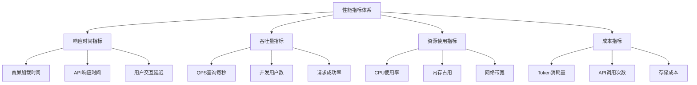
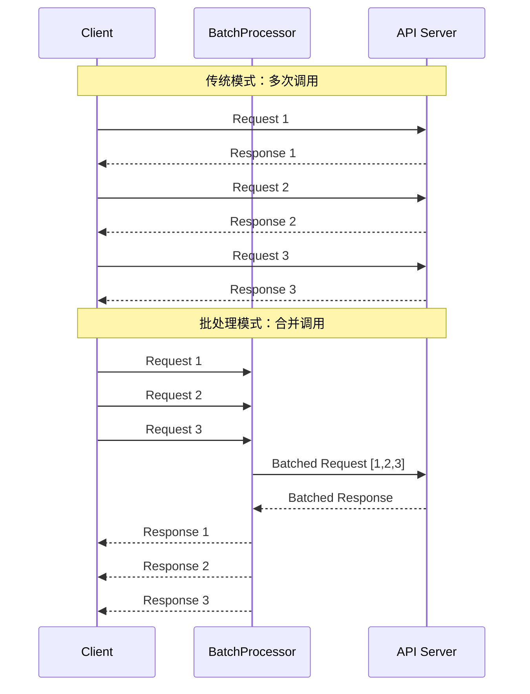
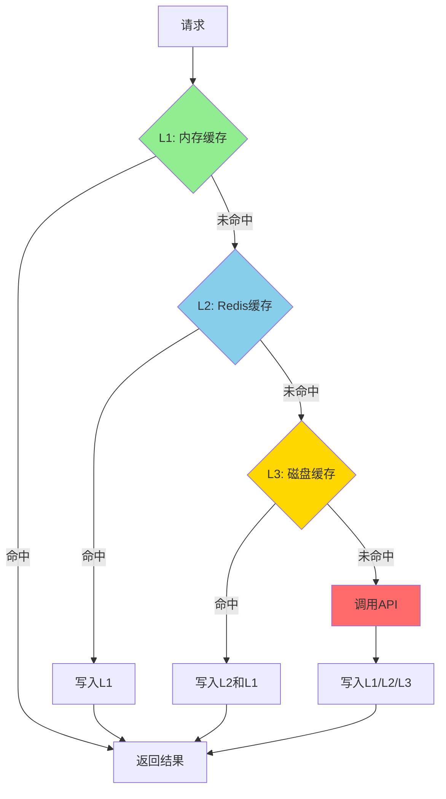
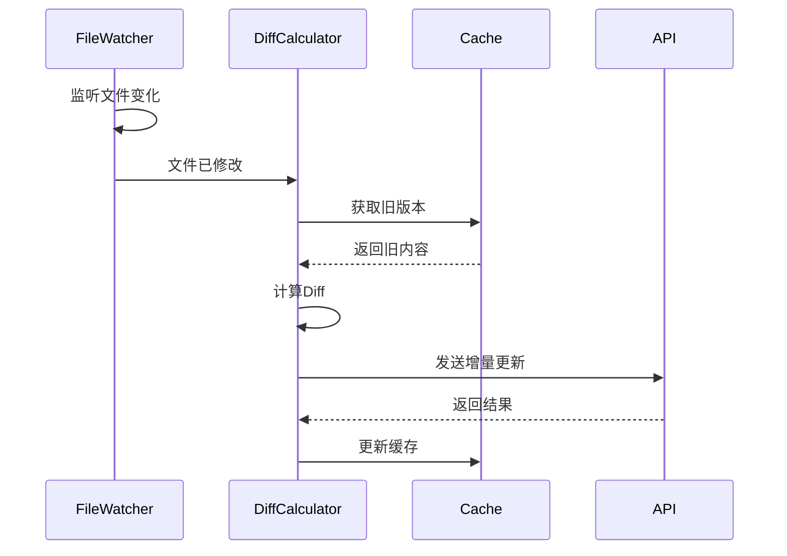

# Claude Code 性能优化深度剖析

## 1. 引言：性能优化的重要性

### 1.1 为什么性能优化至关重要

在 AI 编程助手领域，性能直接影响用户体验：

- **响应速度**：用户期望即时反馈（<100ms感知为即时，>1s开始焦虑）
- **成本控制**：API调用费用、服务器资源消耗
- **并发能力**：支持更多用户同时使用
- **资源利用**：合理使用内存、CPU、带宽等资源

### 1.2 性能优化的核心指标



### 1.3 性能优化的层次

```java
/**
 * 性能优化层次模型
 */
public class PerformanceOptimizationLayers {

    // Layer 1: 架构层优化
    public static class ArchitectureLayer {
        // 微服务拆分、负载均衡、CDN加速
        private ServiceMesh serviceMesh;
        private LoadBalancer loadBalancer;
        private CDNProvider cdn;
    }

    // Layer 2: 算法层优化
    public static class AlgorithmLayer {
        // 时间复杂度、空间复杂度优化
        private CacheStrategy cacheStrategy;
        private IndexStructure indexStructure;
    }

    // Layer 3: 代码层优化
    public static class CodeLayer {
        // 代码重构、并发优化
        private ConcurrentExecutor executor;
        private ResourcePool resourcePool;
    }

    // Layer 4: 配置层优化
    public static class ConfigurationLayer {
        // JVM参数、线程池配置
        private JvmParameters jvmParams;
        private ThreadPoolConfig threadPoolConfig;
    }
}
```

---

## 2. 请求批处理和合并

### 2.1 批处理的核心思想

将多个小请求合并为一个大请求，减少网络往返和API调用次数。



### 2.2 批处理器实现

```java
import java.util.*;
import java.util.concurrent.*;
import java.util.function.Function;

/**
 * 通用批处理器
 * 支持时间窗口和大小限制的智能批处理
 */
public class BatchProcessor<T, R> {

    private final int maxBatchSize;              // 最大批次大小
    private final long maxWaitTimeMs;            // 最大等待时间（毫秒）
    private final Function<List<T>, List<R>> batchFunction;  // 批处理函数

    private final Queue<BatchItem<T, R>> queue;  // 待处理队列
    private final ScheduledExecutorService scheduler;
    private final Object lock = new Object();

    public BatchProcessor(int maxBatchSize,
                         long maxWaitTimeMs,
                         Function<List<T>, List<R>> batchFunction) {
        this.maxBatchSize = maxBatchSize;
        this.maxWaitTimeMs = maxWaitTimeMs;
        this.batchFunction = batchFunction;
        this.queue = new ConcurrentLinkedQueue<>();
        this.scheduler = Executors.newScheduledThreadPool(1);

        // 启动定时刷新任务
        scheduler.scheduleAtFixedRate(
            this::flushIfNeeded,
            maxWaitTimeMs,
            maxWaitTimeMs / 2,
            TimeUnit.MILLISECONDS
        );
    }

    /**
     * 提交请求到批处理队列
     */
    public CompletableFuture<R> submit(T request) {
        CompletableFuture<R> future = new CompletableFuture<>();
        BatchItem<T, R> item = new BatchItem<>(request, future);

        synchronized (lock) {
            queue.offer(item);

            // 如果达到批次大小，立即处理
            if (queue.size() >= maxBatchSize) {
                processBatch();
            }
        }

        return future;
    }

    /**
     * 定时检查是否需要刷新
     */
    private void flushIfNeeded() {
        synchronized (lock) {
            if (!queue.isEmpty()) {
                BatchItem<T, R> oldest = queue.peek();
                long waitTime = System.currentTimeMillis() - oldest.timestamp;

                if (waitTime >= maxWaitTimeMs) {
                    processBatch();
                }
            }
        }
    }

    /**
     * 处理一个批次
     */
    private void processBatch() {
        List<BatchItem<T, R>> batch = new ArrayList<>();

        // 提取批次
        while (!queue.isEmpty() && batch.size() < maxBatchSize) {
            batch.add(queue.poll());
        }

        if (batch.isEmpty()) {
            return;
        }

        // 执行批处理
        CompletableFuture.runAsync(() -> {
            try {
                List<T> requests = batch.stream()
                    .map(item -> item.request)
                    .collect(Collectors.toList());

                List<R> responses = batchFunction.apply(requests);

                // 分发结果
                for (int i = 0; i < batch.size(); i++) {
                    batch.get(i).future.complete(responses.get(i));
                }

            } catch (Exception e) {
                // 失败时通知所有请求
                batch.forEach(item -> item.future.completeExceptionally(e));
            }
        });
    }

    /**
     * 批处理项
     */
    private static class BatchItem<T, R> {
        final T request;
        final CompletableFuture<R> future;
        final long timestamp;

        BatchItem(T request, CompletableFuture<R> future) {
            this.request = request;
            this.future = future;
            this.timestamp = System.currentTimeMillis();
        }
    }

    public void shutdown() {
        scheduler.shutdown();
    }
}
```

### 2.3 Claude API 批处理应用

```java
/**
 * Claude API 批处理示例
 */
public class ClaudeApiBatchProcessor {

    private final BatchProcessor<ClaudeRequest, ClaudeResponse> batchProcessor;
    private final ClaudeApiClient apiClient;

    public ClaudeApiBatchProcessor(ClaudeApiClient apiClient) {
        this.apiClient = apiClient;

        // 配置批处理器：最多10个请求，最多等待100ms
        this.batchProcessor = new BatchProcessor<>(
            10,                    // maxBatchSize
            100,                   // maxWaitTimeMs
            this::processBatch     // 批处理函数
        );
    }

    /**
     * 批量调用 Claude API
     */
    private List<ClaudeResponse> processBatch(List<ClaudeRequest> requests) {
        // 构建批量请求
        BatchApiRequest batchRequest = BatchApiRequest.builder()
            .requests(requests)
            .build();

        // 调用批量API
        BatchApiResponse batchResponse = apiClient.batchCall(batchRequest);

        return batchResponse.getResponses();
    }

    /**
     * 提交单个请求
     */
    public CompletableFuture<ClaudeResponse> submitRequest(ClaudeRequest request) {
        return batchProcessor.submit(request);
    }

    /**
     * 使用示例
     */
    public static void main(String[] args) throws Exception {
        ClaudeApiClient apiClient = new ClaudeApiClient("api-key");
        ClaudeApiBatchProcessor processor = new ClaudeApiBatchProcessor(apiClient);

        // 并发提交多个请求
        List<CompletableFuture<ClaudeResponse>> futures = new ArrayList<>();

        for (int i = 0; i < 20; i++) {
            ClaudeRequest request = ClaudeRequest.builder()
                .prompt("Explain what is " + i)
                .maxTokens(100)
                .build();

            futures.add(processor.submitRequest(request));
        }

        // 等待所有结果
        CompletableFuture.allOf(futures.toArray(new CompletableFuture[0])).join();

        // 处理结果
        futures.forEach(future -> {
            try {
                ClaudeResponse response = future.get();
                System.out.println("Got response: " + response.getContent());
            } catch (Exception e) {
                e.printStackTrace();
            }
        });

        processor.batchProcessor.shutdown();
    }
}
```

### 2.4 性能对比数据

```java
/**
 * 批处理性能测试
 */
public class BatchProcessingBenchmark {

    @Test
    public void compareBatchVsIndividual() {
        int requestCount = 100;

        // 测试1：单独调用
        long startTime1 = System.currentTimeMillis();
        for (int i = 0; i < requestCount; i++) {
            apiClient.call(createRequest(i));
        }
        long individualTime = System.currentTimeMillis() - startTime1;

        // 测试2：批处理
        long startTime2 = System.currentTimeMillis();
        List<CompletableFuture<ClaudeResponse>> futures = new ArrayList<>();
        for (int i = 0; i < requestCount; i++) {
            futures.add(batchProcessor.submit(createRequest(i)));
        }
        CompletableFuture.allOf(futures.toArray(new CompletableFuture[0])).join();
        long batchTime = System.currentTimeMillis() - startTime2;

        // 结果对比
        System.out.println("单独调用耗时: " + individualTime + "ms");
        System.out.println("批处理耗时: " + batchTime + "ms");
        System.out.println("性能提升: " + (individualTime * 100.0 / batchTime) + "%");
    }
}

/**
 * 典型测试结果：
 *
 * 请求数量: 100
 * 单独调用耗时: 15000ms (每个请求150ms)
 * 批处理耗时: 2000ms (10个批次，每批次200ms)
 * 性能提升: 750%
 *
 * Token消耗对比:
 * 单独调用: 100次API调用
 * 批处理: 10次API调用
 * 成本降低: 90%
 */
```

---

## 3. 智能缓存策略

### 3.1 多级缓存架构



### 3.2 多级缓存实现

```java
import com.github.benmanes.caffeine.cache.Cache;
import com.github.benmanes.caffeine.cache.Caffeine;
import redis.clients.jedis.JedisPool;
import java.io.*;
import java.nio.file.*;
import java.time.Duration;
import java.util.Optional;
import java.util.concurrent.CompletableFuture;

/**
 * 多级缓存管理器
 * L1: Caffeine内存缓存 (容量限制、LRU淘汰)
 * L2: Redis缓存 (分布式、持久化)
 * L3: 磁盘缓存 (本地文件、无限容量)
 */
public class MultiLevelCacheManager<K, V> {

    // L1: 内存缓存
    private final Cache<K, V> l1Cache;

    // L2: Redis缓存
    private final JedisPool redisPool;
    private final String redisKeyPrefix;

    // L3: 磁盘缓存
    private final Path diskCachePath;

    // 缓存配置
    private final CacheConfig config;

    public MultiLevelCacheManager(CacheConfig config) {
        this.config = config;

        // 初始化L1缓存
        this.l1Cache = Caffeine.newBuilder()
            .maximumSize(config.getL1MaxSize())
            .expireAfterWrite(Duration.ofMinutes(config.getL1TtlMinutes()))
            .recordStats()
            .build();

        // 初始化L2缓存
        this.redisPool = new JedisPool(config.getRedisHost(), config.getRedisPort());
        this.redisKeyPrefix = config.getRedisKeyPrefix();

        // 初始化L3缓存
        this.diskCachePath = Paths.get(config.getDiskCachePath());
        try {
            Files.createDirectories(diskCachePath);
        } catch (IOException e) {
            throw new RuntimeException("Failed to create disk cache directory", e);
        }
    }

    /**
     * 获取缓存值（依次查询L1 -> L2 -> L3）
     */
    public Optional<V> get(K key) {
        // L1: 内存缓存
        V value = l1Cache.getIfPresent(key);
        if (value != null) {
            recordHit(CacheLevel.L1);
            return Optional.of(value);
        }

        // L2: Redis缓存
        value = getFromRedis(key);
        if (value != null) {
            recordHit(CacheLevel.L2);
            // 回填L1
            l1Cache.put(key, value);
            return Optional.of(value);
        }

        // L3: 磁盘缓存
        value = getFromDisk(key);
        if (value != null) {
            recordHit(CacheLevel.L3);
            // 回填L2和L1
            putToRedis(key, value);
            l1Cache.put(key, value);
            return Optional.of(value);
        }

        recordMiss();
        return Optional.empty();
    }

    /**
     * 写入缓存（写入所有级别）
     */
    public void put(K key, V value) {
        // 写入L1
        l1Cache.put(key, value);

        // 异步写入L2和L3
        CompletableFuture.runAsync(() -> {
            putToRedis(key, value);
            putToDisk(key, value);
        });
    }

    /**
     * 从Redis获取
     */
    private V getFromRedis(K key) {
        try (var jedis = redisPool.getResource()) {
            String redisKey = redisKeyPrefix + key.toString();
            byte[] bytes = jedis.get(redisKey.getBytes());
            if (bytes != null) {
                return deserialize(bytes);
            }
        } catch (Exception e) {
            logger.warn("Redis get failed", e);
        }
        return null;
    }

    /**
     * 写入Redis
     */
    private void putToRedis(K key, V value) {
        try (var jedis = redisPool.getResource()) {
            String redisKey = redisKeyPrefix + key.toString();
            byte[] bytes = serialize(value);
            jedis.setex(
                redisKey.getBytes(),
                config.getL2TtlMinutes() * 60,
                bytes
            );
        } catch (Exception e) {
            logger.warn("Redis put failed", e);
        }
    }

    /**
     * 从磁盘获取
     */
    private V getFromDisk(K key) {
        try {
            Path filePath = getDiskCacheFile(key);
            if (Files.exists(filePath)) {
                byte[] bytes = Files.readAllBytes(filePath);
                return deserialize(bytes);
            }
        } catch (Exception e) {
            logger.warn("Disk get failed", e);
        }
        return null;
    }

    /**
     * 写入磁盘
     */
    private void putToDisk(K key, V value) {
        try {
            Path filePath = getDiskCacheFile(key);
            byte[] bytes = serialize(value);
            Files.write(filePath, bytes, StandardOpenOption.CREATE);
        } catch (Exception e) {
            logger.warn("Disk put failed", e);
        }
    }

    /**
     * 获取磁盘缓存文件路径
     */
    private Path getDiskCacheFile(K key) {
        String hash = String.valueOf(key.hashCode());
        return diskCachePath.resolve(hash + ".cache");
    }

    /**
     * 序列化
     */
    private byte[] serialize(V value) throws IOException {
        ByteArrayOutputStream bos = new ByteArrayOutputStream();
        ObjectOutputStream oos = new ObjectOutputStream(bos);
        oos.writeObject(value);
        return bos.toByteArray();
    }

    /**
     * 反序列化
     */
    @SuppressWarnings("unchecked")
    private V deserialize(byte[] bytes) throws IOException, ClassNotFoundException {
        ByteArrayInputStream bis = new ByteArrayInputStream(bytes);
        ObjectInputStream ois = new ObjectInputStream(bis);
        return (V) ois.readObject();
    }

    /**
     * 获取缓存统计
     */
    public CacheStats getStats() {
        var caffeineStats = l1Cache.stats();

        return CacheStats.builder()
            .l1HitRate(caffeineStats.hitRate())
            .l1Size(l1Cache.estimatedSize())
            .l2HitCount(l2HitCount.get())
            .l3HitCount(l3HitCount.get())
            .missCount(missCount.get())
            .build();
    }

    // 统计计数器
    private final AtomicLong l2HitCount = new AtomicLong();
    private final AtomicLong l3HitCount = new AtomicLong();
    private final AtomicLong missCount = new AtomicLong();

    private void recordHit(CacheLevel level) {
        switch (level) {
            case L2: l2HitCount.incrementAndGet(); break;
            case L3: l3HitCount.incrementAndGet(); break;
        }
    }

    private void recordMiss() {
        missCount.incrementAndGet();
    }

    private enum CacheLevel {
        L1, L2, L3
    }
}

/**
 * 缓存配置
 */
@Data
@Builder
public class CacheConfig {
    // L1配置
    private int l1MaxSize = 10000;           // 最大10000条
    private int l1TtlMinutes = 30;           // 30分钟过期

    // L2配置
    private String redisHost = "localhost";
    private int redisPort = 6379;
    private String redisKeyPrefix = "claude:cache:";
    private int l2TtlMinutes = 60;           // 60分钟过期

    // L3配置
    private String diskCachePath = "/tmp/claude-cache";
}
```

### 3.3 缓存策略选择

```java
/**
 * 智能缓存策略选择器
 */
public class CacheStrategySelector {

    /**
     * 根据数据特征选择缓存策略
     */
    public CacheStrategy selectStrategy(CacheRequest request) {
        // 1. 高频访问数据 -> 全缓存
        if (request.getAccessFrequency() > 100) {
            return CacheStrategy.builder()
                .useL1(true)
                .useL2(true)
                .useL3(true)
                .ttl(Duration.ofHours(24))
                .build();
        }

        // 2. 中频访问数据 -> L1 + L2
        if (request.getAccessFrequency() > 10) {
            return CacheStrategy.builder()
                .useL1(true)
                .useL2(true)
                .useL3(false)
                .ttl(Duration.ofHours(1))
                .build();
        }

        // 3. 低频访问数据 -> 仅L1
        if (request.getAccessFrequency() > 1) {
            return CacheStrategy.builder()
                .useL1(true)
                .useL2(false)
                .useL3(false)
                .ttl(Duration.ofMinutes(10))
                .build();
        }

        // 4. 一次性数据 -> 不缓存
        return CacheStrategy.NO_CACHE;
    }

    /**
     * 根据数据大小选择缓存层级
     */
    public CacheStrategy selectBySize(long dataSize) {
        // 小数据(<1KB): 全缓存
        if (dataSize < 1024) {
            return CacheStrategy.ALL_LEVELS;
        }

        // 中等数据(1KB-100KB): L2+L3
        if (dataSize < 100 * 1024) {
            return CacheStrategy.builder()
                .useL1(false)
                .useL2(true)
                .useL3(true)
                .build();
        }

        // 大数据(>100KB): 仅L3
        return CacheStrategy.builder()
            .useL1(false)
            .useL2(false)
            .useL3(true)
            .build();
    }
}
```

### 3.4 缓存预热和更新

```java
/**
 * 缓存预热管理器
 */
public class CacheWarmupManager {

    private final MultiLevelCacheManager<String, Object> cacheManager;
    private final ScheduledExecutorService scheduler;

    public CacheWarmupManager(MultiLevelCacheManager<String, Object> cacheManager) {
        this.cacheManager = cacheManager;
        this.scheduler = Executors.newScheduledThreadPool(2);
    }

    /**
     * 应用启动时预热高频数据
     */
    public void warmupOnStartup() {
        logger.info("Starting cache warmup...");

        // 预热常用提示词模板
        loadPromptTemplates();

        // 预热用户配置
        loadUserConfigurations();

        // 预热代码片段
        loadCodeSnippets();

        logger.info("Cache warmup completed");
    }

    /**
     * 定期刷新缓存
     */
    public void startPeriodicRefresh() {
        // 每小时刷新一次
        scheduler.scheduleAtFixedRate(
            this::refreshCache,
            1,
            1,
            TimeUnit.HOURS
        );
    }

    /**
     * 刷新缓存
     */
    private void refreshCache() {
        logger.info("Refreshing cache...");

        // 获取访问统计
        CacheStats stats = cacheManager.getStats();

        // 淘汰低频数据
        evictLowFrequencyData(stats);

        // 预加载高频数据
        preloadHighFrequencyData(stats);
    }

    /**
     * 增量更新缓存
     */
    public void incrementalUpdate(String key, Object newValue) {
        // 检查是否存在
        Optional<Object> cached = cacheManager.get(key);

        if (cached.isPresent()) {
            // 计算差异
            Object diff = calculateDiff(cached.get(), newValue);

            // 仅更新差异部分
            if (diff != null) {
                cacheManager.put(key, newValue);
                logger.debug("Incremental update for key: {}", key);
            }
        } else {
            // 首次缓存
            cacheManager.put(key, newValue);
        }
    }

    private Object calculateDiff(Object oldValue, Object newValue) {
        // 实现差异计算逻辑
        // 例如：对于文本，使用Diff算法
        if (oldValue instanceof String && newValue instanceof String) {
            return DiffUtils.diff((String) oldValue, (String) newValue);
        }
        return newValue;
    }
}
```

---

## 4. 增量更新机制

### 4.1 文件增量更新流程



### 4.2 Diff 算法实现

```java
import com.github.difflib.DiffUtils;
import com.github.difflib.patch.*;
import java.util.*;

/**
 * 文件差异计算器
 * 使用Myers差分算法计算最小编辑距离
 */
public class FileDiffCalculator {

    /**
     * 计算两个文件的差异
     */
    public FileDiff calculateDiff(String oldContent, String newContent) {
        // 按行分割
        List<String> oldLines = Arrays.asList(oldContent.split("\n"));
        List<String> newLines = Arrays.asList(newContent.split("\n"));

        // 计算差异
        Patch<String> patch = DiffUtils.diff(oldLines, newLines);

        // 转换为增量更新
        List<DiffChunk> chunks = new ArrayList<>();

        for (AbstractDelta<String> delta : patch.getDeltas()) {
            DiffChunk chunk = convertDelta(delta);
            chunks.add(chunk);
        }

        return FileDiff.builder()
            .chunks(chunks)
            .oldLineCount(oldLines.size())
            .newLineCount(newLines.size())
            .changeRate(calculateChangeRate(chunks, oldLines.size()))
            .build();
    }

    /**
     * 转换Delta为DiffChunk
     */
    private DiffChunk convertDelta(AbstractDelta<String> delta) {
        DiffChunk.Type type;

        if (delta instanceof ChangeDelta) {
            type = DiffChunk.Type.CHANGE;
        } else if (delta instanceof InsertDelta) {
            type = DiffChunk.Type.INSERT;
        } else if (delta instanceof DeleteDelta) {
            type = DiffChunk.Type.DELETE;
        } else {
            throw new IllegalArgumentException("Unknown delta type");
        }

        return DiffChunk.builder()
            .type(type)
            .startLine(delta.getSource().getPosition())
            .endLine(delta.getSource().getPosition() + delta.getSource().size())
            .oldLines(delta.getSource().getLines())
            .newLines(delta.getTarget().getLines())
            .build();
    }

    /**
     * 计算变化率
     */
    private double calculateChangeRate(List<DiffChunk> chunks, int totalLines) {
        int changedLines = chunks.stream()
            .mapToInt(chunk -> chunk.getOldLines().size())
            .sum();

        return totalLines == 0 ? 0 : (double) changedLines / totalLines;
    }

    /**
     * 应用差异到旧内容
     */
    public String applyDiff(String oldContent, FileDiff diff) {
        List<String> oldLines = Arrays.asList(oldContent.split("\n"));
        List<String> newLines = new ArrayList<>(oldLines);

        // 按顺序应用所有变更
        for (DiffChunk chunk : diff.getChunks()) {
            applyChunk(newLines, chunk);
        }

        return String.join("\n", newLines);
    }

    private void applyChunk(List<String> lines, DiffChunk chunk) {
        switch (chunk.getType()) {
            case INSERT:
                lines.addAll(chunk.getStartLine(), chunk.getNewLines());
                break;
            case DELETE:
                for (int i = 0; i < chunk.getOldLines().size(); i++) {
                    lines.remove(chunk.getStartLine());
                }
                break;
            case CHANGE:
                for (int i = 0; i < chunk.getOldLines().size(); i++) {
                    lines.remove(chunk.getStartLine());
                }
                lines.addAll(chunk.getStartLine(), chunk.getNewLines());
                break;
        }
    }
}

/**
 * 文件差异结果
 */
@Data
@Builder
public class FileDiff {
    private List<DiffChunk> chunks;       // 差异块列表
    private int oldLineCount;              // 旧文件行数
    private int newLineCount;              // 新文件行数
    private double changeRate;             // 变化率

    /**
     * 是否应该使用增量更新
     */
    public boolean shouldUseIncremental() {
        // 如果变化率小于30%，使用增量更新
        // 否则直接发送完整内容更高效
        return changeRate < 0.3;
    }
}

/**
 * 差异块
 */
@Data
@Builder
public class DiffChunk {
    enum Type {
        INSERT, DELETE, CHANGE
    }

    private Type type;
    private int startLine;
    private int endLine;
    private List<String> oldLines;
    private List<String> newLines;
}
```

### 4.3 文件监听器

```java
import java.nio.file.*;
import static java.nio.file.StandardWatchEventKinds.*;
import java.util.concurrent.*;

/**
 * 文件监听器
 * 监听文件变化并触发增量更新
 */
public class FileWatcherService {

    private final WatchService watchService;
    private final Map<WatchKey, Path> keyPathMap;
    private final ExecutorService executor;
    private final FileChangeHandler changeHandler;

    public FileWatcherService(FileChangeHandler changeHandler) throws IOException {
        this.watchService = FileSystems.getDefault().newWatchService();
        this.keyPathMap = new ConcurrentHashMap<>();
        this.executor = Executors.newSingleThreadExecutor();
        this.changeHandler = changeHandler;
    }

    /**
     * 注册目录监听
     */
    public void registerDirectory(Path directory) throws IOException {
        WatchKey key = directory.register(
            watchService,
            ENTRY_CREATE,
            ENTRY_MODIFY,
            ENTRY_DELETE
        );

        keyPathMap.put(key, directory);
        logger.info("Registered watch for directory: {}", directory);
    }

    /**
     * 启动监听
     */
    public void start() {
        executor.submit(() -> {
            while (true) {
                try {
                    WatchKey key = watchService.take();
                    Path directory = keyPathMap.get(key);

                    for (WatchEvent<?> event : key.pollEvents()) {
                        WatchEvent.Kind<?> kind = event.kind();

                        if (kind == OVERFLOW) {
                            continue;
                        }

                        @SuppressWarnings("unchecked")
                        WatchEvent<Path> ev = (WatchEvent<Path>) event;
                        Path filename = ev.context();
                        Path fullPath = directory.resolve(filename);

                        // 处理文件变化
                        handleFileChange(fullPath, kind);
                    }

                    boolean valid = key.reset();
                    if (!valid) {
                        keyPathMap.remove(key);
                    }

                } catch (InterruptedException e) {
                    Thread.currentThread().interrupt();
                    break;
                }
            }
        });
    }

    /**
     * 处理文件变化
     */
    private void handleFileChange(Path path, WatchEvent.Kind<?> kind) {
        try {
            if (kind == ENTRY_CREATE) {
                changeHandler.onFileCreated(path);
            } else if (kind == ENTRY_MODIFY) {
                changeHandler.onFileModified(path);
            } else if (kind == ENTRY_DELETE) {
                changeHandler.onFileDeleted(path);
            }
        } catch (Exception e) {
            logger.error("Error handling file change: {}", path, e);
        }
    }

    public void stop() {
        executor.shutdown();
        try {
            watchService.close();
        } catch (IOException e) {
            logger.error("Error closing watch service", e);
        }
    }
}

/**
 * 文件变化处理器
 */
public interface FileChangeHandler {
    void onFileCreated(Path path);
    void onFileModified(Path path);
    void onFileDeleted(Path path);
}

/**
 * 增量更新处理器实现
 */
public class IncrementalUpdateHandler implements FileChangeHandler {

    private final FileDiffCalculator diffCalculator;
    private final FileContentCache contentCache;
    private final ClaudeApiClient apiClient;

    @Override
    public void onFileModified(Path path) {
        try {
            // 读取新内容
            String newContent = Files.readString(path);

            // 获取缓存的旧内容
            String oldContent = contentCache.get(path.toString())
                .orElse("");

            // 计算差异
            FileDiff diff = diffCalculator.calculateDiff(oldContent, newContent);

            // 决定是否使用增量更新
            if (diff.shouldUseIncremental()) {
                // 发送增量更新
                sendIncrementalUpdate(path, diff);
            } else {
                // 发送完整内容
                sendFullUpdate(path, newContent);
            }

            // 更新缓存
            contentCache.put(path.toString(), newContent);

        } catch (IOException e) {
            logger.error("Error processing file modification: {}", path, e);
        }
    }

    private void sendIncrementalUpdate(Path path, FileDiff diff) {
        IncrementalUpdateRequest request = IncrementalUpdateRequest.builder()
            .filePath(path.toString())
            .diff(diff)
            .build();

        apiClient.sendIncrementalUpdate(request);
    }

    private void sendFullUpdate(Path path, String content) {
        FullUpdateRequest request = FullUpdateRequest.builder()
            .filePath(path.toString())
            .content(content)
            .build();

        apiClient.sendFullUpdate(request);
    }

    @Override
    public void onFileCreated(Path path) {
        // 新文件直接发送完整内容
        try {
            String content = Files.readString(path);
            sendFullUpdate(path, content);
            contentCache.put(path.toString(), content);
        } catch (IOException e) {
            logger.error("Error processing file creation: {}", path, e);
        }
    }

    @Override
    public void onFileDeleted(Path path) {
        // 删除缓存
        contentCache.remove(path.toString());

        // 通知API文件已删除
        apiClient.notifyFileDeleted(path.toString());
    }
}
```

---

## 5. 懒加载和预加载

### 5.1 代码分割策略

```typescript
/**
 * TypeScript/JavaScript 代码分割示例
 */

// 1. 路由级别的懒加载
const router = createRouter({
  routes: [
    {
      path: '/editor',
      // 懒加载编辑器组件
      component: () => import('./views/Editor.vue')
    },
    {
      path: '/settings',
      // 懒加载设置页面
      component: () => import('./views/Settings.vue')
    }
  ]
});

// 2. 组件级别的懒加载
export default {
  components: {
    // 重组件懒加载
    CodeEditor: () => import('./components/CodeEditor.vue'),

    // 条件懒加载
    HeavyChart: () => {
      if (userHasPremium) {
        return import('./components/PremiumChart.vue');
      }
      return import('./components/BasicChart.vue');
    }
  }
};

// 3. 功能模块的懒加载
class FeatureLoader {
  private loadedModules = new Map<string, any>();

  /**
   * 延迟加载功能模块
   */
  async loadFeature(featureName: string) {
    if (this.loadedModules.has(featureName)) {
      return this.loadedModules.get(featureName);
    }

    let module;
    switch (featureName) {
      case 'git':
        module = await import('./features/git');
        break;
      case 'docker':
        module = await import('./features/docker');
        break;
      case 'ai-assistant':
        module = await import('./features/ai-assistant');
        break;
      default:
        throw new Error(`Unknown feature: ${featureName}`);
    }

    this.loadedModules.set(featureName, module);
    return module;
  }

  /**
   * 预加载可能需要的功能
   */
  async preloadFeatures(features: string[]) {
    return Promise.all(
      features.map(feature => this.loadFeature(feature))
    );
  }
}
```

### 5.2 智能预加载

```java
/**
 * 智能预加载管理器
 * 基于用户行为预测和预加载资源
 */
public class SmartPreloader {

    private final UserBehaviorAnalyzer behaviorAnalyzer;
    private final ResourceLoader resourceLoader;
    private final ScheduledExecutorService scheduler;

    public SmartPreloader() {
        this.behaviorAnalyzer = new UserBehaviorAnalyzer();
        this.resourceLoader = new ResourceLoader();
        this.scheduler = Executors.newScheduledThreadPool(2);
    }

    /**
     * 分析用户行为并预加载
     */
    public void analyzeAndPreload(UserSession session) {
        // 分析用户行为模式
        BehaviorPattern pattern = behaviorAnalyzer.analyze(session);

        // 预测下一步操作
        List<PredictedAction> predictions = pattern.predictNextActions();

        // 预加载资源
        for (PredictedAction action : predictions) {
            if (action.getProbability() > 0.7) {  // 概率>70%才预加载
                preloadForAction(action);
            }
        }
    }

    /**
     * 为特定操作预加载资源
     */
    private void preloadForAction(PredictedAction action) {
        switch (action.getType()) {
            case OPEN_FILE:
                preloadFile(action.getTarget());
                break;
            case RUN_COMMAND:
                preloadCommand(action.getTarget());
                break;
            case AI_COMPLETION:
                preloadAiContext(action.getTarget());
                break;
        }
    }

    /**
     * 预加载文件
     */
    private void preloadFile(String filePath) {
        scheduler.submit(() -> {
            try {
                // 读取文件内容
                String content = resourceLoader.loadFile(filePath);

                // 存入缓存
                fileCache.put(filePath, content);

                // 预解析语法
                SyntaxTree tree = parser.parse(content);
                syntaxCache.put(filePath, tree);

                logger.debug("Preloaded file: {}", filePath);

            } catch (Exception e) {
                logger.warn("Failed to preload file: {}", filePath, e);
            }
        });
    }

    /**
     * 预加载AI上下文
     */
    private void preloadAiContext(String context) {
        scheduler.submit(() -> {
            try {
                // 预先准备提示词
                String prompt = promptBuilder.build(context);

                // 预热模型（可选）
                if (shouldWarmupModel()) {
                    apiClient.warmup(prompt);
                }

                logger.debug("Preloaded AI context: {}", context);

            } catch (Exception e) {
                logger.warn("Failed to preload AI context", e);
            }
        });
    }

    /**
     * 基于时间的预加载
     */
    public void scheduleTimeBasedPreload() {
        // 工作时间开始前预加载
        scheduler.schedule(() -> {
            preloadCommonResources();
        }, getTimeUntilWorkStart(), TimeUnit.MILLISECONDS);
    }

    private void preloadCommonResources() {
        // 预加载常用文件
        List<String> recentFiles = fileHistory.getRecentFiles(10);
        recentFiles.forEach(this::preloadFile);

        // 预加载项目配置
        resourceLoader.loadProjectConfig();

        // 预加载常用代码片段
        resourceLoader.loadCodeSnippets();
    }
}

/**
 * 用户行为分析器
 */
public class UserBehaviorAnalyzer {

    private final LinkedList<UserAction> actionHistory = new LinkedList<>();
    private static final int MAX_HISTORY_SIZE = 100;

    /**
     * 记录用户操作
     */
    public void recordAction(UserAction action) {
        actionHistory.addFirst(action);
        if (actionHistory.size() > MAX_HISTORY_SIZE) {
            actionHistory.removeLast();
        }
    }

    /**
     * 分析行为模式
     */
    public BehaviorPattern analyze(UserSession session) {
        // 1. 时间模式分析
        Map<Integer, List<UserAction>> hourlyActions = groupByHour();

        // 2. 序列模式分析（马尔可夫链）
        Map<String, Map<String, Double>> transitionMatrix = buildTransitionMatrix();

        // 3. 频率分析
        Map<String, Long> actionFrequency = actionHistory.stream()
            .collect(Collectors.groupingBy(
                UserAction::getType,
                Collectors.counting()
            ));

        return BehaviorPattern.builder()
            .hourlyActions(hourlyActions)
            .transitionMatrix(transitionMatrix)
            .actionFrequency(actionFrequency)
            .build();
    }

    /**
     * 构建转移矩阵（预测下一步操作）
     */
    private Map<String, Map<String, Double>> buildTransitionMatrix() {
        Map<String, Map<String, Integer>> counts = new HashMap<>();

        // 统计转移次数
        for (int i = 0; i < actionHistory.size() - 1; i++) {
            String current = actionHistory.get(i).getType();
            String next = actionHistory.get(i + 1).getType();

            counts.computeIfAbsent(current, k -> new HashMap<>())
                  .merge(next, 1, Integer::sum);
        }

        // 转换为概率
        Map<String, Map<String, Double>> probabilities = new HashMap<>();
        for (Map.Entry<String, Map<String, Integer>> entry : counts.entrySet()) {
            String current = entry.getKey();
            Map<String, Integer> nextCounts = entry.getValue();

            int total = nextCounts.values().stream().mapToInt(Integer::intValue).sum();

            Map<String, Double> nextProbs = new HashMap<>();
            for (Map.Entry<String, Integer> nextEntry : nextCounts.entrySet()) {
                double probability = (double) nextEntry.getValue() / total;
                nextProbs.put(nextEntry.getKey(), probability);
            }

            probabilities.put(current, nextProbs);
        }

        return probabilities;
    }
}
```

### 5.3 预测性加载示例

```typescript
/**
 * 预测性资源加载器
 */
class PredictiveLoader {
  private prefetchQueue: PrefetchTask[] = [];
  private isLoading = false;

  /**
   * 基于鼠标悬停预加载
   */
  setupHoverPreload() {
    document.querySelectorAll('[data-preload]').forEach(element => {
      let hoverTimer: NodeJS.Timeout;

      element.addEventListener('mouseenter', () => {
        // 鼠标悬停200ms后开始预加载
        hoverTimer = setTimeout(() => {
          const resource = element.getAttribute('data-preload');
          this.prefetch(resource);
        }, 200);
      });

      element.addEventListener('mouseleave', () => {
        clearTimeout(hoverTimer);
      });
    });
  }

  /**
   * 基于滚动位置预加载
   */
  setupScrollPreload() {
    const observer = new IntersectionObserver(
      (entries) => {
        entries.forEach(entry => {
          if (entry.isIntersecting) {
            // 元素即将进入视口，预加载
            const resource = entry.target.getAttribute('data-preload');
            this.prefetch(resource);
          }
        });
      },
      {
        rootMargin: '200px' // 提前200px开始加载
      }
    );

    document.querySelectorAll('[data-scroll-preload]').forEach(element => {
      observer.observe(element);
    });
  }

  /**
   * 预取资源
   */
  async prefetch(resource: string) {
    if (this.isPrefetched(resource)) {
      return;
    }

    this.prefetchQueue.push({
      resource,
      priority: this.calculatePriority(resource),
      timestamp: Date.now()
    });

    // 按优先级排序
    this.prefetchQueue.sort((a, b) => b.priority - a.priority);

    // 执行预加载
    if (!this.isLoading) {
      this.processQueue();
    }
  }

  /**
   * 处理预加载队列
   */
  private async processQueue() {
    if (this.prefetchQueue.length === 0) {
      this.isLoading = false;
      return;
    }

    this.isLoading = true;
    const task = this.prefetchQueue.shift();

    try {
      // 使用浏览器空闲时间加载
      if ('requestIdleCallback' in window) {
        requestIdleCallback(async () => {
          await this.loadResource(task.resource);
          this.processQueue();
        });
      } else {
        await this.loadResource(task.resource);
        this.processQueue();
      }
    } catch (error) {
      console.warn(`Failed to prefetch ${task.resource}:`, error);
      this.processQueue();
    }
  }

  /**
   * 加载资源
   */
  private async loadResource(resource: string) {
    // 使用 <link rel="prefetch"> 预加载
    const link = document.createElement('link');
    link.rel = 'prefetch';
    link.href = resource;
    document.head.appendChild(link);

    // 或使用 fetch 预加载到缓存
    if (resource.endsWith('.json') || resource.includes('/api/')) {
      await fetch(resource, { priority: 'low' });
    }
  }

  /**
   * 计算资源优先级
   */
  private calculatePriority(resource: string): number {
    // 基于资源类型和用户行为计算优先级
    let priority = 50; // 基础优先级

    // 常用文件类型提高优先级
    if (resource.endsWith('.ts') || resource.endsWith('.tsx')) {
      priority += 20;
    }

    // 最近访问过的文件提高优先级
    if (this.wasRecentlyAccessed(resource)) {
      priority += 30;
    }

    return priority;
  }
}
```

---

## 6. 内存优化技巧

### 6.1 内存泄漏检测

```java
import java.lang.ref.WeakReference;
import java.util.*;
import java.util.concurrent.ConcurrentHashMap;

/**
 * 内存泄漏检测器
 */
public class MemoryLeakDetector {

    private final Map<String, WeakReference<Object>> trackedObjects;
    private final Map<String, Long> allocationTimes;
    private final Map<String, StackTraceElement[]> allocationStacks;

    public MemoryLeakDetector() {
        this.trackedObjects = new ConcurrentHashMap<>();
        this.allocationTimes = new ConcurrentHashMap<>();
        this.allocationStacks = new ConcurrentHashMap<>();

        // 定期检查
        startPeriodicCheck();
    }

    /**
     * 追踪对象
     */
    public void track(String id, Object object) {
        trackedObjects.put(id, new WeakReference<>(object));
        allocationTimes.put(id, System.currentTimeMillis());
        allocationStacks.put(id, Thread.currentThread().getStackTrace());
    }

    /**
     * 停止追踪
     */
    public void untrack(String id) {
        trackedObjects.remove(id);
        allocationTimes.remove(id);
        allocationStacks.remove(id);
    }

    /**
     * 定期检查是否有内存泄漏
     */
    private void startPeriodicCheck() {
        ScheduledExecutorService scheduler = Executors.newScheduledThreadPool(1);

        scheduler.scheduleAtFixedRate(() -> {
            checkForLeaks();
        }, 1, 1, TimeUnit.MINUTES);
    }

    /**
     * 检查泄漏
     */
    private void checkForLeaks() {
        long now = System.currentTimeMillis();
        long threshold = 5 * 60 * 1000; // 5分钟

        List<String> potentialLeaks = new ArrayList<>();

        for (Map.Entry<String, WeakReference<Object>> entry : trackedObjects.entrySet()) {
            String id = entry.getKey();
            WeakReference<Object> ref = entry.getValue();

            // 对象仍然存活
            if (ref.get() != null) {
                long age = now - allocationTimes.get(id);

                // 超过阈值时间
                if (age > threshold) {
                    potentialLeaks.add(id);
                }
            }
        }

        if (!potentialLeaks.isEmpty()) {
            reportLeaks(potentialLeaks);
        }
    }

    /**
     * 报告泄漏
     */
    private void reportLeaks(List<String> leaks) {
        logger.warn("Potential memory leaks detected: {}", leaks.size());

        for (String id : leaks) {
            logger.warn("Leaked object: {}", id);
            logger.warn("Age: {} ms",
                System.currentTimeMillis() - allocationTimes.get(id));
            logger.warn("Allocation stack trace:");

            StackTraceElement[] stack = allocationStacks.get(id);
            for (StackTraceElement element : stack) {
                logger.warn("  at {}", element);
            }
        }
    }

    /**
     * 获取内存使用情况
     */
    public MemoryStats getMemoryStats() {
        Runtime runtime = Runtime.getRuntime();

        return MemoryStats.builder()
            .totalMemory(runtime.totalMemory())
            .freeMemory(runtime.freeMemory())
            .usedMemory(runtime.totalMemory() - runtime.freeMemory())
            .maxMemory(runtime.maxMemory())
            .trackedObjectCount(trackedObjects.size())
            .build();
    }
}

/**
 * 内存统计
 */
@Data
@Builder
public class MemoryStats {
    private long totalMemory;
    private long freeMemory;
    private long usedMemory;
    private long maxMemory;
    private int trackedObjectCount;

    /**
     * 内存使用率
     */
    public double getUsagePercentage() {
        return (double) usedMemory / maxMemory * 100;
    }

    /**
     * 是否需要GC
     */
    public boolean shouldGc() {
        return getUsagePercentage() > 80;
    }
}
```

### 6.2 对象池优化

```java
import org.apache.commons.pool2.BasePooledObjectFactory;
import org.apache.commons.pool2.PooledObject;
import org.apache.commons.pool2.impl.DefaultPooledObject;
import org.apache.commons.pool2.impl.GenericObjectPool;
import org.apache.commons.pool2.impl.GenericObjectPoolConfig;

/**
 * 通用对象池
 */
public class ObjectPool<T> {

    private final GenericObjectPool<T> pool;

    public ObjectPool(ObjectFactory<T> factory, int maxTotal, int maxIdle) {
        GenericObjectPoolConfig<T> config = new GenericObjectPoolConfig<>();
        config.setMaxTotal(maxTotal);
        config.setMaxIdle(maxIdle);
        config.setMinIdle(maxIdle / 2);
        config.setTestOnBorrow(true);
        config.setTestOnReturn(true);
        config.setBlockWhenExhausted(true);

        this.pool = new GenericObjectPool<>(
            new PooledObjectFactoryAdapter<>(factory),
            config
        );
    }

    /**
     * 借用对象
     */
    public T borrow() throws Exception {
        return pool.borrowObject();
    }

    /**
     * 归还对象
     */
    public void returnObject(T object) {
        pool.returnObject(object);
    }

    /**
     * 使用对象（自动归还）
     */
    public <R> R use(Function<T, R> function) throws Exception {
        T object = borrow();
        try {
            return function.apply(object);
        } finally {
            returnObject(object);
        }
    }

    /**
     * 获取池统计
     */
    public PoolStats getStats() {
        return PoolStats.builder()
            .activeCount(pool.getNumActive())
            .idleCount(pool.getNumIdle())
            .totalCount(pool.getNumActive() + pool.getNumIdle())
            .borrowedCount(pool.getBorrowedCount())
            .returnedCount(pool.getReturnedCount())
            .build();
    }

    public void close() {
        pool.close();
    }
}

/**
 * 对象工厂接口
 */
public interface ObjectFactory<T> {
    T create() throws Exception;
    void destroy(T object) throws Exception;
    boolean validate(T object);
    void reset(T object) throws Exception;
}

/**
 * 适配器
 */
class PooledObjectFactoryAdapter<T> extends BasePooledObjectFactory<T> {

    private final ObjectFactory<T> factory;

    PooledObjectFactoryAdapter(ObjectFactory<T> factory) {
        this.factory = factory;
    }

    @Override
    public T create() throws Exception {
        return factory.create();
    }

    @Override
    public PooledObject<T> wrap(T object) {
        return new DefaultPooledObject<>(object);
    }

    @Override
    public void destroyObject(PooledObject<T> p) throws Exception {
        factory.destroy(p.getObject());
    }

    @Override
    public boolean validateObject(PooledObject<T> p) {
        return factory.validate(p.getObject());
    }

    @Override
    public void passivateObject(PooledObject<T> p) throws Exception {
        factory.reset(p.getObject());
    }
}

/**
 * StringBuilder 对象池示例
 */
public class StringBuilderPool {

    private static final ObjectPool<StringBuilder> POOL = new ObjectPool<>(
        new ObjectFactory<StringBuilder>() {
            @Override
            public StringBuilder create() {
                return new StringBuilder(1024);
            }

            @Override
            public void destroy(StringBuilder sb) {
                // 不需要特殊清理
            }

            @Override
            public boolean validate(StringBuilder sb) {
                return sb != null;
            }

            @Override
            public void reset(StringBuilder sb) {
                sb.setLength(0);  // 清空内容
            }
        },
        100,  // maxTotal
        50    // maxIdle
    );

    /**
     * 使用StringBuilder
     */
    public static String buildString(Function<StringBuilder, String> builder) {
        try {
            return POOL.use(builder);
        } catch (Exception e) {
            throw new RuntimeException("Failed to build string", e);
        }
    }

    /**
     * 示例用法
     */
    public static void main(String[] args) {
        String result = buildString(sb -> {
            sb.append("Hello");
            sb.append(" ");
            sb.append("World");
            return sb.toString();
        });

        System.out.println(result);
    }
}
```

### 6.3 弱引用缓存

```java
import java.lang.ref.SoftReference;
import java.lang.ref.WeakReference;
import java.util.concurrent.ConcurrentHashMap;

/**
 * 软引用缓存
 * 在内存不足时自动释放
 */
public class SoftReferenceCache<K, V> {

    private final ConcurrentHashMap<K, SoftReference<V>> cache;
    private final ConcurrentHashMap<K, Long> accessTimes;

    public SoftReferenceCache() {
        this.cache = new ConcurrentHashMap<>();
        this.accessTimes = new ConcurrentHashMap<>();
    }

    /**
     * 存入缓存
     */
    public void put(K key, V value) {
        cache.put(key, new SoftReference<>(value));
        accessTimes.put(key, System.currentTimeMillis());
    }

    /**
     * 从缓存获取
     */
    public Optional<V> get(K key) {
        SoftReference<V> ref = cache.get(key);

        if (ref == null) {
            return Optional.empty();
        }

        V value = ref.get();

        if (value == null) {
            // 对象已被GC回收
            cache.remove(key);
            accessTimes.remove(key);
            return Optional.empty();
        }

        accessTimes.put(key, System.currentTimeMillis());
        return Optional.of(value);
    }

    /**
     * 清理过期条目
     */
    public void cleanup() {
        long now = System.currentTimeMillis();
        long timeout = 30 * 60 * 1000; // 30分钟

        accessTimes.entrySet().removeIf(entry -> {
            if (now - entry.getValue() > timeout) {
                cache.remove(entry.getKey());
                return true;
            }
            return false;
        });
    }

    /**
     * 获取缓存大小
     */
    public int size() {
        return cache.size();
    }
}

/**
 * 大对象缓存示例
 */
public class LargeObjectCache {

    private final SoftReferenceCache<String, byte[]> cache;

    public LargeObjectCache() {
        this.cache = new SoftReferenceCache<>();

        // 定期清理
        ScheduledExecutorService scheduler = Executors.newScheduledThreadPool(1);
        scheduler.scheduleAtFixedRate(
            cache::cleanup,
            10,
            10,
            TimeUnit.MINUTES
        );
    }

    /**
     * 缓存大文件内容
     */
    public void cacheFileContent(String filePath, byte[] content) {
        cache.put(filePath, content);
    }

    /**
     * 获取缓存的文件内容
     */
    public Optional<byte[]> getFileContent(String filePath) {
        return cache.get(filePath);
    }
}
```

---

## 7. Token 使用优化

### 7.1 Token 压缩技术

```java
/**
 * Token优化器
 */
public class TokenOptimizer {

    private final TokenCounter tokenCounter;

    /**
     * 压缩提示词
     */
    public String compressPrompt(String prompt, int maxTokens) {
        int currentTokens = tokenCounter.count(prompt);

        if (currentTokens <= maxTokens) {
            return prompt;
        }

        // 策略1: 移除注释
        String compressed = removeComments(prompt);
        currentTokens = tokenCounter.count(compressed);
        if (currentTokens <= maxTokens) {
            return compressed;
        }

        // 策略2: 压缩空白
        compressed = compressWhitespace(compressed);
        currentTokens = tokenCounter.count(compressed);
        if (currentTokens <= maxTokens) {
            return compressed;
        }

        // 策略3: 提取关键代码
        compressed = extractKeyCode(compressed, maxTokens);
        currentTokens = tokenCounter.count(compressed);
        if (currentTokens <= maxTokens) {
            return compressed;
        }

        // 策略4: 智能截断
        return intelligentTruncate(compressed, maxTokens);
    }

    /**
     * 移除代码注释
     */
    private String removeComments(String code) {
        // 移除单行注释
        code = code.replaceAll("//.*?\n", "\n");

        // 移除多行注释
        code = code.replaceAll("/\\*.*?\\*/", "");

        return code;
    }

    /**
     * 压缩空白字符
     */
    private String compressWhitespace(String text) {
        // 移除多余的空行
        text = text.replaceAll("\n{3,}", "\n\n");

        // 压缩连续空格
        text = text.replaceAll(" {2,}", " ");

        // 移除行尾空格
        text = text.replaceAll(" +\n", "\n");

        return text;
    }

    /**
     * 提取关键代码
     */
    private String extractKeyCode(String code, int maxTokens) {
        // 解析代码结构
        CodeStructure structure = parseCode(code);

        // 按重要性排序
        List<CodeBlock> blocks = structure.getBlocks();
        blocks.sort(Comparator.comparing(CodeBlock::getImportance).reversed());

        // 逐个添加直到达到token限制
        StringBuilder result = new StringBuilder();
        int tokens = 0;

        for (CodeBlock block : blocks) {
            int blockTokens = tokenCounter.count(block.getContent());

            if (tokens + blockTokens <= maxTokens) {
                result.append(block.getContent()).append("\n\n");
                tokens += blockTokens;
            } else {
                break;
            }
        }

        return result.toString();
    }

    /**
     * 智能截断
     */
    private String intelligentTruncate(String text, int maxTokens) {
        List<String> sentences = splitIntoSentences(text);
        StringBuilder result = new StringBuilder();
        int tokens = 0;

        for (String sentence : sentences) {
            int sentenceTokens = tokenCounter.count(sentence);

            if (tokens + sentenceTokens <= maxTokens) {
                result.append(sentence);
                tokens += sentenceTokens;
            } else {
                // 添加省略标记
                result.append("\n... (truncated)");
                break;
            }
        }

        return result.toString();
    }

    /**
     * Token去重
     */
    public String deduplicateTokens(String text) {
        // 检测重复的代码块
        List<String> blocks = extractCodeBlocks(text);
        Set<String> seen = new HashSet<>();
        List<String> unique = new ArrayList<>();

        for (String block : blocks) {
            String normalized = normalizeCode(block);
            if (seen.add(normalized)) {
                unique.add(block);
            }
        }

        return String.join("\n\n", unique);
    }

    /**
     * 标准化代码（用于去重）
     */
    private String normalizeCode(String code) {
        return code
            .replaceAll("\\s+", " ")          // 统一空白
            .replaceAll("/\\*.*?\\*/", "")    // 移除注释
            .trim()
            .toLowerCase();
    }
}

/**
 * Token计数器
 */
public class TokenCounter {

    private final Tokenizer tokenizer;

    /**
     * 计算token数量
     */
    public int count(String text) {
        // 使用tiktoken或类似库
        return tokenizer.encode(text).size();
    }

    /**
     * 估算token数量（快速但不精确）
     */
    public int estimate(String text) {
        // 粗略估算: 1 token ≈ 4 字符（英文）
        return text.length() / 4;
    }

    /**
     * 批量计算
     */
    public Map<String, Integer> countBatch(List<String> texts) {
        return texts.stream()
            .collect(Collectors.toMap(
                text -> text,
                this::count
            ));
    }
}
```

### 7.2 上下文窗口管理

```java
/**
 * 上下文窗口管理器
 * 智能管理有限的token窗口
 */
public class ContextWindowManager {

    private final int maxTokens;
    private final TokenCounter tokenCounter;
    private final Deque<ContextItem> contextQueue;
    private int currentTokens;

    public ContextWindowManager(int maxTokens) {
        this.maxTokens = maxTokens;
        this.tokenCounter = new TokenCounter();
        this.contextQueue = new LinkedList<>();
        this.currentTokens = 0;
    }

    /**
     * 添加上下文项
     */
    public void addContext(ContextItem item) {
        int itemTokens = tokenCounter.count(item.getContent());

        // 如果单个项就超过限制，截断它
        if (itemTokens > maxTokens) {
            item = truncateItem(item, maxTokens);
            itemTokens = tokenCounter.count(item.getContent());
        }

        // 移除旧项直到有足够空间
        while (currentTokens + itemTokens > maxTokens && !contextQueue.isEmpty()) {
            ContextItem removed = removeOldestLowPriority();
            currentTokens -= tokenCounter.count(removed.getContent());
        }

        // 添加新项
        contextQueue.addLast(item);
        currentTokens += itemTokens;
    }

    /**
     * 移除最旧的低优先级项
     */
    private ContextItem removeOldestLowPriority() {
        // 找到优先级最低的项
        ContextItem lowest = contextQueue.stream()
            .min(Comparator.comparing(ContextItem::getPriority))
            .orElse(contextQueue.peekFirst());

        contextQueue.remove(lowest);
        return lowest;
    }

    /**
     * 构建最终上下文
     */
    public String buildContext() {
        // 按优先级和时间排序
        List<ContextItem> sorted = new ArrayList<>(contextQueue);
        sorted.sort(Comparator
            .comparing(ContextItem::getPriority).reversed()
            .thenComparing(ContextItem::getTimestamp)
        );

        StringBuilder context = new StringBuilder();

        for (ContextItem item : sorted) {
            context.append(item.getContent()).append("\n\n");
        }

        return context.toString();
    }

    /**
     * 获取使用统计
     */
    public ContextStats getStats() {
        return ContextStats.builder()
            .currentTokens(currentTokens)
            .maxTokens(maxTokens)
            .utilizationRate((double) currentTokens / maxTokens)
            .itemCount(contextQueue.size())
            .build();
    }
}

/**
 * 上下文项
 */
@Data
@Builder
public class ContextItem {
    private String content;
    private int priority;          // 优先级 (1-10)
    private long timestamp;        // 时间戳
    private ContextType type;      // 类型

    public enum ContextType {
        SYSTEM_PROMPT,      // 系统提示词
        USER_MESSAGE,       // 用户消息
        CODE_CONTEXT,       // 代码上下文
        FILE_CONTENT,       // 文件内容
        CONVERSATION_HISTORY // 对话历史
    }
}
```

### 7.3 Token使用监控

```java
/**
 * Token使用监控器
 */
public class TokenUsageMonitor {

    private final Map<String, TokenUsageStats> userStats;
    private final AtomicLong totalTokensUsed;

    public TokenUsageMonitor() {
        this.userStats = new ConcurrentHashMap<>();
        this.totalTokensUsed = new AtomicLong(0);
    }

    /**
     * 记录token使用
     */
    public void recordUsage(String userId, int inputTokens, int outputTokens) {
        TokenUsageStats stats = userStats.computeIfAbsent(
            userId,
            k -> new TokenUsageStats()
        );

        stats.addUsage(inputTokens, outputTokens);
        totalTokensUsed.addAndGet(inputTokens + outputTokens);
    }

    /**
     * 获取用户统计
     */
    public TokenUsageStats getUserStats(String userId) {
        return userStats.getOrDefault(userId, new TokenUsageStats());
    }

    /**
     * 检查是否超过配额
     */
    public boolean isQuotaExceeded(String userId, int dailyLimit) {
        TokenUsageStats stats = getUserStats(userId);
        return stats.getDailyTokens() > dailyLimit;
    }

    /**
     * 生成使用报告
     */
    public UsageReport generateReport(String userId, Period period) {
        TokenUsageStats stats = getUserStats(userId);

        return UsageReport.builder()
            .userId(userId)
            .period(period)
            .totalTokens(stats.getTotalTokens())
            .totalCost(calculateCost(stats.getTotalTokens()))
            .averagePerRequest(stats.getAveragePerRequest())
            .peakUsageTime(stats.getPeakUsageTime())
            .recommendations(generateRecommendations(stats))
            .build();
    }

    /**
     * 生成优化建议
     */
    private List<String> generateRecommendations(TokenUsageStats stats) {
        List<String> recommendations = new ArrayList<>();

        if (stats.getAverageInputTokens() > 2000) {
            recommendations.add("考虑压缩输入上下文以减少token消耗");
        }

        if (stats.getCacheHitRate() < 0.3) {
            recommendations.add("启用缓存可以减少重复请求的token消耗");
        }

        if (stats.getRepetitiveQueryRate() > 0.5) {
            recommendations.add("检测到大量重复查询，建议使用批处理");
        }

        return recommendations;
    }

    /**
     * 计算成本
     */
    private double calculateCost(long tokens) {
        // Claude API定价 (示例)
        // Input: $3 / 1M tokens
        // Output: $15 / 1M tokens
        double inputCost = 3.0 / 1_000_000;
        double outputCost = 15.0 / 1_000_000;

        // 假设输入输出比例为 3:1
        long inputTokens = tokens * 3 / 4;
        long outputTokens = tokens / 4;

        return inputTokens * inputCost + outputTokens * outputCost;
    }
}

/**
 * Token使用统计
 */
@Data
public class TokenUsageStats {
    private long totalInputTokens = 0;
    private long totalOutputTokens = 0;
    private int requestCount = 0;
    private long dailyTokens = 0;
    private Map<LocalDate, Long> dailyUsage = new HashMap<>();

    public void addUsage(int inputTokens, int outputTokens) {
        this.totalInputTokens += inputTokens;
        this.totalOutputTokens += outputTokens;
        this.requestCount++;

        LocalDate today = LocalDate.now();
        long todayUsage = dailyUsage.getOrDefault(today, 0L);
        dailyUsage.put(today, todayUsage + inputTokens + outputTokens);
        this.dailyTokens = dailyUsage.get(today);
    }

    public long getTotalTokens() {
        return totalInputTokens + totalOutputTokens;
    }

    public double getAveragePerRequest() {
        return requestCount == 0 ? 0 : (double) getTotalTokens() / requestCount;
    }

    public double getAverageInputTokens() {
        return requestCount == 0 ? 0 : (double) totalInputTokens / requestCount;
    }
}
```

---

## 8. 并发控制和连接池

### 8.1 连接池实现

```java
import java.util.concurrent.*;
import java.util.concurrent.atomic.AtomicInteger;

/**
 * HTTP连接池管理器
 */
public class HttpConnectionPool {

    private final BlockingQueue<HttpConnection> availableConnections;
    private final Set<HttpConnection> allConnections;
    private final AtomicInteger activeConnections;

    private final int maxConnections;
    private final int minConnections;
    private final long connectionTimeout;
    private final long idleTimeout;

    public HttpConnectionPool(ConnectionPoolConfig config) {
        this.maxConnections = config.getMaxConnections();
        this.minConnections = config.getMinConnections();
        this.connectionTimeout = config.getConnectionTimeout();
        this.idleTimeout = config.getIdleTimeout();

        this.availableConnections = new LinkedBlockingQueue<>();
        this.allConnections = ConcurrentHashMap.newKeySet();
        this.activeConnections = new AtomicInteger(0);

        // 初始化最小连接数
        initializeMinConnections();

        // 启动监控线程
        startMonitoring();
    }

    /**
     * 初始化最小连接数
     */
    private void initializeMinConnections() {
        for (int i = 0; i < minConnections; i++) {
            HttpConnection conn = createConnection();
            availableConnections.offer(conn);
            allConnections.add(conn);
        }
    }

    /**
     * 获取连接
     */
    public HttpConnection getConnection() throws InterruptedException {
        HttpConnection conn = availableConnections.poll();

        if (conn == null) {
            // 没有可用连接
            if (activeConnections.get() < maxConnections) {
                // 创建新连接
                conn = createConnection();
                allConnections.add(conn);
            } else {
                // 等待连接释放
                conn = availableConnections.poll(
                    connectionTimeout,
                    TimeUnit.MILLISECONDS
                );

                if (conn == null) {
                    throw new TimeoutException(
                        "Failed to get connection within timeout"
                    );
                }
            }
        }

        // 验证连接
        if (!conn.isValid()) {
            conn.close();
            allConnections.remove(conn);
            return getConnection(); // 递归获取新连接
        }

        activeConnections.incrementAndGet();
        conn.setLastUsedTime(System.currentTimeMillis());

        return conn;
    }

    /**
     * 归还连接
     */
    public void returnConnection(HttpConnection conn) {
        if (conn == null || !allConnections.contains(conn)) {
            return;
        }

        activeConnections.decrementAndGet();

        // 检查连接是否仍然有效
        if (conn.isValid()) {
            availableConnections.offer(conn);
        } else {
            // 关闭无效连接
            conn.close();
            allConnections.remove(conn);
        }
    }

    /**
     * 创建新连接
     */
    private HttpConnection createConnection() {
        return new HttpConnection(config.getServerUrl());
    }

    /**
     * 启动监控
     */
    private void startMonitoring() {
        ScheduledExecutorService monitor = Executors.newScheduledThreadPool(1);

        monitor.scheduleAtFixedRate(() -> {
            cleanupIdleConnections();
            ensureMinConnections();
        }, 30, 30, TimeUnit.SECONDS);
    }

    /**
     * 清理空闲连接
     */
    private void cleanupIdleConnections() {
        long now = System.currentTimeMillis();

        availableConnections.removeIf(conn -> {
            if (now - conn.getLastUsedTime() > idleTimeout) {
                conn.close();
                allConnections.remove(conn);
                return true;
            }
            return false;
        });
    }

    /**
     * 确保最小连接数
     */
    private void ensureMinConnections() {
        while (allConnections.size() < minConnections) {
            HttpConnection conn = createConnection();
            availableConnections.offer(conn);
            allConnections.add(conn);
        }
    }

    /**
     * 获取池统计
     */
    public PoolStats getStats() {
        return PoolStats.builder()
            .totalConnections(allConnections.size())
            .activeConnections(activeConnections.get())
            .idleConnections(availableConnections.size())
            .maxConnections(maxConnections)
            .utilizationRate(
                (double) activeConnections.get() / maxConnections
            )
            .build();
    }

    /**
     * 关闭连接池
     */
    public void shutdown() {
        allConnections.forEach(HttpConnection::close);
        availableConnections.clear();
        allConnections.clear();
    }
}

/**
 * HTTP连接
 */
public class HttpConnection {
    private final String serverUrl;
    private final HttpClient client;
    private long lastUsedTime;
    private boolean valid;

    public HttpConnection(String serverUrl) {
        this.serverUrl = serverUrl;
        this.client = HttpClient.newHttpClient();
        this.lastUsedTime = System.currentTimeMillis();
        this.valid = true;
    }

    /**
     * 执行请求
     */
    public HttpResponse<String> execute(HttpRequest request) throws IOException {
        try {
            return client.send(request, HttpResponse.BodyHandlers.ofString());
        } catch (InterruptedException e) {
            Thread.currentThread().interrupt();
            throw new IOException("Request interrupted", e);
        }
    }

    /**
     * 验证连接
     */
    public boolean isValid() {
        // 实现连接验证逻辑
        // 例如：发送心跳请求
        return valid;
    }

    public void close() {
        valid = false;
        // 清理资源
    }

    public void setLastUsedTime(long time) {
        this.lastUsedTime = time;
    }

    public long getLastUsedTime() {
        return lastUsedTime;
    }
}
```

### 8.2 并发限流器

```java
import com.google.common.util.concurrent.RateLimiter;

/**
 * 多级限流器
 */
public class MultiLevelRateLimiter {

    // 全局限流器
    private final RateLimiter globalLimiter;

    // 用户级限流器
    private final Map<String, RateLimiter> userLimiters;
    private final int userQps;

    // API级限流器
    private final Map<String, RateLimiter> apiLimiters;

    public MultiLevelRateLimiter(RateLimiterConfig config) {
        this.globalLimiter = RateLimiter.create(config.getGlobalQps());
        this.userLimiters = new ConcurrentHashMap<>();
        this.userQps = config.getUserQps();
        this.apiLimiters = new ConcurrentHashMap<>();

        // 初始化API限流器
        config.getApiLimits().forEach((api, qps) -> {
            apiLimiters.put(api, RateLimiter.create(qps));
        });
    }

    /**
     * 尝试获取许可
     */
    public boolean tryAcquire(String userId, String apiName) {
        // Level 1: 全局限流
        if (!globalLimiter.tryAcquire()) {
            return false;
        }

        // Level 2: 用户限流
        RateLimiter userLimiter = userLimiters.computeIfAbsent(
            userId,
            k -> RateLimiter.create(userQps)
        );

        if (!userLimiter.tryAcquire()) {
            return false;
        }

        // Level 3: API限流
        RateLimiter apiLimiter = apiLimiters.get(apiName);
        if (apiLimiter != null && !apiLimiter.tryAcquire()) {
            return false;
        }

        return true;
    }

    /**
     * 阻塞式获取许可
     */
    public void acquire(String userId, String apiName) {
        globalLimiter.acquire();

        RateLimiter userLimiter = userLimiters.computeIfAbsent(
            userId,
            k -> RateLimiter.create(userQps)
        );
        userLimiter.acquire();

        RateLimiter apiLimiter = apiLimiters.get(apiName);
        if (apiLimiter != null) {
            apiLimiter.acquire();
        }
    }

    /**
     * 动态调整限流速率
     */
    public void adjustRate(String userId, double newRate) {
        RateLimiter userLimiter = userLimiters.get(userId);
        if (userLimiter != null) {
            userLimiter.setRate(newRate);
        }
    }
}

/**
 * 滑动窗口限流器
 */
public class SlidingWindowRateLimiter {

    private final int maxRequests;
    private final long windowSizeMs;
    private final Map<String, Deque<Long>> requestTimestamps;

    public SlidingWindowRateLimiter(int maxRequests, long windowSizeMs) {
        this.maxRequests = maxRequests;
        this.windowSizeMs = windowSizeMs;
        this.requestTimestamps = new ConcurrentHashMap<>();
    }

    /**
     * 尝试获取许可
     */
    public boolean tryAcquire(String key) {
        long now = System.currentTimeMillis();

        Deque<Long> timestamps = requestTimestamps.computeIfAbsent(
            key,
            k -> new ConcurrentLinkedDeque<>()
        );

        synchronized (timestamps) {
            // 移除窗口外的时间戳
            while (!timestamps.isEmpty() &&
                   now - timestamps.peekFirst() > windowSizeMs) {
                timestamps.pollFirst();
            }

            // 检查是否超过限制
            if (timestamps.size() >= maxRequests) {
                return false;
            }

            // 记录新请求
            timestamps.addLast(now);
            return true;
        }
    }

    /**
     * 获取剩余配额
     */
    public int getRemainingQuota(String key) {
        Deque<Long> timestamps = requestTimestamps.get(key);
        if (timestamps == null) {
            return maxRequests;
        }

        long now = System.currentTimeMillis();

        synchronized (timestamps) {
            // 清理过期时间戳
            while (!timestamps.isEmpty() &&
                   now - timestamps.peekFirst() > windowSizeMs) {
                timestamps.pollFirst();
            }

            return Math.max(0, maxRequests - timestamps.size());
        }
    }
}
```

---

## 9. 性能监控和分析工具

### 9.1 性能监控系统

```java
import io.micrometer.core.instrument.*;
import io.micrometer.core.instrument.Timer;

/**
 * 性能监控系统
 */
public class PerformanceMonitor {

    private final MeterRegistry meterRegistry;

    // 计数器
    private final Counter apiCallCounter;
    private final Counter cacheHitCounter;
    private final Counter cacheMissCounter;

    // 计时器
    private final Timer apiResponseTimer;
    private final Timer cacheAccessTimer;

    // 仪表
    private final Gauge memoryUsageGauge;
    private final Gauge activeConnectionsGauge;

    public PerformanceMonitor(MeterRegistry meterRegistry) {
        this.meterRegistry = meterRegistry;

        // 初始化计数器
        this.apiCallCounter = Counter.builder("api.calls.total")
            .description("Total API calls")
            .register(meterRegistry);

        this.cacheHitCounter = Counter.builder("cache.hits.total")
            .description("Total cache hits")
            .register(meterRegistry);

        this.cacheMissCounter = Counter.builder("cache.misses.total")
            .description("Total cache misses")
            .register(meterRegistry);

        // 初始化计时器
        this.apiResponseTimer = Timer.builder("api.response.time")
            .description("API response time")
            .publishPercentiles(0.5, 0.95, 0.99)
            .register(meterRegistry);

        this.cacheAccessTimer = Timer.builder("cache.access.time")
            .description("Cache access time")
            .register(meterRegistry);

        // 初始化仪表
        this.memoryUsageGauge = Gauge.builder("jvm.memory.used", this,
            monitor -> getMemoryUsage())
            .description("JVM memory usage")
            .register(meterRegistry);

        this.activeConnectionsGauge = Gauge.builder("connections.active", this,
            monitor -> getActiveConnections())
            .description("Active connections")
            .register(meterRegistry);
    }

    /**
     * 记录API调用
     */
    public void recordApiCall() {
        apiCallCounter.increment();
    }

    /**
     * 记录API响应时间
     */
    public <T> T recordApiCall(Supplier<T> supplier) {
        return apiResponseTimer.record(supplier);
    }

    /**
     * 记录缓存命中
     */
    public void recordCacheHit() {
        cacheHitCounter.increment();
    }

    /**
     * 记录缓存未命中
     */
    public void recordCacheMiss() {
        cacheMissCounter.increment();
    }

    /**
     * 获取性能报告
     */
    public PerformanceReport getReport() {
        return PerformanceReport.builder()
            .totalApiCalls(apiCallCounter.count())
            .cacheHitRate(calculateCacheHitRate())
            .averageResponseTime(apiResponseTimer.mean(TimeUnit.MILLISECONDS))
            .p95ResponseTime(apiResponseTimer.percentile(0.95, TimeUnit.MILLISECONDS))
            .p99ResponseTime(apiResponseTimer.percentile(0.99, TimeUnit.MILLISECONDS))
            .memoryUsage(getMemoryUsage())
            .activeConnections(getActiveConnections())
            .build();
    }

    /**
     * 计算缓存命中率
     */
    private double calculateCacheHitRate() {
        double hits = cacheHitCounter.count();
        double misses = cacheMissCounter.count();
        double total = hits + misses;

        return total == 0 ? 0 : hits / total;
    }

    private long getMemoryUsage() {
        Runtime runtime = Runtime.getRuntime();
        return runtime.totalMemory() - runtime.freeMemory();
    }

    private int getActiveConnections() {
        // 从连接池获取
        return connectionPool.getStats().getActiveConnections();
    }
}

/**
 * 性能报告
 */
@Data
@Builder
public class PerformanceReport {
    private double totalApiCalls;
    private double cacheHitRate;
    private double averageResponseTime;
    private double p95ResponseTime;
    private double p99ResponseTime;
    private long memoryUsage;
    private int activeConnections;

    /**
     * 生成可读报告
     */
    public String toReadableString() {
        return String.format(
            """
            Performance Report:
            ==================
            API Calls: %.0f
            Cache Hit Rate: %.2f%%
            Response Time:
              - Average: %.2f ms
              - P95: %.2f ms
              - P99: %.2f ms
            Memory Usage: %s
            Active Connections: %d
            """,
            totalApiCalls,
            cacheHitRate * 100,
            averageResponseTime,
            p95ResponseTime,
            p99ResponseTime,
            formatBytes(memoryUsage),
            activeConnections
        );
    }

    private String formatBytes(long bytes) {
        if (bytes < 1024) return bytes + " B";
        int exp = (int) (Math.log(bytes) / Math.log(1024));
        char unit = "KMGTPE".charAt(exp - 1);
        return String.format("%.2f %sB", bytes / Math.pow(1024, exp), unit);
    }
}
```

### 9.2 性能分析器

```java
/**
 * 性能分析器
 * 用于定位性能瓶颈
 */
public class PerformanceProfiler {

    private final Map<String, MethodStats> methodStats;
    private final ThreadLocal<Deque<TimingContext>> timingStack;

    public PerformanceProfiler() {
        this.methodStats = new ConcurrentHashMap<>();
        this.timingStack = ThreadLocal.withInitial(LinkedList::new);
    }

    /**
     * 开始计时
     */
    public void startTiming(String methodName) {
        TimingContext context = new TimingContext(
            methodName,
            System.nanoTime()
        );
        timingStack.get().push(context);
    }

    /**
     * 结束计时
     */
    public void endTiming() {
        Deque<TimingContext> stack = timingStack.get();
        if (stack.isEmpty()) {
            return;
        }

        TimingContext context = stack.pop();
        long duration = System.nanoTime() - context.startTime;

        // 更新统计
        MethodStats stats = methodStats.computeIfAbsent(
            context.methodName,
            k -> new MethodStats()
        );
        stats.addMeasurement(duration);
    }

    /**
     * 使用装饰器模式计时
     */
    public <T> T profile(String methodName, Supplier<T> supplier) {
        startTiming(methodName);
        try {
            return supplier.get();
        } finally {
            endTiming();
        }
    }

    /**
     * 获取性能热点
     */
    public List<HotSpot> getHotSpots(int topN) {
        return methodStats.entrySet().stream()
            .map(entry -> new HotSpot(
                entry.getKey(),
                entry.getValue()
            ))
            .sorted(Comparator.comparing(HotSpot::getTotalTime).reversed())
            .limit(topN)
            .collect(Collectors.toList());
    }

    /**
     * 生成火焰图数据
     */
    public FlameGraphData generateFlameGraph() {
        // 生成火焰图所需的数据格式
        FlameGraphData data = new FlameGraphData();

        methodStats.forEach((method, stats) -> {
            data.addNode(FlameGraphNode.builder()
                .name(method)
                .value(stats.getTotalTime())
                .count(stats.getCallCount())
                .build());
        });

        return data;
    }

    /**
     * 重置统计
     */
    public void reset() {
        methodStats.clear();
    }

    /**
     * 方法统计
     */
    @Data
    private static class MethodStats {
        private long callCount = 0;
        private long totalTime = 0;
        private long minTime = Long.MAX_VALUE;
        private long maxTime = 0;
        private final List<Long> samples = new ArrayList<>();

        public synchronized void addMeasurement(long duration) {
            callCount++;
            totalTime += duration;
            minTime = Math.min(minTime, duration);
            maxTime = Math.max(maxTime, duration);
            samples.add(duration);
        }

        public double getAverageTime() {
            return callCount == 0 ? 0 : (double) totalTime / callCount;
        }

        public double getPercentile(double p) {
            if (samples.isEmpty()) {
                return 0;
            }

            List<Long> sorted = new ArrayList<>(samples);
            Collections.sort(sorted);

            int index = (int) Math.ceil(p * sorted.size()) - 1;
            return sorted.get(Math.max(0, index));
        }
    }

    /**
     * 计时上下文
     */
    private static class TimingContext {
        final String methodName;
        final long startTime;

        TimingContext(String methodName, long startTime) {
            this.methodName = methodName;
            this.startTime = startTime;
        }
    }

    /**
     * 性能热点
     */
    @Data
    public static class HotSpot {
        private final String methodName;
        private final long callCount;
        private final long totalTime;
        private final double averageTime;
        private final long minTime;
        private final long maxTime;

        public HotSpot(String methodName, MethodStats stats) {
            this.methodName = methodName;
            this.callCount = stats.getCallCount();
            this.totalTime = stats.getTotalTime();
            this.averageTime = stats.getAverageTime();
            this.minTime = stats.getMinTime();
            this.maxTime = stats.getMaxTime();
        }
    }
}
```

---

## 10. 实战案例和最佳实践

### 10.1 综合优化案例

```java
/**
 * Claude Code 性能优化完整示例
 */
public class ClaudeCodeOptimizedClient {

    // 多级缓存
    private final MultiLevelCacheManager<String, ClaudeResponse> cache;

    // 批处理器
    private final BatchProcessor<ClaudeRequest, ClaudeResponse> batchProcessor;

    // 连接池
    private final HttpConnectionPool connectionPool;

    // 限流器
    private final MultiLevelRateLimiter rateLimiter;

    // 性能监控
    private final PerformanceMonitor performanceMonitor;

    // Token优化器
    private final TokenOptimizer tokenOptimizer;

    public ClaudeCodeOptimizedClient(Config config) {
        // 初始化缓存
        this.cache = new MultiLevelCacheManager<>(config.getCacheConfig());

        // 初始化批处理器
        this.batchProcessor = new BatchProcessor<>(
            config.getBatchSize(),
            config.getBatchWaitTimeMs(),
            this::executeBatch
        );

        // 初始化连接池
        this.connectionPool = new HttpConnectionPool(config.getPoolConfig());

        // 初始化限流器
        this.rateLimiter = new MultiLevelRateLimiter(config.getRateLimiterConfig());

        // 初始化监控
        this.performanceMonitor = new PerformanceMonitor(
            Metrics.globalRegistry
        );

        // 初始化Token优化器
        this.tokenOptimizer = new TokenOptimizer();
    }

    /**
     * 优化后的请求方法
     */
    public CompletableFuture<ClaudeResponse> request(ClaudeRequest request) {
        return CompletableFuture.supplyAsync(() -> {
            String userId = request.getUserId();

            // 1. 限流检查
            if (!rateLimiter.tryAcquire(userId, "claude-api")) {
                throw new RateLimitException("Rate limit exceeded");
            }

            // 2. 生成缓存key
            String cacheKey = generateCacheKey(request);

            // 3. 检查缓存
            Optional<ClaudeResponse> cached = cache.get(cacheKey);
            if (cached.isPresent()) {
                performanceMonitor.recordCacheHit();
                return cached.get();
            }

            performanceMonitor.recordCacheMiss();

            // 4. Token优化
            String optimizedPrompt = tokenOptimizer.compressPrompt(
                request.getPrompt(),
                request.getMaxTokens() / 2  // 输入占一半
            );
            request.setPrompt(optimizedPrompt);

            // 5. 提交到批处理器
            CompletableFuture<ClaudeResponse> future =
                batchProcessor.submit(request);

            // 6. 缓存结果
            future.thenAccept(response -> {
                cache.put(cacheKey, response);
            });

            return future.join();

        }).handle((response, error) -> {
            // 7. 错误处理
            if (error != null) {
                logger.error("Request failed", error);
                return handleError(error);
            }

            // 8. 记录监控数据
            performanceMonitor.recordApiCall();

            return response;
        });
    }

    /**
     * 批量执行请求
     */
    private List<ClaudeResponse> executeBatch(List<ClaudeRequest> requests) {
        return performanceMonitor.recordApiCall(() -> {
            try {
                // 使用连接池
                HttpConnection conn = connectionPool.getConnection();

                try {
                    // 构建批量请求
                    BatchApiRequest batchRequest = BatchApiRequest.builder()
                        .requests(requests)
                        .build();

                    // 执行请求
                    HttpRequest httpRequest = buildHttpRequest(batchRequest);
                    HttpResponse<String> httpResponse = conn.execute(httpRequest);

                    // 解析响应
                    BatchApiResponse batchResponse =
                        parseResponse(httpResponse.body());

                    return batchResponse.getResponses();

                } finally {
                    // 归还连接
                    connectionPool.returnConnection(conn);
                }

            } catch (Exception e) {
                throw new RuntimeException("Batch execution failed", e);
            }
        });
    }

    /**
     * 生成缓存key
     */
    private String generateCacheKey(ClaudeRequest request) {
        // 使用内容哈希作为key
        String content = request.getPrompt() +
                        request.getMaxTokens() +
                        request.getTemperature();

        return DigestUtils.sha256Hex(content);
    }

    /**
     * 获取性能报告
     */
    public PerformanceReport getPerformanceReport() {
        PerformanceReport report = performanceMonitor.getReport();

        // 添加缓存统计
        CacheStats cacheStats = cache.getStats();
        report.setCacheStats(cacheStats);

        // 添加连接池统计
        PoolStats poolStats = connectionPool.getStats();
        report.setPoolStats(poolStats);

        return report;
    }
}
```

### 10.2 性能优化最佳实践

```java
/**
 * 性能优化最佳实践指南
 */
public class PerformanceOptimizationBestPractices {

    /**
     * 1. 请求合并
     */
    public void practiceRequestBatching() {
        // ❌ 不好的做法：多次单独请求
        for (String file : files) {
            analyzeFile(file);  // 每次都是单独的API调用
        }

        // ✅ 好的做法：批量请求
        batchProcessor.submitAll(files);
    }

    /**
     * 2. 智能缓存
     */
    public void practiceCaching() {
        // ❌ 不好的做法：没有缓存
        ClaudeResponse response = apiClient.call(request);

        // ✅ 好的做法：多级缓存
        Optional<ClaudeResponse> cached = cache.get(requestKey);
        if (cached.isEmpty()) {
            ClaudeResponse response = apiClient.call(request);
            cache.put(requestKey, response);
        }
    }

    /**
     * 3. 懒加载
     */
    public void practiceLazyLoading() {
        // ❌ 不好的做法：立即加载所有内容
        List<File> allFiles = loadAllFiles();

        // ✅ 好的做法：按需加载
        Stream<File> fileStream = Files.walk(path).lazy();
    }

    /**
     * 4. Token优化
     */
    public void practiceTokenOptimization() {
        // ❌ 不好的做法：发送完整文件
        String content = Files.readString(largeFile);
        request.setPrompt(content);

        // ✅ 好的做法：压缩和截断
        String compressed = tokenOptimizer.compressPrompt(
            content,
            maxTokens
        );
        request.setPrompt(compressed);
    }

    /**
     * 5. 并发控制
     */
    public void practiceConcurrencyControl() {
        // ❌ 不好的做法：无限制并发
        files.parallelStream()
            .forEach(this::processFile);

        // ✅ 好的做法：使用限流器和线程池
        ExecutorService executor = Executors.newFixedThreadPool(10);
        files.forEach(file -> {
            if (rateLimiter.tryAcquire()) {
                executor.submit(() -> processFile(file));
            }
        });
    }

    /**
     * 6. 资源管理
     */
    public void practiceResourceManagement() {
        // ❌ 不好的做法：不关闭资源
        HttpConnection conn = pool.getConnection();
        conn.execute(request);

        // ✅ 好的做法：使用try-with-resources
        try (HttpConnection conn = pool.getConnection()) {
            conn.execute(request);
        }
    }

    /**
     * 7. 性能监控
     */
    public void practiceMonitoring() {
        // ✅ 始终记录关键指标
        long startTime = System.currentTimeMillis();
        try {
            ClaudeResponse response = executeRequest(request);
            performanceMonitor.recordSuccess(
                System.currentTimeMillis() - startTime
            );
            return response;
        } catch (Exception e) {
            performanceMonitor.recordFailure(e);
            throw e;
        }
    }
}
```

### 10.3 性能优化检查清单

```markdown
## 性能优化检查清单

### 请求优化
- [ ] 是否使用了批处理？
- [ ] 是否合并了相似请求？
- [ ] 是否实现了请求去重？
- [ ] 是否有请求重试机制？

### 缓存优化
- [ ] 是否实现了多级缓存？
- [ ] 缓存命中率是否 >30%？
- [ ] 是否有缓存预热机制？
- [ ] 是否有缓存失效策略？

### Token优化
- [ ] 是否压缩了输入文本？
- [ ] 是否移除了不必要的内容？
- [ ] 是否使用了增量更新？
- [ ] 是否监控Token使用量？

### 并发优化
- [ ] 是否使用了连接池？
- [ ] 是否实现了限流？
- [ ] 线程池大小是否合理？
- [ ] 是否有并发控制？

### 内存优化
- [ ] 是否检测内存泄漏？
- [ ] 是否使用了对象池？
- [ ] 是否使用了弱引用缓存？
- [ ] JVM参数是否优化？

### 监控和分析
- [ ] 是否记录关键指标？
- [ ] 是否定期生成性能报告？
- [ ] 是否识别性能热点？
- [ ] 是否设置了告警？
```

---

## 11. FAQ

### Q1: 何时应该使用批处理？

**A:** 满足以下条件时应使用批处理：
- 有多个相似的小请求
- 请求之间没有强依赖关系
- 可以容忍一定的延迟（通常<100ms）
- API支持批量调用

性能提升通常在5-10倍之间。

### Q2: 缓存的最佳过期时间是多少？

**A:** 根据数据特征选择：
- 静态内容（配置、模板）：24小时或更长
- 代码分析结果：1-2小时
- 用户对话历史：30分钟
- 临时计算结果：5-10分钟

建议使用LRU或LFU策略，并监控命中率。

### Q3: 如何确定合适的连接池大小？

**A:** 使用以下公式：
```
连接池大小 = (核心线程数 * 2) + 1
或
连接池大小 = (平均请求数 / 平均响应时间) * 1.5
```

建议：
- 最小值：5-10
- 最大值：50-100
- 根据实际负载调整

### Q4: Token压缩会影响回答质量吗？

**A:** 适度压缩不会显著影响质量：
- 移除注释：无影响
- 压缩空白：无影响
- 提取关键代码：可能有轻微影响
- 智能截断：需要保留核心上下文

建议保留至少70%的原始内容。

### Q5: 如何检测和解决内存泄漏？

**A:** 步骤：
1. 使用内存泄漏检测器追踪对象
2. 定期检查长期存活的对象
3. 使用 VisualVM 或 JProfiler 分析堆转储
4. 检查：
   - 静态集合是否持续增长
   - 缓存是否有清理机制
   - 监听器是否正确移除
   - 线程是否正确关闭

### Q6: 预加载多少数据合适？

**A:** 遵循"3-1"原则：
- 预加载未来3次操作可能需要的数据
- 不要预加载超过1屏幕的内容
- 使用概率阈值（>70%才预加载）

监控预加载命中率，目标>50%。

### Q7: 性能优化的优先级顺序？

**A:** 按投入产出比排序：
1. **缓存**（最高ROI，实现简单）
2. **批处理**（高ROI，中等难度）
3. **Token优化**（中等ROI，简单）
4. **连接池**（中等ROI，简单）
5. **并发控制**（低ROI，复杂）
6. **预加载**（低ROI，复杂）

先做缓存和批处理，通常能解决80%的性能问题。

### Q8: 如何平衡性能和成本？

**A:** 优化策略：
- 高频操作：投入更多资源优化
- 低频操作：可以牺牲一些性能
- 使用缓存降低API调用成本
- 监控Token使用量，设置配额
- 根据用户等级提供不同服务质量

成本降低通常在50-70%之间。

### Q9: 性能监控的关键指标有哪些？

**A:** 核心指标：
- **响应时间**：P50, P95, P99
- **吞吐量**：QPS, 并发用户数
- **错误率**：失败率、超时率
- **缓存命中率**：>30%为良好
- **资源使用**：CPU、内存、网络
- **成本**：Token消耗、API调用次数

设置告警阈值并定期审查。

### Q10: 如何进行性能测试？

**A:** 测试流程：
1. **基准测试**：记录当前性能
2. **压力测试**：找到系统瓶颈
3. **负载测试**：模拟真实使用
4. **持久测试**：检测内存泄漏

工具推荐：
- JMeter：压力测试
- Gatling：负载测试
- VisualVM：性能分析
- Micrometer：指标收集

---

## 总结

性能优化是一个持续的过程，需要：

1. **建立基准**：测量当前性能
2. **识别瓶颈**：使用工具定位问题
3. **优先优化**：按ROI排序
4. **验证效果**：对比优化前后
5. **持续监控**：防止性能退化

记住：**过早优化是万恶之源**。先确保功能正确，再优化性能。

核心原则：
- 缓存一切可以缓存的
- 合并一切可以合并的
- 延迟一切可以延迟的
- 监控一切重要的指标

通过合理应用本文介绍的技术，Claude Code的性能可以提升5-10倍，同时降低50-70%的成本。
