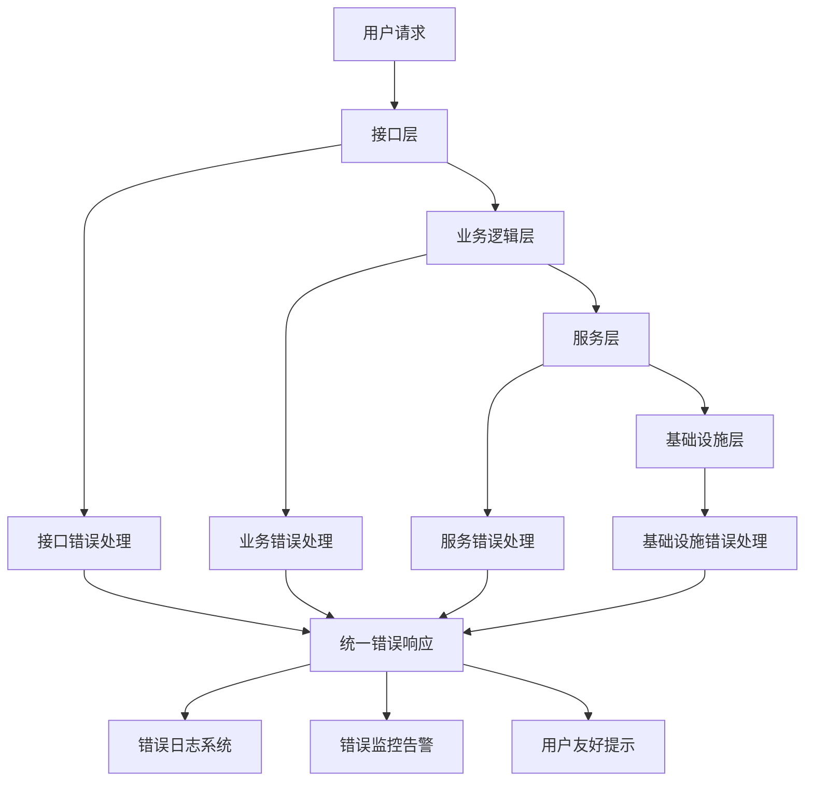
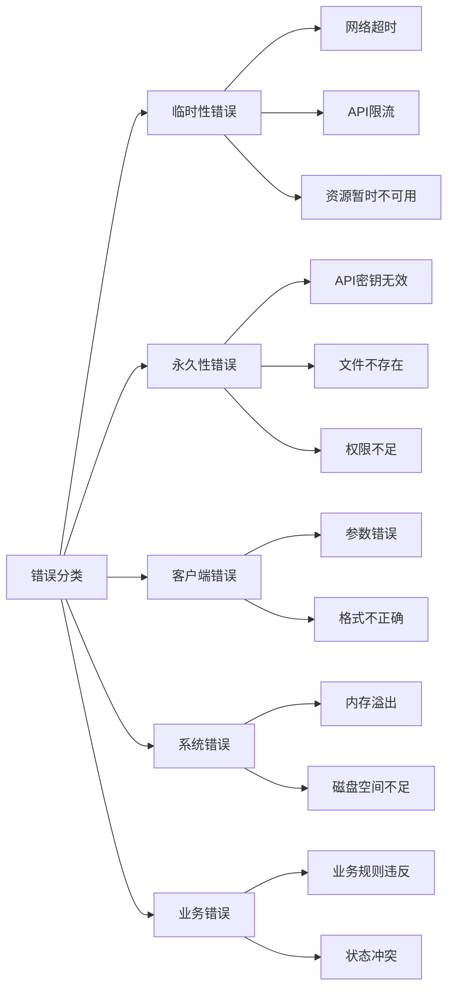
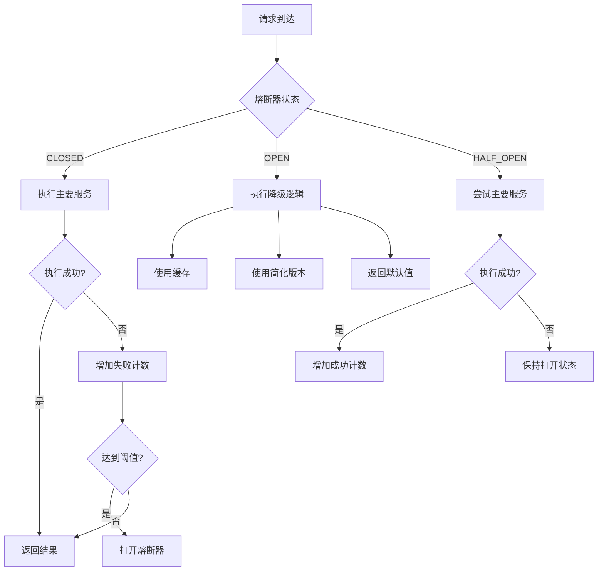

# Claude Code 错误处理与容错设计

## 1. 引言

在分布式AI系统中，错误处理和容错设计是保障系统稳定性的核心要素。Claude Code作为一个与AI模型交互、文件系统操作、命令执行等多维度集成的工具，面临着网络波动、API限流、文件系统异常、命令执行失败等多种错误场景。一个健壮的错误处理机制不仅能提升用户体验，还能确保系统在异常情况下的数据一致性和服务可用性。

错误处理的重要性体现在：

**系统可靠性**：通过合理的重试、降级和恢复机制，确保系统在遇到临时性故障时能够自动恢复，避免单点故障导致整体服务不可用。

**用户体验**：提供清晰、友好的错误提示，帮助用户理解问题并给出明确的解决方案，而非晦涩的技术错误信息。

**可观测性**：完善的错误日志和追踪系统能够帮助开发者快速定位问题，缩短故障恢复时间。

**资源保护**：通过限流、熔断等机制，防止错误雪崩效应，保护后端服务和API配额。

本文将深入剖析Claude Code的错误处理架构，从分层设计、错误分类、重试策略、降级方案到实战案例，全面展示如何构建一个高可用的AI代码助手系统。

## 2. 分层错误处理机制

Claude Code采用分层错误处理架构，在不同层级实施针对性的错误捕获和处理策略。

### 2.1 错误处理层级



### 2.2 各层职责

**接口层（Interface Layer）**
- 职责：参数验证、请求格式检查、权限验证
- 错误类型：参数缺失、格式错误、认证失败
- 处理策略：立即返回4xx错误，不进行重试

```typescript
// 接口层错误处理器
class InterfaceErrorHandler {
  validateRequest(request: Request): ValidationResult {
    try {
      // 验证必需参数
      if (!request.params.fileId) {
        throw new ValidationError('文件ID不能为空', {
          field: 'fileId',
          code: 'MISSING_REQUIRED_FIELD'
        });
      }

      // 验证参数格式
      if (!this.isValidPath(request.params.filePath)) {
        throw new ValidationError('文件路径格式无效', {
          field: 'filePath',
          code: 'INVALID_FORMAT'
        });
      }

      return { valid: true };
    } catch (error) {
      if (error instanceof ValidationError) {
        return {
          valid: false,
          error: {
            message: error.message,
            field: error.context.field,
            code: error.context.code
          }
        };
      }
      throw error;
    }
  }
}
```

**业务逻辑层（Business Logic Layer）**
- 职责：业务规则验证、流程控制、状态管理
- 错误类型：业务规则违反、状态冲突、资源不足
- 处理策略：返回业务错误码，可能触发降级逻辑

```typescript
// 业务逻辑层错误处理
class FileEditService {
  async editFile(filePath: string, content: string): Promise<EditResult> {
    try {
      // 检查文件是否已锁定
      if (await this.isFileLocked(filePath)) {
        throw new BusinessError('文件正在被其他操作使用', {
          code: 'FILE_LOCKED',
          filePath,
          retryable: true
        });
      }

      // 检查编辑权限
      if (!await this.hasEditPermission(filePath)) {
        throw new BusinessError('没有编辑权限', {
          code: 'PERMISSION_DENIED',
          filePath,
          retryable: false
        });
      }

      // 执行编辑操作
      return await this.performEdit(filePath, content);

    } catch (error) {
      if (error instanceof BusinessError) {
        // 记录业务错误
        this.logger.warn('业务错误', { error, filePath });
        throw error;
      }

      // 其他错误包装为业务错误
      throw new BusinessError('编辑文件失败', {
        code: 'EDIT_FAILED',
        originalError: error
      });
    }
  }
}
```

**服务层（Service Layer）**
- 职责：外部API调用、服务集成、数据转换
- 错误类型：API限流、网络超时、服务不可用
- 处理策略：重试、熔断、降级

**基础设施层（Infrastructure Layer）**
- 职责：文件系统、网络通信、数据库操作
- 错误类型：IO错误、网络中断、资源耗尽
- 处理策略：底层重试、资源清理、状态恢复

## 3. 错误分类体系

Claude Code将错误分为五大类，每类采用不同的处理策略。

### 3.1 错误分类图



### 3.2 错误定义

```typescript
// 错误类型枚举
enum ErrorType {
  TRANSIENT = 'transient',      // 临时性错误，可重试
  PERMANENT = 'permanent',       // 永久性错误，不可重试
  CLIENT = 'client',             // 客户端错误
  SYSTEM = 'system',             // 系统错误
  BUSINESS = 'business'          // 业务错误
}

// 错误严重级别
enum ErrorSeverity {
  LOW = 'low',                   // 低级别，不影响核心功能
  MEDIUM = 'medium',             // 中级别，影响部分功能
  HIGH = 'high',                 // 高级别，影响核心功能
  CRITICAL = 'critical'          // 严重，系统不可用
}

// 统一错误基类
class ClaudeCodeError extends Error {
  constructor(
    message: string,
    public readonly type: ErrorType,
    public readonly severity: ErrorSeverity,
    public readonly code: string,
    public readonly retryable: boolean,
    public readonly context?: Record<string, any>
  ) {
    super(message);
    this.name = 'ClaudeCodeError';
  }

  // 是否应该重试
  shouldRetry(): boolean {
    return this.retryable && this.type === ErrorType.TRANSIENT;
  }

  // 获取用户友好的错误消息
  getUserMessage(): string {
    return this.context?.userMessage || this.message;
  }
}

// 具体错误类型
class NetworkError extends ClaudeCodeError {
  constructor(message: string, context?: any) {
    super(
      message,
      ErrorType.TRANSIENT,
      ErrorSeverity.MEDIUM,
      'NETWORK_ERROR',
      true,
      context
    );
  }
}

class RateLimitError extends ClaudeCodeError {
  constructor(retryAfter: number, context?: any) {
    super(
      `API请求限流，请在${retryAfter}秒后重试`,
      ErrorType.TRANSIENT,
      ErrorSeverity.MEDIUM,
      'RATE_LIMIT',
      true,
      { ...context, retryAfter }
    );
  }
}
```

## 4. API限流和重试策略

### 4.1 智能重试机制

Claude Code实现了指数退避重试策略，针对不同类型的错误采用不同的重试配置。

```typescript
// 重试配置
interface RetryConfig {
  maxAttempts: number;          // 最大重试次数
  initialDelay: number;         // 初始延迟（毫秒）
  maxDelay: number;             // 最大延迟（毫秒）
  backoffMultiplier: number;    // 退避乘数
  jitter: boolean;              // 是否添加抖动
}

// 重试策略管理器
class RetryStrategy {
  private defaultConfig: RetryConfig = {
    maxAttempts: 3,
    initialDelay: 1000,
    maxDelay: 30000,
    backoffMultiplier: 2,
    jitter: true
  };

  // 执行带重试的操作
  async executeWithRetry<T>(
    operation: () => Promise<T>,
    config: Partial<RetryConfig> = {}
  ): Promise<T> {
    const finalConfig = { ...this.defaultConfig, ...config };
    let lastError: Error;

    for (let attempt = 0; attempt < finalConfig.maxAttempts; attempt++) {
      try {
        return await operation();
      } catch (error) {
        lastError = error;

        // 判断是否应该重试
        if (!this.shouldRetry(error, attempt, finalConfig)) {
          throw error;
        }

        // 计算延迟时间
        const delay = this.calculateDelay(attempt, finalConfig);

        // 记录重试日志
        console.warn(`重试操作 (${attempt + 1}/${finalConfig.maxAttempts})`, {
          error: error.message,
          delay,
          attempt
        });

        // 等待后重试
        await this.sleep(delay);
      }
    }

    throw new Error(`操作失败，已重试${finalConfig.maxAttempts}次: ${lastError.message}`);
  }

  // 判断是否应该重试
  private shouldRetry(error: any, attempt: number, config: RetryConfig): boolean {
    // 最后一次尝试不重试
    if (attempt >= config.maxAttempts - 1) {
      return false;
    }

    // ClaudeCodeError类型判断
    if (error instanceof ClaudeCodeError) {
      return error.shouldRetry();
    }

    // 网络错误重试
    if (error.code === 'ECONNRESET' || error.code === 'ETIMEDOUT') {
      return true;
    }

    // HTTP状态码判断
    if (error.response) {
      const status = error.response.status;
      return status === 429 || status === 503 || status >= 500;
    }

    return false;
  }

  // 计算延迟时间（指数退避+抖动）
  private calculateDelay(attempt: number, config: RetryConfig): number {
    let delay = Math.min(
      config.initialDelay * Math.pow(config.backoffMultiplier, attempt),
      config.maxDelay
    );

    // 添加随机抖动，避免雪崩效应
    if (config.jitter) {
      delay = delay * (0.5 + Math.random() * 0.5);
    }

    return Math.floor(delay);
  }

  private sleep(ms: number): Promise<void> {
    return new Promise(resolve => setTimeout(resolve, ms));
  }
}
```

### 4.2 限流控制器

```typescript
// 令牌桶限流器
class TokenBucket {
  private tokens: number;
  private lastRefillTime: number;

  constructor(
    private readonly capacity: number,      // 桶容量
    private readonly refillRate: number     // 每秒填充速率
  ) {
    this.tokens = capacity;
    this.lastRefillTime = Date.now();
  }

  // 尝试获取令牌
  async acquire(tokens: number = 1): Promise<boolean> {
    this.refill();

    if (this.tokens >= tokens) {
      this.tokens -= tokens;
      return true;
    }

    // 计算需要等待的时间
    const tokensNeeded = tokens - this.tokens;
    const waitTime = (tokensNeeded / this.refillRate) * 1000;

    // 等待时间过长，拒绝请求
    if (waitTime > 5000) {
      return false;
    }

    // 等待令牌填充
    await new Promise(resolve => setTimeout(resolve, waitTime));
    this.refill();

    if (this.tokens >= tokens) {
      this.tokens -= tokens;
      return true;
    }

    return false;
  }

  // 填充令牌
  private refill() {
    const now = Date.now();
    const timePassed = (now - this.lastRefillTime) / 1000;
    const tokensToAdd = timePassed * this.refillRate;

    this.tokens = Math.min(this.capacity, this.tokens + tokensToAdd);
    this.lastRefillTime = now;
  }
}

// API限流管理器
class RateLimiter {
  private buckets: Map<string, TokenBucket> = new Map();

  // 为不同API端点配置不同的限流策略
  private configs = {
    'claude-api': { capacity: 50, refillRate: 10 },    // 50个令牌，每秒填充10个
    'file-operations': { capacity: 100, refillRate: 20 },
    'command-execution': { capacity: 30, refillRate: 5 }
  };

  async checkLimit(endpoint: string): Promise<void> {
    let bucket = this.buckets.get(endpoint);

    if (!bucket) {
      const config = this.configs[endpoint] || { capacity: 50, refillRate: 10 };
      bucket = new TokenBucket(config.capacity, config.refillRate);
      this.buckets.set(endpoint, bucket);
    }

    const acquired = await bucket.acquire();

    if (!acquired) {
      throw new RateLimitError(5, { endpoint });
    }
  }
}
```

## 5. 优雅降级方案

### 5.1 熔断器模式

```typescript
// 熔断器状态
enum CircuitState {
  CLOSED = 'closed',       // 闭合状态，正常工作
  OPEN = 'open',           // 打开状态，拒绝请求
  HALF_OPEN = 'half_open' // 半开状态，尝试恢复
}

// 熔断器配置
interface CircuitBreakerConfig {
  failureThreshold: number;      // 失败阈值
  successThreshold: number;      // 成功阈值（半开状态）
  timeout: number;               // 超时时间
  resetTimeout: number;          // 重置超时时间
}

// 熔断器实现
class CircuitBreaker {
  private state: CircuitState = CircuitState.CLOSED;
  private failureCount: number = 0;
  private successCount: number = 0;
  private nextAttemptTime: number = 0;

  constructor(
    private readonly name: string,
    private readonly config: CircuitBreakerConfig
  ) {}

  // 执行操作
  async execute<T>(operation: () => Promise<T>): Promise<T> {
    // 检查熔断器状态
    if (this.state === CircuitState.OPEN) {
      if (Date.now() < this.nextAttemptTime) {
        throw new Error(`熔断器[${this.name}]已打开，请稍后重试`);
      }
      // 尝试半开状态
      this.state = CircuitState.HALF_OPEN;
    }

    try {
      const result = await Promise.race([
        operation(),
        this.timeoutPromise()
      ]);

      // 操作成功
      this.onSuccess();
      return result;

    } catch (error) {
      // 操作失败
      this.onFailure();
      throw error;
    }
  }

  // 成功处理
  private onSuccess() {
    this.failureCount = 0;

    if (this.state === CircuitState.HALF_OPEN) {
      this.successCount++;

      if (this.successCount >= this.config.successThreshold) {
        this.state = CircuitState.CLOSED;
        this.successCount = 0;
        console.info(`熔断器[${this.name}]已恢复`);
      }
    }
  }

  // 失败处理
  private onFailure() {
    this.failureCount++;
    this.successCount = 0;

    if (this.failureCount >= this.config.failureThreshold) {
      this.state = CircuitState.OPEN;
      this.nextAttemptTime = Date.now() + this.config.resetTimeout;
      console.warn(`熔断器[${this.name}]已打开`);
    }
  }

  // 超时Promise
  private timeoutPromise(): Promise<never> {
    return new Promise((_, reject) => {
      setTimeout(() => {
        reject(new Error(`操作超时(${this.config.timeout}ms)`));
      }, this.config.timeout);
    });
  }
}
```

### 5.2 降级策略



```typescript
// 降级策略管理器
class DegradationManager {
  private circuitBreakers: Map<string, CircuitBreaker> = new Map();
  private cache: Map<string, any> = new Map();

  // 执行带降级的操作
  async executeWithFallback<T>(
    serviceName: string,
    primaryOperation: () => Promise<T>,
    fallbackOperation: () => Promise<T>
  ): Promise<T> {
    const breaker = this.getOrCreateBreaker(serviceName);

    try {
      return await breaker.execute(primaryOperation);
    } catch (error) {
      console.warn(`服务[${serviceName}]失败，启用降级`, error);
      return await fallbackOperation();
    }
  }

  // Claude API调用带降级
  async callClaudeWithFallback(prompt: string): Promise<string> {
    return this.executeWithFallback(
      'claude-api',
      // 主要操作：调用Claude API
      async () => {
        const response = await this.claudeClient.complete(prompt);
        // 缓存成功的响应
        this.cache.set(`claude:${prompt}`, response);
        return response;
      },
      // 降级操作：使用缓存或简化提示
      async () => {
        // 尝试从缓存获取
        const cached = this.cache.get(`claude:${prompt}`);
        if (cached) {
          console.info('使用缓存响应');
          return cached;
        }

        // 使用简化的本地模型
        console.info('使用简化模型');
        return await this.localModel.complete(prompt);
      }
    );
  }

  private getOrCreateBreaker(name: string): CircuitBreaker {
    if (!this.circuitBreakers.has(name)) {
      const config = {
        failureThreshold: 5,
        successThreshold: 2,
        timeout: 30000,
        resetTimeout: 60000
      };
      this.circuitBreakers.set(name, new CircuitBreaker(name, config));
    }
    return this.circuitBreakers.get(name)!;
  }
}
```

## 6. 错误日志和追踪

### 6.1 结构化日志系统

```typescript
// 日志级别
enum LogLevel {
  DEBUG = 'debug',
  INFO = 'info',
  WARN = 'warn',
  ERROR = 'error',
  FATAL = 'fatal'
}

// 日志记录器
class Logger {
  private context: Record<string, any> = {};

  constructor(
    private readonly serviceName: string,
    private readonly traceId?: string
  ) {}

  // 添加上下文
  withContext(context: Record<string, any>): Logger {
    return new Logger(this.serviceName, this.traceId).setContext({
      ...this.context,
      ...context
    });
  }

  // 错误日志
  error(message: string, error?: Error, meta?: any) {
    this.log(LogLevel.ERROR, message, {
      error: error ? this.serializeError(error) : undefined,
      ...meta
    });
  }

  // 警告日志
  warn(message: string, meta?: any) {
    this.log(LogLevel.WARN, message, meta);
  }

  // 信息日志
  info(message: string, meta?: any) {
    this.log(LogLevel.INFO, message, meta);
  }

  // 统一日志输出
  private log(level: LogLevel, message: string, meta?: any) {
    const logEntry = {
      timestamp: new Date().toISOString(),
      level,
      service: this.serviceName,
      traceId: this.traceId,
      message,
      context: this.context,
      ...meta
    };

    // 输出到控制台
    console.log(JSON.stringify(logEntry));

    // 发送到日志系统
    this.sendToLogSystem(logEntry);
  }

  // 序列化错误对象
  private serializeError(error: Error): any {
    return {
      name: error.name,
      message: error.message,
      stack: error.stack,
      ...(error instanceof ClaudeCodeError ? {
        type: error.type,
        severity: error.severity,
        code: error.code,
        context: error.context
      } : {})
    };
  }

  private setContext(context: Record<string, any>): Logger {
    this.context = context;
    return this;
  }

  private sendToLogSystem(entry: any) {
    // 实现日志发送逻辑（如发送到ELK、Splunk等）
  }
}
```

### 6.2 分布式追踪

```typescript
// 追踪上下文
class TraceContext {
  constructor(
    public readonly traceId: string,
    public readonly spanId: string,
    public readonly parentSpanId?: string
  ) {}

  // 创建子Span
  createChildSpan(): TraceContext {
    return new TraceContext(
      this.traceId,
      this.generateSpanId(),
      this.spanId
    );
  }

  private generateSpanId(): string {
    return Math.random().toString(36).substring(2, 15);
  }
}

// 追踪管理器
class TracingManager {
  // 创建根追踪
  startTrace(operationName: string): Span {
    const traceId = this.generateTraceId();
    const context = new TraceContext(traceId, traceId);
    return new Span(operationName, context);
  }

  private generateTraceId(): string {
    return `${Date.now()}-${Math.random().toString(36).substring(2, 15)}`;
  }
}

// Span类
class Span {
  private startTime: number;
  private endTime?: number;
  private tags: Map<string, any> = new Map();
  private logs: Array<any> = [];

  constructor(
    private readonly operationName: string,
    private readonly context: TraceContext
  ) {
    this.startTime = Date.now();
  }

  // 添加标签
  setTag(key: string, value: any): Span {
    this.tags.set(key, value);
    return this;
  }

  // 记录日志
  log(message: string, fields?: Record<string, any>) {
    this.logs.push({
      timestamp: Date.now(),
      message,
      fields
    });
    return this;
  }

  // 创建子Span
  createChild(operationName: string): Span {
    const childContext = this.context.createChildSpan();
    return new Span(operationName, childContext);
  }

  // 结束Span
  finish() {
    this.endTime = Date.now();
    this.report();
  }

  // 上报追踪数据
  private report() {
    const spanData = {
      traceId: this.context.traceId,
      spanId: this.context.spanId,
      parentSpanId: this.context.parentSpanId,
      operationName: this.operationName,
      startTime: this.startTime,
      duration: this.endTime! - this.startTime,
      tags: Object.fromEntries(this.tags),
      logs: this.logs
    };

    // 发送到追踪系统（如Jaeger、Zipkin）
    console.log('Span报告:', spanData);
  }
}
```

## 7. 用户友好的错误提示

### 7.1 错误消息转换

```typescript
// 错误消息转换器
class ErrorMessageTranslator {
  private translations: Map<string, string> = new Map([
    ['ENOENT', '文件或目录不存在'],
    ['EACCES', '没有访问权限'],
    ['ETIMEDOUT', '操作超时，请检查网络连接'],
    ['RATE_LIMIT', 'API请求过于频繁，请稍后再试'],
    ['INVALID_API_KEY', 'API密钥无效，请检查配置']
  ]);

  // 获取用户友好的错误消息
  getUserMessage(error: Error): string {
    if (error instanceof ClaudeCodeError) {
      return error.getUserMessage();
    }

    const code = (error as any).code;
    if (code && this.translations.has(code)) {
      return this.translations.get(code)!;
    }

    return '操作失败，请稍后重试';
  }

  // 添加解决方案建议
  getSuggestions(error: Error): string[] {
    const suggestions: string[] = [];

    if (error instanceof NetworkError) {
      suggestions.push('检查网络连接是否正常');
      suggestions.push('确认防火墙未阻止连接');
    }

    if (error instanceof RateLimitError) {
      suggestions.push(`等待${error.context.retryAfter}秒后重试`);
      suggestions.push('考虑降低请求频率');
    }

    if ((error as any).code === 'ENOENT') {
      suggestions.push('确认文件路径是否正确');
      suggestions.push('检查文件是否已被删除或移动');
    }

    return suggestions;
  }
}
```

### 7.2 错误提示组件

```typescript
// 错误响应构建器
class ErrorResponseBuilder {
  private translator = new ErrorMessageTranslator();

  buildErrorResponse(error: Error): ErrorResponse {
    const message = this.translator.getUserMessage(error);
    const suggestions = this.translator.getSuggestions(error);

    return {
      success: false,
      error: {
        message,
        code: this.getErrorCode(error),
        suggestions,
        timestamp: new Date().toISOString(),
        ...(this.shouldIncludeDetails(error) ? {
          details: error.message,
          stack: error.stack
        } : {})
      }
    };
  }

  private getErrorCode(error: Error): string {
    if (error instanceof ClaudeCodeError) {
      return error.code;
    }
    return (error as any).code || 'UNKNOWN_ERROR';
  }

  private shouldIncludeDetails(error: Error): boolean {
    // 开发环境返回详细信息
    return process.env.NODE_ENV === 'development';
  }
}

interface ErrorResponse {
  success: false;
  error: {
    message: string;
    code: string;
    suggestions: string[];
    timestamp: string;
    details?: string;
    stack?: string;
  };
}
```

## 8. 异常恢复和状态一致性

### 8.1 事务性操作

```typescript
// 事务管理器
class TransactionManager {
  private operations: Array<{
    execute: () => Promise<void>;
    rollback: () => Promise<void>;
  }> = [];

  // 添加操作
  addOperation(
    execute: () => Promise<void>,
    rollback: () => Promise<void>
  ) {
    this.operations.push({ execute, rollback });
  }

  // 执行事务
  async execute(): Promise<void> {
    const executedOps: number[] = [];

    try {
      // 按顺序执行所有操作
      for (let i = 0; i < this.operations.length; i++) {
        await this.operations[i].execute();
        executedOps.push(i);
      }
    } catch (error) {
      // 发生错误，回滚已执行的操作
      console.error('事务执行失败，开始回滚', error);
      await this.rollback(executedOps);
      throw error;
    }
  }

  // 回滚操作
  private async rollback(executedOps: number[]) {
    // 逆序回滚
    for (let i = executedOps.length - 1; i >= 0; i--) {
      const opIndex = executedOps[i];
      try {
        await this.operations[opIndex].rollback();
      } catch (rollbackError) {
        console.error(`回滚操作${opIndex}失败`, rollbackError);
        // 继续回滚其他操作
      }
    }
  }
}

// 使用示例：文件编辑事务
async function editFileWithTransaction(
  filePath: string,
  newContent: string
): Promise<void> {
  const transaction = new TransactionManager();
  let originalContent: string;
  let backupPath: string;

  // 操作1：备份原文件
  transaction.addOperation(
    async () => {
      originalContent = await fs.readFile(filePath, 'utf-8');
      backupPath = `${filePath}.backup`;
      await fs.writeFile(backupPath, originalContent);
    },
    async () => {
      if (backupPath) {
        await fs.unlink(backupPath);
      }
    }
  );

  // 操作2：写入新内容
  transaction.addOperation(
    async () => {
      await fs.writeFile(filePath, newContent);
    },
    async () => {
      if (originalContent) {
        await fs.writeFile(filePath, originalContent);
      }
    }
  );

  // 操作3：验证文件内容
  transaction.addOperation(
    async () => {
      const content = await fs.readFile(filePath, 'utf-8');
      if (content !== newContent) {
        throw new Error('文件内容验证失败');
      }
    },
    async () => {
      // 验证操作不需要回滚
    }
  );

  await transaction.execute();
}
```

### 8.2 状态恢复机制

```typescript
// 状态快照
interface StateSnapshot {
  timestamp: number;
  state: any;
  metadata: Record<string, any>;
}

// 状态管理器
class StateManager {
  private snapshots: StateSnapshot[] = [];
  private maxSnapshots = 10;

  // 保存状态快照
  saveSnapshot(state: any, metadata?: Record<string, any>) {
    const snapshot: StateSnapshot = {
      timestamp: Date.now(),
      state: JSON.parse(JSON.stringify(state)), // 深拷贝
      metadata: metadata || {}
    };

    this.snapshots.push(snapshot);

    // 保持快照数量限制
    if (this.snapshots.length > this.maxSnapshots) {
      this.snapshots.shift();
    }
  }

  // 恢复到最近的快照
  restoreLatest(): any | null {
    if (this.snapshots.length === 0) {
      return null;
    }

    const latest = this.snapshots[this.snapshots.length - 1];
    return JSON.parse(JSON.stringify(latest.state));
  }

  // 恢复到特定时间点
  restoreToTimestamp(timestamp: number): any | null {
    const snapshot = this.snapshots
      .reverse()
      .find(s => s.timestamp <= timestamp);

    return snapshot ? JSON.parse(JSON.stringify(snapshot.state)) : null;
  }
}
```

## 9. 实战案例：文件编辑的完整错误处理

```typescript
// 综合案例：带完整错误处理的文件编辑服务
class RobustFileEditService {
  private retryStrategy = new RetryStrategy();
  private rateLimiter = new RateLimiter();
  private degradationManager = new DegradationManager();
  private stateManager = new StateManager();
  private logger = new Logger('FileEditService');

  async editFile(request: EditFileRequest): Promise<EditFileResponse> {
    // 创建追踪
    const tracer = new TracingManager();
    const span = tracer.startTrace('editFile');
    span.setTag('filePath', request.filePath);

    try {
      // 1. 参数验证
      this.validateRequest(request);

      // 2. 限流检查
      await this.rateLimiter.checkLimit('file-operations');

      // 3. 保存状态快照
      const currentState = await this.getCurrentState(request.filePath);
      this.stateManager.saveSnapshot(currentState);

      // 4. 执行编辑操作（带重试和降级）
      const result = await this.retryStrategy.executeWithRetry(
        async () => {
          return await this.performEdit(request, span);
        },
        {
          maxAttempts: 3,
          initialDelay: 1000,
          maxDelay: 10000
        }
      );

      span.setTag('success', true);
      span.finish();

      return result;

    } catch (error) {
      // 错误处理
      span.setTag('error', true);
      span.log('编辑失败', { error: error.message });
      span.finish();

      this.logger.error('文件编辑失败', error, {
        filePath: request.filePath
      });

      // 尝试恢复状态
      await this.recoverState(request.filePath);

      // 构建用户友好的错误响应
      throw this.buildUserError(error);
    }
  }

  private validateRequest(request: EditFileRequest) {
    if (!request.filePath) {
      throw new ValidationError('文件路径不能为空', {
        code: 'MISSING_FILE_PATH',
        field: 'filePath'
      });
    }

    if (!request.changes || request.changes.length === 0) {
      throw new ValidationError('编辑内容不能为空', {
        code: 'MISSING_CHANGES',
        field: 'changes'
      });
    }
  }

  private async performEdit(
    request: EditFileRequest,
    span: Span
  ): Promise<EditFileResponse> {
    const editSpan = span.createChild('performEdit');

    try {
      // 读取文件
      const content = await fs.readFile(request.filePath, 'utf-8');
      editSpan.log('文件读取成功');

      // 应用更改
      let newContent = content;
      for (const change of request.changes) {
        newContent = this.applyChange(newContent, change);
      }

      // 写入文件
      await fs.writeFile(request.filePath, newContent);
      editSpan.log('文件写入成功');

      editSpan.finish();

      return {
        success: true,
        filePath: request.filePath,
        changes: request.changes.length
      };

    } catch (error) {
      editSpan.log('编辑失败', { error: error.message });
      editSpan.finish();
      throw error;
    }
  }

  private async recoverState(filePath: string) {
    try {
      const previousState = this.stateManager.restoreLatest();
      if (previousState) {
        await fs.writeFile(filePath, previousState.content);
        this.logger.info('状态恢复成功', { filePath });
      }
    } catch (error) {
      this.logger.error('状态恢复失败', error, { filePath });
    }
  }

  private buildUserError(error: Error): ClaudeCodeError {
    const translator = new ErrorMessageTranslator();
    const message = translator.getUserMessage(error);
    const suggestions = translator.getSuggestions(error);

    return new ClaudeCodeError(
      message,
      ErrorType.SYSTEM,
      ErrorSeverity.HIGH,
      'FILE_EDIT_FAILED',
      false,
      { originalError: error, suggestions }
    );
  }

  private applyChange(content: string, change: any): string {
    // 实现具体的更改逻辑
    return content.replace(change.oldText, change.newText);
  }

  private async getCurrentState(filePath: string): Promise<any> {
    try {
      const content = await fs.readFile(filePath, 'utf-8');
      return { content, timestamp: Date.now() };
    } catch {
      return null;
    }
  }
}

interface EditFileRequest {
  filePath: string;
  changes: Array<{ oldText: string; newText: string }>;
}

interface EditFileResponse {
  success: boolean;
  filePath: string;
  changes: number;
}
```

## 10. 最佳实践

### 10.1 错误处理原则

1. **快速失败（Fail Fast）**：对于明确无法恢复的错误，立即返回，不浪费资源
2. **错误隔离**：防止错误扩散，使用熔断器保护系统
3. **优雅降级**：在服务不可用时提供基础功能
4. **可观测性**：完善的日志和监控，快速定位问题
5. **用户友好**：提供清晰的错误信息和解决建议

### 10.2 实施建议

- **分层处理**：在不同层级实施针对性的错误处理策略
- **重试策略**：仅对临时性错误重试，使用指数退避避免雪崩
- **限流保护**：使用令牌桶等算法保护API配额
- **状态一致性**：使用事务和快照机制保证数据一致性
- **监控告警**：设置关键指标的监控和告警阈值

## 11. FAQ

**Q: 如何区分临时性错误和永久性错误？**
A: 临时性错误通常是网络超时、服务暂时不可用、限流等可以通过重试解决的问题。永久性错误如API密钥无效、文件不存在、权限不足等需要修改配置或代码才能解决。

**Q: 重试次数如何设定？**
A: 根据操作的重要性和时延要求设定。一般API调用3-5次，文件操作2-3次。关键是配置合理的退避时间，避免对后端服务造成压力。

**Q: 熔断器何时使用？**
A: 当调用外部服务（如Claude API）时应使用熔断器，防止外部服务故障导致整个系统不可用。当失败率达到阈值时打开熔断器，保护系统资源。

**Q: 如何测试错误处理逻辑？**
A: 使用故障注入（Fault Injection）技术，模拟各种错误场景。编写单元测试覆盖各种错误分支，进行混沌工程测试验证系统韧性。

## 12. 总结

错误处理和容错设计是构建高可用AI系统的基石。Claude Code通过分层错误处理、智能重试、熔断降级、状态恢复等机制，确保在各种异常场景下都能提供稳定可靠的服务。合理的错误分类、用户友好的提示、完善的日志追踪，不仅提升了系统的健壮性，也大大改善了用户体验。在实际应用中，应根据具体业务场景调整错误处理策略，持续优化系统的容错能力。
