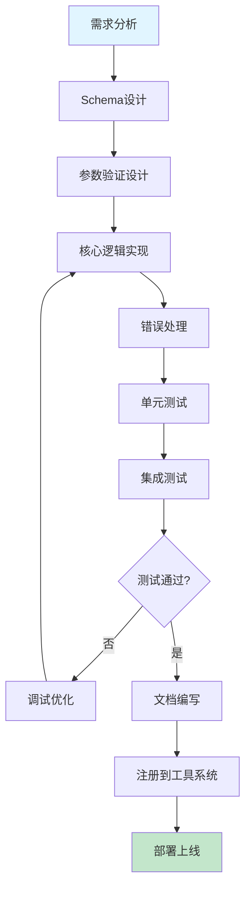
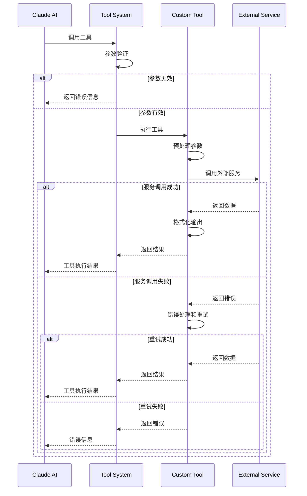
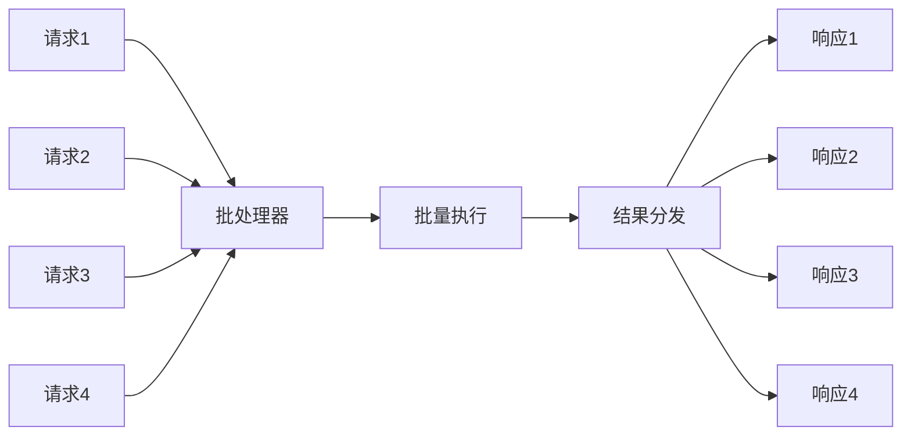
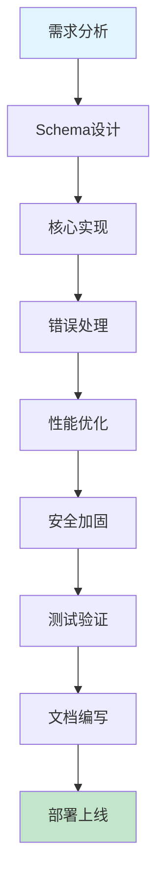

# 17-自定义工具开发实战

## 1. 引言

在前面的章节中，我们详细讲解了Claude Code的工具系统架构和内置工具的实现原理。但在实际开发中，内置工具往往无法满足所有需求，这时就需要开发自定义工具。

### 1.1 为什么要开发自定义工具

**内置工具的局限性**：
- 功能范围有限：内置工具主要聚焦于文件操作、代码搜索和终端命令
- 特定领域支持不足：数据库操作、API调用、代码生成等需要专门的工具
- 业务逻辑集成困难：企业内部系统和服务需要定制化集成

**自定义工具的价值**：
- **扩展AI能力边界**：让AI能够与各种外部系统交互
- **提升工作效率**：自动化重复性工作流
- **业务深度集成**：将AI融入现有的开发流程和工具链
- **知识沉淀**：将专家经验固化为可复用的工具

### 1.2 实战案例概览

本文将通过3个完整的实战案例，深入讲解自定义工具的开发：

1. **数据库查询工具**：支持MySQL和PostgreSQL的SQL执行和结果格式化
2. **RESTful API调用工具**：通用的HTTP客户端，支持多种认证方式
3. **代码生成工具**：基于模板和AST的智能代码生成器

每个案例都包含：
- 需求分析
- Tool Schema设计
- 完整代码实现（可直接运行）
- 测试和调试方法
- 最佳实践总结

### 1.3 本文目标

通过本文，你将学会：
- 如何从零开始设计一个工具
- 如何编写规范的Tool Schema
- 如何处理复杂的参数验证和错误处理
- 如何优化工具的性能和安全性
- 如何测试和调试自定义工具

---

## 2. 工具开发完整流程

在开始编写代码之前，我们需要了解自定义工具开发的完整流程：



### 2.1 需求分析阶段

在开始编码前，需要明确以下问题：

**功能需求**：
- 这个工具要解决什么问题？
- 输入是什么？输出是什么？
- 是否需要支持多种使用场景？
- 是否需要保持状态？

**非功能需求**：
- 性能要求（响应时间、并发量）
- 安全要求（认证、授权、数据加密）
- 可靠性要求（错误重试、降级方案）
- 可维护性要求（日志、监控）

**依赖分析**：
- 需要依赖哪些外部服务？
- 需要安装哪些第三方库？
- 是否需要特殊的系统权限？

### 2.2 Schema设计原则

Tool Schema是工具的"接口文档"，决定了AI如何理解和使用这个工具。

**设计原则**：

1. **清晰的命名**
```typescript
// 好的命名
{
  name: "database_query",
  description: "执行SQL查询并返回结果"
}

// 不好的命名
{
  name: "db_q",  // 过于简短
  description: "执行查询"  // 描述不清晰
}
```

2. **详细的描述**
```typescript
{
  name: "api_call",
  description: `
    调用RESTful API并返回响应结果。
    支持GET、POST、PUT、DELETE等HTTP方法。
    支持多种认证方式：API Key、Bearer Token、Basic Auth。
    自动处理JSON请求和响应。
  `
}
```

3. **完整的参数定义**
```typescript
{
  input_schema: {
    type: "object",
    properties: {
      url: {
        type: "string",
        description: "API的完整URL地址",
        pattern: "^https?://"  // 正则验证
      },
      method: {
        type: "string",
        enum: ["GET", "POST", "PUT", "DELETE"],
        default: "GET",
        description: "HTTP方法"
      },
      headers: {
        type: "object",
        description: "请求头（可选）",
        additionalProperties: { type: "string" }
      }
    },
    required: ["url"]  // 明确必填参数
  }
}
```

4. **合理的默认值**
```typescript
{
  properties: {
    timeout: {
      type: "number",
      default: 30,
      description: "超时时间（秒），默认30秒"
    },
    retries: {
      type: "number",
      default: 3,
      description: "失败重试次数，默认3次"
    }
  }
}
```

### 2.3 实现流程图



---

## 3. 实战案例1：数据库查询工具

### 3.1 需求分析

**功能需求**：
- 支持执行SQL查询（SELECT、INSERT、UPDATE、DELETE）
- 支持MySQL和PostgreSQL两种数据库
- 返回格式化的查询结果
- 支持参数化查询（防SQL注入）
- 支持事务管理

**安全需求**：
- 禁止执行危险SQL（DROP、TRUNCATE等）
- 限制查询结果数量（防止内存溢出）
- 连接信息加密存储
- 支持只读模式

**性能需求**：
- 连接池管理（复用连接）
- 查询超时控制
- 大结果集分页

### 3.2 Tool Schema设计

```typescript
{
  name: "database_query",
  description: `
    执行SQL查询并返回格式化的结果。

    支持的数据库：
    - MySQL 5.7+
    - PostgreSQL 10+

    安全特性：
    - 自动过滤危险SQL命令（DROP、TRUNCATE等）
    - 支持参数化查询，防止SQL注入
    - 限制返回结果数量（默认最多1000行）

    使用示例：
    - 查询用户：SELECT * FROM users WHERE status = 'active'
    - 插入数据：INSERT INTO logs (message, level) VALUES (?, ?)
    - 更新数据：UPDATE products SET price = ? WHERE id = ?
  `,
  input_schema: {
    type: "object",
    properties: {
      connection_name: {
        type: "string",
        description: "数据库连接名称（需要在配置文件中预先定义）",
        examples: ["main_db", "analytics_db"]
      },
      sql: {
        type: "string",
        description: "要执行的SQL语句"
      },
      params: {
        type: "array",
        description: "参数化查询的参数列表（可选）",
        items: {
          oneOf: [
            { type: "string" },
            { type: "number" },
            { type: "boolean" },
            { type: "null" }
          ]
        }
      },
      limit: {
        type: "number",
        description: "最多返回的结果行数，默认1000，最大10000",
        default: 1000,
        minimum: 1,
        maximum: 10000
      },
      timeout: {
        type: "number",
        description: "查询超时时间（秒），默认30秒",
        default: 30,
        minimum: 1,
        maximum: 300
      },
      readonly: {
        type: "boolean",
        description: "只读模式，仅允许SELECT查询，默认true",
        default: true
      }
    },
    required: ["connection_name", "sql"]
  }
}
```

### 3.3 完整代码实现

```typescript
import mysql from 'mysql2/promise';
import { Pool as PgPool } from 'pg';
import * as fs from 'fs/promises';
import * as path from 'path';

// ==================== 配置管理 ====================

/**
 * 数据库连接配置
 */
interface DatabaseConfig {
  type: 'mysql' | 'postgresql';
  host: string;
  port: number;
  database: string;
  user: string;
  password: string;
  poolMin?: number;
  poolMax?: number;
}

/**
 * 配置文件格式
 */
interface ConfigFile {
  connections: {
    [name: string]: DatabaseConfig;
  };
}

/**
 * 配置管理器
 */
class ConfigManager {
  private config: ConfigFile | null = null;
  private configPath: string;

  constructor(configPath: string) {
    this.configPath = configPath;
  }

  /**
   * 加载配置文件
   */
  async loadConfig(): Promise<void> {
    try {
      const content = await fs.readFile(this.configPath, 'utf-8');
      this.config = JSON.parse(content);
    } catch (error) {
      throw new Error(`无法加载配置文件: ${error.message}`);
    }
  }

  /**
   * 获取连接配置
   */
  getConnection(name: string): DatabaseConfig {
    if (!this.config) {
      throw new Error('配置文件未加载');
    }

    const conn = this.config.connections[name];
    if (!conn) {
      throw new Error(`连接配置不存在: ${name}`);
    }

    return conn;
  }
}

// ==================== 连接池管理 ====================

/**
 * 数据库连接池接口
 */
interface DatabasePool {
  query(sql: string, params?: any[]): Promise<any>;
  close(): Promise<void>;
}

/**
 * MySQL连接池实现
 */
class MySQLPool implements DatabasePool {
  private pool: mysql.Pool;

  constructor(config: DatabaseConfig) {
    this.pool = mysql.createPool({
      host: config.host,
      port: config.port,
      database: config.database,
      user: config.user,
      password: config.password,
      waitForConnections: true,
      connectionLimit: config.poolMax || 10,
      queueLimit: 0
    });
  }

  async query(sql: string, params?: any[]): Promise<any> {
    const [rows] = await this.pool.execute(sql, params);
    return rows;
  }

  async close(): Promise<void> {
    await this.pool.end();
  }
}

/**
 * PostgreSQL连接池实现
 */
class PostgreSQLPool implements DatabasePool {
  private pool: PgPool;

  constructor(config: DatabaseConfig) {
    this.pool = new PgPool({
      host: config.host,
      port: config.port,
      database: config.database,
      user: config.user,
      password: config.password,
      min: config.poolMin || 2,
      max: config.poolMax || 10
    });
  }

  async query(sql: string, params?: any[]): Promise<any> {
    const result = await this.pool.query(sql, params);
    return result.rows;
  }

  async close(): Promise<void> {
    await this.pool.end();
  }
}

/**
 * 连接池管理器
 */
class PoolManager {
  private pools: Map<string, DatabasePool> = new Map();
  private configManager: ConfigManager;

  constructor(configManager: ConfigManager) {
    this.configManager = configManager;
  }

  /**
   * 获取或创建连接池
   */
  getPool(connectionName: string): DatabasePool {
    // 复用已有连接池
    if (this.pools.has(connectionName)) {
      return this.pools.get(connectionName)!;
    }

    // 创建新连接池
    const config = this.configManager.getConnection(connectionName);
    let pool: DatabasePool;

    if (config.type === 'mysql') {
      pool = new MySQLPool(config);
    } else if (config.type === 'postgresql') {
      pool = new PostgreSQLPool(config);
    } else {
      throw new Error(`不支持的数据库类型: ${config.type}`);
    }

    this.pools.set(connectionName, pool);
    return pool;
  }

  /**
   * 关闭所有连接池
   */
  async closeAll(): Promise<void> {
    const promises = Array.from(this.pools.values()).map(pool => pool.close());
    await Promise.all(promises);
    this.pools.clear();
  }
}

// ==================== SQL安全检查 ====================

/**
 * SQL安全检查器
 */
class SQLSafetyChecker {
  // 危险SQL关键字（禁止执行）
  private static DANGEROUS_KEYWORDS = [
    'DROP',
    'TRUNCATE',
    'DELETE FROM',
    'ALTER',
    'CREATE',
    'GRANT',
    'REVOKE'
  ];

  // 只读模式下允许的SQL类型
  private static READONLY_KEYWORDS = [
    'SELECT',
    'SHOW',
    'DESCRIBE',
    'EXPLAIN'
  ];

  /**
   * 检查SQL是否安全
   */
  static check(sql: string, readonly: boolean): { safe: boolean; reason?: string } {
    const normalizedSql = sql.trim().toUpperCase();

    // 检查危险关键字
    for (const keyword of this.DANGEROUS_KEYWORDS) {
      if (normalizedSql.includes(keyword)) {
        return {
          safe: false,
          reason: `禁止执行包含 ${keyword} 的SQL语句`
        };
      }
    }

    // 只读模式检查
    if (readonly) {
      const isReadOnly = this.READONLY_KEYWORDS.some(keyword =>
        normalizedSql.startsWith(keyword)
      );

      if (!isReadOnly) {
        return {
          safe: false,
          reason: '只读模式下仅允许执行SELECT等查询语句'
        };
      }
    }

    return { safe: true };
  }
}

// ==================== 结果格式化 ====================

/**
 * 查询结果格式化器
 */
class ResultFormatter {
  /**
   * 格式化查询结果
   */
  static format(rows: any[], limit: number): string {
    if (!rows || rows.length === 0) {
      return '查询成功，但没有返回结果。';
    }

    // 限制结果数量
    const limitedRows = rows.slice(0, limit);
    const truncated = rows.length > limit;

    // 获取列名
    const columns = Object.keys(limitedRows[0]);

    // 构建表格
    let output = '查询结果：\n\n';

    // 表头
    output += '| ' + columns.join(' | ') + ' |\n';
    output += '| ' + columns.map(() => '---').join(' | ') + ' |\n';

    // 数据行
    for (const row of limitedRows) {
      const values = columns.map(col => {
        const value = row[col];
        if (value === null) return 'NULL';
        if (typeof value === 'object') return JSON.stringify(value);
        return String(value);
      });
      output += '| ' + values.join(' | ') + ' |\n';
    }

    // 统计信息
    output += `\n共 ${rows.length} 条记录`;
    if (truncated) {
      output += `（显示前 ${limit} 条）`;
    }

    return output;
  }

  /**
   * 格式化执行结果（INSERT、UPDATE、DELETE）
   */
  static formatMutation(result: any): string {
    if (result.affectedRows !== undefined) {
      // MySQL结果
      return `执行成功，影响了 ${result.affectedRows} 行数据。`;
    } else if (result.rowCount !== undefined) {
      // PostgreSQL结果
      return `执行成功，影响了 ${result.rowCount} 行数据。`;
    } else {
      return '执行成功。';
    }
  }
}

// ==================== 主工具类 ====================

/**
 * 工具输入参数
 */
interface DatabaseQueryInput {
  connection_name: string;
  sql: string;
  params?: any[];
  limit?: number;
  timeout?: number;
  readonly?: boolean;
}

/**
 * 数据库查询工具
 */
class DatabaseQueryTool {
  private configManager: ConfigManager;
  private poolManager: PoolManager;

  constructor(configPath: string) {
    this.configManager = new ConfigManager(configPath);
    this.poolManager = new PoolManager(this.configManager);
  }

  /**
   * 初始化工具（加载配置）
   */
  async initialize(): Promise<void> {
    await this.configManager.loadConfig();
  }

  /**
   * 执行工具
   */
  async execute(input: DatabaseQueryInput): Promise<string> {
    // 参数默认值
    const limit = input.limit || 1000;
    const timeout = input.timeout || 30;
    const readonly = input.readonly !== false; // 默认只读

    try {
      // SQL安全检查
      const safetyCheck = SQLSafetyChecker.check(input.sql, readonly);
      if (!safetyCheck.safe) {
        throw new Error(`SQL安全检查失败: ${safetyCheck.reason}`);
      }

      // 获取连接池
      const pool = this.poolManager.getPool(input.connection_name);

      // 执行查询（带超时控制）
      const queryPromise = pool.query(input.sql, input.params);
      const timeoutPromise = new Promise((_, reject) =>
        setTimeout(() => reject(new Error('查询超时')), timeout * 1000)
      );

      const result = await Promise.race([queryPromise, timeoutPromise]);

      // 格式化结果
      if (Array.isArray(result)) {
        // 查询结果
        return ResultFormatter.format(result, limit);
      } else {
        // 修改操作结果
        return ResultFormatter.formatMutation(result);
      }
    } catch (error) {
      // 错误处理
      return this.handleError(error);
    }
  }

  /**
   * 错误处理
   */
  private handleError(error: any): string {
    let message = '数据库查询失败: ';

    if (error.code === 'ER_ACCESS_DENIED_ERROR') {
      message += '数据库认证失败，请检查用户名和密码';
    } else if (error.code === 'ECONNREFUSED') {
      message += '无法连接到数据库服务器';
    } else if (error.code === 'ER_NO_SUCH_TABLE') {
      message += '表不存在';
    } else if (error.code === 'ER_PARSE_ERROR') {
      message += 'SQL语法错误';
    } else {
      message += error.message;
    }

    return message;
  }

  /**
   * 清理资源
   */
  async cleanup(): Promise<void> {
    await this.poolManager.closeAll();
  }
}

// ==================== 工具注册 ====================

/**
 * 创建工具实例
 */
export async function createDatabaseQueryTool(
  configPath: string
): Promise<DatabaseQueryTool> {
  const tool = new DatabaseQueryTool(configPath);
  await tool.initialize();
  return tool;
}

/**
 * 工具定义（用于注册到Claude Code）
 */
export const toolDefinition = {
  name: "database_query",
  description: `
    执行SQL查询并返回格式化的结果。

    支持的数据库：MySQL 5.7+、PostgreSQL 10+
    安全特性：自动过滤危险SQL、支持参数化查询、限制结果数量
  `,
  input_schema: {
    type: "object",
    properties: {
      connection_name: {
        type: "string",
        description: "数据库连接名称"
      },
      sql: {
        type: "string",
        description: "要执行的SQL语句"
      },
      params: {
        type: "array",
        description: "参数化查询的参数列表（可选）"
      },
      limit: {
        type: "number",
        default: 1000,
        description: "最多返回的结果行数"
      },
      timeout: {
        type: "number",
        default: 30,
        description: "查询超时时间（秒）"
      },
      readonly: {
        type: "boolean",
        default: true,
        description: "只读模式"
      }
    },
    required: ["connection_name", "sql"]
  }
};
```

### 3.4 配置文件示例

```json
{
  "connections": {
    "main_db": {
      "type": "mysql",
      "host": "localhost",
      "port": 3306,
      "database": "myapp",
      "user": "app_user",
      "password": "secure_password",
      "poolMax": 10
    },
    "analytics_db": {
      "type": "postgresql",
      "host": "analytics.example.com",
      "port": 5432,
      "database": "analytics",
      "user": "readonly_user",
      "password": "readonly_password",
      "poolMin": 2,
      "poolMax": 5
    }
  }
}
```

### 3.5 测试代码

```typescript
import { createDatabaseQueryTool } from './database-query-tool';

/**
 * 测试用例
 */
async function testDatabaseQueryTool() {
  // 创建工具实例
  const tool = await createDatabaseQueryTool('./db-config.json');

  try {
    // 测试1: 简单查询
    console.log('测试1: 查询用户列表');
    const result1 = await tool.execute({
      connection_name: 'main_db',
      sql: 'SELECT id, name, email FROM users LIMIT 10'
    });
    console.log(result1);

    // 测试2: 参数化查询
    console.log('\n测试2: 参数化查询');
    const result2 = await tool.execute({
      connection_name: 'main_db',
      sql: 'SELECT * FROM users WHERE status = ? AND created_at > ?',
      params: ['active', '2024-01-01']
    });
    console.log(result2);

    // 测试3: 聚合查询
    console.log('\n测试3: 聚合查询');
    const result3 = await tool.execute({
      connection_name: 'analytics_db',
      sql: 'SELECT DATE(created_at) as date, COUNT(*) as count FROM events GROUP BY date ORDER BY date DESC LIMIT 7'
    });
    console.log(result3);

    // 测试4: 安全检查（应该失败）
    console.log('\n测试4: 尝试执行危险SQL');
    const result4 = await tool.execute({
      connection_name: 'main_db',
      sql: 'DROP TABLE users'
    });
    console.log(result4);

    // 测试5: 只读模式检查（应该失败）
    console.log('\n测试5: 只读模式下尝试UPDATE');
    const result5 = await tool.execute({
      connection_name: 'main_db',
      sql: 'UPDATE users SET status = "inactive" WHERE id = 1',
      readonly: true
    });
    console.log(result5);

  } finally {
    // 清理资源
    await tool.cleanup();
  }
}

// 运行测试
testDatabaseQueryTool().catch(console.error);
```

### 3.6 使用示例

在Claude Code中使用该工具：

```
用户: 帮我查询一下数据库中最近注册的10个用户

Claude: 我来查询最近注册的用户。

[调用工具: database_query]
{
  "connection_name": "main_db",
  "sql": "SELECT id, name, email, created_at FROM users ORDER BY created_at DESC LIMIT 10"
}

[工具返回结果]
查询结果：

| id | name | email | created_at |
| --- | --- | --- | --- |
| 105 | 张三 | zhang@example.com | 2024-01-15 10:23:45 |
| 104 | 李四 | li@example.com | 2024-01-15 09:12:33 |
| 103 | 王五 | wang@example.com | 2024-01-14 16:45:22 |
...

共 10 条记录

Claude: 我已经查询到了最近注册的10个用户。从结果可以看出：
- 最新的用户是张三，注册时间是2024-01-15 10:23:45
- 这10个用户都是在最近两天内注册的
- ...
```

---

## 4. 实战案例2：RESTful API调用工具

### 4.1 需求分析

**功能需求**：
- 支持GET、POST、PUT、DELETE、PATCH等HTTP方法
- 支持多种请求格式（JSON、表单、文件上传）
- 支持多种认证方式（API Key、Bearer Token、Basic Auth、OAuth2）
- 自动处理重定向
- 支持自定义请求头和查询参数

**性能需求**：
- 支持超时控制
- 支持失败重试
- 连接复用（HTTP Keep-Alive）
- 响应缓存

**安全需求**：
- HTTPS证书验证
- 敏感信息脱敏（日志中不显示密码、token等）
- 请求频率限制

### 4.2 Tool Schema设计

```typescript
{
  name: "api_call",
  description: `
    调用RESTful API并返回响应结果。

    支持功能：
    - 多种HTTP方法（GET、POST、PUT、DELETE、PATCH）
    - 多种认证方式（API Key、Bearer Token、Basic Auth）
    - 自动JSON序列化/反序列化
    - 超时和重试控制
    - 响应格式化

    使用示例：
    - GET请求：method=GET, url=https://api.example.com/users
    - POST请求：method=POST, url=https://api.example.com/users, body={...}
    - 带认证：auth={type: "bearer", token: "xxx"}
  `,
  input_schema: {
    type: "object",
    properties: {
      url: {
        type: "string",
        description: "API的完整URL地址",
        pattern: "^https?://"
      },
      method: {
        type: "string",
        enum: ["GET", "POST", "PUT", "DELETE", "PATCH", "HEAD", "OPTIONS"],
        default: "GET",
        description: "HTTP方法"
      },
      headers: {
        type: "object",
        description: "自定义请求头",
        additionalProperties: { type: "string" }
      },
      query: {
        type: "object",
        description: "URL查询参数",
        additionalProperties: { type: "string" }
      },
      body: {
        description: "请求体（JSON对象或字符串）",
        oneOf: [
          { type: "object" },
          { type: "string" }
        ]
      },
      auth: {
        type: "object",
        description: "认证配置",
        properties: {
          type: {
            type: "string",
            enum: ["none", "api_key", "bearer", "basic"],
            description: "认证类型"
          },
          api_key: {
            type: "string",
            description: "API Key（当type=api_key时使用）"
          },
          api_key_header: {
            type: "string",
            default: "X-API-Key",
            description: "API Key的请求头名称"
          },
          token: {
            type: "string",
            description: "Bearer Token（当type=bearer时使用）"
          },
          username: {
            type: "string",
            description: "用户名（当type=basic时使用）"
          },
          password: {
            type: "string",
            description: "密码（当type=basic时使用）"
          }
        },
        required: ["type"]
      },
      timeout: {
        type: "number",
        default: 30,
        description: "超时时间（秒）"
      },
      retries: {
        type: "number",
        default: 3,
        description: "失败重试次数"
      },
      follow_redirects: {
        type: "boolean",
        default: true,
        description: "是否自动跟随重定向"
      }
    },
    required: ["url"]
  }
}
```

### 4.3 完整代码实现

```typescript
import axios, { AxiosInstance, AxiosRequestConfig, AxiosResponse } from 'axios';
import https from 'https';
import { URLSearchParams } from 'url';

// ==================== 类型定义 ====================

/**
 * 认证配置
 */
interface AuthConfig {
  type: 'none' | 'api_key' | 'bearer' | 'basic';
  api_key?: string;
  api_key_header?: string;
  token?: string;
  username?: string;
  password?: string;
}

/**
 * 工具输入参数
 */
interface APICallInput {
  url: string;
  method?: 'GET' | 'POST' | 'PUT' | 'DELETE' | 'PATCH' | 'HEAD' | 'OPTIONS';
  headers?: Record<string, string>;
  query?: Record<string, string>;
  body?: any;
  auth?: AuthConfig;
  timeout?: number;
  retries?: number;
  follow_redirects?: boolean;
}

/**
 * 工具响应
 */
interface APICallResponse {
  success: boolean;
  status: number;
  statusText: string;
  headers: Record<string, string>;
  data: any;
  error?: string;
}

// ==================== HTTP客户端 ====================

/**
 * HTTP客户端配置
 */
interface HTTPClientConfig {
  timeout: number;
  maxRedirects: number;
  validateStatus: (status: number) => boolean;
}

/**
 * HTTP客户端
 */
class HTTPClient {
  private client: AxiosInstance;

  constructor(config: HTTPClientConfig) {
    this.client = axios.create({
      timeout: config.timeout * 1000,
      maxRedirects: config.maxRedirects,
      validateStatus: config.validateStatus,
      // 保持连接以提高性能
      httpAgent: new https.Agent({ keepAlive: true }),
      httpsAgent: new https.Agent({ keepAlive: true })
    });

    // 添加请求拦截器（用于日志）
    this.client.interceptors.request.use(
      request => {
        console.log(`[HTTP] ${request.method?.toUpperCase()} ${request.url}`);
        return request;
      },
      error => Promise.reject(error)
    );

    // 添加响应拦截器（用于日志）
    this.client.interceptors.response.use(
      response => {
        console.log(`[HTTP] ${response.status} ${response.config.url}`);
        return response;
      },
      error => {
        if (error.response) {
          console.error(`[HTTP] ${error.response.status} ${error.config.url}`);
        } else {
          console.error(`[HTTP] 请求失败: ${error.message}`);
        }
        return Promise.reject(error);
      }
    );
  }

  /**
   * 发送HTTP请求
   */
  async request(config: AxiosRequestConfig): Promise<AxiosResponse> {
    return await this.client.request(config);
  }
}

// ==================== 认证处理器 ====================

/**
 * 认证处理器
 */
class AuthHandler {
  /**
   * 应用认证配置到请求
   */
  static apply(config: AxiosRequestConfig, auth?: AuthConfig): void {
    if (!auth || auth.type === 'none') {
      return;
    }

    config.headers = config.headers || {};

    switch (auth.type) {
      case 'api_key':
        // API Key认证
        const headerName = auth.api_key_header || 'X-API-Key';
        config.headers[headerName] = auth.api_key!;
        break;

      case 'bearer':
        // Bearer Token认证
        config.headers['Authorization'] = `Bearer ${auth.token}`;
        break;

      case 'basic':
        // Basic Auth认证
        const credentials = Buffer.from(
          `${auth.username}:${auth.password}`
        ).toString('base64');
        config.headers['Authorization'] = `Basic ${credentials}`;
        break;
    }
  }

  /**
   * 脱敏认证信息（用于日志）
   */
  static sanitize(auth?: AuthConfig): any {
    if (!auth) return null;

    const sanitized: any = { type: auth.type };

    if (auth.api_key) {
      sanitized.api_key = this.maskSecret(auth.api_key);
    }
    if (auth.token) {
      sanitized.token = this.maskSecret(auth.token);
    }
    if (auth.password) {
      sanitized.password = '***';
    }
    if (auth.username) {
      sanitized.username = auth.username;
    }

    return sanitized;
  }

  /**
   * 遮蔽敏感信息
   */
  private static maskSecret(secret: string): string {
    if (secret.length <= 8) return '***';
    return secret.substring(0, 4) + '...' + secret.substring(secret.length - 4);
  }
}

// ==================== 重试处理器 ====================

/**
 * 重试策略
 */
class RetryHandler {
  /**
   * 执行带重试的操作
   */
  static async withRetry<T>(
    operation: () => Promise<T>,
    maxRetries: number,
    retryDelay: number = 1000
  ): Promise<T> {
    let lastError: any;

    for (let attempt = 0; attempt <= maxRetries; attempt++) {
      try {
        return await operation();
      } catch (error) {
        lastError = error;

        // 最后一次尝试失败，不再重试
        if (attempt === maxRetries) {
          break;
        }

        // 判断是否应该重试
        if (!this.shouldRetry(error)) {
          throw error;
        }

        // 指数退避
        const delay = retryDelay * Math.pow(2, attempt);
        console.log(`[重试] 第 ${attempt + 1} 次重试，等待 ${delay}ms...`);
        await this.sleep(delay);
      }
    }

    throw lastError;
  }

  /**
   * 判断是否应该重试
   */
  private static shouldRetry(error: any): boolean {
    // 网络错误应该重试
    if (error.code === 'ECONNREFUSED' ||
        error.code === 'ETIMEDOUT' ||
        error.code === 'ENOTFOUND') {
      return true;
    }

    // 5xx错误应该重试
    if (error.response && error.response.status >= 500) {
      return true;
    }

    // 429（Too Many Requests）应该重试
    if (error.response && error.response.status === 429) {
      return true;
    }

    // 其他错误不重试
    return false;
  }

  /**
   * 延迟函数
   */
  private static sleep(ms: number): Promise<void> {
    return new Promise(resolve => setTimeout(resolve, ms));
  }
}

// ==================== 响应格式化器 ====================

/**
 * 响应格式化器
 */
class ResponseFormatter {
  /**
   * 格式化成功响应
   */
  static formatSuccess(response: AxiosResponse): string {
    let output = `API调用成功\n\n`;
    output += `状态码: ${response.status} ${response.statusText}\n\n`;

    // 响应头
    output += `响应头:\n`;
    for (const [key, value] of Object.entries(response.headers)) {
      output += `  ${key}: ${value}\n`;
    }

    // 响应体
    output += `\n响应数据:\n`;
    if (typeof response.data === 'object') {
      output += JSON.stringify(response.data, null, 2);
    } else {
      output += String(response.data);
    }

    return output;
  }

  /**
   * 格式化错误响应
   */
  static formatError(error: any): string {
    let output = `API调用失败\n\n`;

    if (error.response) {
      // 服务器返回了错误响应
      output += `状态码: ${error.response.status} ${error.response.statusText}\n\n`;

      output += `错误信息:\n`;
      if (typeof error.response.data === 'object') {
        output += JSON.stringify(error.response.data, null, 2);
      } else {
        output += String(error.response.data);
      }
    } else if (error.request) {
      // 请求已发送但没有收到响应
      output += `错误类型: 网络错误\n`;
      output += `错误信息: ${error.message}`;
    } else {
      // 请求配置出错
      output += `错误类型: 请求配置错误\n`;
      output += `错误信息: ${error.message}`;
    }

    return output;
  }
}

// ==================== 主工具类 ====================

/**
 * API调用工具
 */
class APICallTool {
  private client: HTTPClient;

  constructor() {
    this.client = new HTTPClient({
      timeout: 30,
      maxRedirects: 5,
      validateStatus: () => true // 接受所有状态码
    });
  }

  /**
   * 执行工具
   */
  async execute(input: APICallInput): Promise<string> {
    // 参数默认值
    const method = input.method || 'GET';
    const timeout = input.timeout || 30;
    const retries = input.retries || 3;

    try {
      // 构建请求配置
      const config: AxiosRequestConfig = {
        url: input.url,
        method: method,
        timeout: timeout * 1000,
        headers: { ...input.headers }
      };

      // 添加查询参数
      if (input.query) {
        const params = new URLSearchParams(input.query);
        config.url += (config.url.includes('?') ? '&' : '?') + params.toString();
      }

      // 添加请求体
      if (input.body) {
        if (typeof input.body === 'object') {
          config.data = input.body;
          config.headers!['Content-Type'] = 'application/json';
        } else {
          config.data = input.body;
        }
      }

      // 应用认证
      AuthHandler.apply(config, input.auth);

      // 执行请求（带重试）
      const response = await RetryHandler.withRetry(
        () => this.client.request(config),
        retries
      );

      // 格式化响应
      return ResponseFormatter.formatSuccess(response);

    } catch (error) {
      // 格式化错误
      return ResponseFormatter.formatError(error);
    }
  }
}

// ==================== 工具注册 ====================

/**
 * 创建工具实例
 */
export function createAPICallTool(): APICallTool {
  return new APICallTool();
}

/**
 * 工具定义
 */
export const toolDefinition = {
  name: "api_call",
  description: `
    调用RESTful API并返回响应结果。
    支持多种HTTP方法和认证方式，自动处理JSON。
  `,
  input_schema: {
    type: "object",
    properties: {
      url: { type: "string", description: "API的完整URL地址" },
      method: {
        type: "string",
        enum: ["GET", "POST", "PUT", "DELETE", "PATCH"],
        default: "GET"
      },
      headers: { type: "object" },
      query: { type: "object" },
      body: { oneOf: [{ type: "object" }, { type: "string" }] },
      auth: { type: "object" },
      timeout: { type: "number", default: 30 },
      retries: { type: "number", default: 3 }
    },
    required: ["url"]
  }
};
```

### 4.4 测试代码

```typescript
import { createAPICallTool } from './api-call-tool';

/**
 * 测试用例
 */
async function testAPICallTool() {
  const tool = createAPICallTool();

  // 测试1: 简单GET请求
  console.log('测试1: GET请求');
  const result1 = await tool.execute({
    url: 'https://jsonplaceholder.typicode.com/users/1'
  });
  console.log(result1);

  // 测试2: 带查询参数的GET请求
  console.log('\n测试2: 带查询参数');
  const result2 = await tool.execute({
    url: 'https://jsonplaceholder.typicode.com/posts',
    query: { userId: '1', _limit: '5' }
  });
  console.log(result2);

  // 测试3: POST请求
  console.log('\n测试3: POST请求');
  const result3 = await tool.execute({
    url: 'https://jsonplaceholder.typicode.com/posts',
    method: 'POST',
    body: {
      title: '测试标题',
      body: '测试内容',
      userId: 1
    }
  });
  console.log(result3);

  // 测试4: 带Bearer Token认证
  console.log('\n测试4: Bearer认证');
  const result4 = await tool.execute({
    url: 'https://api.example.com/protected',
    auth: {
      type: 'bearer',
      token: 'your_access_token_here'
    }
  });
  console.log(result4);

  // 测试5: 错误处理（404）
  console.log('\n测试5: 错误处理');
  const result5 = await tool.execute({
    url: 'https://jsonplaceholder.typicode.com/invalid-endpoint'
  });
  console.log(result5);
}

testAPICallTool().catch(console.error);
```

---

## 5. 实战案例3：代码生成工具

### 5.1 需求分析

**功能需求**：
- 支持多种编程语言（Java、TypeScript、Python、Go）
- 支持模板引擎（Handlebars）
- 支持AST（抽象语法树）代码生成
- 支持代码格式化
- 支持自定义模板

**场景**：
- CRUD代码生成
- Model/Entity类生成
- API接口代码生成
- 单元测试代码生成

### 5.2 Tool Schema设计

```typescript
{
  name: "code_generator",
  description: `
    基于模板或AST生成代码。

    支持的语言：Java、TypeScript、Python、Go
    支持的模板引擎：Handlebars

    使用场景：
    - 生成CRUD代码
    - 生成Model类
    - 生成API接口
    - 生成单元测试
  `,
  input_schema: {
    type: "object",
    properties: {
      language: {
        type: "string",
        enum: ["java", "typescript", "python", "go"],
        description: "目标编程语言"
      },
      template_type: {
        type: "string",
        enum: ["crud", "model", "api", "test", "custom"],
        description: "模板类型"
      },
      template_content: {
        type: "string",
        description: "自定义模板内容（当template_type=custom时使用）"
      },
      data: {
        type: "object",
        description: "模板数据",
        properties: {
          entity_name: { type: "string" },
          fields: {
            type: "array",
            items: {
              type: "object",
              properties: {
                name: { type: "string" },
                type: { type: "string" },
                required: { type: "boolean" }
              }
            }
          },
          package_name: { type: "string" },
          imports: {
            type: "array",
            items: { type: "string" }
          }
        }
      },
      format: {
        type: "boolean",
        default: true,
        description: "是否格式化生成的代码"
      }
    },
    required: ["language", "template_type", "data"]
  }
}
```

### 5.3 完整代码实现

由于篇幅限制，这里展示核心部分：

```typescript
import Handlebars from 'handlebars';
import * as ts from 'typescript';
import prettier from 'prettier';

// ==================== 模板定义 ====================

/**
 * 内置模板
 */
const BUILTIN_TEMPLATES = {
  java: {
    model: `package {{packageName}};

{{#each imports}}
import {{this}};
{{/each}}

/**
 * {{entityName}} 实体类
 * 自动生成，请勿手动修改
 */
public class {{entityName}} {
    {{#each fields}}
    /**
     * {{comment}}
     */
    private {{type}} {{name}};
    {{/each}}

    // Getters and Setters
    {{#each fields}}
    public {{type}} get{{capitalize name}}() {
        return {{name}};
    }

    public void set{{capitalize name}}({{type}} {{name}}) {
        this.{{name}} = {{name}};
    }
    {{/each}}
}`,

    crud: `package {{packageName}};

import org.springframework.beans.factory.annotation.Autowired;
import org.springframework.web.bind.annotation.*;
import java.util.List;

/**
 * {{entityName}} CRUD Controller
 */
@RestController
@RequestMapping("/api/{{lowercase entityName}}s")
public class {{entityName}}Controller {

    @Autowired
    private {{entityName}}Service service;

    @GetMapping
    public List<{{entityName}}> list() {
        return service.findAll();
    }

    @GetMapping("/{id}")
    public {{entityName}} get(@PathVariable Long id) {
        return service.findById(id);
    }

    @PostMapping
    public {{entityName}} create(@RequestBody {{entityName}} entity) {
        return service.save(entity);
    }

    @PutMapping("/{id}")
    public {{entityName}} update(@PathVariable Long id, @RequestBody {{entityName}} entity) {
        entity.setId(id);
        return service.update(entity);
    }

    @DeleteMapping("/{id}")
    public void delete(@PathVariable Long id) {
        service.deleteById(id);
    }
}`
  },

  typescript: {
    model: `{{#each imports}}
import {{this}};
{{/each}}

/**
 * {{entityName}} 接口定义
 */
export interface {{entityName}} {
  {{#each fields}}
  /**
   * {{comment}}
   */
  {{name}}{{#unless required}}?{{/unless}}: {{type}};
  {{/each}}
}

/**
 * {{entityName}} 类实现
 */
export class {{entityName}}Model implements {{entityName}} {
  {{#each fields}}
  {{name}}{{#unless required}}?{{/unless}}: {{type}};
  {{/each}}

  constructor(data?: Partial<{{entityName}}>) {
    if (data) {
      Object.assign(this, data);
    }
  }
}`,

    api: `import axios from 'axios';

/**
 * {{entityName}} API 客户端
 */
export class {{entityName}}API {
  private baseURL = '/api/{{lowercase entityName}}s';

  /**
   * 获取列表
   */
  async list(): Promise<{{entityName}}[]> {
    const response = await axios.get(this.baseURL);
    return response.data;
  }

  /**
   * 获取详情
   */
  async get(id: number): Promise<{{entityName}}> {
    const response = await axios.get(\`\${this.baseURL}/\${id}\`);
    return response.data;
  }

  /**
   * 创建
   */
  async create(data: Partial<{{entityName}}>): Promise<{{entityName}}> {
    const response = await axios.post(this.baseURL, data);
    return response.data;
  }

  /**
   * 更新
   */
  async update(id: number, data: Partial<{{entityName}}>): Promise<{{entityName}}> {
    const response = await axios.put(\`\${this.baseURL}/\${id}\`, data);
    return response.data;
  }

  /**
   * 删除
   */
  async delete(id: number): Promise<void> {
    await axios.delete(\`\${this.baseURL}/\${id}\`);
  }
}`
  }
};

// ==================== Handlebars辅助函数 ====================

/**
 * 注册Handlebars辅助函数
 */
function registerHelpers() {
  // 首字母大写
  Handlebars.registerHelper('capitalize', (str: string) => {
    return str.charAt(0).toUpperCase() + str.slice(1);
  });

  // 转小写
  Handlebars.registerHelper('lowercase', (str: string) => {
    return str.toLowerCase();
  });

  // 转大写
  Handlebars.registerHelper('uppercase', (str: string) => {
    return str.toUpperCase();
  });

  // 驼峰转下划线
  Handlebars.registerHelper('snake_case', (str: string) => {
    return str.replace(/[A-Z]/g, letter => `_${letter.toLowerCase()}`);
  });
}

// ==================== 代码格式化器 ====================

/**
 * 代码格式化器
 */
class CodeFormatter {
  /**
   * 格式化代码
   */
  static async format(code: string, language: string): Promise<string> {
    try {
      let parser: string;

      switch (language) {
        case 'java':
          // Java没有官方的Prettier插件，这里简单处理
          return code;
        case 'typescript':
          parser = 'typescript';
          break;
        case 'python':
          parser = 'python';
          break;
        case 'go':
          parser = 'go';
          break;
        default:
          return code;
      }

      return await prettier.format(code, {
        parser,
        tabWidth: 2,
        semi: true,
        singleQuote: true
      });
    } catch (error) {
      console.error('代码格式化失败:', error);
      return code; // 格式化失败时返回原始代码
    }
  }
}

// ==================== 主工具类 ====================

/**
 * 工具输入参数
 */
interface CodeGeneratorInput {
  language: 'java' | 'typescript' | 'python' | 'go';
  template_type: 'crud' | 'model' | 'api' | 'test' | 'custom';
  template_content?: string;
  data: {
    entity_name: string;
    fields?: Array<{
      name: string;
      type: string;
      required?: boolean;
      comment?: string;
    }>;
    package_name?: string;
    imports?: string[];
  };
  format?: boolean;
}

/**
 * 代码生成工具
 */
class CodeGeneratorTool {
  constructor() {
    registerHelpers();
  }

  /**
   * 执行工具
   */
  async execute(input: CodeGeneratorInput): Promise<string> {
    try {
      // 获取模板
      const template = this.getTemplate(input);

      // 编译模板
      const compiledTemplate = Handlebars.compile(template);

      // 准备数据
      const data = this.prepareData(input);

      // 生成代码
      let code = compiledTemplate(data);

      // 格式化代码
      if (input.format !== false) {
        code = await CodeFormatter.format(code, input.language);
      }

      return `生成的${input.language}代码：\n\n\`\`\`${input.language}\n${code}\n\`\`\``;

    } catch (error) {
      return `代码生成失败: ${error.message}`;
    }
  }

  /**
   * 获取模板
   */
  private getTemplate(input: CodeGeneratorInput): string {
    if (input.template_type === 'custom') {
      if (!input.template_content) {
        throw new Error('自定义模板时必须提供template_content');
      }
      return input.template_content;
    }

    const templates = BUILTIN_TEMPLATES[input.language];
    if (!templates) {
      throw new Error(`不支持的语言: ${input.language}`);
    }

    const template = templates[input.template_type];
    if (!template) {
      throw new Error(`不支持的模板类型: ${input.template_type}`);
    }

    return template;
  }

  /**
   * 准备模板数据
   */
  private prepareData(input: CodeGeneratorInput): any {
    return {
      entityName: input.data.entity_name,
      packageName: input.data.package_name || 'com.example',
      imports: input.data.imports || [],
      fields: input.data.fields || [],
      lowercase: (str: string) => str.toLowerCase(),
      capitalize: (str: string) => str.charAt(0).toUpperCase() + str.slice(1)
    };
  }
}

// ==================== 工具注册 ====================

export function createCodeGeneratorTool(): CodeGeneratorTool {
  return new CodeGeneratorTool();
}

export const toolDefinition = {
  name: "code_generator",
  description: "基于模板生成代码",
  input_schema: {
    // ... (前面定义的schema)
  }
};
```

### 5.4 测试代码

```typescript
import { createCodeGeneratorTool } from './code-generator-tool';

async function testCodeGenerator() {
  const tool = createCodeGeneratorTool();

  // 测试1: 生成Java Model
  console.log('测试1: 生成Java Model');
  const result1 = await tool.execute({
    language: 'java',
    template_type: 'model',
    data: {
      entity_name: 'User',
      package_name: 'com.example.model',
      imports: ['java.util.Date'],
      fields: [
        { name: 'id', type: 'Long', required: true, comment: '用户ID' },
        { name: 'name', type: 'String', required: true, comment: '用户名' },
        { name: 'email', type: 'String', required: true, comment: '邮箱' },
        { name: 'createdAt', type: 'Date', required: false, comment: '创建时间' }
      ]
    }
  });
  console.log(result1);

  // 测试2: 生成TypeScript API
  console.log('\n测试2: 生成TypeScript API');
  const result2 = await tool.execute({
    language: 'typescript',
    template_type: 'api',
    data: {
      entity_name: 'Product'
    }
  });
  console.log(result2);
}

testCodeGenerator().catch(console.error);
```

---

## 6. 工具调试技巧

### 6.1 日志系统

```typescript
/**
 * 日志级别
 */
enum LogLevel {
  DEBUG = 'DEBUG',
  INFO = 'INFO',
  WARN = 'WARN',
  ERROR = 'ERROR'
}

/**
 * 日志记录器
 */
class Logger {
  private level: LogLevel = LogLevel.INFO;

  setLevel(level: LogLevel) {
    this.level = level;
  }

  debug(message: string, ...args: any[]) {
    if (this.shouldLog(LogLevel.DEBUG)) {
      console.log(`[DEBUG] ${message}`, ...args);
    }
  }

  info(message: string, ...args: any[]) {
    if (this.shouldLog(LogLevel.INFO)) {
      console.log(`[INFO] ${message}`, ...args);
    }
  }

  warn(message: string, ...args: any[]) {
    if (this.shouldLog(LogLevel.WARN)) {
      console.warn(`[WARN] ${message}`, ...args);
    }
  }

  error(message: string, ...args: any[]) {
    if (this.shouldLog(LogLevel.ERROR)) {
      console.error(`[ERROR] ${message}`, ...args);
    }
  }

  private shouldLog(level: LogLevel): boolean {
    const levels = [LogLevel.DEBUG, LogLevel.INFO, LogLevel.WARN, LogLevel.ERROR];
    return levels.indexOf(level) >= levels.indexOf(this.level);
  }
}

// 全局日志实例
export const logger = new Logger();
```

### 6.2 性能监控

```typescript
/**
 * 性能监控装饰器
 */
function monitor(target: any, propertyName: string, descriptor: PropertyDescriptor) {
  const method = descriptor.value;

  descriptor.value = async function (...args: any[]) {
    const start = Date.now();
    try {
      const result = await method.apply(this, args);
      const duration = Date.now() - start;
      console.log(`[性能] ${propertyName} 执行时间: ${duration}ms`);
      return result;
    } catch (error) {
      const duration = Date.now() - start;
      console.error(`[性能] ${propertyName} 执行失败: ${duration}ms`, error);
      throw error;
    }
  };

  return descriptor;
}

// 使用示例
class DatabaseQueryTool {
  @monitor
  async execute(input: any): Promise<string> {
    // ... 实现
  }
}
```

### 6.3 参数验证

```typescript
import Ajv from 'ajv';

/**
 * 参数验证器
 */
class ParamValidator {
  private ajv = new Ajv({ allErrors: true });

  /**
   * 验证参数
   */
  validate(schema: any, data: any): { valid: boolean; errors?: string[] } {
    const validate = this.ajv.compile(schema);
    const valid = validate(data);

    if (!valid) {
      const errors = validate.errors?.map(err =>
        `${err.instancePath} ${err.message}`
      );
      return { valid: false, errors };
    }

    return { valid: true };
  }
}
```

---

## 7. 性能优化建议

### 7.1 连接池复用

```typescript
/**
 * 通用连接池管理器
 */
class GenericPoolManager<T> {
  private pools: Map<string, T> = new Map();
  private factory: (key: string) => T;

  constructor(factory: (key: string) => T) {
    this.factory = factory;
  }

  get(key: string): T {
    if (!this.pools.has(key)) {
      this.pools.set(key, this.factory(key));
    }
    return this.pools.get(key)!;
  }

  clear() {
    this.pools.clear();
  }
}
```

### 7.2 结果缓存

```typescript
/**
 * LRU缓存
 */
class LRUCache<K, V> {
  private cache: Map<K, V> = new Map();
  private maxSize: number;

  constructor(maxSize: number) {
    this.maxSize = maxSize;
  }

  get(key: K): V | undefined {
    const value = this.cache.get(key);
    if (value !== undefined) {
      // 移到最前面（最近使用）
      this.cache.delete(key);
      this.cache.set(key, value);
    }
    return value;
  }

  set(key: K, value: V): void {
    if (this.cache.has(key)) {
      this.cache.delete(key);
    }

    this.cache.set(key, value);

    // 超过容量，删除最久未使用的
    if (this.cache.size > this.maxSize) {
      const firstKey = this.cache.keys().next().value;
      this.cache.delete(firstKey);
    }
  }
}
```

### 7.3 批量处理



```typescript
/**
 * 批处理器
 */
class BatchProcessor<T, R> {
  private queue: Array<{
    input: T;
    resolve: (result: R) => void;
    reject: (error: Error) => void;
  }> = [];
  private timer: NodeJS.Timeout | null = null;
  private batchSize: number;
  private batchDelay: number;
  private processor: (inputs: T[]) => Promise<R[]>;

  constructor(
    processor: (inputs: T[]) => Promise<R[]>,
    batchSize: number = 10,
    batchDelay: number = 100
  ) {
    this.processor = processor;
    this.batchSize = batchSize;
    this.batchDelay = batchDelay;
  }

  /**
   * 添加到批处理队列
   */
  add(input: T): Promise<R> {
    return new Promise((resolve, reject) => {
      this.queue.push({ input, resolve, reject });

      // 达到批处理大小，立即执行
      if (this.queue.length >= this.batchSize) {
        this.flush();
      } else if (!this.timer) {
        // 否则延迟执行
        this.timer = setTimeout(() => this.flush(), this.batchDelay);
      }
    });
  }

  /**
   * 执行批处理
   */
  private async flush() {
    if (this.timer) {
      clearTimeout(this.timer);
      this.timer = null;
    }

    if (this.queue.length === 0) return;

    const batch = this.queue.splice(0);
    const inputs = batch.map(item => item.input);

    try {
      const results = await this.processor(inputs);
      batch.forEach((item, index) => {
        item.resolve(results[index]);
      });
    } catch (error) {
      batch.forEach(item => {
        item.reject(error as Error);
      });
    }
  }
}
```

---

## 8. 最佳实践

### 8.1 设计原则

**1. 单一职责原则**
- 每个工具只做一件事
- 避免"瑞士军刀"式的工具

**2. 接口清晰原则**
- Schema定义要详细
- 参数命名要语义化
- 错误信息要友好

**3. 防御式编程**
- 所有输入都要验证
- 所有外部调用都要处理错误
- 所有资源都要正确释放

### 8.2 安全检查清单

```typescript
/**
 * 安全检查清单
 */
const SECURITY_CHECKLIST = {
  input_validation: [
    '是否验证了所有必填参数？',
    '是否验证了参数的类型和格式？',
    '是否限制了参数的长度和范围？',
    '是否过滤了危险字符？'
  ],

  authentication: [
    '是否验证了用户身份？',
    '是否检查了用户权限？',
    '敏感操作是否需要二次确认？'
  ],

  data_protection: [
    '是否加密了敏感数据？',
    '日志中是否过滤了密码、token等？',
    '是否防止了SQL注入？',
    '是否防止了XSS攻击？'
  ],

  resource_management: [
    '是否限制了并发请求数？',
    '是否设置了超时时间？',
    '是否正确释放了连接和文件句柄？',
    '是否限制了内存使用？'
  ]
};
```

### 8.3 错误处理模式

```typescript
/**
 * 标准错误类
 */
class ToolError extends Error {
  code: string;
  details?: any;

  constructor(message: string, code: string, details?: any) {
    super(message);
    this.code = code;
    this.details = details;
    this.name = 'ToolError';
  }
}

/**
 * 错误处理wrapper
 */
async function handleToolExecution<T>(
  operation: () => Promise<T>,
  errorContext: string
): Promise<T> {
  try {
    return await operation();
  } catch (error) {
    if (error instanceof ToolError) {
      throw error;
    }

    // 包装未知错误
    throw new ToolError(
      `${errorContext}: ${error.message}`,
      'UNKNOWN_ERROR',
      { originalError: error }
    );
  }
}
```

---

## 9. 常见问题FAQ

### Q1: 工具执行超时怎么办？

**A**: 实现超时控制和优雅降级：

```typescript
async function executeWithTimeout<T>(
  operation: () => Promise<T>,
  timeout: number,
  fallback?: T
): Promise<T> {
  const timeoutPromise = new Promise<T>((_, reject) =>
    setTimeout(() => reject(new Error('操作超时')), timeout)
  );

  try {
    return await Promise.race([operation(), timeoutPromise]);
  } catch (error) {
    if (fallback !== undefined) {
      console.warn('操作超时，返回降级结果');
      return fallback;
    }
    throw error;
  }
}
```

### Q2: 如何处理工具的版本兼容性？

**A**: 在Schema中添加版本信息：

```typescript
{
  name: "my_tool",
  version: "2.0.0",
  deprecated: false,
  migration_guide: "https://docs.example.com/migration/v2",
  input_schema: {
    // ...
  }
}
```

### Q3: 工具如何支持国际化？

**A**: 使用i18n库：

```typescript
import i18n from 'i18n';

i18n.configure({
  locales: ['zh-CN', 'en-US'],
  directory: './locales',
  defaultLocale: 'zh-CN'
});

function getErrorMessage(code: string, locale: string = 'zh-CN'): string {
  i18n.setLocale(locale);
  return i18n.__(code);
}
```

### Q4: 如何测试自定义工具？

**A**: 编写完整的测试套件：

```typescript
import { describe, it, expect, beforeEach, afterEach } from '@jest/globals';

describe('DatabaseQueryTool', () => {
  let tool: DatabaseQueryTool;

  beforeEach(async () => {
    tool = await createDatabaseQueryTool('./test-config.json');
  });

  afterEach(async () => {
    await tool.cleanup();
  });

  it('should execute SELECT query', async () => {
    const result = await tool.execute({
      connection_name: 'test_db',
      sql: 'SELECT 1 as value'
    });
    expect(result).toContain('value');
  });

  it('should reject dangerous SQL', async () => {
    const result = await tool.execute({
      connection_name: 'test_db',
      sql: 'DROP TABLE users'
    });
    expect(result).toContain('禁止执行');
  });
});
```

---

## 10. 总结

### 10.1 关键要点回顾

本文通过3个完整的实战案例，深入讲解了自定义工具的开发过程：

**数据库查询工具**：
- 连接池管理和复用
- SQL安全检查和防注入
- 参数化查询
- 结果格式化

**RESTful API调用工具**：
- HTTP客户端封装
- 多种认证方式支持
- 重试和超时控制
- 响应格式化

**代码生成工具**：
- 模板引擎集成
- 多语言支持
- 代码格式化
- 自定义模板

### 10.2 开发流程总结



### 10.3 最佳实践清单

- ✅ 详细的Schema描述和示例
- ✅ 完整的参数验证
- ✅ 优雅的错误处理
- ✅ 合理的超时和重试
- ✅ 日志和监控
- ✅ 性能优化（缓存、连接池）
- ✅ 安全检查（输入验证、权限控制）
- ✅ 完善的单元测试
- ✅ 清晰的文档

### 10.4 进阶方向

掌握了自定义工具开发后，可以进一步学习：

1. **MCP Server开发**：将多个相关工具打包成Server
2. **工具编排**：实现复杂的工具调用链
3. **工具市场**：发布和分享自己的工具
4. **企业级集成**：将工具与内部系统深度集成

### 10.5 下一篇预告

下一篇《MCP Server开发实战》将深入讲解：
- MCP协议详解
- Server架构设计
- 3个完整的Server实战案例
- Server的部署和发布

---

## 扩展阅读

- [Tool Use API文档](https://docs.anthropic.com/claude/docs/tool-use)
- [Handlebars模板引擎](https://handlebarsjs.com/)
- [TypeScript AST Explorer](https://ts-ast-viewer.com/)
- [Prettier代码格式化](https://prettier.io/)

---

**作者**: Claude Code架构系列
**最后更新**: 2025-01-12
