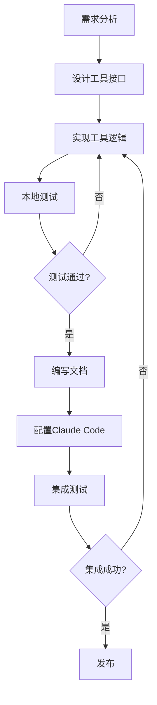

# MCP Server开发实战

## 1. 引言：为什么要开发MCP Server

Model Context Protocol (MCP) 是 Claude 与外部工具交互的标准协议。虽然 Claude Code 已经内置了许多常用的 MCP Server（如文件系统、Git、数据库等），但在实际工作中，我们经常会遇到需要自定义工具的场景：

**典型场景**：
- 集成企业内部系统（如内部 API、部署平台、监控系统）
- 特定领域的工具封装（如特定数据格式处理、专业计算工具）
- 简化复杂操作流程（如将多步操作封装为单个工具）
- 增强现有工具能力（如添加缓存、权限控制、日志记录）

**开发 MCP Server 的优势**：
- **标准化接口**：遵循 MCP 协议，Claude 可以自动理解和使用
- **可复用性**：一次开发，在所有支持 MCP 的 AI 系统中使用
- **易于维护**：独立部署，不影响 Claude Code 核心功能
- **灵活扩展**：可以根据需求快速添加新功能

本文将通过 3 个完整的实战案例，带你从零开始开发 MCP Server，涵盖从需求分析、工具设计、代码实现到发布部署的完整流程。

## 2. MCP Server开发模板

### 2.1 项目结构

```
my-mcp-server/
├── package.json          # 项目配置
├── tsconfig.json         # TypeScript配置
├── src/
│   ├── index.ts         # 服务器主入口
│   ├── tools/           # 工具实现
│   │   ├── tool1.ts
│   │   └── tool2.ts
│   └── types.ts         # 类型定义
├── dist/                # 编译输出
└── README.md            # 文档
```

### 2.2 基础模板代码

**package.json**：
```json
{
  "name": "my-mcp-server",
  "version": "1.0.0",
  "description": "My custom MCP server",
  "main": "dist/index.js",
  "type": "module",
  "bin": {
    "my-mcp-server": "./dist/index.js"
  },
  "scripts": {
    "build": "tsc",
    "watch": "tsc --watch",
    "dev": "npm run build && node dist/index.js"
  },
  "dependencies": {
    "@modelcontextprotocol/sdk": "^0.5.0"
  },
  "devDependencies": {
    "@types/node": "^20.0.0",
    "typescript": "^5.3.0"
  }
}
```

**tsconfig.json**：
```json
{
  "compilerOptions": {
    "target": "ES2022",
    "module": "Node16",
    "moduleResolution": "Node16",
    "outDir": "./dist",
    "rootDir": "./src",
    "strict": true,
    "esModuleInterop": true,
    "skipLibCheck": true,
    "forceConsistentCasingInFileNames": true
  },
  "include": ["src/**/*"],
  "exclude": ["node_modules", "dist"]
}
```

**src/index.ts（基础模板）**：
```typescript
#!/usr/bin/env node
import { Server } from "@modelcontextprotocol/sdk/server/index.js";
import { StdioServerTransport } from "@modelcontextprotocol/sdk/server/stdio.js";
import {
  CallToolRequestSchema,
  ListToolsRequestSchema,
} from "@modelcontextprotocol/sdk/types.js";

// 创建服务器实例
const server = new Server(
  {
    name: "my-mcp-server",
    version: "1.0.0",
  },
  {
    capabilities: {
      tools: {},
    },
  }
);

// 列出所有可用工具
server.setRequestHandler(ListToolsRequestSchema, async () => {
  return {
    tools: [
      {
        name: "example_tool",
        description: "示例工具",
        inputSchema: {
          type: "object",
          properties: {
            param: {
              type: "string",
              description: "参数说明",
            },
          },
          required: ["param"],
        },
      },
    ],
  };
});

// 处理工具调用
server.setRequestHandler(CallToolRequestSchema, async (request) => {
  const { name, arguments: args } = request.params;

  switch (name) {
    case "example_tool": {
      // 实现工具逻辑
      return {
        content: [
          {
            type: "text",
            text: `处理结果: ${args.param}`,
          },
        ],
      };
    }
    default:
      throw new Error(`未知工具: ${name}`);
  }
});

// 启动服务器
async function main() {
  const transport = new StdioServerTransport();
  await server.connect(transport);
  console.error("MCP Server 已启动");
}

main().catch((error) => {
  console.error("服务器启动失败:", error);
  process.exit(1);
});
```

### 2.3 开发流程



## 3. 实战案例1：Git操作Server

### 3.1 需求分析

Git 是开发中最常用的版本控制工具，但 Claude Code 内置的 Git 工具较为基础。我们开发一个增强版的 Git MCP Server，提供更丰富的功能：

**核心功能**：
- 查看仓库状态（包含详细信息）
- 智能提交（自动检测变更类型）
- 分支管理（创建、切换、合并、删除）
- 提交历史分析（统计、搜索、可视化）
- 冲突检测和解决建议

**设计目标**：
- 提供比原生 Git 命令更友好的输出
- 自动处理常见错误场景
- 支持批量操作

### 3.2 工具设计

**工具列表**：

| 工具名称 | 功能 | 输入参数 | 输出 |
|---------|------|---------|------|
| git_status | 查看仓库状态 | repoPath | 状态详情（JSON） |
| git_smart_commit | 智能提交 | repoPath, message, files? | 提交结果 |
| git_branch_manage | 分支管理 | repoPath, action, branchName? | 操作结果 |
| git_log_analyze | 提交历史分析 | repoPath, limit?, author? | 分析报告 |
| git_conflict_detect | 冲突检测 | repoPath, targetBranch | 冲突报告 |

### 3.3 完整实现代码

**src/index.ts**：
```typescript
#!/usr/bin/env node
import { Server } from "@modelcontextprotocol/sdk/server/index.js";
import { StdioServerTransport } from "@modelcontextprotocol/sdk/server/stdio.js";
import {
  CallToolRequestSchema,
  ListToolsRequestSchema,
} from "@modelcontextprotocol/sdk/types.js";
import { execSync } from "child_process";
import * as fs from "fs";
import * as path from "path";

// 工具定义
const TOOLS = [
  {
    name: "git_status",
    description: "查看Git仓库状态，包含详细的文件变更信息",
    inputSchema: {
      type: "object",
      properties: {
        repoPath: {
          type: "string",
          description: "Git仓库路径",
        },
      },
      required: ["repoPath"],
    },
  },
  {
    name: "git_smart_commit",
    description: "智能提交代码，自动检测变更类型并生成合适的提交信息",
    inputSchema: {
      type: "object",
      properties: {
        repoPath: {
          type: "string",
          description: "Git仓库路径",
        },
        message: {
          type: "string",
          description: "提交信息",
        },
        files: {
          type: "array",
          items: { type: "string" },
          description: "要提交的文件列表（可选，不指定则提交所有变更）",
        },
      },
      required: ["repoPath", "message"],
    },
  },
  {
    name: "git_branch_manage",
    description: "Git分支管理，支持创建、切换、合并、删除分支",
    inputSchema: {
      type: "object",
      properties: {
        repoPath: {
          type: "string",
          description: "Git仓库路径",
        },
        action: {
          type: "string",
          enum: ["list", "create", "switch", "merge", "delete"],
          description: "操作类型",
        },
        branchName: {
          type: "string",
          description: "分支名称（list操作不需要）",
        },
      },
      required: ["repoPath", "action"],
    },
  },
  {
    name: "git_log_analyze",
    description: "分析Git提交历史，提供统计信息和趋势分析",
    inputSchema: {
      type: "object",
      properties: {
        repoPath: {
          type: "string",
          description: "Git仓库路径",
        },
        limit: {
          type: "number",
          description: "分析的提交数量（默认100）",
        },
        author: {
          type: "string",
          description: "筛选特定作者",
        },
      },
      required: ["repoPath"],
    },
  },
  {
    name: "git_conflict_detect",
    description: "检测与目标分支的潜在冲突",
    inputSchema: {
      type: "object",
      properties: {
        repoPath: {
          type: "string",
          description: "Git仓库路径",
        },
        targetBranch: {
          type: "string",
          description: "目标分支名称",
        },
      },
      required: ["repoPath", "targetBranch"],
    },
  },
];

// 工具实现
class GitTools {
  private execGit(command: string, repoPath: string): string {
    try {
      return execSync(command, {
        cwd: repoPath,
        encoding: "utf-8",
        stdio: ["pipe", "pipe", "pipe"],
      });
    } catch (error: any) {
      throw new Error(`Git命令执行失败: ${error.message}`);
    }
  }

  async gitStatus(repoPath: string) {
    // 检查是否是Git仓库
    if (!fs.existsSync(path.join(repoPath, ".git"))) {
      throw new Error("不是有效的Git仓库");
    }

    // 获取基本状态
    const status = this.execGit("git status --porcelain -b", repoPath);
    const lines = status.split("\n").filter((l) => l.trim());

    // 解析分支信息
    const branchLine = lines[0];
    const branchMatch = branchLine.match(/## (.+?)(?:\.\.\.(.+?))?(?:\s+\[(.+?)\])?$/);
    const currentBranch = branchMatch?.[1] || "unknown";
    const remoteBranch = branchMatch?.[2];
    const tracking = branchMatch?.[3];

    // 解析文件状态
    const files = lines.slice(1).map((line) => {
      const status = line.substring(0, 2);
      const filePath = line.substring(3);
      return {
        status: this.parseFileStatus(status),
        path: filePath,
      };
    });

    // 统计信息
    const stats = {
      modified: files.filter((f) => f.status.includes("修改")).length,
      added: files.filter((f) => f.status.includes("新增")).length,
      deleted: files.filter((f) => f.status.includes("删除")).length,
      renamed: files.filter((f) => f.status.includes("重命名")).length,
      untracked: files.filter((f) => f.status.includes("未跟踪")).length,
    };

    return {
      branch: {
        current: currentBranch,
        remote: remoteBranch,
        tracking: tracking,
      },
      files: files,
      stats: stats,
      clean: files.length === 0,
    };
  }

  private parseFileStatus(status: string): string {
    const map: { [key: string]: string } = {
      "M ": "已暂存（修改）",
      " M": "未暂存（修改）",
      MM: "部分暂存（修改）",
      "A ": "已暂存（新增）",
      " A": "未暂存（新增）",
      "D ": "已暂存（删除）",
      " D": "未暂存（删除）",
      "R ": "已暂存（重命名）",
      "C ": "已暂存（复制）",
      "??": "未跟踪",
    };
    return map[status] || status;
  }

  async gitSmartCommit(repoPath: string, message: string, files?: string[]) {
    // 添加文件
    if (files && files.length > 0) {
      for (const file of files) {
        this.execGit(`git add "${file}"`, repoPath);
      }
    } else {
      this.execGit("git add -A", repoPath);
    }

    // 检查是否有变更
    const diff = this.execGit("git diff --cached --stat", repoPath);
    if (!diff.trim()) {
      return {
        success: false,
        message: "没有需要提交的变更",
      };
    }

    // 分析变更类型
    const changeType = this.analyzeChangeType(diff);

    // 提交
    const fullMessage = `${changeType}: ${message}`;
    this.execGit(`git commit -m "${fullMessage}"`, repoPath);

    // 获取提交信息
    const commitHash = this.execGit("git rev-parse HEAD", repoPath).trim();
    const commitInfo = this.execGit(`git show --stat ${commitHash}`, repoPath);

    return {
      success: true,
      hash: commitHash,
      message: fullMessage,
      stats: commitInfo,
    };
  }

  private analyzeChangeType(diff: string): string {
    const lines = diff.split("\n");
    const hasNewFiles = lines.some((l) => l.includes("create mode"));
    const hasDeletedFiles = lines.some((l) => l.includes("delete mode"));
    const hasRenamedFiles = lines.some((l) => l.includes("rename"));

    if (hasNewFiles) return "feat";
    if (hasDeletedFiles) return "remove";
    if (hasRenamedFiles) return "refactor";
    return "update";
  }

  async gitBranchManage(
    repoPath: string,
    action: string,
    branchName?: string
  ) {
    switch (action) {
      case "list": {
        const branches = this.execGit("git branch -a", repoPath);
        const branchList = branches
          .split("\n")
          .map((b) => b.trim())
          .filter((b) => b)
          .map((b) => ({
            name: b.replace(/^\*\s+/, ""),
            current: b.startsWith("*"),
          }));
        return { branches: branchList };
      }

      case "create": {
        if (!branchName) throw new Error("需要提供分支名称");
        this.execGit(`git branch "${branchName}"`, repoPath);
        return { success: true, message: `分支 ${branchName} 创建成功` };
      }

      case "switch": {
        if (!branchName) throw new Error("需要提供分支名称");
        this.execGit(`git checkout "${branchName}"`, repoPath);
        return { success: true, message: `已切换到分支 ${branchName}` };
      }

      case "merge": {
        if (!branchName) throw new Error("需要提供分支名称");
        const result = this.execGit(`git merge "${branchName}"`, repoPath);
        return { success: true, message: result };
      }

      case "delete": {
        if (!branchName) throw new Error("需要提供分支名称");
        this.execGit(`git branch -d "${branchName}"`, repoPath);
        return { success: true, message: `分支 ${branchName} 删除成功` };
      }

      default:
        throw new Error(`未知操作: ${action}`);
    }
  }

  async gitLogAnalyze(repoPath: string, limit = 100, author?: string) {
    // 构建命令
    let cmd = `git log --pretty=format:"%H|%an|%ae|%ad|%s" --date=iso -${limit}`;
    if (author) {
      cmd += ` --author="${author}"`;
    }

    const log = this.execGit(cmd, repoPath);
    const commits = log
      .split("\n")
      .filter((l) => l.trim())
      .map((line) => {
        const [hash, author, email, date, message] = line.split("|");
        return { hash, author, email, date, message };
      });

    // 统计分析
    const authorStats = new Map<string, number>();
    const typeStats = new Map<string, number>();
    const dailyStats = new Map<string, number>();

    commits.forEach((commit) => {
      // 作者统计
      const count = authorStats.get(commit.author) || 0;
      authorStats.set(commit.author, count + 1);

      // 类型统计
      const type = commit.message.split(":")[0];
      const typeCount = typeStats.get(type) || 0;
      typeStats.set(type, typeCount + 1);

      // 日期统计
      const day = commit.date.split(" ")[0];
      const dayCount = dailyStats.get(day) || 0;
      dailyStats.set(day, dayCount + 1);
    });

    return {
      totalCommits: commits.length,
      commits: commits.slice(0, 10), // 只返回最近10条
      authorStats: Object.fromEntries(authorStats),
      typeStats: Object.fromEntries(typeStats),
      dailyStats: Object.fromEntries(dailyStats),
    };
  }

  async gitConflictDetect(repoPath: string, targetBranch: string) {
    // 获取当前分支
    const currentBranch = this.execGit(
      "git rev-parse --abbrev-ref HEAD",
      repoPath
    ).trim();

    // 模拟合并（不实际合并）
    try {
      const result = this.execGit(
        `git merge-tree $(git merge-base ${currentBranch} ${targetBranch}) ${currentBranch} ${targetBranch}`,
        repoPath
      );

      // 解析冲突
      const hasConflicts = result.includes("<<<<<<<");
      const conflictFiles: string[] = [];

      if (hasConflicts) {
        const lines = result.split("\n");
        for (let i = 0; i < lines.length; i++) {
          if (lines[i].startsWith("+++") || lines[i].startsWith("---")) {
            const file = lines[i].substring(6);
            if (file !== "/dev/null" && !conflictFiles.includes(file)) {
              conflictFiles.push(file);
            }
          }
        }
      }

      return {
        hasConflicts,
        conflictFiles,
        currentBranch,
        targetBranch,
        suggestion: hasConflicts
          ? "建议先解决冲突文件，或使用 git merge --no-ff 进行合并"
          : "可以安全合并",
      };
    } catch (error: any) {
      return {
        hasConflicts: true,
        error: error.message,
        suggestion: "请确保两个分支都存在",
      };
    }
  }
}

// 创建服务器
const server = new Server(
  {
    name: "git-enhanced-server",
    version: "1.0.0",
  },
  {
    capabilities: {
      tools: {},
    },
  }
);

const gitTools = new GitTools();

// 列出工具
server.setRequestHandler(ListToolsRequestSchema, async () => {
  return { tools: TOOLS };
});

// 处理工具调用
server.setRequestHandler(CallToolRequestSchema, async (request) => {
  const { name, arguments: args } = request.params;

  try {
    let result: any;

    switch (name) {
      case "git_status":
        result = await gitTools.gitStatus(args.repoPath);
        break;
      case "git_smart_commit":
        result = await gitTools.gitSmartCommit(
          args.repoPath,
          args.message,
          args.files
        );
        break;
      case "git_branch_manage":
        result = await gitTools.gitBranchManage(
          args.repoPath,
          args.action,
          args.branchName
        );
        break;
      case "git_log_analyze":
        result = await gitTools.gitLogAnalyze(
          args.repoPath,
          args.limit,
          args.author
        );
        break;
      case "git_conflict_detect":
        result = await gitTools.gitConflictDetect(
          args.repoPath,
          args.targetBranch
        );
        break;
      default:
        throw new Error(`未知工具: ${name}`);
    }

    return {
      content: [
        {
          type: "text",
          text: JSON.stringify(result, null, 2),
        },
      ],
    };
  } catch (error: any) {
    return {
      content: [
        {
          type: "text",
          text: `错误: ${error.message}`,
        },
      ],
      isError: true,
    };
  }
});

// 启动服务器
async function main() {
  const transport = new StdioServerTransport();
  await server.connect(transport);
  console.error("Git Enhanced MCP Server 已启动");
}

main().catch((error) => {
  console.error("服务器启动失败:", error);
  process.exit(1);
});
```

### 3.4 测试和使用

**1. 构建项目**：
```bash
npm install
npm run build
```

**2. 配置 Claude Code**：

编辑 `~/.config/claude-code/mcp.json`：
```json
{
  "mcpServers": {
    "git-enhanced": {
      "command": "node",
      "args": ["/path/to/git-enhanced-server/dist/index.js"]
    }
  }
}
```

**3. 使用示例**：

在 Claude Code 中：
```
查看当前仓库的详细状态
> 使用 git_status 工具

智能提交代码
> 使用 git_smart_commit 工具提交代码，消息为"添加用户登录功能"

分析最近100次提交
> 使用 git_log_analyze 工具分析提交历史

检测与main分支的冲突
> 使用 git_conflict_detect 工具检测冲突
```

## 4. 实战案例2：Docker管理Server

### 4.1 需求分析

Docker 是现代应用部署的标准工具，但命令行操作较为复杂。我们开发一个 Docker MCP Server，简化容器和镜像的管理：

**核心功能**：
- 容器管理（列表、启动、停止、删除、日志）
- 镜像管理（列表、拉取、删除、构建）
- 网络管理（列表、创建、删除）
- 资源监控（CPU、内存、网络）
- 快速部署（常用服务一键部署）

### 4.2 工具设计

**工具列表**：

| 工具名称 | 功能 | 输入参数 | 输出 |
|---------|------|---------|------|
| docker_container_list | 列出容器 | all? | 容器列表 |
| docker_container_control | 容器控制 | action, containerIds | 操作结果 |
| docker_container_logs | 查看日志 | containerId, lines? | 日志内容 |
| docker_image_list | 列出镜像 | - | 镜像列表 |
| docker_image_manage | 镜像管理 | action, imageNameOrId | 操作结果 |
| docker_network_manage | 网络管理 | action, networkName? | 操作结果 |
| docker_quick_deploy | 快速部署 | service, config? | 部署结果 |
| docker_stats | 资源监控 | containerIds? | 监控数据 |

### 4.3 完整实现代码

**src/index.ts**：
```typescript
#!/usr/bin/env node
import { Server } from "@modelcontextprotocol/sdk/server/index.js";
import { StdioServerTransport } from "@modelcontextprotocol/sdk/server/stdio.js";
import {
  CallToolRequestSchema,
  ListToolsRequestSchema,
} from "@modelcontextprotocol/sdk/types.js";
import { execSync } from "child_process";

// 工具定义
const TOOLS = [
  {
    name: "docker_container_list",
    description: "列出Docker容器",
    inputSchema: {
      type: "object",
      properties: {
        all: {
          type: "boolean",
          description: "是否显示所有容器（包括已停止的）",
        },
      },
    },
  },
  {
    name: "docker_container_control",
    description: "控制Docker容器（启动/停止/重启/删除）",
    inputSchema: {
      type: "object",
      properties: {
        action: {
          type: "string",
          enum: ["start", "stop", "restart", "remove"],
          description: "操作类型",
        },
        containerIds: {
          type: "array",
          items: { type: "string" },
          description: "容器ID或名称列表",
        },
      },
      required: ["action", "containerIds"],
    },
  },
  {
    name: "docker_container_logs",
    description: "查看容器日志",
    inputSchema: {
      type: "object",
      properties: {
        containerId: {
          type: "string",
          description: "容器ID或名称",
        },
        lines: {
          type: "number",
          description: "显示的行数（默认100）",
        },
      },
      required: ["containerId"],
    },
  },
  {
    name: "docker_image_list",
    description: "列出Docker镜像",
    inputSchema: {
      type: "object",
      properties: {},
    },
  },
  {
    name: "docker_image_manage",
    description: "管理Docker镜像（拉取/删除）",
    inputSchema: {
      type: "object",
      properties: {
        action: {
          type: "string",
          enum: ["pull", "remove"],
          description: "操作类型",
        },
        imageNameOrId: {
          type: "string",
          description: "镜像名称或ID",
        },
      },
      required: ["action", "imageNameOrId"],
    },
  },
  {
    name: "docker_network_manage",
    description: "管理Docker网络",
    inputSchema: {
      type: "object",
      properties: {
        action: {
          type: "string",
          enum: ["list", "create", "remove"],
          description: "操作类型",
        },
        networkName: {
          type: "string",
          description: "网络名称（list操作不需要）",
        },
      },
      required: ["action"],
    },
  },
  {
    name: "docker_quick_deploy",
    description: "快速部署常用服务（MySQL/Redis/Nginx等）",
    inputSchema: {
      type: "object",
      properties: {
        service: {
          type: "string",
          enum: ["mysql", "redis", "nginx", "postgres", "mongo"],
          description: "服务类型",
        },
        config: {
          type: "object",
          description: "服务配置（如端口、密码等）",
        },
      },
      required: ["service"],
    },
  },
  {
    name: "docker_stats",
    description: "查看容器资源使用情况",
    inputSchema: {
      type: "object",
      properties: {
        containerIds: {
          type: "array",
          items: { type: "string" },
          description: "容器ID列表（可选，不指定则显示所有）",
        },
      },
    },
  },
];

// Docker工具实现
class DockerTools {
  private execDocker(command: string): string {
    try {
      return execSync(`docker ${command}`, {
        encoding: "utf-8",
        stdio: ["pipe", "pipe", "pipe"],
      });
    } catch (error: any) {
      throw new Error(`Docker命令执行失败: ${error.message}`);
    }
  }

  async containerList(all = false) {
    const flag = all ? "-a" : "";
    const output = this.execDocker(
      `ps ${flag} --format "{{.ID}}|{{.Names}}|{{.Image}}|{{.Status}}|{{.Ports}}"`
    );

    const containers = output
      .split("\n")
      .filter((l) => l.trim())
      .map((line) => {
        const [id, name, image, status, ports] = line.split("|");
        return { id, name, image, status, ports };
      });

    return { total: containers.length, containers };
  }

  async containerControl(action: string, containerIds: string[]) {
    const results = [];

    for (const id of containerIds) {
      try {
        this.execDocker(`${action} ${id}`);
        results.push({ id, success: true, message: `${action} 成功` });
      } catch (error: any) {
        results.push({ id, success: false, message: error.message });
      }
    }

    return { results };
  }

  async containerLogs(containerId: string, lines = 100) {
    const logs = this.execDocker(`logs --tail ${lines} ${containerId}`);
    return { containerId, lines: logs.split("\n").length, logs };
  }

  async imageList() {
    const output = this.execDocker(
      'images --format "{{.ID}}|{{.Repository}}|{{.Tag}}|{{.Size}}|{{.CreatedAt}}"'
    );

    const images = output
      .split("\n")
      .filter((l) => l.trim())
      .map((line) => {
        const [id, repository, tag, size, created] = line.split("|");
        return { id, repository, tag, size, created };
      });

    return { total: images.length, images };
  }

  async imageManage(action: string, imageNameOrId: string) {
    try {
      if (action === "pull") {
        const output = this.execDocker(`pull ${imageNameOrId}`);
        return { success: true, message: output };
      } else if (action === "remove") {
        this.execDocker(`rmi ${imageNameOrId}`);
        return { success: true, message: `镜像 ${imageNameOrId} 删除成功` };
      }
    } catch (error: any) {
      return { success: false, message: error.message };
    }
  }

  async networkManage(action: string, networkName?: string) {
    switch (action) {
      case "list": {
        const output = this.execDocker(
          'network ls --format "{{.ID}}|{{.Name}}|{{.Driver}}|{{.Scope}}"'
        );
        const networks = output
          .split("\n")
          .filter((l) => l.trim())
          .map((line) => {
            const [id, name, driver, scope] = line.split("|");
            return { id, name, driver, scope };
          });
        return { networks };
      }

      case "create": {
        if (!networkName) throw new Error("需要提供网络名称");
        this.execDocker(`network create ${networkName}`);
        return { success: true, message: `网络 ${networkName} 创建成功` };
      }

      case "remove": {
        if (!networkName) throw new Error("需要提供网络名称");
        this.execDocker(`network rm ${networkName}`);
        return { success: true, message: `网络 ${networkName} 删除成功` };
      }

      default:
        throw new Error(`未知操作: ${action}`);
    }
  }

  async quickDeploy(service: string, config: any = {}) {
    const deployConfigs: {
      [key: string]: { image: string; env: string[]; ports: string[] };
    } = {
      mysql: {
        image: "mysql:8.0",
        env: [
          `MYSQL_ROOT_PASSWORD=${config.password || "root123"}`,
          `MYSQL_DATABASE=${config.database || "mydb"}`,
        ],
        ports: [`${config.port || 3306}:3306`],
      },
      redis: {
        image: "redis:7-alpine",
        env: [],
        ports: [`${config.port || 6379}:6379`],
      },
      nginx: {
        image: "nginx:alpine",
        env: [],
        ports: [`${config.port || 80}:80`],
      },
      postgres: {
        image: "postgres:15-alpine",
        env: [
          `POSTGRES_PASSWORD=${config.password || "postgres"}`,
          `POSTGRES_DB=${config.database || "mydb"}`,
        ],
        ports: [`${config.port || 5432}:5432`],
      },
      mongo: {
        image: "mongo:7",
        env: [
          `MONGO_INITDB_ROOT_USERNAME=${config.username || "root"}`,
          `MONGO_INITDB_ROOT_PASSWORD=${config.password || "root123"}`,
        ],
        ports: [`${config.port || 27017}:27017`],
      },
    };

    const deployConfig = deployConfigs[service];
    if (!deployConfig) {
      throw new Error(`不支持的服务: ${service}`);
    }

    const containerName = config.name || `${service}-${Date.now()}`;
    const envFlags = deployConfig.env.map((e) => `-e ${e}`).join(" ");
    const portFlags = deployConfig.ports.map((p) => `-p ${p}`).join(" ");

    try {
      const output = this.execDocker(
        `run -d --name ${containerName} ${envFlags} ${portFlags} ${deployConfig.image}`
      );

      return {
        success: true,
        containerId: output.trim(),
        containerName,
        service,
        ports: deployConfig.ports,
        message: `${service} 部署成功`,
      };
    } catch (error: any) {
      return { success: false, message: error.message };
    }
  }

  async stats(containerIds?: string[]) {
    const target = containerIds ? containerIds.join(" ") : "--all";
    const output = this.execDocker(
      `stats --no-stream --format "{{.Container}}|{{.Name}}|{{.CPUPerc}}|{{.MemUsage}}|{{.NetIO}}" ${target}`
    );

    const stats = output
      .split("\n")
      .filter((l) => l.trim())
      .map((line) => {
        const [id, name, cpu, memory, network] = line.split("|");
        return { id, name, cpu, memory, network };
      });

    return { stats };
  }
}

// 创建服务器
const server = new Server(
  {
    name: "docker-manager-server",
    version: "1.0.0",
  },
  {
    capabilities: {
      tools: {},
    },
  }
);

const dockerTools = new DockerTools();

// 列出工具
server.setRequestHandler(ListToolsRequestSchema, async () => {
  return { tools: TOOLS };
});

// 处理工具调用
server.setRequestHandler(CallToolRequestSchema, async (request) => {
  const { name, arguments: args } = request.params;

  try {
    let result: any;

    switch (name) {
      case "docker_container_list":
        result = await dockerTools.containerList(args.all);
        break;
      case "docker_container_control":
        result = await dockerTools.containerControl(
          args.action,
          args.containerIds
        );
        break;
      case "docker_container_logs":
        result = await dockerTools.containerLogs(args.containerId, args.lines);
        break;
      case "docker_image_list":
        result = await dockerTools.imageList();
        break;
      case "docker_image_manage":
        result = await dockerTools.imageManage(args.action, args.imageNameOrId);
        break;
      case "docker_network_manage":
        result = await dockerTools.networkManage(args.action, args.networkName);
        break;
      case "docker_quick_deploy":
        result = await dockerTools.quickDeploy(args.service, args.config);
        break;
      case "docker_stats":
        result = await dockerTools.stats(args.containerIds);
        break;
      default:
        throw new Error(`未知工具: ${name}`);
    }

    return {
      content: [
        {
          type: "text",
          text: JSON.stringify(result, null, 2),
        },
      ],
    };
  } catch (error: any) {
    return {
      content: [
        {
          type: "text",
          text: `错误: ${error.message}`,
        },
      ],
      isError: true,
    };
  }
});

// 启动服务器
async function main() {
  const transport = new StdioServerTransport();
  await server.connect(transport);
  console.error("Docker Manager MCP Server 已启动");
}

main().catch((error) => {
  console.error("服务器启动失败:", error);
  process.exit(1);
});
```

### 4.4 测试和使用

**使用示例**：

```
列出所有容器
> 使用 docker_container_list 工具，参数 all=true

快速部署MySQL
> 使用 docker_quick_deploy 工具，service=mysql，config={port: 3307, password: "mypass"}

查看容器资源使用情况
> 使用 docker_stats 工具

停止多个容器
> 使用 docker_container_control 工具，action=stop，containerIds=["container1", "container2"]
```

## 5. 实战案例3：数据分析Server

### 5.1 需求分析

数据分析是开发中的常见任务，我们开发一个数据分析 MCP Server，提供便捷的数据处理能力：

**核心功能**：
- CSV/JSON文件读取和解析
- 基础统计分析（均值、中位数、标准差等）
- 数据筛选和转换
- 简单可视化（生成图表）
- 数据质量检查

### 5.2 工具设计

**工具列表**：

| 工具名称 | 功能 | 输入参数 | 输出 |
|---------|------|---------|------|
| data_read | 读取数据文件 | filePath, format? | 数据内容 |
| data_stats | 统计分析 | data, columns? | 统计结果 |
| data_filter | 数据筛选 | data, conditions | 筛选结果 |
| data_transform | 数据转换 | data, transformations | 转换结果 |
| data_quality | 数据质量检查 | data | 质量报告 |

### 5.3 实现代码

**src/index.ts**：
```typescript
#!/usr/bin/env node
import { Server } from "@modelcontextprotocol/sdk/server/index.js";
import { StdioServerTransport } from "@modelcontextprotocol/sdk/server/stdio.js";
import {
  CallToolRequestSchema,
  ListToolsRequestSchema,
} from "@modelcontextprotocol/sdk/types.js";
import * as fs from "fs";
import * as path from "path";

// 工具定义
const TOOLS = [
  {
    name: "data_read",
    description: "读取CSV或JSON数据文件",
    inputSchema: {
      type: "object",
      properties: {
        filePath: {
          type: "string",
          description: "文件路径",
        },
        format: {
          type: "string",
          enum: ["csv", "json", "auto"],
          description: "文件格式（auto自动检测）",
        },
      },
      required: ["filePath"],
    },
  },
  {
    name: "data_stats",
    description: "计算数据的统计信息",
    inputSchema: {
      type: "object",
      properties: {
        data: {
          type: "array",
          description: "数据数组",
        },
        columns: {
          type: "array",
          items: { type: "string" },
          description: "要分析的列名（可选）",
        },
      },
      required: ["data"],
    },
  },
  {
    name: "data_filter",
    description: "根据条件筛选数据",
    inputSchema: {
      type: "object",
      properties: {
        data: {
          type: "array",
          description: "数据数组",
        },
        conditions: {
          type: "array",
          items: {
            type: "object",
            properties: {
              column: { type: "string" },
              operator: {
                type: "string",
                enum: ["=", "!=", ">", "<", ">=", "<=", "contains"],
              },
              value: {},
            },
          },
          description: "筛选条件",
        },
      },
      required: ["data", "conditions"],
    },
  },
  {
    name: "data_transform",
    description: "数据转换（添加列、计算、重命名等）",
    inputSchema: {
      type: "object",
      properties: {
        data: {
          type: "array",
          description: "数据数组",
        },
        transformations: {
          type: "array",
          items: {
            type: "object",
            properties: {
              type: {
                type: "string",
                enum: ["addColumn", "removeColumn", "renameColumn", "compute"],
              },
              config: { type: "object" },
            },
          },
          description: "转换操作",
        },
      },
      required: ["data", "transformations"],
    },
  },
  {
    name: "data_quality",
    description: "数据质量检查（缺失值、异常值、重复值）",
    inputSchema: {
      type: "object",
      properties: {
        data: {
          type: "array",
          description: "数据数组",
        },
      },
      required: ["data"],
    },
  },
];

// 数据分析工具实现
class DataAnalysisTools {
  async dataRead(filePath: string, format = "auto") {
    if (!fs.existsSync(filePath)) {
      throw new Error("文件不存在");
    }

    const content = fs.readFileSync(filePath, "utf-8");
    const ext = path.extname(filePath).toLowerCase();

    // 自动检测格式
    if (format === "auto") {
      format = ext === ".json" ? "json" : "csv";
    }

    let data: any[];

    if (format === "json") {
      data = JSON.parse(content);
    } else {
      // 解析CSV
      data = this.parseCSV(content);
    }

    return {
      filePath,
      format,
      rows: data.length,
      columns: data.length > 0 ? Object.keys(data[0]) : [],
      preview: data.slice(0, 5),
    };
  }

  private parseCSV(content: string): any[] {
    const lines = content.split("\n").filter((l) => l.trim());
    if (lines.length === 0) return [];

    const headers = lines[0].split(",").map((h) => h.trim());
    const data = [];

    for (let i = 1; i < lines.length; i++) {
      const values = lines[i].split(",").map((v) => v.trim());
      const row: any = {};

      headers.forEach((header, index) => {
        const value = values[index];
        // 尝试转换为数字
        row[header] = isNaN(Number(value)) ? value : Number(value);
      });

      data.push(row);
    }

    return data;
  }

  async dataStats(data: any[], columns?: string[]) {
    if (data.length === 0) {
      return { error: "数据为空" };
    }

    const allColumns = columns || Object.keys(data[0]);
    const stats: any = {};

    for (const col of allColumns) {
      const values = data.map((row) => row[col]).filter((v) => v != null);

      // 检查是否是数值列
      const numericValues = values
        .map((v) => Number(v))
        .filter((v) => !isNaN(v));

      if (numericValues.length > 0) {
        // 数值统计
        stats[col] = {
          type: "numeric",
          count: values.length,
          missing: data.length - values.length,
          mean: this.mean(numericValues),
          median: this.median(numericValues),
          std: this.std(numericValues),
          min: Math.min(...numericValues),
          max: Math.max(...numericValues),
          q1: this.percentile(numericValues, 25),
          q3: this.percentile(numericValues, 75),
        };
      } else {
        // 分类统计
        const freq = this.frequency(values);
        stats[col] = {
          type: "categorical",
          count: values.length,
          missing: data.length - values.length,
          unique: Object.keys(freq).length,
          topValues: Object.entries(freq)
            .sort((a: any, b: any) => b[1] - a[1])
            .slice(0, 5)
            .map(([value, count]) => ({ value, count })),
        };
      }
    }

    return {
      totalRows: data.length,
      totalColumns: allColumns.length,
      stats,
    };
  }

  private mean(values: number[]): number {
    return values.reduce((a, b) => a + b, 0) / values.length;
  }

  private median(values: number[]): number {
    const sorted = [...values].sort((a, b) => a - b);
    const mid = Math.floor(sorted.length / 2);
    return sorted.length % 2 === 0
      ? (sorted[mid - 1] + sorted[mid]) / 2
      : sorted[mid];
  }

  private std(values: number[]): number {
    const avg = this.mean(values);
    const squareDiffs = values.map((value) => Math.pow(value - avg, 2));
    return Math.sqrt(this.mean(squareDiffs));
  }

  private percentile(values: number[], p: number): number {
    const sorted = [...values].sort((a, b) => a - b);
    const index = (p / 100) * (sorted.length - 1);
    const lower = Math.floor(index);
    const upper = Math.ceil(index);
    const weight = index - lower;

    return sorted[lower] * (1 - weight) + sorted[upper] * weight;
  }

  private frequency(values: any[]): { [key: string]: number } {
    const freq: { [key: string]: number } = {};
    values.forEach((v) => {
      const key = String(v);
      freq[key] = (freq[key] || 0) + 1;
    });
    return freq;
  }

  async dataFilter(data: any[], conditions: any[]) {
    let filtered = [...data];

    for (const condition of conditions) {
      const { column, operator, value } = condition;

      filtered = filtered.filter((row) => {
        const cellValue = row[column];

        switch (operator) {
          case "=":
            return cellValue == value;
          case "!=":
            return cellValue != value;
          case ">":
            return cellValue > value;
          case "<":
            return cellValue < value;
          case ">=":
            return cellValue >= value;
          case "<=":
            return cellValue <= value;
          case "contains":
            return String(cellValue).includes(String(value));
          default:
            return true;
        }
      });
    }

    return {
      originalRows: data.length,
      filteredRows: filtered.length,
      data: filtered,
    };
  }

  async dataTransform(data: any[], transformations: any[]) {
    let transformed = JSON.parse(JSON.stringify(data)); // 深拷贝

    for (const transform of transformations) {
      const { type, config } = transform;

      switch (type) {
        case "addColumn":
          transformed = transformed.map((row: any) => ({
            ...row,
            [config.name]: config.value,
          }));
          break;

        case "removeColumn":
          transformed = transformed.map((row: any) => {
            const newRow = { ...row };
            delete newRow[config.name];
            return newRow;
          });
          break;

        case "renameColumn":
          transformed = transformed.map((row: any) => {
            const newRow = { ...row };
            newRow[config.newName] = newRow[config.oldName];
            delete newRow[config.oldName];
            return newRow;
          });
          break;

        case "compute":
          transformed = transformed.map((row: any) => {
            // 简单的计算支持
            const result = this.evaluateExpression(config.expression, row);
            return {
              ...row,
              [config.targetColumn]: result,
            };
          });
          break;
      }
    }

    return {
      originalRows: data.length,
      transformedRows: transformed.length,
      data: transformed,
    };
  }

  private evaluateExpression(expression: string, row: any): any {
    // 简单的表达式计算（实际应用中建议使用更安全的方式）
    try {
      const func = new Function(
        ...Object.keys(row),
        `return ${expression}`
      );
      return func(...Object.values(row));
    } catch (error) {
      return null;
    }
  }

  async dataQuality(data: any[]) {
    if (data.length === 0) {
      return { error: "数据为空" };
    }

    const columns = Object.keys(data[0]);
    const quality: any = {};

    for (const col of columns) {
      const values = data.map((row) => row[col]);

      // 缺失值
      const missing = values.filter((v) => v == null).length;
      const missingRate = (missing / data.length) * 100;

      // 唯一值
      const uniqueValues = new Set(values.filter((v) => v != null));
      const duplicateRate =
        ((data.length - uniqueValues.size) / data.length) * 100;

      // 数值列的异常值检测（使用IQR方法）
      let outliers = 0;
      const numericValues = values
        .map((v) => Number(v))
        .filter((v) => !isNaN(v));

      if (numericValues.length > 0) {
        const q1 = this.percentile(numericValues, 25);
        const q3 = this.percentile(numericValues, 75);
        const iqr = q3 - q1;
        const lowerBound = q1 - 1.5 * iqr;
        const upperBound = q3 + 1.5 * iqr;

        outliers = numericValues.filter(
          (v) => v < lowerBound || v > upperBound
        ).length;
      }

      quality[col] = {
        missing: missing,
        missingRate: missingRate.toFixed(2) + "%",
        unique: uniqueValues.size,
        duplicateRate: duplicateRate.toFixed(2) + "%",
        outliers: outliers,
        qualityScore: this.calculateQualityScore(
          missingRate,
          duplicateRate,
          outliers
        ),
      };
    }

    return {
      totalRows: data.length,
      totalColumns: columns.length,
      quality,
    };
  }

  private calculateQualityScore(
    missingRate: number,
    duplicateRate: number,
    outliers: number
  ): string {
    let score = 100;
    score -= missingRate;
    score -= duplicateRate * 0.5;
    score -= outliers * 0.1;

    if (score >= 90) return "优秀";
    if (score >= 70) return "良好";
    if (score >= 50) return "一般";
    return "较差";
  }
}

// 创建服务器
const server = new Server(
  {
    name: "data-analysis-server",
    version: "1.0.0",
  },
  {
    capabilities: {
      tools: {},
    },
  }
);

const dataTools = new DataAnalysisTools();

// 列出工具
server.setRequestHandler(ListToolsRequestSchema, async () => {
  return { tools: TOOLS };
});

// 处理工具调用
server.setRequestHandler(CallToolRequestSchema, async (request) => {
  const { name, arguments: args } = request.params;

  try {
    let result: any;

    switch (name) {
      case "data_read":
        result = await dataTools.dataRead(args.filePath, args.format);
        break;
      case "data_stats":
        result = await dataTools.dataStats(args.data, args.columns);
        break;
      case "data_filter":
        result = await dataTools.dataFilter(args.data, args.conditions);
        break;
      case "data_transform":
        result = await dataTools.dataTransform(args.data, args.transformations);
        break;
      case "data_quality":
        result = await dataTools.dataQuality(args.data);
        break;
      default:
        throw new Error(`未知工具: ${name}`);
    }

    return {
      content: [
        {
          type: "text",
          text: JSON.stringify(result, null, 2),
        },
      ],
    };
  } catch (error: any) {
    return {
      content: [
        {
          type: "text",
          text: `错误: ${error.message}`,
        },
      ],
      isError: true,
    };
  }
});

// 启动服务器
async function main() {
  const transport = new StdioServerTransport();
  await server.connect(transport);
  console.error("Data Analysis MCP Server 已启动");
}

main().catch((error) => {
  console.error("服务器启动失败:", error);
  process.exit(1);
});
```

### 5.4 使用示例

```
读取CSV文件
> 使用 data_read 工具，filePath="/path/to/data.csv"

统计分析
> 使用 data_stats 工具，传入之前读取的数据

筛选数据（年龄大于30）
> 使用 data_filter 工具，conditions=[{column: "age", operator: ">", value: 30}]

数据质量检查
> 使用 data_quality 工具
```

## 6. 发布和分享

### 6.1 npm发布流程

**1. 准备发布**：

确保 `package.json` 配置正确：
```json
{
  "name": "@yourname/your-mcp-server",
  "version": "1.0.0",
  "description": "Your MCP server description",
  "main": "dist/index.js",
  "bin": {
    "your-mcp-server": "./dist/index.js"
  },
  "keywords": ["mcp", "claude", "server"],
  "author": "Your Name",
  "license": "MIT",
  "repository": {
    "type": "git",
    "url": "https://github.com/yourname/your-mcp-server.git"
  }
}
```

**2. 构建和测试**：
```bash
npm run build
npm link  # 本地测试
```

**3. 发布到npm**：
```bash
npm login
npm publish --access public
```

### 6.2 GitHub发布

**1. 创建仓库README**：

```markdown
# Your MCP Server

## 简介
简要描述你的MCP Server功能

## 安装
npm install -g @yourname/your-mcp-server

## 配置
在 `~/.config/claude-code/mcp.json` 中添加：
{
  "mcpServers": {
    "your-server": {
      "command": "npx",
      "args": ["@yourname/your-mcp-server"]
    }
  }
}

## 功能
- 功能1
- 功能2
- 功能3

## 使用示例
提供详细的使用示例

## 许可证
MIT
```

**2. 创建GitHub Release**：
```bash
git tag v1.0.0
git push origin v1.0.0
```

### 6.3 配置文件编写

**完整的 mcp.json 配置示例**：

```json
{
  "mcpServers": {
    "git-enhanced": {
      "command": "npx",
      "args": ["@yourname/git-enhanced-server"],
      "env": {
        "LOG_LEVEL": "info"
      }
    },
    "docker-manager": {
      "command": "npx",
      "args": ["@yourname/docker-manager-server"]
    },
    "data-analysis": {
      "command": "npx",
      "args": ["@yourname/data-analysis-server"]
    }
  }
}
```

**高级配置选项**：

```json
{
  "mcpServers": {
    "your-server": {
      "command": "node",
      "args": ["/absolute/path/to/dist/index.js"],
      "env": {
        "NODE_ENV": "production",
        "LOG_LEVEL": "debug",
        "CUSTOM_CONFIG": "/path/to/config.json"
      },
      "disabled": false,
      "alwaysAllow": ["tool1", "tool2"]
    }
  }
}
```

## 7. 最佳实践

### 7.1 错误处理

```java
// 错误处理包装器
public class ErrorHandler {
    public static <T> T wrap(Supplier<T> fn, String context) {
        try {
            return fn.get();
        } catch (Exception error) {
            System.err.println("[" + context + "] " + error.getMessage());
            throw new RuntimeException(context + " failed: " + error.getMessage());
        }
    }
}

// 使用示例
result = ErrorHandler.wrap(
    () -> dockerClient.startContainer(containerId),
    "Start Container"
);
```

### 7.2 日志记录

```java
public class Logger {
    private String logFile;

    public Logger(String logFile) {
        this.logFile = logFile;
    }

    public void log(String level, String message, Object data) {
        String timestamp = LocalDateTime.now().toString();
        Map<String, Object> logEntry = Map.of(
            "timestamp", timestamp,
            "level", level,
            "message", message,
            "data", data != null ? data : ""
        );

        // 写入文件
        try (FileWriter fw = new FileWriter(logFile, true)) {
            fw.write(new Gson().toJson(logEntry) + "\n");
        } catch (IOException e) {
            e.printStackTrace();
        }

        // 同时输出到stderr
        System.err.println("[" + level.toUpperCase() + "] " + message);
    }
}
```

### 7.3 输入验证

```java
public void validateInput(Map<String, Object> args) {
    if (!args.containsKey("requiredParam")) {
        throw new IllegalArgumentException("缺少必需参数: requiredParam");
    }

    int number = (int) args.get("number");
    if (number < 0 || number > 100) {
        throw new IllegalArgumentException("参数范围错误: number 必须在 0-100 之间");
    }
}
```

### 7.4 性能优化

```java
public class Cache<T> {
    private Map<String, CacheEntry<T>> cache = new HashMap<>();

    private static class CacheEntry<T> {
        T value;
        long expiry;

        CacheEntry(T value, long expiry) {
            this.value = value;
            this.expiry = expiry;
        }
    }

    public void set(String key, T value, long ttl) {
        cache.put(key, new CacheEntry<>(value, System.currentTimeMillis() + ttl));
    }

    public T get(String key) {
        CacheEntry<T> entry = cache.get(key);
        if (entry == null) return null;

        if (System.currentTimeMillis() > entry.expiry) {
            cache.remove(key);
            return null;
        }

        return entry.value;
    }

    public void clear() {
        cache.clear();
    }
}
```

### 7.5 安全性

```java
public class SecurityManager {
    private List<String> allowedPaths;

    public SecurityManager(List<String> allowedPaths) {
        this.allowedPaths = allowedPaths;
    }

    public boolean validatePath(String path) {
        try {
            String resolved = new File(path).getCanonicalPath();
            return allowedPaths.stream()
                .anyMatch(allowed -> resolved.startsWith(allowed));
        } catch (IOException e) {
            return false;
        }
    }

    public boolean validateInput(Object input, Object schema) {
        // 使用JSON Schema验证
        // 这里需要引入相应的验证库
        return true;
    }
}
```

## 8. FAQ

**Q1: MCP Server 无法启动怎么办？**

A: 检查以下几点：
- Node.js 版本是否符合要求（>=18）
- 依赖是否正确安装 (`npm install`)
- TypeScript 是否正确编译 (`npm run build`)
- mcp.json 配置路径是否正确

**Q2: 如何调试 MCP Server？**

A: 使用以下方法：
- 在代码中添加 `console.error()` 输出调试信息
- 使用 `npm run dev` 直接运行服务器
- 查看 Claude Code 的日志输出
- 使用 VSCode 的调试功能

**Q3: MCP Server 和普通工具有什么区别？**

A: MCP Server 的优势：
- 标准化协议，AI 可以自动理解和使用
- 独立进程，不影响主程序稳定性
- 可复用，可以在多个 AI 系统中使用
- 易于分发和版本管理

**Q4: 如何处理长时间运行的任务？**

A: 建议：
- 实现任务队列和状态查询
- 返回任务ID，通过另一个工具查询进度
- 使用流式输出（如果MCP支持）
- 设置合理的超时时间

**Q5: 如何更新已发布的 MCP Server？**

A: 更新流程：
1. 修改代码
2. 更新版本号（`package.json`）
3. 提交并打tag
4. 重新构建 (`npm run build`)
5. 发布到npm (`npm publish`)
6. 用户更新 (`npm update -g`)

## 9. 总结

本文通过3个完整的实战案例（Git操作、Docker管理、数据分析），详细介绍了 MCP Server 的开发流程：

**核心要点**：
1. **需求分析**：明确工具的使用场景和功能边界
2. **接口设计**：设计清晰、易用的工具接口
3. **代码实现**：遵循最佳实践，注重错误处理和性能
4. **测试验证**：本地测试确保功能正常
5. **发布分享**：通过npm和GitHub分享给社区

**开发建议**：
- 从简单工具开始，逐步增加复杂度
- 参考官方示例和其他开源项目
- 重视文档和示例，方便用户使用
- 积极收集反馈，持续优化改进

通过开发自定义 MCP Server，你可以极大地扩展 Claude Code 的能力，将其与你的工作流程深度集成，提升开发效率。无论是企业内部系统集成，还是特定领域的工具封装，MCP Server 都是理想的解决方案。

现在就开始开发你的第一个 MCP Server 吧！
