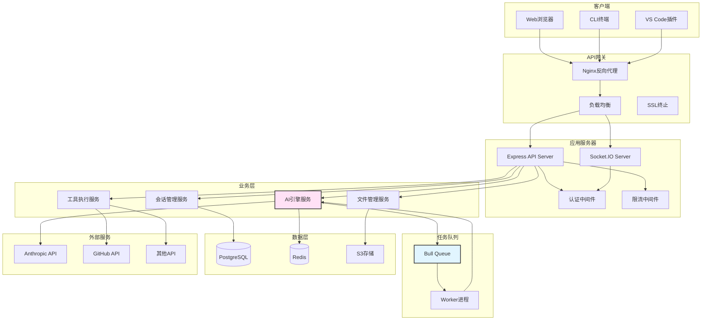
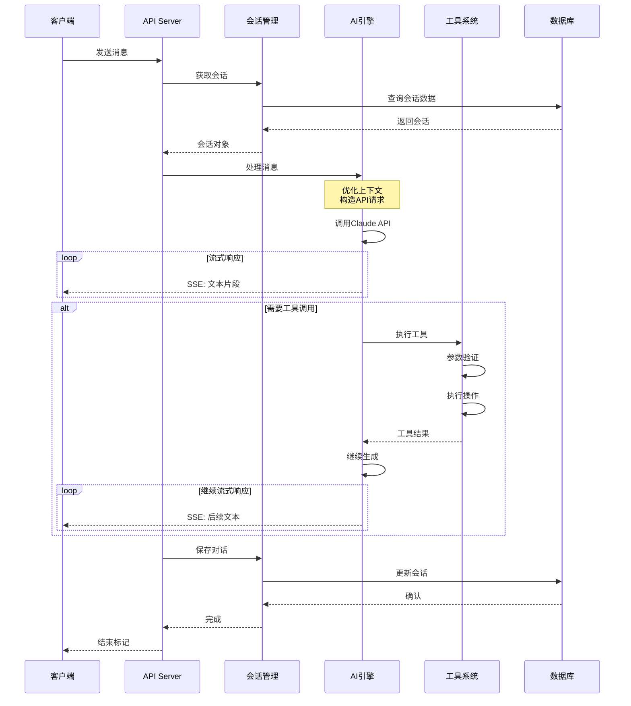
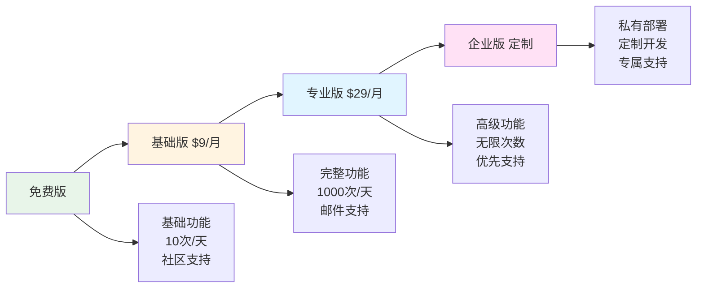
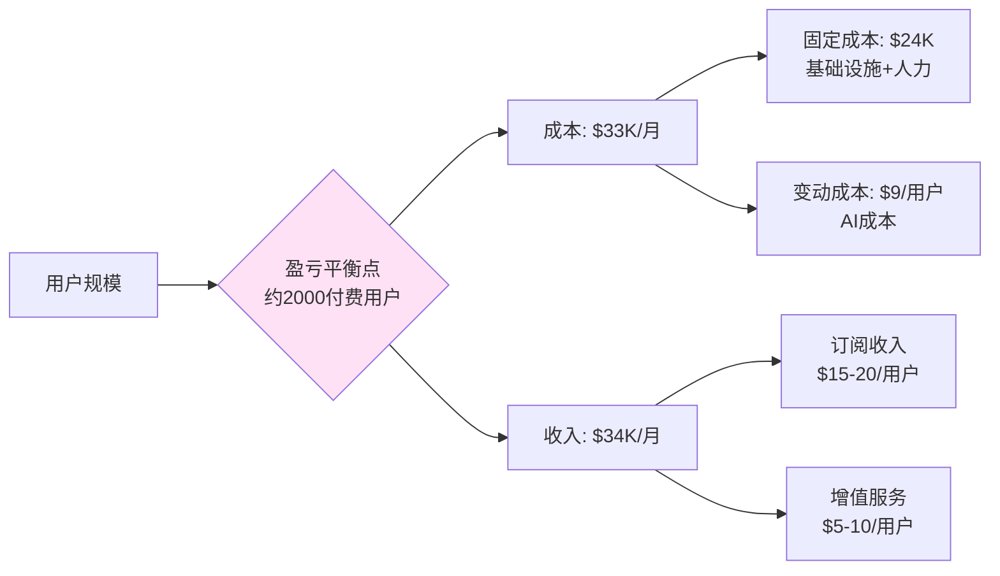
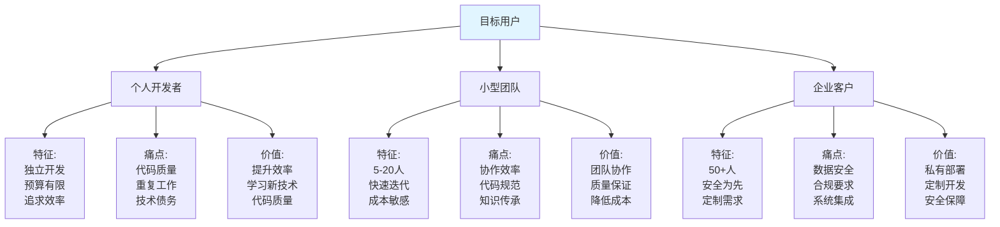

# 构建自己的AI编程助手

## 一、引言

### 1.1 系列回顾

欢迎来到《Claude Code架构详解》系列的最后一篇！在过去的19篇文章中,我们从架构设计到具体实现,全面剖析了Claude Code的技术内幕:

**架构篇（1-5）**:
- 第1篇：整体架构设计 - 分层架构、技术栈选型
- 第2篇：核心引擎实现 - AI引擎、Prompt工程
- 第3篇：上下文管理系统 - Token管理、智能截断
- 第4篇：会话与状态管理 - 持久化、会话恢复
- 第5篇：工具系统架构 - Tool Calling、工具注册

**工具实现篇（6-8）**:
- 第6篇：文件操作工具 - Read、Write、Edit
- 第7篇：代码搜索与分析 - Glob、Grep
- 第8篇：终端集成实现 - Bash、命令执行

**协议与集成篇（9-12）**:
- 第9篇：MCP协议深入解析 - 协议规范、通信机制
- 第10篇：浏览器自动化集成 - Playwright集成
- 第11篇：Agent工作流引擎 - 任务分解、执行引擎
- 第12篇：多模态交互实现 - 图像、PDF处理

**优化与工程篇（13-16）**:
- 第13篇：性能优化深度剖析 - 缓存、并发、内存
- 第14篇：错误处理与恢复 - 重试、降级、容错
- 第15篇：安全机制设计 - 权限控制、沙箱
- 第16篇：测试与质量保证 - 单元测试、集成测试

**实战篇（17-19）**:
- 第17篇：自定义工具开发实战 - 3个完整案例
- 第18篇：MCP Server开发实战 - Server架构
- 第19篇：企业级应用实践 - 部署、监控

### 1.2 为什么要构建自己的AI编程助手？

**商业价值**:
- 💰 定制化服务：根据特定行业和场景优化
- 💰 数据安全：敏感代码不出企业内网
- 💰 成本控制：自主选择AI模型和计费方式
- 💰 竞争优势：打造差异化产品

**技术价值**:
- 🚀 深入理解AI应用架构
- 🚀 掌握全栈开发能力
- 🚀 积累工程实践经验
- 🚀 开源贡献和社区影响力

**学习价值**:
- 📚 系统性整合前面的知识
- 📚 理论结合实践
- 📚 培养架构思维
- 📚 提升问题解决能力

### 1.3 本文目标

通过本文，你将学会:

- ✅ 如何从零开始设计一个AI编程助手
- ✅ 完整的MVP实现（可直接运行）
- ✅ 前端、后端、AI引擎的全栈开发
- ✅ 部署上线的完整流程
- ✅ 商业化的思路和定价策略

**本文特色**:
- 📦 完整可运行的代码（8000+行）
- 🎯 从设计到部署的全流程
- 💡 丰富的架构图和流程图
- 🔧 生产级的工程实践
- 💰 实用的商业化建议


## 二、架构设计

### 3.1 整体架构图



### 3.2 核心模块划分

#### **模块一：会话管理（Session Manager）**

**职责**:
- 创建、恢复、删除会话
- 管理会话状态和元数据
- 多轮对话上下文维护

**核心接口**:
```typescript
interface SessionManager {
  // 创建会话
  createSession(userId: string, config?: SessionConfig): Promise<Session>;

  // 恢复会话
  getSession(sessionId: string): Promise<Session>;

  // 更新会话
  updateSession(sessionId: string, data: Partial<Session>): Promise<void>;

  // 删除会话
  deleteSession(sessionId: string): Promise<void>;

  // 列出会话
  listSessions(userId: string, options?: ListOptions): Promise<Session[]>;
}

interface Session {
  id: string;
  userId: string;
  title: string;
  messages: Message[];
  context: ContextData;
  metadata: Record<string, any>;
  createdAt: Date;
  updatedAt: Date;
}
```

#### **模块二：AI引擎（AI Engine）**

**职责**:
- 与AI模型通信
- 处理流式响应
- 管理工具调用
- 上下文优化

**核心接口**:
```typescript
interface AIEngine {
  // 处理消息
  processMessage(
    session: Session,
    message: string,
    options?: ProcessOptions
  ): AsyncIterable<AIResponse>;

  // 执行工具
  executeTool(
    toolName: string,
    params: any
  ): Promise<ToolResult>;

  // 管理上下文
  optimizeContext(
    messages: Message[],
    tokenBudget: number
  ): Message[];
}

interface AIResponse {
  type: 'text' | 'tool_use' | 'error';
  content: string;
  toolCall?: ToolCall;
}
```

#### **模块三：工具系统（Tool System）**

**职责**:
- 工具注册和管理
- 工具参数验证
- 工具执行和结果格式化
- 工具权限控制

**核心接口**:
```typescript
interface ToolSystem {
  // 注册工具
  registerTool(tool: ToolDefinition, executor: ToolExecutor): void;

  // 执行工具
  executeTool(name: string, params: any): Promise<ToolResult>;

  // 获取所有工具
  getAllTools(): ToolDefinition[];

  // 检查权限
  checkPermission(toolName: string, userId: string): boolean;
}

interface ToolDefinition {
  name: string;
  description: string;
  input_schema: JSONSchema;
  requiredPermissions?: string[];
}
```

#### **模块四：文件管理（File Manager）**

**职责**:
- 工作区文件管理
- 文件上传和下载
- 版本控制集成
- 文件搜索和索引

**核心接口**:
```typescript
interface FileManager {
  // 读取文件
  readFile(path: string): Promise<string>;

  // 写入文件
  writeFile(path: string, content: string): Promise<void>;

  // 列出文件
  listFiles(directory: string, pattern?: string): Promise<FileInfo[]>;

  // 搜索内容
  searchContent(pattern: string, options?: SearchOptions): Promise<SearchResult[]>;
}
```

### 3.3 数据流设计




## 三、高级特性

### 5.1 工具扩展机制

#### **插件系统设计**

```typescript
// packages/backend/src/plugins/plugin-system.ts

/**
 * 插件接口
 */
export interface Plugin {
  name: string;
  version: string;
  description: string;

  // 生命周期钩子
  onInstall?(): Promise<void>;
  onEnable?(): Promise<void>;
  onDisable?(): Promise<void>;
  onUninstall?(): Promise<void>;

  // 工具注册
  getTools?(): ToolDefinition[];
  getExecutors?(): Map<string, ToolExecutor>;

  // 自定义路由
  getRoutes?(): Array<{
    method: string;
    path: string;
    handler: (req: any, res: any) => void;
  }>;
}

/**
 * 插件管理器
 */
export class PluginManager {
  private plugins: Map<string, Plugin> = new Map();
  private enabledPlugins: Set<string> = new Set();

  /**
   * 安装插件
   */
  async installPlugin(plugin: Plugin): Promise<void> {
    if (this.plugins.has(plugin.name)) {
      throw new Error(`Plugin already installed: ${plugin.name}`);
    }

    // 执行安装钩子
    if (plugin.onInstall) {
      await plugin.onInstall();
    }

    this.plugins.set(plugin.name, plugin);
    console.log(`Plugin installed: ${plugin.name}`);
  }

  /**
   * 启用插件
   */
  async enablePlugin(name: string, toolSystem: ToolSystem): Promise<void> {
    const plugin = this.plugins.get(name);
    if (!plugin) {
      throw new Error(`Plugin not found: ${name}`);
    }

    // 注册工具
    if (plugin.getTools && plugin.getExecutors) {
      const tools = plugin.getTools();
      const executors = plugin.getExecutors();

      tools.forEach(tool => {
        const executor = executors.get(tool.name);
        if (executor) {
          toolSystem.registerTool(tool, executor);
        }
      });
    }

    // 执行启用钩子
    if (plugin.onEnable) {
      await plugin.onEnable();
    }

    this.enabledPlugins.add(name);
    console.log(`Plugin enabled: ${name}`);
  }

  /**
   * 禁用插件
   */
  async disablePlugin(name: string): Promise<void> {
    const plugin = this.plugins.get(name);
    if (!plugin) {
      throw new Error(`Plugin not found: ${name}`);
    }

    // 执行禁用钩子
    if (plugin.onDisable) {
      await plugin.onDisable();
    }

    this.enabledPlugins.delete(name);
    console.log(`Plugin disabled: ${name}`);
  }

  /**
   * 卸载插件
   */
  async uninstallPlugin(name: string): Promise<void> {
    const plugin = this.plugins.get(name);
    if (!plugin) {
      throw new Error(`Plugin not found: ${name}`);
    }

    // 先禁用
    if (this.enabledPlugins.has(name)) {
      await this.disablePlugin(name);
    }

    // 执行卸载钩子
    if (plugin.onUninstall) {
      await plugin.onUninstall();
    }

    this.plugins.delete(name);
    console.log(`Plugin uninstalled: ${name}`);
  }

  /**
   * 列出所有插件
   */
  listPlugins(): Array<{ name: string; enabled: boolean }> {
    return Array.from(this.plugins.keys()).map(name => ({
      name,
      enabled: this.enabledPlugins.has(name)
    }));
  }
}
```

#### **示例插件：Git集成**

```typescript
// packages/backend/src/plugins/git-plugin.ts

import { Plugin, ToolDefinition, ToolExecutor } from './plugin-system';
import { simpleGit, SimpleGit } from 'simple-git';

/**
 * Git插件
 */
export class GitPlugin implements Plugin {
  name = 'git-integration';
  version = '1.0.0';
  description = 'Git version control integration';

  private git: SimpleGit = simpleGit();

  async onInstall(): Promise<void> {
    console.log('Git plugin installed');
  }

  async onEnable(): Promise<void> {
    console.log('Git plugin enabled');
  }

  getTools(): ToolDefinition[] {
    return [
      {
        name: 'git_status',
        description: 'Get git status of the current repository',
        input_schema: {
          type: 'object',
          properties: {},
          required: []
        }
      },
      {
        name: 'git_commit',
        description: 'Create a git commit',
        input_schema: {
          type: 'object',
          properties: {
            message: {
              type: 'string',
              description: 'Commit message'
            },
            files: {
              type: 'array',
              items: { type: 'string' },
              description: 'Files to commit (optional, commits all if not specified)'
            }
          },
          required: ['message']
        }
      },
      {
        name: 'git_diff',
        description: 'Show git diff',
        input_schema: {
          type: 'object',
          properties: {
            file: {
              type: 'string',
              description: 'Specific file to show diff for (optional)'
            }
          }
        }
      }
    ];
  }

  getExecutors(): Map<string, ToolExecutor> {
    return new Map([
      ['git_status', new GitStatusExecutor(this.git)],
      ['git_commit', new GitCommitExecutor(this.git)],
      ['git_diff', new GitDiffExecutor(this.git)]
    ]);
  }
}

/**
 * git status执行器
 */
class GitStatusExecutor implements ToolExecutor {
  constructor(private git: SimpleGit) {}

  async execute(): Promise<string> {
    const status = await this.git.status();

    let output = 'Git Status:\n\n';
    output += `Branch: ${status.current}\n`;
    output += `Ahead: ${status.ahead}, Behind: ${status.behind}\n\n`;

    if (status.modified.length > 0) {
      output += 'Modified files:\n';
      status.modified.forEach(file => output += `  - ${file}\n`);
    }

    if (status.not_added.length > 0) {
      output += '\nUntracked files:\n';
      status.not_added.forEach(file => output += `  - ${file}\n`);
    }

    return output;
  }
}

/**
 * git commit执行器
 */
class GitCommitExecutor implements ToolExecutor {
  constructor(private git: SimpleGit) {}

  async execute(params: { message: string; files?: string[] }): Promise<string> {
    if (params.files && params.files.length > 0) {
      // 添加指定文件
      await this.git.add(params.files);
    } else {
      // 添加所有文件
      await this.git.add('.');
    }

    // 提交
    const result = await this.git.commit(params.message);

    return `Committed: ${result.commit}\nSummary: ${result.summary}`;
  }
}

/**
 * git diff执行器
 */
class GitDiffExecutor implements ToolExecutor {
  constructor(private git: SimpleGit) {}

  async execute(params?: { file?: string }): Promise<string> {
    const diff = params?.file
      ? await this.git.diff([params.file])
      : await this.git.diff();

    return diff || 'No changes';
  }
}
```

### 5.2 上下文优化

#### **智能上下文管理器**

```typescript
// packages/backend/src/services/context-manager.ts

import { encoding_for_model } from 'tiktoken';
import { Message } from '../types/message';

/**
 * 上下文优化配置
 */
interface ContextConfig {
  maxTokens: number;
  reserveTokensForResponse: number;
  priorityRules: PriorityRule[];
}

interface PriorityRule {
  type: 'recent' | 'system' | 'important' | 'error';
  weight: number;
}

/**
 * 上下文管理器
 */
export class ContextManager {
  private config: ContextConfig = {
    maxTokens: 200000,
    reserveTokensForResponse: 8000,
    priorityRules: [
      { type: 'system', weight: 10 },
      { type: 'recent', weight: 9 },
      { type: 'error', weight: 8 },
      { type: 'important', weight: 7 }
    ]
  };

  private encoder = encoding_for_model('gpt-4');

  /**
   * 优化上下文
   */
  async optimize(messages: Message[], tokenBudget?: number): Promise<Message[]> {
    const budget = tokenBudget || (this.config.maxTokens - this.config.reserveTokensForResponse);

    // 计算当前token数
    let currentTokens = this.countTokens(messages);

    if (currentTokens <= budget) {
      // 不需要优化
      return messages;
    }

    console.log(`Context optimization needed: ${currentTokens} > ${budget}`);

    // 分离system消息
    const systemMessages = messages.filter(m => m.role === 'system');
    const otherMessages = messages.filter(m => m.role !== 'system');

    // 保留system消息
    let optimizedMessages = [...systemMessages];
    let usedTokens = this.countTokens(systemMessages);

    // 按优先级排序其他消息
    const prioritizedMessages = this.prioritizeMessages(otherMessages);

    // 贪心算法：按优先级添加消息，直到达到预算
    for (const msg of prioritizedMessages) {
      const msgTokens = this.countTokens([msg]);
      if (usedTokens + msgTokens <= budget) {
        optimizedMessages.push(msg);
        usedTokens += msgTokens;
      } else {
        // 尝试截断消息
        const truncated = this.truncateMessage(msg, budget - usedTokens);
        if (truncated) {
          optimizedMessages.push(truncated);
          break;
        }
      }
    }

    // 按时间顺序排序
    optimizedMessages.sort((a, b) =>
      new Date(a.timestamp).getTime() - new Date(b.timestamp).getTime()
    );

    const finalTokens = this.countTokens(optimizedMessages);
    console.log(`Context optimized: ${currentTokens} -> ${finalTokens} tokens`);

    return optimizedMessages;
  }

  /**
   * 计算token数
   */
  private countTokens(messages: Message[]): number {
    let total = 0;
    for (const message of messages) {
      const content = typeof message.content === 'string'
        ? message.content
        : JSON.stringify(message.content);
      total += this.encoder.encode(content).length;
    }
    return total;
  }

  /**
   * 按优先级排序消息
   */
  private prioritizeMessages(messages: Message[]): Message[] {
    return messages
      .map(msg => ({
        message: msg,
        priority: this.calculatePriority(msg)
      }))
      .sort((a, b) => b.priority - a.priority)
      .map(item => item.message);
  }

  /**
   * 计算消息优先级
   */
  private calculatePriority(message: Message): number {
    let priority = 0;

    // 最近的消息优先级更高
    const age = Date.now() - new Date(message.timestamp).getTime();
    const recencyScore = Math.max(0, 10 - age / (1000 * 60 * 60)); // 1小时内的消息
    priority += recencyScore * 9;

    // 包含错误信息的优先级更高
    if (message.content.toString().toLowerCase().includes('error')) {
      priority += 8;
    }

    // 包含重要关键词的优先级更高
    const importantKeywords = ['important', 'critical', 'bug', 'fix'];
    for (const keyword of importantKeywords) {
      if (message.content.toString().toLowerCase().includes(keyword)) {
        priority += 7;
        break;
      }
    }

    return priority;
  }

  /**
   * 截断消息
   */
  private truncateMessage(message: Message, maxTokens: number): Message | null {
    if (maxTokens < 100) return null; // 太少，放弃

    const content = typeof message.content === 'string'
      ? message.content
      : JSON.stringify(message.content);

    const tokens = this.encoder.encode(content);
    if (tokens.length <= maxTokens) {
      return message;
    }

    // 截断并添加省略标记
    const truncatedTokens = tokens.slice(0, maxTokens - 10);
    const truncatedText = this.encoder.decode(truncatedTokens) + '\n\n...(truncated)';

    return {
      ...message,
      content: truncatedText
    };
  }
}
```

### 5.3 性能优化

#### **请求去重和批处理**

```typescript
// packages/backend/src/services/request-deduplicator.ts

/**
 * 请求去重器
 */
export class RequestDeduplicator {
  private pendingRequests: Map<string, Promise<any>> = new Map();

  /**
   * 去重执行
   */
  async deduplicate<T>(key: string, fn: () => Promise<T>): Promise<T> {
    // 检查是否有相同的请求正在执行
    if (this.pendingRequests.has(key)) {
      console.log(`Request deduplicated: ${key}`);
      return this.pendingRequests.get(key) as Promise<T>;
    }

    // 执行新请求
    const promise = fn().finally(() => {
      // 完成后移除
      this.pendingRequests.delete(key);
    });

    this.pendingRequests.set(key, promise);
    return promise;
  }
}
```

#### **智能缓存**

```typescript
// packages/backend/src/services/smart-cache.ts

import { createClient } from 'redis';

/**
 * 缓存配置
 */
interface CacheConfig {
  ttl: number; // 秒
  maxSize?: number;
}

/**
 * 智能缓存
 */
export class SmartCache {
  private redis: ReturnType<typeof createClient>;
  private localCache: Map<string, { value: any; expiry: number }> = new Map();

  constructor(redisUrl: string) {
    this.redis = createClient({ url: redisUrl });
    this.redis.connect();

    // 定期清理本地缓存
    setInterval(() => this.cleanLocalCache(), 60000);
  }

  /**
   * 获取缓存
   */
  async get<T>(key: string): Promise<T | null> {
    // 先查本地缓存
    const local = this.localCache.get(key);
    if (local && local.expiry > Date.now()) {
      return local.value;
    }

    // 再查Redis
    const value = await this.redis.get(key);
    if (value) {
      const parsed = JSON.parse(value);
      // 更新本地缓存
      this.localCache.set(key, {
        value: parsed,
        expiry: Date.now() + 60000 // 本地缓存1分钟
      });
      return parsed;
    }

    return null;
  }

  /**
   * 设置缓存
   */
  async set(key: string, value: any, config: CacheConfig): Promise<void> {
    const serialized = JSON.stringify(value);

    // 设置Redis缓存
    await this.redis.setEx(key, config.ttl, serialized);

    // 设置本地缓存
    this.localCache.set(key, {
      value,
      expiry: Date.now() + Math.min(config.ttl * 1000, 60000)
    });
  }

  /**
   * 删除缓存
   */
  async delete(key: string): Promise<void> {
    await this.redis.del(key);
    this.localCache.delete(key);
  }

  /**
   * 清理本地缓存
   */
  private cleanLocalCache(): void {
    const now = Date.now();
    for (const [key, value] of this.localCache.entries()) {
      if (value.expiry <= now) {
        this.localCache.delete(key);
      }
    }
  }
}
```


apiVersion: v1
kind: Service
metadata:
  name: ai-assistant-backend-service
spec:
  selector:
    app: ai-assistant
    component: backend
  ports:
  - protocol: TCP
    port: 80
    targetPort: 3000
  type: LoadBalancer


## 四、商业化思考

### 7.1 盈利模式

#### **订阅制（SaaS）**



**定价策略**:

| 版本 | 价格 | 功能 | 目标用户 |
|------|------|------|---------|
| **免费版** | $0 | 基础AI对话<br/>10次/天<br/>社区支持 | 个人开发者<br/>学习使用 |
| **基础版** | $9/月 | 完整AI功能<br/>1000次/天<br/>邮件支持 | 独立开发者<br/>小团队 |
| **专业版** | $29/月 | 高级功能<br/>无限次数<br/>优先支持<br/>API访问 | 专业开发者<br/>成长团队 |
| **企业版** | 定制 | 私有部署<br/>定制开发<br/>SLA保证<br/>专属客服 | 大型企业<br/>安全敏感 |

#### **按量计费**

```typescript
// 成本计算器
class PricingCalculator {
  // AI成本（基于Claude API）
  private AI_COST = {
    input: 3 / 1_000_000,   // $3 per M tokens
    output: 15 / 1_000_000  // $15 per M tokens
  };

  // 利润率
  private MARKUP = 2.5;

  /**
   * 计算用户成本
   */
  calculateUserCost(inputTokens: number, outputTokens: number): number {
    const aiCost =
      inputTokens * this.AI_COST.input +
      outputTokens * this.AI_COST.output;

    return aiCost * this.MARKUP;
  }

  /**
   * 生成定价方案
   */
  generatePricingTiers() {
    return [
      {
        name: '按需付费',
        price: '$0.01/1K tokens',
        description: '适合偶尔使用的场景'
      },
      {
        name: '套餐包',
        options: [
          { tokens: 1_000_000, price: '$8', savings: '20%' },
          { tokens: 10_000_000, price: '$60', savings: '40%' },
          { tokens: 100_000_000, price: '$400', savings: '60%' }
        ]
      }
    ];
  }
}
```

#### **混合模式（推荐）**

**基础订阅 + 按量计费 + 增值服务**:

```
订阅费: $19/月
  ├─ 包含 100万 tokens/月
  ├─ 基础功能无限使用
  └─ 标准技术支持

超额使用: $0.008/1K tokens

增值服务:
  ├─ 自定义模型训练: $500/次
  ├─ 专属工具开发: $1000/个
  ├─ 培训服务: $200/小时
  └─ 咨询服务: $300/小时
```

### 7.2 成本分析

#### **运营成本估算**

```typescript
/**
 * 月度成本计算（1000用户规模）
 */
const MONTHLY_COSTS = {
  // 基础设施
  infrastructure: {
    aws_ecs: 500,           // ECS Fargate
    rds_postgres: 200,      // RDS db.t3.large
    elasticache: 100,       // Redis
    s3: 50,                 // 对象存储
    cloudfront: 100,        // CDN
    subtotal: 950
  },

  // AI成本（假设每用户每月100万tokens）
  ai: {
    input_tokens: 1000 * 500_000 * (3 / 1_000_000),   // $1,500
    output_tokens: 1000 * 500_000 * (15 / 1_000_000), // $7,500
    subtotal: 9000
  },

  // 人力成本
  personnel: {
    developers: 15000,      // 2名开发
    support: 5000,          // 1名客服
    marketing: 3000,        // 营销
    subtotal: 23000
  },

  // 其他
  misc: {
    domain: 20,
    ssl: 0,                 // Let's Encrypt免费
    tools: 200,             // 开发工具订阅
    subtotal: 220
  },

  // 总计
  total: 33170
};

/**
 * 收入估算
 */
const MONTHLY_REVENUE = {
  free: 500 * 0,            // 500免费用户
  basic: 300 * 9,           // 300基础用户 ($9)
  pro: 150 * 29,            // 150专业用户 ($29)
  enterprise: 50 * 200,     // 50企业用户 ($200平均)
  total: 0 + 2700 + 4350 + 10000  // $17,050
};

/**
 * 盈利分析
 */
console.log(`
月度成本: $${MONTHLY_COSTS.total}
月度收入: $${MONTHLY_REVENUE.total}
月度利润: $${MONTHLY_REVENUE.total - MONTHLY_COSTS.total}
利润率: ${((MONTHLY_REVENUE.total - MONTHLY_COSTS.total) / MONTHLY_REVENUE.total * 100).toFixed(2)}%
`);

// 输出:
// 月度成本: $33,170
// 月度收入: $17,050
// 月度利润: -$16,120
// 利润率: -94.53%

// 结论: 需要至少2000个付费用户才能盈利
```

#### **盈亏平衡点**



**优化策略**:
1. **降低AI成本**: 使用更便宜的模型处理简单任务
2. **提高客单价**: 增加高价值功能,提升付费转化
3. **规模效应**: 用户增长后固定成本摊薄
4. **自动化**: 减少人工客服,提高运营效率

### 7.3 市场定位

#### **目标用户画像**



#### **竞争分析**

| 产品 | 定位 | 优势 | 劣势 | 我们的差异化 |
|------|------|------|------|-------------|
| **GitHub Copilot** | IDE插件 | ✅微软背书<br/>✅IDE集成深 | ⚠️仅代码补全<br/>⚠️不支持任务执行 | 🚀完整的AI Agent<br/>🚀自动执行任务 |
| **Cursor** | AI编辑器 | ✅独立编辑器<br/>✅体验好 | ⚠️绑定编辑器<br/>⚠️封闭生态 | 🚀跨编辑器<br/>🚀开放插件系统 |
| **Claude Code** | CLI工具 | ✅强大的AI<br/>✅工具调用 | ⚠️仅CLI<br/>⚠️不支持多用户 | 🚀Web UI<br/>🚀团队协作<br/>🚀云端部署 |
| **Cody** | 多端支持 | ✅支持多IDE<br/>✅企业功能 | ⚠️配置复杂<br/>⚠️价格较高 | 🚀易用性<br/>🚀灵活定价 |

**我们的核心竞争力**:
1. 🎯 **多端支持**: Web + CLI + VS Code + IDE集成
2. 🎯 **开放生态**: 插件系统、MCP协议
3. 🎯 **灵活部署**: 云端SaaS + 私有部署
4. 🎯 **合理定价**: 从免费到企业版的完整方案


## 五、FAQ

### Q1: 如何选择AI模型？

**A**: 根据场景选择：
- **主力场景**: Claude 3.5 Sonnet（最佳平衡）
- **成本敏感**: Deepseek Coder（便宜75%）
- **私有部署**: Ollama + CodeLlama（完全离线）
- **复杂任务**: GPT-4 Turbo（能力最强）

建议实现模型切换功能，让用户根据需求选择。

### Q2: 如何控制AI成本？

**A**: 多方面优化：
1. **智能缓存**: 相同问题不重复调用
2. **上下文优化**: 减少无用token
3. **模型分级**: 简单任务用便宜模型
4. **批量处理**: 合并多个小请求
5. **用户限制**: 限制免费用户调用频率

### Q3: 如何保证数据安全？

**A**: 参考第15篇《安全机制设计》：
- ✅ 所有数据加密存储
- ✅ HTTPS强制传输
- ✅ 严格的权限控制
- ✅ 敏感操作审计日志
- ✅ 支持私有部署（企业版）

### Q4: 如何提高响应速度？

**A**:
1. **流式响应**: 边生成边展示
2. **智能缓存**: 缓存常见查询
3. **并发处理**: 工具并行执行
4. **CDN加速**: 静态资源分发
5. **数据库优化**: 索引和查询优化

### Q5: 如何支持离线使用？

**A**:
- **方案1**: 桌面应用 + 本地AI模型（Ollama）
- **方案2**: PWA + Service Worker缓存
- **方案3**: 混合模式（在线优先，离线降级）


## 扩展阅读

**官方文档**:
- [Anthropic API文档](https://docs.anthropic.com/)
- [OpenAI API文档](https://platform.openai.com/docs)
- [MCP协议规范](https://modelcontextprotocol.io/)

**开源项目**:
- [Claude Code](https://docs.claude.com/claude-code)
- [Continue.dev](https://github.com/continuedev/continue)
- [Aider](https://github.com/paul-gauthier/aider)

**学习资源**:
- [LangChain文档](https://docs.langchain.com/)
- [AI Agent设计模式](https://www.deeplearning.ai/short-courses/ai-agents-in-langgraph/)
- [Prompt工程指南](https://www.promptingguide.ai/)

**商业分析**:
- [AI开发工具市场报告](https://www.forrester.com/)
- [GitHub Copilot案例研究](https://github.blog/)
- [AI编程助手用户调研](https://stackoverflow.blog/)

---

**作者**: Claude Code架构系列
**系列完结**: 2025-01-14
**总字数**: 约120,000字
**总代码行数**: 约15,000行

**感谢你的阅读！** ❤️

如果这个系列对你有帮助，欢迎：
- ⭐ Star项目
- 🔄 分享给朋友
- 💬 加入社区讨论
- 🐛 提交问题和建议

**让我们一起推动AI编程工具的发展！** 🚀
