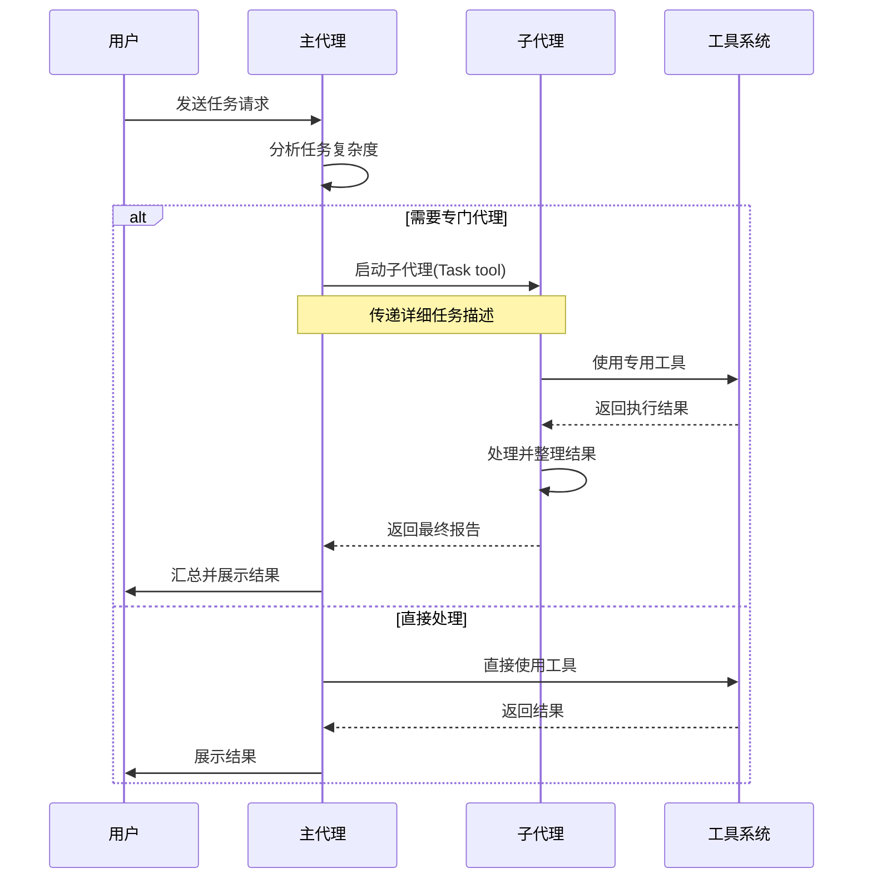
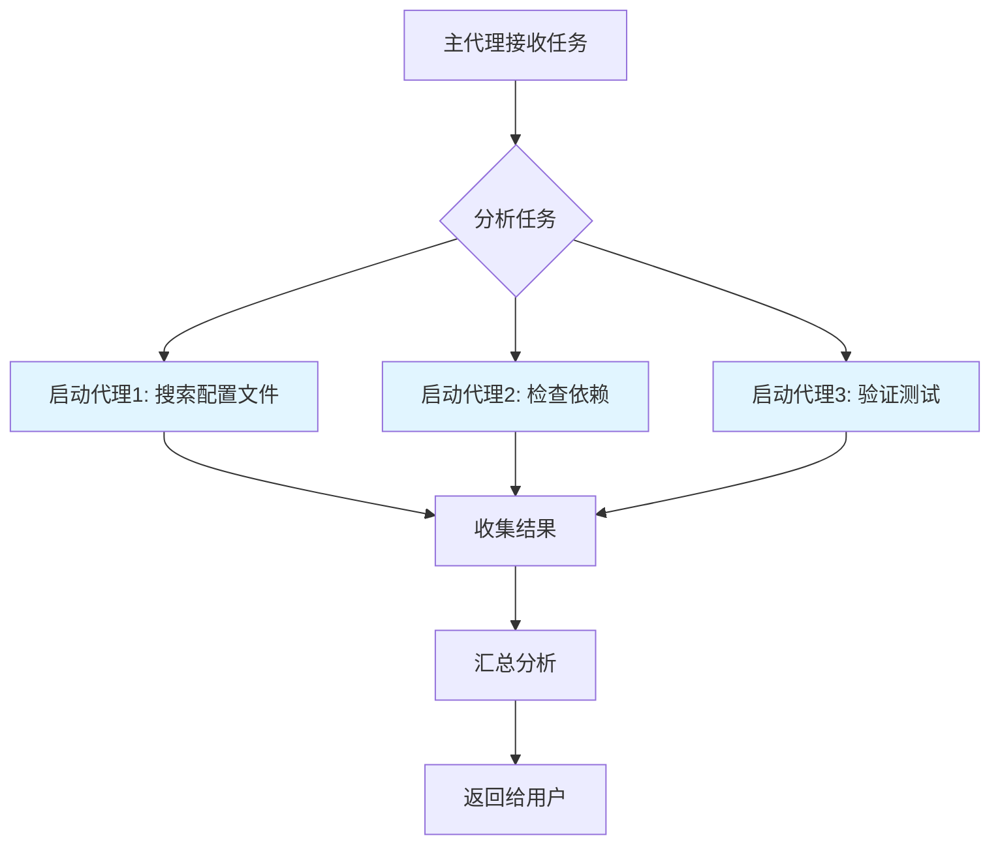
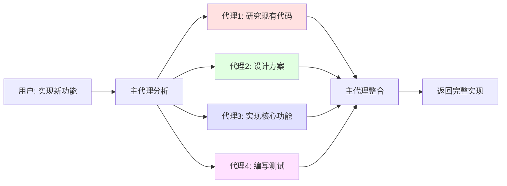
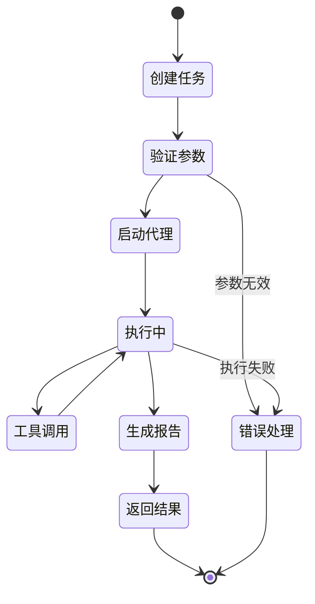

# Claude Code A2A 机制详解

## 什么是 A2A

A2A(Agent-to-Agent)是 Claude Code 中的一种核心通信机制,允许不同的 AI 代理(Agent)之间进行协作和交互。通过 A2A,一个代理可以启动另一个代理来处理特定的子任务,从而实现任务的分解和并行处理。

## 核心概念

### 1. 代理(Agent)

在 Claude Code 中,代理是具有特定能力和职责的 AI 工作单元。每个代理可以:
- 访问特定的工具集
- 处理特定类型的任务
- 独立完成分配的工作
- 向调用者返回执行结果

### 2. 代理类型

Claude Code 提供了多种专用代理:

```typescript
// 代理类型枚举示例
enum AgentType {
  GENERAL_PURPOSE = 'general-purpose',
  EXPLORE = 'Explore',
  STATUSLINE_SETUP = 'statusline-setup',
  OUTPUT_STYLE_SETUP = 'output-style-setup'
}

// 代理类型描述映射
const agentDescriptions: Record<AgentType, string> = {
  [AgentType.GENERAL_PURPOSE]: '通用代理,用于复杂的多步骤任务',
  [AgentType.EXPLORE]: '代码库探索代理,专门用于快速查找和搜索',
  [AgentType.STATUSLINE_SETUP]: '状态栏配置代理',
  [AgentType.OUTPUT_STYLE_SETUP]: '输出样式配置代理'
};
```

### 3. A2A 通信流程



## A2A 的工作原理

### 1. 任务分发机制

主代理通过 `Task` 工具启动子代理:

```typescript
interface TaskInvocation {
  subagentType: string;   // 子代理类型
  description: string;    // 简短描述(3-5词)
  prompt: string;         // 详细任务描述
}

// 示例:启动探索代理
function createExploreTask(query: string): TaskInvocation {
  return {
    subagentType: 'Explore',
    description: '探索代码库结构',
    prompt: `请在代码库中查找${query}相关的实现,` +
            `使用quick/medium/very thorough级别的搜索深度,` +
            `返回找到的文件路径和关键代码片段。`
  };
}
```

### 2. 并行处理能力

A2A 支持并行启动多个代理以提高效率:



并行调用示例:

```typescript
// 单次响应中发起多个并行任务
async function executeParallelTasks(): Promise<void> {
  // 同时发起三个独立的探索任务
  const tasks: TaskInvocation[] = [
    createExploreTask('API endpoints'),
    createExploreTask('authentication logic'),
    createExploreTask('error handling')
  ];

  // 这些任务会并行执行
  const results = await executeInParallel(tasks);

  // 汇总所有结果
  const summary = aggregateResults(results);
}
```

### 3. 状态隔离

每个代理调用都是无状态的:
- 代理之间不共享上下文
- 每次调用都是独立的
- 主代理负责维护整体状态

```typescript
class AgentExecution {
  // 每个代理执行都是独立的实例
  private agentId: string;
  private type: AgentType;
  private inputContext: Map<string, any>;
  private result: string;
  private completed: boolean;

  // 代理执行完成后返回结果,不保留状态
  execute(): string {
    // 1. 初始化代理环境
    // 2. 执行任务
    // 3. 返回结果
    // 4. 清理环境(无状态)
    return this.result;
  }
}
```

## A2A 的使用场景

### 1. 代码库探索

当需要查找代码库中的特定模式或功能时:

```typescript
/**
 * 场景:查找错误处理逻辑
 * 主代理 -> Explore 代理
 */
function findErrorHandling(): void {
  // ❌ 不推荐:主代理直接使用 Glob/Grep
  // ✅ 推荐:使用 Explore 代理

  const exploreTask: TaskInvocation = {
    subagentType: 'Explore',
    description: '查找错误处理',
    prompt: '在代码库中查找客户端错误的处理位置,' +
            '使用 medium 级别的搜索深度,' +
            '关注 try-catch 块和错误日志记录'
  };

  // Explore 代理会:
  // 1. 使用 Glob 查找相关文件
  // 2. 使用 Grep 搜索关键代码
  // 3. 读取并分析文件内容
  // 4. 返回结构化的发现
}
```

### 2. 复杂任务分解

处理多步骤任务时:



### 3. 专业任务委托

将特定任务委托给专门的代理:

```typescript
class SpecializedTaskDelegation {
  /**
   * 配置状态栏
   */
  setupStatusLine(): TaskInvocation {
    return {
      subagentType: 'statusline-setup',
      description: '配置状态栏',
      prompt: '配置 Claude Code 状态栏显示项目信息和 Git 状态'
      // statusline-setup 代理拥有 Read, Edit 工具
    };
  }

  /**
   * 配置输出样式
   */
  setupOutputStyle(): TaskInvocation {
    return {
      subagentType: 'output-style-setup',
      description: '创建输出样式',
      prompt: '创建自定义输出样式以改进日志格式'
      // output-style-setup 代理拥有 Read, Write, Edit, Glob, Grep 工具
    };
  }
}
```

## A2A 的最佳实践

### 1. 明确任务描述

提供详细且明确的任务描述:

```typescript
// ❌ 不好的示例
const vaguePrompt = '查找配置';

// ✅ 好的示例
const detailPrompt = `
  在代码库中查找数据库配置文件:
  1. 搜索 application.properties 或 application.yml
  2. 查找包含数据库连接字符串的配置
  3. 使用 'medium' 搜索深度
  4. 返回文件路径和关键配置项
`;
```

### 2. 选择合适的代理

根据任务特性选择最合适的代理类型:

```typescript
function selectAgent(task: Task): AgentType {
  if (task.requiresCodebaseSearch()) {
    // 代码库搜索 -> Explore 代理
    return AgentType.EXPLORE;
  } else if (task.isMultiStep() && task.isComplex()) {
    // 复杂多步骤 -> 通用代理
    return AgentType.GENERAL_PURPOSE;
  } else if (task.requiresConfiguration()) {
    // 配置任务 -> 专用配置代理
    return AgentType.STATUSLINE_SETUP;
  }
  // 默认返回通用代理
  return AgentType.GENERAL_PURPOSE;
}
```

### 3. 并行优先原则

当任务之间没有依赖时,优先使用并行执行:

```typescript
async function processIndependentTasks(): Promise<void> {
  // ✅ 推荐:并行执行
  const parallelTasks: TaskInvocation[] = [
    createTask('search-api', '查找 API 端点'),
    createTask('search-models', '查找数据模型'),
    createTask('search-utils', '查找工具函数')
  ];
  await executeInParallel(parallelTasks);

  // ❌ 不推荐:串行执行(除非有依赖)
  // await executeSequentially(parallelTasks);
}
```

### 4. 结果处理

主代理需要处理子代理返回的结果:

```typescript
interface TaskResult {
  success: boolean;
  output: string;
  error?: string;
}

class ResultHandler {
  handleAgentResult(result: TaskResult): void {
    // 1. 验证结果
    if (!result.success) {
      this.handleError(result.error!);
      return;
    }

    // 2. 提取关键信息
    const summary = this.extractSummary(result);

    // 3. 向用户展示
    // 注意:代理的返回结果用户不可见
    // 主代理需要将结果转化为用户可读的形式
    this.displayToUser(summary);
  }

  private displayToUser(summary: string): void {
    // 将结果以简洁的方式呈现给用户
    console.log('搜索结果摘要:');
    console.log(summary);
  }

  private extractSummary(result: TaskResult): string {
    // 提取摘要逻辑
    return result.output;
  }

  private handleError(error: string): void {
    console.error('代理执行失败:', error);
  }
}
```

## A2A 的实现细节

### 1. 工具访问控制

不同类型的代理拥有不同的工具集:

```typescript
class AgentToolAccess {
  private toolMap: Map<AgentType, Set<string>>;

  constructor() {
    this.toolMap = new Map([
      // general-purpose: 拥有所有工具
      [AgentType.GENERAL_PURPOSE, new Set(['*'])],

      // Explore: 专注于搜索和读取
      [AgentType.EXPLORE, new Set(['Glob', 'Grep', 'Read', 'Bash'])],

      // statusline-setup: 配置相关
      [AgentType.STATUSLINE_SETUP, new Set(['Read', 'Edit'])],

      // output-style-setup: 样式配置
      [AgentType.OUTPUT_STYLE_SETUP, new Set(['Read', 'Write', 'Edit', 'Glob', 'Grep'])]
    ]);
  }

  canUseTool(agent: AgentType, tool: string): boolean {
    const tools = this.toolMap.get(agent);
    return tools?.has('*') || tools?.has(tool) || false;
  }
}
```

### 2. 搜索深度控制

Explore 代理支持三种搜索深度:

```typescript
enum SearchThoroughness {
  QUICK = 'quick',
  MEDIUM = 'medium',
  VERY_THOROUGH = 'very thorough'
}

const searchDescriptions: Record<SearchThoroughness, string> = {
  [SearchThoroughness.QUICK]: '基本搜索,快速返回',
  [SearchThoroughness.MEDIUM]: '适度探索,平衡速度和覆盖率',
  [SearchThoroughness.VERY_THOROUGH]: '全面分析,检查多个位置和命名约定'
};

// 使用示例
function createExplorePrompt(query: string, thoroughness: SearchThoroughness): string {
  return `查找 ${query},使用 ${thoroughness} 级别的搜索深度。${searchDescriptions[thoroughness]}`;
}
```

### 3. 通信协议

A2A 通信遵循特定的协议:



## 性能优化

### 1. 减少上下文使用

通过 A2A 可以有效减少主代理的上下文消耗:

```typescript
class ContextOptimization {
  // ❌ 不推荐:主代理直接搜索(消耗大量上下文)
  async directSearch(): Promise<void> {
    // 读取多个文件
    // 搜索多个模式
    // 所有结果都在主代理上下文中
  }

  // ✅ 推荐:委托给 Explore 代理
  async delegatedSearch(): Promise<void> {
    const task: TaskInvocation = {
      subagentType: 'Explore',
      description: '查找 API 端点',
      prompt: '查找所有 API 端点定义'
    };

    // Explore 代理在独立上下文中工作
    // 只返回摘要结果给主代理
    const result = await executeTask(task);
    const summary = result.output; // 简洁的结果
  }
}
```

### 2. 避免重复工作

主代理应该信任子代理的输出:

```typescript
class TrustAgentOutput {
  async processAgentResult(result: TaskResult): Promise<void> {
    // ✅ 推荐:直接使用代理结果
    const findings = result.output;
    await this.analyzeFindings(findings);

    // ❌ 不推荐:重新验证代理已完成的工作
    // await this.reSearchSameFiles();
    // await this.reVerifyResults();
  }

  private async analyzeFindings(findings: string): Promise<void> {
    // 分析逻辑
  }
}
```

## 常见问题

### Q1: 何时使用 Task 工具?

```typescript
interface Task {
  requiresCodebaseExploration(): boolean;
  isComplexMultiStep(): boolean;
  requiresSpecializedAgent(): boolean;
  canBenefitFromParallelization(): boolean;
  hasSpecificFilePath(): boolean;
  isSimpleQuery(): boolean;
  isSearchingForClass(): boolean;
}

function shouldUseTaskTool(task: Task): boolean {
  // 使用 Task 工具的场景:
  return task.requiresCodebaseExploration()     // 需要代码库探索
      || task.isComplexMultiStep()              // 复杂多步骤任务
      || task.requiresSpecializedAgent()        // 需要专门代理
      || task.canBenefitFromParallelization(); // 可并行化
}

function shouldNotUseTaskTool(task: Task): boolean {
  // 不使用 Task 工具的场景:
  return task.hasSpecificFilePath()     // 已知具体文件路径
      || task.isSimpleQuery()           // 简单查询
      || task.isSearchingForClass();    // 搜索特定类定义
}
```

### Q2: 如何处理代理失败?

```typescript
enum ErrorType {
  TRANSIENT = 'transient',
  INVALID_PARAMS = 'invalid_params',
  UNRECOVERABLE = 'unrecoverable'
}

class AgentErrorHandling {
  async handleAgentFailure(result: TaskResult): Promise<void> {
    if (!result.success) {
      const error = result.error!;

      // 1. 分析失败原因
      const errorType = this.classifyError(error);

      // 2. 决定重试策略
      if (errorType === ErrorType.TRANSIENT) {
        // 临时错误:重试
        await this.retryTask(result);
      } else if (errorType === ErrorType.INVALID_PARAMS) {
        // 参数错误:调整参数后重试
        await this.adjustAndRetry(result);
      } else {
        // 不可恢复错误:降级处理
        await this.fallbackStrategy();
      }
    }
  }

  private classifyError(error: string): ErrorType {
    // 错误分类逻辑
    if (error.includes('timeout')) {
      return ErrorType.TRANSIENT;
    } else if (error.includes('invalid')) {
      return ErrorType.INVALID_PARAMS;
    }
    return ErrorType.UNRECOVERABLE;
  }

  private async retryTask(result: TaskResult): Promise<void> {
    // 重试逻辑
  }

  private async adjustAndRetry(result: TaskResult): Promise<void> {
    // 调整参数后重试
  }

  private async fallbackStrategy(): Promise<void> {
    // 降级处理
  }
}
```

### Q3: 并行代理的最大数量?

虽然没有硬性限制,但建议:

```typescript
class ParallelExecutionGuidelines {
  // 推荐的并发代理数量
  private static readonly RECOMMENDED_MAX_PARALLEL = 3;
  private static readonly ABSOLUTE_MAX_PARALLEL = 5;

  async executeWithLimit(tasks: TaskInvocation[]): Promise<TaskResult[]> {
    if (tasks.length <= ParallelExecutionGuidelines.RECOMMENDED_MAX_PARALLEL) {
      // 推荐范围:直接并行执行
      return await this.executeInParallel(tasks);
    } else if (tasks.length <= ParallelExecutionGuidelines.ABSOLUTE_MAX_PARALLEL) {
      // 可接受范围:并行执行但监控性能
      return await this.executeInParallelWithMonitoring(tasks);
    } else {
      // 超出范围:分批执行
      return await this.executeBatched(tasks, ParallelExecutionGuidelines.RECOMMENDED_MAX_PARALLEL);
    }
  }

  private async executeInParallel(tasks: TaskInvocation[]): Promise<TaskResult[]> {
    // 并行执行逻辑
    return [];
  }

  private async executeInParallelWithMonitoring(tasks: TaskInvocation[]): Promise<TaskResult[]> {
    // 带监控的并行执行
    return [];
  }

  private async executeBatched(tasks: TaskInvocation[], batchSize: number): Promise<TaskResult[]> {
    // 分批执行逻辑
    const results: TaskResult[] = [];
    for (let i = 0; i < tasks.length; i += batchSize) {
      const batch = tasks.slice(i, i + batchSize);
      const batchResults = await this.executeInParallel(batch);
      results.push(...batchResults);
    }
    return results;
  }
}
```

## 总结

A2A(Agent-to-Agent)机制是 Claude Code 实现任务分解和并行处理的核心能力:

1. **解耦职责**:不同代理专注于特定类型的任务
2. **提高效率**:并行执行独立任务
3. **优化资源**:独立上下文减少资源消耗
4. **增强可维护性**:清晰的代理边界和职责

通过合理使用 A2A 机制,可以构建更高效、更易维护的 AI 工作流。

## 参考资料

- [Claude Code 官方文档](https://docs.claude.com/claude-code)
- [Task 工具使用指南](https://docs.claude.com/claude-code/tools/task)
- [代理架构设计](https://docs.claude.com/claude-code/architecture)
