# Claude Code MCP 服务加载机制详解

本文深入剖析 Claude Code 加载 MCP (Model Context Protocol) 服务的完整流程,包括配置文件优先级、加载顺序、初始化过程以及常见问题排查。

## 一、配置文件优先级体系

Claude Code 采用分层配置系统,配置项按照以下优先级顺序加载和合并:

```mermaid
graph TD
    A[Claude Code 启动] --> B{企业管理策略}
    B -->|存在| C[managed-settings.json<br/>最高优先级]
    B -->|不存在| D{命令行参数}
    D --> E{项目级配置}
    E --> F[.claude/settings.local.json<br/>项目本地配置]
    E --> G[.claude/settings.json<br/>项目共享配置]
    D --> H{用户级配置}
    H --> I[~/.claude/settings.json<br/>用户全局配置]

    C --> J[配置合并]
    F --> J
    G --> J
    I --> J
    J --> K[最终有效配置]

    style A fill:#e1f5ff
    style K fill:#e1ffe1
    style C fill:#ffe1e1
    style F fill:#fff4e1
```



### 配置优先级详解

| 优先级 | 配置来源 | 位置 | 用途 | 可修改性 |
|--------|---------|------|------|---------|
| **1 (最高)** | 企业管理策略 | 企业分发 | 组织强制策略 | 只读 |
| **2** | 命令行参数 | 启动参数 | 临时覆盖配置 | 每次启动指定 |
| **3** | 项目本地配置 | `.claude/settings.local.json` | 个人开发偏好 | 不纳入版本控制 |
| **4** | 项目共享配置 | `.claude/settings.json` | 团队共享配置 | 纳入版本控制 |
| **5 (最低)** | 用户全局配置 | `~/.claude/settings.json` | 个人默认配置 | 全局生效 |

## 二、MCP 配置文件位置和作用域

### 2.1 MCP 特殊配置规则

**重要说明**: MCP 服务器配置有特殊的识别规则,与普通配置项不同。

```mermaid
graph TB
    A[MCP 配置识别] --> B{项目级 .mcp.json}
    B -->|存在| C[读取项目 MCP 配置]
    B -->|不存在| D{用户级 ~/.claude.json}
    D -->|存在| E[读取用户 MCP 配置]
    D -->|不存在| F[无 MCP 服务]

    C --> G[启用列表过滤]
    E --> G
    G --> H[enabledMcpjsonServers]
    H --> I[最终加载的 MCP 服务]

    style A fill:#e1f5ff
    style C fill:#e1ffe1
    style E fill:#fff4e1
    style F fill:#ffe1e1
```



### 2.2 MCP 配置文件对比

| 配置文件 | 路径 | 作用域 | 优先级 | 版本控制 | 说明 |
|---------|------|--------|--------|---------|------|
| **`.mcp.json`** | 项目根目录 | 项目级 | **最高** | 建议纳入 | MCP 专用配置 |
| **`.claude/settings.local.json`** | 项目/.claude/ | 项目本地 | 高 | 不纳入 | 包含 MCP 启用列表 |
| **`~/.claude.json`** | 用户主目录 | 用户全局 | 中 | 不适用 | 全局 MCP 配置 |
| **`~/.claude/settings.json`** | 用户主目录 | 用户全局 | 低 | 不适用 | ⚠️ MCP 配置会被忽略 |

### 2.3 配置文件示例

#### 项目级 MCP 配置 (`.mcp.json`)

```json
{
  "mcpServers": {
    "context7": {
      "command": "/opt/homebrew/bin/context7-mcp",
      "args": [],
      "env": {
        "CONTEXT7_API_KEY": "ctx7sk-..."
      }
    },
    "playwright": {
      "command": "npx",
      "args": ["-y", "@modelcontextprotocol/server-playwright"],
      "env": {}
    }
  }
}
```

#### 项目本地配置 (`.claude/settings.local.json`)

```json
{
  "permissions": {
    "allow": [
      "mcp__context7__*",
      "mcp__playwright__*"
    ]
  },
  "enabledMcpjsonServers": [
    "context7",
    "playwright"
  ]
}
```

## 三、MCP 服务加载完整流程

### 3.1 启动到就绪流程图

```mermaid
sequenceDiagram
    participant User as 用户
    participant CC as Claude Code
    participant Config as 配置系统
    participant MCP as MCP 服务器
    participant Tool as 工具注册表

    User->>CC: 启动 Claude Code
    CC->>Config: 读取配置文件

    Note over Config: 步骤1: 读取配置
    Config->>Config: 加载 managed-settings.json
    Config->>Config: 加载项目级配置
    Config->>Config: 加载用户级配置
    Config->>Config: 按优先级合并

    Config-->>CC: 返回最终配置

    Note over CC: 步骤2: 解析 MCP 配置
    alt 存在 .mcp.json
        CC->>Config: 读取 .mcp.json
        Config-->>CC: 返回 MCP 服务定义
    else 不存在 .mcp.json
        CC->>Config: 读取 ~/.claude.json
        Config-->>CC: 返回 MCP 服务定义
    end

    Note over CC: 步骤3: 过滤启用的服务
    CC->>Config: 检查 enabledMcpjsonServers
    Config-->>CC: 返回启用的服务列表

    Note over CC,MCP: 步骤4: 启动 MCP 服务
    loop 每个已启用的 MCP 服务
        CC->>MCP: 启动进程 (command + args)
        MCP->>MCP: 初始化服务进程
        MCP-->>CC: 进程就绪

        Note over CC,MCP: 步骤5: 协议握手
        CC->>MCP: initialize(protocolVersion, capabilities)
        MCP-->>CC: 返回服务器信息和能力

        CC->>MCP: initialized (确认通知)

        Note over CC,MCP: 步骤6: 获取工具列表
        CC->>MCP: tools/list
        MCP-->>CC: 返回可用工具列表

        Note over CC,Tool: 步骤7: 注册工具
        CC->>Tool: 注册工具 (mcp__服务名__工具名)
        Tool-->>CC: 注册成功
    end

    CC->>User: MCP 服务加载完成

    Note over CC,MCP: 步骤8: 运行时调用
    User->>CC: 发送请求
    CC->>Tool: 查找工具
    Tool->>MCP: tools/call(工具名, 参数)
    MCP->>MCP: 执行工具逻辑
    MCP-->>Tool: 返回执行结果
    Tool-->>CC: 返回结果
    CC-->>User: 显示结果
```



### 3.2 加载阶段详解

#### 阶段 1: 配置读取与合并

```typescript
class ConfigurationManager {
  async loadConfiguration(): Promise<Config> {
    const configs = [];

    // 1. 企业管理策略 (最高优先级)
    if (await exists('managed-settings.json')) {
      configs.push(await readJson('managed-settings.json'));
    }

    // 2. 项目本地配置
    if (await exists('.claude/settings.local.json')) {
      configs.push(await readJson('.claude/settings.local.json'));
    }

    // 3. 项目共享配置
    if (await exists('.claude/settings.json')) {
      configs.push(await readJson('.claude/settings.json'));
    }

    // 4. 用户全局配置
    if (await exists('~/.claude/settings.json')) {
      configs.push(await readJson('~/.claude/settings.json'));
    }

    // 合并配置 (高优先级覆盖低优先级)
    return mergeConfigs(configs);
  }
}
```

#### 阶段 2: MCP 配置解析

```typescript
class MCPConfigLoader {
  async loadMCPConfig(): Promise<MCPServers> {
    let mcpConfig: MCPServers;

    // 优先从 .mcp.json 读取
    if (await exists('.mcp.json')) {
      mcpConfig = await readJson('.mcp.json');
      console.log('Loaded MCP config from .mcp.json');
    }
    // 其次从用户目录读取
    else if (await exists('~/.claude.json')) {
      mcpConfig = await readJson('~/.claude.json');
      console.log('Loaded MCP config from ~/.claude.json');
    }
    // 无 MCP 配置
    else {
      console.log('No MCP configuration found');
      return {};
    }

    return mcpConfig.mcpServers || {};
  }
}
```

#### 阶段 3: 服务启用过滤

```typescript
class MCPServiceFilter {
  filterEnabledServices(
    allServers: MCPServers,
    enabledList: string[]
  ): MCPServers {
    // 如果没有指定启用列表,默认启用所有
    if (!enabledList || enabledList.length === 0) {
      return allServers;
    }

    // 根据启用列表过滤
    const enabled: MCPServers = {};
    for (const serverName of enabledList) {
      if (allServers[serverName]) {
        enabled[serverName] = allServers[serverName];
      } else {
        console.warn(`MCP server "${serverName}" not found in configuration`);
      }
    }

    return enabled;
  }
}
```

#### 阶段 4: 进程启动

```typescript
class MCPProcessManager {
  async startMCPServer(
    name: string,
    config: MCPServerConfig
  ): Promise<ChildProcess> {
    const { command, args = [], env = {} } = config;

    console.log(`Starting MCP server: ${name}`);
    console.log(`Command: ${command} ${args.join(' ')}`);

    // 启动子进程
    const process = spawn(command, args, {
      env: {
        ...process.env,
        ...env
      },
      stdio: ['pipe', 'pipe', 'pipe']
    });

    // 错误处理
    process.on('error', (error) => {
      console.error(`Failed to start MCP server "${name}":`, error);
    });

    process.stderr.on('data', (data) => {
      console.error(`[${name}] ${data.toString()}`);
    });

    return process;
  }
}
```

#### 阶段 5: 协议握手

```typescript
class MCPClient {
  async initialize(): Promise<InitializeResult> {
    console.log('Sending initialize request');

    const initRequest = {
      jsonrpc: '2.0',
      id: this.nextId++,
      method: 'initialize',
      params: {
        protocolVersion: '2024-11-05',
        capabilities: {
          roots: { listChanged: true },
          sampling: {}
        },
        clientInfo: {
          name: 'claude-code',
          version: '1.0.0'
        }
      }
    };

    // 发送初始化请求
    const response = await this.sendRequest(initRequest);

    console.log('Server capabilities:', response.capabilities);
    console.log('Server info:', response.serverInfo);

    // 发送初始化完成通知
    await this.sendNotification({
      jsonrpc: '2.0',
      method: 'notifications/initialized'
    });

    return response;
  }
}
```

#### 阶段 6: 工具发现

```typescript
class MCPClient {
  async listTools(): Promise<Tool[]> {
    console.log('Requesting tools list');

    const listRequest = {
      jsonrpc: '2.0',
      id: this.nextId++,
      method: 'tools/list',
      params: {}
    };

    const response = await this.sendRequest(listRequest);

    console.log(`Discovered ${response.tools.length} tools:`,
                response.tools.map(t => t.name));

    return response.tools;
  }
}
```

#### 阶段 7: 工具注册

```typescript
class ToolRegistry {
  registerMCPTools(
    serverName: string,
    tools: Tool[],
    client: MCPClient
  ): void {
    for (const tool of tools) {
      // 工具名称格式: mcp__服务名__工具名
      const fullToolName = `mcp__${serverName}__${tool.name}`;

      // 创建工具包装器
      const toolWrapper = {
        name: fullToolName,
        description: tool.description,
        inputSchema: tool.inputSchema,

        // 执行函数
        execute: async (params: any) => {
          return await client.callTool(tool.name, params);
        }
      };

      // 注册到工具系统
      this.tools.set(fullToolName, toolWrapper);

      console.log(`✓ Registered tool: ${fullToolName}`);
    }
  }
}
```

### 3.3 运行时工具调用流程

```mermaid
graph TB
    A[用户请求] --> B[Claude AI 决策]
    B --> C{需要使用工具?}
    C -->|是| D[选择合适的工具]
    C -->|否| E[直接回复]

    D --> F[查找工具定义]
    F --> G{工具存在?}
    G -->|是| H[准备参数]
    G -->|否| I[返回错误]

    H --> J[调用 MCP Client]
    J --> K[构造 tools/call 请求]
    K --> L[发送到 MCP Server]

    L --> M[MCP Server 处理]
    M --> N[执行工具逻辑]
    N --> O[返回结果]

    O --> P[解析结果]
    P --> Q[返回给 Claude]
    Q --> R[生成最终回复]

    style A fill:#e1f5ff
    style R fill:#e1ffe1
    style I fill:#ffe1e1
```



## 四、实际配置案例分析

### 4.1 您的配置分析

根据您的配置文件:

**`.mcp.json`** (定义 MCP 服务):
```json
{
  "mcpServers": {
    "context7": {
      "command": "/opt/homebrew/bin/context7-mcp",
      "args": [],
      "env": {
        "CONTEXT7_API_KEY": "ctx7sk-859f2734-c5d8-4a9a-837f-e503ee46b451"
      }
    }
  }
}
```

**`.claude/settings.local.json`** (启用和权限):
```json
{
  "permissions": {
    "allow": ["mcp__context7__*"]
  },
  "enabledMcpjsonServers": ["context7"]
}
```

### 4.2 加载流程追踪

```mermaid
sequenceDiagram
    participant CC as Claude Code
    participant Config as 配置系统
    participant Proc as 进程管理器
    participant Context7 as context7-mcp

    CC->>Config: 读取 .mcp.json
    Config-->>CC: { context7: {...} }

    CC->>Config: 读取 enabledMcpjsonServers
    Config-->>CC: ["context7"]

    Note over CC: context7 已启用,准备启动

    CC->>Proc: 启动进程
    Note right of Proc: command: /opt/homebrew/bin/context7-mcp<br/>env: CONTEXT7_API_KEY=...

    Proc->>Context7: spawn process

    alt 进程启动失败
        Context7-->>Proc: Error (文件不存在/权限不足)
        Proc-->>CC: 启动失败
        CC->>CC: 记录错误日志
    else 进程启动成功
        Context7-->>Proc: Process running
        Proc-->>CC: PID: 12345

        CC->>Context7: initialize
        Context7-->>CC: capabilities + serverInfo

        CC->>Context7: tools/list
        Context7-->>CC: [tool1, tool2, ...]

        CC->>CC: 注册工具 (mcp__context7__*)

        Note over CC: Context7 服务就绪
    end
```



### 4.3 您遇到的连接失败原因

命令输出显示: `Failed to reconnect to context7`

#### 可能的原因及排查步骤

**排查流程图:**

```
连接失败
   ↓
[1] 检查可执行文件
   ├─ 文件不存在 → 安装或修正路径
   └─ 文件存在 → 继续
       ↓
[2] 检查文件权限
   ├─ 无执行权限 → chmod +x 授权
   └─ 有执行权限 → 继续
       ↓
[3] 检查环境变量
   ├─ API Key 错误 → 更新配置
   └─ API Key 正确 → 继续
       ↓
[4] 检查网络连接
   ├─ 网络不通 → 检查网络配置
   └─ 网络正常 → 继续
       ↓
[5] 检查服务状态
   └─ 服务端故障 → 联系服务提供商
```

#### 详细排查步骤

| 步骤 | 检查项 | 问题 | 解决方案 |
|-----|--------|------|---------|
| **1** | 可执行文件 | `/opt/homebrew/bin/context7-mcp` 不存在 | 运行 `npm install -g context7-mcp` 安装 |
| **2** | 文件权限 | 无执行权限 (Permission denied) | 运行 `chmod +x /opt/homebrew/bin/context7-mcp` |
| **3** | 环境变量 | `CONTEXT7_API_KEY` 未设置或无效 | 在 `.mcp.json` 中正确配置 API Key |
| **4** | 网络连接 | 无法访问 Context7 服务 | 检查防火墙、代理设置 |
| **5** | 服务状态 | Context7 服务端故障或维护 | 访问 Context7 状态页面或联系支持 |

## 五、故障排查指南

### 5.1 诊断流程

```bash
# 步骤 1: 检查 MCP 可执行文件
ls -la /opt/homebrew/bin/context7-mcp

# 步骤 2: 检查文件类型和依赖
file /opt/homebrew/bin/context7-mcp
otool -L /opt/homebrew/bin/context7-mcp  # macOS 查看依赖

# 步骤 3: 手动测试启动
CONTEXT7_API_KEY="ctx7sk-..." /opt/homebrew/bin/context7-mcp

# 步骤 4: 查看 Claude Code 日志
# macOS
tail -f ~/Library/Logs/Claude/mcp-context7.log
# 或查看所有 MCP 日志
ls -la ~/Library/Logs/Claude/mcp-*.log

# 步骤 5: 测试 API Key 有效性
curl -H "Authorization: Bearer ctx7sk-..." https://api.context7.com/health
```

### 5.2 常见问题及解决方案

#### 问题 1: 找不到 MCP 可执行文件

```bash
# 错误信息
Error: spawn /opt/homebrew/bin/context7-mcp ENOENT

# 解决方案
# 1. 查找实际位置
which context7-mcp

# 2. 如果没有安装,安装 context7
npm install -g context7-mcp

# 3. 更新 .mcp.json 中的路径
{
  "mcpServers": {
    "context7": {
      "command": "$(which context7-mcp)",  // 或使用绝对路径
      ...
    }
  }
}
```

#### 问题 2: 权限不足

```bash
# 错误信息
Error: spawn /opt/homebrew/bin/context7-mcp EACCES

# 解决方案
chmod +x /opt/homebrew/bin/context7-mcp
```

#### 问题 3: API Key 无效

```bash
# 错误信息
Authentication failed: Invalid API key

# 解决方案
# 1. 验证 API Key 格式
echo $CONTEXT7_API_KEY

# 2. 重新生成 API Key
# 登录 Context7 控制台,生成新的 API Key

# 3. 更新 .mcp.json
{
  "env": {
    "CONTEXT7_API_KEY": "新的API_KEY"
  }
}
```

#### 问题 4: MCP 服务未启用

```json
// 错误: .mcp.json 定义了服务,但未启用

// 解决方案: 在 .claude/settings.local.json 中添加
{
  "enabledMcpjsonServers": [
    "context7"
  ]
}
```

#### 问题 5: 工具权限不足

```json
// 错误: Permission denied for tool mcp__context7__search

// 解决方案: 在 .claude/settings.local.json 中添加权限
{
  "permissions": {
    "allow": [
      "mcp__context7__*"  // 允许所有 context7 工具
    ]
  }
}
```

### 5.3 调试技巧

#### 启用详细日志

```json
// .claude/settings.local.json
{
  "logging": {
    "level": "debug",
    "mcp": true
  }
}
```

#### 手动测试 MCP Server

```bash
# 启动 MCP Server
/opt/homebrew/bin/context7-mcp

# 发送测试消息 (每行一个 JSON-RPC 消息)
# 1. 初始化
echo '{"jsonrpc":"2.0","id":1,"method":"initialize","params":{"protocolVersion":"2024-11-05","capabilities":{},"clientInfo":{"name":"test","version":"1.0.0"}}}' | /opt/homebrew/bin/context7-mcp

# 2. 列出工具
echo '{"jsonrpc":"2.0","id":2,"method":"tools/list","params":{}}' | /opt/homebrew/bin/context7-mcp
```

## 六、关键特性和限制

### 6.1 会话生命周期

```mermaid
stateDiagram-v2
    [*] --> Startup: Claude Code 启动
    Startup --> Loading: 加载 MCP 配置
    Loading --> Connecting: 连接 MCP 服务
    Connecting --> Active: 所有服务就绪

    Active --> Active: 处理工具调用

    Active --> Reconnecting: 连接断开
    Reconnecting --> Active: 重连成功
    Reconnecting --> Failed: 重连失败

    Active --> Shutdown: Claude Code 关闭
    Failed --> Shutdown
    Shutdown --> [*]

    note right of Active
        MCP 服务在整个会话期间
        保持活跃,不会动态卸载
    end note
```



### 6.2 关键特性

| 特性 | 说明 | 影响 |
|-----|------|------|
| **会话级加载** | MCP 在启动时加载,运行期间保持 | 修改配置需要重启 |
| **无动态加载** | 不支持运行时加载/卸载服务 | 计划中的功能 ([Issue #6638](https://github.com/anthropics/claude-code/issues/6638)) |
| **工具名称前缀** | 自动添加 `mcp__服务名__` 前缀 | 避免工具名称冲突 |
| **独立进程** | 每个 MCP Server 独立进程 | 故障隔离,资源隔离 |
| **Stdio 通信** | 通过标准输入输出通信 | 简单高效,跨平台 |

### 6.3 性能考虑

```typescript
// MCP 调用性能优化

// 1. 连接池 - MCP Client 复用
class MCPClientPool {
  private clients = new Map<string, MCPClient>();

  getClient(serverName: string): MCPClient {
    return this.clients.get(serverName); // 复用已有连接
  }
}

// 2. 工具调用缓存
class ToolCallCache {
  private cache = new LRU<string, ToolResult>({
    max: 100,
    ttl: 5000 // 5秒缓存
  });

  async callTool(tool: string, params: any): Promise<ToolResult> {
    const cacheKey = `${tool}:${JSON.stringify(params)}`;
    const cached = this.cache.get(cacheKey);

    if (cached) return cached;

    const result = await mcpClient.callTool(tool, params);
    this.cache.set(cacheKey, result);

    return result;
  }
}

// 3. 批量调用优化
class BatchToolExecutor {
  async executeBatch(calls: ToolCall[]): Promise<ToolResult[]> {
    // 并行执行多个工具调用
    return await Promise.all(
      calls.map(call => this.executeSingle(call))
    );
  }
}
```

## 七、最佳实践

### 7.1 配置管理

```bash
# 项目结构推荐
your-project/
├── .mcp.json                      # MCP 服务定义 (纳入版本控制)
├── .claude/
│   ├── settings.json              # 团队共享配置 (纳入版本控制)
│   └── settings.local.json        # 个人配置 (不纳入版本控制)
└── .gitignore                     # 排除敏感配置

# .gitignore 示例
.claude/settings.local.json
.mcp.local.json
```

### 7.2 安全配置

```json
// ✅ 推荐: 使用环境变量
{
  "mcpServers": {
    "myapi": {
      "command": "my-mcp-server",
      "env": {
        "API_KEY": "${MY_API_KEY}"  // 从环境变量读取
      }
    }
  }
}

// ❌ 不推荐: 硬编码敏感信息
{
  "mcpServers": {
    "myapi": {
      "env": {
        "API_KEY": "hardcoded-secret-key"  // 不要这样做!
      }
    }
  }
}
```

### 7.3 多项目配置策略

```bash
# 策略 1: 项目独立配置
project-a/
  .mcp.json          # 项目特定的 MCP 服务

project-b/
  .mcp.json          # 不同的 MCP 服务配置

# 策略 2: 全局 + 项目覆盖
~/.claude.json       # 全局通用 MCP 服务
project-x/
  .mcp.json          # 额外的项目特定服务

# 策略 3: 环境分离
.mcp.development.json
.mcp.production.json
# 使用符号链接切换
ln -s .mcp.development.json .mcp.json
```

## 八、总结

### 8.1 加载机制要点

```mermaid
mindmap
  root((MCP 加载机制))
    配置系统
      优先级顺序
      文件位置
      合并规则
    服务启动
      进程创建
      协议握手
      工具发现
    运行时
      工具调用
      连接管理
      错误处理
    故障排查
      日志分析
      手动测试
      配置验证
```



### 8.2 关键检查清单

在配置 MCP 服务时,请确保:

- [ ] MCP 可执行文件路径正确且有执行权限
- [ ] 环境变量正确配置 (API Key 等)
- [ ] 服务已在 `enabledMcpjsonServers` 中启用
- [ ] 工具权限已在 `permissions.allow` 中配置
- [ ] 配置文件 JSON 格式正确
- [ ] MCP Server 可以手动启动测试
- [ ] 查看 Claude Code 日志确认加载状态

### 8.3 下一步学习

- 阅读 **[MCP协议深入解析](./09.MCP协议实现)** 了解 MCP 协议细节
- 阅读 **[MCP-Server开发实战](./18.MCP-Server开发实战)** 学习开发自定义 MCP 服务
- 参与 [Claude Code GitHub Discussions](https://github.com/anthropics/claude-code/discussions) 社区讨论

---

**如果觉得这篇文章对你有帮助,欢迎分享给更多的朋友!** 🚀
