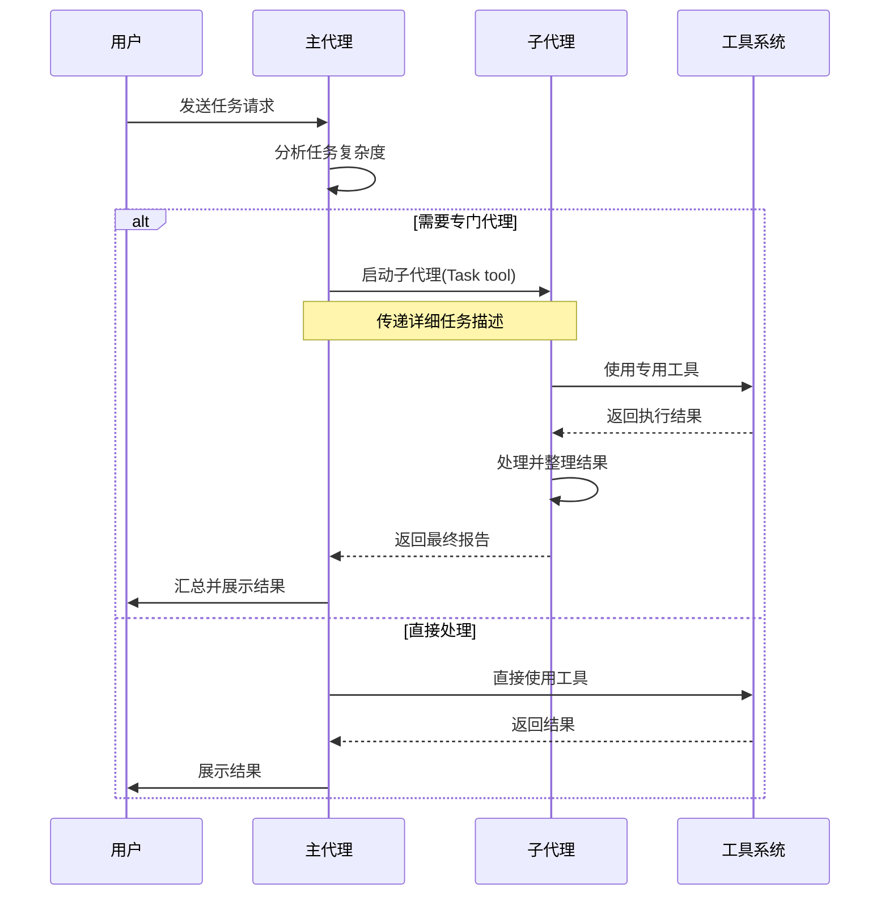
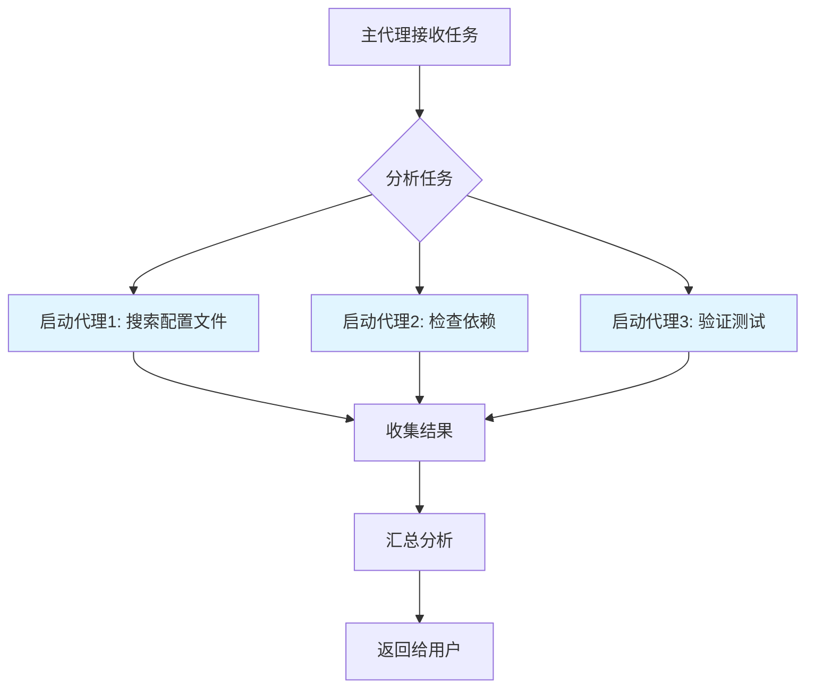
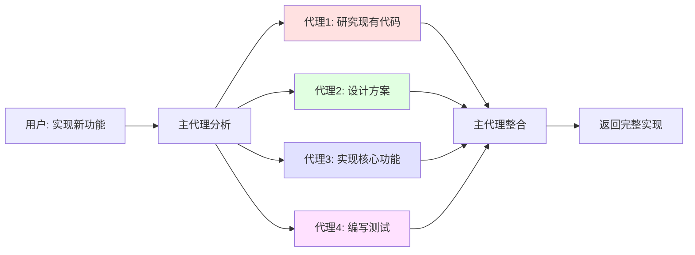
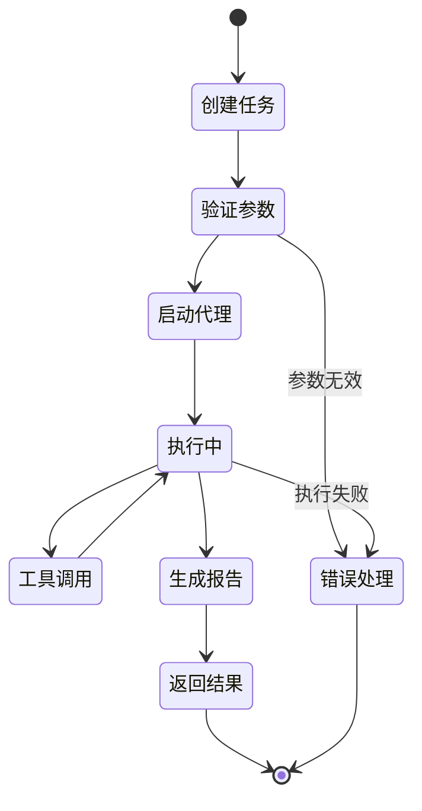

# Claude Code A2A 机制详解

## 什么是 A2A

A2A（Agent-to-Agent）是 Claude Code 中的一种核心通信机制，允许不同的 AI 代理（Agent）之间进行协作和交互。通过 A2A，一个代理可以启动另一个代理来处理特定的子任务，从而实现任务的分解和并行处理。

## 核心概念

### 1. 代理（Agent）

在 Claude Code 中，代理是具有特定能力和职责的 AI 工作单元。每个代理可以：
- 访问特定的工具集
- 处理特定类型的任务
- 独立完成分配的工作
- 向调用者返回执行结果

### 2. 代理类型

Claude Code 提供了多种专用代理：

```java
// 代理类型枚举示例
public enum AgentType {
    GENERAL_PURPOSE("general-purpose", "通用代理，用于复杂的多步骤任务"),
    EXPLORE("Explore", "代码库探索代理，专门用于快速查找和搜索"),
    STATUSLINE_SETUP("statusline-setup", "状态栏配置代理"),
    OUTPUT_STYLE_SETUP("output-style-setup", "输出样式配置代理");

    private final String type;
    private final String description;

    AgentType(String type, String description) {
        this.type = type;
        this.description = description;
    }
}
```

### 3. A2A 通信流程



## A2A 的工作原理

### 1. 任务分发机制

主代理通过 `Task` 工具启动子代理：

```java
public class TaskInvocation {
    private String subagentType;      // 子代理类型
    private String description;        // 简短描述（3-5词）
    private String prompt;            // 详细任务描述

    // 示例：启动探索代理
    public static TaskInvocation createExploreTask(String query) {
        TaskInvocation task = new TaskInvocation();
        task.subagentType = "Explore";
        task.description = "探索代码库结构";
        task.prompt = String.format(
            "请在代码库中查找%s相关的实现，" +
            "使用quick/medium/very thorough级别的搜索深度，" +
            "返回找到的文件路径和关键代码片段。",
            query
        );
        return task;
    }
}
```

### 2. 并行处理能力

A2A 支持并行启动多个代理以提高效率：



并行调用示例：

```java
// 单次响应中发起多个并行任务
public void executeParallelTasks() {
    // 同时发起三个独立的探索任务
    List<TaskInvocation> tasks = Arrays.asList(
        createExploreTask("API endpoints"),
        createExploreTask("authentication logic"),
        createExploreTask("error handling")
    );

    // 这些任务会并行执行
    List<TaskResult> results = executeInParallel(tasks);

    // 汇总所有结果
    String summary = aggregateResults(results);
}
```

### 3. 状态隔离

每个代理调用都是无状态的：
- 代理之间不共享上下文
- 每次调用都是独立的
- 主代理负责维护整体状态

```java
public class AgentExecution {
    // 每个代理执行都是独立的实例
    private String agentId;
    private AgentType type;
    private Map<String, Object> inputContext;
    private String result;
    private boolean completed;

    // 代理执行完成后返回结果，不保留状态
    public String execute() {
        // 1. 初始化代理环境
        // 2. 执行任务
        // 3. 返回结果
        // 4. 清理环境（无状态）
        return result;
    }
}
```

## A2A 的使用场景

### 1. 代码库探索

当需要查找代码库中的特定模式或功能时：

```java
/**
 * 场景：查找错误处理逻辑
 * 主代理 -> Explore 代理
 */
public void findErrorHandling() {
    // 不推荐：主代理直接使用 Glob/Grep
    // 推荐：使用 Explore 代理

    TaskInvocation exploreTask = new TaskInvocation();
    exploreTask.subagentType = "Explore";
    exploreTask.description = "查找错误处理";
    exploreTask.prompt = "在代码库中查找客户端错误的处理位置，" +
                        "使用 medium 级别的搜索深度，" +
                        "关注 try-catch 块和错误日志记录";

    // Explore 代理会：
    // 1. 使用 Glob 查找相关文件
    // 2. 使用 Grep 搜索关键代码
    // 3. 读取并分析文件内容
    // 4. 返回结构化的发现
}
```

### 2. 复杂任务分解

处理多步骤任务时：



### 3. 专业任务委托

将特定任务委托给专门的代理：

```java
public class SpecializedTaskDelegation {

    /**
     * 配置状态栏
     */
    public void setupStatusLine() {
        TaskInvocation task = new TaskInvocation();
        task.subagentType = "statusline-setup";
        task.description = "配置状态栏";
        task.prompt = "配置 Claude Code 状态栏显示项目信息和 Git 状态";
        // statusline-setup 代理拥有 Read, Edit 工具
    }

    /**
     * 配置输出样式
     */
    public void setupOutputStyle() {
        TaskInvocation task = new TaskInvocation();
        task.subagentType = "output-style-setup";
        task.description = "创建输出样式";
        task.prompt = "创建自定义输出样式以改进日志格式";
        // output-style-setup 代理拥有 Read, Write, Edit, Glob, Grep 工具
    }
}
```

## A2A 的最佳实践

### 1. 明确任务描述

提供详细且明确的任务描述：

```java
// ❌ 不好的示例
String vaguePrompt = "查找配置";

// ✅ 好的示例
String detailPrompt = """
    在代码库中查找数据库配置文件：
    1. 搜索 application.properties 或 application.yml
    2. 查找包含数据库连接字符串的配置
    3. 使用 'medium' 搜索深度
    4. 返回文件路径和关键配置项
    """;
```

### 2. 选择合适的代理

根据任务特性选择最合适的代理类型：

```java
public AgentType selectAgent(Task task) {
    if (task.requiresCodebaseSearch()) {
        // 代码库搜索 -> Explore 代理
        return AgentType.EXPLORE;
    } else if (task.isMultiStep() && task.isComplex()) {
        // 复杂多步骤 -> 通用代理
        return AgentType.GENERAL_PURPOSE;
    } else if (task.requiresConfiguration()) {
        // 配置任务 -> 专用配置代理
        return AgentType.STATUSLINE_SETUP;
    }
    // 默认返回通用代理
    return AgentType.GENERAL_PURPOSE;
}
```

### 3. 并行优先原则

当任务之间没有依赖时，优先使用并行执行：

```java
public void processIndependentTasks() {
    // ✅ 推荐：并行执行
    List<TaskInvocation> parallelTasks = Arrays.asList(
        createTask("search-api", "查找 API 端点"),
        createTask("search-models", "查找数据模型"),
        createTask("search-utils", "查找工具函数")
    );
    executeInParallel(parallelTasks);

    // ❌ 不推荐：串行执行（除非有依赖）
    executeSequentially(parallelTasks);
}
```

### 4. 结果处理

主代理需要处理子代理返回的结果：

```java
public class ResultHandler {

    public void handleAgentResult(TaskResult result) {
        // 1. 验证结果
        if (!result.isSuccess()) {
            handleError(result.getError());
            return;
        }

        // 2. 提取关键信息
        String summary = extractSummary(result);

        // 3. 向用户展示
        // 注意：代理的返回结果用户不可见
        // 主代理需要将结果转化为用户可读的形式
        displayToUser(summary);
    }

    private void displayToUser(String summary) {
        // 将结果以简洁的方式呈现给用户
        System.out.println("搜索结果摘要：");
        System.out.println(summary);
    }
}
```

## A2A 的实现细节

### 1. 工具访问控制

不同类型的代理拥有不同的工具集：

```java
public class AgentToolAccess {
    private Map<AgentType, Set<String>> toolMap;

    public AgentToolAccess() {
        toolMap = new HashMap<>();

        // general-purpose: 拥有所有工具
        toolMap.put(AgentType.GENERAL_PURPOSE, Set.of("*"));

        // Explore: 专注于搜索和读取
        toolMap.put(AgentType.EXPLORE,
            Set.of("Glob", "Grep", "Read", "Bash"));

        // statusline-setup: 配置相关
        toolMap.put(AgentType.STATUSLINE_SETUP,
            Set.of("Read", "Edit"));

        // output-style-setup: 样式配置
        toolMap.put(AgentType.OUTPUT_STYLE_SETUP,
            Set.of("Read", "Write", "Edit", "Glob", "Grep"));
    }

    public boolean canUseTool(AgentType agent, String tool) {
        Set<String> tools = toolMap.get(agent);
        return tools.contains("*") || tools.contains(tool);
    }
}
```

### 2. 搜索深度控制

Explore 代理支持三种搜索深度：

```java
public enum SearchThoroughness {
    QUICK("quick", "基本搜索，快速返回"),
    MEDIUM("medium", "适度探索，平衡速度和覆盖率"),
    VERY_THOROUGH("very thorough", "全面分析，检查多个位置和命名约定");

    private final String level;
    private final String description;

    SearchThoroughness(String level, String description) {
        this.level = level;
        this.description = description;
    }
}

// 使用示例
public String createExplorePrompt(String query, SearchThoroughness thoroughness) {
    return String.format(
        "查找 %s，使用 %s 级别的搜索深度。%s",
        query,
        thoroughness.level,
        thoroughness.description
    );
}
```

### 3. 通信协议

A2A 通信遵循特定的协议：



## 性能优化

### 1. 减少上下文使用

通过 A2A 可以有效减少主代理的上下文消耗：

```java
public class ContextOptimization {

    // ❌ 不推荐：主代理直接搜索（消耗大量上下文）
    public void directSearch() {
        // 读取多个文件
        // 搜索多个模式
        // 所有结果都在主代理上下文中
    }

    // ✅ 推荐：委托给 Explore 代理
    public void delegatedSearch() {
        TaskInvocation task = new TaskInvocation();
        task.subagentType = "Explore";
        task.prompt = "查找所有 API 端点定义";

        // Explore 代理在独立上下文中工作
        // 只返回摘要结果给主代理
        TaskResult result = executeTask(task);
        String summary = result.getSummary(); // 简洁的结果
    }
}
```

### 2. 避免重复工作

主代理应该信任子代理的输出：

```java
public class TrustAgentOutput {

    public void processAgentResult(TaskResult result) {
        // ✅ 推荐：直接使用代理结果
        String findings = result.getOutput();
        analyzeFindings(findings);

        // ❌ 不推荐：重新验证代理已完成的工作
        // reSearchSameFiles();
        // reVerifyResults();
    }
}
```

## 常见问题

### Q1: 何时使用 Task 工具？

```java
public boolean shouldUseTaskTool(Task task) {
    // 使用 Task 工具的场景：
    return task.requiresCodebaseExploration()     // 需要代码库探索
        || task.isComplexMultiStep()              // 复杂多步骤任务
        || task.requiresSpecializedAgent()        // 需要专门代理
        || task.canBenefitFromParallelization(); // 可并行化
}

public boolean shouldNotUseTaskTool(Task task) {
    // 不使用 Task 工具的场景：
    return task.hasSpecificFilePath()     // 已知具体文件路径
        || task.isSimpleQuery()           // 简单查询
        || task.isSearchingForClass();    // 搜索特定类定义
}
```

### Q2: 如何处理代理失败？

```java
public class AgentErrorHandling {

    public void handleAgentFailure(TaskResult result) {
        if (!result.isSuccess()) {
            String error = result.getError();

            // 1. 分析失败原因
            ErrorType errorType = classifyError(error);

            // 2. 决定重试策略
            if (errorType == ErrorType.TRANSIENT) {
                // 临时错误：重试
                retryTask(result.getTask());
            } else if (errorType == ErrorType.INVALID_PARAMS) {
                // 参数错误：调整参数后重试
                adjustAndRetry(result.getTask());
            } else {
                // 不可恢复错误：降级处理
                fallbackStrategy();
            }
        }
    }
}
```

### Q3: 并行代理的最大数量？

虽然没有硬性限制，但建议：

```java
public class ParallelExecutionGuidelines {
    // 推荐的并发代理数量
    private static final int RECOMMENDED_MAX_PARALLEL = 3;
    private static final int ABSOLUTE_MAX_PARALLEL = 5;

    public List<TaskResult> executeWithLimit(List<TaskInvocation> tasks) {
        if (tasks.size() <= RECOMMENDED_MAX_PARALLEL) {
            // 推荐范围：直接并行执行
            return executeInParallel(tasks);
        } else if (tasks.size() <= ABSOLUTE_MAX_PARALLEL) {
            // 可接受范围：并行执行但监控性能
            return executeInParallelWithMonitoring(tasks);
        } else {
            // 超出范围：分批执行
            return executeBatched(tasks, RECOMMENDED_MAX_PARALLEL);
        }
    }
}
```

## 总结

A2A（Agent-to-Agent）机制是 Claude Code 实现任务分解和并行处理的核心能力：

1. **解耦职责**：不同代理专注于特定类型的任务
2. **提高效率**：并行执行独立任务
3. **优化资源**：独立上下文减少资源消耗
4. **增强可维护性**：清晰的代理边界和职责

通过合理使用 A2A 机制，可以构建更高效、更易维护的 AI 工作流。

## 参考资料

- [Claude Code 官方文档](https://docs.claude.com/claude-code)
- [Task 工具使用指南](https://docs.claude.com/claude-code/tools/task)
- [代理架构设计](https://docs.claude.com/claude-code/architecture)
