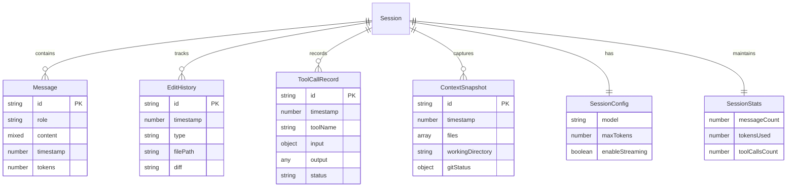
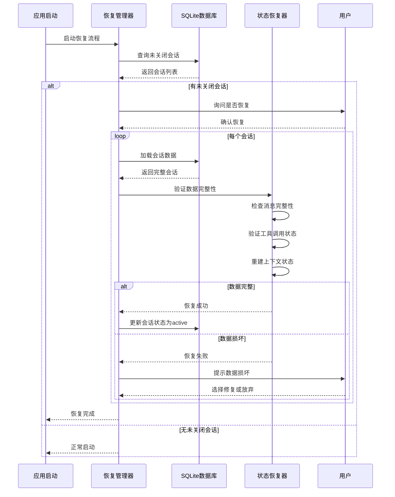

# 第4篇：会话与状态管理

## 引言

会话管理是 Claude Code 的"记忆系统"，负责保存对话历史、上下文状态、用户偏好等关键信息。良好的会话管理能够实现对话的连续性、崩溃后的恢复、以及跨设备的同步。本文将深入探讨 Claude Code 的会话与状态管理实现。

### 为什么需要会话管理？

1. **对话连续性**：保持多轮对话的上下文和状态
2. **崩溃恢复**：意外中断后能够恢复工作状态
3. **历史回溯**：查看和恢复历史对话
4. **性能优化**：通过缓存避免重复计算
5. **用户体验**：无缝的跨会话体验

### 状态管理的挑战

- ⚠️ 数据一致性问题（并发写入）
- ⚠️ 存储空间管理（历史积累）
- ⚠️ 隐私和安全（敏感信息）
- ⚠️ 性能优化（大量数据读写）
- ⚠️ 跨平台兼容性


## 二、会话数据结构

### 2.1 TypeScript 接口定义

```typescript
/**
 * 消息内容类型
 */
type MessageContent = string | Array<{
  type: 'text' | 'tool_use' | 'tool_result';
  text?: string;
  id?: string;
  name?: string;
  input?: Record<string, any>;
  content?: string;
  is_error?: boolean;
}>;

/**
 * 单条消息
 */
interface Message {
  id: string;                    // 消息唯一ID
  role: 'user' | 'assistant' | 'system'; // 角色
  content: MessageContent;       // 消息内容
  timestamp: number;             // 时间戳
  tokens?: number;               // Token数量
  metadata?: {
    model?: string;              // 使用的模型
    stop_reason?: string;        // 停止原因
    usage?: {                    // Token使用情况
      input_tokens: number;
      output_tokens: number;
    };
  };
}

/**
 * 编辑历史记录
 */
interface EditHistory {
  id: string;                    // 编辑ID
  timestamp: number;             // 编辑时间
  type: 'create' | 'update' | 'delete'; // 操作类型
  filePath: string;              // 文件路径
  oldContent?: string;           // 旧内容（用于回滚）
  newContent?: string;           // 新内容
  diff?: string;                 // Diff信息
}

/**
 * 工具调用记录
 */
interface ToolCallRecord {
  id: string;                    // 调用ID
  timestamp: number;             // 调用时间
  toolName: string;              // 工具名称
  input: Record<string, any>;    // 输入参数
  output?: any;                  // 输出结果
  error?: string;                // 错误信息
  duration?: number;             // 执行时长(ms)
  status: 'pending' | 'success' | 'error'; // 状态
}

/**
 * 上下文快照
 */
interface ContextSnapshot {
  id: string;                    // 快照ID
  timestamp: number;             // 创建时间
  files: Array<{                 // 相关文件
    path: string;
    lastModified: number;
    size: number;
    hash?: string;               // 文件哈希值
  }>;
  workingDirectory: string;      // 工作目录
  gitStatus?: {                  // Git状态
    branch: string;
    uncommittedChanges: number;
    untrackedFiles: number;
  };
  environmentVars?: Record<string, string>; // 环境变量
}

/**
 * 会话配置
 */
interface SessionConfig {
  model: string;                 // AI模型
  maxTokens: number;             // 最大Token数
  temperature: number;           // 温度参数
  enableStreaming: boolean;      // 是否启用流式响应
  enableToolCalling: boolean;    // 是否启用工具调用
  maxToolCallDepth: number;      // 工具调用最大深度
  autoSave: boolean;             // 是否自动保存
  autoSaveInterval: number;      // 自动保存间隔(ms)
}

/**
 * 会话统计信息
 */
interface SessionStats {
  messageCount: number;          // 消息总数
  tokensUsed: number;            // Token总消耗
  toolCallsCount: number;        // 工具调用次数
  filesModified: number;         // 修改的文件数
  startTime: number;             // 开始时间
  lastActiveTime: number;        // 最后活跃时间
  totalDuration: number;         // 总时长(ms)
}

/**
 * 完整会话数据结构
 */
interface Session {
  // 基本信息
  id: string;                    // 会话唯一ID
  createdAt: Date;               // 创建时间
  lastActiveAt: Date;            // 最后活跃时间
  status: SessionStatus;         // 当前状态

  // 元数据
  metadata: {
    workspaceRoot: string;       // 工作区根目录
    projectName?: string;        // 项目名称
    gitBranch?: string;          // Git分支
    userId?: string;             // 用户ID
    deviceId?: string;           // 设备ID
    tags?: string[];             // 标签
  };

  // 对话数据
  messages: Message[];           // 消息历史
  systemPrompt?: string;         // 系统提示词

  // 上下文数据
  context: {
    files: string[];             // 相关文件列表
    recentEdits: EditHistory[];  // 最近编辑
    snapshots: ContextSnapshot[]; // 上下文快照
  };

  // 工具调用记录
  toolCalls: ToolCallRecord[];

  // 配置
  config: SessionConfig;

  // 统计信息
  stats: SessionStats;

  // 其他状态
  isPersisted: boolean;          // 是否已持久化
  isDirty: boolean;              // 是否有未保存的更改
}

export {
  Message,
  MessageContent,
  EditHistory,
  ToolCallRecord,
  ContextSnapshot,
  SessionConfig,
  SessionStats,
  Session
};
```

### 2.2 数据关系图




## 四、会话恢复机制

### 4.1 崩溃恢复流程



### 4.2 恢复管理器实现

```typescript
/**
 * 会话恢复管理器
 */
class SessionRecoveryManager {
  private persistence: SessionPersistence;

  constructor(persistence: SessionPersistence) {
    this.persistence = persistence;
  }

  /**
   * 启动时自动恢复
   */
  async autoRecover(): Promise<Session[]> {
    console.log('🔍 检查未关闭的会话...');

    // 查找所有未正常关闭的会话
    const uncleanSessions = await this.persistence.listSessions({
      status: SessionStatus.ACTIVE
    });

    if (uncleanSessions.length === 0) {
      console.log('✅ 没有需要恢复的会话');
      return [];
    }

    console.log(`⚠️  发现 ${uncleanSessions.length} 个未关闭的会话`);

    // 询问用户是否恢复
    const shouldRecover = await this.promptUserForRecovery(uncleanSessions);

    if (!shouldRecover) {
      // 用户选择不恢复，将这些会话标记为已关闭
      for (const session of uncleanSessions) {
        await this.persistence.updateSessionStatus(session.id!, SessionStatus.CLOSED);
      }
      return [];
    }

    // 恢复会话
    const recovered: Session[] = [];

    for (const partialSession of uncleanSessions) {
      try {
        const session = await this.recoverSession(partialSession.id!);
        if (session) {
          recovered.push(session);
          console.log(`✅ 已恢复会话: ${session.id}`);
        }
      } catch (error) {
        console.error(`❌ 恢复会话失败 [${partialSession.id}]:`, error.message);
      }
    }

    return recovered;
  }

  /**
   * 恢复单个会话
   */
  async recoverSession(sessionId: string): Promise<Session | null> {
    console.log(`🔧 恢复会话: ${sessionId}`);

    // 1. 加载完整会话数据
    const session = await this.persistence.loadSession(sessionId);
    if (!session) {
      throw new Error('Session not found');
    }

    // 2. 验证数据完整性
    const validation = await this.validateSessionIntegrity(session);

    if (!validation.isValid) {
      console.warn(`⚠️  会话数据存在问题:`, validation.issues);

      // 尝试修复
      const fixed = await this.attemptFix(session, validation.issues);
      if (!fixed) {
        throw new Error('无法修复会话数据');
      }
    }

    // 3. 重建运行时状态
    await this.restoreRuntimeState(session);

    // 4. 更新会话状态
    session.status = SessionStatus.ACTIVE;
    session.lastActiveAt = new Date();
    await this.persistence.saveSession(session);

    return session;
  }

  /**
   * 验证会话数据完整性
   */
  private async validateSessionIntegrity(session: Session): Promise<{
    isValid: boolean;
    issues: string[];
  }> {
    const issues: string[] = [];

    // 1. 检查基本信息
    if (!session.id || !session.createdAt) {
      issues.push('缺少基本信息');
    }

    // 2. 检查消息完整性
    if (session.messages.length === 0) {
      issues.push('消息历史为空');
    } else {
      // 检查消息是否按时间顺序
      for (let i = 1; i < session.messages.length; i++) {
        if (session.messages[i].timestamp < session.messages[i - 1].timestamp) {
          issues.push('消息时间顺序错误');
          break;
        }
      }

      // 检查是否有孤立的工具调用（没有对应结果）
      const pendingToolCalls = session.messages.filter(
        msg => Array.isArray(msg.content) &&
        msg.content.some((block: any) => block.type === 'tool_use')
      );

      if (pendingToolCalls.length > 0) {
        issues.push(`存在 ${pendingToolCalls.length} 个未完成的工具调用`);
      }
    }

    // 3. 检查工具调用状态
    const pendingTools = session.toolCalls.filter(t => t.status === 'pending');
    if (pendingTools.length > 0) {
      issues.push(`存在 ${pendingTools.length} 个待处理的工具调用`);
    }

    // 4. 检查配置有效性
    if (!session.config || !session.config.model) {
      issues.push('配置信息不完整');
    }

    return {
      isValid: issues.length === 0,
      issues
    };
  }

  /**
   * 尝试修复数据问题
   */
  private async attemptFix(session: Session, issues: string[]): Promise<boolean> {
    console.log('🔧 尝试修复数据问题...');

    let fixed = true;

    for (const issue of issues) {
      if (issue.includes('未完成的工具调用')) {
        // 将未完成的工具调用标记为错误
        session.toolCalls = session.toolCalls.map(tool => {
          if (tool.status === 'pending') {
            return {
              ...tool,
              status: 'error' as const,
              error: 'Session crashed during execution'
            };
          }
          return tool;
        });
      } else if (issue.includes('消息时间顺序错误')) {
        // 重新按时间排序
        session.messages.sort((a, b) => a.timestamp - b.timestamp);
      } else if (issue.includes('配置信息不完整')) {
        // 使用默认配置
        session.config = {
          model: 'claude-3-5-sonnet-20250929',
          maxTokens: 8000,
          temperature: 0,
          enableStreaming: true,
          enableToolCalling: true,
          maxToolCallDepth: 5,
          autoSave: true,
          autoSaveInterval: 60000
        };
      } else {
        // 无法自动修复
        fixed = false;
      }
    }

    if (fixed) {
      console.log('✅ 数据问题已修复');
      // 保存修复后的数据
      await this.persistence.saveSession(session);
    } else {
      console.warn('❌ 部分问题无法自动修复');
    }

    return fixed;
  }

  /**
   * 重建运行时状态
   */
  private async restoreRuntimeState(session: Session): Promise<void> {
    // 1. 恢复上下文管理器状态
    // contextManager.restore(session.context);

    // 2. 恢复文件监听
    // fileWatcher.watchFiles(session.context.files);

    // 3. 重新加载工具定义
    // toolRegistry.reloadTools();

    console.log('✅ 运行时状态已恢复');
  }

  /**
   * 提示用户是否恢复
   */
  private async promptUserForRecovery(sessions: Array<Partial<Session>>): Promise<boolean> {
    // 这里可以使用inquirer等库实现交互式提示
    // 简化版本：直接返回true

    console.log('\n未关闭的会话列表:');
    sessions.forEach((session, index) => {
      console.log(`${index + 1}. ${session.metadata?.projectName || session.id}`);
      console.log(`   工作区: ${session.metadata?.workspaceRoot}`);
      console.log(`   最后活跃: ${session.lastActiveAt?.toLocaleString()}`);
    });

    // 实际应用中应该询问用户
    // const answer = await inquirer.prompt([...]);
    // return answer.shouldRecover;

    return true;  // 默认恢复
  }

  /**
   * 创建检查点（定期保存）
   */
  async createCheckpoint(session: Session): Promise<void> {
    console.log(`💾 创建检查点: ${session.id}`);

    // 创建上下文快照
    const snapshot: ContextSnapshot = {
      id: uuidv4(),
      timestamp: Date.now(),
      files: session.context.files.map(f => ({
        path: f,
        lastModified: Date.now(),
        size: 0  // 实际实现中应该获取真实文件信息
      })),
      workingDirectory: session.metadata.workspaceRoot
    };

    // 保存快照到数据库
    const db = (this.persistence as any).db;
    db.prepare(`
      INSERT INTO context_snapshots (id, session_id, timestamp, context_data)
      VALUES (?, ?, ?, ?)
    `).run(
      snapshot.id,
      session.id,
      snapshot.timestamp,
      JSON.stringify(snapshot)
    );

    // 保存完整会话
    await this.persistence.saveSession(session);

    console.log('✅ 检查点已创建');
  }

  /**
   * 回滚到检查点
   */
  async rollbackToCheckpoint(sessionId: string, checkpointId: string): Promise<Session | null> {
    console.log(`⏮️  回滚到检查点: ${checkpointId}`);

    // 加载检查点时的会话状态
    // 这里需要从快照中重建会话
    // 实际实现会更复杂

    const session = await this.persistence.loadSession(sessionId);
    if (!session) {
      return null;
    }

    // 找到对应的快照
    const snapshot = session.context.snapshots.find(s => s.id === checkpointId);
    if (!snapshot) {
      throw new Error('Checkpoint not found');
    }

    // 恢复到该快照的状态
    // ...

    console.log('✅ 已回滚到检查点');
    return session;
  }
}

export { SessionRecoveryManager };
```

### 4.3 断点续传实现

```typescript
/**
 * 长时间运行任务的断点续传
 */
class ResumableTaskManager {
  private persistence: SessionPersistence;

  constructor(persistence: SessionPersistence) {
    this.persistence = persistence;
  }

  /**
   * 保存任务进度
   */
  async saveProgress(
    sessionId: string,
    taskId: string,
    progress: {
      currentStep: number;
      totalSteps: number;
      completedWork: any;
      remainingWork: any;
      intermediateResults: any;
    }
  ): Promise<void> {
    // 将进度保存为工具调用记录
    const record: ToolCallRecord = {
      id: taskId,
      timestamp: Date.now(),
      toolName: '_task_progress',  // 特殊工具名
      input: {
        currentStep: progress.currentStep,
        totalSteps: progress.totalSteps,
        completedWork: progress.completedWork,
        remainingWork: progress.remainingWork
      },
      output: progress.intermediateResults,
      status: 'pending',
      duration: 0
    };

    const db = (this.persistence as any).db;
    db.prepare(`
      INSERT OR REPLACE INTO tool_calls (
        id, session_id, timestamp, tool_name, input, output, status, duration
      ) VALUES (?, ?, ?, ?, ?, ?, ?, ?)
    `).run(
      record.id,
      sessionId,
      record.timestamp,
      record.toolName,
      JSON.stringify(record.input),
      JSON.stringify(record.output),
      record.status,
      record.duration
    );

    console.log(`💾 任务进度已保存: ${taskId} (${progress.currentStep}/${progress.totalSteps})`);
  }

  /**
   * 恢复任务进度
   */
  async loadProgress(sessionId: string, taskId: string): Promise<any | null> {
    const db = (this.persistence as any).db;

    const record = db.prepare(`
      SELECT * FROM tool_calls
      WHERE id = ? AND session_id = ? AND tool_name = '_task_progress'
    `).get(taskId, sessionId) as any;

    if (!record) {
      return null;
    }

    return {
      currentStep: JSON.parse(record.input).currentStep,
      totalSteps: JSON.parse(record.input).totalSteps,
      completedWork: JSON.parse(record.input).completedWork,
      remainingWork: JSON.parse(record.input).remainingWork,
      intermediateResults: JSON.parse(record.output || '{}')
    };
  }

  /**
   * 续传执行任务
   */
  async resumeTask(
    sessionId: string,
    taskId: string,
    executor: (progress: any) => Promise<any>
  ): Promise<any> {
    // 1. 加载进度
    const progress = await this.loadProgress(sessionId, taskId);

    if (!progress) {
      console.log('未找到任务进度，从头开始');
      return executor(null);
    }

    console.log(`▶️  从第 ${progress.currentStep}/${progress.totalSteps} 步继续`);

    // 2. 从中断点继续执行
    return executor(progress);
  }

  /**
   * 清除任务进度
   */
  async clearProgress(sessionId: string, taskId: string): Promise<void> {
    const db = (this.persistence as any).db;

    db.prepare(`
      DELETE FROM tool_calls
      WHERE id = ? AND session_id = ? AND tool_name = '_task_progress'
    `).run(taskId, sessionId);

    console.log(`🗑️  任务进度已清除: ${taskId}`);
  }
}

export { ResumableTaskManager };
```


## 六、会话清理和归档

### 6.1 自动清理策略

```typescript
/**
 * 会话清理管理器
 */
class SessionCleanupManager {
  private persistence: SessionPersistence;
  private cleanupIntervalMs: number = 60 * 60 * 1000; // 1小时
  private timer?: NodeJS.Timer;

  constructor(persistence: SessionPersistence) {
    this.persistence = persistence;
  }

  /**
   * 启动自动清理
   */
  startAutoCleanup(): void {
    console.log('🧹 启动自动清理任务');

    this.timer = setInterval(async () => {
      await this.runCleanup();
    }, this.cleanupIntervalMs);
  }

  /**
   * 停止自动清理
   */
  stopAutoCleanup(): void {
    if (this.timer) {
      clearInterval(this.timer);
      this.timer = undefined;
      console.log('🛑 自动清理已停止');
    }
  }

  /**
   * 执行清理任务
   */
  async runCleanup(): Promise<void> {
    console.log('🧹 开始清理会话...');

    try {
      // 1. 清理超时会话（7天未活跃）
      await this.cleanupInactiveSessions(7);

      // 2. 归档已关闭会话（30天前）
      await this.archiveClosedSessions(30);

      // 3. 压缩历史消息（保留最近100条）
      await this.compressOldMessages(100);

      // 4. 删除临时快照（保留最近5个）
      await this.cleanupOldSnapshots(5);

      console.log('✅ 清理完成');
    } catch (error) {
      console.error('❌ 清理失败:', error);
    }
  }

  /**
   * 清理不活跃会话
   */
  private async cleanupInactiveSessions(inactiveDays: number): Promise<void> {
    const cutoffTime = Date.now() - (inactiveDays * 24 * 60 * 60 * 1000);

    const db = (this.persistence as any).db;
    const result = db.prepare(`
      UPDATE sessions
      SET status = 'closed'
      WHERE status IN ('active', 'suspended') AND last_active_at < ?
    `).run(cutoffTime);

    if (result.changes > 0) {
      console.log(`  ✅ 已关闭 ${result.changes} 个不活跃会话`);
    }
  }

  /**
   * 归档已关闭会话
   */
  private async archiveClosedSessions(olderThanDays: number): Promise<void> {
    const cutoffTime = Date.now() - (olderThanDays * 24 * 60 * 60 * 1000);

    // 1. 查找需要归档的会话
    const db = (this.persistence as any).db;
    const sessions = db.prepare(`
      SELECT id FROM sessions
      WHERE status = 'closed' AND last_active_at < ?
    `).all(cutoffTime) as any[];

    if (sessions.length === 0) {
      return;
    }

    console.log(`  📦 归档 ${sessions.length} 个会话...`);

    // 2. 导出为JSON文件
    for (const { id } of sessions) {
      await this.exportToArchive(id);
    }

    // 3. 从数据库删除
    const result = db.prepare(`
      DELETE FROM sessions WHERE status = 'closed' AND last_active_at < ?
    `).run(cutoffTime);

    console.log(`  ✅ 已归档并删除 ${result.changes} 个会话`);
  }

  /**
   * 导出会话到归档文件
   */
  private async exportToArchive(sessionId: string): Promise<void> {
    const session = await this.persistence.loadSession(sessionId);
    if (!session) {
      return;
    }

    // 归档目录: ~/.claude-code/archives/YYYY-MM/
    const archiveDir = path.join(
      process.env.HOME || process.env.USERPROFILE || '',
      '.claude-code',
      'archives',
      new Date().toISOString().slice(0, 7) // YYYY-MM
    );

    if (!fs.existsSync(archiveDir)) {
      fs.mkdirSync(archiveDir, { recursive: true });
    }

    // 归档文件: session_{id}.json.gz
    const archivePath = path.join(archiveDir, `session_${sessionId}.json.gz`);

    // 压缩并保存
    const json = JSON.stringify(session, null, 2);
    const compressed = zlib.gzipSync(json);
    fs.writeFileSync(archivePath, compressed);

    console.log(`  📦 已归档: ${archivePath}`);
  }

  /**
   * 压缩旧消息
   */
  private async compressOldMessages(keepRecentCount: number): Promise<void> {
    const db = (this.persistence as any).db;

    // 对每个活跃会话，只保留最近N条消息
    const sessions = db.prepare(`
      SELECT id FROM sessions WHERE status IN ('active', 'paused', 'suspended')
    `).all() as any[];

    let totalDeleted = 0;

    for (const { id } of sessions) {
      const result = db.prepare(`
        DELETE FROM messages
        WHERE session_id = ? AND id NOT IN (
          SELECT id FROM messages
          WHERE session_id = ?
          ORDER BY timestamp DESC
          LIMIT ?
        )
      `).run(id, id, keepRecentCount);

      totalDeleted += result.changes;
    }

    if (totalDeleted > 0) {
      console.log(`  ✅ 已删除 ${totalDeleted} 条旧消息`);
    }
  }

  /**
   * 清理旧快照
   */
  private async cleanupOldSnapshots(keepRecentCount: number): Promise<void> {
    const db = (this.persistence as any).db;

    const sessions = db.prepare(`
      SELECT id FROM sessions WHERE status IN ('active', 'paused', 'suspended')
    `).all() as any[];

    let totalDeleted = 0;

    for (const { id } of sessions) {
      const result = db.prepare(`
        DELETE FROM context_snapshots
        WHERE session_id = ? AND id NOT IN (
          SELECT id FROM context_snapshots
          WHERE session_id = ?
          ORDER BY timestamp DESC
          LIMIT ?
        )
      `).run(id, id, keepRecentCount);

      totalDeleted += result.changes;
    }

    if (totalDeleted > 0) {
      console.log(`  ✅ 已删除 ${totalDeleted} 个旧快照`);
    }
  }
}

export { SessionCleanupManager };
```

### 6.2 归档格式和导入导出

```typescript
/**
 * 会话导入导出管理器
 */
class SessionImportExportManager {
  private persistence: SessionPersistence;

  constructor(persistence: SessionPersistence) {
    this.persistence = persistence;
  }

  /**
   * 导出会话为JSON文件
   */
  async exportSession(sessionId: string, outputPath: string): Promise<void> {
    console.log(`📤 导出会话: ${sessionId}`);

    // 1. 加载完整会话
    const session = await this.persistence.loadSession(sessionId);
    if (!session) {
      throw new Error(`Session ${sessionId} not found`);
    }

    // 2. 准备导出数据
    const exportData = {
      version: '1.0.0',
      exportedAt: new Date().toISOString(),
      session: {
        ...session,
        // 转换Date为ISO字符串
        createdAt: session.createdAt.toISOString(),
        lastActiveAt: session.lastActiveAt.toISOString()
      }
    };

    // 3. 写入文件
    fs.writeFileSync(outputPath, JSON.stringify(exportData, null, 2), 'utf-8');

    console.log(`✅ 会话已导出到: ${outputPath}`);
  }

  /**
   * 导入会话从JSON文件
   */
  async importSession(inputPath: string): Promise<Session> {
    console.log(`📥 导入会话: ${inputPath}`);

    // 1. 读取文件
    const content = fs.readFileSync(inputPath, 'utf-8');
    const exportData = JSON.parse(content);

    // 2. 验证版本
    if (exportData.version !== '1.0.0') {
      throw new Error(`Unsupported version: ${exportData.version}`);
    }

    // 3. 恢复会话对象
    const session: Session = {
      ...exportData.session,
      createdAt: new Date(exportData.session.createdAt),
      lastActiveAt: new Date(exportData.session.lastActiveAt),
      // 生成新的ID（避免冲突）
      id: uuidv4(),
      status: SessionStatus.CLOSED  // 导入的会话默认为关闭状态
    };

    // 4. 保存到数据库
    await this.persistence.saveSession(session);

    console.log(`✅ 会话已导入: ${session.id}`);
    return session;
  }

  /**
   * 批量导出所有会话
   */
  async exportAllSessions(outputDir: string): Promise<void> {
    console.log(`📤 批量导出所有会话到: ${outputDir}`);

    if (!fs.existsSync(outputDir)) {
      fs.mkdirSync(outputDir, { recursive: true });
    }

    // 列出所有会话
    const sessions = await this.persistence.listSessions();

    for (const partialSession of sessions) {
      const outputPath = path.join(
        outputDir,
        `session_${partialSession.id}_${Date.now()}.json`
      );

      try {
        await this.exportSession(partialSession.id!, outputPath);
      } catch (error) {
        console.error(`❌ 导出失败 [${partialSession.id}]:`, error.message);
      }
    }

    console.log(`✅ 批量导出完成，共 ${sessions.length} 个会话`);
  }

  /**
   * 从归档恢复会话
   */
  async restoreFromArchive(archivePath: string): Promise<Session> {
    console.log(`📦 从归档恢复: ${archivePath}`);

    // 如果是gzip压缩文件
    let content: string;
    if (archivePath.endsWith('.gz')) {
      const compressed = fs.readFileSync(archivePath);
      const decompressed = zlib.gunzipSync(compressed);
      content = decompressed.toString('utf-8');
    } else {
      content = fs.readFileSync(archivePath, 'utf-8');
    }

    // 解析并导入
    const data = JSON.parse(content);

    const session: Session = {
      ...data,
      createdAt: new Date(data.createdAt),
      lastActiveAt: new Date(data.lastActiveAt)
    };

    await this.persistence.saveSession(session);

    console.log(`✅ 会话已从归档恢复: ${session.id}`);
    return session;
  }
}

export { SessionImportExportManager };
```


## 八、最佳实践

### 8.1 会话管理建议

1. **频繁保存**
   - 使用自动保存机制
   - 每次关键操作后手动保存
   - 设置合理的保存间隔（推荐1分钟）

2. **定期清理**
   - 启用自动清理
   - 定期归档旧会话
   - 压缩历史消息

3. **资源控制**
   - 限制并发会话数
   - 监控内存使用
   - 及时释放不用的会话

4. **错误处理**
   - 实现完善的错误恢复机制
   - 保存多个检查点
   - 提供手动恢复选项

5. **隐私保护**
   - 过滤敏感信息
   - 加密存储（如需要）
   - 定期清理历史

### 8.2 性能优化技巧

```typescript
/**
 * 性能优化示例
 */

// 1. 批量插入消息
async function batchInsertMessages(messages: Message[]): Promise<void> {
  const db = persistence.db;
  const transaction = db.transaction(() => {
    const insert = db.prepare(`
      INSERT INTO messages (id, session_id, role, content, timestamp)
      VALUES (?, ?, ?, ?, ?)
    `);

    for (const msg of messages) {
      insert.run(msg.id, sessionId, msg.role, msg.content, msg.timestamp);
    }
  });

  transaction();
}

// 2. 使用索引优化查询
// 已在Schema中定义，确保查询使用索引
const recentMessages = db.prepare(`
  SELECT * FROM messages
  WHERE session_id = ?
  ORDER BY timestamp DESC
  LIMIT 100
`).all(sessionId);

// 3. 延迟加载大数据
async function loadSessionLazy(sessionId: string): Promise<Session> {
  // 先加载基本信息
  const session = await loadSessionBasic(sessionId);

  // 按需加载消息
  session.loadMessages = async () => {
    return await loadMessages(sessionId);
  };

  return session;
}

// 4. 使用内存缓存
const sessionCache = new Map<string, Session>();

async function getCachedSession(sessionId: string): Promise<Session> {
  if (sessionCache.has(sessionId)) {
    return sessionCache.get(sessionId)!;
  }

  const session = await loadSession(sessionId);
  sessionCache.set(sessionId, session);
  return session;
}
```


## 十、实战练习

### 练习1: 实现会话列表展示

**目标**: 创建一个CLI工具，展示所有会话列表

```typescript
async function listSessions() {
  const persistence = new SessionPersistence();
  const sessions = await persistence.listSessions({ limit: 20 });

  console.log('\n会话列表:\n');
  console.log('ID\t\t\t\t状态\t最后活跃\t\t消息数');
  console.log('─'.repeat(80));

  for (const session of sessions) {
    console.log(
      `${session.id!.slice(0, 8)}\t` +
      `${session.status}\t` +
      `${session.lastActiveAt?.toLocaleString()}\t` +
      `${session.stats?.messageCount || 0}`
    );
  }

  console.log();
}
```

### 练习2: 实现会话搜索

**目标**: 根据关键词搜索会话中的消息

```typescript
async function searchSessions(keyword: string): Promise<any[]> {
  const persistence = new SessionPersistence();
  const db = (persistence as any).db;

  const results = db.prepare(`
    SELECT
      m.id,
      m.session_id,
      m.role,
      m.content,
      m.timestamp,
      s.workspace_root,
      s.project_name
    FROM messages m
    JOIN sessions s ON m.session_id = s.id
    WHERE m.content LIKE ?
    ORDER BY m.timestamp DESC
    LIMIT 50
  `).all(`%${keyword}%`);

  return results;
}

// 使用示例
const results = await searchSessions('bug fix');
console.log(`找到 ${results.length} 条相关消息`);
```

### 练习3: 实现会话统计仪表板

**目标**: 展示会话使用统计

```typescript
async function showDashboard() {
  const persistence = new SessionPersistence();
  const stats = persistence.getStats();

  console.log('\n📊 会话统计仪表板\n');
  console.log('─'.repeat(50));
  console.log(`总会话数: ${stats.totalSessions}`);
  console.log(`活跃会话: ${stats.activeSessions}`);
  console.log(`总消息数: ${stats.totalMessages}`);
  console.log(`数据库大小: ${(stats.dbSize / 1024 / 1024).toFixed(2)} MB`);
  console.log('─'.repeat(50));

  // 展示最近活跃会话
  const recentSessions = await persistence.listSessions({ limit: 5 });
  console.log('\n最近活跃的5个会话:');
  recentSessions.forEach((session, index) => {
    console.log(
      `${index + 1}. ${session.metadata?.projectName || 'Unnamed'} ` +
      `(${session.stats?.messageCount || 0} 条消息)`
    );
  });

  console.log();
}
```


**如果这篇文章对你有帮助，欢迎分享给更多的朋友！**
