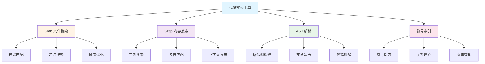
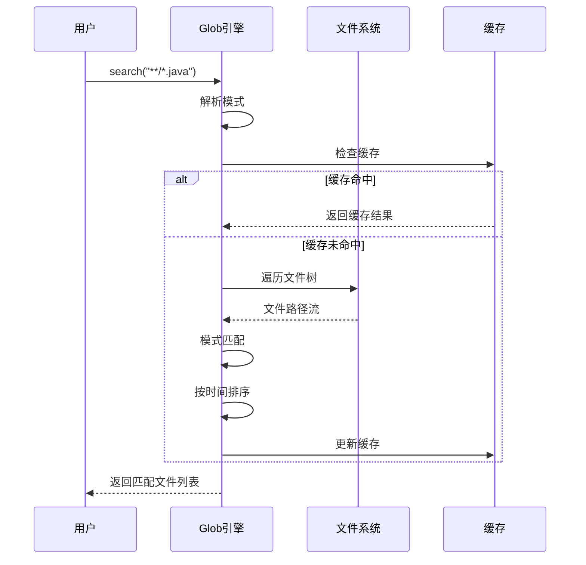
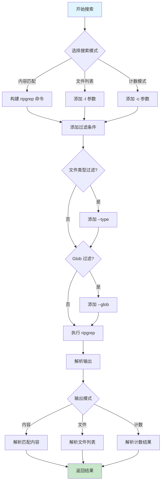
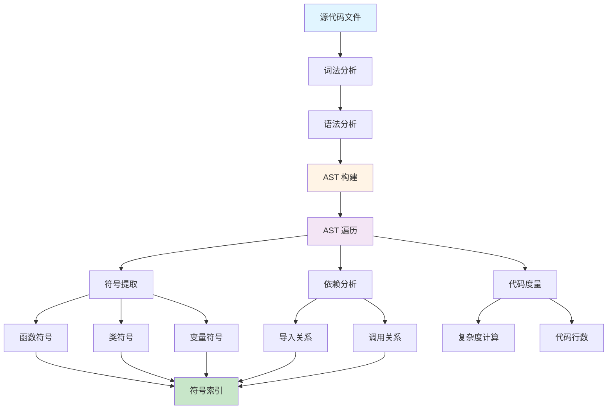
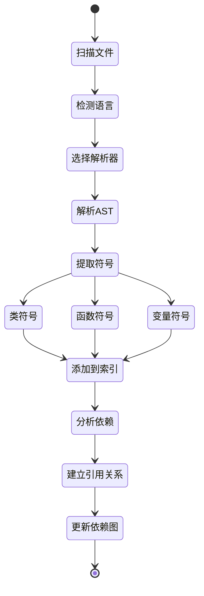
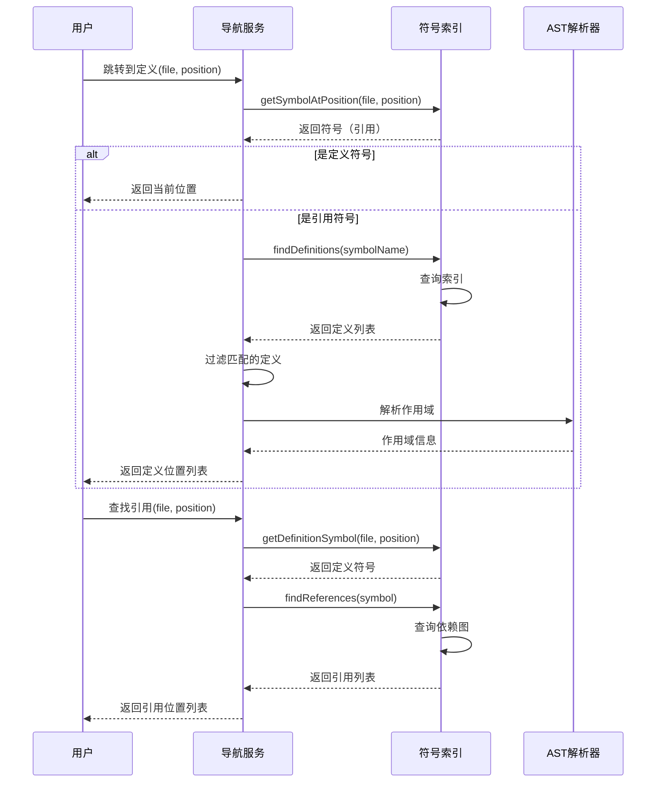
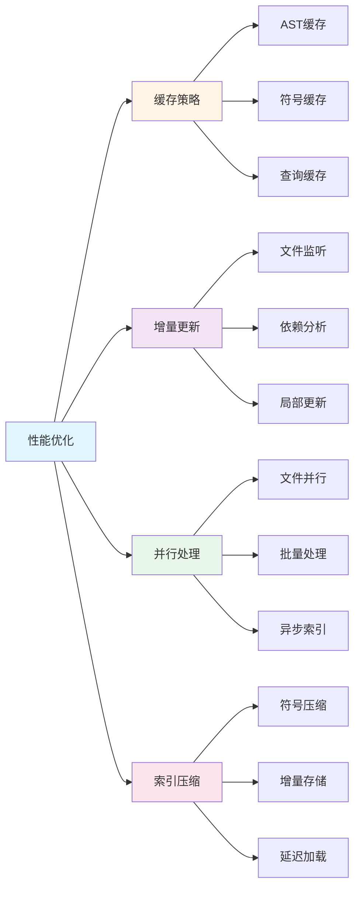

# 代码搜索与分析工具

## 1. 引言

代码搜索与分析是 AI 辅助编程工具的核心能力之一。Claude Code 提供了强大的代码搜索和分析工具，能够快速定位代码、理解项目结构、分析代码关系。本文将深入探讨这些工具的实现原理和最佳实践。

### 1.1 为什么需要代码搜索工具

在大型代码库中，开发者面临以下挑战：

- **快速定位**：在数万个文件中找到特定代码
- **理解依赖**：分析函数、类之间的调用关系
- **重构支持**：查找所有引用，确保修改完整
- **代码审查**：快速了解代码变更影响范围

### 1.2 Claude Code 的搜索工具体系



### 1.3 工具对比

| 工具 | 用途 | 性能 | 适用场景 |
|------|------|------|----------|
| Glob | 文件名搜索 | 极快 | 查找特定文件 |
| Grep | 内容搜索 | 快 | 查找代码片段 |
| AST | 语法分析 | 中等 | 理解代码结构 |
| 符号索引 | 符号查询 | 快 | 代码导航 |

## 2. Glob 工具实现

Glob 是一个基于文件名模式匹配的快速搜索工具。

### 2.1 核心实现

```java
public class GlobSearchEngine {
    private final Path workspaceRoot;
    private final FileCache fileCache;

    public GlobSearchEngine(Path workspaceRoot) {
        this.workspaceRoot = workspaceRoot;
        this.fileCache = new FileCache();
    }

    /**
     * 执行 Glob 搜索
     * @param pattern Glob 模式，如 "**/*.java"
     * @param path 搜索路径
     * @return 匹配的文件列表，按修改时间排序
     */
    public List<Path> search(String pattern, Path path) {
        Path searchPath = path != null ? path : workspaceRoot;

        // 解析 Glob 模式
        PathMatcher matcher = FileSystems.getDefault()
            .getPathMatcher("glob:" + pattern);

        List<FileInfo> results = new ArrayList<>();

        try {
            Files.walkFileTree(searchPath, new SimpleFileVisitor<Path>() {
                @Override
                public FileVisitResult visitFile(Path file, BasicFileAttributes attrs) {
                    // 相对路径匹配
                    Path relativePath = searchPath.relativize(file);

                    if (matcher.matches(relativePath)) {
                        results.add(new FileInfo(
                            file,
                            attrs.lastModifiedTime().toMillis()
                        ));
                    }

                    return FileVisitResult.CONTINUE;
                }

                @Override
                public FileVisitResult preVisitDirectory(Path dir, BasicFileAttributes attrs) {
                    // 跳过隐藏目录和 node_modules
                    String dirName = dir.getFileName().toString();
                    if (dirName.startsWith(".") ||
                        dirName.equals("node_modules") ||
                        dirName.equals("target") ||
                        dirName.equals("build")) {
                        return FileVisitResult.SKIP_SUBTREE;
                    }
                    return FileVisitResult.CONTINUE;
                }
            });
        } catch (IOException e) {
            throw new SearchException("Glob search failed", e);
        }

        // 按修改时间降序排序
        results.sort((a, b) -> Long.compare(b.lastModified, a.lastModified));

        return results.stream()
            .map(info -> info.path)
            .collect(Collectors.toList());
    }

    /**
     * 模式匹配优化
     */
    public List<Path> searchOptimized(String pattern, Path path) {
        // 分析模式，优化搜索策略
        PatternAnalysis analysis = analyzePattern(pattern);

        if (analysis.hasFixedPrefix()) {
            // 如果有固定前缀，先缩小搜索范围
            Path prefixPath = path.resolve(analysis.getPrefix());
            if (Files.exists(prefixPath)) {
                return search(analysis.getRemaining(), prefixPath);
            }
        }

        return search(pattern, path);
    }

    private static class FileInfo {
        final Path path;
        final long lastModified;

        FileInfo(Path path, long lastModified) {
            this.path = path;
            this.lastModified = lastModified;
        }
    }
}
```

### 2.2 模式匹配算法

```java
public class PatternMatcher {
    /**
     * 解析 Glob 模式
     */
    public static class PatternAnalysis {
        private final String prefix;
        private final String pattern;
        private final boolean recursive;

        public PatternAnalysis(String pattern) {
            this.pattern = pattern;

            // 检测递归模式 (**)
            this.recursive = pattern.contains("**");

            // 提取固定前缀
            int wildcardIndex = pattern.indexOf('*');
            if (wildcardIndex > 0) {
                this.prefix = pattern.substring(0, wildcardIndex);
            } else {
                this.prefix = "";
            }
        }

        public boolean hasFixedPrefix() {
            return !prefix.isEmpty() && !prefix.contains("*");
        }

        public String getPrefix() {
            return prefix;
        }

        public String getRemaining() {
            return pattern.substring(prefix.length());
        }
    }

    /**
     * 通配符匹配算法
     */
    public static boolean wildcardMatch(String text, String pattern) {
        int textLen = text.length();
        int patternLen = pattern.length();

        boolean[][] dp = new boolean[textLen + 1][patternLen + 1];
        dp[0][0] = true;

        // 初始化第一行（处理开头的 *）
        for (int j = 1; j <= patternLen; j++) {
            if (pattern.charAt(j - 1) == '*') {
                dp[0][j] = dp[0][j - 1];
            }
        }

        // 动态规划填表
        for (int i = 1; i <= textLen; i++) {
            for (int j = 1; j <= patternLen; j++) {
                char textChar = text.charAt(i - 1);
                char patternChar = pattern.charAt(j - 1);

                if (patternChar == '*') {
                    // * 可以匹配 0 个或多个字符
                    dp[i][j] = dp[i][j - 1] || dp[i - 1][j];
                } else if (patternChar == '?' || patternChar == textChar) {
                    // ? 匹配单个字符，或字符完全相同
                    dp[i][j] = dp[i - 1][j - 1];
                }
            }
        }

        return dp[textLen][patternLen];
    }
}
```

### 2.3 Glob 搜索流程



## 3. Grep 工具实现

Grep 基于 ripgrep 构建，提供强大的内容搜索能力。

### 3.1 核心实现

```java
public class GrepSearchEngine {
    private final Path workspaceRoot;
    private final RipgrepWrapper ripgrep;

    public GrepSearchEngine(Path workspaceRoot) {
        this.workspaceRoot = workspaceRoot;
        this.ripgrep = new RipgrepWrapper();
    }

    /**
     * 执行 Grep 搜索
     */
    public GrepResult search(GrepOptions options) {
        List<String> command = buildCommand(options);

        ProcessResult result = ripgrep.execute(command);

        return parseResult(result, options.getOutputMode());
    }

    /**
     * 构建 ripgrep 命令
     */
    private List<String> buildCommand(GrepOptions options) {
        List<String> command = new ArrayList<>();
        command.add("rg");

        // 基础选项
        command.add(options.getPattern());

        // 输出模式
        switch (options.getOutputMode()) {
            case CONTENT:
                command.add("--with-filename");
                if (options.isShowLineNumbers()) {
                    command.add("-n");
                }
                break;
            case FILES_WITH_MATCHES:
                command.add("-l");
                break;
            case COUNT:
                command.add("-c");
                break;
        }

        // 上下文行数
        if (options.getContextBefore() > 0) {
            command.add("-B");
            command.add(String.valueOf(options.getContextBefore()));
        }
        if (options.getContextAfter() > 0) {
            command.add("-A");
            command.add(String.valueOf(options.getContextAfter()));
        }
        if (options.getContext() > 0) {
            command.add("-C");
            command.add(String.valueOf(options.getContext()));
        }

        // 大小写敏感
        if (options.isCaseInsensitive()) {
            command.add("-i");
        }

        // 文件类型过滤
        if (options.getType() != null) {
            command.add("--type");
            command.add(options.getType());
        }

        // Glob 过滤
        if (options.getGlob() != null) {
            command.add("--glob");
            command.add(options.getGlob());
        }

        // 多行匹配
        if (options.isMultiline()) {
            command.add("-U");
            command.add("--multiline-dotall");
        }

        // 搜索路径
        if (options.getPath() != null) {
            command.add(options.getPath().toString());
        } else {
            command.add(workspaceRoot.toString());
        }

        return command;
    }

    /**
     * 解析搜索结果
     */
    private GrepResult parseResult(ProcessResult result, OutputMode mode) {
        GrepResult grepResult = new GrepResult();

        String output = result.getStdout();
        String[] lines = output.split("\n");

        switch (mode) {
            case CONTENT:
                grepResult.setMatches(parseContentMatches(lines));
                break;
            case FILES_WITH_MATCHES:
                grepResult.setFiles(parseFileMatches(lines));
                break;
            case COUNT:
                grepResult.setCounts(parseCountMatches(lines));
                break;
        }

        return grepResult;
    }

    /**
     * 解析内容匹配
     */
    private List<ContentMatch> parseContentMatches(String[] lines) {
        List<ContentMatch> matches = new ArrayList<>();
        String currentFile = null;

        for (String line : lines) {
            // ripgrep 输出格式: file:line:content
            String[] parts = line.split(":", 3);
            if (parts.length >= 3) {
                String file = parts[0];
                int lineNum = Integer.parseInt(parts[1]);
                String content = parts[2];

                matches.add(new ContentMatch(file, lineNum, content));
            }
        }

        return matches;
    }
}
```

### 3.2 高级搜索功能

```java
public class AdvancedGrepFeatures {
    /**
     * 正则表达式搜索
     */
    public List<RegexMatch> regexSearch(String pattern, Path path) {
        GrepOptions options = GrepOptions.builder()
            .pattern(pattern)
            .path(path)
            .outputMode(OutputMode.CONTENT)
            .showLineNumbers(true)
            .build();

        GrepResult result = grepEngine.search(options);

        // 提取正则匹配组
        Pattern regex = Pattern.compile(pattern);
        List<RegexMatch> matches = new ArrayList<>();

        for (ContentMatch match : result.getMatches()) {
            Matcher matcher = regex.matcher(match.getContent());
            if (matcher.find()) {
                RegexMatch regexMatch = new RegexMatch(
                    match.getFile(),
                    match.getLineNumber(),
                    match.getContent(),
                    extractGroups(matcher)
                );
                matches.add(regexMatch);
            }
        }

        return matches;
    }

    /**
     * 多行匹配
     */
    public List<MultilineMatch> multilineSearch(String pattern, Path path) {
        GrepOptions options = GrepOptions.builder()
            .pattern(pattern)
            .path(path)
            .multiline(true)
            .build();

        return grepEngine.search(options)
            .getMatches()
            .stream()
            .map(this::toMultilineMatch)
            .collect(Collectors.toList());
    }

    /**
     * 结构化搜索（查找函数定义）
     */
    public List<FunctionDefinition> findFunctions(String functionName, Path path) {
        // Java 函数模式
        String pattern = String.format(
            "(public|private|protected)?\\s+\\w+\\s+%s\\s*\\([^)]*\\)",
            Pattern.quote(functionName)
        );

        List<RegexMatch> matches = regexSearch(pattern, path);

        return matches.stream()
            .map(this::parseFunctionDefinition)
            .collect(Collectors.toList());
    }

    /**
     * 上下文搜索
     */
    public List<ContextMatch> searchWithContext(
            String pattern,
            Path path,
            int contextLines) {

        GrepOptions options = GrepOptions.builder()
            .pattern(pattern)
            .path(path)
            .context(contextLines)
            .outputMode(OutputMode.CONTENT)
            .showLineNumbers(true)
            .build();

        return grepEngine.search(options)
            .getMatches()
            .stream()
            .map(this::toContextMatch)
            .collect(Collectors.toList());
    }
}
```

### 3.3 Grep 搜索流程



## 4. AST 解析

抽象语法树（AST）解析是深度代码理解的基础。

### 4.1 AST 解析器接口

```java
public interface ASTParser {
    /**
     * 解析源代码文件
     */
    CompilationUnit parse(Path file) throws ParseException;

    /**
     * 解析代码字符串
     */
    CompilationUnit parse(String code) throws ParseException;

    /**
     * 获取支持的语言
     */
    Language getSupportedLanguage();
}

/**
 * 编译单元（AST 根节点）
 */
public class CompilationUnit {
    private final Path sourceFile;
    private final List<ImportDeclaration> imports;
    private final List<TypeDeclaration> types;
    private final PackageDeclaration packageDecl;

    // Getters and traversal methods

    /**
     * 访问所有节点
     */
    public void accept(ASTVisitor visitor) {
        visitor.visitCompilationUnit(this);

        if (packageDecl != null) {
            packageDecl.accept(visitor);
        }

        imports.forEach(imp -> imp.accept(visitor));
        types.forEach(type -> type.accept(visitor));
    }
}
```

### 4.2 Java AST 解析器

```java
public class JavaASTParser implements ASTParser {
    private final JavaParser javaParser;

    public JavaASTParser() {
        this.javaParser = new JavaParser(new ParserConfiguration()
            .setLanguageLevel(ParserConfiguration.LanguageLevel.JAVA_17)
            .setAttributeComments(true));
    }

    @Override
    public CompilationUnit parse(Path file) throws ParseException {
        try {
            ParseResult<com.github.javaparser.ast.CompilationUnit> result =
                javaParser.parse(file);

            if (result.isSuccessful() && result.getResult().isPresent()) {
                return convert(result.getResult().get());
            } else {
                throw new ParseException("Failed to parse: " + file,
                    result.getProblems());
            }
        } catch (IOException e) {
            throw new ParseException("Failed to read file: " + file, e);
        }
    }

    /**
     * 转换为统一的 AST 结构
     */
    private CompilationUnit convert(
            com.github.javaparser.ast.CompilationUnit cu) {

        CompilationUnit result = new CompilationUnit();

        // 提取包声明
        cu.getPackageDeclaration().ifPresent(pkg ->
            result.setPackageDeclaration(
                new PackageDeclaration(pkg.getNameAsString())
            )
        );

        // 提取导入
        cu.getImports().forEach(imp ->
            result.addImport(new ImportDeclaration(
                imp.getNameAsString(),
                imp.isStatic(),
                imp.isAsterisk()
            ))
        );

        // 提取类型声明
        cu.getTypes().forEach(type ->
            result.addType(convertTypeDeclaration(type))
        );

        return result;
    }

    /**
     * 提取类声明
     */
    private TypeDeclaration convertTypeDeclaration(
            com.github.javaparser.ast.body.TypeDeclaration<?> type) {

        TypeDeclaration result = new TypeDeclaration(
            type.getNameAsString(),
            determineTypeKind(type)
        );

        // 提取修饰符
        type.getModifiers().forEach(mod ->
            result.addModifier(mod.getKeyword().asString())
        );

        // 提取字段
        type.getFields().forEach(field ->
            result.addField(convertFieldDeclaration(field))
        );

        // 提取方法
        type.getMethods().forEach(method ->
            result.addMethod(convertMethodDeclaration(method))
        );

        // 提取嵌套类型
        type.getMembers().stream()
            .filter(m -> m instanceof com.github.javaparser.ast.body.TypeDeclaration)
            .forEach(m -> result.addNestedType(
                convertTypeDeclaration((com.github.javaparser.ast.body.TypeDeclaration<?>) m)
            ));

        return result;
    }

    /**
     * 提取方法声明
     */
    private MethodDeclaration convertMethodDeclaration(
            com.github.javaparser.ast.body.MethodDeclaration method) {

        MethodDeclaration result = new MethodDeclaration(
            method.getNameAsString(),
            method.getType().asString()
        );

        // 提取参数
        method.getParameters().forEach(param ->
            result.addParameter(new Parameter(
                param.getNameAsString(),
                param.getType().asString()
            ))
        );

        // 提取方法体
        method.getBody().ifPresent(body ->
            result.setBody(convertBlockStatement(body))
        );

        // 提取注解
        method.getAnnotations().forEach(ann ->
            result.addAnnotation(new Annotation(ann.getNameAsString()))
        );

        return result;
    }
}
```

### 4.3 TypeScript AST 解析器

```java
public class TypeScriptASTParser implements ASTParser {
    private final ScriptEngine engine;

    public TypeScriptASTParser() {
        // 使用 GraalVM 的 JavaScript 引擎运行 TypeScript compiler API
        this.engine = new ScriptEngineManager().getEngineByName("graal.js");
        initializeTypeScript();
    }

    @Override
    public CompilationUnit parse(Path file) throws ParseException {
        try {
            String code = Files.readString(file);

            // 调用 TypeScript compiler API
            String astJson = (String) engine.eval(String.format(
                "JSON.stringify(ts.createSourceFile('%s', %s, ts.ScriptTarget.Latest, true))",
                file.getFileName(),
                escapeJavaScript(code)
            ));

            // 解析 JSON AST
            JsonNode astNode = new ObjectMapper().readTree(astJson);

            return convertTypeScriptAST(astNode, file);
        } catch (Exception e) {
            throw new ParseException("Failed to parse TypeScript file: " + file, e);
        }
    }

    /**
     * 转换 TypeScript AST
     */
    private CompilationUnit convertTypeScriptAST(JsonNode ast, Path file) {
        CompilationUnit cu = new CompilationUnit(file);

        // 提取导入语句
        findNodes(ast, "ImportDeclaration").forEach(node ->
            cu.addImport(convertImport(node))
        );

        // 提取函数声明
        findNodes(ast, "FunctionDeclaration").forEach(node ->
            cu.addFunction(convertFunction(node))
        );

        // 提取类声明
        findNodes(ast, "ClassDeclaration").forEach(node ->
            cu.addClass(convertClass(node))
        );

        // 提取接口声明
        findNodes(ast, "InterfaceDeclaration").forEach(node ->
            cu.addInterface(convertInterface(node))
        );

        return cu;
    }

    /**
     * 查找特定类型的节点
     */
    private List<JsonNode> findNodes(JsonNode root, String kind) {
        List<JsonNode> results = new ArrayList<>();
        findNodesRecursive(root, kind, results);
        return results;
    }

    private void findNodesRecursive(JsonNode node, String kind, List<JsonNode> results) {
        if (node.has("kind") && node.get("kind").asText().equals(kind)) {
            results.add(node);
        }

        node.fields().forEachRemaining(entry -> {
            JsonNode value = entry.getValue();
            if (value.isObject()) {
                findNodesRecursive(value, kind, results);
            } else if (value.isArray()) {
                value.forEach(item -> findNodesRecursive(item, kind, results));
            }
        });
    }
}
```

### 4.4 AST 遍历与分析



## 5. 符号索引构建

符号索引是快速代码导航的关键。

### 5.1 符号索引结构

```java
public class SymbolIndex {
    private final Map<String, List<Symbol>> symbolsByName;
    private final Map<Path, List<Symbol>> symbolsByFile;
    private final Map<SymbolKind, List<Symbol>> symbolsByKind;
    private final Graph<Symbol> dependencyGraph;

    public SymbolIndex() {
        this.symbolsByName = new ConcurrentHashMap<>();
        this.symbolsByFile = new ConcurrentHashMap<>();
        this.symbolsByKind = new ConcurrentHashMap<>();
        this.dependencyGraph = new DirectedGraph<>();
    }

    /**
     * 添加符号
     */
    public void addSymbol(Symbol symbol) {
        // 按名称索引
        symbolsByName.computeIfAbsent(symbol.getName(), k -> new ArrayList<>())
            .add(symbol);

        // 按文件索引
        symbolsByFile.computeIfAbsent(symbol.getLocation().getFile(), k -> new ArrayList<>())
            .add(symbol);

        // 按类型索引
        symbolsByKind.computeIfAbsent(symbol.getKind(), k -> new ArrayList<>())
            .add(symbol);

        // 添加到依赖图
        dependencyGraph.addNode(symbol);
    }

    /**
     * 添加符号引用关系
     */
    public void addReference(Symbol from, Symbol to) {
        dependencyGraph.addEdge(from, to);
    }

    /**
     * 查找符号定义
     */
    public List<Symbol> findDefinitions(String name) {
        return symbolsByName.getOrDefault(name, Collections.emptyList())
            .stream()
            .filter(s -> s.getRole() == SymbolRole.DEFINITION)
            .collect(Collectors.toList());
    }

    /**
     * 查找符号引用
     */
    public List<Symbol> findReferences(Symbol symbol) {
        return dependencyGraph.getIncomingEdges(symbol)
            .stream()
            .map(Edge::getSource)
            .collect(Collectors.toList());
    }

    /**
     * 查找文件中的所有符号
     */
    public List<Symbol> getSymbolsInFile(Path file) {
        return symbolsByFile.getOrDefault(file, Collections.emptyList());
    }
}

/**
 * 符号定义
 */
public class Symbol {
    private final String name;
    private final SymbolKind kind;
    private final SymbolRole role;
    private final Location location;
    private final String signature;
    private final List<Symbol> children;

    public enum SymbolKind {
        FUNCTION, METHOD, CLASS, INTERFACE, VARIABLE,
        FIELD, PARAMETER, ENUM, NAMESPACE, MODULE
    }

    public enum SymbolRole {
        DEFINITION, REFERENCE, DECLARATION
    }

    // Getters and methods
}

/**
 * 位置信息
 */
public class Location {
    private final Path file;
    private final Range range;

    public static class Range {
        private final Position start;
        private final Position end;
    }

    public static class Position {
        private final int line;
        private final int column;
    }
}
```

### 5.2 索引构建器

```java
public class SymbolIndexBuilder {
    private final SymbolIndex index;
    private final Map<Language, ASTParser> parsers;

    public SymbolIndexBuilder() {
        this.index = new SymbolIndex();
        this.parsers = new HashMap<>();

        // 注册解析器
        parsers.put(Language.JAVA, new JavaASTParser());
        parsers.put(Language.TYPESCRIPT, new TypeScriptASTParser());
        parsers.put(Language.PYTHON, new PythonASTParser());
    }

    /**
     * 构建项目索引
     */
    public SymbolIndex buildIndex(Path projectRoot) {
        // 查找所有源文件
        List<Path> sourceFiles = findSourceFiles(projectRoot);

        // 并行解析和索引
        sourceFiles.parallelStream()
            .forEach(this::indexFile);

        // 构建依赖关系
        buildDependencies();

        return index;
    }

    /**
     * 索引单个文件
     */
    private void indexFile(Path file) {
        Language language = detectLanguage(file);
        ASTParser parser = parsers.get(language);

        if (parser == null) {
            return; // 不支持的语言
        }

        try {
            CompilationUnit cu = parser.parse(file);
            extractSymbols(cu);
        } catch (ParseException e) {
            logger.warn("Failed to parse file: " + file, e);
        }
    }

    /**
     * 提取符号
     */
    private void extractSymbols(CompilationUnit cu) {
        cu.accept(new SymbolExtractorVisitor(index));
    }

    /**
     * 符号提取访问器
     */
    private static class SymbolExtractorVisitor implements ASTVisitor {
        private final SymbolIndex index;
        private final Deque<Symbol> symbolStack;

        public SymbolExtractorVisitor(SymbolIndex index) {
            this.index = index;
            this.symbolStack = new ArrayDeque<>();
        }

        @Override
        public void visitClassDeclaration(ClassDeclaration node) {
            Symbol classSymbol = Symbol.builder()
                .name(node.getName())
                .kind(SymbolKind.CLASS)
                .role(SymbolRole.DEFINITION)
                .location(node.getLocation())
                .build();

            index.addSymbol(classSymbol);
            symbolStack.push(classSymbol);

            // 访问子节点
            node.getMembers().forEach(member -> member.accept(this));

            symbolStack.pop();
        }

        @Override
        public void visitMethodDeclaration(MethodDeclaration node) {
            Symbol methodSymbol = Symbol.builder()
                .name(node.getName())
                .kind(SymbolKind.METHOD)
                .role(SymbolRole.DEFINITION)
                .location(node.getLocation())
                .signature(node.getSignature())
                .build();

            index.addSymbol(methodSymbol);

            // 建立父子关系
            if (!symbolStack.isEmpty()) {
                Symbol parent = symbolStack.peek();
                parent.addChild(methodSymbol);
            }

            symbolStack.push(methodSymbol);

            // 访问方法体
            if (node.getBody() != null) {
                node.getBody().accept(this);
            }

            symbolStack.pop();
        }

        @Override
        public void visitMethodInvocation(MethodInvocation node) {
            // 记录方法调用（引用）
            Symbol reference = Symbol.builder()
                .name(node.getMethodName())
                .kind(SymbolKind.METHOD)
                .role(SymbolRole.REFERENCE)
                .location(node.getLocation())
                .build();

            index.addSymbol(reference);

            // 建立调用关系
            if (!symbolStack.isEmpty()) {
                Symbol caller = symbolStack.peek();
                index.addReference(caller, reference);
            }
        }

        @Override
        public void visitVariableDeclaration(VariableDeclaration node) {
            Symbol varSymbol = Symbol.builder()
                .name(node.getName())
                .kind(SymbolKind.VARIABLE)
                .role(SymbolRole.DEFINITION)
                .location(node.getLocation())
                .build();

            index.addSymbol(varSymbol);
        }
    }
}
```

### 5.3 增量索引更新

```java
public class IncrementalIndexer {
    private final SymbolIndex index;
    private final FileWatcher fileWatcher;

    public IncrementalIndexer(SymbolIndex index, Path projectRoot) {
        this.index = index;
        this.fileWatcher = new FileWatcher(projectRoot);

        setupWatcher();
    }

    /**
     * 设置文件监听器
     */
    private void setupWatcher() {
        fileWatcher.onFileCreated(this::handleFileCreated);
        fileWatcher.onFileModified(this::handleFileModified);
        fileWatcher.onFileDeleted(this::handleFileDeleted);
    }

    /**
     * 处理文件创建
     */
    private void handleFileCreated(Path file) {
        indexFile(file);
    }

    /**
     * 处理文件修改
     */
    private void handleFileModified(Path file) {
        // 移除旧符号
        List<Symbol> oldSymbols = index.getSymbolsInFile(file);
        oldSymbols.forEach(index::removeSymbol);

        // 重新索引
        indexFile(file);
    }

    /**
     * 处理文件删除
     */
    private void handleFileDeleted(Path file) {
        List<Symbol> symbols = index.getSymbolsInFile(file);
        symbols.forEach(index::removeSymbol);
    }

    /**
     * 索引文件
     */
    private void indexFile(Path file) {
        // 使用 SymbolIndexBuilder 的逻辑
        // ...
    }
}
```

### 5.4 符号索引流程



## 6. 智能代码导航

基于符号索引实现的代码导航功能。

### 6.1 跳转到定义

```java
public class NavigationService {
    private final SymbolIndex symbolIndex;

    /**
     * 跳转到定义
     */
    public List<Location> gotoDefinition(Path file, Position position) {
        // 1. 获取光标处的符号
        Symbol symbol = getSymbolAtPosition(file, position);
        if (symbol == null) {
            return Collections.emptyList();
        }

        // 2. 如果是定义，返回当前位置
        if (symbol.getRole() == SymbolRole.DEFINITION) {
            return Collections.singletonList(symbol.getLocation());
        }

        // 3. 如果是引用，查找定义
        List<Symbol> definitions = symbolIndex.findDefinitions(symbol.getName());

        // 4. 过滤匹配的定义（考虑作用域、类型等）
        List<Symbol> matchedDefs = definitions.stream()
            .filter(def -> isMatchingDefinition(symbol, def))
            .collect(Collectors.toList());

        return matchedDefs.stream()
            .map(Symbol::getLocation)
            .collect(Collectors.toList());
    }

    /**
     * 获取位置处的符号
     */
    private Symbol getSymbolAtPosition(Path file, Position position) {
        List<Symbol> symbols = symbolIndex.getSymbolsInFile(file);

        return symbols.stream()
            .filter(s -> s.getLocation().getRange().contains(position))
            .min(Comparator.comparing(s ->
                s.getLocation().getRange().getLength()))
            .orElse(null);
    }

    /**
     * 判断定义是否匹配
     */
    private boolean isMatchingDefinition(Symbol reference, Symbol definition) {
        // 名称必须匹配
        if (!reference.getName().equals(definition.getName())) {
            return false;
        }

        // 类型必须兼容
        if (reference.getKind() != definition.getKind()) {
            return false;
        }

        // 考虑作用域
        if (!isInScope(reference, definition)) {
            return false;
        }

        // 对于方法，检查签名
        if (reference.getKind() == SymbolKind.METHOD) {
            return isMatchingSignature(reference, definition);
        }

        return true;
    }
}
```

### 6.2 查找引用

```java
public class ReferenceService {
    private final SymbolIndex symbolIndex;

    /**
     * 查找所有引用
     */
    public List<Location> findReferences(Path file, Position position) {
        // 1. 获取定义符号
        Symbol symbol = getDefinitionSymbol(file, position);
        if (symbol == null) {
            return Collections.emptyList();
        }

        // 2. 查找所有引用
        List<Symbol> references = symbolIndex.findReferences(symbol);

        // 3. 返回引用位置
        return references.stream()
            .map(Symbol::getLocation)
            .collect(Collectors.toList());
    }

    /**
     * 查找实现
     */
    public List<Location> findImplementations(Path file, Position position) {
        Symbol symbol = getDefinitionSymbol(file, position);

        if (symbol.getKind() == SymbolKind.INTERFACE) {
            // 查找接口的所有实现类
            return findInterfaceImplementations(symbol);
        } else if (symbol.getKind() == SymbolKind.METHOD) {
            // 查找方法的所有重写
            return findMethodOverrides(symbol);
        }

        return Collections.emptyList();
    }

    /**
     * 查找接口实现
     */
    private List<Location> findInterfaceImplementations(Symbol interfaceSymbol) {
        List<Symbol> allClasses = symbolIndex.getSymbolsByKind(SymbolKind.CLASS);

        return allClasses.stream()
            .filter(cls -> implementsInterface(cls, interfaceSymbol))
            .map(Symbol::getLocation)
            .collect(Collectors.toList());
    }

    /**
     * 查找方法重写
     */
    private List<Location> findMethodOverrides(Symbol methodSymbol) {
        // 获取方法所在的类
        Symbol containingClass = methodSymbol.getParent();

        // 查找所有子类
        List<Symbol> subclasses = findSubclasses(containingClass);

        // 在子类中查找同名同签名的方法
        return subclasses.stream()
            .flatMap(cls -> cls.getChildren().stream())
            .filter(m -> m.getKind() == SymbolKind.METHOD)
            .filter(m -> isOverride(m, methodSymbol))
            .map(Symbol::getLocation)
            .collect(Collectors.toList());
    }
}
```

### 6.3 代码大纲

```java
public class OutlineService {
    private final SymbolIndex symbolIndex;

    /**
     * 获取文件大纲
     */
    public OutlineTree getOutline(Path file) {
        List<Symbol> symbols = symbolIndex.getSymbolsInFile(file);

        // 构建树形结构
        OutlineTree tree = new OutlineTree();

        // 按层级组织符号
        Map<Symbol, List<Symbol>> hierarchy = buildHierarchy(symbols);

        // 添加顶层符号
        symbols.stream()
            .filter(s -> s.getParent() == null)
            .forEach(s -> tree.addNode(buildOutlineNode(s, hierarchy)));

        return tree;
    }

    /**
     * 构建大纲节点
     */
    private OutlineNode buildOutlineNode(Symbol symbol, Map<Symbol, List<Symbol>> hierarchy) {
        OutlineNode node = new OutlineNode(
            symbol.getName(),
            symbol.getKind(),
            symbol.getLocation()
        );

        // 添加子节点
        List<Symbol> children = hierarchy.getOrDefault(symbol, Collections.emptyList());
        children.forEach(child ->
            node.addChild(buildOutlineNode(child, hierarchy))
        );

        return node;
    }

    /**
     * 获取符号详细信息
     */
    public SymbolDetail getSymbolDetail(Symbol symbol) {
        return SymbolDetail.builder()
            .name(symbol.getName())
            .kind(symbol.getKind())
            .signature(symbol.getSignature())
            .documentation(extractDocumentation(symbol))
            .modifiers(symbol.getModifiers())
            .location(symbol.getLocation())
            .references(symbolIndex.findReferences(symbol).size())
            .build();
    }
}
```

### 6.4 导航流程



## 7. 性能优化策略

### 7.1 多级缓存

```java
public class CacheManager {
    private final Cache<Path, CompilationUnit> astCache;
    private final Cache<Path, List<Symbol>> symbolCache;
    private final Cache<String, List<Symbol>> definitionCache;

    public CacheManager() {
        this.astCache = Caffeine.newBuilder()
            .maximumSize(1000)
            .expireAfterAccess(10, TimeUnit.MINUTES)
            .recordStats()
            .build();

        this.symbolCache = Caffeine.newBuilder()
            .maximumSize(5000)
            .expireAfterWrite(30, TimeUnit.MINUTES)
            .recordStats()
            .build();

        this.definitionCache = Caffeine.newBuilder()
            .maximumSize(10000)
            .expireAfterWrite(1, TimeUnit.HOURS)
            .recordStats()
            .build();
    }

    /**
     * 获取或解析 AST
     */
    public CompilationUnit getOrParseAST(Path file, ASTParser parser) {
        return astCache.get(file, f -> {
            try {
                return parser.parse(f);
            } catch (ParseException e) {
                throw new RuntimeException(e);
            }
        });
    }

    /**
     * 使缓存失效
     */
    public void invalidate(Path file) {
        astCache.invalidate(file);
        symbolCache.invalidate(file);
    }

    /**
     * 获取缓存统计
     */
    public CacheStats getStats() {
        return new CacheStats(
            astCache.stats(),
            symbolCache.stats(),
            definitionCache.stats()
        );
    }
}
```

### 7.2 增量索引

```java
public class IncrementalIndexStrategy {
    private final SymbolIndex index;
    private final DependencyTracker dependencyTracker;

    /**
     * 增量更新索引
     */
    public void updateIndex(Path modifiedFile) {
        // 1. 查找受影响的文件
        Set<Path> affectedFiles = findAffectedFiles(modifiedFile);

        // 2. 只重新索引受影响的文件
        affectedFiles.forEach(this::reindexFile);
    }

    /**
     * 查找受影响的文件
     */
    private Set<Path> findAffectedFiles(Path modifiedFile) {
        Set<Path> affected = new HashSet<>();
        affected.add(modifiedFile);

        // 查找直接依赖
        Set<Path> directDeps = dependencyTracker.getDirectDependents(modifiedFile);
        affected.addAll(directDeps);

        // 根据变更类型决定是否查找间接依赖
        ChangeType changeType = analyzeChange(modifiedFile);
        if (changeType == ChangeType.PUBLIC_API_CHANGE) {
            // 公共 API 变更，需要更新所有传递依赖
            Set<Path> transitiveDeps = dependencyTracker.getTransitiveDependents(modifiedFile);
            affected.addAll(transitiveDeps);
        }

        return affected;
    }

    /**
     * 重新索引文件
     */
    private void reindexFile(Path file) {
        // 移除旧符号
        List<Symbol> oldSymbols = index.getSymbolsInFile(file);
        oldSymbols.forEach(index::removeSymbol);

        // 重新解析和索引
        indexFile(file);
    }
}
```

### 7.3 并行处理

```java
public class ParallelIndexBuilder {
    private final ExecutorService executor;
    private final int parallelism;

    public ParallelIndexBuilder() {
        this.parallelism = Runtime.getRuntime().availableProcessors();
        this.executor = Executors.newFixedThreadPool(parallelism);
    }

    /**
     * 并行构建索引
     */
    public SymbolIndex buildIndexParallel(List<Path> sourceFiles) {
        SymbolIndex index = new SymbolIndex();

        // 分批处理
        int batchSize = Math.max(1, sourceFiles.size() / parallelism);
        List<List<Path>> batches = partition(sourceFiles, batchSize);

        // 并行处理每个批次
        List<CompletableFuture<List<Symbol>>> futures = batches.stream()
            .map(batch -> CompletableFuture.supplyAsync(
                () -> processBatch(batch),
                executor
            ))
            .collect(Collectors.toList());

        // 等待所有任务完成
        CompletableFuture.allOf(futures.toArray(new CompletableFuture[0]))
            .join();

        // 合并结果
        futures.stream()
            .map(CompletableFuture::join)
            .flatMap(List::stream)
            .forEach(index::addSymbol);

        return index;
    }

    /**
     * 处理一批文件
     */
    private List<Symbol> processBatch(List<Path> files) {
        List<Symbol> symbols = new ArrayList<>();

        for (Path file : files) {
            try {
                CompilationUnit cu = parseFile(file);
                symbols.addAll(extractSymbols(cu));
            } catch (Exception e) {
                logger.warn("Failed to process file: " + file, e);
            }
        }

        return symbols;
    }
}
```

### 7.4 性能优化流程



## 8. 最佳实践

### 8.1 搜索策略选择

```java
public class SearchStrategySelector {
    /**
     * 选择最优搜索策略
     */
    public SearchStrategy selectStrategy(SearchContext context) {
        // 1. 文件名搜索 -> Glob
        if (context.isFileNameSearch()) {
            return new GlobStrategy();
        }

        // 2. 简单内容搜索 -> Grep
        if (context.isSimpleContentSearch()) {
            return new GrepStrategy();
        }

        // 3. 结构化搜索 -> AST + 符号索引
        if (context.isStructuredSearch()) {
            return new SymbolSearchStrategy();
        }

        // 4. 语义搜索 -> AST + 语义分析
        if (context.isSemanticSearch()) {
            return new SemanticSearchStrategy();
        }

        // 默认使用 Grep
        return new GrepStrategy();
    }
}
```

### 8.2 搜索模式

**模式1：快速文件定位**
```java
// 查找特定类型文件
globEngine.search("**/*.java", projectRoot);

// 查找特定名称文件
globEngine.search("**/UserService.java", projectRoot);
```

**模式2：代码片段搜索**
```java
// 查找函数调用
grepEngine.search(GrepOptions.builder()
    .pattern("saveUser\\(")
    .type("java")
    .build());

// 查找TODO注释
grepEngine.search(GrepOptions.builder()
    .pattern("TODO:")
    .showLineNumbers(true)
    .context(2)
    .build());
```

**模式3：符号导航**
```java
// 跳转到定义
navigationService.gotoDefinition(file, position);

// 查找所有引用
referenceService.findReferences(file, position);

// 查找实现
referenceService.findImplementations(file, position);
```

### 8.3 性能优化清单

- ✅ 使用多级缓存减少重复解析
- ✅ 实现增量索引避免全量更新
- ✅ 并行处理提高索引构建速度
- ✅ 合理设置缓存过期策略
- ✅ 监控缓存命中率，及时调整
- ✅ 使用异步索引避免阻塞主线程
- ✅ 压缩索引数据减少内存占用
- ✅ 延迟加载大型符号信息

## 9. 常见问题 FAQ

### Q1: Glob 和 Grep 的区别是什么？

**A:**
- **Glob**: 基于文件名模式匹配，只查找文件路径，速度极快
- **Grep**: 基于内容搜索，查找文件内容，支持正则表达式

选择原则：
- 已知文件名或路径模式 → 使用 Glob
- 需要查找代码内容 → 使用 Grep

### Q2: 如何提高大型项目的搜索性能？

**A:** 优化策略：
1. **使用符号索引**：预先构建索引，避免实时解析
2. **增量更新**：只更新变更的文件
3. **并行处理**：利用多核CPU并行索引
4. **缓存机制**：缓存AST和符号信息
5. **过滤无关文件**：跳过 node_modules、.git 等目录

### Q3: AST 解析失败怎么办？

**A:** 处理策略：
```java
try {
    CompilationUnit cu = parser.parse(file);
    // 正常处理
} catch (ParseException e) {
    // 降级策略：使用正则搜索
    return grepFallback(file);
}
```

### Q4: 如何处理大文件的索引？

**A:**
```java
public void indexLargeFile(Path file) {
    long fileSize = Files.size(file);

    if (fileSize > 10 * 1024 * 1024) { // > 10MB
        // 流式解析，避免一次性加载
        try (BufferedReader reader = Files.newBufferedReader(file)) {
            parseIncrementally(reader);
        }
    } else {
        // 正常解析
        parseNormally(file);
    }
}
```

### Q5: 符号索引占用内存过大怎么办？

**A:** 优化方案：
1. **符号压缩**：只存储必要信息
2. **分片索引**：按模块分片存储
3. **外部存储**：使用数据库或文件存储
4. **延迟加载**：按需加载符号详细信息

## 10. 实战练习

### 练习1：实现智能搜索

**任务**：实现一个智能搜索功能，根据查询内容自动选择搜索策略。

```java
public class SmartSearchEngine {
    public List<SearchResult> search(String query) {
        // TODO: 实现智能搜索
        // 1. 分析查询类型
        // 2. 选择搜索策略
        // 3. 执行搜索
        // 4. 合并和排序结果
        return null;
    }
}
```

**提示**：
- 文件路径模式 → Glob
- 正则表达式 → Grep
- 符号名称 → 符号索引
- 自然语言 → 语义搜索

### 练习2：构建依赖图

**任务**：基于符号索引构建项目依赖图。

```java
public class DependencyGraphBuilder {
    public Graph<String> buildDependencyGraph(Path projectRoot) {
        // TODO: 实现依赖图构建
        // 1. 构建符号索引
        // 2. 分析导入关系
        // 3. 分析调用关系
        // 4. 构建依赖图
        return null;
    }
}
```

### 练习3：实现代码重构支持

**任务**：实现"重命名符号"功能，找到所有引用并更新。

```java
public class RefactoringService {
    public RefactoringResult renameSymbol(
            Path file,
            Position position,
            String newName) {
        // TODO: 实现重命名
        // 1. 找到符号定义
        // 2. 找到所有引用
        // 3. 检查命名冲突
        // 4. 生成重命名操作
        return null;
    }
}
```

### 练习4：性能监控

**任务**：实现搜索性能监控和分析工具。

```java
public class SearchPerformanceMonitor {
    public void monitor() {
        // TODO: 实现性能监控
        // 1. 记录搜索耗时
        // 2. 统计缓存命中率
        // 3. 分析慢查询
        // 4. 生成性能报告
    }
}
```

## 11. 总结

### 11.1 核心要点

1. **Glob 工具**
   - 快速文件名搜索
   - 支持通配符模式
   - 按修改时间排序

2. **Grep 工具**
   - 基于 ripgrep 的内容搜索
   - 支持正则表达式
   - 多种输出模式

3. **AST 解析**
   - 深度代码理解
   - 支持多语言
   - 访问者模式遍历

4. **符号索引**
   - 快速符号查询
   - 依赖关系图
   - 增量更新

5. **代码导航**
   - 跳转到定义
   - 查找引用
   - 查找实现

6. **性能优化**
   - 多级缓存
   - 增量索引
   - 并行处理

### 11.2 技术选型建议

| 场景 | 推荐工具 | 原因 |
|------|----------|------|
| 文件查找 | Glob | 速度快，资源占用少 |
| 内容搜索 | Grep | 功能强大，支持正则 |
| 代码导航 | 符号索引 | 精确，支持复杂查询 |
| 代码重构 | AST + 符号索引 | 准确，考虑语义 |

### 11.3 下一步学习

- 学习语义分析和代码理解
- 研究增量编译技术
- 探索分布式索引方案
- 实现智能代码补全

### 11.4 参考资源

- [ripgrep 官方文档](https://github.com/BurntSushi/ripgrep)
- [JavaParser 文档](https://javaparser.org/)
- [TypeScript Compiler API](https://github.com/microsoft/TypeScript/wiki/Using-the-Compiler-API)
- [LSP 协议规范](https://microsoft.github.io/language-server-protocol/)

---

**相关文章**：
- [上一篇：工具系统架构](/ai/claude-code/architecture/tool-system.html)
- [下一篇：提示词工程实践](/ai/claude-code/architecture/prompt-engineering.html)
