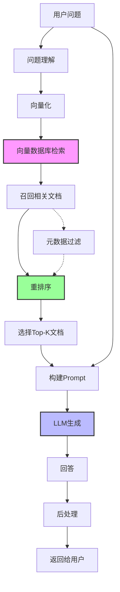
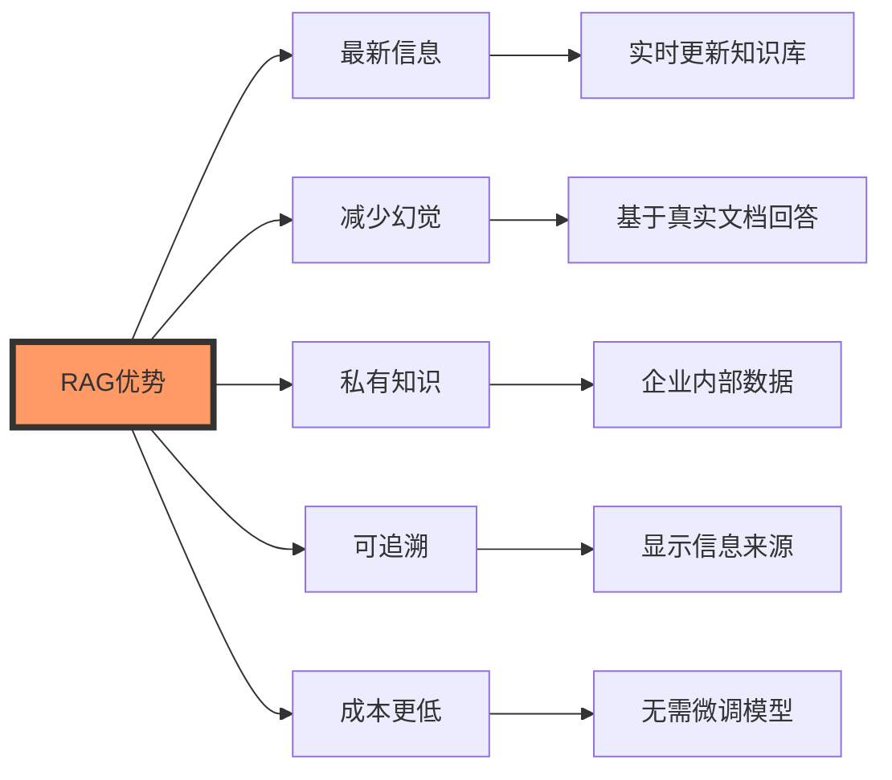
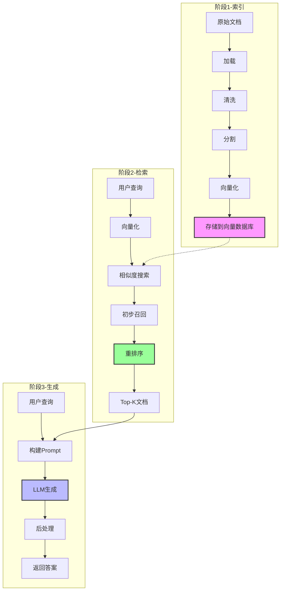

# RAG系统详解

## 本周学习目标

通过本周的学习,你将掌握:

1. 理解 RAG 的核心原理和架构
2. 掌握 RAG 系统的完整开发流程
3. 学会优化检索质量和生成质量
4. 掌握高级 RAG 技术(HyDE, Self-Query等)
5. 实现混合检索和重排序
6. 构建生产级 RAG 系统
7. 监控和评估 RAG 系统性能
8. 解决常见的 RAG 问题

## 一、RAG 基础

### 1.1 什么是 RAG?

RAG(Retrieval-Augmented Generation,检索增强生成)是一种结合检索和生成的技术,让 LLM 能够访问外部知识库。



### 1.2 为什么需要 RAG?

**LLM 的局限性**:

1. **知识截止日期**: 只知道训练时的信息
2. **幻觉问题**: 可能生成看似合理但错误的信息
3. **无法访问私有数据**: 无法了解企业内部知识
4. **缺乏可追溯性**: 无法说明信息来源

**RAG 的优势**:



### 1.3 RAG vs 微调(Fine-tuning)

```python
"""
RAG vs Fine-tuning 对比

+------------------+-------------------+-------------------+
| 维度             | RAG               | Fine-tuning       |
+------------------+-------------------+-------------------+
| 成本             | 低(仅推理成本)    | 高(需GPU训练)     |
+------------------+-------------------+-------------------+
| 知识更新         | 实时(更新文档即可)| 需要重新训练      |
+------------------+-------------------+-------------------+
| 可解释性         | 高(可显示来源)    | 低(黑盒)          |
+------------------+-------------------+-------------------+
| 适用场景         | 问答、搜索        | 特定任务优化      |
+------------------+-------------------+-------------------+
| 数据需求         | 文档即可          | 需要标注数据      |
+------------------+-------------------+-------------------+
| 响应延迟         | 稍高(需检索)      | 低(直接生成)      |
+------------------+-------------------+-------------------+
| 推荐度           | ⭐⭐⭐⭐⭐         | ⭐⭐⭐            |
+------------------+-------------------+-------------------+

选择建议:
- 知识库问答、文档搜索 -> RAG
- 特定格式输出、风格调整 -> Fine-tuning
- 复杂场景 -> RAG + Fine-tuning
"""
```

### 1.4 第一个 RAG 系统

```python
from langchain_community.vectorstores import Chroma
from langchain_openai import OpenAIEmbeddings, ChatOpenAI
from langchain.text_splitter import RecursiveCharacterTextSplitter
from langchain.chains import RetrievalQA
from langchain.schema import Document

# ===== 步骤1: 准备知识库文档 =====
documents = [
    Document(
        page_content="""
        LangChain 是一个用于开发大语言模型应用的框架。
        它提供了 Models、Prompts、Chains、Memory、Agents 等核心组件。
        LangChain 由 Harrison Chase 于 2022 年 10 月创建。
        """,
        metadata={"source": "langchain_intro.txt"}
    ),
    Document(
        page_content="""
        RAG(检索增强生成)结合了检索和生成两个步骤。
        工作流程: 1)检索相关文档 2)将文档作为上下文 3)生成回答。
        RAG 可以让 LLM 访问外部知识库,提供更准确的信息。
        """,
        metadata={"source": "rag_intro.txt"}
    ),
    Document(
        page_content="""
        向量数据库用于存储和检索向量 Embeddings。
        常见的向量数据库包括: FAISS、Chroma、Pinecone、Weaviate、Qdrant。
        向量数据库使用 ANN 算法实现高效的相似度搜索。
        """,
        metadata={"source": "vectordb_intro.txt"}
    )
]

print("步骤1: 准备知识库文档 ✓")

# ===== 步骤2: 分割文档 =====
text_splitter = RecursiveCharacterTextSplitter(
    chunk_size=200,
    chunk_overlap=20
)

splits = text_splitter.split_documents(documents)
print(f"步骤2: 文档分割完成,共 {len(splits)} 个文档块 ✓")

# ===== 步骤3: 创建向量存储 =====
embeddings = OpenAIEmbeddings()

vectorstore = Chroma.from_documents(
    documents=splits,
    embedding=embeddings
)

print("步骤3: 向量存储创建完成 ✓")

# ===== 步骤4: 创建检索器 =====
retriever = vectorstore.as_retriever(
    search_type="similarity",
    search_kwargs={"k": 2}  # 检索最相关的2个文档
)

print("步骤4: 检索器创建完成 ✓")

# ===== 步骤5: 创建 RAG 链 =====
llm = ChatOpenAI(model="gpt-3.5-turbo", temperature=0)

qa_chain = RetrievalQA.from_chain_type(
    llm=llm,
    chain_type="stuff",  # 将所有检索的文档一次性传给 LLM
    retriever=retriever,
    return_source_documents=True  # 返回源文档
)

print("步骤5: RAG 链创建完成 ✓")

# ===== 步骤6: 测试 RAG 系统 =====
print("\n" + "="*60)
print("RAG 系统测试")
print("="*60)

questions = [
    "LangChain 是谁创建的?",
    "什么是 RAG?",
    "常见的向量数据库有哪些?"
]

for question in questions:
    print(f"\n问题: {question}")

    result = qa_chain.invoke({"query": question})

    print(f"回答: {result['result']}")

    print(f"参考文档数: {len(result['source_documents'])}")
    for i, doc in enumerate(result['source_documents'], 1):
        print(f"  {i}. {doc.metadata['source']}: {doc.page_content[:50]}...")
```

## 二、RAG 系统架构

### 2.1 RAG 三阶段详解



### 2.2 完整 RAG 系统实现

```python
from langchain_community.vectorstores import Chroma
from langchain_openai import OpenAIEmbeddings, ChatOpenAI
from langchain.text_splitter import RecursiveCharacterTextSplitter
from langchain_community.document_loaders import DirectoryLoader, TextLoader
from langchain.chains import RetrievalQA
from langchain.prompts import PromptTemplate
from typing import List, Dict, Optional
import os

class RAGSystem:
    """完整的 RAG 系统"""

    def __init__(
        self,
        persist_directory: str = "./rag_db",
        model_name: str = "gpt-3.5-turbo",
        embedding_model: str = "text-embedding-3-small"
    ):
        """
        初始化 RAG 系统

        参数:
            persist_directory: 向量数据库持久化目录
            model_name: LLM 模型名称
            embedding_model: Embedding 模型名称
        """
        self.persist_directory = persist_directory
        self.embeddings = OpenAIEmbeddings(model=embedding_model)
        self.llm = ChatOpenAI(model=model_name, temperature=0)

        # 创建或加载向量存储
        if os.path.exists(persist_directory):
            self.vectorstore = Chroma(
                persist_directory=persist_directory,
                embedding_function=self.embeddings
            )
            print(f"✓ 已加载向量数据库,包含 {self.vectorstore._collection.count()} 个文档块")
        else:
            self.vectorstore = Chroma(
                persist_directory=persist_directory,
                embedding_function=self.embeddings
            )
            print("✓ 创建新的向量数据库")

        # 自定义提示词模板
        self.prompt_template = """请基于以下参考文档回答问题。如果文档中没有相关信息,请明确说明"根据提供的文档无法回答该问题"。

参考文档:
{context}

问题: {question}

回答要求:
1. 回答要准确、完整
2. 尽可能引用文档中的原文
3. 如果文档不包含答案,诚实说明
4. 保持回答简洁

回答:"""

        self.prompt = PromptTemplate(
            template=self.prompt_template,
            input_variables=["context", "question"]
        )

        # 创建 QA 链
        self.qa_chain = None
        self._setup_qa_chain()

    def _setup_qa_chain(self):
        """设置问答链"""
        if self.vectorstore._collection.count() > 0:
            retriever = self.vectorstore.as_retriever(
                search_type="similarity",
                search_kwargs={"k": 4}
            )

            self.qa_chain = RetrievalQA.from_chain_type(
                llm=self.llm,
                chain_type="stuff",
                retriever=retriever,
                return_source_documents=True,
                chain_type_kwargs={"prompt": self.prompt}
            )

            print("✓ 问答链已初始化")

    # ===== 索引阶段 =====

    def index_documents(
        self,
        documents: List,
        chunk_size: int = 500,
        chunk_overlap: int = 50
    ):
        """
        索引文档到向量数据库

        参数:
            documents: 文档列表
            chunk_size: 文档块大小
            chunk_overlap: 重叠大小
        """
        print(f"\n{'='*60}")
        print("阶段1: 索引文档")
        print(f"{'='*60}")

        # 1. 清洗文档
        print("1.1 清洗文档...")
        cleaned_docs = self._clean_documents(documents)
        print(f"✓ 清洗完成,保留 {len(cleaned_docs)} 个文档")

        # 2. 分割文档
        print("\n1.2 分割文档...")
        text_splitter = RecursiveCharacterTextSplitter(
            chunk_size=chunk_size,
            chunk_overlap=chunk_overlap,
            separators=["\n\n", "\n", "。", ". ", " ", ""]
        )

        splits = text_splitter.split_documents(cleaned_docs)
        print(f"✓ 分割完成,共 {len(splits)} 个文档块")

        # 3. 向量化并存储
        print("\n1.3 向量化并存储...")
        self.vectorstore.add_documents(splits)
        print(f"✓ 存储完成")

        # 4. 重新设置问答链
        self._setup_qa_chain()

        print(f"\n{'='*60}")
        print("索引完成!")
        print(f"{'='*60}\n")

    def index_directory(
        self,
        directory: str,
        glob_pattern: str = "**/*.txt",
        chunk_size: int = 500,
        chunk_overlap: int = 50
    ):
        """
        索引整个目录

        参数:
            directory: 目录路径
            glob_pattern: 文件匹配模式
            chunk_size: 文档块大小
            chunk_overlap: 重叠大小
        """
        print(f"加载目录: {directory}")

        loader = DirectoryLoader(
            directory,
            glob=glob_pattern,
            loader_cls=TextLoader,
            loader_kwargs={"encoding": "utf-8"}
        )

        documents = loader.load()
        print(f"✓ 加载了 {len(documents)} 个文件")

        self.index_documents(documents, chunk_size, chunk_overlap)

    def _clean_documents(self, documents: List) -> List:
        """清洗文档"""
        cleaned = []
        for doc in documents:
            # 移除多余空白
            content = " ".join(doc.page_content.split())

            # 过滤太短的文档
            if len(content) < 10:
                continue

            doc.page_content = content
            cleaned.append(doc)

        return cleaned

    # ===== 检索阶段 =====

    def retrieve(
        self,
        query: str,
        k: int = 4,
        filter_dict: Optional[Dict] = None
    ) -> List:
        """
        检索相关文档

        参数:
            query: 查询
            k: 返回文档数量
            filter_dict: 元数据过滤条件

        返回:
            相关文档列表
        """
        print(f"\n{'='*60}")
        print("阶段2: 检索文档")
        print(f"{'='*60}")

        # 1. 向量化查询
        print("2.1 向量化查询...")
        query_vector = self.embeddings.embed_query(query)
        print(f"✓ 查询向量维度: {len(query_vector)}")

        # 2. 相似度搜索
        print("\n2.2 相似度搜索...")
        search_kwargs = {"k": k * 2}  # 多召回一些候选
        if filter_dict:
            search_kwargs["filter"] = filter_dict

        retriever = self.vectorstore.as_retriever(
            search_type="similarity",
            search_kwargs=search_kwargs
        )

        candidates = retriever.get_relevant_documents(query)
        print(f"✓ 初步召回 {len(candidates)} 个候选文档")

        # 3. 重排序(这里简化,实际可用 Cohere Rerank 等)
        print("\n2.3 重排序...")
        ranked = candidates[:k]  # 简化版,直接取前k个
        print(f"✓ 最终选择 {len(ranked)} 个文档")

        print(f"\n{'='*60}")
        print("检索完成!")
        print(f"{'='*60}\n")

        return ranked

    # ===== 生成阶段 =====

    def generate(
        self,
        query: str,
        documents: List,
        verbose: bool = True
    ) -> Dict:
        """
        基于检索的文档生成答案

        参数:
            query: 查询
            documents: 检索到的文档
            verbose: 是否显示详细信息

        返回:
            包含答案和元数据的字典
        """
        if verbose:
            print(f"\n{'='*60}")
            print("阶段3: 生成答案")
            print(f"{'='*60}")

        # 1. 构建上下文
        if verbose:
            print("3.1 构建上下文...")

        context = "\n\n".join([doc.page_content for doc in documents])

        if verbose:
            print(f"✓ 上下文长度: {len(context)} 字符")

        # 2. 构建 Prompt
        if verbose:
            print("\n3.2 构建 Prompt...")

        prompt = self.prompt.format(context=context, question=query)

        if verbose:
            print(f"✓ Prompt 长度: {len(prompt)} 字符")

        # 3. LLM 生成
        if verbose:
            print("\n3.3 LLM 生成...")

        response = self.llm.invoke(prompt)
        answer = response.content

        if verbose:
            print(f"✓ 生成答案长度: {len(answer)} 字符")

        # 4. 后处理
        if verbose:
            print("\n3.4 后处理...")

        answer = answer.strip()

        if verbose:
            print(f"✓ 后处理完成")
            print(f"\n{'='*60}")
            print("生成完成!")
            print(f"{'='*60}\n")

        return {
            "answer": answer,
            "source_documents": documents,
            "context_length": len(context),
            "answer_length": len(answer)
        }

    # ===== 完整的问答流程 =====

    def ask(
        self,
        question: str,
        k: int = 4,
        filter_dict: Optional[Dict] = None,
        verbose: bool = False
    ) -> Dict:
        """
        完整的问答流程

        参数:
            question: 问题
            k: 检索文档数量
            filter_dict: 元数据过滤条件
            verbose: 是否显示详细过程

        返回:
            包含答案和元数据的字典
        """
        if not self.qa_chain:
            return {
                "answer": "知识库为空,请先索引文档",
                "source_documents": []
            }

        if verbose:
            # 详细模式:显示每个阶段
            # 检索
            documents = self.retrieve(question, k, filter_dict)

            # 生成
            result = self.generate(question, documents, verbose=True)

            return result
        else:
            # 快速模式:直接使用 QA 链
            result = self.qa_chain.invoke({"query": question})

            return {
                "answer": result["result"],
                "source_documents": result["source_documents"]
            }

    def ask_with_display(self, question: str, k: int = 4):
        """提问并美化显示结果"""
        print(f"\n{'='*60}")
        print(f"问题: {question}")
        print(f"{'='*60}\n")

        result = self.ask(question, k=k)

        print(f"回答: {result['answer']}\n")

        if result['source_documents']:
            print(f"参考来源({len(result['source_documents'])} 个):")
            for i, doc in enumerate(result['source_documents'], 1):
                print(f"\n{i}. {doc.page_content[:100]}...")
                if doc.metadata:
                    print(f"   元数据: {doc.metadata}")

    # ===== 工具方法 =====

    def get_stats(self) -> Dict:
        """获取统计信息"""
        return {
            "total_chunks": self.vectorstore._collection.count(),
            "persist_directory": self.persist_directory,
            "model": self.llm.model_name,
            "embedding_model": self.embeddings.model
        }

    def clear(self):
        """清空向量数据库"""
        self.vectorstore.delete_collection()
        self.qa_chain = None
        print("✓ 向量数据库已清空")

# ===== 使用示例 =====
if __name__ == "__main__":
    from langchain.schema import Document

    # 创建 RAG 系统
    rag = RAGSystem()

    # 准备示例文档
    documents = [
        Document(
            page_content="""
            LangChain 完整教程

            LangChain 是一个强大的框架,用于开发基于大语言模型的应用程序。
            它由 Harrison Chase 于 2022 年 10 月创建。

            核心组件包括:
            1. Models: 支持多种 LLM 提供商
            2. Prompts: 提示词管理
            3. Chains: 链式调用
            4. Memory: 记忆管理
            5. Agents: 智能代理
            6. Embeddings: 向量化工具
            7. Vector Stores: 向量数据库

            LangChain 的优势在于模块化设计和丰富的集成。
            """,
            metadata={"source": "langchain_guide.txt", "category": "教程"}
        ),
        Document(
            page_content="""
            RAG 系统详解

            RAG(Retrieval-Augmented Generation)是一种结合检索和生成的技术。

            工作流程:
            1. 索引阶段: 文档加载 -> 分割 -> 向量化 -> 存储
            2. 检索阶段: 查询向量化 -> 相似度搜索 -> 重排序
            3. 生成阶段: 构建 Prompt -> LLM 生成 -> 后处理

            RAG 的优势:
            - 提供最新、准确的信息
            - 减少 LLM 幻觉
            - 支持私有知识库
            - 可追溯答案来源

            RAG 适用于文档问答、知识库搜索等场景。
            """,
            metadata={"source": "rag_guide.txt", "category": "技术"}
        ),
        Document(
            page_content="""
            向量数据库对比

            常见的向量数据库:

            1. FAISS
            - 类型: 本地内存
            - 性能: ⭐⭐⭐⭐⭐(最快)
            - 易用性: ⭐⭐⭐
            - 适用: 开发测试、中小规模

            2. Chroma
            - 类型: 本地内存
            - 性能: ⭐⭐⭐⭐
            - 易用性: ⭐⭐⭐⭐⭐(最简单)
            - 适用: 快速原型、开发测试

            3. Pinecone
            - 类型: 云端托管
            - 性能: ⭐⭐⭐⭐⭐
            - 易用性: ⭐⭐⭐⭐
            - 价格: 收费
            - 适用: 生产环境、大规模

            4. Qdrant
            - 类型: 本地/云端
            - 性能: ⭐⭐⭐⭐⭐
            - 易用性: ⭐⭐⭐⭐
            - 适用: 生产环境

            选择建议:
            - 快速原型: Chroma
            - 本地开发: FAISS
            - 生产环境: Pinecone 或 Qdrant
            """,
            metadata={"source": "vectordb_comparison.txt", "category": "工具"}
        )
    ]

    # 索引文档(详细模式)
    rag.index_documents(documents, chunk_size=300, chunk_overlap=30)

    # 测试问答
    print("\n" + "="*60)
    print("RAG 系统测试")
    print("="*60)

    # 测试1: 基本问答
    rag.ask_with_display("LangChain 是谁创建的?")

    # 测试2: 复杂问答
    rag.ask_with_display("RAG 系统的工作流程是什么?")

    # 测试3: 对比问题
    rag.ask_with_display("FAISS 和 Chroma 有什么区别?")

    # 测试4: 详细模式(显示每个阶段)
    print("\n" + "="*60)
    print("详细模式测试")
    print("="*60)

    result = rag.ask(
        "选择哪个向量数据库用于生产环境?",
        k=3,
        verbose=True  # 显示详细过程
    )

    print(f"\n最终答案: {result['answer']}")

    # 显示统计信息
    print("\n" + "="*60)
    print("系统统计")
    print("="*60)

    stats = rag.get_stats()
    for key, value in stats.items():
        print(f"{key}: {value}")
```

## 三、高级 RAG 技术

### 3.1 HyDE (Hypothetical Document Embeddings)

HyDE 让 LLM 先生成一个假设的答案,然后用这个答案去检索,提高检索准确性。

```python
from langchain.chains import HypotheticalDocumentEmbedder
from langchain_openai import OpenAIEmbeddings, ChatOpenAI
from langchain_community.vectorstores import Chroma
from langchain.schema import Document
from langchain.prompts import PromptTemplate

# ===== 准备知识库 =====
documents = [
    Document(page_content="Python 是一门解释型、动态类型的编程语言,语法简洁优雅"),
    Document(page_content="Java 是一门编译型、静态类型的编程语言,广泛用于企业开发"),
    Document(page_content="机器学习是人工智能的一个分支,让计算机从数据中学习"),
    Document(page_content="深度学习使用多层神经网络模拟人脑工作方式"),
]

embeddings = OpenAIEmbeddings()
vectorstore = Chroma.from_documents(documents, embeddings)

# ===== 方法1: 普通检索(baseline) =====
print("="*60)
print("方法1: 普通检索")
print("="*60)

query = "如何学习编程?"

normal_results = vectorstore.similarity_search(query, k=2)

print(f"\n查询: {query}\n")
print("检索结果:")
for i, doc in enumerate(normal_results, 1):
    print(f"{i}. {doc.page_content}")

# ===== 方法2: HyDE 检索 =====
print("\n" + "="*60)
print("方法2: HyDE 检索")
print("="*60)

llm = ChatOpenAI(temperature=0)

# 创建 HyDE Embedder
hyde_embedder = HypotheticalDocumentEmbedder.from_llm(
    llm=llm,
    base_embeddings=embeddings,
    prompt_key="web_search"  # 使用内置的 web_search 提示词
)

# 使用 HyDE Embeddings 创建新的 Vector Store
hyde_vectorstore = Chroma.from_documents(
    documents,
    hyde_embedder
)

# HyDE 检索
hyde_results = hyde_vectorstore.similarity_search(query, k=2)

print(f"\n查询: {query}\n")
print("HyDE 检索结果:")
for i, doc in enumerate(hyde_results, 1):
    print(f"{i}. {doc.page_content}")

# ===== 自定义 HyDE 提示词 =====
print("\n" + "="*60)
print("方法3: 自定义 HyDE 提示词")
print("="*60)

# 自定义提示词模板
custom_prompt = PromptTemplate(
    input_variables=["question"],
    template="""请针对以下问题,生成一个详细的假设性答案。

问题: {question}

假设性答案:"""
)

# 创建自定义 HyDE Embedder
custom_hyde = HypotheticalDocumentEmbedder(
    llm_chain=llm,
    base_embeddings=embeddings,
    prompt=custom_prompt
)

# 使用自定义 HyDE
custom_hyde_vectorstore = Chroma.from_documents(
    documents,
    custom_hyde
)

custom_results = custom_hyde_vectorstore.similarity_search(query, k=2)

print(f"\n查询: {query}\n")
print("自定义 HyDE 检索结果:")
for i, doc in enumerate(custom_results, 1):
    print(f"{i}. {doc.page_content}")

# ===== HyDE 原理演示 =====
print("\n" + "="*60)
print("HyDE 原理演示")
print("="*60)

# 1. 生成假设性答案
hypothetical_prompt = f"""请针对问题生成一个详细答案。

问题: {query}

答案:"""

hypothetical_answer = llm.invoke(hypothetical_prompt).content

print(f"\n1. 原始查询: {query}")
print(f"\n2. LLM 生成的假设性答案:\n{hypothetical_answer}")

# 2. 用假设性答案检索
print(f"\n3. 用假设性答案作为查询检索:")
results_with_hypo = vectorstore.similarity_search(hypothetical_answer, k=2)

for i, doc in enumerate(results_with_hypo, 1):
    print(f"   {i}. {doc.page_content}")

# ===== 对比效果 =====
print("\n" + "="*60)
print("效果对比")
print("="*60)

print(f"\n原始查询: '{query}'")
print(f"假设答案: '{hypothetical_answer[:100]}...'")

print("\n普通检索:")
for doc in normal_results:
    print(f"  - {doc.page_content[:60]}...")

print("\nHyDE 检索:")
for doc in hyde_results:
    print(f"  - {doc.page_content[:60]}...")
```

**HyDE 的优势**:
- 将简短的查询转换为更丰富的语义表示
- 特别适合查询和文档差异较大的场景
- 提高检索的语义匹配度

**HyDE 的劣势**:
- 增加一次 LLM 调用,增加延迟和成本
- 如果生成的假设答案偏离实际,可能降低检索质量

### 3.2 Self-Query Retriever(自查询检索器)

Self-Query Retriever 让 LLM 从自然语言查询中提取元数据过滤条件。

```python
from langchain.retrievers import SelfQueryRetriever
from langchain.chains.query_constructor.base import AttributeInfo
from langchain_openai import ChatOpenAI, OpenAIEmbeddings
from langchain_community.vectorstores import Chroma
from langchain.schema import Document

# ===== 准备带丰富元数据的文档 =====
documents = [
    Document(
        page_content="Python 入门教程,适合初学者,包含基础语法和常用库",
        metadata={"language": "Python", "level": "初级", "year": 2023, "category": "教程"}
    ),
    Document(
        page_content="Python 高级特性详解,包括装饰器、生成器、元类等",
        metadata={"language": "Python", "level": "高级", "year": 2023, "category": "教程"}
    ),
    Document(
        page_content="Java Spring Boot 实战,构建企业级微服务",
        metadata={"language": "Java", "level": "中级", "year": 2022, "category": "实战"}
    ),
    Document(
        page_content="机器学习基础,包含常用算法和 scikit-learn 实践",
        metadata={"language": "Python", "level": "中级", "year": 2023, "category": "AI"}
    ),
    Document(
        page_content="深度学习与 PyTorch,从 CNN 到 Transformer",
        metadata={"language": "Python", "level": "高级", "year": 2023, "category": "AI"}
    ),
    Document(
        page_content="JavaScript 前端开发指南,React 和 Vue 实战",
        metadata={"language": "JavaScript", "level": "中级", "year": 2023, "category": "前端"}
    )
]

embeddings = OpenAIEmbeddings()
vectorstore = Chroma.from_documents(documents, embeddings)

# ===== 定义元数据字段 =====
metadata_field_info = [
    AttributeInfo(
        name="language",
        description="编程语言,如 Python、Java、JavaScript 等",
        type="string"
    ),
    AttributeInfo(
        name="level",
        description="难度级别: 初级、中级、高级",
        type="string"
    ),
    AttributeInfo(
        name="year",
        description="发布年份",
        type="integer"
    ),
    AttributeInfo(
        name="category",
        description="内容类别: 教程、实战、AI、前端等",
        type="string"
    )
]

# 文档描述
document_content_description = "编程学习资料和教程"

# ===== 创建 Self-Query Retriever =====
llm = ChatOpenAI(temperature=0)

self_query_retriever = SelfQueryRetriever.from_llm(
    llm=llm,
    vectorstore=vectorstore,
    document_contents=document_content_description,
    metadata_field_info=metadata_field_info,
    verbose=True  # 显示查询构造过程
)

# ===== 测试 Self-Query =====
print("="*60)
print("Self-Query Retriever 测试")
print("="*60)

# 测试1: 包含语言过滤
query1 = "我想学习 Python 的高级特性"
print(f"\n查询1: {query1}")
results1 = self_query_retriever.get_relevant_documents(query1)

print("\n检索结果:")
for i, doc in enumerate(results1, 1):
    print(f"{i}. {doc.page_content}")
    print(f"   元数据: {doc.metadata}\n")

# 测试2: 包含难度和类别过滤
query2 = "有什么 AI 相关的中级教程?"
print(f"\n查询2: {query2}")
results2 = self_query_retriever.get_relevant_documents(query2)

print("\n检索结果:")
for i, doc in enumerate(results2, 1):
    print(f"{i}. {doc.page_content}")
    print(f"   元数据: {doc.metadata}\n")

# 测试3: 包含年份过滤
query3 = "2023 年的 Python 教程"
print(f"\n查询3: {query3}")
results3 = self_query_retriever.get_relevant_documents(query3)

print("\n检索结果:")
for i, doc in enumerate(results3, 1):
    print(f"{i}. {doc.page_content}")
    print(f"   元数据: {doc.metadata}\n")

# 测试4: 复杂查询
query4 = "我想要 2023 年之后的 Python 初级教程"
print(f"\n查询4: {query4}")
results4 = self_query_retriever.get_relevant_documents(query4)

print("\n检索结果:")
for i, doc in enumerate(results4, 1):
    print(f"{i}. {doc.page_content}")
    print(f"   元数据: {doc.metadata}\n")

# ===== 对比普通检索 =====
print("\n" + "="*60)
print("对比: 普通检索 vs Self-Query 检索")
print("="*60)

test_query = "Python 高级教程"

# 普通检索
print(f"\n查询: {test_query}")
print("\n普通检索结果:")
normal_retriever = vectorstore.as_retriever(search_kwargs={"k": 3})
normal_results = normal_retriever.get_relevant_documents(test_query)

for i, doc in enumerate(normal_results, 1):
    print(f"{i}. {doc.page_content[:50]}... | level: {doc.metadata.get('level')}")

# Self-Query 检索
print("\nSelf-Query 检索结果:")
sq_results = self_query_retriever.get_relevant_documents(test_query)

for i, doc in enumerate(sq_results, 1):
    print(f"{i}. {doc.page_content[:50]}... | level: {doc.metadata.get('level')}")
```

**Self-Query 的优势**:
- 自动从自然语言提取过滤条件
- 结合语义搜索和元数据过滤
- 提高检索准确性

**Self-Query 的注意事项**:
- 需要明确定义元数据字段
- 增加一次 LLM 调用
- 元数据字段描述要清晰准确

### 3.3 Reranking(重排序)

重排序是在初步召回后,使用更精确的模型对结果重新排序。

```python
from langchain.retrievers import ContextualCompressionRetriever
from langchain.retrievers.document_compressors import CohereRerank
from langchain_community.vectorstores import Chroma
from langchain_openai import OpenAIEmbeddings
from langchain.schema import Document
import os

# ===== 准备文档 =====
documents = [
    Document(
        page_content="Python 是一门解释型编程语言,语法简洁,适合初学者",
        metadata={"id": 1}
    ),
    Document(
        page_content="Python 的优势在于丰富的库生态,特别是数据科学领域",
        metadata={"id": 2}
    ),
    Document(
        page_content="Java 是一门静态类型语言,广泛用于企业级应用开发",
        metadata={"id": 3}
    ),
    Document(
        page_content="Python 在机器学习和人工智能领域应用广泛",
        metadata={"id": 4}
    ),
    Document(
        page_content="JavaScript 是 Web 开发的核心语言,支持前后端开发",
        metadata={"id": 5}
    ),
    Document(
        page_content="Python 的缺点是执行速度相对较慢,因为是解释型语言",
        metadata={"id": 6}
    )
]

embeddings = OpenAIEmbeddings()
vectorstore = Chroma.from_documents(documents, embeddings)

# ===== 方法1: 无重排序(baseline) =====
print("="*60)
print("方法1: 普通检索(无重排序)")
print("="*60)

query = "Python 适合做什么?"

base_retriever = vectorstore.as_retriever(search_kwargs={"k": 5})
base_results = base_retriever.get_relevant_documents(query)

print(f"\n查询: {query}\n")
print("检索结果(按相似度排序):")
for i, doc in enumerate(base_results, 1):
    print(f"{i}. [ID:{doc.metadata['id']}] {doc.page_content}")

# ===== 方法2: 使用 Cohere Rerank =====
# 注意: 需要 Cohere API Key
# 获取: https://dashboard.cohere.com/api-keys
# 安装: pip install cohere

if os.getenv("COHERE_API_KEY"):
    print("\n" + "="*60)
    print("方法2: Cohere Rerank 重排序")
    print("="*60)

    # 创建 Cohere Reranker
    compressor = CohereRerank(
        model="rerank-english-v2.0",  # 或 "rerank-multilingual-v2.0" 支持中文
        top_n=3  # 重排序后返回前3个
    )

    # 创建压缩检索器
    compression_retriever = ContextualCompressionRetriever(
        base_compressor=compressor,
        base_retriever=base_retriever
    )

    # 重排序检索
    reranked_results = compression_retriever.get_relevant_documents(query)

    print(f"\n查询: {query}\n")
    print("重排序后的结果:")
    for i, doc in enumerate(reranked_results, 1):
        print(f"{i}. [ID:{doc.metadata['id']}] {doc.page_content}")

# ===== 方法3: 自定义 LLM Reranker =====
print("\n" + "="*60)
print("方法3: LLM Reranker(自定义)")
print("="*60)

from langchain_openai import ChatOpenAI
from typing import List
import json

def llm_rerank(query: str, documents: List[Document], top_k: int = 3) -> List[Document]:
    """
    使用 LLM 重排序文档

    参数:
        query: 查询
        documents: 候选文档列表
        top_k: 返回前 k 个文档

    返回:
        重排序后的文档列表
    """
    llm = ChatOpenAI(model="gpt-3.5-turbo", temperature=0)

    # 构建重排序提示词
    docs_text = "\n\n".join([
        f"文档{i+1} (ID:{doc.metadata['id']}): {doc.page_content}"
        for i, doc in enumerate(documents)
    ])

    prompt = f"""请根据查询对以下文档进行相关性排序。

查询: {query}

文档:
{docs_text}

请返回最相关的 {top_k} 个文档的 ID,按相关性从高到低排序。
只返回 JSON 格式: {{"ranked_ids": [id1, id2, id3]}}

重排序结果:"""

    # LLM 重排序
    response = llm.invoke(prompt)

    try:
        # 解析 JSON
        result = json.loads(response.content)
        ranked_ids = result["ranked_ids"]

        # 根据 ID 重排序文档
        id_to_doc = {doc.metadata['id']: doc for doc in documents}
        reranked = [id_to_doc[doc_id] for doc_id in ranked_ids if doc_id in id_to_doc]

        return reranked
    except:
        # 解析失败,返回原始顺序
        return documents[:top_k]

# 使用自定义 LLM Reranker
llm_reranked = llm_rerank(query, base_results, top_k=3)

print(f"\n查询: {query}\n")
print("LLM 重排序后的结果:")
for i, doc in enumerate(llm_reranked, 1):
    print(f"{i}. [ID:{doc.metadata['id']}] {doc.page_content}")

# ===== 效果对比 =====
print("\n" + "="*60)
print("重排序效果对比")
print("="*60)

print(f"\n查询: {query}\n")

print("普通检索(前3个):")
for i, doc in enumerate(base_results[:3], 1):
    print(f"  {i}. [ID:{doc.metadata['id']}] {doc.page_content[:50]}...")

if os.getenv("COHERE_API_KEY"):
    print("\nCohere Rerank:")
    for i, doc in enumerate(reranked_results, 1):
        print(f"  {i}. [ID:{doc.metadata['id']}] {doc.page_content[:50]}...")

print("\nLLM Rerank:")
for i, doc in enumerate(llm_reranked, 1):
    print(f"  {i}. [ID:{doc.metadata['id']}] {doc.page_content[:50]}...")
```

**Reranking 的优势**:
- 提高检索结果的准确性
- 两阶段检索:快速召回 + 精确排序
- 平衡性能和准确性

**Reranking 方法对比**:
- **Cohere Rerank**: 专门的 Rerank 模型,效果最好,但需付费
- **LLM Rerank**: 使用通用 LLM,灵活但成本较高
- **Embedding Rerank**: 使用更好的 Embedding 模型,成本低但效果一般

### 3.4 Hybrid Search(混合搜索)

结合关键词搜索(BM25)和向量搜索,提高召回率。

```python
from langchain.retrievers import EnsembleRetriever
from langchain_community.retrievers import BM25Retriever
from langchain_community.vectorstores import Chroma
from langchain_openai import OpenAIEmbeddings
from langchain.schema import Document

# ===== 准备文档 =====
documents = [
    Document(
        page_content="LangChain 是一个用于开发 LLM 应用的 Python 框架",
        metadata={"id": 1, "source": "intro"}
    ),
    Document(
        page_content="LangChain 提供了 Models、Prompts、Chains、Memory、Agents 等组件",
        metadata={"id": 2, "source": "components"}
    ),
    Document(
        page_content="RAG 技术结合了检索和生成,让 LLM 访问外部知识库",
        metadata={"id": 3, "source": "rag"}
    ),
    Document(
        page_content="向量数据库如 FAISS、Chroma、Pinecone 用于存储 Embeddings",
        metadata={"id": 4, "source": "vectordb"}
    ),
    Document(
        page_content="Prompt Engineering 是设计有效提示词的技术和艺术",
        metadata={"id": 5, "source": "prompt"}
    ),
    Document(
        page_content="Agent 可以自主规划任务并调用工具完成复杂任务",
        metadata={"id": 6, "source": "agent"}
    )
]

# ===== 创建两个检索器 =====

# 1. BM25 检索器(关键词匹配)
bm25_retriever = BM25Retriever.from_documents(documents)
bm25_retriever.k = 4  # 返回前4个结果

# 2. 向量检索器(语义匹配)
embeddings = OpenAIEmbeddings()
vectorstore = Chroma.from_documents(documents, embeddings)
vector_retriever = vectorstore.as_retriever(search_kwargs={"k": 4})

# ===== 测试单独的检索器 =====
print("="*60)
print("单独检索器测试")
print("="*60)

query = "LangChain 框架的组件有哪些?"

# BM25 检索
print(f"\n查询: {query}")
print("\nBM25 检索结果(关键词匹配):")
bm25_results = bm25_retriever.get_relevant_documents(query)
for i, doc in enumerate(bm25_results[:3], 1):
    print(f"{i}. [ID:{doc.metadata['id']}] {doc.page_content}")

# 向量检索
print("\n向量检索结果(语义匹配):")
vector_results = vector_retriever.get_relevant_documents(query)
for i, doc in enumerate(vector_results[:3], 1):
    print(f"{i}. [ID:{doc.metadata['id']}] {doc.page_content}")

# ===== 创建混合检索器 =====
print("\n" + "="*60)
print("混合检索器(Ensemble)")
print("="*60)

# 创建 Ensemble Retriever
ensemble_retriever = EnsembleRetriever(
    retrievers=[bm25_retriever, vector_retriever],
    weights=[0.5, 0.5]  # 权重: BM25 50%, Vector 50%
)

# 混合检索
print(f"\n查询: {query}")
print("\n混合检索结果(BM25 + Vector):")
ensemble_results = ensemble_retriever.get_relevant_documents(query)
for i, doc in enumerate(ensemble_results[:3], 1):
    print(f"{i}. [ID:{doc.metadata['id']}] {doc.page_content}")

# ===== 权重调整实验 =====
print("\n" + "="*60)
print("权重调整实验")
print("="*60)

test_queries = [
    "LangChain framework",  # 英文关键词,应该更依赖 BM25
    "如何构建智能应用?",  # 语义查询,应该更依赖 Vector
]

for query in test_queries:
    print(f"\n查询: {query}")

    # 侧重 BM25(70% BM25, 30% Vector)
    ensemble_bm25 = EnsembleRetriever(
        retrievers=[bm25_retriever, vector_retriever],
        weights=[0.7, 0.3]
    )
    results_bm25 = ensemble_bm25.get_relevant_documents(query)

    # 侧重 Vector(30% BM25, 70% Vector)
    ensemble_vector = EnsembleRetriever(
        retrievers=[bm25_retriever, vector_retriever],
        weights=[0.3, 0.7]
    )
    results_vector = ensemble_vector.get_relevant_documents(query)

    print("\n侧重 BM25 (0.7, 0.3):")
    for doc in results_bm25[:2]:
        print(f"  - [ID:{doc.metadata['id']}] {doc.page_content[:50]}...")

    print("\n侧重 Vector (0.3, 0.7):")
    for doc in results_vector[:2]:
        print(f"  - [ID:{doc.metadata['id']}] {doc.page_content[:50]}...")

# ===== 完整的混合搜索系统 =====
print("\n" + "="*60)
print("完整的混合搜索系统")
print("="*60)

class HybridSearchSystem:
    """混合搜索系统"""

    def __init__(
        self,
        documents: List[Document],
        bm25_weight: float = 0.5,
        vector_weight: float = 0.5
    ):
        """
        初始化混合搜索系统

        参数:
            documents: 文档列表
            bm25_weight: BM25 权重
            vector_weight: Vector 权重
        """
        # 创建 BM25 检索器
        self.bm25_retriever = BM25Retriever.from_documents(documents)
        self.bm25_retriever.k = 10

        # 创建向量检索器
        embeddings = OpenAIEmbeddings()
        vectorstore = Chroma.from_documents(documents, embeddings)
        self.vector_retriever = vectorstore.as_retriever(
            search_kwargs={"k": 10}
        )

        # 创建混合检索器
        self.ensemble_retriever = EnsembleRetriever(
            retrievers=[self.bm25_retriever, self.vector_retriever],
            weights=[bm25_weight, vector_weight]
        )

    def search(self, query: str, k: int = 5) -> List[Document]:
        """
        混合搜索

        参数:
            query: 查询
            k: 返回结果数量

        返回:
            文档列表
        """
        results = self.ensemble_retriever.get_relevant_documents(query)
        return results[:k]

    def search_with_scores(self, query: str, k: int = 5):
        """搜索并显示分数(简化版)"""
        results = self.search(query, k=k)

        print(f"\n查询: {query}\n")
        print("混合搜索结果:")
        for i, doc in enumerate(results, 1):
            print(f"{i}. [ID:{doc.metadata.get('id', 'N/A')}] {doc.page_content}")

# 使用混合搜索系统
hybrid_system = HybridSearchSystem(
    documents,
    bm25_weight=0.5,
    vector_weight=0.5
)

hybrid_system.search_with_scores("LangChain 的核心功能", k=3)
hybrid_system.search_with_scores("如何开发智能 Agent?", k=3)
```

**混合搜索的优势**:
- 结合关键词和语义搜索的优点
- 提高召回率(Recall)
- 对不同类型的查询都有较好表现

**权重选择建议**:
- **通用场景**: 50% BM25 + 50% Vector
- **关键词重要**: 70% BM25 + 30% Vector
- **语义理解重要**: 30% BM25 + 70% Vector

## 练习题

### 基础练习

1. **基础 RAG 系统**:
   - 实现一个简单的 RAG 问答系统
   - 索引 10 个文档
   - 实现基本的检索和生成

2. **文档分割实验**:
   - 对同一文档使用不同的 chunk_size
   - 对比检索效果
   - 找出最优的 chunk_size

3. **提示词优化**:
   - 设计 3 个不同的 RAG 提示词模板
   - 对比生成质量
   - 选择最佳模板

### 进阶练习

4. **HyDE 实现**:
   - 实现 HyDE 检索
   - 对比普通检索和 HyDE 的效果
   - 分析什么场景下 HyDE 更有效

5. **混合搜索**:
   - 实现 BM25 + Vector 混合搜索
   - 测试不同权重配置
   - 找出最优权重

6. **重排序系统**:
   - 实现两阶段检索系统
   - 第一阶段召回 20 个候选
   - 第二阶段重排序返回前 5 个

### 实战练习

7. **生产级 RAG 系统**:
   - 实现完整的 RAG 系统,包含:
     - 文档索引
     - 混合检索
     - 重排序
     - 答案生成
     - 来源追溯
   - 添加缓存优化
   - 实现流式输出

8. **多模态 RAG**:
   - 支持 PDF、Word、Markdown 等多种格式
   - 实现自动格式识别
   - 保留文档结构信息

9. **评估系统**:
   - 设计 RAG 系统评估指标
   - 实现自动化评估
   - 生成评估报告

## 本周总结

### 核心概念

1. **RAG 三阶段**:
   - 索引: 文档处理和向量化
   - 检索: 相似度搜索和重排序
   - 生成: 基于上下文生成答案

2. **高级技术**:
   - HyDE: 用假设答案提高检索
   - Self-Query: 自动提取过滤条件
   - Reranking: 两阶段检索
   - Hybrid Search: 混合搜索

### 最佳实践

1. **文档处理**:
   - chunk_size: 300-600 字符
   - chunk_overlap: 10-20%
   - 保留文档结构

2. **检索优化**:
   - 使用混合搜索提高召回
   - 使用重排序提高精确度
   - 适当增加召回数量

3. **生成优化**:
   - 设计清晰的提示词模板
   - 限制上下文长度
   - 添加答案验证

4. **系统优化**:
   - 缓存 Embeddings
   - 批量处理
   - 异步调用

### 常见问题

**Q: RAG 和微调如何选择?**
A:
- 知识库问答 -> RAG
- 特定任务风格 -> 微调
- 复杂场景 -> RAG + 微调

**Q: 如何提高 RAG 准确性?**
A:
1. 优化文档分割
2. 使用混合搜索
3. 添加重排序
4. 优化提示词
5. 增加上下文验证

**Q: RAG 系统响应慢怎么办?**
A:
1. 缓存 Embeddings
2. 使用更快的向量数据库
3. 减少检索数量
4. 使用流式输出
5. 异步处理

### 下周预告

下周我们将学习 **LangChain 高级特性**,包括:
- Callbacks 和监控
- 流式处理
- 异步编程
- 错误处理
- 性能优化
- 部署最佳实践

---

**作业**:
1. 完成所有练习题
2. 实现一个完整的 RAG 系统
3. 对比至少 3 种检索策略的效果
4. 阅读 LangChain 官方文档中关于 RAG 的部分

**推荐阅读**:
- [RAG 论文](https://arxiv.org/abs/2005.11401)
- [HyDE 论文](https://arxiv.org/abs/2212.10496)
- [LangChain RAG 教程](https://python.langchain.com/docs/use_cases/question_answering/)
- [Advanced RAG Techniques](https://blog.langchain.dev/deconstructing-rag/)
