# 部署与优化

## 本周学习目标

通过本周的学习,你将掌握:

1. 理解生产环境的核心需求
2. 掌握性能优化技巧
3. 实现缓存策略
4. 掌握异步编程
5. 实现错误处理和重试
6. 掌握成本控制方法
7. 实现安全防护
8. 掌握完整的部署流程

## 一、性能优化

### 1.1 性能优化全景图

```mermaid
graph TB
    A[性能优化] --> B[缓存优化]
    A --> C[并发优化]
    A --> D[批量处理]
    A --> E[模型优化]
    A --> F[网络优化]

    B --> B1[Embedding缓存]
    B --> B2[结果缓存]
    B --> B3[文档缓存]

    C --> C1[异步调用]
    C --> C2[并行处理]
    C --> C3[连接池]

    D --> D1[批量Embedding]
    D --> D2[批量检索]

    E --> E1[模型选择]
    E --> E2[参数优化]

    F --> F1[CDN加速]
    F --> F2[负载均衡]

    style A fill:#f96,stroke:#333,stroke-width:4px
```



### 1.2 Embedding 缓存优化

```python
from langchain.embeddings import CacheBackedEmbeddings
from langchain.storage import LocalFileStore, RedisStore
from langchain_openai import OpenAIEmbeddings
from typing import List
import hashlib
import time
import redis

# ===== 方法1: 文件系统缓存 =====
class FileBasedEmbeddingCache:
    """基于文件系统的 Embedding 缓存"""

    def __init__(self, cache_dir: str = "./embedding_cache"):
        """
        初始化缓存

        参数:
            cache_dir: 缓存目录
        """
        # 创建文件存储
        self.store = LocalFileStore(cache_dir)

        # 创建底层 Embeddings
        underlying_embeddings = OpenAIEmbeddings()

        # 包装为缓存 Embeddings
        self.embeddings = CacheBackedEmbeddings.from_bytes_store(
            underlying_embeddings=underlying_embeddings,
            document_embedding_cache=self.store,
            namespace=underlying_embeddings.model
        )

        print(f"✓ 文件缓存已初始化: {cache_dir}")

    def embed_query(self, text: str) -> List[float]:
        """嵌入查询(带缓存)"""
        return self.embeddings.embed_query(text)

    def embed_documents(self, texts: List[str]) -> List[List[float]]:
        """嵌入文档(带缓存)"""
        return self.embeddings.embed_documents(texts)

# ===== 方法2: Redis 缓存 =====
class RedisEmbeddingCache:
    """基于 Redis 的 Embedding 缓存"""

    def __init__(
        self,
        redis_url: str = "redis://localhost:6379",
        ttl: int = 3600
    ):
        """
        初始化 Redis 缓存

        参数:
            redis_url: Redis 连接 URL
            ttl: 缓存过期时间(秒)
        """
        # 创建 Redis 存储
        self.store = RedisStore(redis_url=redis_url, ttl=ttl)

        # 创建底层 Embeddings
        underlying_embeddings = OpenAIEmbeddings()

        # 包装为缓存 Embeddings
        self.embeddings = CacheBackedEmbeddings.from_bytes_store(
            underlying_embeddings=underlying_embeddings,
            document_embedding_cache=self.store,
            namespace=underlying_embeddings.model
        )

        print(f"✓ Redis 缓存已初始化: {redis_url}")

    def embed_query(self, text: str) -> List[float]:
        """嵌入查询(带缓存)"""
        return self.embeddings.embed_query(text)

    def embed_documents(self, texts: List[str]) -> List[List[float]]:
        """嵌入文档(带缓存)"""
        return self.embeddings.embed_documents(texts)

# ===== 方法3: 自定义智能缓存 =====
class SmartEmbeddingCache:
    """智能 Embedding 缓存系统"""

    def __init__(
        self,
        redis_url: str = "redis://localhost:6379",
        local_cache_size: int = 1000,
        ttl: int = 3600
    ):
        """
        初始化智能缓存

        参数:
            redis_url: Redis URL
            local_cache_size: 本地缓存大小
            ttl: Redis 缓存过期时间
        """
        from collections import OrderedDict

        self.redis_client = redis.from_url(redis_url)
        self.local_cache = OrderedDict()
        self.local_cache_size = local_cache_size
        self.ttl = ttl

        self.embeddings = OpenAIEmbeddings()

        # 统计信息
        self.stats = {
            "local_hits": 0,
            "redis_hits": 0,
            "misses": 0,
            "total_requests": 0
        }

    def _get_cache_key(self, text: str) -> str:
        """生成缓存键"""
        return f"embed:{hashlib.md5(text.encode()).hexdigest()}"

    def embed_query(self, text: str) -> List[float]:
        """
        嵌入查询(智能缓存)

        缓存层次:
        1. 本地内存缓存(最快)
        2. Redis 缓存(快)
        3. API 调用(慢)
        """
        self.stats["total_requests"] += 1
        cache_key = self._get_cache_key(text)

        # 1. 检查本地缓存
        if cache_key in self.local_cache:
            self.stats["local_hits"] += 1
            # 移到末尾(LRU)
            self.local_cache.move_to_end(cache_key)
            return self.local_cache[cache_key]

        # 2. 检查 Redis 缓存
        cached = self.redis_client.get(cache_key)
        if cached:
            self.stats["redis_hits"] += 1
            import json
            vector = json.loads(cached)

            # 更新本地缓存
            self._update_local_cache(cache_key, vector)

            return vector

        # 3. 调用 API
        self.stats["misses"] += 1
        vector = self.embeddings.embed_query(text)

        # 4. 更新缓存
        self._update_local_cache(cache_key, vector)
        self._update_redis_cache(cache_key, vector)

        return vector

    def _update_local_cache(self, key: str, value: List[float]):
        """更新本地缓存(LRU)"""
        self.local_cache[key] = value
        self.local_cache.move_to_end(key)

        # 保持缓存大小
        if len(self.local_cache) > self.local_cache_size:
            self.local_cache.popitem(last=False)

    def _update_redis_cache(self, key: str, value: List[float]):
        """更新 Redis 缓存"""
        import json
        self.redis_client.setex(
            key,
            self.ttl,
            json.dumps(value)
        )

    def get_stats(self) -> dict:
        """获取缓存统计"""
        total = self.stats["total_requests"]
        if total == 0:
            return self.stats

        return {
            **self.stats,
            "local_hit_rate": f"{self.stats['local_hits']/total*100:.2f}%",
            "redis_hit_rate": f"{self.stats['redis_hits']/total*100:.2f}%",
            "miss_rate": f"{self.stats['misses']/total*100:.2f}%",
            "total_hit_rate": f"{(self.stats['local_hits']+self.stats['redis_hits'])/total*100:.2f}%"
        }

# ===== 性能测试 =====
def benchmark_caching():
    """测试缓存性能"""
    import time

    texts = [
        "What is machine learning?",
        "Explain deep learning",
        "What is NLP?",
        "What is machine learning?",  # 重复
        "Explain deep learning",       # 重复
    ]

    # 测试无缓存
    print("测试1: 无缓存")
    embeddings_no_cache = OpenAIEmbeddings()

    start = time.time()
    for text in texts:
        embeddings_no_cache.embed_query(text)
    time_no_cache = time.time() - start

    print(f"耗时: {time_no_cache:.2f}秒\n")

    # 测试文件缓存
    print("测试2: 文件缓存")
    cache1 = FileBasedEmbeddingCache()

    start = time.time()
    for text in texts:
        cache1.embed_query(text)
    time_file_cache = time.time() - start

    print(f"耗时: {time_file_cache:.2f}秒\n")

    # 测试智能缓存
    print("测试3: 智能缓存")
    cache2 = SmartEmbeddingCache()

    start = time.time()
    for text in texts:
        cache2.embed_query(text)
    time_smart_cache = time.time() - start

    print(f"耗时: {time_smart_cache:.2f}秒")
    print(f"统计: {cache2.get_stats()}\n")

    # 性能对比
    print("="*60)
    print("性能对比:")
    print(f"无缓存:   {time_no_cache:.2f}秒 (基准)")
    print(f"文件缓存: {time_file_cache:.2f}秒 (提升 {time_no_cache/time_file_cache:.1f}x)")
    print(f"智能缓存: {time_smart_cache:.2f}秒 (提升 {time_no_cache/time_smart_cache:.1f}x)")

if __name__ == "__main__":
    benchmark_caching()
```

### 1.3 结果缓存

```python
from functools import lru_cache
from typing import List, Optional
import hashlib
import json
import redis
import time

class ResultCache:
    """RAG 结果缓存系统"""

    def __init__(
        self,
        redis_url: str = "redis://localhost:6379",
        ttl: int = 3600
    ):
        """
        初始化结果缓存

        参数:
            redis_url: Redis URL
            ttl: 缓存过期时间(秒)
        """
        self.redis_client = redis.from_url(redis_url)
        self.ttl = ttl

        # 统计
        self.hits = 0
        self.misses = 0

    def _get_cache_key(self, query: str, metadata: Optional[dict] = None) -> str:
        """生成缓存键"""
        cache_input = f"{query}:{json.dumps(metadata, sort_keys=True) if metadata else ''}"
        return f"result:{hashlib.md5(cache_input.encode()).hexdigest()}"

    def get(self, query: str, metadata: Optional[dict] = None) -> Optional[dict]:
        """
        获取缓存的结果

        参数:
            query: 查询
            metadata: 元数据

        返回:
            缓存的结果或 None
        """
        cache_key = self._get_cache_key(query, metadata)

        cached = self.redis_client.get(cache_key)

        if cached:
            self.hits += 1
            return json.loads(cached)
        else:
            self.misses += 1
            return None

    def set(
        self,
        query: str,
        result: dict,
        metadata: Optional[dict] = None,
        ttl: Optional[int] = None
    ):
        """
        设置缓存

        参数:
            query: 查询
            result: 结果
            metadata: 元数据
            ttl: 过期时间(可选)
        """
        cache_key = self._get_cache_key(query, metadata)
        ttl = ttl or self.ttl

        self.redis_client.setex(
            cache_key,
            ttl,
            json.dumps(result, ensure_ascii=False)
        )

    def invalidate(self, query: str, metadata: Optional[dict] = None):
        """
        使缓存失效

        参数:
            query: 查询
            metadata: 元数据
        """
        cache_key = self._get_cache_key(query, metadata)
        self.redis_client.delete(cache_key)

    def clear_all(self):
        """清空所有结果缓存"""
        keys = self.redis_client.keys("result:*")
        if keys:
            self.redis_client.delete(*keys)

    def get_stats(self) -> dict:
        """获取统计信息"""
        total = self.hits + self.misses
        hit_rate = (self.hits / total * 100) if total > 0 else 0

        return {
            "hits": self.hits,
            "misses": self.misses,
            "total": total,
            "hit_rate": f"{hit_rate:.2f}%"
        }

# ===== 带缓存的 RAG 系统 =====
class CachedRAGSystem:
    """带缓存的 RAG 系统"""

    def __init__(self, rag_system, cache: ResultCache):
        """
        初始化

        参数:
            rag_system: 底层 RAG 系统
            cache: 结果缓存
        """
        self.rag_system = rag_system
        self.cache = cache

    def query(self, question: str, use_cache: bool = True) -> dict:
        """
        查询(带缓存)

        参数:
            question: 问题
            use_cache: 是否使用缓存

        返回:
            回答结果
        """
        # 1. 尝试从缓存获取
        if use_cache:
            cached_result = self.cache.get(question)
            if cached_result:
                print("✓ 缓存命中")
                cached_result["from_cache"] = True
                return cached_result

        # 2. 执行实际查询
        print("✗ 缓存未命中,执行查询...")

        start = time.time()

        # 检索
        documents = self.rag_system.retrieval_system.search(question)

        # 生成
        result = self.rag_system.generation_system.generate(question, documents)

        result["query_time"] = time.time() - start
        result["from_cache"] = False

        # 3. 缓存结果
        if use_cache:
            self.cache.set(question, result)

        return result

# ===== 使用示例 =====
if __name__ == "__main__":
    # 假设已有 RAG 系统
    # rag_system = ...

    # 创建缓存
    result_cache = ResultCache(ttl=3600)

    # 创建带缓存的 RAG 系统
    # cached_rag = CachedRAGSystem(rag_system, result_cache)

    # 测试
    questions = [
        "What is machine learning?",
        "Explain deep learning",
        "What is machine learning?",  # 重复,应该命中缓存
    ]

    for question in questions:
        print(f"\n问题: {question}")
        # result = cached_rag.query(question)
        # print(f"回答: {result['answer'][:100]}...")
        # print(f"来源缓存: {result['from_cache']}")

    # 统计
    print(f"\n缓存统计: {result_cache.get_stats()}")
```

### 1.4 异步优化

```python
import asyncio
from typing import List
from langchain_openai import ChatOpenAI
from langchain.schema import HumanMessage

# ===== 基础异步调用 =====
async def async_llm_call():
    """异步 LLM 调用"""
    llm = ChatOpenAI(model="gpt-3.5-turbo")

    # 异步调用
    response = await llm.ainvoke([
        HumanMessage(content="What is Python?")
    ])

    return response.content

# ===== 并发调用多个 LLM =====
async def concurrent_llm_calls(questions: List[str]):
    """并发调用多个 LLM"""
    llm = ChatOpenAI(model="gpt-3.5-turbo")

    # 创建任务
    tasks = [
        llm.ainvoke([HumanMessage(content=q)])
        for q in questions
    ]

    # 并发执行
    responses = await asyncio.gather(*tasks)

    return [r.content for r in responses]

# ===== 异步 RAG 系统 =====
class AsyncRAGSystem:
    """异步 RAG 系统"""

    def __init__(self, retrieval_system, generation_system):
        self.retrieval_system = retrieval_system
        self.generation_system = generation_system

    async def aquery(self, question: str) -> dict:
        """
        异步查询

        参数:
            question: 问题

        返回:
            回答结果
        """
        import time

        start = time.time()

        # 1. 异步检索
        # 注意: 如果检索系统支持异步,使用 await
        documents = self.retrieval_system.search(question)

        # 2. 异步生成
        # 创建异步任务
        llm = ChatOpenAI(model="gpt-3.5-turbo")

        context = "\n\n".join([doc.page_content for doc in documents])
        prompt = f"基于以下文档回答问题:\n\n{context}\n\n问题: {question}\n\n回答:"

        response = await llm.ainvoke([HumanMessage(content=prompt)])

        return {
            "answer": response.content,
            "sources": [doc.metadata.get("source") for doc in documents],
            "query_time": time.time() - start
        }

    async def abatch_query(self, questions: List[str]) -> List[dict]:
        """
        批量异步查询

        参数:
            questions: 问题列表

        返回:
            结果列表
        """
        # 并发执行所有查询
        tasks = [self.aquery(q) for q in questions]
        results = await asyncio.gather(*tasks)

        return results

# ===== 性能对比 =====
async def benchmark_async():
    """对比同步和异步性能"""
    import time

    questions = [
        "What is Python?",
        "What is JavaScript?",
        "What is Java?",
        "What is Go?",
        "What is Rust?"
    ]

    llm = ChatOpenAI(model="gpt-3.5-turbo")

    # 测试1: 同步调用
    print("测试1: 同步调用")
    start = time.time()

    for q in questions:
        response = llm.invoke([HumanMessage(content=q)])

    sync_time = time.time() - start
    print(f"耗时: {sync_time:.2f}秒\n")

    # 测试2: 异步并发
    print("测试2: 异步并发")
    start = time.time()

    results = await concurrent_llm_calls(questions)

    async_time = time.time() - start
    print(f"耗时: {async_time:.2f}秒\n")

    # 性能提升
    print("="*60)
    print(f"性能提升: {sync_time/async_time:.1f}x")
    print("="*60)

# ===== 运行示例 =====
if __name__ == "__main__":
    # 运行异步函数
    asyncio.run(benchmark_async())
```

## 二、成本控制

### 2.1 Token 优化

```python
from langchain_openai import ChatOpenAI
from langchain.schema import HumanMessage, SystemMessage
from typing import List
import tiktoken

class TokenOptimizer:
    """Token 优化器"""

    def __init__(self, model: str = "gpt-3.5-turbo"):
        """
        初始化

        参数:
            model: 模型名称
        """
        self.model = model
        self.encoding = tiktoken.encoding_for_model(model)

        # Token 限制
        self.model_limits = {
            "gpt-3.5-turbo": 4096,
            "gpt-3.5-turbo-16k": 16384,
            "gpt-4": 8192,
            "gpt-4-32k": 32768,
            "gpt-4-turbo": 128000
        }

    def count_tokens(self, text: str) -> int:
        """
        计算 token 数量

        参数:
            text: 文本

        返回:
            token 数量
        """
        return len(self.encoding.encode(text))

    def truncate_text(
        self,
        text: str,
        max_tokens: int,
        from_end: bool = False
    ) -> str:
        """
        截断文本到指定 token 数量

        参数:
            text: 文本
            max_tokens: 最大 token 数
            from_end: 是否从末尾截断

        返回:
            截断后的文本
        """
        tokens = self.encoding.encode(text)

        if len(tokens) <= max_tokens:
            return text

        if from_end:
            # 保留开头
            truncated_tokens = tokens[:max_tokens]
        else:
            # 保留末尾
            truncated_tokens = tokens[-max_tokens:]

        return self.encoding.decode(truncated_tokens)

    def optimize_context(
        self,
        query: str,
        documents: List[str],
        max_context_tokens: int = 2000
    ) -> str:
        """
        优化上下文长度

        参数:
            query: 查询
            documents: 文档列表
            max_context_tokens: 最大上下文 token 数

        返回:
            优化后的上下文
        """
        # 计算查询的 token
        query_tokens = self.count_tokens(query)

        # 剩余 token 预算
        remaining_tokens = max_context_tokens - query_tokens

        # 逐个添加文档,直到达到限制
        context_parts = []
        current_tokens = 0

        for doc in documents:
            doc_tokens = self.count_tokens(doc)

            if current_tokens + doc_tokens <= remaining_tokens:
                context_parts.append(doc)
                current_tokens += doc_tokens
            else:
                # 部分添加最后一个文档
                remaining = remaining_tokens - current_tokens
                if remaining > 100:  # 至少保留100 token
                    truncated = self.truncate_text(doc, remaining)
                    context_parts.append(truncated)
                break

        return "\n\n".join(context_parts)

    def estimate_cost(
        self,
        prompt_tokens: int,
        completion_tokens: int
    ) -> float:
        """
        估算成本

        参数:
            prompt_tokens: 提示词 token 数
            completion_tokens: 完成 token 数

        返回:
            成本(美元)
        """
        # 定价(2024年价格,需要更新)
        pricing = {
            "gpt-3.5-turbo": {
                "prompt": 0.0015 / 1000,
                "completion": 0.002 / 1000
            },
            "gpt-4": {
                "prompt": 0.03 / 1000,
                "completion": 0.06 / 1000
            },
            "gpt-4-turbo": {
                "prompt": 0.01 / 1000,
                "completion": 0.03 / 1000
            }
        }

        model_pricing = pricing.get(self.model, pricing["gpt-3.5-turbo"])

        cost = (
            prompt_tokens * model_pricing["prompt"] +
            completion_tokens * model_pricing["completion"]
        )

        return cost

# ===== 使用示例 =====
if __name__ == "__main__":
    optimizer = TokenOptimizer(model="gpt-3.5-turbo")

    # 计算 token
    text = "LangChain is a framework for developing LLM applications."
    token_count = optimizer.count_tokens(text)
    print(f"Text: {text}")
    print(f"Token count: {token_count}\n")

    # 截断文本
    long_text = "This is a very long text " * 100
    truncated = optimizer.truncate_text(long_text, max_tokens=50)
    print(f"Original tokens: {optimizer.count_tokens(long_text)}")
    print(f"Truncated tokens: {optimizer.count_tokens(truncated)}\n")

    # 优化上下文
    query = "What is machine learning?"
    documents = [
        "Machine learning is a subset of AI " * 50,
        "Deep learning uses neural networks " * 50,
        "NLP processes human language " * 50
    ]

    optimized_context = optimizer.optimize_context(query, documents, max_context_tokens=500)
    print(f"Optimized context tokens: {optimizer.count_tokens(optimized_context)}\n")

    # 估算成本
    cost = optimizer.estimate_cost(prompt_tokens=1000, completion_tokens=500)
    print(f"Estimated cost: ${cost:.4f}")
```

### 2.2 模型选择策略

```python
from langchain_openai import ChatOpenAI
from typing import Optional, Dict
from enum import Enum

class TaskComplexity(Enum):
    """任务复杂度"""
    SIMPLE = "simple"        # 简单任务
    MODERATE = "moderate"    # 中等任务
    COMPLEX = "complex"      # 复杂任务

class ModelSelector:
    """智能模型选择器"""

    def __init__(self):
        """初始化模型选择器"""
        # 模型配置
        self.models = {
            "gpt-3.5-turbo": {
                "cost_per_1k_tokens": 0.002,
                "speed": "fast",
                "quality": "good",
                "complexity": [TaskComplexity.SIMPLE, TaskComplexity.MODERATE]
            },
            "gpt-4": {
                "cost_per_1k_tokens": 0.06,
                "speed": "slow",
                "quality": "excellent",
                "complexity": [TaskComplexity.COMPLEX]
            },
            "gpt-4-turbo": {
                "cost_per_1k_tokens": 0.03,
                "speed": "moderate",
                "quality": "excellent",
                "complexity": [TaskComplexity.MODERATE, TaskComplexity.COMPLEX]
            }
        }

    def select_model(
        self,
        task_complexity: TaskComplexity,
        priority: str = "cost"  # cost, speed, quality
    ) -> str:
        """
        根据任务选择模型

        参数:
            task_complexity: 任务复杂度
            priority: 优先级(cost/speed/quality)

        返回:
            模型名称
        """
        # 筛选适合的模型
        suitable_models = [
            name for name, config in self.models.items()
            if task_complexity in config["complexity"]
        ]

        if not suitable_models:
            return "gpt-3.5-turbo"  # 默认模型

        # 根据优先级选择
        if priority == "cost":
            # 选择最便宜的
            return min(
                suitable_models,
                key=lambda m: self.models[m]["cost_per_1k_tokens"]
            )
        elif priority == "speed":
            # 选择最快的
            speed_order = {"fast": 0, "moderate": 1, "slow": 2}
            return min(
                suitable_models,
                key=lambda m: speed_order[self.models[m]["speed"]]
            )
        elif priority == "quality":
            # 选择质量最好的
            quality_order = {"good": 0, "excellent": 1}
            return max(
                suitable_models,
                key=lambda m: quality_order[self.models[m]["quality"]]
            )
        else:
            return suitable_models[0]

    def get_model_recommendation(self, query: str) -> Dict:
        """
        根据查询推荐模型

        参数:
            query: 用户查询

        返回:
            推荐信息
        """
        # 简单的复杂度判断(实际可以更复杂)
        query_length = len(query.split())

        if query_length < 10:
            complexity = TaskComplexity.SIMPLE
        elif query_length < 30:
            complexity = TaskComplexity.MODERATE
        else:
            complexity = TaskComplexity.COMPLEX

        # 推荐模型
        recommended_model = self.select_model(complexity, priority="cost")

        return {
            "query_length": query_length,
            "complexity": complexity.value,
            "recommended_model": recommended_model,
            "alternatives": {
                "cost_optimized": self.select_model(complexity, "cost"),
                "speed_optimized": self.select_model(complexity, "speed"),
                "quality_optimized": self.select_model(complexity, "quality")
            }
        }

# ===== 使用示例 =====
if __name__ == "__main__":
    selector = ModelSelector()

    # 测试不同复杂度的查询
    queries = [
        "Hello",  # 简单
        "Explain the difference between Python and JavaScript",  # 中等
        "Provide a detailed analysis of the economic impacts of artificial intelligence on global labor markets, including both positive and negative effects, with specific examples from different industries and countries"  # 复杂
    ]

    for query in queries:
        print(f"\n查询: {query}")
        recommendation = selector.get_model_recommendation(query)
        print(f"复杂度: {recommendation['complexity']}")
        print(f"推荐模型: {recommendation['recommended_model']}")
        print(f"备选方案:")
        for key, model in recommendation['alternatives'].items():
            print(f"  {key}: {model}")
```

## 三、错误处理

### 3.1 重试机制

```python
from tenacity import (
    retry,
    stop_after_attempt,
    wait_exponential,
    retry_if_exception_type,
    before_sleep_log
)
from langchain_openai import ChatOpenAI
from langchain.schema import HumanMessage
import logging
import time

logger = logging.getLogger(__name__)

# ===== 基础重试 =====
@retry(
    stop=stop_after_attempt(3),  # 最多重试3次
    wait=wait_exponential(multiplier=1, min=2, max=10),  # 指数退避
    before_sleep=before_sleep_log(logger, logging.WARNING)  # 记录日志
)
def call_llm_with_retry(prompt: str) -> str:
    """
    带重试的 LLM 调用

    参数:
        prompt: 提示词

    返回:
        LLM 响应
    """
    llm = ChatOpenAI(model="gpt-3.5-turbo")
    response = llm.invoke([HumanMessage(content=prompt)])
    return response.content

# ===== 针对特定异常重试 =====
@retry(
    stop=stop_after_attempt(5),
    wait=wait_exponential(multiplier=2, min=4, max=60),
    retry=retry_if_exception_type((ConnectionError, TimeoutError)),  # 只对特定异常重试
    before_sleep=before_sleep_log(logger, logging.ERROR)
)
def call_llm_specific_retry(prompt: str) -> str:
    """针对特定异常重试"""
    llm = ChatOpenAI(model="gpt-3.5-turbo", request_timeout=30)
    response = llm.invoke([HumanMessage(content=prompt)])
    return response.content

# ===== 自定义重试逻辑 =====
class SmartRetryHandler:
    """智能重试处理器"""

    def __init__(
        self,
        max_retries: int = 3,
        base_delay: float = 1.0,
        max_delay: float = 60.0
    ):
        """
        初始化

        参数:
            max_retries: 最大重试次数
            base_delay: 基础延迟(秒)
            max_delay: 最大延迟(秒)
        """
        self.max_retries = max_retries
        self.base_delay = base_delay
        self.max_delay = max_delay

        # 统计
        self.retry_count = 0
        self.success_count = 0
        self.failure_count = 0

    def call_with_retry(self, func, *args, **kwargs):
        """
        带重试的函数调用

        参数:
            func: 要调用的函数
            *args, **kwargs: 函数参数

        返回:
            函数返回值
        """
        last_exception = None

        for attempt in range(self.max_retries + 1):
            try:
                # 尝试调用
                result = func(*args, **kwargs)

                # 成功
                if attempt > 0:
                    logger.info(f"✓ 重试成功 (尝试 {attempt + 1}/{self.max_retries + 1})")
                    self.retry_count += attempt

                self.success_count += 1
                return result

            except Exception as e:
                last_exception = e

                # 最后一次尝试,直接抛出异常
                if attempt == self.max_retries:
                    logger.error(f"✗ 重试失败,已达到最大尝试次数 ({self.max_retries + 1})")
                    self.failure_count += 1
                    raise

                # 计算延迟(指数退避)
                delay = min(
                    self.base_delay * (2 ** attempt),
                    self.max_delay
                )

                logger.warning(
                    f"✗ 尝试 {attempt + 1} 失败: {str(e)}, "
                    f"{delay:.1f}秒后重试..."
                )

                time.sleep(delay)

        # 理论上不应该到这里
        raise last_exception

    def get_stats(self) -> dict:
        """获取统计信息"""
        total = self.success_count + self.failure_count
        success_rate = (self.success_count / total * 100) if total > 0 else 0

        return {
            "total_calls": total,
            "success_count": self.success_count,
            "failure_count": self.failure_count,
            "retry_count": self.retry_count,
            "success_rate": f"{success_rate:.2f}%",
            "average_retries": self.retry_count / self.success_count if self.success_count > 0 else 0
        }

# ===== 使用示例 =====
if __name__ == "__main__":
    logging.basicConfig(level=logging.INFO)

    # 测试基础重试
    print("测试1: 基础重试")
    try:
        result = call_llm_with_retry("What is Python?")
        print(f"成功: {result[:100]}...\n")
    except Exception as e:
        print(f"失败: {e}\n")

    # 测试智能重试
    print("测试2: 智能重试")
    handler = SmartRetryHandler(max_retries=3)

    llm = ChatOpenAI(model="gpt-3.5-turbo")

    def llm_call(prompt):
        return llm.invoke([HumanMessage(content=prompt)]).content

    try:
        result = handler.call_with_retry(llm_call, "Explain machine learning")
        print(f"成功: {result[:100]}...")
    except Exception as e:
        print(f"失败: {e}")

    # 统计
    print(f"\n统计: {handler.get_stats()}")
```

### 3.2 降级策略

```python
from typing import Optional, Callable
from langchain_openai import ChatOpenAI
from langchain.schema import HumanMessage
import logging

logger = logging.getLogger(__name__)

class GracefulDegradation:
    """优雅降级系统"""

    def __init__(self):
        """初始化降级系统"""
        # 模型层次(从高到低)
        self.model_hierarchy = [
            "gpt-4-turbo",
            "gpt-4",
            "gpt-3.5-turbo-16k",
            "gpt-3.5-turbo"
        ]

        # 降级计数
        self.degradation_count = {model: 0 for model in self.model_hierarchy}

    def call_with_fallback(
        self,
        prompt: str,
        preferred_model: str = "gpt-4",
        fallback_response: Optional[str] = None
    ) -> dict:
        """
        带降级的调用

        参数:
            prompt: 提示词
            preferred_model: 首选模型
            fallback_response: 兜底响应

        返回:
            响应字典
        """
        # 找到首选模型在层次中的位置
        try:
            start_index = self.model_hierarchy.index(preferred_model)
        except ValueError:
            start_index = 0

        # 依次尝试模型
        for model in self.model_hierarchy[start_index:]:
            try:
                logger.info(f"尝试模型: {model}")

                llm = ChatOpenAI(model=model, request_timeout=30)
                response = llm.invoke([HumanMessage(content=prompt)])

                return {
                    "answer": response.content,
                    "model": model,
                    "degraded": model != preferred_model,
                    "success": True
                }

            except Exception as e:
                logger.warning(f"模型 {model} 失败: {str(e)}")
                self.degradation_count[model] += 1
                continue

        # 所有模型都失败,返回兜底响应
        logger.error("所有模型都失败,使用兜底响应")

        return {
            "answer": fallback_response or "抱歉,服务暂时不可用,请稍后再试。",
            "model": None,
            "degraded": True,
            "success": False
        }

    def get_degradation_stats(self) -> dict:
        """获取降级统计"""
        return {
            "degradation_count": self.degradation_count,
            "total_degradations": sum(self.degradation_count.values())
        }

# ===== 使用示例 =====
if __name__ == "__main__":
    logging.basicConfig(level=logging.INFO)

    degradation = GracefulDegradation()

    # 测试
    prompt = "What is machine learning?"

    result = degradation.call_with_fallback(
        prompt,
        preferred_model="gpt-4",
        fallback_response="请访问我们的文档获取更多信息。"
    )

    print(f"\n回答: {result['answer'][:100]}...")
    print(f"使用模型: {result['model']}")
    print(f"是否降级: {result['degraded']}")
    print(f"是否成功: {result['success']}")

    # 统计
    print(f"\n降级统计: {degradation.get_degradation_stats()}")
```

## 四、安全防护

### 4.1 输入验证

```python
import re
from typing import Optional, List
from pydantic import BaseModel, validator, Field

class InputValidator:
    """输入验证器"""

    def __init__(
        self,
        max_length: int = 5000,
        min_length: int = 1,
        blocked_patterns: Optional[List[str]] = None
    ):
        """
        初始化验证器

        参数:
            max_length: 最大长度
            min_length: 最小长度
            blocked_patterns: 阻止的模式列表
        """
        self.max_length = max_length
        self.min_length = min_length

        # 默认阻止的模式
        self.blocked_patterns = blocked_patterns or [
            r"<script>",  # XSS
            r"javascript:",  # XSS
            r"on\w+\s*=",  # 事件处理
            r"DROP\s+TABLE",  # SQL注入
            r"DELETE\s+FROM",  # SQL注入
        ]

    def validate(self, text: str) -> tuple:
        """
        验证输入

        参数:
            text: 输入文本

        返回:
            (is_valid, error_message)
        """
        # 1. 检查长度
        if len(text) < self.min_length:
            return False, f"输入太短(最少 {self.min_length} 字符)"

        if len(text) > self.max_length:
            return False, f"输入太长(最多 {self.max_length} 字符)"

        # 2. 检查危险模式
        for pattern in self.blocked_patterns:
            if re.search(pattern, text, re.IGNORECASE):
                return False, f"输入包含非法内容"

        # 3. 检查是否为空白
        if not text.strip():
            return False, "输入不能为空白"

        return True, None

    def sanitize(self, text: str) -> str:
        """
        清理输入

        参数:
            text: 输入文本

        返回:
            清理后的文本
        """
        # 移除 HTML 标签
        text = re.sub(r'<[^>]+>', '', text)

        # 移除多余空白
        text = re.sub(r'\s+', ' ', text).strip()

        # 截断到最大长度
        if len(text) > self.max_length:
            text = text[:self.max_length]

        return text

class SafeQueryRequest(BaseModel):
    """安全的查询请求模型"""

    query: str = Field(..., description="用户查询")
    session_id: Optional[str] = Field(None, description="会话ID")
    k: int = Field(5, ge=1, le=20, description="检索数量")

    @validator('query')
    def validate_query(cls, v):
        """验证查询"""
        validator = InputValidator()
        is_valid, error = validator.validate(v)

        if not is_valid:
            raise ValueError(error)

        # 清理输入
        return validator.sanitize(v)

    @validator('session_id')
    def validate_session_id(cls, v):
        """验证会话ID"""
        if v is None:
            return v

        # 会话ID应该是 UUID 格式
        if not re.match(r'^[a-f0-9\-]{36}$', v, re.IGNORECASE):
            raise ValueError("无效的会话ID格式")

        return v

# ===== 使用示例 =====
if __name__ == "__main__":
    # 测试验证器
    validator = InputValidator()

    test_inputs = [
        "What is Python?",  # 正常
        "",  # 空白
        "x",  # 太短
        "<script>alert('xss')</script>",  # XSS
        "DROP TABLE users",  # SQL注入
    ]

    print("输入验证测试:")
    for text in test_inputs:
        is_valid, error = validator.validate(text)
        print(f"\n输入: {text[:50]}...")
        print(f"有效: {is_valid}")
        if not is_valid:
            print(f"错误: {error}")

    # 测试 Pydantic 模型
    print("\n\nPydantic 模型测试:")

    try:
        request = SafeQueryRequest(
            query="What is machine learning?",
            k=5
        )
        print(f"✓ 有效请求: {request.query}")
    except ValueError as e:
        print(f"✗ 无效请求: {e}")

    try:
        request = SafeQueryRequest(
            query="<script>alert('xss')</script>",
            k=5
        )
        print(f"✓ 有效请求: {request.query}")
    except ValueError as e:
        print(f"✗ 无效请求: {e}")
```

### 4.2 速率限制

```python
from collections import defaultdict
from datetime import datetime, timedelta
from typing import Optional
import time

class RateLimiter:
    """速率限制器"""

    def __init__(
        self,
        max_requests: int = 100,
        window_seconds: int = 60
    ):
        """
        初始化速率限制器

        参数:
            max_requests: 时间窗口内最大请求数
            window_seconds: 时间窗口(秒)
        """
        self.max_requests = max_requests
        self.window_seconds = window_seconds

        # 存储每个用户的请求时间
        self.requests = defaultdict(list)

    def is_allowed(self, user_id: str) -> tuple:
        """
        检查是否允许请求

        参数:
            user_id: 用户ID

        返回:
            (is_allowed, retry_after_seconds)
        """
        now = datetime.now()

        # 获取用户的请求历史
        user_requests = self.requests[user_id]

        # 移除过期的请求
        cutoff = now - timedelta(seconds=self.window_seconds)
        user_requests[:] = [req_time for req_time in user_requests if req_time > cutoff]

        # 检查是否超过限制
        if len(user_requests) >= self.max_requests:
            # 计算需要等待的时间
            oldest_request = min(user_requests)
            retry_after = (oldest_request + timedelta(seconds=self.window_seconds) - now).total_seconds()

            return False, retry_after

        # 记录当前请求
        user_requests.append(now)

        return True, 0

    def get_remaining(self, user_id: str) -> int:
        """获取剩余请求数"""
        now = datetime.now()
        cutoff = now - timedelta(seconds=self.window_seconds)

        user_requests = self.requests[user_id]
        user_requests[:] = [req_time for req_time in user_requests if req_time > cutoff]

        return max(0, self.max_requests - len(user_requests))

# ===== 装饰器版本 =====
def rate_limit(max_requests: int = 100, window_seconds: int = 60):
    """速率限制装饰器"""
    limiter = RateLimiter(max_requests, window_seconds)

    def decorator(func):
        def wrapper(user_id: str, *args, **kwargs):
            is_allowed, retry_after = limiter.is_allowed(user_id)

            if not is_allowed:
                raise Exception(f"速率限制: 请在 {retry_after:.1f}秒 后重试")

            return func(user_id, *args, **kwargs)

        return wrapper

    return decorator

# ===== FastAPI 中间件版本 =====
from fastapi import Request, HTTPException
from starlette.middleware.base import BaseHTTPMiddleware

class RateLimitMiddleware(BaseHTTPMiddleware):
    """速率限制中间件"""

    def __init__(self, app, max_requests: int = 100, window_seconds: int = 60):
        super().__init__(app)
        self.limiter = RateLimiter(max_requests, window_seconds)

    async def dispatch(self, request: Request, call_next):
        # 获取用户ID(可以从 header、token 等获取)
        user_id = request.headers.get("X-User-ID", request.client.host)

        # 检查速率限制
        is_allowed, retry_after = self.limiter.is_allowed(user_id)

        if not is_allowed:
            raise HTTPException(
                status_code=429,
                detail=f"Too Many Requests. Retry after {retry_after:.1f}s",
                headers={"Retry-After": str(int(retry_after))}
            )

        # 添加速率限制信息到响应头
        response = await call_next(request)
        response.headers["X-RateLimit-Limit"] = str(self.limiter.max_requests)
        response.headers["X-RateLimit-Remaining"] = str(self.limiter.get_remaining(user_id))
        response.headers["X-RateLimit-Reset"] = str(int(time.time()) + self.limiter.window_seconds)

        return response

# ===== 使用示例 =====
if __name__ == "__main__":
    # 测试速率限制器
    limiter = RateLimiter(max_requests=5, window_seconds=10)

    user_id = "user_123"

    print("速率限制测试:")
    for i in range(10):
        is_allowed, retry_after = limiter.is_allowed(user_id)

        if is_allowed:
            print(f"请求 {i+1}: ✓ 允许 (剩余: {limiter.get_remaining(user_id)})")
        else:
            print(f"请求 {i+1}: ✗ 限制 ({retry_after:.1f}秒后重试)")

        time.sleep(1)

    # 测试装饰器
    @rate_limit(max_requests=3, window_seconds=5)
    def api_call(user_id: str, message: str):
        return f"处理: {message}"

    print("\n\n装饰器测试:")
    for i in range(5):
        try:
            result = api_call("user_456", f"消息 {i+1}")
            print(f"✓ {result}")
        except Exception as e:
            print(f"✗ {e}")

        time.sleep(1)
```

## 练习题

### 基础练习

1. **缓存实现**: 实现一个简单的 LRU 缓存
2. **异步调用**: 实现异步批量查询
3. **Token 优化**: 实现 token 计数和截断

### 进阶练习

4. **重试机制**: 实现带指数退避的重试
5. **降级策略**: 实现多模型降级系统
6. **速率限制**: 实现基于 Redis 的分布式速率限制

### 实战练习

7. **完整优化**: 为 RAG 系统添加所有优化
8. **监控系统**: 集成 Prometheus 监控
9. **压力测试**: 进行性能测试和优化

## 本周总结

### 核心要点

1. **性能优化**
   - 缓存(Embedding、结果、文档)
   - 异步并发
   - 批量处理
   - Token 优化

2. **成本控制**
   - 选择合适的模型
   - 优化 token 使用
   - 实施缓存策略

3. **可靠性**
   - 重试机制
   - 降级策略
   - 错误处理

4. **安全性**
   - 输入验证
   - 速率限制
   - 数据加密

### 最佳实践

1. **缓存优先**: 能缓存的一定要缓存
2. **异步优化**: 能并发的不要串行
3. **降级保护**: 保证服务可用性
4. **监控告警**: 实时监控系统状态


**祝你在 AI 应用开发的道路上越走越远!** 🚀
