# 第3周：Models 详解

::: tip 本周学习目标
- 🤖 理解不同类型的语言模型（LLM vs Chat Model）
- 🔧 掌握模型参数调优技巧
- 🚀 学会使用流式输出（Streaming）
- 💰 优化 Token 使用和成本控制
- 🌐 对接多个 LLM 提供商
:::

## 一、语言模型基础

### 1.1 LLM vs Chat Models

LangChain 中有两种主要的模型类型：

```mermaid
graph TB
    A[语言模型] --> B[LLM<br/>文本补全模型]
    A --> C[Chat Model<br/>对话模型]

    B --> B1[输入: 字符串]
    B --> B2[输出: 字符串]
    B --> B3[示例: GPT-3 text-davinci-003]

    C --> C1[输入: 消息列表]
    C --> C2[输出: 消息对象]
    C --> C3[示例: GPT-3.5-turbo, GPT-4]

    style A fill:#E3F2FD
    style B fill:#BBDEFB
    style C fill:#90CAF9
```



#### 1.1.1 LLM（文本补全模型）

```python
"""
LLM 模型示例
特点：简单的文本补全，输入字符串，输出字符串
适用场景：简单的文本生成任务
"""
from langchain_openai import OpenAI

# 初始化 LLM
llm = OpenAI(
    model="gpt-3.5-turbo-instruct",  # 文本补全模型
    temperature=0.7,
    max_tokens=100
)

# 直接传入字符串
prompt = "请用一句话解释什么是机器学习："
response = llm.invoke(prompt)

print(f"输入类型：{type(prompt)}")  # <class 'str'>
print(f"输出类型：{type(response)}")  # <class 'str'>
print(f"回答：{response}")
```

#### 1.1.2 Chat Model（对话模型）

```python
"""
Chat Model 示例
特点：专为对话设计，支持角色（system/user/assistant）
适用场景：需要上下文的对话、多轮交互
"""
from langchain_openai import ChatOpenAI
from langchain.schema import SystemMessage, HumanMessage, AIMessage

# 初始化 Chat Model
chat = ChatOpenAI(
    model="gpt-3.5-turbo",
    temperature=0.7
)

# 使用消息列表
messages = [
    SystemMessage(content="你是一个Python专家"),
    HumanMessage(content="什么是装饰器？"),
    AIMessage(content="装饰器是一种修改函数行为的语法糖"),
    HumanMessage(content="能举个例子吗？")
]

response = chat.invoke(messages)

print(f"输入类型：{type(messages)}")  # <class 'list'>
print(f"输出类型：{type(response)}")  # <class 'AIMessage'>
print(f"回答：{response.content}")
```

#### 1.1.3 如何选择？

| 对比项 | LLM | Chat Model |
|--------|-----|-----------|
| **输入格式** | 纯文本字符串 | 消息列表（支持角色） |
| **输出格式** | 纯文本字符串 | 消息对象 |
| **上下文管理** | 需要手动拼接 | 内置支持多轮对话 |
| **适用场景** | 简单文本生成 | 对话、客服、助手 |
| **成本** | 较低（老模型） | 略高（新模型） |
| **推荐程度** | ⭐⭐ | ⭐⭐⭐⭐⭐ |

**推荐：优先使用 Chat Model**，它是主流趋势，功能更强大。

### 1.2 支持的模型提供商

LangChain 支持多个 LLM 提供商：

```mermaid
graph LR
    A[LangChain] --> B[OpenAI]
    A --> C[Anthropic]
    A --> D[Google]
    A --> E[开源模型]

    B --> B1[GPT-3.5/GPT-4]
    C --> C1[Claude 3]
    D --> D1[Gemini]
    E --> E1[Llama 2/Mistral]

    style A fill:#4CAF50
    style B fill:#00BCD4
    style C fill:#FF9800
    style D fill:#F44336
    style E fill:#9C27B0
```



#### 1.2.1 OpenAI 集成

```python
"""
OpenAI 模型集成
"""
from langchain_openai import ChatOpenAI

# GPT-3.5 Turbo（推荐，性价比高）
gpt35 = ChatOpenAI(
    model="gpt-3.5-turbo",
    api_key="your-api-key",          # 可选，默认从环境变量读取
    base_url="https://api.openai.com/v1",  # 可选，自定义 API 端点
    temperature=0.7,
    max_tokens=1000
)

# GPT-4（性能最强，成本较高）
gpt4 = ChatOpenAI(
    model="gpt-4",
    temperature=0.5
)

# GPT-4 Turbo（更快、更便宜）
gpt4_turbo = ChatOpenAI(
    model="gpt-4-turbo-preview",
    temperature=0.7
)
```

#### 1.2.2 Anthropic Claude 集成

```python
"""
Anthropic Claude 集成
特点：长上下文（100K tokens）、更安全
"""
from langchain_anthropic import ChatAnthropic

claude = ChatAnthropic(
    model="claude-3-opus-20240229",  # Claude 3 Opus
    anthropic_api_key="your-api-key",
    temperature=0.7,
    max_tokens=1024
)

# Claude 模型系列
models = {
    "claude-3-opus-20240229": "最强性能",
    "claude-3-sonnet-20240229": "平衡性能和成本",
    "claude-3-haiku-20240307": "最快最便宜"
}
```

#### 1.2.3 开源模型集成（Ollama）

```python
"""
使用本地开源模型（Ollama）
优点：免费、隐私、无需网络
前提：需要本地安装 Ollama
"""
from langchain_community.llms import Ollama

# 使用 Llama 2
llama = Ollama(
    model="llama2",      # 模型名称
    base_url="http://localhost:11434"  # Ollama 服务地址
)

response = llama.invoke("解释什么是 Docker")
print(response)

# 其他可用模型：mistral, codellama, phi, etc.
```

#### 1.2.4 多提供商统一接口

```python
"""
使用工厂模式支持多个提供商
优点：轻松切换模型，便于 A/B 测试
"""
from typing import Literal
from langchain_openai import ChatOpenAI
from langchain_anthropic import ChatAnthropic
from langchain_community.llms import Ollama

def create_model(
    provider: Literal["openai", "anthropic", "ollama"],
    model_name: str = None,
    **kwargs
):
    """
    模型工厂函数

    参数:
        provider: 提供商名称
        model_name: 模型名称
        **kwargs: 其他参数
    """
    if provider == "openai":
        return ChatOpenAI(model=model_name or "gpt-3.5-turbo", **kwargs)
    elif provider == "anthropic":
        return ChatAnthropic(model=model_name or "claude-3-sonnet-20240229", **kwargs)
    elif provider == "ollama":
        return Ollama(model=model_name or "llama2", **kwargs)
    else:
        raise ValueError(f"不支持的提供商: {provider}")

# 使用示例
model = create_model("openai", temperature=0.7)
# 轻松切换到其他提供商
# model = create_model("anthropic", temperature=0.7)
```


## 三、流式输出（Streaming）

### 3.1 什么是流式输出？

**流式输出**是指 AI 逐字逐句生成内容，而非等待全部内容生成完毕后一次性返回。

```mermaid
sequenceDiagram
    participant C as Client
    participant M as Model

    Note over C,M: 传统方式（阻塞）
    C->>M: 发送请求
    M->>M: 生成完整回答
    M-->>C: 返回完整结果
    Note over C: 用户等待时间长

    Note over C,M: 流式输出（非阻塞）
    C->>M: 发送请求
    M-->>C: 逐块返回
    M-->>C: 逐块返回
    M-->>C: 逐块返回
    Note over C: 用户立即看到内容
```



**优势：**
- ✅ **更好的用户体验**：立即看到输出，减少等待感
- ✅ **适合长文本**：生成文章、报告等
- ✅ **实时反馈**：可以提前判断输出质量

### 3.2 实现流式输出

#### 方法1：使用 stream() 方法

```python
"""
基础流式输出
"""
from langchain_openai import ChatOpenAI
from langchain.schema import HumanMessage

llm = ChatOpenAI(model="gpt-3.5-turbo", streaming=True)

prompt = "请详细介绍 Python 语言的历史和发展"

# 流式输出
print("AI 回答：", end="", flush=True)
for chunk in llm.stream([HumanMessage(content=prompt)]):
    print(chunk.content, end="", flush=True)
print()  # 换行
```

#### 方法2：使用 Callbacks

```python
"""
使用 Streaming Callback Handler
更灵活，可以自定义处理逻辑
"""
from langchain.callbacks.streaming_stdout import StreamingStdOutCallbackHandler
from langchain_openai import ChatOpenAI
from langchain.schema import HumanMessage

# 创建带回调的模型
llm = ChatOpenAI(
    model="gpt-3.5-turbo",
    streaming=True,
    callbacks=[StreamingStdOutCallbackHandler()]  # 自动打印到标准输出
)

prompt = "写一首关于春天的诗"
response = llm.invoke([HumanMessage(content=prompt)])
# 内容会实时打印，无需手动处理
```

#### 方法3：自定义 Callback

```python
"""
自定义 Streaming Callback
可以实现更复杂的逻辑，如：
- 实时保存到文件
- 发送到 WebSocket
- 实时统计 Token
"""
from langchain.callbacks.base import BaseCallbackHandler
from langchain_openai import ChatOpenAI
from langchain.schema import HumanMessage
from typing import Any, Dict

class CustomStreamHandler(BaseCallbackHandler):
    """自定义流式处理器"""

    def __init__(self):
        self.tokens = []
        self.token_count = 0

    def on_llm_new_token(self, token: str, **kwargs: Any) -> None:
        """每生成一个新 token 时调用"""
        self.tokens.append(token)
        self.token_count += 1

        # 实时打印（可以改为其他操作）
        print(f"[Token {self.token_count}] {token}", end="", flush=True)

    def on_llm_end(self, response, **kwargs: Any) -> None:
        """生成结束时调用"""
        print(f"\n\n总共生成 {self.token_count} 个 token")

# 使用自定义处理器
handler = CustomStreamHandler()
llm = ChatOpenAI(
    model="gpt-3.5-turbo",
    streaming=True,
    callbacks=[handler]
)

response = llm.invoke([HumanMessage(content="解释什么是区块链")])
print(f"\n完整内容：\n{''.join(handler.tokens)}")
```

### 3.3 实战：构建实时聊天界面

```python
"""
实战项目：带进度显示的流式聊天
功能：
1. 实时显示 AI 回答
2. 显示生成进度
3. 统计 Token 使用
"""
import sys
import time
from langchain.callbacks.base import BaseCallbackHandler
from langchain_openai import ChatOpenAI
from langchain.schema import SystemMessage, HumanMessage

class ProgressStreamHandler(BaseCallbackHandler):
    """带进度显示的流式处理器"""

    def __init__(self):
        self.tokens = []
        self.start_time = None

    def on_llm_start(self, serialized: Dict, prompts, **kwargs) -> None:
        """开始生成时调用"""
        self.start_time = time.time()
        print("\n🤖 AI 正在思考...\n")

    def on_llm_new_token(self, token: str, **kwargs) -> None:
        """新 token 生成"""
        self.tokens.append(token)
        sys.stdout.write(token)
        sys.stdout.flush()

    def on_llm_end(self, response, **kwargs) -> None:
        """生成结束"""
        elapsed = time.time() - self.start_time
        token_count = len(self.tokens)
        speed = token_count / elapsed if elapsed > 0 else 0

        print(f"\n\n{'='*60}")
        print(f"✅ 生成完成")
        print(f"📊 统计信息：")
        print(f"   - Token 数量：{token_count}")
        print(f"   - 耗时：{elapsed:.2f}秒")
        print(f"   - 速度：{speed:.1f} tokens/秒")
        print(f"{'='*60}\n")

def main():
    """主函数"""
    handler = ProgressStreamHandler()
    llm = ChatOpenAI(
        model="gpt-3.5-turbo",
        temperature=0.7,
        streaming=True,
        callbacks=[handler]
    )

    # 对话历史
    messages = [
        SystemMessage(content="你是一个友好的 AI 助手")
    ]

    print("=" * 60)
    print("实时流式聊天系统")
    print("输入 'exit' 退出")
    print("=" * 60)

    while True:
        # 获取用户输入
        user_input = input("\n你: ").strip()

        if user_input.lower() == 'exit':
            print("再见！👋")
            break

        if not user_input:
            continue

        # 添加用户消息
        messages.append(HumanMessage(content=user_input))

        # 重置 handler
        handler.tokens = []

        # 流式生成回答
        print("\nAI: ", end="")
        response = llm.invoke(messages)

        # 添加 AI 回复到历史
        messages.append(response)

if __name__ == "__main__":
    main()
```

### 3.4 流式输出的注意事项

::: warning 性能考虑
1. **网络开销**：流式输出会增加网络请求次数
2. **延迟**：每个 token 都有网络往返时间
3. **适用场景**：主要用于用户界面，后台处理不推荐
:::

**何时使用流式输出？**

| 场景 | 是否使用 | 原因 |
|------|---------|------|
| Web 聊天界面 | ✅ 推荐 | 提升用户体验 |
| 命令行交互 | ✅ 推荐 | 实时反馈 |
| 长文本生成 | ✅ 推荐 | 减少等待感 |
| 批量处理 | ❌ 不推荐 | 增加开销 |
| API 调用 | ❌ 不推荐 | 复杂度高 |
| 数据分析 | ❌ 不推荐 | 不需要实时性 |


## 五、本周练习题

### 练习1：参数实验（难度：⭐⭐）

**任务**：对比不同 temperature 和 top_p 组合的输出效果。

**要求**：
1. 使用同一个 Prompt
2. 测试至少 6 种参数组合
3. 分析输出的差异

<details>
<summary>查看参考答案</summary>

```python
from langchain_openai import ChatOpenAI
from langchain.schema import HumanMessage

prompt = "写一首四行小诗，主题是秋天"

configs = [
    {"temperature": 0.0, "top_p": 1.0, "name": "确定性"},
    {"temperature": 0.5, "top_p": 1.0, "name": "低创造性"},
    {"temperature": 1.0, "top_p": 1.0, "name": "高创造性"},
    {"temperature": 1.0, "top_p": 0.1, "name": "稳定随机"},
    {"temperature": 1.0, "top_p": 0.5, "name": "中等随机"},
    {"temperature": 1.5, "top_p": 1.0, "name": "极高创造性"},
]

for config in configs:
    llm = ChatOpenAI(
        model="gpt-3.5-turbo",
        temperature=config["temperature"],
        top_p=config["top_p"]
    )

    print(f"\n{'='*60}")
    print(f"{config['name']} (temp={config['temperature']}, top_p={config['top_p']})")
    print('='*60)

    for i in range(2):  # 每个配置生成2次
        response = llm.invoke([HumanMessage(content=prompt)])
        print(f"\n第{i+1}次：\n{response.content}")
```
</details>

### 练习2：成本优化（难度：⭐⭐）

**任务**：实现一个智能问答系统，根据问题复杂度自动选择模型，最小化成本。

**要求**：
1. 简单问题用 GPT-3.5
2. 复杂问题用 GPT-4
3. 统计总成本

<details>
<summary>查看参考答案</summary>

```python
from langchain_openai import ChatOpenAI
from langchain.schema import HumanMessage
from langchain.callbacks import get_openai_callback

class CostOptimizedQA:
    def __init__(self):
        self.gpt35 = ChatOpenAI(model="gpt-3.5-turbo", temperature=0)
        self.gpt4 = ChatOpenAI(model="gpt-4", temperature=0)
        self.total_cost = 0

    def judge_complexity(self, question: str) -> str:
        """判断问题复杂度"""
        judge_prompt = f"""判断以下问题是"简单"还是"复杂"？
简单：事实查询、基础知识
复杂：需要推理、创造性、多步骤

问题：{question}
只回答"简单"或"复杂"："""

        with get_openai_callback() as cb:
            response = self.gpt35.invoke([HumanMessage(content=judge_prompt)])
            self.total_cost += cb.total_cost

        return response.content.strip()

    def answer(self, question: str):
        """回答问题"""
        complexity = self.judge_complexity(question)

        if "复杂" in complexity:
            model = self.gpt4
            model_name = "GPT-4"
        else:
            model = self.gpt35
            model_name = "GPT-3.5"

        print(f"[使用 {model_name}]")

        with get_openai_callback() as cb:
            response = model.invoke([HumanMessage(content=question)])
            self.total_cost += cb.total_cost

        return response.content

# 测试
qa = CostOptimizedQA()

questions = [
    "Python 之父是谁？",
    "设计一个高并发的电商系统架构",
    "1+1等于几？"
]

for q in questions:
    print(f"\n问题：{q}")
    answer = qa.answer(q)
    print(f"回答：{answer}\n")

print(f"\n总成本：${qa.total_cost:.6f}")
```
</details>

### 练习3：流式聊天机器人（难度：⭐⭐⭐）

**任务**：构建一个带流式输出的多轮对话机器人。

**要求**：
1. 支持流式显示 AI 回答
2. 记录对话历史
3. 显示 Token 使用统计
4. 支持导出对话

<details>
<summary>查看提示</summary>

参考本周 3.3 节的"实战：构建实时聊天界面"，并添加：
- 对话历史管理
- Token 统计
- 导出功能
</details>


::: tip 学习建议
1. **动手实验**：尝试不同参数组合，观察效果
2. **成本意识**：始终关注 Token 使用和成本
3. **性能优化**：合理使用缓存和批量处理
4. **用户体验**：在需要的场景使用流式输出
:::

**本周辛苦了！下周继续！🚀**
