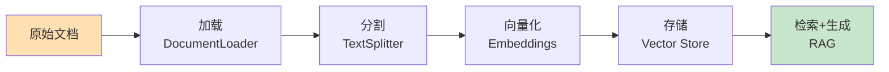
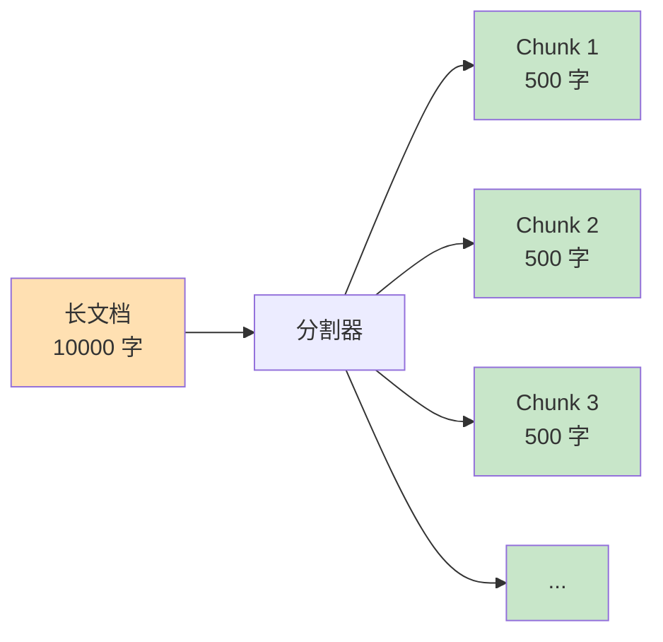

# 第5周：Documents 文档处理

::: tip 本周学习目标
- 📄 掌握文档加载（DocumentLoader）
- ✂️ 理解文档分割（TextSplitter）策略
- 🔍 学习文档检索基础
- 🎯 处理多种文档格式（PDF、Word、Markdown）
- 💡 构建文档问答系统
:::

## 一、文档处理基础

### 1.1 为什么需要文档处理？

在构建 RAG（检索增强生成）系统时，文档处理是关键步骤：



**核心问题：**
1. **上下文窗口限制**：LLM 无法处理超长文档
2. **检索效率**：需要快速找到相关内容
3. **格式多样性**：PDF、Word、HTML 等格式不同

### 1.2 Document 对象

LangChain 的 **Document** 是文档的标准表示：

```python
"""
Document 对象结构
"""
from langchain.schema import Document

# 创建 Document
doc = Document(
    page_content="这是文档的实际内容",  # 必需：文本内容
    metadata={                          # 可选：元数据
        "source": "example.pdf",
        "page": 1,
        "author": "张三"
    }
)

print(f"内容：{doc.page_content}")
print(f"元数据：{doc.metadata}")
```


## 三、文档分割（TextSplitter）

### 3.1 为什么要分割文档？

**问题：**
- LLM 上下文窗口有限（GPT-3.5: 4K, GPT-4: 8K/32K）
- 长文档无法一次处理
- 检索需要精确匹配相关片段

**解决方案：**
将长文档分割成更小的块（chunks）



### 3.2 CharacterTextSplitter

最基础的分割器，按字符数分割：

```python
"""
CharacterTextSplitter 示例
"""
from langchain.text_splitter import CharacterTextSplitter

text = """LangChain 是一个用于开发由语言模型驱动的应用程序的框架。
它提供了标准化的接口和工具链，让开发者能够轻松构建复杂的 AI 应用。

LangChain 的核心组件包括：
1. Models：与 LLM 交互的接口
2. Prompts：管理和优化输入文本
3. Memory：存储对话历史和上下文
4. Chains：组合多个组件的流程
5. Agents：根据输入动态决定行动的智能体
"""

# 创建分割器
splitter = CharacterTextSplitter(
    separator="\n\n",         # 分割符（优先按此分割）
    chunk_size=100,           # 每块最大字符数
    chunk_overlap=20,         # 块之间重叠字符数
    length_function=len       # 计算长度的函数
)

chunks = splitter.split_text(text)

print(f"分割成 {len(chunks)} 块：")
for i, chunk in enumerate(chunks, 1):
    print(f"\n块 {i} ({len(chunk)} 字符):")
    print(chunk)
    print("-" * 60)
```

**关键参数：**
- `chunk_size`：每块的目标大小
- `chunk_overlap`：重叠部分，避免切断语义

```python
# 可视化重叠
"""
原文：ABCDEFGHIJ
chunk_size=5, chunk_overlap=2

块1: ABCDE
块2:    DEFGH  （与块1重叠 DE）
块3:       GHIJ  （与块2重叠 GH）
"""
```

### 3.3 RecursiveCharacterTextSplitter（推荐）

递归地按多个分隔符尝试分割，保持语义完整性：

```python
"""
RecursiveCharacterTextSplitter 示例
推荐使用，智能保持段落和句子完整
"""
from langchain.text_splitter import RecursiveCharacterTextSplitter

text = """# LangChain 入门指南

## 什么是 LangChain？

LangChain 是一个强大的框架。它帮助开发者构建 AI 应用。

## 核心概念

LangChain 包含以下组件：
- Models
- Prompts
- Memory

每个组件都有特定作用。"""

splitter = RecursiveCharacterTextSplitter(
    chunk_size=100,
    chunk_overlap=20,
    separators=["\n\n", "\n", "。", " ", ""]  # 分割优先级
)

chunks = splitter.split_text(text)

for i, chunk in enumerate(chunks, 1):
    print(f"块 {i}:\n{chunk}\n{'='*60}")
```

**分割策略：**
1. 先尝试按 `\n\n`（段落）分割
2. 如果块仍然太大，按 `\n`（行）分割
3. 再大就按 `。`（句子）分割
4. 最后按空格或字符分割

### 3.4 TokenTextSplitter

按 Token 数量分割（更精确）：

```python
"""
TokenTextSplitter 示例
适用于需要精确控制 Token 数的场景
"""
from langchain.text_splitter import TokenTextSplitter

text = "这是一段很长的文本..." * 100

splitter = TokenTextSplitter(
    chunk_size=100,      # 最大 100 tokens
    chunk_overlap=10     # 重叠 10 tokens
)

chunks = splitter.split_text(text)
print(f"分割成 {len(chunks)} 块")

# 验证 token 数
import tiktoken
encoding = tiktoken.encoding_for_model("gpt-3.5-turbo")

for i, chunk in enumerate(chunks[:3], 1):
    token_count = len(encoding.encode(chunk))
    print(f"块 {i}: {token_count} tokens")
```

### 3.5 Markdown 和代码分割器

```python
"""
MarkdownTextSplitter：保持 Markdown 结构
"""
from langchain.text_splitter import MarkdownTextSplitter

markdown_text = """# 标题1

## 小标题1.1
内容1

## 小标题1.2
内容2

# 标题2
内容3"""

splitter = MarkdownTextSplitter(chunk_size=100, chunk_overlap=0)
chunks = splitter.split_text(markdown_text)

for chunk in chunks:
    print(f"块:\n{chunk}\n{'='*60}")
```

```python
"""
代码分割器：按语言智能分割
"""
from langchain.text_splitter import (
    Language,
    RecursiveCharacterTextSplitter
)

# Python 代码分割
python_splitter = RecursiveCharacterTextSplitter.from_language(
    language=Language.PYTHON,
    chunk_size=50,
    chunk_overlap=0
)

code = """
def hello():
    print("Hello")

def world():
    print("World")

class MyClass:
    def __init__(self):
        self.value = 0
"""

chunks = python_splitter.split_text(code)
for i, chunk in enumerate(chunks, 1):
    print(f"代码块 {i}:\n{chunk}\n{'='*60}")
```

### 3.6 分割策略对比

| 分割器 | 优点 | 缺点 | 适用场景 |
|--------|------|------|---------|
| **CharacterTextSplitter** | 简单直接 | 可能切断语义 | 简单文本 |
| **RecursiveCharacterTextSplitter** | 保持语义完整 | 稍慢 | 大多数场景（推荐） |
| **TokenTextSplitter** | 精确控制 Token | 需要编码器 | 严格 Token 限制 |
| **MarkdownTextSplitter** | 保持结构 | 仅限 Markdown | Markdown 文档 |
| **Language-specific** | 代码语义完整 | 仅限代码 | 代码文档 |


## 五、本周练习题

### 练习1：多格式文档加载器（难度：⭐⭐）

**任务**：创建一个统一的文档加载器，自动识别文件类型（txt、pdf、docx）并加载。

<details>
<summary>查看提示</summary>

根据文件扩展名选择不同的 Loader。
</details>

### 练习2：智能分割参数选择（难度：⭐⭐）

**任务**：根据文档长度和类型，自动选择最优的 `chunk_size` 和 `chunk_overlap`。

<details>
<summary>查看提示</summary>

- 短文档（<1000字）：chunk_size=200
- 中等文档（1000-5000字）：chunk_size=500
- 长文档（>5000字）：chunk_size=1000
</details>

### 练习3：文档对比系统（难度：⭐⭐⭐）

**任务**：构建一个系统，比较两个文档的异同。

**要求**：
1. 加载两个文档
2. 提取关键信息
3. 对比差异
4. 生成对比报告


::: tip 学习建议
1. **多实验分割参数**：不同文档类型需要不同参数
2. **关注语义完整性**：优先使用 RecursiveCharacterTextSplitter
3. **测试真实文档**：用实际项目中的文档测试
4. **监控 Token 使用**：分割后注意 Token 数量
:::

**本周完成！准备进入记忆系统！🚀**
