# LangChain学习路线图

## 📚 课程概述

**什么是 LangChain?**

LangChain 是一个强大的框架,用于开发由大语言模型(LLM)驱动的应用程序。它提供了一套完整的工具链,帮助开发者构建智能应用,从简单的聊天机器人到复杂的 AI Agent 系统。

**为什么学习 LangChain?**

- 🚀 **快速开发**: 提供开箱即用的组件,加速 AI 应用开发
- 🔧 **灵活组合**: 模块化设计,可灵活组合各种组件
- 🌐 **生态丰富**: 支持多种 LLM、向量数据库、工具等
- 💼 **企业就绪**: 包含生产环境所需的记忆、缓存、监控等功能
- 📈 **社区活跃**: 持续更新,有大量示例和最佳实践

**学习目标**

通过本路线图学习,你将能够:
- ✅ 理解 LangChain 的核心概念和架构
- ✅ 熟练使用 LangChain 的各种组件
- ✅ 构建实际的 AI 应用(聊天机器人、RAG 系统、Agent 等)
- ✅ 掌握生产环境部署和优化技巧
- ✅ 解决常见问题和性能瓶颈

## 🎯 学习路线图

```mermaid
graph TB
    A[准备阶段<br/>Python基础 + AI概念] --> B[入门阶段<br/>第1-2周]
    B --> C[基础阶段<br/>第3-5周]
    C --> D[进阶阶段<br/>第6-8周]
    D --> E[高级阶段<br/>第9-11周]
    E --> F[实战阶段<br/>第12-16周]

    B1[环境搭建<br/>核心概念] --> B
    C1[LLM集成<br/>Prompt工程<br/>Chains] --> C
    D1[Memory<br/>Tools<br/>Agents] --> D
    E1[RAG系统<br/>向量数据库<br/>高级技巧] --> E
    F1[项目实战<br/>部署优化<br/>最佳实践] --> F

    style A fill:#e1f5fe
    style B fill:#b3e5fc
    style C fill:#81d4fa
    style D fill:#4fc3f7
    style E fill:#29b6f6
    style F fill:#03a9f4
```



## 📅 详细学习计划

### 阶段 0: 准备阶段 (开始前)

**学习目标**: 打好基础,了解必要的前置知识

**前置要求**

1. **Python 基础** (必须)
   - 基本语法和数据结构
   - 面向对象编程
   - 异步编程基础
   - 包管理(pip, conda)

2. **AI/ML 概念** (推荐)
   - 什么是大语言模型(LLM)
   - Token、Embedding 的概念
   - API 调用基础

3. **工具准备**
   - Python 3.8+
   - IDE (VSCode/PyCharm)
   - Git 版本控制
   - OpenAI/Anthropic API Key

**学习资源**

- [Python 官方教程](https://docs.python.org/3/tutorial/)
- [OpenAI API 文档](https://platform.openai.com/docs)
- [Anthropic Claude 文档](https://docs.anthropic.com/)

**检验标准**

✅ 能编写基本的 Python 程序
✅ 理解什么是 API 和 JSON
✅ 知道如何使用 pip 安装包
✅ 获得至少一个 LLM API Key


### 阶段 2: 基础阶段 (第 3-5 周)

**学习目标**: 掌握核心组件,能构建简单应用

#### 第 3 周: Models 和 Output Parsers

**学习内容**

1. **LLM vs Chat Models**
   - 区别和使用场景
   - 参数配置(temperature, max_tokens 等)
   - 流式输出

2. **Output Parsers**
   ```python
   from langchain.output_parsers import PydanticOutputParser
   from pydantic import BaseModel, Field

   class Person(BaseModel):
       name: str = Field(description="人名")
       age: int = Field(description="年龄")

   parser = PydanticOutputParser(pydantic_object=Person)
   ```

3. **Runnable 接口**
   - invoke(), batch(), stream()
   - 异步方法: ainvoke(), abatch(), astream()

**实践项目**
- 实现结构化输出解析
- 对比不同 LLM 的性能
- 实现流式聊天界面

**检验标准**
✅ 能配置和使用不同的 LLM
✅ 能解析结构化输出
✅ 理解同步和异步调用

#### 第 4 周: Chains

**学习内容**

1. **LLMChain**
   ```python
   from langchain.chains import LLMChain

   chain = LLMChain(llm=llm, prompt=prompt)
   result = chain.run(input="...")
   ```

2. **Sequential Chains**
   - SimpleSequentialChain
   - SequentialChain
   - 管道式处理

3. **LCEL (LangChain Expression Language)**
   ```python
   chain = prompt | llm | parser
   result = chain.invoke({"input": "..."})
   ```

**实践项目**
- 创建多步骤处理链
- 实现文本总结后翻译的管道
- 使用 LCEL 简化链定义

**学习资源**
- [Chains 文档](https://python.langchain.com/docs/modules/chains/)
- [LCEL 教程](https://python.langchain.com/docs/expression_language/)

**检验标准**
✅ 能创建和使用各种 Chain
✅ 熟练使用 LCEL 语法
✅ 理解链的组合和复用

#### 第 5 周: Document Loaders 和 Text Splitters

**学习内容**

1. **Document Loaders**
   ```python
   from langchain_community.document_loaders import TextLoader

   loader = TextLoader("data.txt")
   documents = loader.load()
   ```

2. **Text Splitters**
   ```python
   from langchain.text_splitter import RecursiveCharacterTextSplitter

   splitter = RecursiveCharacterTextSplitter(
       chunk_size=1000,
       chunk_overlap=200
   )
   chunks = splitter.split_documents(documents)
   ```

3. **文档处理管道**
   - 加载 → 分割 → 向量化 → 存储

**实践项目**
- 加载不同格式的文档(PDF, CSV, JSON)
- 实验不同的分割策略
- 构建文档预处理管道

**检验标准**
✅ 能加载多种格式文档
✅ 理解分割策略的影响
✅ 能构建完整的文档处理流程


### 阶段 4: 高级阶段 (第 9-11 周)

**学习目标**: 掌握企业级应用开发技能

#### 第 9 周: Embeddings 和 Vector Stores

**学习内容**

1. **Embeddings**
   ```python
   from langchain_openai import OpenAIEmbeddings

   embeddings = OpenAIEmbeddings()
   vector = embeddings.embed_query("Hello")
   ```

2. **Vector Stores**
   - FAISS: 本地向量存储
   - Pinecone: 云端向量数据库
   - Chroma: 开源向量数据库

3. **相似度搜索**
   ```python
   from langchain_community.vectorstores import FAISS

   vectorstore = FAISS.from_documents(docs, embeddings)
   results = vectorstore.similarity_search("query", k=3)
   ```

**实践项目**
- 构建文档向量索引
- 对比不同向量数据库性能
- 实现语义搜索

**检验标准**
✅ 理解 Embeddings 原理
✅ 能使用多种向量数据库
✅ 能实现高效的相似度搜索

#### 第 10 周: RAG (Retrieval-Augmented Generation)

**学习内容**

1. **RAG 基础架构**
   ```
   文档 → 分割 → 向量化 → 存储
              ↓
   查询 → 检索相关文档 → LLM 生成答案
   ```

2. **实现 RAG**
   ```python
   from langchain.chains import RetrievalQA

   qa = RetrievalQA.from_chain_type(
       llm=llm,
       retriever=vectorstore.as_retriever(),
       chain_type="stuff"
   )
   ```

3. **RAG 优化**
   - 重排序(Re-ranking)
   - 混合搜索
   - 上下文压缩

**实践项目**
- 构建知识库问答系统
- 实现文档检索优化
- 添加引用来源

**学习资源**
- [RAG 教程](https://python.langchain.com/docs/use_cases/question_answering/)
- [高级 RAG 技巧](https://blog.langchain.dev/improving-document-retrieval-with-contextual-compression/)

**检验标准**
✅ 理解 RAG 的完整流程
✅ 能构建生产级 RAG 系统
✅ 能优化检索质量

#### 第 11 周: Callbacks 和 Monitoring

**学习内容**

1. **Callbacks**
   ```python
   from langchain.callbacks import StdOutCallbackHandler

   llm = ChatOpenAI(callbacks=[StdOutCallbackHandler()])
   ```

2. **LangSmith**
   - 请求追踪
   - 性能分析
   - 调试工具

3. **自定义监控**
   ```python
   from langchain.callbacks.base import BaseCallbackHandler

   class CustomHandler(BaseCallbackHandler):
       def on_llm_start(self, ...):
           # 记录开始时间
           pass

       def on_llm_end(self, ...):
           # 记录结束时间和 token 使用
           pass
   ```

**实践项目**
- 集成 LangSmith 监控
- 实现成本追踪
- 构建性能仪表盘

**检验标准**
✅ 能使用 Callbacks 监控执行
✅ 能使用 LangSmith 调试
✅ 能实现自定义监控逻辑


## 🛠️ 学习资源汇总

### 官方资源

1. **文档**
   - [LangChain 官方文档](https://python.langchain.com/)
   - [LangChain API 参考](https://api.python.langchain.com/)
   - [LangSmith 文档](https://docs.smith.langchain.com/)

2. **代码示例**
   - [LangChain Templates](https://github.com/langchain-ai/langchain/tree/master/templates)
   - [LangChain Hub](https://smith.langchain.com/hub)
   - [Cookbook](https://github.com/langchain-ai/langchain/tree/master/cookbook)

### 社区资源

1. **教程和文章**
   - [LangChain Blog](https://blog.langchain.dev/)
   - [DeepLearning.AI LangChain 课程](https://www.deeplearning.ai/short-courses/langchain-for-llm-application-development/)
   - [YouTube 教程](https://www.youtube.com/@LangChain)

2. **开源项目**
   - [AutoGPT](https://github.com/Significant-Gravitas/AutoGPT)
   - [LangFlow](https://github.com/logspace-ai/langflow)
   - [Quivr](https://github.com/StanGirard/quivr)

### 工具和框架

1. **开发工具**
   - LangSmith: 调试和监控
   - LangServe: API 服务化
   - LangChain Hub: Prompt 分享

2. **辅助库**
   - ChromaDB: 向量数据库
   - FAISS: 相似度搜索
   - Unstructured: 文档加载


## 💡 学习建议

### 学习方法

1. **理论与实践结合**
   - 看文档 30% + 写代码 70%
   - 每个概念都要写示例代码
   - 遇到问题立即调试

2. **循序渐进**
   - 不要跳跃学习
   - 打好基础再进阶
   - 每周复习前面内容

3. **项目驱动**
   - 从第 4 周开始规划项目
   - 边学边用到项目中
   - 完整项目比小 demo 重要

4. **社区参与**
   - 加入 Discord/Slack 社区
   - 阅读他人代码
   - 分享自己的学习心得

### 常见陷阱

❌ **避免的错误**

1. **直接上手复杂项目**
   - 基础不牢,后期重构痛苦
   - 建议: 从简单示例开始

2. **只看不练**
   - 看懂 ≠ 会用
   - 建议: 每个知识点写代码验证

3. **忽视性能和成本**
   - 开发时疯狂调用 API
   - 建议: 从开始就注意成本控制

4. **不看官方文档**
   - 只看教程容易过时
   - 建议: 遇到问题先查官方文档

### 时间管理

**每周学习计划**

- **工作日**: 每天 1-2 小时
  - 30 分钟: 阅读文档/教程
  - 60 分钟: 编写代码/练习
  - 30 分钟: 总结和记录

- **周末**: 每天 3-4 小时
  - 2 小时: 深入学习新主题
  - 2 小时: 项目实践

**加速学习**

如果你有更多时间,可以:
- 压缩每个阶段到 1 周
- 总学习时间缩短到 8-10 周
- 但不建议跳过任何阶段


## 📝 学习笔记模板

建议每周写学习笔记,推荐格式:

```markdown
# Week X 学习笔记

## 本周目标
- [ ] 目标 1
- [ ] 目标 2

## 学习内容
### 主题 1
- 核心概念
- 关键代码
- 遇到的问题

### 主题 2
...

## 实践项目
- 项目描述
- 实现步骤
- 遇到的坑

## 本周收获
- 学到了什么
- 还有什么不懂
- 下周计划

## 代码片段
​```python
# 本周最有用的代码
...
​```
```


## 🤝 社区和支持

### 官方社区

- [Discord](https://discord.gg/langchain)
- [Twitter](https://twitter.com/LangChainAI)
- [GitHub Discussions](https://github.com/langchain-ai/langchain/discussions)

### 中文社区

- 微信群
- 知乎专栏
- B站视频教程

### 获取帮助

遇到问题时:
1. 🔍 先搜索官方文档
2. 💬 查看 GitHub Issues
3. 🗣️ 在 Discord 提问
4. 📝 写详细的问题描述


**祝学习顺利!** 🚀

有问题欢迎在社区讨论,也期待看到你的项目! 💪

---

**最后更新**: 2025-01-30
**作者**: LemonLog
**版本**: 1.0
