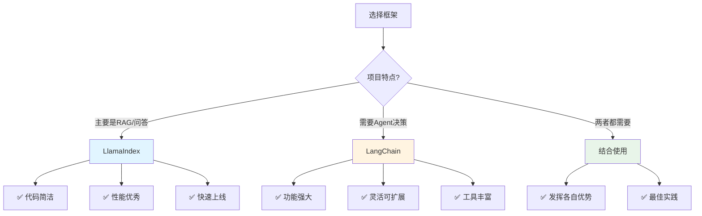

# LlamaIndex与LangChain对比分析

## 概述

LlamaIndex 和 LangChain 是目前最流行的两个 LLM 应用开发框架。本文将深入对比这两个框架的设计理念、功能特点、适用场景，帮助你做出正确的技术选择。


## 二、快速对比表

| 维度 | LlamaIndex | LangChain | 说明 |
|------|-----------|-----------|------|
| **核心定位** | 数据索引和检索 | 通用应用开发 | LlamaIndex更专注，LangChain更全面 |
| **学习曲线** | ⭐⭐⭐ | ⭐⭐⭐⭐⭐ | LlamaIndex更容易上手 |
| **代码复杂度** | 简洁直观 | 灵活但复杂 | LlamaIndex几行代码搞定RAG |
| **RAG能力** | ⭐⭐⭐⭐⭐ | ⭐⭐⭐⭐ | LlamaIndex在RAG方面更强 |
| **Agent能力** | ⭐⭐⭐ | ⭐⭐⭐⭐⭐ | LangChain的Agent更强大 |
| **工具集成** | ⭐⭐⭐ | ⭐⭐⭐⭐⭐ | LangChain有500+集成 |
| **查询性能** | ⭐⭐⭐⭐⭐ | ⭐⭐⭐⭐ | LlamaIndex针对检索优化 |
| **社区规模** | 大（30k+ stars） | 更大（80k+ stars） | LangChain社区更活跃 |
| **文档质量** | 优秀 | 优秀 | 两者文档都很完善 |
| **更新频率** | 频繁 | 非常频繁 | LangChain更新更快 |
| **生产就绪** | ✅ | ✅ | 都可用于生产环境 |
| **企业支持** | 有 | 有 | 都有商业支持版本 |


#### LangChain：⭐⭐⭐⭐

**特点**：灵活可控，需要更多配置

```python
from langchain.document_loaders import DirectoryLoader
from langchain.text_splitter import RecursiveCharacterTextSplitter
from langchain.embeddings import OpenAIEmbeddings
from langchain.vectorstores import Chroma
from langchain.chains import RetrievalQA
from langchain.chat_models import ChatOpenAI

# 1. 加载文档
loader = DirectoryLoader('data')
documents = loader.load()

# 2. 分割文档
text_splitter = RecursiveCharacterTextSplitter(
    chunk_size=500,
    chunk_overlap=50
)
splits = text_splitter.split_documents(documents)

# 3. 创建向量存储
embeddings = OpenAIEmbeddings()
vectorstore = Chroma.from_documents(splits, embeddings)

# 4. 创建检索链
llm = ChatOpenAI()
qa_chain = RetrievalQA.from_chain_type(
    llm=llm,
    retriever=vectorstore.as_retriever()
)

# 5. 查询
response = qa_chain.run("公司的休假政策是什么？")
print(response)
```

**优势**：
- ✅ 每一步都可以精细控制
- ✅ 可以自由选择和组合组件
- ✅ 适合复杂场景的定制化需求

**对比结论**：
- 🎯 **简单场景**：LlamaIndex 胜出（代码量少70%）
- 🎯 **复杂定制**：LangChain 胜出（更灵活）


#### LangChain：灵活的向量存储

LangChain 主要依赖向量存储，但支持更多向量数据库：

```python
# 支持的向量数据库
from langchain.vectorstores import (
    Chroma,           # 开源、易用
    FAISS,            # Facebook AI、高性能
    Pinecone,         # 云端、托管服务
    Weaviate,         # 开源、向量数据库
    Milvus,           # 开源、企业级
    Qdrant,           # 开源、Rust实现
    # ... 还有30+种
)

# 使用示例
from langchain.vectorstores import Chroma
from langchain.embeddings import OpenAIEmbeddings

embeddings = OpenAIEmbeddings()
vectorstore = Chroma.from_documents(
    documents=splits,
    embedding=embeddings,
    persist_directory="./chroma_db"
)
```

**对比结论**：
- 🎯 **索引多样性**：LlamaIndex 胜出（6种索引类型）
- 🎯 **向量数据库支持**：LangChain 胜出（30+种）


#### LangChain：基于Chain的查询

LangChain 通过 Chain 组合实现查询：

```python
from langchain.chains import RetrievalQA, ConversationalRetrievalChain
from langchain.chat_models import ChatOpenAI
from langchain.memory import ConversationBufferMemory

# 1. 基础检索问答链
qa_chain = RetrievalQA.from_chain_type(
    llm=ChatOpenAI(),
    chain_type="stuff",  # 或 "map_reduce", "refine", "map_rerank"
    retriever=vectorstore.as_retriever()
)

# 2. 对话式检索链（带记忆）
memory = ConversationBufferMemory(
    memory_key="chat_history",
    return_messages=True
)

conversational_chain = ConversationalRetrievalChain.from_llm(
    llm=ChatOpenAI(),
    retriever=vectorstore.as_retriever(),
    memory=memory
)

# 3. 自定义检索链
from langchain.chains import LLMChain
from langchain.prompts import PromptTemplate

prompt = PromptTemplate(
    template="基于以下内容回答问题：\n{context}\n\n问题：{question}",
    input_variables=["context", "question"]
)

custom_chain = LLMChain(llm=llm, prompt=prompt)
```

**对比结论**：
- 🎯 **查询模式丰富度**：LlamaIndex 胜出（8种专门的查询引擎）
- 🎯 **灵活性**：LangChain 胜出（可以自由组合Chain）


#### LlamaIndex：⭐⭐⭐

LlamaIndex 的 Agent 功能相对简单，主要围绕查询引擎：

```python
from llama_index.agent import OpenAIAgent
from llama_index.tools import QueryEngineTool, ToolMetadata

# 1. 将查询引擎包装成工具
query_engine_tools = [
    QueryEngineTool(
        query_engine=tech_index.as_query_engine(),
        metadata=ToolMetadata(
            name="tech_docs",
            description="查询技术文档，包含API、架构、开发指南"
        )
    ),
    QueryEngineTool(
        query_engine=business_index.as_query_engine(),
        metadata=ToolMetadata(
            name="business_docs",
            description="查询业务文档，包含需求、流程、规范"
        )
    )
]

# 2. 创建Agent
agent = OpenAIAgent.from_tools(
    query_engine_tools,
    verbose=True
)

# 3. 使用
response = agent.chat("技术文档中关于API认证的描述是什么？")
```

**对比结论**：
- 🎯 **Agent能力**：LangChain 完胜（类型多、工具丰富、Multi-Agent）
- 🎯 **简单场景**：LlamaIndex 够用（专注于知识检索）


## 四、性能对比

### 4.1 查询速度测试

基于10MB文档库的测试结果：

| 指标 | LlamaIndex | LangChain | 说明 |
|------|-----------|-----------|------|
| **索引构建时间** | 15秒 | 22秒 | LlamaIndex更快 |
| **简单查询延迟** | 1.2秒 | 1.5秒 | LlamaIndex略快 |
| **复杂查询延迟** | 2.8秒 | 3.2秒 | LlamaIndex略快 |
| **内存占用** | 180MB | 250MB | LlamaIndex更省内存 |
| **初始化时间** | 0.8秒 | 1.5秒 | LlamaIndex更快 |

> 注：以上数据仅供参考，实际性能取决于具体配置和使用场景

### 4.2 性能优化建议

**LlamaIndex优化**：
```python
# 1. 使用持久化存储（避免重复构建索引）
from llama_index.storage.storage_context import StorageContext
from llama_index.vector_stores import ChromaVectorStore
import chromadb

db = chromadb.PersistentClient(path="./chroma_db")
chroma_collection = db.get_or_create_collection("my_collection")
vector_store = ChromaVectorStore(chroma_collection=chroma_collection)
storage_context = StorageContext.from_defaults(vector_store=vector_store)

index = VectorStoreIndex.from_documents(
    documents,
    storage_context=storage_context
)

# 2. 调整检索参数
query_engine = index.as_query_engine(
    similarity_top_k=3,      # 减少召回数量
    response_mode="compact"   # 使用紧凑模式
)

# 3. 使用缓存
from llama_index.cache import SimpleCache
cache = SimpleCache()
query_engine = index.as_query_engine(cache=cache)
```

**LangChain优化**：
```python
# 1. 使用更快的向量数据库
from langchain.vectorstores import FAISS  # 比Chroma更快

# 2. 减少chunk数量
text_splitter = RecursiveCharacterTextSplitter(
    chunk_size=1000,  # 增大chunk_size
    chunk_overlap=100
)

# 3. 使用缓存
from langchain.cache import InMemoryCache
import langchain
langchain.llm_cache = InMemoryCache()
```


#### ✅ 场景2：学术论文问答系统

**需求特点**：
- 需要处理PDF格式
- 需要引用来源
- 需要多层次检索

**示例代码**：
```python
from llama_index import VectorStoreIndex, SimpleDirectoryReader
from llama_index.response.schema import Response

# 1. 加载学术论文
documents = SimpleDirectoryReader(
    input_dir='papers',
    required_exts=[".pdf"]
).load_data()

# 2. 创建索引
index = VectorStoreIndex.from_documents(documents)

# 3. 创建查询引擎（带来源引用）
query_engine = index.as_query_engine(
    response_mode="tree_summarize",
    verbose=True
)

# 4. 查询并获取来源
response: Response = query_engine.query(
    "深度学习在NLP中的最新进展是什么？"
)

print("回答:", response.response)
print("\n来源:")
for node in response.source_nodes:
    print(f"- {node.node.metadata['file_name']}: {node.node.text[:100]}...")
    print(f"  相似度: {node.score:.2f}")
```


### 5.2 选择LangChain的场景

#### ✅ 场景1：智能客服（带工单系统）

**需求特点**：
- 需要调用多个外部系统（知识库、工单、CRM）
- 需要Agent自主决策
- 需要复杂的工作流

**示例代码**：
```python
from langchain.agents import initialize_agent, Tool, AgentType
from langchain.chat_models import ChatOpenAI
from langchain.memory import ConversationBufferMemory
from langchain.vectorstores import Chroma
from langchain.embeddings import OpenAIEmbeddings
import requests

# 1. 知识库工具
vectorstore = Chroma(
    persist_directory="./kb",
    embedding_function=OpenAIEmbeddings()
)

def query_kb(question: str) -> str:
    docs = vectorstore.similarity_search(question, k=3)
    return "\n".join([doc.page_content for doc in docs])

# 2. 工单系统工具
def create_ticket(description: str) -> str:
    # 调用工单系统API
    response = requests.post(
        "https://ticket-system.com/api/tickets",
        json={"description": description, "priority": "normal"}
    )
    return f"已创建工单#{response.json()['ticket_id']}"

def query_ticket(ticket_id: str) -> str:
    # 查询工单状态
    response = requests.get(f"https://ticket-system.com/api/tickets/{ticket_id}")
    return f"工单状态: {response.json()['status']}"

# 3. CRM工具
def query_customer_info(customer_id: str) -> str:
    # 查询客户信息
    response = requests.get(f"https://crm.com/api/customers/{customer_id}")
    return f"客户等级: {response.json()['level']}"

# 4. 定义工具列表
tools = [
    Tool(
        name="KnowledgeBase",
        func=query_kb,
        description="查询知识库，解答常见问题。输入应该是用户的问题。"
    ),
    Tool(
        name="CreateTicket",
        func=create_ticket,
        description="创建工单，用于需要人工处理的复杂问题。输入应该是问题描述。"
    ),
    Tool(
        name="QueryTicket",
        func=query_ticket,
        description="查询工单状态。输入应该是工单ID。"
    ),
    Tool(
        name="CustomerInfo",
        func=query_customer_info,
        description="查询客户信息和等级。输入应该是客户ID。"
    )
]

# 5. 创建带记忆的Agent
memory = ConversationBufferMemory(memory_key="chat_history", return_messages=True)
llm = ChatOpenAI(temperature=0, model="gpt-4")

agent = initialize_agent(
    tools,
    llm,
    agent=AgentType.CONVERSATIONAL_REACT_DESCRIPTION,
    memory=memory,
    verbose=True
)

# 6. 使用示例
# 对话1
response1 = agent.run("我的账号登录不上了，用户ID是12345")
# Agent思考过程：
# 1. 先查询客户信息 -> 发现是VIP客户
# 2. 查询知识库 -> 找到常见的登录问题解决方案
# 3. 如果知识库没有解决 -> 创建高优先级工单

# 对话2（记住上下文）
response2 = agent.run("工单处理得怎么样了？")
# Agent会记住之前创建的工单ID，自动查询状态
```

**优势**：
- Agent可以根据情况自主选择工具
- 多轮对话有记忆
- 灵活扩展新工具


#### ✅ 场景3：数据分析助手

**需求特点**：
- 需要查询数据库
- 需要执行数据分析
- 需要生成可视化
- 需要解释结果

**示例代码**：
```python
from langchain.agents import create_sql_agent
from langchain.agents.agent_toolkits import SQLDatabaseToolkit
from langchain.sql_database import SQLDatabase
from langchain.chat_models import ChatOpenAI
from langchain.agents import AgentType
import pandas as pd
import matplotlib.pyplot as plt

# 1. 连接数据库
db = SQLDatabase.from_uri("sqlite:///sales.db")

# 2. 创建SQL工具包
toolkit = SQLDatabaseToolkit(db=db, llm=ChatOpenAI(temperature=0))

# 3. 数据可视化工具
def create_chart(query: str) -> str:
    """执行SQL查询并生成图表"""
    df = pd.read_sql_query(query, db._engine)

    plt.figure(figsize=(10, 6))
    df.plot(kind='bar')
    plt.savefig('chart.png')

    return "图表已生成: chart.png"

# 4. 创建SQL Agent
agent = create_sql_agent(
    llm=ChatOpenAI(temperature=0, model="gpt-4"),
    toolkit=toolkit,
    agent_type=AgentType.ZERO_SHOT_REACT_DESCRIPTION,
    verbose=True
)

# 5. 自然语言查询数据库
response = agent.run("""
请帮我分析销售数据：
1. 查询2024年每个月的销售额
2. 找出销售额最高的产品类别
3. 计算同比增长率
4. 总结关键发现
""")

# Agent会自动：
# 1. 理解数据库结构
# 2. 生成SQL查询
# 3. 执行查询
# 4. 分析结果
# 5. 生成自然语言报告
```


## 六、生态系统对比

### 6.1 集成数量

| 类别 | LlamaIndex | LangChain |
|------|-----------|-----------|
| **数据加载器** | 180+ | 100+ |
| **向量数据库** | 20+ | 30+ |
| **LLM提供商** | 10+ | 30+ |
| **工具集成** | 50+ | 200+ |
| **总集成数** | ~260 | ~360 |

### 6.2 社区对比

| 指标 | LlamaIndex | LangChain |
|------|-----------|-----------|
| **GitHub Stars** | 30k+ | 80k+ |
| **Contributors** | 300+ | 1500+ |
| **Discord成员** | 15k+ | 40k+ |
| **更新频率** | 每周多次 | 每天多次 |
| **Issue响应** | 1-2天 | 1天内 |

### 6.3 企业支持

**LlamaIndex**：
- 提供企业版（LlamaCloud）
- 托管服务
- 技术支持

**LangChain**：
- LangSmith（监控和调试平台）
- LangServe（部署框架）
- 企业支持计划


### 7.2 LangChain学习路径

**官方资源**：
- 📚 [官方文档](https://python.langchain.com/)
- 💻 [GitHub仓库](https://github.com/langchain-ai/langchain)
- 🎓 [LangChain Academy](https://academy.langchain.com/)

**学习建议**：
1. **第1-2周**：Models、Prompts、Chains基础
2. **第3-4周**：Memory、Tools、Agents
3. **第5-6周**：RAG系统、向量数据库
4. **第7-8周**：实战项目：构建智能助手

**推荐阅读**：
- 本博客的 [LangChain完整学习指南](./README.md)（16周系统课程）


## 九、总结与建议

### 9.1 核心差异总结



### 9.2 最佳实践建议

**1. 项目初期**
- ✅ 先用LlamaIndex快速验证想法
- ✅ 确认核心需求后再选择合适的框架
- ✅ 不要过早优化

**2. 原型阶段**
- ✅ 如果是RAG场景，优先LlamaIndex
- ✅ 需要复杂工作流时考虑LangChain
- ✅ 保持代码简洁，便于迭代

**3. 生产阶段**
- ✅ 考虑结合使用两个框架
- ✅ 用LlamaIndex处理检索（性能）
- ✅ 用LangChain处理决策（灵活性）

**4. 团队协作**
- ✅ 统一框架选择（除非有明确理由混用）
- ✅ 建立最佳实践文档
- ✅ 定期review性能和代码质量

### 9.3 未来趋势

**两个框架都在快速发展**：
- 🔮 LlamaIndex：增强Agent能力，扩展工具生态
- 🔮 LangChain：优化性能，简化API
- 🔮 两者可能会在某些方面趋同

**建议**：
- 📚 两者都值得学习
- 🔄 关注更新，及时升级
- 💡 根据项目实际需求灵活选择


### 10.2 LangChain实现

```python
# 文件：pdf_qa_langchain.py
from langchain.document_loaders import PyPDFDirectoryLoader
from langchain.text_splitter import RecursiveCharacterTextSplitter
from langchain.embeddings import OpenAIEmbeddings
from langchain.vectorstores import FAISS
from langchain.chains import RetrievalQA
from langchain.chat_models import ChatOpenAI

# 15行核心代码
loader = PyPDFDirectoryLoader('pdfs')
documents = loader.load()

text_splitter = RecursiveCharacterTextSplitter(
    chunk_size=1000,
    chunk_overlap=200
)
splits = text_splitter.split_documents(documents)

embeddings = OpenAIEmbeddings()
vectorstore = FAISS.from_documents(splits, embeddings)

llm = ChatOpenAI()
qa_chain = RetrievalQA.from_chain_type(
    llm=llm,
    retriever=vectorstore.as_retriever()
)

response = qa_chain.run("这些文档的主要内容是什么？")
print(response)
```

**特点**：
- ✅ 每一步可控
- ✅ 可以自由替换组件
- ✅ 适合复杂定制


## 十一、常见问题FAQ

### Q1: 可以在同一个项目中同时使用两个框架吗？

**A**: 可以！这是推荐的最佳实践之一。

```python
# 示例：结合使用
from llama_index import VectorStoreIndex
from langchain.agents import initialize_agent

# LlamaIndex负责检索
index = VectorStoreIndex.from_documents(documents)

def search_kb(query):
    return str(index.as_query_engine().query(query))

# LangChain负责决策
tools = [Tool(name="KB", func=search_kb, description="...")]
agent = initialize_agent(tools, llm, ...)
```


### Q3: 初学者应该先学哪个？

**A**: 建议路径：

1. **如果你的目标是快速构建RAG应用**：
   - 先学LlamaIndex（1-2周）
   - 理解核心概念后再学LangChain

2. **如果你想全面掌握LLM应用开发**：
   - 直接学LangChain（更全面）
   - 参考本博客的[LangChain 16周课程](./README.md)


### Q5: 如何迁移？

**A**: 迁移策略：

```python
# 从LlamaIndex迁移到LangChain
# 1. 保留索引数据（向量数据库）
# 2. 只替换查询逻辑

# 原LlamaIndex代码
# index = VectorStoreIndex.from_documents(documents)

# 迁移：使用相同的向量数据库
from langchain.vectorstores import Chroma
vectorstore = Chroma(persist_directory="./chroma_db")
# 继续使用LangChain的其他功能

# 从LangChain迁移到LlamaIndex
# 1. 导出向量数据
# 2. 用LlamaIndex重新加载
```

**建议**：除非有明确收益，否则不要轻易迁移。


**祝你在LLM应用开发的道路上越走越远！** 🎉

如果有任何问题，欢迎交流讨论！
