# 第4周：Chains 基础

::: tip 本周学习目标
- 🔗 理解 Chain 的概念和作用
- 🛠️ 掌握 LLMChain、SequentialChain 等基础 Chain
- 🚀 学习 LCEL (LangChain Expression Language)
- 🎯 能够组合多个组件构建复杂流程
- 💡 实现实际业务场景的 Chain 应用
:::

## 一、Chain 基础概念

### 1.1 什么是 Chain？

**Chain（链）** 是 LangChain 的核心抽象，用于将多个组件（LLM、Prompts、Tools等）按照特定顺序连接起来，形成完整的工作流程。

```mermaid
graph LR
    A[输入] --> B[步骤1: Prompt]
    B --> C[步骤2: LLM]
    C --> D[步骤3: Parser]
    D --> E[输出]

    style A fill:#E3F2FD
    style E fill:#C8E6C9
    style B fill:#FFF9C4
    style C fill:#FFE0B2
    style D fill:#F8BBD0
```



#### 为什么需要 Chain？

**对比：无 Chain vs 有 Chain**

```python
"""
场景：翻译并总结一段文本
"""
from langchain_openai import ChatOpenAI
from langchain.schema import HumanMessage

llm = ChatOpenAI(model="gpt-3.5-turbo")

# ❌ 方式1：手动管理多个步骤（繁琐）
def manual_translate_and_summarize(text: str) -> str:
    # 步骤1：翻译
    translate_prompt = f"将以下文本翻译成英文：\n{text}"
    translation = llm.invoke([HumanMessage(content=translate_prompt)])

    # 步骤2：总结
    summary_prompt = f"总结以下文本（50字以内）：\n{translation.content}"
    summary = llm.invoke([HumanMessage(content=summary_prompt)])

    return summary.content

# ✅ 方式2：使用 Chain（优雅）
from langchain.chains import LLMChain, SimpleSequentialChain
from langchain.prompts import PromptTemplate

# 定义翻译链
translate_chain = LLMChain(
    llm=llm,
    prompt=PromptTemplate.from_template("将以下文本翻译成英文：\n{text}")
)

# 定义总结链
summary_chain = LLMChain(
    llm=llm,
    prompt=PromptTemplate.from_template("总结以下文本（50字以内）：\n{text}")
)

# 组合成顺序链
overall_chain = SimpleSequentialChain(
    chains=[translate_chain, summary_chain],
    verbose=True  # 显示中间步骤
)

# 使用
result = overall_chain.run("人工智能正在改变世界，它在医疗、教育、交通等领域都有广泛应用。")
```

**Chain 的优势：**

| 特性 | 手动管理 | 使用 Chain |
|------|---------|-----------|
| **代码复用** | ❌ 重复代码多 | ✅ 高度复用 |
| **可维护性** | ❌ 难以维护 | ✅ 结构清晰 |
| **调试** | ❌ 难以追踪 | ✅ 内置调试支持 |
| **扩展性** | ❌ 修改困难 | ✅ 易于扩展 |
| **错误处理** | ❌ 手动处理 | ✅ 自动处理 |

### 1.2 Chain 的类型

LangChain 提供了多种预定义的 Chain：

```mermaid
graph TB
    A[Chain 类型] --> B[基础 Chain]
    A --> C[顺序 Chain]
    A --> D[路由 Chain]
    A --> E[特殊用途 Chain]

    B --> B1[LLMChain<br/>最基础的链]
    B --> B2[TransformChain<br/>数据转换链]

    C --> C1[SimpleSequentialChain<br/>简单顺序链]
    C --> C2[SequentialChain<br/>复杂顺序链]

    D --> D1[RouterChain<br/>条件路由]
    D --> D2[MultiPromptChain<br/>多提示路由]

    E --> E1[ConversationChain<br/>对话链]
    E --> E2[RetrievalQA<br/>问答链]
    E --> E3[SummarizationChain<br/>摘要链]

    style A fill:#E3F2FD
    style B fill:#BBDEFB
    style C fill:#90CAF9
    style D fill:#64B5F6
    style E fill:#42A5F5
```




## 三、顺序 Chain

### 3.1 SimpleSequentialChain

**SimpleSequentialChain** 用于简单的顺序执行，每个 Chain 的输出作为下一个的输入。

```python
"""
SimpleSequentialChain 示例：文章生成流水线
流程：生成大纲 -> 扩写第一段 -> 润色文本
"""
from langchain_openai import ChatOpenAI
from langchain.chains import LLMChain, SimpleSequentialChain
from langchain.prompts import PromptTemplate

llm = ChatOpenAI(model="gpt-3.5-turbo", temperature=0.7)

# Chain 1: 生成大纲
outline_chain = LLMChain(
    llm=llm,
    prompt=PromptTemplate.from_template(
        "为主题'{topic}'生成一个3点大纲"
    )
)

# Chain 2: 扩写第一段
expand_chain = LLMChain(
    llm=llm,
    prompt=PromptTemplate.from_template(
        "根据以下大纲，扩写第一段（100字左右）：\n{outline}"
    )
)

# Chain 3: 润色文本
polish_chain = LLMChain(
    llm=llm,
    prompt=PromptTemplate.from_template(
        "润色以下文本，使其更加流畅：\n{text}"
    )
)

# 组合成顺序链
overall_chain = SimpleSequentialChain(
    chains=[outline_chain, expand_chain, polish_chain],
    verbose=True
)

# 运行
result = overall_chain.run("人工智能的未来")
print(f"\n最终结果：\n{result}")
```

**输出示例：**

```
> Entering new SimpleSequentialChain chain...

1. 人工智能的定义和发展历程
2. 当前人工智能的主要应用领域
3. 未来人工智能的发展趋势和挑战

人工智能（AI）是指让机器模拟人类智能的技术...（第一段扩写）

经过润色的文本：
人工智能作为计算机科学的前沿领域...（润色后的文本）

> Finished chain.
```

::: warning 注意
SimpleSequentialChain 的限制：
- 只能有一个输入和一个输出
- 每个 Chain 的输出必须是字符串
- 不能保留中间结果
:::

### 3.2 SequentialChain

**SequentialChain** 是更强大的顺序链，支持：
- 多个输入和输出
- 保留中间结果
- 更灵活的数据流

```python
"""
SequentialChain 示例：商品评论分析
流程：提取关键词 -> 情感分析 -> 生成回复
"""
from langchain.chains import LLMChain, SequentialChain
from langchain.prompts import PromptTemplate
from langchain_openai import ChatOpenAI

llm = ChatOpenAI(model="gpt-3.5-turbo", temperature=0.3)

# Chain 1: 提取关键词
keyword_chain = LLMChain(
    llm=llm,
    prompt=PromptTemplate(
        input_variables=["review"],
        template="从以下评论中提取3-5个关键词（逗号分隔）：\n{review}\n\n关键词："
    ),
    output_key="keywords"  # 指定输出键名
)

# Chain 2: 情感分析
sentiment_chain = LLMChain(
    llm=llm,
    prompt=PromptTemplate(
        input_variables=["review"],
        template="判断以下评论的情感（正面/负面/中性）：\n{review}\n\n情感："
    ),
    output_key="sentiment"
)

# Chain 3: 生成回复
reply_chain = LLMChain(
    llm=llm,
    prompt=PromptTemplate(
        input_variables=["review", "keywords", "sentiment"],
        template="""作为客服，根据以下信息生成回复：

评论：{review}
关键词：{keywords}
情感：{sentiment}

回复（50字以内）："""
    ),
    output_key="reply"
)

# 组合成 SequentialChain
overall_chain = SequentialChain(
    chains=[keyword_chain, sentiment_chain, reply_chain],
    input_variables=["review"],  # 初始输入
    output_variables=["keywords", "sentiment", "reply"],  # 需要保留的输出
    verbose=True
)

# 测试
review = "这个产品质量很好，物流也很快，但是价格有点贵。客服态度不错。"
result = overall_chain.invoke({"review": review})

print("\n" + "=" * 60)
print("分析结果：")
print(f"关键词：{result['keywords']}")
print(f"情感：{result['sentiment']}")
print(f"回复：{result['reply']}")
print("=" * 60)
```

**输出示例：**

```
============================================================
分析结果：
关键词：质量好, 物流快, 价格贵, 客服态度
情感：正面
回复：感谢您的认可！我们会继续保持优质的产品和服务，同时也会考虑价格优化。
============================================================
```

### 3.3 顺序链的数据流

```mermaid
graph LR
    A[输入: review] --> B[Chain 1<br/>提取关键词]
    B --> C[输出: keywords]
    A --> D[Chain 2<br/>情感分析]
    D --> E[输出: sentiment]

    A --> F[Chain 3<br/>生成回复]
    C --> F
    E --> F
    F --> G[输出: reply]

    style A fill:#E3F2FD
    style G fill:#C8E6C9
    style B fill:#FFE0B2
    style D fill:#FFE0B2
    style F fill:#FFE0B2
```




## 五、实战项目

### 5.1 项目：智能文章生成系统

```python
"""
项目：智能文章生成系统
功能：
1. 生成文章大纲
2. 逐段扩写
3. 添加总结
4. 格式化输出
"""
from langchain_openai import ChatOpenAI
from langchain.prompts import ChatPromptTemplate
from langchain.schema.output_parser import StrOutputParser
from langchain.schema.runnable import RunnablePassthrough

class ArticleGenerator:
    """文章生成器"""

    def __init__(self, model: str = "gpt-3.5-turbo"):
        self.llm = ChatOpenAI(model=model, temperature=0.7)

    def generate_outline(self, topic: str, num_points: int = 3) -> str:
        """生成大纲"""
        chain = (
            ChatPromptTemplate.from_template(
                "为主题'{topic}'生成{num_points}点大纲，每点用一行，格式：\n1. ...\n2. ..."
            )
            | self.llm
            | StrOutputParser()
        )
        return chain.invoke({"topic": topic, "num_points": num_points})

    def expand_point(self, point: str) -> str:
        """扩写单个要点"""
        chain = (
            ChatPromptTemplate.from_template(
                "将以下要点扩写成一段话（100-150字）：\n{point}"
            )
            | self.llm
            | StrOutputParser()
        )
        return chain.invoke({"point": point})

    def generate_conclusion(self, article: str) -> str:
        """生成结论"""
        chain = (
            ChatPromptTemplate.from_template(
                "为以下文章写一个简短的结论（50字以内）：\n\n{article}"
            )
            | self.llm
            | StrOutputParser()
        )
        return chain.invoke({"article": article})

    def generate_article(self, topic: str, num_points: int = 3) -> dict:
        """
        生成完整文章

        返回:
            包含 title, outline, body, conclusion 的字典
        """
        print(f"正在生成文章：{topic}")

        # 步骤1：生成大纲
        print("  [1/4] 生成大纲...")
        outline = self.generate_outline(topic, num_points)
        print(f"  大纲：\n{outline}\n")

        # 步骤2：扩写每个要点
        print("  [2/4] 扩写要点...")
        points = [line.strip() for line in outline.split("\n") if line.strip()]
        paragraphs = []

        for i, point in enumerate(points, 1):
            print(f"    扩写第 {i} 点...")
            paragraph = self.expand_point(point)
            paragraphs.append(paragraph)

        body = "\n\n".join(paragraphs)

        # 步骤3：生成结论
        print("  [3/4] 生成结论...")
        conclusion = self.generate_conclusion(body)

        # 步骤4：格式化
        print("  [4/4] 格式化输出...")
        full_article = f"""# {topic}

## 大纲
{outline}

## 正文
{body}

## 结论
{conclusion}
"""

        return {
            "title": topic,
            "outline": outline,
            "body": body,
            "conclusion": conclusion,
            "full_article": full_article
        }

# 使用示例
if __name__ == "__main__":
    generator = ArticleGenerator()

    result = generator.generate_article(
        topic="人工智能在医疗领域的应用",
        num_points=3
    )

    print("\n" + "=" * 60)
    print(result["full_article"])
    print("=" * 60)
```

### 5.2 项目：多语言翻译校对系统

```python
"""
项目：多语言翻译校对系统
功能：
1. 翻译文本
2. 回译校对
3. 评估翻译质量
4. 提供改进建议
"""
from langchain_openai import ChatOpenAI
from langchain.prompts import ChatPromptTemplate
from langchain.schema.output_parser import StrOutputParser
from langchain.schema.runnable import RunnableParallel

class TranslationReviewer:
    """翻译校对系统"""

    def __init__(self):
        self.llm = ChatOpenAI(model="gpt-3.5-turbo", temperature=0.3)

    def translate(self, text: str, target_language: str) -> str:
        """翻译文本"""
        chain = (
            ChatPromptTemplate.from_template(
                "将以下文本翻译成{target_language}：\n{text}"
            )
            | self.llm
            | StrOutputParser()
        )
        return chain.invoke({"text": text, "target_language": target_language})

    def back_translate(self, text: str, original_language: str) -> str:
        """回译文本"""
        chain = (
            ChatPromptTemplate.from_template(
                "将以下文本翻译成{original_language}：\n{text}"
            )
            | self.llm
            | StrOutputParser()
        )
        return chain.invoke({"text": text, "original_language": original_language})

    def evaluate_quality(self, original: str, back_translated: str) -> dict:
        """评估翻译质量"""
        chain = (
            ChatPromptTemplate.from_template(
                """比较原文和回译文本，评估翻译质量：

原文：{original}
回译：{back_translated}

请提供：
1. 相似度评分（0-100）
2. 主要差异
3. 改进建议

格式：
评分: XX
差异: ...
建议: ..."""
            )
            | self.llm
            | StrOutputParser()
        )
        evaluation = chain.invoke({
            "original": original,
            "back_translated": back_translated
        })

        # 解析评估结果
        lines = evaluation.split("\n")
        score = None
        differences = ""
        suggestions = ""

        for line in lines:
            if "评分" in line or "score" in line.lower():
                import re
                match = re.search(r'\d+', line)
                if match:
                    score = int(match.group())
            elif "差异" in line or "difference" in line.lower():
                differences = line.split(":", 1)[1].strip() if ":" in line else ""
            elif "建议" in line or "suggestion" in line.lower():
                suggestions = line.split(":", 1)[1].strip() if ":" in line else ""

        return {
            "score": score or 0,
            "differences": differences,
            "suggestions": suggestions,
            "full_evaluation": evaluation
        }

    def review_translation(
        self,
        text: str,
        target_language: str,
        original_language: str = "中文"
    ) -> dict:
        """
        完整的翻译校对流程

        返回:
            包含翻译结果和质量评估的字典
        """
        print(f"开始翻译校对流程...")
        print(f"  原文：{text}")

        # 步骤1：翻译
        print(f"\n[1/3] 翻译成{target_language}...")
        translation = self.translate(text, target_language)
        print(f"  译文：{translation}")

        # 步骤2：回译
        print(f"\n[2/3] 回译成{original_language}...")
        back_translation = self.back_translate(translation, original_language)
        print(f"  回译：{back_translation}")

        # 步骤3：评估
        print(f"\n[3/3] 评估翻译质量...")
        evaluation = self.evaluate_quality(text, back_translation)

        print(f"\n评估结果：")
        print(f"  相似度评分：{evaluation['score']}/100")
        print(f"  主要差异：{evaluation['differences']}")
        print(f"  改进建议：{evaluation['suggestions']}")

        return {
            "original": text,
            "translation": translation,
            "back_translation": back_translation,
            "evaluation": evaluation
        }

# 使用示例
if __name__ == "__main__":
    reviewer = TranslationReviewer()

    result = reviewer.review_translation(
        text="人工智能正在深刻改变我们的生活方式和工作方式。",
        target_language="英文",
        original_language="中文"
    )

    print("\n" + "=" * 60)
    print("完整报告：")
    print(f"原文：{result['original']}")
    print(f"译文：{result['translation']}")
    print(f"回译：{result['back_translation']}")
    print(f"质量评分：{result['evaluation']['score']}/100")
    print("=" * 60)
```


## 七、本周总结

### 7.1 知识点清单

- [x] Chain 的概念和作用
- [x] LLMChain 基础用法
- [x] SimpleSequentialChain 和 SequentialChain
- [x] LCEL 语法和高级特性
- [x] 并行执行和条件分支
- [x] 实战项目开发

### 7.2 Chain 选择指南

```mermaid
graph TD
    A[选择 Chain] --> B{几个步骤?}
    B -->|单步骤| C[LLMChain]
    B -->|多步骤| D{需要保留中间结果?}

    D -->|不需要| E[SimpleSequentialChain]
    D -->|需要| F[SequentialChain 或 LCEL]

    F --> G{是否有条件分支?}
    G -->|有| H[LCEL + RunnableBranch]
    G -->|无| I[LCEL 或 SequentialChain]

    style C fill:#C8E6C9
    style E fill:#FFE082
    style F fill:#FFE082
    style H fill:#81C784
    style I fill:#81C784
```



### 7.3 下周预习

**第5周主题：Documents 文档处理**

预习内容：
1. DocumentLoader 的作用
2. TextSplitter 的分割策略
3. 如何处理 PDF、Word 等文件

**思考问题**：
- 为什么要分割文档？
- 如何选择合适的分割大小？

---

::: tip 学习建议
1. **多练习 LCEL**：这是未来的主流语法
2. **理解数据流**：搞清楚每个 Chain 的输入输出
3. **模块化思维**：把复杂任务分解成小的 Chain
4. **实战为主**：通过实际项目巩固知识
:::

**本周完成！继续加油！🚀**
