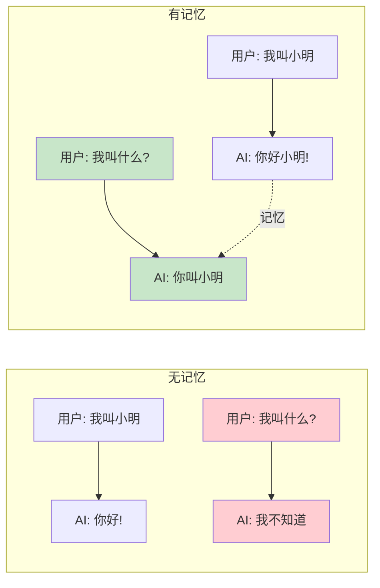
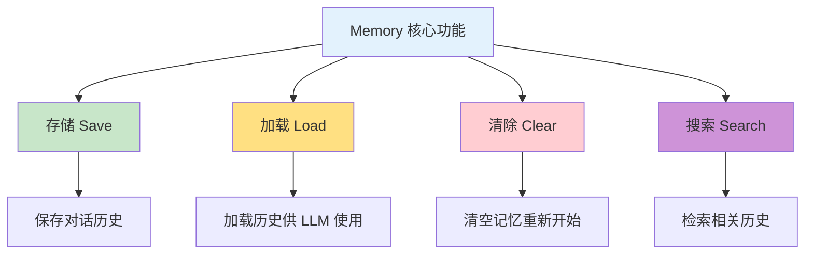
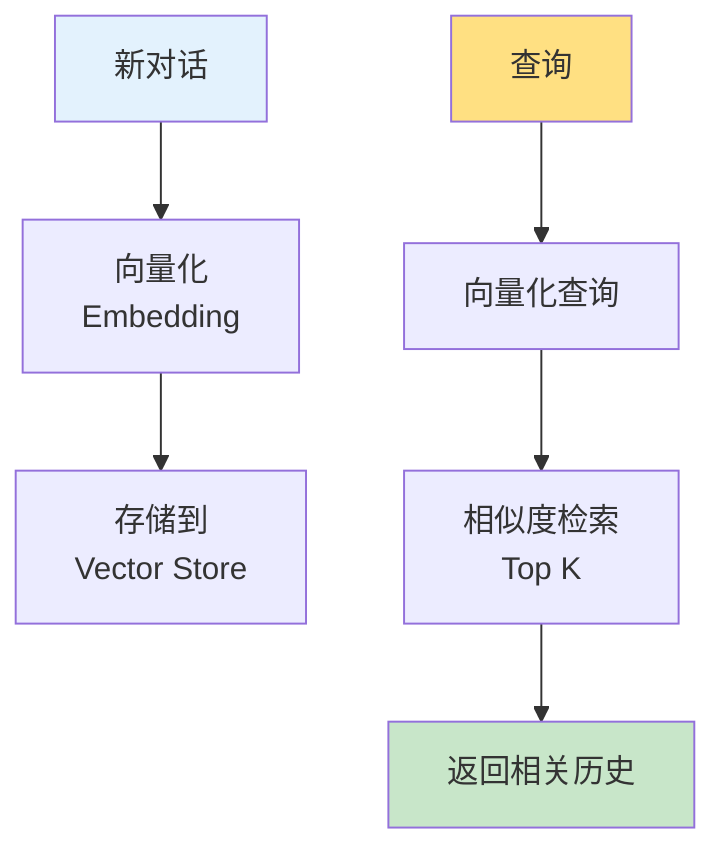
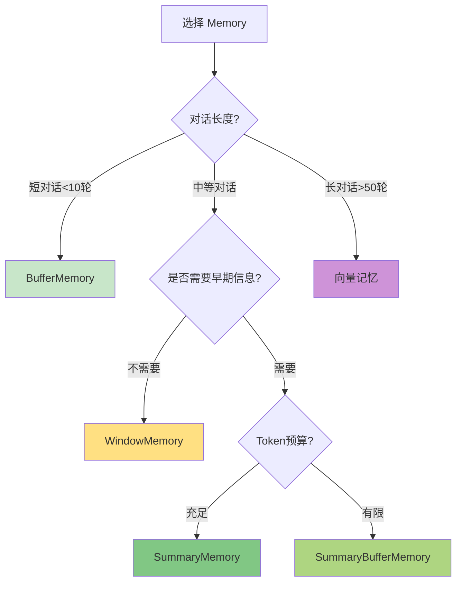

# 第6周：Memory 记忆系统

::: tip 本周学习目标
- 🧠 理解 Memory 的概念和重要性
- 💾 掌握多种 Memory 类型
- 🔄 学会对话历史管理
- 🎯 实现长期记忆和短期记忆
- 💡 构建有记忆的聊天机器人
:::

## 一、Memory 基础概念

### 1.1 什么是 Memory？

**Memory（记忆）** 是 LangChain 中用于存储和管理对话历史、上下文信息的组件。

#### 为什么需要 Memory？

LLM 本身是**无状态**的，每次调用都是独立的：



**对比：无 Memory vs 有 Memory**

```python
"""
对比示例：无记忆 vs 有记忆
"""
from langchain_openai import ChatOpenAI
from langchain.schema import HumanMessage, SystemMessage
from langchain.memory import ConversationBufferMemory
from langchain.chains import ConversationChain

llm = ChatOpenAI(model="gpt-3.5-turbo", temperature=0.7)

print("=" * 60)
print("场景1：无记忆（每次调用独立）")
print("=" * 60)

# 第一次对话
response1 = llm.invoke([
    SystemMessage(content="你是一个助手"),
    HumanMessage(content="我叫小明，今年25岁")
])
print(f"用户: 我叫小明，今年25岁")
print(f"AI: {response1.content}\n")

# 第二次对话（AI 不记得之前的内容）
response2 = llm.invoke([
    SystemMessage(content="你是一个助手"),
    HumanMessage(content="我叫什么名字？")
])
print(f"用户: 我叫什么名字？")
print(f"AI: {response2.content}")
print("❌ AI 无法回答，因为没有记忆\n")

print("=" * 60)
print("场景2：有记忆（使用 ConversationChain）")
print("=" * 60)

# 创建带记忆的对话链
conversation = ConversationChain(
    llm=llm,
    memory=ConversationBufferMemory(),
    verbose=True  # 显示内部处理过程
)

# 第一次对话
response1 = conversation.predict(input="我叫小明，今年25岁")
print(f"用户: 我叫小明，今年25岁")
print(f"AI: {response1}\n")

# 第二次对话（AI 能记住之前的内容）
response2 = conversation.predict(input="我叫什么名字？")
print(f"用户: 我叫什么名字？")
print(f"AI: {response2}")
print("✅ AI 正确回答，因为有记忆")
```

### 1.2 Memory 的核心功能



#### Memory 的生命周期

```python
"""
Memory 的完整生命周期
"""
from langchain.memory import ConversationBufferMemory

# 1. 创建记忆
memory = ConversationBufferMemory()

# 2. 保存对话（Save）
memory.save_context(
    inputs={"input": "你好，我是用户"},
    outputs={"output": "你好！有什么可以帮助你的吗？"}
)

memory.save_context(
    inputs={"input": "今天天气怎么样？"},
    outputs={"output": "抱歉，我无法获取实时天气信息"}
)

# 3. 加载记忆（Load）
history = memory.load_memory_variables({})
print("对话历史：")
print(history['history'])

# 4. 清除记忆（Clear）
memory.clear()
print("\n清除后的历史：")
print(memory.load_memory_variables({})['history'])
```


## 三、高级 Memory 类型

### 3.1 ConversationEntityMemory

**ConversationEntityMemory** 专门提取和存储对话中的实体信息（人物、地点、组织等）。

```python
"""
ConversationEntityMemory 示例
特点：提取并记住实体信息
"""
from langchain_openai import ChatOpenAI
from langchain.memory import ConversationEntityMemory
from langchain.chains import ConversationChain

llm = ChatOpenAI(model="gpt-3.5-turbo")

# 创建实体记忆
memory = ConversationEntityMemory(llm=llm)

conversation = ConversationChain(
    llm=llm,
    memory=memory,
    verbose=True
)

# 对话中包含多个实体
dialogues = [
    "我叫张伟，在阿里巴巴工作",
    "我的同事李娜在字节跳动",
    "我们都在杭州",
    "告诉我关于张伟的信息",
    "李娜在哪个公司？",
]

for dialogue in dialogues:
    print(f"\n用户: {dialogue}")
    response = conversation.predict(input=dialogue)
    print(f"AI: {response}")

# 查看提取的实体
print("\n" + "=" * 60)
print("提取的实体：")
print(memory.entity_store.store)
```

**实体记忆存储结构：**

```python
{
    "张伟": "在阿里巴巴工作",
    "李娜": "是张伟的同事，在字节跳动工作",
    "阿里巴巴": "张伟的公司",
    "字节跳动": "李娜的公司",
    "杭州": "张伟和李娜工作的城市"
}
```

### 3.2 VectorStoreRetrieverMemory

**VectorStoreRetrieverMemory** 使用向量检索来查找相关的历史对话。

```python
"""
VectorStoreRetrieverMemory 示例
特点：基于语义相似度检索历史
"""
# 安装：pip install chromadb
from langchain_openai import ChatOpenAI, OpenAIEmbeddings
from langchain.memory import VectorStoreRetrieverMemory
from langchain.vectorstores import Chroma

# 创建向量存储
embeddings = OpenAIEmbeddings()
vectorstore = Chroma(embedding_function=embeddings)

# 创建检索记忆
retriever = vectorstore.as_retriever(search_kwargs=dict(k=2))
memory = VectorStoreRetrieverMemory(retriever=retriever)

# 添加历史对话
memory.save_context(
    {"input": "我喜欢足球"},
    {"output": "足球是一项很棒的运动"}
)

memory.save_context(
    {"input": "我养了一只猫"},
    {"output": "猫是很可爱的宠物"}
)

memory.save_context(
    {"input": "我在学Python"},
    {"output": "Python是很好的编程语言"}
)

# 基于语义相似度检索
# 提问：关于运动的问题
relevant_history = memory.load_memory_variables(
    {"input": "你知道我喜欢什么运动吗？"}
)

print("相关历史（基于语义相似度）：")
print(relevant_history['history'])
```

**向量记忆原理：**




## 五、实战项目

### 5.1 项目：智能客服系统

```python
"""
项目：带记忆的智能客服系统
功能：
1. 记住用户信息
2. 上下文连贯对话
3. 提取关键信息
4. 生成对话摘要
"""
from langchain_openai import ChatOpenAI
from langchain.chains import ConversationChain
from langchain.memory import ConversationSummaryBufferMemory
from langchain.prompts import PromptTemplate
from datatime import datetime
from typing import Optional

class CustomerServiceBot:
    """智能客服机器人"""

    def __init__(self):
        self.llm = ChatOpenAI(model="gpt-3.5-turbo", temperature=0.7)

        # 自定义系统提示词
        self.prompt = PromptTemplate(
            input_variables=["history", "input"],
            template="""你是一个专业的客服人员，特点：
- 友好、耐心、专业
- 主动询问和记录用户信息（姓名、联系方式、问题）
- 提供有帮助的解决方案

{history}

当前时间：{current_time}
用户：{input}
客服："""
        )

        # 创建记忆（混合策略）
        self.memory = ConversationSummaryBufferMemory(
            llm=self.llm,
            max_token_limit=200
        )

        # 创建对话链
        self.conversation = ConversationChain(
            llm=self.llm,
            memory=self.memory,
            prompt=self.prompt,
            verbose=False
        )

        # 用户信息存储
        self.user_info = {}
        self.conversation_started = datetime.now()

    def chat(self, user_input: str) -> str:
        """
        与用户对话

        参数:
            user_input: 用户输入

        返回:
            客服回复
        """
        # 添加当前时间到 prompt
        response = self.conversation.predict(
            input=user_input,
            current_time=datetime.now().strftime("%Y-%m-%d %H:%M")
        )

        # 尝试提取用户信息（简单关键词匹配）
        self._extract_user_info(user_input)

        return response

    def _extract_user_info(self, text: str):
        """提取用户信息（简化版）"""
        # 提取电话号码
        import re
        phone_pattern = r'1[3-9]\d{9}'
        phones = re.findall(phone_pattern, text)
        if phones:
            self.user_info['phone'] = phones[0]

        # 提取姓名（简单规则）
        if "我叫" in text or "我是" in text:
            parts = text.split("我叫" if "我叫" in text else "我是")
            if len(parts) > 1:
                name = parts[1].split()[0].strip("，。、")
                if len(name) <= 4:
                    self.user_info['name'] = name

    def get_conversation_summary(self) -> str:
        """获取对话摘要"""
        duration = (datetime.now() - self.conversation_started).seconds
        minutes = duration // 60

        summary = f"""
对话摘要报告
{'='*60}
对话时长：{minutes} 分钟
用户信息：{self.user_info if self.user_info else '未收集'}

对话历史：
{self.memory.load_memory_variables({})['history']}
{'='*60}
"""
        return summary

    def reset(self):
        """重置对话"""
        self.memory.clear()
        self.user_info = {}
        self.conversation_started = datetime.now()

# 使用示例
if __name__ == "__main__":
    bot = CustomerServiceBot()

    print("=" * 60)
    print("智能客服系统启动（输入 'quit' 退出，'summary' 查看摘要）")
    print("=" * 60)

    # 模拟对话（也可以改为真实交互）
    test_dialogues = [
        "你好，我想咨询一下你们的产品",
        "我叫李明，想了解价格",
        "我的电话是13812345678",
        "你们有什么优惠活动吗？",
        "好的，我再考虑一下",
    ]

    for user_input in test_dialogues:
        print(f"\n用户: {user_input}")
        response = bot.chat(user_input)
        print(f"客服: {response}")

    # 查看摘要
    print("\n" + bot.get_conversation_summary())
```

### 5.2 项目：个性化学习助手

```python
"""
项目：个性化学习助手
功能：
1. 记住学生的学习进度
2. 根据历史调整教学内容
3. 追踪学习目标
"""
from langchain_openai import ChatOpenAI
from langchain.memory import ConversationEntityMemory
from langchain.chains import ConversationChain
from typing import Dict, List

class LearningAssistant:
    """个性化学习助手"""

    def __init__(self, student_name: str):
        self.student_name = student_name
        self.llm = ChatOpenAI(model="gpt-3.5-turbo", temperature=0.7)

        # 使用实体记忆（记住学习主题、进度等）
        self.memory = ConversationEntityMemory(llm=self.llm)

        self.conversation = ConversationChain(
            llm=self.llm,
            memory=self.memory,
            verbose=True
        )

        # 学习进度追踪
        self.learning_progress: Dict[str, str] = {}
        self.completed_topics: List[str] = []

    def teach(self, student_input: str) -> str:
        """
        教学对话

        参数:
            student_input: 学生输入

        返回:
            助手回复
        """
        # 添加系统上下文
        contextualized_input = f"""学生 {self.student_name} 说: {student_input}

请作为一名耐心的导师回复，根据之前的对话调整教学内容。"""

        response = self.conversation.predict(input=contextualized_input)

        # 检测是否完成某个主题
        if "完成" in student_input or "学会" in student_input:
            self._extract_completed_topic(student_input)

        return response

    def _extract_completed_topic(self, text: str):
        """提取已完成的主题"""
        # 简化的主题提取
        topics = ["Python", "Java", "数据结构", "算法", "机器学习"]
        for topic in topics:
            if topic in text and topic not in self.completed_topics:
                self.completed_topics.append(topic)
                print(f"✅ 已完成主题: {topic}")

    def get_progress_report(self) -> str:
        """生成学习报告"""
        # 使用 LLM 生成报告
        report_prompt = f"""根据以下信息生成学习报告：

学生：{self.student_name}
已完成主题：{', '.join(self.completed_topics) if self.completed_topics else '无'}

对话历史：
{self.memory.load_memory_variables({})['history']}

请生成包含以下内容的报告：
1. 学习进度总结
2. 掌握的知识点
3. 下一步学习建议
"""

        from langchain.schema import HumanMessage
        report = self.llm.invoke([HumanMessage(content=report_prompt)])
        return report.content

# 使用示例
if __name__ == "__main__":
    assistant = LearningAssistant(student_name="小王")

    # 模拟学习对话
    dialogues = [
        "我想学习Python编程",
        "我已经了解变量和数据类型了",
        "能教我循环吗？",
        "我学会了for循环",
        "下一步应该学什么？",
    ]

    for dialogue in dialogues:
        print(f"\n学生: {dialogue}")
        response = assistant.teach(dialogue)
        print(f"助手: {response}")

    # 生成学习报告
    print("\n" + "=" * 60)
    print("学习报告")
    print("=" * 60)
    print(assistant.get_progress_report())
```


## 七、本周总结

### 7.1 知识点清单

- [x] Memory 的概念和重要性
- [x] ConversationBufferMemory（完整保存）
- [x] ConversationBufferWindowMemory（窗口保存）
- [x] ConversationSummaryMemory（总结保存）
- [x] ConversationSummaryBufferMemory（混合）
- [x] ConversationEntityMemory（实体提取）
- [x] VectorStoreRetrieverMemory（向量检索）
- [x] 自定义 Memory 实现

### 7.2 Memory 选择指南



### 7.3 最佳实践

| 场景 | 推荐 Memory | 理由 |
|------|-----------|------|
| 客服聊天 | SummaryBufferMemory | 平衡成本和效果 |
| 代码助手 | WindowMemory | 只需最近上下文 |
| 教育辅导 | EntityMemory | 追踪知识点 |
| 长期陪伴 | VectorMemory | 语义检索历史 |

### 7.4 下周预习

**第7周主题：Tools 工具集成**

预习内容：
1. 什么是 Tool？
2. 如何集成外部 API？
3. 自定义工具开发

**思考问题**：
- AI 如何调用外部工具？
- 如何确保工具调用的安全性？

---

::: tip 学习建议
1. **根据场景选择**：没有最好的 Memory，只有最合适的
2. **监控成本**：总结类 Memory 会增加 LLM 调用
3. **测试长对话**：用实际场景测试 Memory 效果
4. **组合使用**：可以同时使用多种 Memory 策略
:::

**本周完成！下周学习工具集成！🚀**
