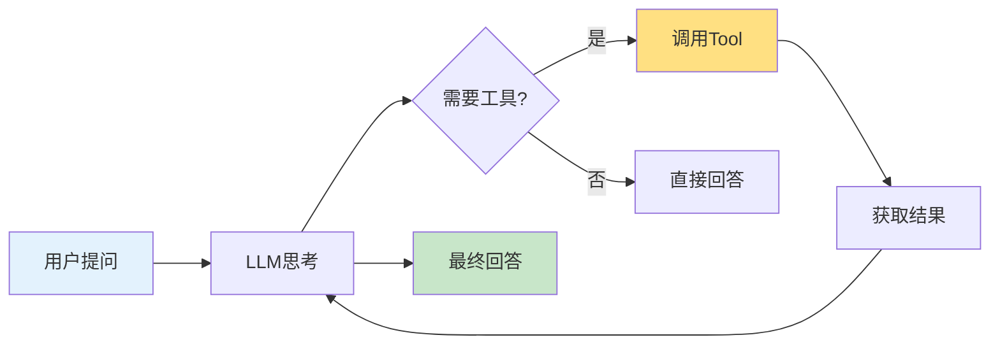

# 第7周：Tools 工具集成

::: tip 本周学习目标
- 🔧 理解 Tool 的概念和作用
- 🛠️ 掌握内置工具的使用
- 🎯 学会自定义工具开发
- 🔌 集成外部 API 和服务
- 💡 构建工具调用系统
:::

## 一、Tool 基础概念

### 1.1 什么是 Tool？

**Tool（工具）** 是 LangChain 中用于扩展 LLM 能力的组件，让 AI 可以：
- 🔍 搜索互联网
- 🧮 执行计算
- 📊 查询数据库
- 🌐 调用 API
- 💻 执行代码



#### 为什么需要 Tool？

**LLM 的局限性：**
1. ❌ 无法获取实时信息（训练数据截止日期之后的）
2. ❌ 数学计算不准确
3. ❌ 无法访问私有数据
4. ❌ 不能执行操作（发邮件、创建文件等）

**Tool 的作用：**
✅ 弥补 LLM 的局限，赋予 AI "行动能力"

### 1.2 Tool 的结构

LangChain 的 Tool 包含三个核心要素：

```python
"""
Tool 的基本结构
"""
from langchain.tools import Tool

def search_function(query: str) -> str:
    """搜索函数的实现"""
    return f"搜索结果：{query}"

# 创建 Tool
search_tool = Tool(
    name="Search",                          # 1. 名称（唯一标识）
    func=search_function,                   # 2. 函数（实际执行的操作）
    description="在互联网上搜索信息"        # 3. 描述（告诉 LLM 何时使用）
)

# 使用 Tool
result = search_tool.run("LangChain 是什么")
print(result)
```

**三要素详解：**

| 要素 | 作用 | 示例 |
|------|------|------|
| **name** | 工具的唯一标识，LLM 通过名称选择工具 | `Search`, `Calculator`, `Weather` |
| **func** | 实际执行的 Python 函数 | `search_function`, `calculate`, `get_weather` |
| **description** | 告诉 LLM 这个工具的功能和使用场景 | "当需要搜索最新信息时使用此工具" |

::: warning description 的重要性
**description 是 LLM 选择工具的唯一依据！**

❌ 不好的描述：
```python
description="搜索工具"  # 太简短，LLM 不知道何时使用
```

✅ 好的描述：
```python
description="""当用户询问最新信息、实时数据或你不知道的内容时使用此工具。
输入：搜索关键词
输出：搜索结果摘要"""
```
:::


## 三、自定义工具

### 3.1 使用 @tool 装饰器

最简单的自定义工具方式：

```python
"""
使用 @tool 装饰器创建工具
"""
from langchain.tools import tool

@tool
def get_word_length(word: str) -> int:
    """
    计算单词的长度。

    参数:
        word: 要计算长度的单词

    返回:
        单词的字符数
    """
    return len(word)

# 工具会自动生成 name 和 description
print(f"工具名称：{get_word_length.name}")
print(f"工具描述：{get_word_length.description}")

# 使用工具
result = get_word_length.run("hello")
print(f"结果：{result}")
```

#### 复杂示例：天气查询工具

```python
"""
天气查询工具示例
"""
from langchain.tools import tool
from typing import Optional
import random  # 模拟 API 调用

@tool
def get_weather(
    city: str,
    units: Optional[str] = "celsius"
) -> str:
    """
    获取指定城市的当前天气信息。

    参数:
        city: 城市名称（如：北京、上海）
        units: 温度单位，可选 "celsius"（摄氏度）或 "fahrenheit"（华氏度）

    返回:
        包含温度、天气状况的字符串

    示例:
        get_weather("北京") -> "北京：晴天，温度25°C"
        get_weather("上海", "fahrenheit") -> "上海：多云，温度77°F"
    """
    # 模拟 API 调用（实际应该调用天气 API）
    temperature = random.randint(15, 35)
    if units == "fahrenheit":
        temperature = temperature * 9/5 + 32

    conditions = random.choice(["晴天", "多云", "阴天", "小雨"])

    unit_symbol = "°C" if units == "celsius" else "°F"

    return f"{city}：{conditions}，温度{temperature}{unit_symbol}"

# 使用
print(get_weather.run("北京"))
print(get_weather.run("上海, units=fahrenheit"))
```

### 3.2 使用 StructuredTool

当需要多个参数或复杂参数时，使用 `StructuredTool`：

```python
"""
StructuredTool 示例：数据库查询工具
"""
from langchain.tools import StructuredTool
from pydantic import BaseModel, Field
from typing import Optional

# 定义输入模式
class DatabaseQueryInput(BaseModel):
    """数据库查询输入模式"""
    table: str = Field(description="表名")
    condition: Optional[str] = Field(None, description="查询条件（WHERE 子句）")
    limit: Optional[int] = Field(10, description="返回结果数量限制")

def query_database(
    table: str,
    condition: Optional[str] = None,
    limit: int = 10
) -> str:
    """
    查询数据库

    这是模拟实现，实际应连接真实数据库
    """
    query = f"SELECT * FROM {table}"

    if condition:
        query += f" WHERE {condition}"

    query += f" LIMIT {limit}"

    # 模拟查询结果
    return f"执行查询：{query}\n结果：[模拟数据行1, 模拟数据行2, ...]"

# 创建结构化工具
db_query_tool = StructuredTool.from_function(
    func=query_database,
    name="DatabaseQuery",
    description="查询数据库表。支持条件过滤和结果数量限制。",
    args_schema=DatabaseQueryInput
)

# 使用
result = db_query_tool.run({
    "table": "users",
    "condition": "age > 18",
    "limit": 5
})
print(result)
```

### 3.3 继承 BaseTool 类

最灵活的方式，适合复杂工具：

```python
"""
继承 BaseTool 创建自定义工具
示例：文件操作工具
"""
from langchain.tools import BaseTool
from typing import Optional, Type
from pydantic import BaseModel, Field
import os

class FileOperationInput(BaseModel):
    """文件操作输入"""
    operation: str = Field(description="操作类型：read, write, list")
    file_path: str = Field(description="文件路径")
    content: Optional[str] = Field(None, description="写入内容（仅 write 操作）")

class FileOperationTool(BaseTool):
    """文件操作工具"""

    name = "FileOperations"
    description = """执行文件操作（读取、写入、列出文件）。

操作类型：
- read: 读取文件内容
- write: 写入内容到文件
- list: 列出目录下的文件

注意：仅允许操作指定目录下的文件。"""

    args_schema: Type[BaseModel] = FileOperationInput

    # 配置：允许操作的目录
    allowed_directory: str = "./safe_dir/"

    def _run(
        self,
        operation: str,
        file_path: str,
        content: Optional[str] = None
    ) -> str:
        """
        同步执行工具

        参数:
            operation: 操作类型
            file_path: 文件路径
            content: 内容（可选）

        返回:
            操作结果
        """
        # 安全检查：确保文件在允许的目录内
        safe_path = os.path.join(self.allowed_directory, file_path)
        safe_path = os.path.normpath(safe_path)

        if not safe_path.startswith(os.path.abspath(self.allowed_directory)):
            return "错误：不允许访问该路径"

        try:
            if operation == "read":
                if not os.path.exists(safe_path):
                    return f"错误：文件不存在 {file_path}"

                with open(safe_path, 'r', encoding='utf-8') as f:
                    return f.read()

            elif operation == "write":
                if content is None:
                    return "错误：写入操作需要提供 content 参数"

                os.makedirs(os.path.dirname(safe_path), exist_ok=True)

                with open(safe_path, 'w', encoding='utf-8') as f:
                    f.write(content)

                return f"成功写入 {len(content)} 个字符到 {file_path}"

            elif operation == "list":
                if not os.path.exists(safe_path):
                    return f"错误：目录不存在 {file_path}"

                files = os.listdir(safe_path)
                return "\n".join(files) if files else "目录为空"

            else:
                return f"错误：不支持的操作类型 {operation}"

        except Exception as e:
            return f"错误：{str(e)}"

    async def _arun(
        self,
        operation: str,
        file_path: str,
        content: Optional[str] = None
    ) -> str:
        """异步执行（可选实现）"""
        # 简单起见，调用同步版本
        return self._run(operation, file_path, content)

# 使用示例
if __name__ == "__main__":
    # 创建安全目录
    os.makedirs("./safe_dir", exist_ok=True)

    # 创建工具
    file_tool = FileOperationTool()

    # 测试：写入文件
    result = file_tool.run({
        "operation": "write",
        "file_path": "test.txt",
        "content": "Hello, LangChain!"
    })
    print(result)

    # 测试：读取文件
    result = file_tool.run({
        "operation": "read",
        "file_path": "test.txt"
    })
    print(f"文件内容：{result}")

    # 测试：列出文件
    result = file_tool.run({
        "operation": "list",
        "file_path": "."
    })
    print(f"文件列表：\n{result}")
```


## 五、工具组合与实战

### 5.1 多工具系统

```python
"""
多工具协作示例
场景：智能研究助手
工具：搜索 + Wikipedia + 计算器
"""
from langchain.tools import DuckDuckGoSearchRun, WikipediaQueryRun, tool
from langchain.utilities import WikipediaAPIWrapper
from typing import List

# 创建工具集合
@tool
def calculator(expression: str) -> str:
    """
    执行数学计算。

    参数:
        expression: 数学表达式

    返回:
        计算结果
    """
    try:
        result = eval(expression, {"__builtins__": {}}, {})
        return str(result)
    except Exception as e:
        return f"计算错误：{str(e)}"

# 组合工具
tools = [
    DuckDuckGoSearchRun(name="Search", description="搜索最新信息"),
    WikipediaQueryRun(
        name="Wikipedia",
        description="从维基百科获取详细背景知识",
        api_wrapper=WikipediaAPIWrapper(top_k_results=1, doc_content_chars_max=500)
    ),
    calculator
]

# 展示工具信息
print("可用工具：")
for tool in tools:
    print(f"\n名称：{tool.name}")
    print(f"描述：{tool.description}")
```

### 5.2 实战项目：智能助手

```python
"""
实战项目：多功能智能助手
功能：
1. 搜索信息
2. 查询天气
3. 进行计算
4. 查询数据库
"""
from langchain_openai import ChatOpenAI
from langchain.agents import initialize_agent, AgentType
from langchain.tools import tool
import random

# 定义工具集
@tool
def search_web(query: str) -> str:
    """
    在互联网上搜索信息。用于查找最新资讯、实时数据。

    参数:
        query: 搜索关键词

    返回:
        搜索结果摘要
    """
    # 这里应该调用真实搜索 API
    return f"关于'{query}'的搜索结果：[模拟搜索内容]"

@tool
def get_weather(city: str) -> str:
    """
    获取指定城市的天气信息。

    参数:
        city: 城市名称

    返回:
        天气信息
    """
    temp = random.randint(15, 30)
    weather = random.choice(["晴天", "多云", "小雨"])
    return f"{city}：{weather}，温度{temp}°C"

@tool
def calculate(expression: str) -> str:
    """
    进行数学计算。支持基本运算（+、-、*、/）。

    参数:
        expression: 数学表达式（如："10 + 20"）

    返回:
        计算结果
    """
    try:
        result = eval(expression, {"__builtins__": {}}, {})
        return f"{expression} = {result}"
    except Exception as e:
        return f"计算错误：{str(e)}"

@tool
def query_database(table: str) -> str:
    """
    查询内部数据库。

    参数:
        table: 表名（支持：users, products, orders）

    返回:
        查询结果
    """
    # 模拟数据库查询
    data = {
        "users": "用户总数：1250",
        "products": "产品总数：580",
        "orders": "订单总数：3240"
    }
    return data.get(table, f"错误：表 {table} 不存在")

# 创建工具列表
tools = [search_web, get_weather, calculate, query_database]

# 创建 Agent（后续章节详细介绍）
llm = ChatOpenAI(model="gpt-3.5-turbo", temperature=0)

agent = initialize_agent(
    tools=tools,
    llm=llm,
    agent=AgentType.ZERO_SHOT_REACT_DESCRIPTION,
    verbose=True,
    handle_parsing_errors=True
)

# 测试不同场景
test_queries = [
    "北京今天天气怎么样？",
    "计算 (100 + 50) * 2",
    "查询 users 表",
    "搜索 LangChain 最新消息"
]

print("=" * 60)
print("智能助手测试")
print("=" * 60)

for query in test_queries:
    print(f"\n用户：{query}")
    try:
        response = agent.run(query)
        print(f"助手：{response}")
    except Exception as e:
        print(f"错误：{str(e)}")
    print("-" * 60)
```


## 七、本周练习题

### 练习1：自定义工具（难度：⭐⭐）

**任务**：创建一个"文本分析工具"。

**要求**：
1. 统计字符数、单词数
2. 提取关键词
3. 判断情感倾向

<details>
<summary>查看提示</summary>

使用 `@tool` 装饰器，集成 jieba 分词库。
</details>

### 练习2：API 集成（难度：⭐⭐）

**任务**：集成一个真实的 API（如新闻 API、翻译 API）。

**要求**：
1. 完整的错误处理
2. 速率限制处理
3. 缓存机制

<details>
<summary>查看提示</summary>

可以使用免费 API：
- NewsAPI: https://newsapi.org/
- 翻译API: https://fanyi-api.baidu.com/
</details>

### 练习3：工具安全（难度：⭐⭐⭐）

**任务**：为 SQL 查询工具添加完善的安全机制。

**要求**：
1. SQL 注入检测
2. 查询白名单
3. 结果大小限制
4. 查询时间限制


::: tip 学习建议
1. **安全第一**：生产环境中必须重视工具安全
2. **完善文档**：工具描述直接影响 LLM 的选择
3. **充分测试**：用边界情况测试工具
4. **监控使用**：记录工具调用情况
5. **渐进集成**：先从简单工具开始
:::

**本周完成！下周学习 Agents！🚀**
