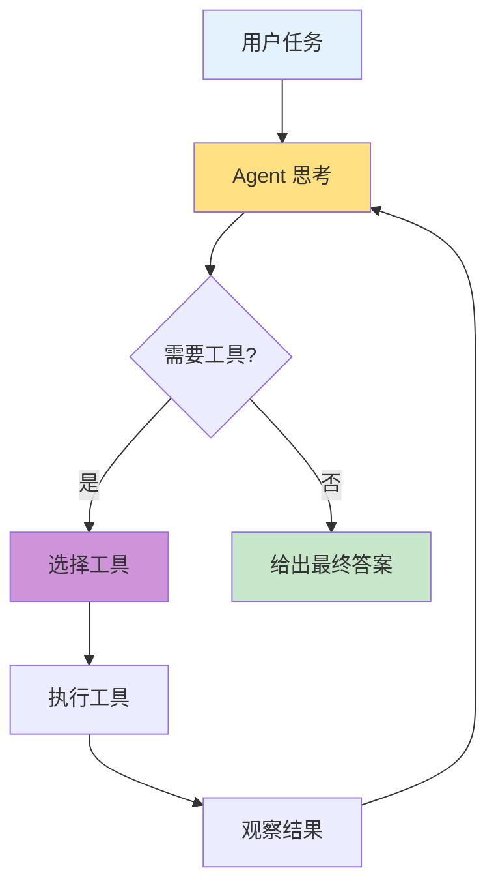
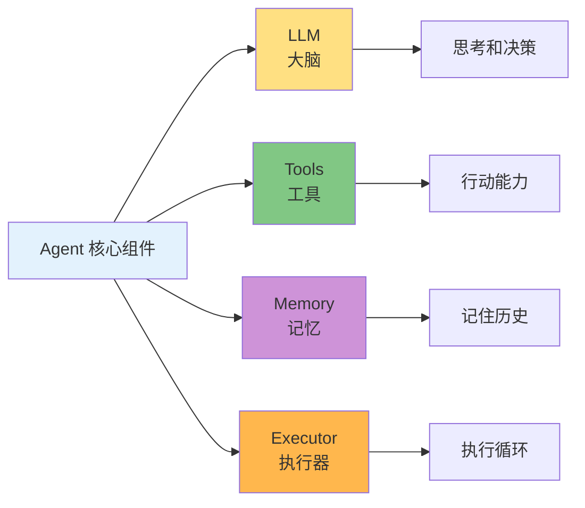
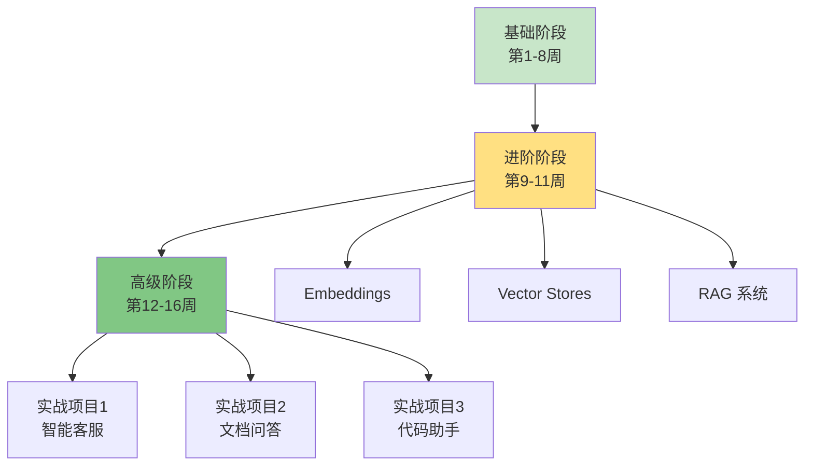

# 第8周：Agents 智能体

::: tip 本周学习目标
- 🤖 理解 Agent 的概念和工作原理
- 🧠 掌握 ReAct 模式
- 🛠️ 学习不同类型的 Agent
- 🎯 构建多步骤任务执行系统
- 💡 实现自主决策的智能助手
:::

## 一、Agent 基础概念

### 1.1 什么是 Agent？

**Agent（智能体）** 是能够自主思考、决策和行动的 AI 系统。与固定流程的 Chain 不同，Agent 可以：
- 🤔 根据任务动态选择工具
- 🔄 循环执行直到完成目标
- 🧩 处理复杂的多步骤任务
- 🎯 自主调整执行策略



#### Chain vs Agent

| 对比项 | Chain | Agent |
|--------|-------|-------|
| **执行方式** | 固定流程 | 动态决策 |
| **适用场景** | 已知步骤 | 未知步骤 |
| **工具使用** | 预定义 | 自主选择 |
| **循环执行** | 否 | 是 |
| **复杂度** | 低 | 高 |

**示例对比：**

```python
"""
Chain vs Agent 对比
任务：查找并总结一篇文章
"""

# ❌ Chain 方式（固定流程）
# 1. 搜索
# 2. 阅读
# 3. 总结
# 问题：如果搜索失败怎么办？如果需要多次搜索？

# ✅ Agent 方式（动态决策）
# 1. 思考：需要搜索文章
# 2. 执行：搜索
# 3. 观察：结果不够好
# 4. 思考：需要再次搜索（使用不同关键词）
# 5. 执行：再次搜索
# 6. 观察：找到合适的文章
# 7. 思考：现在可以总结了
# 8. 执行：生成总结
```

### 1.2 Agent 的核心组件



**组件说明：**

1. **LLM（大脑）**：负责推理和决策
2. **Tools（工具）**：Agent 可以使用的能力集合
3. **Memory（记忆）**：存储执行历史和上下文
4. **Executor（执行器）**：管理思考-行动循环


## 三、LangChain Agent 类型

### 3.1 Zero-shot ReAct Agent

最常用的 Agent 类型，无需示例即可工作。

```python
"""
Zero-shot ReAct Agent
特点：不需要示例，直接使用工具描述
"""
from langchain_openai import ChatOpenAI
from langchain.agents import initialize_agent, AgentType
from langchain.tools import tool

# 定义工具
@tool
def get_word_length(word: str) -> int:
    """返回单词的长度"""
    return len(word)

@tool
def multiply(a: int, b: int) -> int:
    """
    两个数相乘。

    参数:
        a: 第一个数
        b: 第二个数
    """
    return a * b

tools = [get_word_length, multiply]

# 创建 Agent
llm = ChatOpenAI(model="gpt-3.5-turbo", temperature=0)

agent = initialize_agent(
    tools=tools,
    llm=llm,
    agent=AgentType.ZERO_SHOT_REACT_DESCRIPTION,
    verbose=True,  # 显示思考过程
    handle_parsing_errors=True  # 处理解析错误
)

# 使用 Agent
result = agent.run("单词 'artificial' 的长度乘以 5 是多少？")
print(f"\n最终答案：{result}")
```

**输出示例：**

```
> Entering new AgentExecutor chain...

Thought: 我需要先获取单词的长度，然后进行乘法运算

Action: get_word_length
Action Input: artificial

Observation: 10

Thought: 现在我知道单词长度是10，需要乘以5

Action: multiply
Action Input: a=10, b=5

Observation: 50

Thought: 我现在知道最终答案了

Final Answer: 50

> Finished chain.

最终答案：50
```

### 3.2 Conversational Agent

带记忆的对话 Agent，适合多轮交互。

```python
"""
Conversational Agent
特点：支持多轮对话，有记忆
"""
from langchain_openai import ChatOpenAI
from langchain.agents import initialize_agent, AgentType
from langchain.memory import ConversationBufferMemory
from langchain.tools import tool

# 工具
@tool
def save_note(note: str) -> str:
    """保存笔记"""
    # 实际应该保存到数据库
    return f"✅ 笔记已保存：{note}"

@tool
def get_current_time() -> str:
    """获取当前时间"""
    from datetime import datetime
    return datetime.now().strftime("%Y-%m-%d %H:%M:%S")

tools = [save_note, get_current_time]

# 创建记忆
memory = ConversationBufferMemory(
    memory_key="chat_history",
    return_messages=True
)

# 创建 Agent
llm = ChatOpenAI(model="gpt-3.5-turbo", temperature=0.7)

agent = initialize_agent(
    tools=tools,
    llm=llm,
    agent=AgentType.CHAT_CONVERSATIONAL_REACT_DESCRIPTION,
    memory=memory,
    verbose=True
)

# 多轮对话
print("=== 第1轮 ===")
response1 = agent.run("现在几点？")
print(f"回答：{response1}\n")

print("=== 第2轮 ===")
response2 = agent.run("请帮我记录：今天学习了 LangChain Agent")
print(f"回答：{response2}\n")

print("=== 第3轮 ===")
response3 = agent.run("我刚才记录了什么？")  # 测试记忆
print(f"回答：{response3}")
```

### 3.3 Structured Tool Agent

支持复杂参数的工具调用。

```python
"""
Structured Tool Agent
特点：支持多参数工具
"""
from langchain_openai import ChatOpenAI
from langchain.agents import initialize_agent, AgentType
from langchain.tools import StructuredTool
from pydantic import BaseModel, Field

# 定义复杂工具
class SearchInput(BaseModel):
    """搜索输入模式"""
    query: str = Field(description="搜索关键词")
    max_results: int = Field(default=5, description="最多返回结果数")
    language: str = Field(default="zh", description="语言（zh/en）")

def advanced_search(query: str, max_results: int = 5, language: str = "zh") -> str:
    """
    高级搜索工具

    参数:
        query: 搜索关键词
        max_results: 最多返回结果数
        language: 语言
    """
    return f"搜索'{query}'（{language}），返回前{max_results}个结果：[模拟结果]"

search_tool = StructuredTool.from_function(
    func=advanced_search,
    name="AdvancedSearch",
    description="执行高级搜索，支持指定结果数量和语言",
    args_schema=SearchInput
)

# 创建 Agent
llm = ChatOpenAI(model="gpt-3.5-turbo", temperature=0)

agent = initialize_agent(
    tools=[search_tool],
    llm=llm,
    agent=AgentType.STRUCTURED_CHAT_ZERO_SHOT_REACT_DESCRIPTION,
    verbose=True
)

# 使用
result = agent.run("搜索 'LangChain'，返回3个结果，使用英文")
print(f"\n结果：{result}")
```

### 3.4 OpenAI Functions Agent

利用 OpenAI 的 Function Calling 功能（最推荐）。

```python
"""
OpenAI Functions Agent
特点：使用原生 Function Calling，更可靠
"""
from langchain_openai import ChatOpenAI
from langchain.agents import initialize_agent, AgentType
from langchain.tools import tool

@tool
def get_user_info(user_id: int) -> str:
    """
    获取用户信息

    参数:
        user_id: 用户 ID
    """
    # 模拟数据库查询
    users = {
        1: {"name": "张三", "age": 25, "city": "北京"},
        2: {"name": "李四", "age": 30, "city": "上海"}
    }

    user = users.get(user_id)
    if user:
        return f"用户{user_id}：{user['name']}，{user['age']}岁，居住在{user['city']}"
    else:
        return f"用户{user_id}不存在"

@tool
def calculate_age_in_months(age_years: int) -> int:
    """
    将年龄转换为月数

    参数:
        age_years: 年龄（岁）
    """
    return age_years * 12

tools = [get_user_info, calculate_age_in_months]

# 创建 Agent（需要 OpenAI API）
llm = ChatOpenAI(model="gpt-3.5-turbo", temperature=0)

agent = initialize_agent(
    tools=tools,
    llm=llm,
    agent=AgentType.OPENAI_FUNCTIONS,
    verbose=True
)

# 使用
result = agent.run("查询用户1的信息，然后计算他的月龄")
print(f"\n最终答案：{result}")
```


## 五、实战项目

### 5.1 项目：智能研究助手

```python
"""
项目：智能研究助手
功能：
1. 搜索信息
2. 总结要点
3. 保存笔记
4. 生成报告
"""
from langchain_openai import ChatOpenAI
from langchain.agents import initialize_agent, AgentType
from langchain.memory import ConversationBufferMemory
from langchain.tools import tool
from typing import List, Dict
import json

class ResearchAssistant:
    """研究助手"""

    def __init__(self):
        self.llm = ChatOpenAI(model="gpt-3.5-turbo", temperature=0.7)
        self.memory = ConversationBufferMemory(
            memory_key="chat_history",
            return_messages=True
        )

        # 研究笔记存储
        self.notes: List[Dict] = []

        # 创建工具
        self.tools = self._create_tools()

        # 创建 Agent
        self.agent = initialize_agent(
            tools=self.tools,
            llm=self.llm,
            agent=AgentType.CHAT_CONVERSATIONAL_REACT_DESCRIPTION,
            memory=self.memory,
            verbose=True,
            max_iterations=10
        )

    def _create_tools(self):
        """创建工具集"""

        @tool
        def search_web(query: str) -> str:
            """
            在网络上搜索信息

            参数:
                query: 搜索关键词
            """
            # 模拟搜索
            return f"关于'{query}'的搜索结果：[模拟的搜索内容，包含相关信息]"

        @tool
        def save_note(title: str, content: str) -> str:
            """
            保存研究笔记

            参数:
                title: 笔记标题
                content: 笔记内容
            """
            self.notes.append({
                "title": title,
                "content": content,
                "timestamp": self._get_timestamp()
            })
            return f"✅ 笔记已保存：{title}"

        @tool
        def list_notes() -> str:
            """列出所有保存的笔记"""
            if not self.notes:
                return "还没有保存任何笔记"

            result = "已保存的笔记：\n"
            for i, note in enumerate(self.notes, 1):
                result += f"{i}. {note['title']} ({note['timestamp']})\n"

            return result

        @tool
        def generate_report() -> str:
            """根据保存的笔记生成研究报告"""
            if not self.notes:
                return "错误：没有笔记可生成报告"

            # 构建报告
            report = "# 研究报告\n\n"

            for i, note in enumerate(self.notes, 1):
                report += f"## {i}. {note['title']}\n\n"
                report += f"{note['content']}\n\n"

            report += f"---\n报告生成时间：{self._get_timestamp()}"

            return report

        return [search_web, save_note, list_notes, generate_report]

    def _get_timestamp(self) -> str:
        """获取当前时间戳"""
        from datetime import datetime
        return datetime.now().strftime("%Y-%m-%d %H:%M:%S")

    def research(self, topic: str) -> str:
        """
        执行研究任务

        参数:
            topic: 研究主题

        返回:
            研究结果
        """
        prompt = f"""请帮我研究：{topic}

步骤：
1. 搜索相关信息
2. 提取关键要点
3. 保存笔记
4. 如果我要求，生成完整报告

请开始！"""

        return self.agent.run(prompt)

    def chat(self, message: str) -> str:
        """
        对话接口

        参数:
            message: 用户消息
        """
        return self.agent.run(message)

    def export_notes(self, filename: str = "research_notes.json"):
        """导出笔记"""
        with open(filename, 'w', encoding='utf-8') as f:
            json.dump(self.notes, f, ensure_ascii=False, indent=2)

        print(f"✅ 笔记已导出到 {filename}")

# 使用示例
if __name__ == "__main__":
    assistant = ResearchAssistant()

    print("=" * 60)
    print("智能研究助手")
    print("=" * 60)

    # 测试1：研究任务
    print("\n=== 测试1：研究 LangChain ===")
    result = assistant.research("LangChain 框架的核心特性")
    print(f"\n结果：{result}")

    # 测试2：查看笔记
    print("\n=== 测试2：查看笔记 ===")
    result = assistant.chat("列出所有笔记")
    print(f"\n结果：{result}")

    # 测试3：生成报告
    print("\n=== 测试3：生成报告 ===")
    result = assistant.chat("生成研究报告")
    print(f"\n结果：{result}")

    # 导出笔记
    assistant.export_notes()
```

### 5.2 项目：数据分析助手

```python
"""
项目：数据分析 Agent
功能：
1. 读取数据
2. 数据清洗
3. 统计分析
4. 生成可视化
"""
from langchain_openai import ChatOpenAI
from langchain.agents import create_pandas_dataframe_agent
from langchain.agents.agent_types import AgentType
import pandas as pd
import matplotlib.pyplot as plt
import os

class DataAnalysisAssistant:
    """数据分析助手"""

    def __init__(self, df: pd.DataFrame):
        self.df = df
        self.llm = ChatOpenAI(model="gpt-3.5-turbo", temperature=0)

        # 创建 Pandas Agent
        self.agent = create_pandas_dataframe_agent(
            llm=self.llm,
            df=self.df,
            verbose=True,
            agent_type=AgentType.OPENAI_FUNCTIONS,
            allow_dangerous_code=True  # 允许执行代码（谨慎使用！）
        )

    def analyze(self, question: str) -> str:
        """
        分析数据

        参数:
            question: 分析问题

        返回:
            分析结果
        """
        return self.agent.run(question)

    def get_summary(self) -> str:
        """获取数据摘要"""
        return self.agent.run("请提供数据集的概述，包括行数、列数、列名和数据类型")

    def find_insights(self) -> str:
        """发现数据洞察"""
        return self.agent.run("""请分析数据并发现有趣的洞察，例如：
- 异常值
- 相关性
- 趋势
- 分布特征
""")

# 使用示例
if __name__ == "__main__":
    # 创建示例数据
    data = {
        "产品": ["A", "B", "C", "D", "E"],
        "销量": [120, 85, 150, 95, 110],
        "价格": [29.9, 19.9, 49.9, 39.9, 24.9],
        "评分": [4.5, 4.2, 4.8, 4.3, 4.6]
    }

    df = pd.DataFrame(data)

    print("原始数据：")
    print(df)
    print("\n" + "=" * 60)

    # 创建助手
    assistant = DataAnalysisAssistant(df)

    # 测试问题
    questions = [
        "哪个产品销量最高？",
        "价格和评分之间有相关性吗？",
        "计算所有产品的平均价格",
        "找出评分高于4.5的产品"
    ]

    for i, question in enumerate(questions, 1):
        print(f"\n{'='*60}")
        print(f"问题{i}：{question}")
        print('='*60)

        try:
            result = assistant.analyze(question)
            print(f"\n答案：{result}")
        except Exception as e:
            print(f"错误：{str(e)}")
```

### 5.3 项目：任务规划 Agent

```python
"""
项目：任务规划 Agent
功能：
1. 分解复杂任务
2. 生成执行计划
3. 跟踪进度
4. 调整计划
"""
from langchain_openai import ChatOpenAI
from langchain.agents import initialize_agent, AgentType
from langchain.tools import tool
from typing import List, Dict
from enum import Enum

class TaskStatus(Enum):
    """任务状态"""
    TODO = "待办"
    IN_PROGRESS = "进行中"
    DONE = "完成"

class TaskPlanner:
    """任务规划 Agent"""

    def __init__(self):
        self.llm = ChatOpenAI(model="gpt-3.5-turbo", temperature=0.7)
        self.tasks: List[Dict] = []
        self.current_plan = ""

        # 创建工具
        tools = self._create_tools()

        # 创建 Agent
        self.agent = initialize_agent(
            tools=tools,
            llm=self.llm,
            agent=AgentType.OPENAI_FUNCTIONS,
            verbose=True
        )

    def _create_tools(self):
        """创建工具"""

        @tool
        def create_task(title: str, description: str) -> str:
            """
            创建新任务

            参数:
                title: 任务标题
                description: 任务描述
            """
            task_id = len(self.tasks) + 1
            self.tasks.append({
                "id": task_id,
                "title": title,
                "description": description,
                "status": TaskStatus.TODO.value
            })

            return f"✅ 任务已创建：{task_id}. {title}"

        @tool
        def list_tasks() -> str:
            """列出所有任务"""
            if not self.tasks:
                return "当前没有任务"

            result = "任务列表：\n"
            for task in self.tasks:
                status_emoji = {
                    TaskStatus.TODO.value: "⏳",
                    TaskStatus.IN_PROGRESS.value: "🔄",
                    TaskStatus.DONE.value: "✅"
                }

                emoji = status_emoji.get(task["status"], "")
                result += f"{emoji} {task['id']}. {task['title']} ({task['status']})\n"

            return result

        @tool
        def update_task_status(task_id: int, status: str) -> str:
            """
            更新任务状态

            参数:
                task_id: 任务 ID
                status: 新状态（待办/进行中/完成）
            """
            # 验证状态
            valid_statuses = [s.value for s in TaskStatus]
            if status not in valid_statuses:
                return f"错误：无效状态。有效值：{', '.join(valid_statuses)}"

            # 查找任务
            for task in self.tasks:
                if task["id"] == task_id:
                    task["status"] = status
                    return f"✅ 任务{task_id}状态已更新为：{status}"

            return f"错误：未找到任务{task_id}"

        @tool
        def save_plan(plan: str) -> str:
            """
            保存执行计划

            参数:
                plan: 计划内容
            """
            self.current_plan = plan
            return "✅ 计划已保存"

        return [create_task, list_tasks, update_task_status, save_plan]

    def plan_project(self, project_description: str) -> str:
        """
        规划项目

        参数:
            project_description: 项目描述

        返回:
            规划结果
        """
        prompt = f"""请帮我规划以下项目：

{project_description}

步骤：
1. 分析项目需求
2. 分解为具体任务
3. 为每个任务创建记录
4. 生成执行计划
5. 保存计划

请开始！"""

        return self.agent.run(prompt)

    def get_progress(self) -> Dict:
        """获取进度统计"""
        if not self.tasks:
            return {"total": 0, "todo": 0, "in_progress": 0, "done": 0}

        stats = {
            "total": len(self.tasks),
            "todo": 0,
            "in_progress": 0,
            "done": 0
        }

        for task in self.tasks:
            status = task["status"]
            if status == TaskStatus.TODO.value:
                stats["todo"] += 1
            elif status == TaskStatus.IN_PROGRESS.value:
                stats["in_progress"] += 1
            elif status == TaskStatus.DONE.value:
                stats["done"] += 1

        stats["completion_rate"] = f"{stats['done'] / stats['total'] * 100:.1f}%"

        return stats

# 使用示例
if __name__ == "__main__":
    planner = TaskPlanner()

    print("=" * 60)
    print("任务规划 Agent")
    print("=" * 60)

    # 规划项目
    project = """开发一个个人博客网站，功能包括：
- 用户注册登录
- 文章发布和编辑
- 评论系统
- 标签分类
- 搜索功能
"""

    print("\n项目描述：")
    print(project)

    print("\n开始规划...")
    result = planner.plan_project(project)

    print("\n" + "=" * 60)
    print("规划结果：")
    print(result)

    print("\n" + "=" * 60)
    print("进度统计：")
    print(planner.get_progress())
```


## 七、本周练习题

### 练习1：构建简单 Agent（难度：⭐⭐）

**任务**：创建一个"天气助手 Agent"。

**要求**：
1. 工具：查询天气、查询时间、发送提醒
2. 能够回答："明天天气如何？需要带伞吗？"
3. 使用 Zero-shot ReAct Agent

### 练习2：多工具协作（难度：⭐⭐⭐）

**任务**：创建"新闻摘要 Agent"。

**要求**：
1. 工具：搜索新闻、翻译文本、保存摘要
2. 流程：搜索 -> 翻译 -> 总结 -> 保存
3. 使用 Conversational Agent 支持多轮对话

### 练习3：实战项目（难度：⭐⭐⭐⭐）

**任务**：构建"个人财务助手"。

**要求**：
1. 工具：记录收支、查询余额、生成报表、预算建议
2. 支持自然语言操作（"记录今天买菜花了50元"）
3. 能够分析消费习惯并给出建议
4. 导出月度财务报告


## 九、进阶方向

### 9.1 学习路径



### 9.2 推荐资源

**官方资源：**
- [LangChain 文档](https://python.langchain.com/)
- [LangChain GitHub](https://github.com/langchain-ai/langchain)
- [LangChain Blog](https://blog.langchain.dev/)

**社区资源：**
- [LangChain Discord](https://discord.gg/langchain)
- [LangChain 中文社区](https://github.com/lijiext/langchain-zh)

**实战项目：**
- [LangChain Cookbook](https://github.com/langchain-ai/langchain/tree/master/cookbook)
- [Awesome LangChain](https://github.com/kyrolabs/awesome-langchain)

---

::: tip 学习建议
1. **多实践**：每个概念都要动手写代码
2. **做项目**：将学到的知识整合到实际项目
3. **读源码**：深入理解 LangChain 的实现
4. **加入社区**：与其他开发者交流经验
5. **持续学习**：AI 领域发展迅速，保持学习
:::

**恭喜完成基础阶段！继续加油！🚀🚀🚀**
