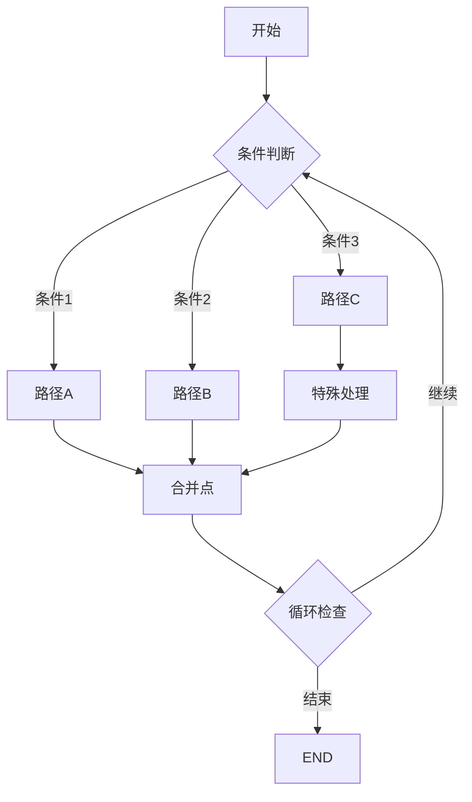

# 路由与控制流

## 一、概述

路由和控制流决定了工作流的执行路径，是实现复杂业务逻辑的关键。



## 二、条件路由

### 2.1 基础条件路由

```python
from langgraph.graph import StateGraph, END
from typing import TypedDict

class RouteState(TypedDict):
    score: float
    category: str
    retry_count: int

def simple_router(state: RouteState) -> str:
    """简单路由函数"""
    if state["score"] > 0.8:
        return "excellent"
    elif state["score"] > 0.6:
        return "good"
    elif state["score"] > 0.4:
        return "fair"
    else:
        return "poor"

# 在图中使用
graph = StateGraph(RouteState)
graph.add_conditional_edges(
    "evaluate",
    simple_router,
    {
        "excellent": "reward",
        "good": "approve",
        "fair": "review",
        "poor": "reject"
    }
)
```

### 2.2 多条件路由

```python
def complex_router(state: RouteState) -> str:
    """复杂的多条件路由"""
    score = state.get("score", 0)
    category = state.get("category", "")
    retry_count = state.get("retry_count", 0)

    # 优先级规则
    if retry_count >= 3:
        return "max_retries_exceeded"

    if category == "urgent":
        if score > 0.5:
            return "fast_track"
        else:
            return "urgent_review"

    if category == "normal":
        if score > 0.7:
            return "auto_approve"
        elif score > 0.4:
            return "manual_review"
        else:
            return "reject"

    return "unknown_category"
```

### 2.3 动态路由

```python
from typing import Dict, List

class DynamicRouteState(TypedDict):
    available_nodes: List[str]
    routing_rules: Dict[str, str]
    current_context: Dict

def dynamic_router(state: DynamicRouteState) -> str:
    """根据运行时配置动态路由"""
    context = state["current_context"]

    # 从状态中获取路由规则
    rules = state["routing_rules"]

    for condition, target in rules.items():
        # 动态评估条件
        if eval(condition, {"state": state, "context": context}):
            # 检查目标节点是否可用
            if target in state["available_nodes"]:
                return target

    return "default"

# 使用示例
state = {
    "available_nodes": ["node1", "node2", "node3"],
    "routing_rules": {
        "context['priority'] == 'high'": "node1",
        "context['type'] == 'batch'": "node2",
        "True": "node3"  # 默认规则
    },
    "current_context": {"priority": "high", "type": "single"}
}
```

## 三、循环控制

### 3.1 简单循环

```python
class LoopState(TypedDict):
    counter: int
    max_iterations: int
    result: str
    should_continue: bool

def loop_decision(state: LoopState) -> str:
    """决定是否继续循环"""
    if state["counter"] >= state["max_iterations"]:
        return "exit"

    if state.get("result") == "success":
        return "exit"

    return "continue"

def process_iteration(state: LoopState) -> LoopState:
    """处理单次迭代"""
    import random

    # 模拟处理
    success = random.random() > 0.3

    return {
        "counter": state["counter"] + 1,
        "result": "success" if success else "retry",
        "should_continue": not success
    }

# 构建循环图
graph = StateGraph(LoopState)
graph.add_node("process", process_iteration)
graph.add_node("exit", lambda s: s)

graph.add_conditional_edges(
    "process",
    loop_decision,
    {
        "continue": "process",  # 循环回自己
        "exit": "exit"
    }
)
```

### 3.2 嵌套循环

```python
class NestedLoopState(TypedDict):
    outer_index: int
    inner_index: int
    matrix: List[List[int]]
    results: List[int]

def outer_loop_controller(state: NestedLoopState) -> str:
    """外层循环控制"""
    if state["outer_index"] >= len(state["matrix"]):
        return "complete"
    return "inner_loop"

def inner_loop_controller(state: NestedLoopState) -> str:
    """内层循环控制"""
    row = state["matrix"][state["outer_index"]]

    if state["inner_index"] >= len(row):
        # 内层循环结束，返回外层
        return "next_outer"
    return "process_element"

def process_element(state: NestedLoopState) -> NestedLoopState:
    """处理矩阵元素"""
    element = state["matrix"][state["outer_index"]][state["inner_index"]]

    return {
        "results": state["results"] + [element * 2],
        "inner_index": state["inner_index"] + 1
    }

def next_outer_iteration(state: NestedLoopState) -> NestedLoopState:
    """进入下一个外层迭代"""
    return {
        "outer_index": state["outer_index"] + 1,
        "inner_index": 0
    }
```

### 3.3 防止无限循环

```python
from datetime import datetime, timedelta

class SafeLoopState(TypedDict):
    iteration_count: int
    start_time: str
    max_duration_seconds: int
    max_iterations: int

def safe_loop_guard(state: SafeLoopState) -> str:
    """安全的循环守卫"""
    # 检查迭代次数
    if state["iteration_count"] >= state["max_iterations"]:
        print(f"⚠️ 达到最大迭代次数: {state['max_iterations']}")
        return "force_exit"

    # 检查执行时间
    start = datetime.fromisoformat(state["start_time"])
    elapsed = (datetime.now() - start).total_seconds()

    if elapsed > state["max_duration_seconds"]:
        print(f"⚠️ 超过最大执行时间: {state['max_duration_seconds']}秒")
        return "timeout_exit"

    return "continue"
```

## 四、并行执行

### 4.1 并行分支

```python
from typing import List, Dict

class ParallelState(TypedDict):
    input_data: List[Dict]
    branch_a_result: List
    branch_b_result: List
    branch_c_result: List
    final_result: Dict

def split_router(state: ParallelState) -> List[str]:
    """分割到多个并行分支"""
    # 返回多个目标节点，它们会并行执行
    return ["branch_a", "branch_b", "branch_c"]

def branch_a_process(state: ParallelState) -> ParallelState:
    """分支A处理"""
    result = [d["value"] * 2 for d in state["input_data"]]
    return {"branch_a_result": result}

def branch_b_process(state: ParallelState) -> ParallelState:
    """分支B处理"""
    result = [d["value"] ** 2 for d in state["input_data"]]
    return {"branch_b_result": result}

def branch_c_process(state: ParallelState) -> ParallelState:
    """分支C处理"""
    result = [d["value"] + 10 for d in state["input_data"]]
    return {"branch_c_result": result}

def merge_results(state: ParallelState) -> ParallelState:
    """合并并行结果"""
    return {
        "final_result": {
            "doubled": state["branch_a_result"],
            "squared": state["branch_b_result"],
            "plus_ten": state["branch_c_result"]
        }
    }
```

### 4.2 Map-Reduce 模式

```python
class MapReduceState(TypedDict):
    chunks: List[List[int]]
    mapped_results: List[int]
    reduced_result: int

def mapper(chunk: List[int]) -> int:
    """Map函数：处理单个数据块"""
    return sum(chunk)

def map_controller(state: MapReduceState) -> List[str]:
    """创建多个映射任务"""
    # 为每个数据块创建一个映射节点
    return [f"map_{i}" for i in range(len(state["chunks"]))]

def create_map_node(chunk_index: int):
    """动态创建映射节点"""
    def map_node(state: MapReduceState) -> MapReduceState:
        chunk = state["chunks"][chunk_index]
        result = mapper(chunk)
        return {
            "mapped_results": state.get("mapped_results", []) + [result]
        }
    return map_node

def reducer(state: MapReduceState) -> MapReduceState:
    """Reduce函数：聚合所有映射结果"""
    total = sum(state["mapped_results"])
    return {"reduced_result": total}
```

## 五、中断与恢复

### 5.1 人工审核中断

```python
from langgraph.checkpoint.memory import MemorySaver

class ApprovalState(TypedDict):
    document: str
    auto_score: float
    needs_review: bool
    human_decision: str
    approved: bool

def auto_evaluate(state: ApprovalState) -> ApprovalState:
    """自动评估"""
    # 计算分数
    score = len(state["document"]) / 100.0  # 简单示例

    needs_review = score < 0.7

    return {
        "auto_score": score,
        "needs_review": needs_review
    }

def human_review_needed(state: ApprovalState) -> str:
    """检查是否需要人工审核"""
    if state["needs_review"]:
        return "human_review"
    return "auto_approve"

# 创建带中断的图
graph = StateGraph(ApprovalState)
graph.add_node("evaluate", auto_evaluate)
graph.add_node("human_review", lambda s: s)  # 等待人工输入
graph.add_node("approve", lambda s: {"approved": True})
graph.add_node("reject", lambda s: {"approved": False})

graph.add_conditional_edges(
    "evaluate",
    human_review_needed,
    {
        "human_review": "human_review",
        "auto_approve": "approve"
    }
)

# 编译时指定中断点
app = graph.compile(
    checkpointer=MemorySaver(),
    interrupt_before=["human_review"]  # 在人工审核前中断
)

# 执行到中断点
config = {"configurable": {"thread_id": "review-001"}}
state = app.invoke({"document": "Short doc"}, config)

# 人工介入并恢复
app.update_state(config, {"human_decision": "approve"})
result = app.invoke(None, config)  # 从中断点继续
```

### 5.2 错误恢复

```python
class RetryState(TypedDict):
    task_id: str
    attempts: List[Dict]
    max_retries: int
    last_error: str
    status: str

def attempt_task(state: RetryState) -> RetryState:
    """尝试执行任务"""
    import random
    import traceback

    attempt = {
        "attempt_number": len(state.get("attempts", [])) + 1,
        "timestamp": datetime.now().isoformat()
    }

    try:
        # 模拟可能失败的任务
        if random.random() < 0.5:
            raise Exception("Random failure")

        attempt["status"] = "success"
        return {
            "attempts": [attempt],
            "status": "completed"
        }

    except Exception as e:
        attempt["status"] = "failed"
        attempt["error"] = str(e)

        return {
            "attempts": [attempt],
            "last_error": str(e),
            "status": "failed"
        }

def retry_decision(state: RetryState) -> str:
    """决定是否重试"""
    if state["status"] == "completed":
        return "success"

    attempts = len(state.get("attempts", []))
    if attempts >= state["max_retries"]:
        return "max_retries_exceeded"

    # 指数退避
    import time
    wait_time = 2 ** attempts
    print(f"等待 {wait_time} 秒后重试...")
    time.sleep(wait_time)

    return "retry"
```

## 六、高级控制模式

### 6.1 状态机模式

```python
from enum import Enum

class OrderStatus(Enum):
    PENDING = "pending"
    CONFIRMED = "confirmed"
    PROCESSING = "processing"
    SHIPPED = "shipped"
    DELIVERED = "delivered"
    CANCELLED = "cancelled"

class OrderState(TypedDict):
    order_id: str
    status: OrderStatus
    payment_confirmed: bool
    inventory_checked: bool
    shipping_address: str

def state_machine_router(state: OrderState) -> str:
    """基于状态机的路由"""
    status = state["status"]

    transitions = {
        OrderStatus.PENDING: {
            "payment_confirmed": OrderStatus.CONFIRMED,
            "cancelled": OrderStatus.CANCELLED
        },
        OrderStatus.CONFIRMED: {
            "inventory_available": OrderStatus.PROCESSING,
            "inventory_unavailable": OrderStatus.CANCELLED
        },
        OrderStatus.PROCESSING: {
            "shipped": OrderStatus.SHIPPED,
            "processing_error": OrderStatus.CANCELLED
        },
        OrderStatus.SHIPPED: {
            "delivered": OrderStatus.DELIVERED,
            "returned": OrderStatus.CANCELLED
        }
    }

    # 根据当前状态和条件决定下一步
    current_transitions = transitions.get(status, {})

    for condition, next_status in current_transitions.items():
        if evaluate_condition(state, condition):
            return next_status.value

    return "wait"

def evaluate_condition(state: OrderState, condition: str) -> bool:
    """评估状态转换条件"""
    conditions = {
        "payment_confirmed": state.get("payment_confirmed", False),
        "inventory_available": check_inventory(state["order_id"]),
        "shipped": check_shipping_status(state["order_id"]),
        # ... 其他条件
    }
    return conditions.get(condition, False)
```

### 6.2 优先级队列路由

```python
import heapq
from typing import List, Tuple

class PriorityTask(TypedDict):
    id: str
    priority: int  # 越小越高优先级
    data: Dict

class PriorityQueueState(TypedDict):
    task_queue: List[Tuple[int, str, Dict]]  # (priority, id, data)
    current_task: Optional[PriorityTask]
    processing: bool

def priority_router(state: PriorityQueueState) -> str:
    """基于优先级的任务路由"""
    if state["processing"]:
        return "wait"

    if not state["task_queue"]:
        return "idle"

    # 获取最高优先级任务
    priority, task_id, data = heapq.heappop(state["task_queue"])

    # 根据优先级决定处理路径
    if priority <= 1:
        return "urgent_handler"
    elif priority <= 5:
        return "normal_handler"
    else:
        return "batch_handler"
```

### 6.3 动态图修改

```python
class DynamicGraphState(TypedDict):
    workflow_definition: Dict
    current_node: str
    executed_nodes: List[str]

def dynamic_node_executor(state: DynamicGraphState) -> DynamicGraphState:
    """动态执行节点"""
    current = state["current_node"]
    definition = state["workflow_definition"]

    # 获取节点定义
    node_def = definition["nodes"][current]

    # 动态执行节点逻辑
    if node_def["type"] == "function":
        # 执行函数
        result = eval(node_def["code"])(state)
    elif node_def["type"] == "decision":
        # 执行决策逻辑
        result = evaluate_decision(state, node_def["conditions"])

    return {
        "executed_nodes": state["executed_nodes"] + [current],
        **result
    }

def dynamic_router(state: DynamicGraphState) -> str:
    """基于工作流定义的动态路由"""
    current = state["current_node"]
    definition = state["workflow_definition"]

    # 获取下一个节点
    edges = definition["edges"]
    next_nodes = edges.get(current, [])

    if not next_nodes:
        return END

    # 如果有多个下一节点，使用条件选择
    if len(next_nodes) > 1:
        return select_next_node(state, next_nodes)

    return next_nodes[0]
```

## 七、实战案例：复杂审批流程

```python
from langgraph.graph import StateGraph, END
from typing import TypedDict, List, Optional, Dict
from enum import Enum
from datetime import datetime

class ApprovalLevel(Enum):
    TEAM_LEAD = 1
    MANAGER = 2
    DIRECTOR = 3
    VP = 4

class ApprovalFlowState(TypedDict):
    request_id: str
    amount: float
    department: str
    purpose: str
    approvals: List[Dict]
    current_level: ApprovalLevel
    status: str  # pending, approved, rejected
    comments: List[str]

def determine_approval_level(state: ApprovalFlowState) -> ApprovalFlowState:
    """根据金额确定审批级别"""
    amount = state["amount"]

    if amount <= 1000:
        required_level = ApprovalLevel.TEAM_LEAD
    elif amount <= 5000:
        required_level = ApprovalLevel.MANAGER
    elif amount <= 20000:
        required_level = ApprovalLevel.DIRECTOR
    else:
        required_level = ApprovalLevel.VP

    return {
        "current_level": required_level,
        "comments": [f"需要 {required_level.name} 级别审批"]
    }

def team_lead_approval(state: ApprovalFlowState) -> ApprovalFlowState:
    """团队负责人审批"""
    # 模拟审批逻辑
    approved = state["amount"] <= 1000

    approval = {
        "level": "TEAM_LEAD",
        "approved": approved,
        "timestamp": datetime.now().isoformat(),
        "comments": "团队负责人审批通过" if approved else "金额超出权限"
    }

    return {
        "approvals": [approval],
        "status": "approved" if approved else "escalate"
    }

def manager_approval(state: ApprovalFlowState) -> ApprovalFlowState:
    """经理审批"""
    approved = state["amount"] <= 5000 and state["department"] != "R&D"

    approval = {
        "level": "MANAGER",
        "approved": approved,
        "timestamp": datetime.now().isoformat(),
        "comments": "经理审批通过" if approved else "需要更高级别审批"
    }

    return {
        "approvals": [approval],
        "status": "approved" if approved else "escalate"
    }

def approval_router(state: ApprovalFlowState) -> str:
    """审批路由逻辑"""
    if state["status"] == "approved":
        return "notify_approved"
    elif state["status"] == "rejected":
        return "notify_rejected"
    elif state["status"] == "escalate":
        # 升级到下一级别
        current = state["current_level"]
        if current == ApprovalLevel.TEAM_LEAD:
            return "manager_approval"
        elif current == ApprovalLevel.MANAGER:
            return "director_approval"
        elif current == ApprovalLevel.DIRECTOR:
            return "vp_approval"
        else:
            return "final_review"
    else:
        return "determine_level"

def create_approval_flow():
    """创建审批流程图"""
    graph = StateGraph(ApprovalFlowState)

    # 添加节点
    graph.add_node("determine_level", determine_approval_level)
    graph.add_node("team_lead_approval", team_lead_approval)
    graph.add_node("manager_approval", manager_approval)
    # ... 添加其他审批节点
    graph.add_node("notify_approved", lambda s: {**s, "status": "completed"})
    graph.add_node("notify_rejected", lambda s: {**s, "status": "rejected"})

    # 设置路由
    graph.add_conditional_edges(
        "determine_level",
        lambda s: f"{s['current_level'].name.lower()}_approval",
        {
            "team_lead_approval": "team_lead_approval",
            "manager_approval": "manager_approval",
            # ... 其他级别
        }
    )

    # 从每个审批节点路由
    for node in ["team_lead_approval", "manager_approval"]:
        graph.add_conditional_edges(
            node,
            approval_router,
            {
                "notify_approved": "notify_approved",
                "notify_rejected": "notify_rejected",
                "manager_approval": "manager_approval",
                # ... 其他路由
            }
        )

    graph.set_entry_point("determine_level")

    return graph.compile()

# 测试审批流程
def test_approval_flow():
    flow = create_approval_flow()

    test_cases = [
        {"request_id": "REQ001", "amount": 500, "department": "Sales", "purpose": "客户招待"},
        {"request_id": "REQ002", "amount": 3000, "department": "Marketing", "purpose": "广告投放"},
        {"request_id": "REQ003", "amount": 15000, "department": "R&D", "purpose": "设备采购"},
    ]

    for case in test_cases:
        print(f"\n处理申请: {case['request_id']} - 金额: ${case['amount']}")
        result = flow.invoke({**case, "approvals": [], "comments": []})
        print(f"最终状态: {result['status']}")
        print(f"审批记录: {result['approvals']}")
```

## 八、最佳实践

### 8.1 路由设计原则

1. **明确性**：路由条件应该清晰明确
2. **完整性**：覆盖所有可能的情况
3. **可测试**：路由逻辑易于单元测试
4. **可维护**：避免过度复杂的嵌套条件

### 8.2 性能优化

1. **减少分支**：合并相似的处理路径
2. **提前退出**：尽早检测并处理异常情况
3. **缓存决策**：避免重复计算路由条件
4. **并行处理**：充分利用并行执行能力

### 8.3 错误处理

1. **默认路径**：始终提供默认处理路径
2. **超时控制**：设置最大执行时间
3. **循环检测**：防止无限循环
4. **状态验证**：在关键节点验证状态

## 九、总结

掌握路由与控制流让你能够：

- ✅ 实现复杂的业务逻辑
- ✅ 优化执行效率
- ✅ 提高系统的灵活性
- ✅ 更好地处理异常情况
- ✅ 构建可扩展的工作流

---

**下一步：** 学习 [06.节点开发指南](./06.节点开发指南) 深入掌握节点的开发技巧！