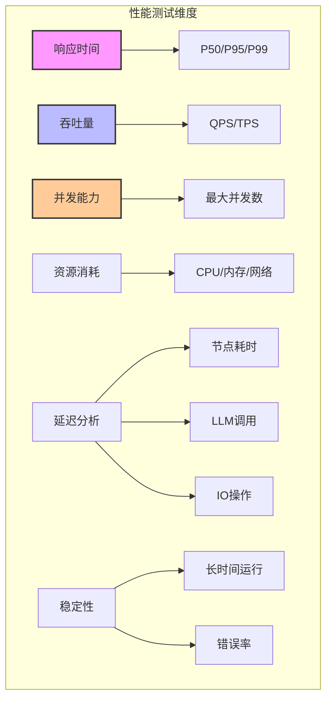

# 性能测试与基准

## 概述

性能测试是确保 LangGraph 应用在生产环境中稳定运行的关键。本文档提供完整的性能测试策略、基准测试方法和优化建议。



## 1. 性能测试框架

### 1.1 基础测试框架搭建

```python
# performance_test_framework.py
import time
import asyncio
import statistics
from typing import List, Dict, Any, Callable
from dataclasses import dataclass, field
from datetime import datetime
import psutil
import tracemalloc
from concurrent.futures import ThreadPoolExecutor, ProcessPoolExecutor
import json

@dataclass
class PerformanceMetrics:
    """性能指标数据类"""
    test_name: str
    start_time: datetime
    end_time: datetime
    total_requests: int
    successful_requests: int
    failed_requests: int
    response_times: List[float]
    memory_usage: List[float]
    cpu_usage: List[float]
    errors: List[str] = field(default_factory=list)

    @property
    def duration(self) -> float:
        """总耗时"""
        return (self.end_time - self.start_time).total_seconds()

    @property
    def throughput(self) -> float:
        """吞吐量 (请求/秒)"""
        return self.successful_requests / self.duration if self.duration > 0 else 0

    @property
    def error_rate(self) -> float:
        """错误率"""
        return self.failed_requests / self.total_requests if self.total_requests > 0 else 0

    @property
    def latency_percentiles(self) -> Dict[str, float]:
        """延迟百分位数"""
        if not self.response_times:
            return {"p50": 0, "p95": 0, "p99": 0}

        sorted_times = sorted(self.response_times)
        return {
            "p50": statistics.quantiles(sorted_times, n=100)[49],
            "p95": statistics.quantiles(sorted_times, n=100)[94],
            "p99": statistics.quantiles(sorted_times, n=100)[98],
            "mean": statistics.mean(sorted_times),
            "min": min(sorted_times),
            "max": max(sorted_times)
        }

    def generate_report(self) -> str:
        """生成性能报告"""
        latency = self.latency_percentiles
        return f"""
=== 性能测试报告: {self.test_name} ===
测试时间: {self.start_time} - {self.end_time}
持续时间: {self.duration:.2f} 秒

请求统计:
- 总请求数: {self.total_requests}
- 成功请求: {self.successful_requests}
- 失败请求: {self.failed_requests}
- 错误率: {self.error_rate:.2%}

性能指标:
- 吞吐量: {self.throughput:.2f} req/s
- 平均延迟: {latency['mean']:.3f}s
- P50延迟: {latency['p50']:.3f}s
- P95延迟: {latency['p95']:.3f}s
- P99延迟: {latency['p99']:.3f}s
- 最小延迟: {latency['min']:.3f}s
- 最大延迟: {latency['max']:.3f}s

资源使用:
- 平均CPU: {statistics.mean(self.cpu_usage) if self.cpu_usage else 0:.1f}%
- 峰值CPU: {max(self.cpu_usage) if self.cpu_usage else 0:.1f}%
- 平均内存: {statistics.mean(self.memory_usage) if self.memory_usage else 0:.1f} MB
- 峰值内存: {max(self.memory_usage) if self.memory_usage else 0:.1f} MB
"""

class PerformanceTester:
    """性能测试器"""

    def __init__(self, workflow_app):
        self.app = workflow_app
        self.metrics = None
        self.process = psutil.Process()

    async def run_single_test(
        self,
        input_data: Dict,
        config: Dict = None
    ) -> tuple[float, bool, str]:
        """运行单个测试"""
        start_time = time.perf_counter()
        error_msg = ""
        success = False

        try:
            result = await self.app.ainvoke(input_data, config)
            success = True
        except Exception as e:
            error_msg = str(e)

        elapsed = time.perf_counter() - start_time
        return elapsed, success, error_msg

    async def run_concurrent_test(
        self,
        test_name: str,
        input_data: Dict,
        num_requests: int,
        num_concurrent: int,
        config: Dict = None
    ) -> PerformanceMetrics:
        """运行并发测试"""
        print(f"开始性能测试: {test_name}")
        print(f"总请求数: {num_requests}, 并发数: {num_concurrent}")

        metrics = PerformanceMetrics(
            test_name=test_name,
            start_time=datetime.now(),
            end_time=datetime.now(),
            total_requests=num_requests,
            successful_requests=0,
            failed_requests=0,
            response_times=[],
            memory_usage=[],
            cpu_usage=[]
        )

        # 启动资源监控
        monitor_task = asyncio.create_task(self._monitor_resources(metrics))

        # 创建请求队列
        semaphore = asyncio.Semaphore(num_concurrent)

        async def run_with_semaphore():
            async with semaphore:
                return await self.run_single_test(input_data, config)

        # 并发执行测试
        tasks = [run_with_semaphore() for _ in range(num_requests)]
        results = await asyncio.gather(*tasks)

        # 收集结果
        for elapsed, success, error_msg in results:
            if success:
                metrics.successful_requests += 1
                metrics.response_times.append(elapsed)
            else:
                metrics.failed_requests += 1
                metrics.errors.append(error_msg)

        metrics.end_time = datetime.now()

        # 停止资源监控
        monitor_task.cancel()

        self.metrics = metrics
        return metrics

    async def _monitor_resources(self, metrics: PerformanceMetrics):
        """监控资源使用"""
        while True:
            try:
                # CPU使用率
                cpu_percent = self.process.cpu_percent()
                metrics.cpu_usage.append(cpu_percent)

                # 内存使用
                memory_mb = self.process.memory_info().rss / 1024 / 1024
                metrics.memory_usage.append(memory_mb)

                await asyncio.sleep(0.5)
            except asyncio.CancelledError:
                break
            except Exception as e:
                print(f"监控错误: {e}")

    def run_load_test(
        self,
        test_name: str,
        input_data: Dict,
        duration_seconds: int,
        target_qps: int,
        config: Dict = None
    ) -> PerformanceMetrics:
        """运行负载测试"""
        print(f"开始负载测试: {test_name}")
        print(f"持续时间: {duration_seconds}秒, 目标QPS: {target_qps}")

        async def load_test():
            metrics = PerformanceMetrics(
                test_name=test_name,
                start_time=datetime.now(),
                end_time=datetime.now(),
                total_requests=0,
                successful_requests=0,
                failed_requests=0,
                response_times=[],
                memory_usage=[],
                cpu_usage=[]
            )

            # 计算请求间隔
            interval = 1.0 / target_qps

            # 启动资源监控
            monitor_task = asyncio.create_task(self._monitor_resources(metrics))

            start_time = time.time()
            next_request_time = start_time

            while time.time() - start_time < duration_seconds:
                # 发送请求
                elapsed, success, error_msg = await self.run_single_test(input_data, config)

                metrics.total_requests += 1
                if success:
                    metrics.successful_requests += 1
                    metrics.response_times.append(elapsed)
                else:
                    metrics.failed_requests += 1
                    metrics.errors.append(error_msg)

                # 控制发送速率
                next_request_time += interval
                sleep_time = next_request_time - time.time()
                if sleep_time > 0:
                    await asyncio.sleep(sleep_time)

            metrics.end_time = datetime.now()
            monitor_task.cancel()

            return metrics

        return asyncio.run(load_test())
```

### 1.2 专门的 LangGraph 性能测试

```python
# langgraph_performance_test.py
from langgraph.graph import StateGraph, END
from typing import TypedDict, Annotated, List
from operator import add
import time

class TestState(TypedDict):
    input: str
    processing_steps: Annotated[List[str], add]
    result: str
    node_timings: Dict[str, float]

class LangGraphPerformanceTester:
    """LangGraph 专用性能测试器"""

    def __init__(self):
        self.node_timings = {}
        self.workflow = self._create_test_workflow()

    def _create_test_workflow(self) -> StateGraph:
        """创建测试工作流"""
        workflow = StateGraph(TestState)

        # 添加计时装饰器
        def timed_node(name: str):
            def decorator(func):
                def wrapper(state):
                    start = time.perf_counter()
                    result = func(state)
                    elapsed = time.perf_counter() - start

                    # 记录节点耗时
                    if "node_timings" not in result:
                        result["node_timings"] = {}
                    result["node_timings"][name] = elapsed

                    return result
                return wrapper
            return decorator

        @timed_node("preprocess")
        def preprocess_node(state):
            # 模拟预处理
            time.sleep(0.01)
            return {
                "processing_steps": [f"Preprocessed at {time.time()}"]
            }

        @timed_node("process")
        def process_node(state):
            # 模拟处理
            time.sleep(0.05)
            return {
                "processing_steps": [f"Processed at {time.time()}"]
            }

        @timed_node("postprocess")
        def postprocess_node(state):
            # 模拟后处理
            time.sleep(0.01)
            return {
                "result": "completed",
                "processing_steps": [f"Postprocessed at {time.time()}"]
            }

        # 构建工作流
        workflow.add_node("preprocess", preprocess_node)
        workflow.add_node("process", process_node)
        workflow.add_node("postprocess", postprocess_node)

        workflow.set_entry_point("preprocess")
        workflow.add_edge("preprocess", "process")
        workflow.add_edge("process", "postprocess")
        workflow.add_edge("postprocess", END)

        return workflow.compile()

    def run_node_performance_test(self, num_iterations: int = 100) -> Dict:
        """测试节点性能"""
        node_timings_list = []

        for i in range(num_iterations):
            initial_state = {
                "input": f"test_input_{i}",
                "processing_steps": [],
                "result": "",
                "node_timings": {}
            }

            result = self.workflow.invoke(initial_state)
            node_timings_list.append(result["node_timings"])

        # 分析节点性能
        analysis = {}
        nodes = ["preprocess", "process", "postprocess"]

        for node in nodes:
            timings = [t[node] for t in node_timings_list if node in t]
            if timings:
                analysis[node] = {
                    "mean": statistics.mean(timings),
                    "min": min(timings),
                    "max": max(timings),
                    "p50": statistics.quantiles(timings, n=100)[49],
                    "p95": statistics.quantiles(timings, n=100)[94],
                    "p99": statistics.quantiles(timings, n=100)[98]
                }

        return analysis
```

## 2. 基准测试场景

### 2.1 基础性能基准

```python
# benchmark_suite.py
import pytest
import asyncio
from typing import List, Dict
import numpy as np

class LangGraphBenchmarkSuite:
    """LangGraph 基准测试套件"""

    def __init__(self):
        self.results = {}

    def benchmark_simple_chain(self, num_nodes: int = 5) -> Dict:
        """测试简单链式工作流"""

        workflow = StateGraph(State)

        # 创建链式节点
        for i in range(num_nodes):
            def node_func(state, idx=i):
                return {"step": idx}

            workflow.add_node(f"node_{i}", node_func)

            if i == 0:
                workflow.set_entry_point(f"node_{i}")
            else:
                workflow.add_edge(f"node_{i-1}", f"node_{i}")

        workflow.add_edge(f"node_{num_nodes-1}", END)
        app = workflow.compile()

        # 运行基准测试
        times = []
        for _ in range(100):
            start = time.perf_counter()
            app.invoke({"step": 0})
            times.append(time.perf_counter() - start)

        return {
            "num_nodes": num_nodes,
            "mean_time": np.mean(times),
            "std_time": np.std(times),
            "min_time": np.min(times),
            "max_time": np.max(times)
        }

    def benchmark_parallel_nodes(self, num_parallel: int = 5) -> Dict:
        """测试并行节点性能"""

        workflow = StateGraph(State)

        # 分发节点
        def split_node(state):
            return {"tasks": list(range(num_parallel))}

        workflow.add_node("split", split_node)
        workflow.set_entry_point("split")

        # 并行处理节点
        for i in range(num_parallel):
            def parallel_node(state, idx=i):
                time.sleep(0.01)  # 模拟处理
                return {f"result_{idx}": f"done_{idx}"}

            workflow.add_node(f"parallel_{i}", parallel_node)
            workflow.add_edge("split", f"parallel_{i}")

        # 汇聚节点
        def merge_node(state):
            return {"merged": True}

        workflow.add_node("merge", merge_node)

        for i in range(num_parallel):
            workflow.add_edge(f"parallel_{i}", "merge")

        workflow.add_edge("merge", END)
        app = workflow.compile()

        # 运行基准测试
        times = []
        for _ in range(50):
            start = time.perf_counter()
            app.invoke({})
            times.append(time.perf_counter() - start)

        return {
            "num_parallel": num_parallel,
            "mean_time": np.mean(times),
            "speedup": (num_parallel * 0.01) / np.mean(times)  # 理论加速比
        }

    def benchmark_state_size(self, sizes: List[int]) -> List[Dict]:
        """测试不同状态大小的性能影响"""
        results = []

        for size in sizes:
            workflow = StateGraph(State)

            def process_node(state):
                # 创建指定大小的数据
                data = "x" * size
                return {"large_data": data}

            workflow.add_node("process", process_node)
            workflow.set_entry_point("process")
            workflow.add_edge("process", END)

            app = workflow.compile()

            times = []
            memory_usage = []

            for _ in range(50):
                # 测量内存
                import tracemalloc
                tracemalloc.start()

                start = time.perf_counter()
                app.invoke({})
                elapsed = time.perf_counter() - start

                current, peak = tracemalloc.get_traced_memory()
                tracemalloc.stop()

                times.append(elapsed)
                memory_usage.append(peak / 1024 / 1024)  # MB

            results.append({
                "state_size_bytes": size,
                "mean_time": np.mean(times),
                "mean_memory_mb": np.mean(memory_usage)
            })

        return results

    def benchmark_checkpoint_performance(self, num_checkpoints: int = 10) -> Dict:
        """测试检查点性能"""
        from langgraph.checkpoint import MemorySaver, SqliteSaver

        results = {}

        # 测试不同检查点后端
        checkpointers = {
            "memory": MemorySaver(),
            "sqlite": SqliteSaver.from_conn_string(":memory:")
        }

        for name, checkpointer in checkpointers.items():
            workflow = StateGraph(State)

            def node(state):
                return {"counter": state.get("counter", 0) + 1}

            for i in range(num_checkpoints):
                workflow.add_node(f"node_{i}", node)
                if i == 0:
                    workflow.set_entry_point(f"node_{i}")
                else:
                    workflow.add_edge(f"node_{i-1}", f"node_{i}")

            workflow.add_edge(f"node_{num_checkpoints-1}", END)

            app = workflow.compile(checkpointer=checkpointer)

            times = []
            for i in range(50):
                config = {"configurable": {"thread_id": f"test_{i}"}}

                start = time.perf_counter()
                app.invoke({"counter": 0}, config)
                times.append(time.perf_counter() - start)

            results[name] = {
                "num_checkpoints": num_checkpoints,
                "mean_time": np.mean(times),
                "overhead_per_checkpoint": np.mean(times) / num_checkpoints
            }

        return results
```

### 2.2 LLM 调用性能基准

```python
class LLMPerformanceBenchmark:
    """LLM 调用性能基准测试"""

    def __init__(self, llm_model="gpt-3.5-turbo"):
        self.llm_model = llm_model
        self.llm = ChatOpenAI(model=llm_model)

    def benchmark_single_llm_call(self, prompt_length: int = 100) -> Dict:
        """测试单个 LLM 调用"""
        prompt = "x" * prompt_length

        times = []
        token_counts = []

        for _ in range(20):
            start = time.perf_counter()
            response = self.llm.invoke(prompt)
            elapsed = time.perf_counter() - start

            times.append(elapsed)
            # 估算 token 数
            token_counts.append(len(response.content.split()))

        return {
            "model": self.llm_model,
            "prompt_length": prompt_length,
            "mean_latency": np.mean(times),
            "mean_tokens": np.mean(token_counts),
            "tokens_per_second": np.mean(token_counts) / np.mean(times)
        }

    def benchmark_batch_llm_calls(self, batch_sizes: List[int]) -> List[Dict]:
        """测试批量 LLM 调用"""
        results = []

        for batch_size in batch_sizes:
            prompts = [f"Test prompt {i}" for i in range(batch_size)]

            # 串行调用
            start = time.perf_counter()
            for prompt in prompts:
                self.llm.invoke(prompt)
            serial_time = time.perf_counter() - start

            # 批量调用
            start = time.perf_counter()
            self.llm.batch(prompts)
            batch_time = time.perf_counter() - start

            results.append({
                "batch_size": batch_size,
                "serial_time": serial_time,
                "batch_time": batch_time,
                "speedup": serial_time / batch_time
            })

        return results

    async def benchmark_async_llm_calls(self, num_concurrent: int) -> Dict:
        """测试异步 LLM 调用"""

        async def async_call(prompt):
            return await self.llm.ainvoke(prompt)

        prompts = [f"Test prompt {i}" for i in range(num_concurrent)]

        # 异步并发调用
        start = time.perf_counter()
        tasks = [async_call(prompt) for prompt in prompts]
        await asyncio.gather(*tasks)
        async_time = time.perf_counter() - start

        # 对比串行调用
        start = time.perf_counter()
        for prompt in prompts:
            self.llm.invoke(prompt)
        serial_time = time.perf_counter() - start

        return {
            "num_concurrent": num_concurrent,
            "async_time": async_time,
            "serial_time": serial_time,
            "speedup": serial_time / async_time
        }
```

## 3. 压力测试

### 3.1 负载测试

```python
class LoadTester:
    """负载测试器"""

    def __init__(self, workflow_app):
        self.app = workflow_app
        self.metrics = []

    async def ramp_up_test(
        self,
        initial_qps: int = 10,
        max_qps: int = 100,
        step_qps: int = 10,
        step_duration: int = 30
    ) -> List[Dict]:
        """渐进式负载测试"""
        results = []

        for qps in range(initial_qps, max_qps + 1, step_qps):
            print(f"Testing at {qps} QPS...")

            tester = PerformanceTester(self.app)
            metrics = await tester.run_load_test(
                test_name=f"Load_{qps}qps",
                input_data={"test": "data"},
                duration_seconds=step_duration,
                target_qps=qps
            )

            results.append({
                "qps": qps,
                "actual_qps": metrics.throughput,
                "p95_latency": metrics.latency_percentiles["p95"],
                "error_rate": metrics.error_rate,
                "cpu_usage": max(metrics.cpu_usage) if metrics.cpu_usage else 0,
                "memory_mb": max(metrics.memory_usage) if metrics.memory_usage else 0
            })

            # 如果错误率过高，停止测试
            if metrics.error_rate > 0.1:  # 10% 错误率
                print(f"Stopping test due to high error rate: {metrics.error_rate:.2%}")
                break

        return results

    def find_breaking_point(self) -> Dict:
        """找到系统崩溃点"""
        qps = 10
        last_successful_qps = 0

        while True:
            print(f"Testing at {qps} QPS...")

            try:
                tester = PerformanceTester(self.app)
                metrics = asyncio.run(tester.run_load_test(
                    test_name=f"BreakingPoint_{qps}qps",
                    input_data={"test": "data"},
                    duration_seconds=30,
                    target_qps=qps
                ))

                if metrics.error_rate < 0.01 and metrics.latency_percentiles["p95"] < 5.0:
                    last_successful_qps = qps
                    qps = int(qps * 1.5)  # 增加50%
                else:
                    # 找到崩溃点
                    return {
                        "breaking_point_qps": qps,
                        "last_successful_qps": last_successful_qps,
                        "error_rate_at_breaking": metrics.error_rate,
                        "p95_at_breaking": metrics.latency_percentiles["p95"]
                    }

            except Exception as e:
                return {
                    "breaking_point_qps": qps,
                    "last_successful_qps": last_successful_qps,
                    "error": str(e)
                }
```

### 3.2 稳定性测试

```python
class StabilityTester:
    """稳定性测试器"""

    def __init__(self, workflow_app):
        self.app = workflow_app

    async def long_running_test(
        self,
        duration_hours: int = 24,
        qps: int = 10
    ) -> Dict:
        """长时间运行测试"""

        start_time = time.time()
        duration_seconds = duration_hours * 3600

        metrics_over_time = []
        errors_over_time = []

        interval_seconds = 3600  # 每小时记录一次
        next_record_time = start_time + interval_seconds

        total_requests = 0
        total_errors = 0

        while time.time() - start_time < duration_seconds:
            # 执行请求
            try:
                await self.app.ainvoke({"test": "data"})
                total_requests += 1
            except Exception as e:
                total_errors += 1
                errors_over_time.append({
                    "time": time.time() - start_time,
                    "error": str(e)
                })

            # 记录指标
            if time.time() >= next_record_time:
                process = psutil.Process()
                metrics_over_time.append({
                    "hour": len(metrics_over_time) + 1,
                    "total_requests": total_requests,
                    "total_errors": total_errors,
                    "error_rate": total_errors / total_requests if total_requests > 0 else 0,
                    "memory_mb": process.memory_info().rss / 1024 / 1024,
                    "cpu_percent": process.cpu_percent(),
                    "num_threads": process.num_threads()
                })
                next_record_time += interval_seconds

            # 控制QPS
            await asyncio.sleep(1.0 / qps)

        return {
            "duration_hours": duration_hours,
            "total_requests": total_requests,
            "total_errors": total_errors,
            "final_error_rate": total_errors / total_requests if total_requests > 0 else 0,
            "metrics_timeline": metrics_over_time,
            "memory_leak": self._detect_memory_leak(metrics_over_time)
        }

    def _detect_memory_leak(self, metrics: List[Dict]) -> bool:
        """检测内存泄漏"""
        if len(metrics) < 3:
            return False

        memory_values = [m["memory_mb"] for m in metrics]

        # 简单的线性回归检测上升趋势
        x = np.arange(len(memory_values))
        y = np.array(memory_values)

        # 计算斜率
        slope = np.polyfit(x, y, 1)[0]

        # 如果每小时增长超过10MB，可能存在泄漏
        return slope > 10
```

## 4. 性能优化建议

### 4.1 优化检查清单

```python
class PerformanceOptimizer:
    """性能优化器"""

    @staticmethod
    def analyze_bottlenecks(metrics: PerformanceMetrics) -> List[str]:
        """分析性能瓶颈"""
        suggestions = []

        # 延迟分析
        latency = metrics.latency_percentiles
        if latency["p95"] > 5.0:
            suggestions.append("P95延迟过高 (>5s)，考虑优化慢节点")

        if latency["p99"] / latency["p50"] > 10:
            suggestions.append("延迟分布不均匀，存在长尾请求")

        # 吞吐量分析
        if metrics.throughput < 10:
            suggestions.append("吞吐量过低 (<10 req/s)，考虑并行处理")

        # 错误率分析
        if metrics.error_rate > 0.01:
            suggestions.append(f"错误率过高 ({metrics.error_rate:.2%})，检查错误处理")

        # 资源分析
        if metrics.cpu_usage and max(metrics.cpu_usage) > 80:
            suggestions.append("CPU使用率过高，考虑优化算法或增加资源")

        if metrics.memory_usage and max(metrics.memory_usage) > 1024:
            suggestions.append("内存使用过高 (>1GB)，检查内存泄漏")

        return suggestions

    @staticmethod
    def optimization_recommendations() -> Dict:
        """优化建议"""
        return {
            "缓存优化": [
                "使用 Redis 缓存 LLM 响应",
                "实现节点级别缓存",
                "缓存向量搜索结果"
            ],
            "并发优化": [
                "使用异步节点执行",
                "批量处理 LLM 调用",
                "实现并行节点处理"
            ],
            "状态优化": [
                "减少状态大小",
                "使用引用而非复制",
                "清理不必要的状态字段"
            ],
            "资源优化": [
                "使用连接池",
                "实现懒加载",
                "优化内存使用"
            ],
            "架构优化": [
                "使用子图减少复杂度",
                "实现断路器模式",
                "添加缓存层"
            ]
        }
```

## 5. 性能监控仪表板

```python
class PerformanceDashboard:
    """性能监控仪表板"""

    def __init__(self):
        self.metrics_history = []

    def add_metrics(self, metrics: PerformanceMetrics):
        """添加指标"""
        self.metrics_history.append({
            "timestamp": metrics.start_time,
            "throughput": metrics.throughput,
            "p95_latency": metrics.latency_percentiles["p95"],
            "error_rate": metrics.error_rate
        })

    def generate_html_report(self) -> str:
        """生成HTML报告"""
        import plotly.graph_objects as go
        from plotly.subplots import make_subplots

        # 创建子图
        fig = make_subplots(
            rows=2, cols=2,
            subplot_titles=("吞吐量", "P95延迟", "错误率", "资源使用")
        )

        timestamps = [m["timestamp"] for m in self.metrics_history]

        # 吞吐量图
        fig.add_trace(
            go.Scatter(
                x=timestamps,
                y=[m["throughput"] for m in self.metrics_history],
                name="吞吐量 (req/s)"
            ),
            row=1, col=1
        )

        # P95延迟图
        fig.add_trace(
            go.Scatter(
                x=timestamps,
                y=[m["p95_latency"] for m in self.metrics_history],
                name="P95延迟 (s)"
            ),
            row=1, col=2
        )

        # 错误率图
        fig.add_trace(
            go.Scatter(
                x=timestamps,
                y=[m["error_rate"] * 100 for m in self.metrics_history],
                name="错误率 (%)"
            ),
            row=2, col=1
        )

        # 更新布局
        fig.update_layout(
            title="LangGraph 性能监控仪表板",
            showlegend=False,
            height=600
        )

        return fig.to_html()
```

## 6. 自动化测试脚本

```python
# run_performance_tests.py
import argparse
import json
from datetime import datetime

def run_full_performance_suite(workflow_app, output_dir="performance_results"):
    """运行完整的性能测试套件"""

    results = {
        "test_date": datetime.now().isoformat(),
        "tests": {}
    }

    # 1. 基础性能测试
    print("运行基础性能测试...")
    tester = PerformanceTester(workflow_app)
    basic_metrics = asyncio.run(tester.run_concurrent_test(
        test_name="基础并发测试",
        input_data={"test": "data"},
        num_requests=1000,
        num_concurrent=50
    ))
    results["tests"]["basic_concurrent"] = basic_metrics.__dict__

    # 2. 基准测试
    print("运行基准测试...")
    benchmark = LangGraphBenchmarkSuite()
    results["tests"]["benchmarks"] = {
        "simple_chain": benchmark.benchmark_simple_chain(10),
        "parallel_nodes": benchmark.benchmark_parallel_nodes(5),
        "state_sizes": benchmark.benchmark_state_size([1024, 10240, 102400]),
        "checkpoints": benchmark.benchmark_checkpoint_performance(5)
    }

    # 3. 负载测试
    print("运行负载测试...")
    load_tester = LoadTester(workflow_app)
    results["tests"]["load_test"] = asyncio.run(
        load_tester.ramp_up_test(10, 100, 10, 30)
    )

    # 4. 稳定性测试（短时间版本）
    print("运行稳定性测试...")
    stability_tester = StabilityTester(workflow_app)
    results["tests"]["stability"] = asyncio.run(
        stability_tester.long_running_test(1, 10)  # 1小时测试
    )

    # 保存结果
    os.makedirs(output_dir, exist_ok=True)
    output_file = os.path.join(
        output_dir,
        f"performance_report_{datetime.now().strftime('%Y%m%d_%H%M%S')}.json"
    )

    with open(output_file, 'w') as f:
        json.dump(results, f, indent=2, default=str)

    print(f"性能测试完成，结果已保存到: {output_file}")

    # 生成HTML报告
    dashboard = PerformanceDashboard()
    dashboard.add_metrics(basic_metrics)

    html_file = output_file.replace('.json', '.html')
    with open(html_file, 'w') as f:
        f.write(dashboard.generate_html_report())

    print(f"HTML报告已生成: {html_file}")

    # 输出优化建议
    optimizer = PerformanceOptimizer()
    suggestions = optimizer.analyze_bottlenecks(basic_metrics)

    if suggestions:
        print("\n性能优化建议:")
        for suggestion in suggestions:
            print(f"  - {suggestion}")

    return results

if __name__ == "__main__":
    parser = argparse.ArgumentParser(description="运行 LangGraph 性能测试")
    parser.add_argument("--workflow", required=True, help="工作流模块路径")
    parser.add_argument("--output", default="performance_results", help="输出目录")

    args = parser.parse_args()

    # 导入工作流
    import importlib
    module = importlib.import_module(args.workflow)
    app = module.create_workflow()

    # 运行测试
    run_full_performance_suite(app, args.output)
```

## 性能测试最佳实践

```python
"""
性能测试最佳实践检查清单
"""

performance_testing_checklist = {
    "测试准备": [
        "✓ 使用生产级别配置",
        "✓ 准备真实数据集",
        "✓ 隔离测试环境",
        "✓ 预热系统"
    ],
    "测试执行": [
        "✓ 多次运行取平均值",
        "✓ 监控系统资源",
        "✓ 记录详细日志",
        "✓ 保存原始数据"
    ],
    "指标收集": [
        "✓ 响应时间分布",
        "✓ 吞吐量变化",
        "✓ 错误率统计",
        "✓ 资源使用情况"
    ],
    "结果分析": [
        "✓ 识别性能瓶颈",
        "✓ 对比基准数据",
        "✓ 生成可视化报告",
        "✓ 提供优化建议"
    ],
    "持续监控": [
        "✓ 设置性能基线",
        "✓ 自动化性能测试",
        "✓ 集成CI/CD流程",
        "✓ 实时性能告警"
    ]
}
```

## 总结

性能测试是确保 LangGraph 应用质量的关键环节：

1. **全面的测试框架**：覆盖并发、负载、稳定性等多个维度
2. **详细的性能指标**：延迟分布、吞吐量、资源使用等
3. **自动化测试流程**：集成到 CI/CD，持续监控性能
4. **性能优化指导**：基于测试结果提供具体优化建议
5. **可视化报告**：直观展示性能数据和趋势

通过系统的性能测试，可以确保 LangGraph 应用在生产环境中稳定高效运行。