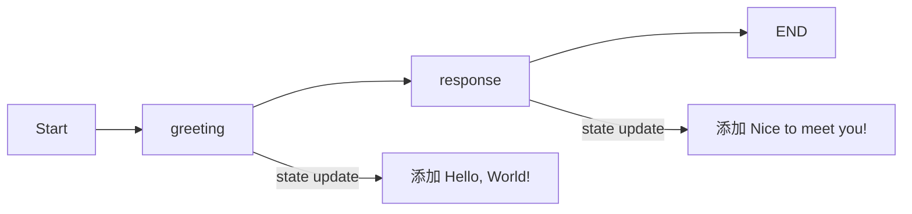
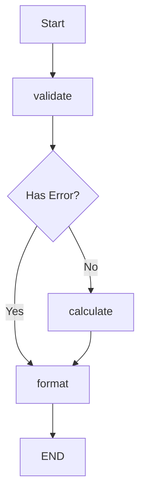

# 快速入门指南

## 一、什么是 LangGraph？

LangGraph 是一个用于构建有状态、多参与者应用程序的框架，特别适合创建复杂的 AI 工作流和智能体系统。

### 1.1 核心特点

- **🔄 状态管理**：内置状态管理，轻松处理复杂数据流
- **🎯 灵活路由**：支持条件路由和动态决策
- **⚡ 高性能**：异步支持和并行处理
- **🔧 易于调试**：可视化执行流程
- **📦 模块化**：组件可重用和组合

### 1.2 应用场景

```python
# LangGraph 适合构建：
applications = {
    "对话系统": "多轮对话、上下文管理",
    "工作流引擎": "复杂业务流程自动化",
    "智能体系统": "多智能体协作",
    "数据处理": "ETL管道、数据分析",
    "内容生成": "多步骤内容创作"
}
```

## 二、环境搭建

### 2.1 安装要求

```bash
# Python 版本要求
python --version  # 需要 Python 3.9+

# 创建虚拟环境
python -m venv langgraph-env
source langgraph-env/bin/activate  # Linux/Mac
# Windows: langgraph-env\Scripts\activate
```

### 2.2 安装 LangGraph

```bash
# 基础安装
pip install langgraph

# 完整安装（包含所有依赖）
pip install langgraph[all]

# 开发安装（包含测试工具）
pip install langgraph[dev]
```

### 2.3 验证安装

```python
# test_install.py
import langgraph
from langgraph.graph import StateGraph

print(f"LangGraph 版本: {langgraph.__version__}")
print("安装成功！")
```

## 三、第一个 LangGraph 应用

### 3.1 Hello World 示例

```python
from langgraph.graph import StateGraph, END
from typing import TypedDict, List

# 1. 定义状态
class ConversationState(TypedDict):
    messages: List[str]

# 2. 定义节点函数
def greet(state: ConversationState) -> ConversationState:
    state["messages"].append("Hello, World!")
    return state

def respond(state: ConversationState) -> ConversationState:
    state["messages"].append("Nice to meet you!")
    return state

# 3. 构建图
graph = StateGraph(ConversationState)

# 4. 添加节点
graph.add_node("greeting", greet)
graph.add_node("response", respond)

# 5. 添加边
graph.add_edge("greeting", "response")
graph.add_edge("response", END)

# 6. 设置入口点
graph.set_entry_point("greeting")

# 7. 编译并运行
app = graph.compile()
result = app.invoke({"messages": []})
print(result)
# 输出: {'messages': ['Hello, World!', 'Nice to meet you!']}
```

### 3.2 理解执行流程



## 四、核心概念快览

### 4.1 StateGraph（状态图）

```python
from langgraph.graph import StateGraph

# StateGraph 是核心类
graph = StateGraph(StateType)
```

### 4.2 State（状态）

```python
from typing import TypedDict, Annotated
import operator

# 简单状态
class SimpleState(TypedDict):
    count: int
    messages: List[str]

# 带 Reducer 的状态
class AdvancedState(TypedDict):
    # 使用 operator.add 自动合并列表
    messages: Annotated[List[str], operator.add]
    # 总是使用最新值
    current_user: Annotated[str, lambda x, y: y]
```

### 4.3 Node（节点）

```python
def process_node(state: StateType) -> StateType:
    """节点是执行具体逻辑的函数"""
    # 处理逻辑
    state["processed"] = True
    return state

# 添加节点到图
graph.add_node("process", process_node)
```

### 4.4 Edge（边）

```python
# 普通边
graph.add_edge("node1", "node2")

# 条件边
def routing_logic(state):
    if state["score"] > 0.5:
        return "success"
    return "failure"

graph.add_conditional_edges(
    "evaluate",
    routing_logic,
    {
        "success": "celebrate",
        "failure": "retry"
    }
)
```

## 五、实战：构建简单计算器

### 5.1 需求分析

构建一个支持加减乘除的简单计算器，展示状态管理和条件路由。

### 5.2 完整实现

```python
from langgraph.graph import StateGraph, END
from typing import TypedDict, Optional
import operator as op

# 定义状态
class CalculatorState(TypedDict):
    num1: float
    num2: float
    operation: str
    result: Optional[float]
    error: Optional[str]

# 节点函数
def validate_input(state: CalculatorState) -> CalculatorState:
    """验证输入"""
    if state["operation"] not in ["+", "-", "*", "/"]:
        state["error"] = f"不支持的操作: {state['operation']}"
    elif state["operation"] == "/" and state["num2"] == 0:
        state["error"] = "除数不能为零"
    return state

def calculate(state: CalculatorState) -> CalculatorState:
    """执行计算"""
    if state.get("error"):
        return state

    operations = {
        "+": op.add,
        "-": op.sub,
        "*": op.mul,
        "/": op.truediv
    }

    operation_func = operations[state["operation"]]
    state["result"] = operation_func(state["num1"], state["num2"])
    return state

def format_output(state: CalculatorState) -> CalculatorState:
    """格式化输出"""
    if state.get("error"):
        print(f"❌ 错误: {state['error']}")
    else:
        print(f"✅ 结果: {state['num1']} {state['operation']} {state['num2']} = {state['result']}")
    return state

# 路由函数
def route_after_validation(state: CalculatorState) -> str:
    if state.get("error"):
        return "format"
    return "calculate"

# 构建图
def create_calculator():
    graph = StateGraph(CalculatorState)

    # 添加节点
    graph.add_node("validate", validate_input)
    graph.add_node("calculate", calculate)
    graph.add_node("format", format_output)

    # 添加边
    graph.add_edge("validate", "router")
    graph.add_conditional_edges(
        "router",
        route_after_validation,
        {
            "calculate": "calculate",
            "format": "format"
        }
    )
    graph.add_edge("calculate", "format")
    graph.add_edge("format", END)

    # 设置入口点
    graph.set_entry_point("validate")

    return graph.compile()

# 使用计算器
calculator = create_calculator()

# 测试用例
test_cases = [
    {"num1": 10, "num2": 5, "operation": "+"},
    {"num1": 20, "num2": 4, "operation": "/"},
    {"num1": 7, "num2": 0, "operation": "/"},
    {"num1": 3, "num2": 4, "operation": "^"}
]

for test in test_cases:
    calculator.invoke(test)
```

### 5.3 执行流程图



## 六、进阶示例：对话机器人

### 6.1 带记忆的对话机器人

```python
from langgraph.graph import StateGraph, END
from typing import TypedDict, List, Annotated
import operator

class ChatState(TypedDict):
    messages: Annotated[List[str], operator.add]
    user_input: str
    bot_response: str
    turn_count: int

def get_user_input(state: ChatState) -> ChatState:
    """获取用户输入"""
    user_input = input("👤 用户: ")
    state["user_input"] = user_input
    state["messages"] = [f"用户: {user_input}"]
    state["turn_count"] = state.get("turn_count", 0) + 1
    return state

def generate_response(state: ChatState) -> ChatState:
    """生成机器人响应"""
    # 简单的规则响应
    user_msg = state["user_input"].lower()

    if "你好" in user_msg or "hello" in user_msg:
        response = "你好！很高兴见到你！"
    elif "再见" in user_msg or "bye" in user_msg:
        response = "再见！期待下次聊天！"
        state["should_end"] = True
    elif "名字" in user_msg:
        response = "我是 LangGraph 助手！"
    else:
        response = f"你说的是：{state['user_input']}"

    state["bot_response"] = response
    state["messages"] = [f"助手: {response}"]
    print(f"🤖 助手: {response}")
    return state

def should_continue(state: ChatState) -> str:
    """决定是否继续对话"""
    if state.get("should_end") or state["turn_count"] >= 5:
        return "end"
    return "continue"

# 创建聊天机器人
def create_chatbot():
    graph = StateGraph(ChatState)

    graph.add_node("user", get_user_input)
    graph.add_node("bot", generate_response)
    graph.add_node("end", lambda s: s)

    graph.add_edge("user", "bot")
    graph.add_conditional_edges(
        "bot",
        should_continue,
        {
            "continue": "user",
            "end": "end"
        }
    )
    graph.add_edge("end", END)

    graph.set_entry_point("user")

    return graph.compile()

# 运行聊天机器人
print("🤖 聊天机器人已启动（输入'再见'退出，最多5轮对话）")
chatbot = create_chatbot()
chatbot.invoke({"messages": [], "turn_count": 0})
```

## 七、调试技巧

### 7.1 启用调试模式

```python
# 编译时启用调试
app = graph.compile(debug=True)

# 设置日志级别
import logging
logging.basicConfig(level=logging.DEBUG)
```

### 7.2 状态检查

```python
from langgraph.checkpoint.memory import MemorySaver

# 使用检查点保存状态
memory = MemorySaver()
app = graph.compile(checkpointer=memory)

# 运行并检查状态
config = {"configurable": {"thread_id": "debug-session"}}
result = app.invoke(input_data, config=config)

# 获取状态历史
state_history = app.get_state_history(config)
for state in state_history:
    print(f"State: {state.values}")
```

### 7.3 可视化工具

```python
# 打印图结构
def visualize_graph(graph):
    """简单的图可视化"""
    compiled = graph.compile()
    print("节点:", compiled.nodes)
    print("边:", compiled.edges)

# 使用 graphviz 生成图形（需要安装 graphviz）
try:
    from IPython.display import Image
    img = app.get_graph().draw_png()
    Image(img)
except:
    print("图可视化需要安装 graphviz")
```

## 八、常见问题

### 8.1 状态更新问题

```python
# ❌ 错误：直接修改状态
def wrong_node(state):
    state["messages"].append("new message")  # 直接修改
    return state

# ✅ 正确：返回新的更新
def correct_node(state):
    return {"messages": state["messages"] + ["new message"]}
```

### 8.2 循环引用

```python
# 避免无限循环
def safe_router(state):
    if state.get("loop_count", 0) > 10:
        return "exit"
    return "continue"
```

### 8.3 异步处理

```python
# 异步节点示例
async def async_node(state):
    import asyncio
    await asyncio.sleep(1)
    state["processed"] = True
    return state

# 异步运行
import asyncio
result = asyncio.run(app.ainvoke(input_data))
```

## 九、下一步学习

### 9.1 推荐学习路径

1. **深入核心概念** → [02.核心概念解析](./02.核心概念解析.md)
2. **实践更多案例** → [03.基础案例实战](./03.基础案例实战.md)
3. **掌握状态管理** → [04.状态管理详解](./04.状态管理详解.md)

### 9.2 学习资源

- 📖 官方文档：深入了解所有功能
- 💻 GitHub 示例：参考实际项目
- 👥 社区论坛：交流学习经验
- 📺 视频教程：可视化学习

## 十、总结

通过本章学习，你已经：
- ✅ 了解了 LangGraph 的基本概念
- ✅ 搭建了开发环境
- ✅ 创建了第一个应用
- ✅ 实现了计算器和聊天机器人
- ✅ 学会了基本调试技巧

继续深入学习，你将掌握更强大的功能！

---

**准备好了吗？让我们继续深入 LangGraph 的世界！** 🚀