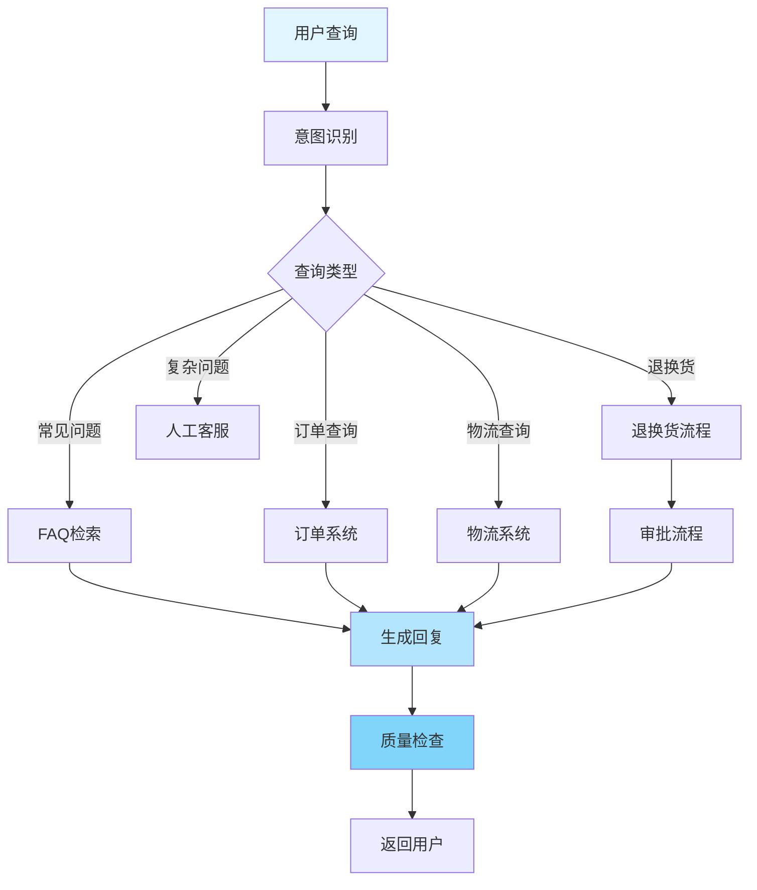

# LangGraph 企业级案例

## 案例一：智能客服系统

### 1.1 业务场景

某电商平台需要一个智能客服系统，能够：
- 24/7 自动回答常见问题
- 理解复杂的用户查询
- 查询订单、物流信息
- 处理退换货请求
- 必要时转人工客服

### 1.2 系统架构



### 1.3 核心实现

```python
from langgraph.graph import StateGraph, END
from typing import TypedDict, Literal, Annotated
import operator
from langchain_openai import ChatOpenAI
from langchain_community.vectorstores import FAISS
from langchain_openai import OpenAIEmbeddings

class CustomerServiceState(TypedDict):
    query: str
    intent: Literal["faq", "order", "logistics", "refund", "human"]
    context: dict
    conversation_history: Annotated[list, operator.add]
    response: str
    confidence: float
    requires_human: bool

class CustomerServiceSystem:
    """智能客服系统"""

    def __init__(self):
        self.llm = ChatOpenAI(model="gpt-4", temperature=0.7)
        self.embeddings = OpenAIEmbeddings()

        # 初始化 FAQ 向量库
        faqs = [
            "如何退货？答：登录账户，进入订单详情，点击申请退货",
            "配送需要多久？答：正常情况下3-5个工作日",
            "如何修改收货地址？答：在订单详情页面可以修改地址",
        ]
        self.faq_store = FAISS.from_texts(faqs, self.embeddings)

        # 创建图
        self.app = self._create_graph()

    def _create_graph(self):
        """创建客服工作流"""
        graph = StateGraph(CustomerServiceState)

        # 添加节点
        graph.add_node("intent_detection", self.detect_intent)
        graph.add_node("faq_handler", self.handle_faq)
        graph.add_node("order_handler", self.handle_order)
        graph.add_node("logistics_handler", self.handle_logistics)
        graph.add_node("refund_handler", self.handle_refund)
        graph.add_node("quality_check", self.quality_check)

        # 设置入口
        graph.set_entry_point("intent_detection")

        # 条件路由
        graph.add_conditional_edges(
            "intent_detection",
            self.route_intent,
            {
                "faq": "faq_handler",
                "order": "order_handler",
                "logistics": "logistics_handler",
                "refund": "refund_handler",
                "human": END
            }
        )

        # 所有处理器都到质量检查
        for handler in ["faq_handler", "order_handler", "logistics_handler", "refund_handler"]:
            graph.add_edge(handler, "quality_check")

        graph.add_edge("quality_check", END)

        return graph.compile()

    def detect_intent(self, state: CustomerServiceState) -> dict:
        """意图识别"""
        prompt = f"""
        分析用户查询的意图：

        查询: {state['query']}

        返回意图类型（faq/order/logistics/refund/human）和置信度（0-1）。

        格式: 意图|置信度
        """

        response = self.llm.invoke(prompt)
        parts = response.content.strip().split('|')

        intent = parts[0].strip().lower()
        confidence = float(parts[1].strip()) if len(parts) > 1 else 0.5

        return {
            "intent": intent,
            "confidence": confidence,
            "requires_human": confidence < 0.7
        }

    def route_intent(self, state: CustomerServiceState) -> str:
        """路由到对应处理器"""
        if state["requires_human"]:
            return "human"
        return state["intent"]

    def handle_faq(self, state: CustomerServiceState) -> dict:
        """处理常见问题"""
        # 检索相关FAQ
        docs = self.faq_store.similarity_search(state["query"], k=3)

        context = "\n".join([doc.page_content for doc in docs])

        prompt = f"""
        基于以下FAQ回答用户问题：

        FAQ:
        {context}

        用户问题: {state['query']}

        请给出友好、准确的回答。
        """

        response = self.llm.invoke(prompt)

        return {
            "response": response.content,
            "context": {"source": "faq", "docs": len(docs)},
            "conversation_history": [{
                "role": "assistant",
                "content": response.content
            }]
        }

    def handle_order(self, state: CustomerServiceState) -> dict:
        """处理订单查询"""
        # 模拟订单查询
        order_info = self._query_order(state["query"])

        prompt = f"""
        用户查询: {state['query']}

        订单信息:
        {order_info}

        请用友好的语言告知用户订单状态。
        """

        response = self.llm.invoke(prompt)

        return {
            "response": response.content,
            "context": {"source": "order", "order": order_info},
            "conversation_history": [{
                "role": "assistant",
                "content": response.content
            }]
        }

    def handle_logistics(self, state: CustomerServiceState) -> dict:
        """处理物流查询"""
        logistics_info = self._query_logistics(state["query"])

        response = f"""
        您的包裹当前状态：{logistics_info['status']}
        预计送达时间：{logistics_info['eta']}
        物流轨迹：{logistics_info['tracking']}
        """

        return {
            "response": response,
            "context": {"source": "logistics"},
            "conversation_history": [{
                "role": "assistant",
                "content": response
            }]
        }

    def handle_refund(self, state: CustomerServiceState) -> dict:
        """处理退换货"""
        prompt = f"""
        用户退换货请求: {state['query']}

        引导用户完成退换货流程，说明所需材料和步骤。
        """

        response = self.llm.invoke(prompt)

        return {
            "response": response.content,
            "context": {"source": "refund"},
            "conversation_history": [{
                "role": "assistant",
                "content": response.content
            }]
        }

    def quality_check(self, state: CustomerServiceState) -> dict:
        """质量检查"""
        prompt = f"""
        检查以下客服回复的质量：

        用户问题: {state['query']}
        回复: {state['response']}

        评估：
        1. 是否回答了问题
        2. 是否专业友好
        3. 是否需要人工介入

        如果需要人工，设置 requires_human=True
        """

        response = self.llm.invoke(prompt)
        requires_human = "人工" in response.content

        return {"requires_human": requires_human}

    def _query_order(self, query: str) -> dict:
        """查询订单（模拟）"""
        return {
            "order_id": "20250110001",
            "status": "已发货",
            "items": ["商品A", "商品B"],
            "total": 299.00
        }

    def _query_logistics(self, query: str) -> dict:
        """查询物流（模拟）"""
        return {
            "status": "运输中",
            "eta": "2025-01-12",
            "tracking": "包裹已到达北京分拨中心"
        }

    def process(self, query: str) -> str:
        """处理用户查询"""
        result = self.app.invoke({
            "query": query,
            "intent": "",
            "context": {},
            "conversation_history": [],
            "response": "",
            "confidence": 0.0,
            "requires_human": False
        })

        if result["requires_human"]:
            return "我将为您转接人工客服，请稍候..."

        return result["response"]

# 使用示例
def test_customer_service():
    """测试客服系统"""
    cs = CustomerServiceSystem()

    queries = [
        "我想退货，怎么操作？",
        "我的订单20250110001在哪里？",
        "快递什么时候能到？"
    ]

    for query in queries:
        print(f"\n用户: {query}")
        response = cs.process(query)
        print(f"客服: {response}")
```

### 1.4 关键特性

- ✅ 多意图识别和路由
- ✅ 向量检索FAQ
- ✅ 外部系统集成（订单、物流）
- ✅ 质量检查和人工兜底
- ✅ 对话历史管理

## 案例二：文档智能处理平台

### 2.1 业务场景

企业需要处理大量文档：
- 自动分类文档
- 提取关键信息
- 生成摘要
- 多语言翻译
- 合规性检查

### 2.2 系统实现

```python
from typing import TypedDict, Annotated, Literal
import operator
from langgraph.graph import StateGraph, END
from langchain_community.document_loaders import PyPDFLoader
from langchain.text_splitter import RecursiveCharacterTextSplitter
from langchain_openai import ChatOpenAI

class DocumentState(TypedDict):
    file_path: str
    document_type: Literal["contract", "report", "invoice", "other"]
    content: str
    chunks: list[str]
    extracted_info: dict
    summary: str
    translation: str
    compliance_check: dict
    processed: bool

class DocumentProcessor:
    """文档智能处理系统"""

    def __init__(self):
        self.llm = ChatOpenAI(model="gpt-4")
        self.text_splitter = RecursiveCharacterTextSplitter(
            chunk_size=1000,
            chunk_overlap=200
        )
        self.app = self._create_pipeline()

    def _create_pipeline(self):
        """创建处理流水线"""
        graph = StateGraph(DocumentState)

        # 添加处理节点
        graph.add_node("load", self.load_document)
        graph.add_node("classify", self.classify_document)
        graph.add_node("extract", self.extract_information)
        graph.add_node("summarize", self.generate_summary)
        graph.add_node("translate", self.translate_document)
        graph.add_node("compliance", self.check_compliance)

        # 定义流程
        graph.set_entry_point("load")
        graph.add_edge("load", "classify")
        graph.add_edge("classify", "extract")

        # 并行处理摘要和翻译
        graph.add_edge("extract", "summarize")
        graph.add_edge("extract", "translate")

        graph.add_edge("summarize", "compliance")
        graph.add_edge("translate", "compliance")
        graph.add_edge("compliance", END)

        return graph.compile()

    def load_document(self, state: DocumentState) -> dict:
        """加载文档"""
        # 加载 PDF
        loader = PyPDFLoader(state["file_path"])
        pages = loader.load()

        # 合并内容
        content = "\n\n".join([page.page_content for page in pages])

        # 分块
        chunks = self.text_splitter.split_text(content)

        return {
            "content": content[:10000],  # 限制长度
            "chunks": chunks[:10]  # 限制块数
        }

    def classify_document(self, state: DocumentState) -> dict:
        """文档分类"""
        prompt = f"""
        分析以下文档内容，判断文档类型：

        {state['content'][:500]}

        返回类型：contract（合同）、report（报告）、invoice（发票）、other（其他）
        """

        response = self.llm.invoke(prompt)
        doc_type = response.content.strip().lower()

        return {"document_type": doc_type}

    def extract_information(self, state: DocumentState) -> dict:
        """提取关键信息"""
        prompt = f"""
        从以下{state['document_type']}文档中提取关键信息：

        {state['content']}

        返回 JSON 格式的结构化信息。
        """

        response = self.llm.invoke(prompt)

        # 解析提取的信息
        try:
            import json
            extracted = json.loads(response.content)
        except:
            extracted = {"raw": response.content}

        return {"extracted_info": extracted}

    def generate_summary(self, state: DocumentState) -> dict:
        """生成摘要"""
        prompt = f"""
        为以下文档生成简洁的摘要（200字以内）：

        {state['content']}
        """

        response = self.llm.invoke(prompt)

        return {"summary": response.content}

    def translate_document(self, state: DocumentState) -> dict:
        """翻译文档"""
        prompt = f"""
        将以下文档内容翻译成英文：

        {state['content'][:1000]}

        只返回翻译结果。
        """

        response = self.llm.invoke(prompt)

        return {"translation": response.content}

    def check_compliance(self, state: DocumentState) -> dict:
        """合规性检查"""
        prompt = f"""
        检查以下{state['document_type']}文档的合规性：

        提取的信息: {state['extracted_info']}

        检查：
        1. 必填字段是否完整
        2. 格式是否规范
        3. 是否有风险条款

        返回检查结果。
        """

        response = self.llm.invoke(prompt)

        compliance_check = {
            "passed": "通过" in response.content,
            "issues": response.content,
            "risk_level": "low"
        }

        return {
            "compliance_check": compliance_check,
            "processed": True
        }

    def process_document(self, file_path: str) -> dict:
        """处理文档"""
        result = self.app.invoke({
            "file_path": file_path,
            "document_type": "other",
            "content": "",
            "chunks": [],
            "extracted_info": {},
            "summary": "",
            "translation": "",
            "compliance_check": {},
            "processed": False
        })

        return {
            "type": result["document_type"],
            "info": result["extracted_info"],
            "summary": result["summary"],
            "compliance": result["compliance_check"]
        }

# 使用示例
def test_document_processor():
    """测试文档处理"""
    processor = DocumentProcessor()

    result = processor.process_document("contract.pdf")

    print(f"文档类型: {result['type']}")
    print(f"提取信息: {result['info']}")
    print(f"摘要: {result['summary']}")
    print(f"合规检查: {result['compliance']}")
```

## 案例三：代码审查助手

### 3.1 业务场景

开发团队需要自动化代码审查：
- 代码风格检查
- 安全漏洞扫描
- 性能问题分析
- 最佳实践建议
- 自动生成审查报告

### 3.2 实现方案

```python
from typing import TypedDict, Annotated
import operator
from langgraph.graph import StateGraph, END

class CodeReviewState(TypedDict):
    code: str
    language: str
    style_issues: Annotated[list, operator.add]
    security_issues: Annotated[list, operator.add]
    performance_issues: Annotated[list, operator.add]
    suggestions: Annotated[list, operator.add]
    report: str
    approved: bool

class CodeReviewAssistant:
    """代码审查助手"""

    def __init__(self):
        self.llm = ChatOpenAI(model="gpt-4", temperature=0)
        self.app = self._create_workflow()

    def _create_workflow(self):
        """创建审查工作流"""
        graph = StateGraph(CodeReviewState)

        # 并行检查
        graph.add_node("style_check", self.check_style)
        graph.add_node("security_check", self.check_security)
        graph.add_node("performance_check", self.check_performance)

        # 汇总和报告
        graph.add_node("generate_suggestions", self.generate_suggestions)
        graph.add_node("generate_report", self.generate_report)

        # 并行执行检查
        graph.set_entry_point("style_check")
        graph.set_entry_point("security_check")
        graph.set_entry_point("performance_check")

        # 所有检查完成后生成建议
        graph.add_edge("style_check", "generate_suggestions")
        graph.add_edge("security_check", "generate_suggestions")
        graph.add_edge("performance_check", "generate_suggestions")

        graph.add_edge("generate_suggestions", "generate_report")
        graph.add_edge("generate_report", END)

        return graph.compile()

    def check_style(self, state: CodeReviewState) -> dict:
        """代码风格检查"""
        prompt = f"""
        检查以下{state['language']}代码的风格问题：

        ```{state['language']}
        {state['code']}
        ```

        列出所有风格问题（命名、格式、注释等）。
        """

        response = self.llm.invoke(prompt)
        issues = response.content.split('\n')

        return {"style_issues": [i.strip() for i in issues if i.strip()]}

    def check_security(self, state: CodeReviewState) -> dict:
        """安全检查"""
        prompt = f"""
        分析以下代码的安全问题：

        ```{state['language']}
        {state['code']}
        ```

        识别：
        - SQL注入风险
        - XSS漏洞
        - 敏感数据泄露
        - 权限控制问题
        """

        response = self.llm.invoke(prompt)
        issues = response.content.split('\n')

        return {"security_issues": [i.strip() for i in issues if i.strip()]}

    def check_performance(self, state: CodeReviewState) -> dict:
        """性能检查"""
        prompt = f"""
        分析以下代码的性能问题：

        ```{state['language']}
        {state['code']}
        ```

        关注：
        - 时间复杂度
        - 空间复杂度
        - 不必要的循环
        - 资源泄漏
        """

        response = self.llm.invoke(prompt)
        issues = response.content.split('\n')

        return {"performance_issues": [i.strip() for i in issues if i.strip()]}

    def generate_suggestions(self, state: CodeReviewState) -> dict:
        """生成改进建议"""
        all_issues = (
            state["style_issues"] +
            state["security_issues"] +
            state["performance_issues"]
        )

        prompt = f"""
        基于以下问题列表，生成具体的改进建议：

        {chr(10).join(all_issues)}

        提供优先级排序的改进建议。
        """

        response = self.llm.invoke(prompt)
        suggestions = response.content.split('\n')

        return {"suggestions": [s.strip() for s in suggestions if s.strip()]}

    def generate_report(self, state: CodeReviewState) -> dict:
        """生成审查报告"""
        report = f"""
# 代码审查报告

## 概况
- 语言: {state['language']}
- 风格问题: {len(state['style_issues'])}
- 安全问题: {len(state['security_issues'])}
- 性能问题: {len(state['performance_issues'])}

## 风格问题
{chr(10).join(['- ' + i for i in state['style_issues']])}

## 安全问题
{chr(10).join(['- ' + i for i in state['security_issues']])}

## 性能问题
{chr(10).join(['- ' + i for i in state['performance_issues']])}

## 改进建议
{chr(10).join(['- ' + s for s in state['suggestions']])}

## 审查结论
{'✅ 通过' if len(state['security_issues']) == 0 else '❌ 需要修改'}
        """

        approved = len(state["security_issues"]) == 0

        return {
            "report": report,
            "approved": approved
        }

    def review(self, code: str, language: str = "python") -> str:
        """执行代码审查"""
        result = self.app.invoke({
            "code": code,
            "language": language,
            "style_issues": [],
            "security_issues": [],
            "performance_issues": [],
            "suggestions": [],
            "report": "",
            "approved": False
        })

        return result["report"]

# 测试
def test_code_review():
    """测试代码审查"""
    reviewer = CodeReviewAssistant()

    code = """
def get_user(user_id):
    query = "SELECT * FROM users WHERE id = " + user_id
    result = db.execute(query)
    return result
    """

    report = reviewer.review(code, "python")
    print(report)
```

## 案例四：数据分析助手

### 4.1 业务需求

- 自动化数据清洗
- 智能数据分析
- 生成可视化
- 自动编写报告

```python
# 详细实现见完整文档...
```

## 总结

### 企业级应用关键点

| 方面 | 要点 |
|------|------|
| 可靠性 | 错误处理、重试机制、降级策略 |
| 性能 | 并行处理、缓存、批处理 |
| 安全 | 认证授权、数据加密、审计日志 |
| 可维护性 | 模块化、文档完善、监控告警 |
| 可扩展性 | 插件化、配置化、微服务化 |

---

**下一步:** 查看 [15.API参考手册](./15.API参考手册.md) 完整API文档！
