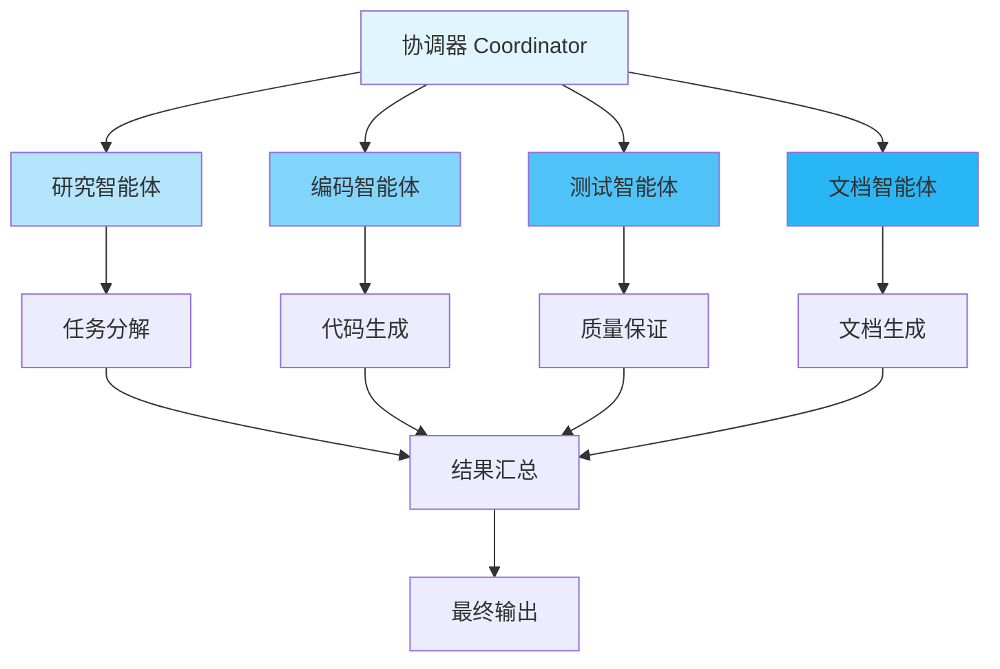

# LangGraph 多智能体系统

## 一、多智能体架构



## 二、基础多智能体模式

### 2.1 主从模式

```python
from typing import TypedDict, Annotated, Literal
import operator
from langgraph.graph import StateGraph, END
from langchain_openai import ChatOpenAI

class MasterWorkerState(TypedDict):
    task: str
    subtasks: list[str]
    results: Annotated[list[str], operator.add]
    final_result: str

def create_master_worker_system():
    """主从模式多智能体系统"""
    llm = ChatOpenAI(model="gpt-4", temperature=0)

    def master_agent(state: MasterWorkerState) -> dict:
        """主智能体 - 任务分解"""
        prompt = f"""
        将以下任务分解为3-5个子任务:
        任务: {state['task']}

        返回子任务列表（每行一个）:
        """

        response = llm.invoke(prompt)
        subtasks = [
            line.strip()
            for line in response.content.split('\n')
            if line.strip()
        ]

        return {"subtasks": subtasks[:5]}

    def worker_agent(state: MasterWorkerState) -> dict:
        """工作智能体 - 执行子任务"""
        results = []

        for subtask in state["subtasks"]:
            prompt = f"执行任务: {subtask}\n提供简洁的结果。"
            response = llm.invoke(prompt)
            results.append(f"{subtask}: {response.content}")

        return {"results": results}

    def aggregator_agent(state: MasterWorkerState) -> dict:
        """聚合器 - 汇总结果"""
        prompt = f"""
        原始任务: {state['task']}

        子任务结果:
        {chr(10).join(state['results'])}

        请综合以上结果，给出完整答案。
        """

        response = llm.invoke(prompt)
        return {"final_result": response.content}

    graph = StateGraph(MasterWorkerState)

    graph.add_node("master", master_agent)
    graph.add_node("worker", worker_agent)
    graph.add_node("aggregator", aggregator_agent)

    graph.set_entry_point("master")
    graph.add_edge("master", "worker")
    graph.add_edge("worker", "aggregator")
    graph.add_edge("aggregator", END)

    return graph.compile()

# 测试
def test_master_worker():
    """测试主从模式"""
    app = create_master_worker_system()

    result = app.invoke({
        "task": "研究并总结 LangGraph 的核心特性",
        "subtasks": [],
        "results": [],
        "final_result": ""
    })

    print(f"最终结果:\n{result['final_result']}")
```

### 2.2 协作模式

```python
from typing import TypedDict, List

class CollaborativeState(TypedDict):
    topic: str
    research_notes: str
    draft_content: str
    reviewed_content: str
    final_content: str

def create_collaborative_system():
    """协作模式多智能体系统"""
    llm = ChatOpenAI(model="gpt-4")

    def researcher_agent(state: CollaborativeState) -> dict:
        """研究员智能体"""
        prompt = f"研究主题 '{state['topic']}' 并提供关键要点。"
        response = llm.invoke(prompt)
        return {"research_notes": response.content}

    def writer_agent(state: CollaborativeState) -> dict:
        """写作智能体"""
        prompt = f"""
        基于以下研究笔记写一篇文章:

        {state['research_notes']}

        主题: {state['topic']}
        """

        response = llm.invoke(prompt)
        return {"draft_content": response.content}

    def reviewer_agent(state: CollaborativeState) -> dict:
        """审阅智能体"""
        prompt = f"""
        审阅并改进以下文章:

        {state['draft_content']}

        提供改进后的版本。
        """

        response = llm.invoke(prompt)
        return {"reviewed_content": response.content}

    def editor_agent(state: CollaborativeState) -> dict:
        """编辑智能体"""
        prompt = f"""
        对以下文章进行最终编辑和润色:

        {state['reviewed_content']}

        确保语言流畅、格式规范。
        """

        response = llm.invoke(prompt)
        return {"final_content": response.content}

    graph = StateGraph(CollaborativeState)

    graph.add_node("researcher", researcher_agent)
    graph.add_node("writer", writer_agent)
    graph.add_node("reviewer", reviewer_agent)
    graph.add_node("editor", editor_agent)

    graph.set_entry_point("researcher")
    graph.add_edge("researcher", "writer")
    graph.add_edge("writer", "reviewer")
    graph.add_edge("reviewer", "editor")
    graph.add_edge("editor", END)

    return graph.compile()
```

### 2.3 竞争模式

```python
class CompetitiveState(TypedDict):
    problem: str
    solution_a: str
    solution_b: str
    solution_c: str
    best_solution: str
    winner: str

def create_competitive_system():
    """竞争模式 - 多个智能体提出方案，选出最佳"""
    llm_gpt = ChatOpenAI(model="gpt-4")
    llm_claude = ChatOpenAI(model="gpt-3.5-turbo")  # 模拟不同模型

    def agent_a(state: CompetitiveState) -> dict:
        """方案 A"""
        response = llm_gpt.invoke(f"解决问题: {state['problem']}")
        return {"solution_a": response.content}

    def agent_b(state: CompetitiveState) -> dict:
        """方案 B"""
        response = llm_gpt.invoke(f"用创新方法解决: {state['problem']}")
        return {"solution_b": response.content}

    def agent_c(state: CompetitiveState) -> dict:
        """方案 C"""
        response = llm_claude.invoke(f"高效解决: {state['problem']}")
        return {"solution_c": response.content}

    def judge_agent(state: CompetitiveState) -> dict:
        """评判智能体 - 选出最佳方案"""
        prompt = f"""
        问题: {state['problem']}

        方案 A: {state['solution_a']}
        方案 B: {state['solution_b']}
        方案 C: {state['solution_c']}

        评估并选出最佳方案（A、B 或 C），说明理由。
        """

        response = llm_gpt.invoke(prompt)
        content = response.content

        # 解析获胜方案
        winner = "A"
        if "方案 B" in content or "B 方案" in content:
            winner = "B"
        elif "方案 C" in content or "C 方案" in content:
            winner = "C"

        best_solution = state[f"solution_{winner.lower()}"]

        return {
            "best_solution": best_solution,
            "winner": f"Agent {winner}"
        }

    graph = StateGraph(CompetitiveState)

    graph.add_node("agent_a", agent_a)
    graph.add_node("agent_b", agent_b)
    graph.add_node("agent_c", agent_c)
    graph.add_node("judge", judge_agent)

    # 三个智能体并行执行
    graph.set_entry_point("agent_a")
    graph.set_entry_point("agent_b")
    graph.set_entry_point("agent_c")

    graph.add_edge("agent_a", "judge")
    graph.add_edge("agent_b", "judge")
    graph.add_edge("agent_c", "judge")
    graph.add_edge("judge", END)

    return graph.compile()
```

## 三、智能体通信

### 3.1 消息传递

```python
from typing import TypedDict, Annotated
import operator

class Message(TypedDict):
    sender: str
    receiver: str
    content: str

class CommunicationState(TypedDict):
    messages: Annotated[list[Message], operator.add]
    final_decision: str

def create_communication_system():
    """基于消息传递的多智能体系统"""
    llm = ChatOpenAI(model="gpt-4")

    def agent_planner(state: CommunicationState) -> dict:
        """规划智能体"""
        # 读取发给自己的消息
        my_messages = [
            msg for msg in state["messages"]
            if msg.get("receiver") == "planner"
        ]

        context = "\n".join([msg["content"] for msg in my_messages])

        prompt = f"""
        {context}

        作为规划者，制定高层计划并发送给执行者。
        """

        response = llm.invoke(prompt)

        # 发送消息给执行者
        message: Message = {
            "sender": "planner",
            "receiver": "executor",
            "content": response.content
        }

        return {"messages": [message]}

    def agent_executor(state: CommunicationState) -> dict:
        """执行智能体"""
        my_messages = [
            msg for msg in state["messages"]
            if msg.get("receiver") == "executor"
        ]

        if not my_messages:
            return {}

        latest_message = my_messages[-1]

        prompt = f"""
        收到计划: {latest_message['content']}

        执行计划并报告结果给评估者。
        """

        response = llm.invoke(prompt)

        message: Message = {
            "sender": "executor",
            "receiver": "evaluator",
            "content": response.content
        }

        return {"messages": [message]}

    def agent_evaluator(state: CommunicationState) -> dict:
        """评估智能体"""
        my_messages = [
            msg for msg in state["messages"]
            if msg.get("receiver") == "evaluator"
        ]

        if not my_messages:
            return {}

        latest_message = my_messages[-1]

        prompt = f"""
        执行结果: {latest_message['content']}

        评估结果并做出最终决策。
        """

        response = llm.invoke(prompt)

        return {"final_decision": response.content}

    graph = StateGraph(CommunicationState)

    graph.add_node("planner", agent_planner)
    graph.add_node("executor", agent_executor)
    graph.add_node("evaluator", agent_evaluator)

    graph.set_entry_point("planner")
    graph.add_edge("planner", "executor")
    graph.add_edge("executor", "evaluator")
    graph.add_edge("evaluator", END)

    return graph.compile()

# 测试
def test_communication():
    """测试消息传递"""
    app = create_communication_system()

    result = app.invoke({
        "messages": [{
            "sender": "user",
            "receiver": "planner",
            "content": "需要开发一个用户登录功能"
        }],
        "final_decision": ""
    })

    print("=== 消息历史 ===")
    for msg in result["messages"]:
        print(f"{msg['sender']} -> {msg['receiver']}: {msg['content'][:50]}...")

    print(f"\n=== 最终决策 ===\n{result['final_decision']}")
```

### 3.2 共享记忆

```python
class SharedMemoryState(TypedDict):
    shared_memory: dict
    agent_a_output: str
    agent_b_output: str
    final_output: str

def create_shared_memory_system():
    """共享记忆的多智能体系统"""
    llm = ChatOpenAI(model="gpt-4")

    def agent_a(state: SharedMemoryState) -> dict:
        """智能体 A - 写入共享记忆"""
        response = llm.invoke("生成一些有趣的事实")

        # 写入共享记忆
        shared = state.get("shared_memory", {})
        shared["facts"] = response.content

        return {
            "shared_memory": shared,
            "agent_a_output": "已生成事实"
        }

    def agent_b(state: SharedMemoryState) -> dict:
        """智能体 B - 读取并使用共享记忆"""
        # 读取共享记忆
        facts = state.get("shared_memory", {}).get("facts", "")

        prompt = f"""
        基于以下事实创作一个故事:
        {facts}
        """

        response = llm.invoke(prompt)

        # 更新共享记忆
        shared = state.get("shared_memory", {})
        shared["story"] = response.content

        return {
            "shared_memory": shared,
            "agent_b_output": "已创作故事"
        }

    def summarizer(state: SharedMemoryState) -> dict:
        """总结智能体"""
        memory = state.get("shared_memory", {})

        summary = f"""
        事实: {memory.get('facts', 'N/A')}

        故事: {memory.get('story', 'N/A')}
        """

        return {"final_output": summary}

    graph = StateGraph(SharedMemoryState)

    graph.add_node("agent_a", agent_a)
    graph.add_node("agent_b", agent_b)
    graph.add_node("summarizer", summarizer)

    graph.set_entry_point("agent_a")
    graph.add_edge("agent_a", "agent_b")
    graph.add_edge("agent_b", "summarizer")
    graph.add_edge("summarizer", END)

    return graph.compile()
```

## 四、智能体协调

### 4.1 层次化协调

```python
class HierarchicalState(TypedDict):
    task: str
    high_level_plan: str
    subtasks: list[str]
    subtask_results: Annotated[list[str], operator.add]
    final_result: str

def create_hierarchical_system():
    """层次化多智能体系统"""
    llm = ChatOpenAI(model="gpt-4")

    # 顶层管理者
    def top_manager(state: HierarchicalState) -> dict:
        """顶层管理者 - 制定高层计划"""
        prompt = f"为任务 '{state['task']}' 制定高层计划。"
        response = llm.invoke(prompt)
        return {"high_level_plan": response.content}

    # 中层管理者
    def middle_manager(state: HierarchicalState) -> dict:
        """中层管理者 - 分解为子任务"""
        prompt = f"""
        高层计划: {state['high_level_plan']}

        将其分解为具体的可执行子任务（3-5个）。
        """

        response = llm.invoke(prompt)
        subtasks = [
            line.strip()
            for line in response.content.split('\n')
            if line.strip() and not line.startswith('#')
        ][:5]

        return {"subtasks": subtasks}

    # 执行层
    def worker_pool(state: HierarchicalState) -> dict:
        """工作者池 - 执行子任务"""
        results = []

        for subtask in state["subtasks"]:
            result = llm.invoke(f"执行: {subtask}")
            results.append(result.content)

        return {"subtask_results": results}

    # 结果汇总
    def result_aggregator(state: HierarchicalState) -> dict:
        """汇总结果"""
        prompt = f"""
        原始任务: {state['task']}
        高层计划: {state['high_level_plan']}

        执行结果:
        {chr(10).join(state['subtask_results'])}

        请综合汇总最终结果。
        """

        response = llm.invoke(prompt)
        return {"final_result": response.content}

    graph = StateGraph(HierarchicalState)

    graph.add_node("top", top_manager)
    graph.add_node("middle", middle_manager)
    graph.add_node("workers", worker_pool)
    graph.add_node("aggregator", result_aggregator)

    graph.set_entry_point("top")
    graph.add_edge("top", "middle")
    graph.add_edge("middle", "workers")
    graph.add_edge("workers", "aggregator")
    graph.add_edge("aggregator", END)

    return graph.compile()
```

### 4.2 动态协调

```python
class DynamicCoordinationState(TypedDict):
    task_type: Literal["research", "creative", "technical"]
    task_description: str
    assigned_agents: list[str]
    results: dict
    final_output: str

def create_dynamic_coordination_system():
    """动态协调系统 - 根据任务类型动态分配智能体"""
    llm = ChatOpenAI(model="gpt-4")

    # 定义专门化的智能体
    def research_agent(state: dict) -> str:
        """研究专家"""
        response = llm.invoke(f"研究: {state['task_description']}")
        return response.content

    def creative_agent(state: dict) -> str:
        """创意专家"""
        response = llm.invoke(f"创意处理: {state['task_description']}")
        return response.content

    def technical_agent(state: dict) -> str:
        """技术专家"""
        response = llm.invoke(f"技术实现: {state['task_description']}")
        return response.content

    # 智能体注册表
    agent_registry = {
        "research": research_agent,
        "creative": creative_agent,
        "technical": technical_agent
    }

    def coordinator(state: DynamicCoordinationState) -> dict:
        """协调器 - 选择并调度智能体"""
        task_type = state["task_type"]

        # 根据任务类型选择智能体
        if task_type == "research":
            agents = ["research", "technical"]
        elif task_type == "creative":
            agents = ["creative", "research"]
        else:
            agents = ["technical", "research"]

        return {"assigned_agents": agents}

    def execute_agents(state: DynamicCoordinationState) -> dict:
        """执行选定的智能体"""
        results = {}

        for agent_name in state["assigned_agents"]:
            agent_func = agent_registry.get(agent_name)
            if agent_func:
                result = agent_func(state)
                results[agent_name] = result

        return {"results": results}

    def synthesize(state: DynamicCoordinationState) -> dict:
        """综合结果"""
        results_text = "\n\n".join([
            f"{name}: {result}"
            for name, result in state["results"].items()
        ])

        prompt = f"""
        任务: {state['task_description']}

        智能体结果:
        {results_text}

        综合以上结果给出最终答案。
        """

        response = llm.invoke(prompt)
        return {"final_output": response.content}

    graph = StateGraph(DynamicCoordinationState)

    graph.add_node("coordinator", coordinator)
    graph.add_node("execute", execute_agents)
    graph.add_node("synthesize", synthesize)

    graph.set_entry_point("coordinator")
    graph.add_edge("coordinator", "execute")
    graph.add_edge("execute", "synthesize")
    graph.add_edge("synthesize", END)

    return graph.compile()
```

## 五、实战案例：软件开发团队

### 完整的多智能体开发系统

```python
class DevTeamState(TypedDict):
    requirement: str
    design_doc: str
    code: str
    test_results: str
    documentation: str
    review_feedback: str
    approved: bool
    final_deliverable: dict

def create_dev_team_system():
    """模拟软件开发团队的多智能体系统"""
    llm = ChatOpenAI(model="gpt-4")

    def product_manager(state: DevTeamState) -> dict:
        """产品经理 - 细化需求"""
        prompt = f"""
        原始需求: {state['requirement']}

        作为产品经理，细化需求并输出详细的需求文档。
        """
        response = llm.invoke(prompt)
        return {"design_doc": response.content}

    def architect(state: DevTeamState) -> dict:
        """架构师 - 设计系统"""
        prompt = f"""
        需求文档: {state['design_doc']}

        作为架构师，设计系统架构和技术方案。
        """
        response = llm.invoke(prompt)
        return {"design_doc": state["design_doc"] + "\n\n" + response.content}

    def developer(state: DevTeamState) -> dict:
        """开发工程师 - 编写代码"""
        prompt = f"""
        设计文档: {state['design_doc']}

        作为开发工程师，实现核心代码（伪代码即可）。
        """
        response = llm.invoke(prompt)
        return {"code": response.content}

    def tester(state: DevTeamState) -> dict:
        """测试工程师 - 测试代码"""
        prompt = f"""
        代码: {state['code']}

        作为测试工程师，编写测试用例并报告测试结果。
        """
        response = llm.invoke(prompt)
        return {"test_results": response.content}

    def technical_writer(state: DevTeamState) -> dict:
        """技术文档工程师"""
        prompt = f"""
        代码: {state['code']}
        测试结果: {state['test_results']}

        编写用户文档和API文档。
        """
        response = llm.invoke(prompt)
        return {"documentation": response.content}

    def code_reviewer(state: DevTeamState) -> dict:
        """代码审查员"""
        prompt = f"""
        审查以下交付物:
        - 设计: {state['design_doc'][:200]}...
        - 代码: {state['code'][:200]}...
        - 测试: {state['test_results'][:200]}...
        - 文档: {state['documentation'][:200]}...

        给出审查意见和是否批准。
        """
        response = llm.invoke(prompt)

        approved = "批准" in response.content or "通过" in response.content

        return {
            "review_feedback": response.content,
            "approved": approved
        }

    def packager(state: DevTeamState) -> dict:
        """打包发布"""
        deliverable = {
            "design": state["design_doc"],
            "code": state["code"],
            "tests": state["test_results"],
            "docs": state["documentation"],
            "review": state["review_feedback"],
            "status": "Approved" if state["approved"] else "Rejected"
        }

        return {"final_deliverable": deliverable}

    def route_review(state: DevTeamState) -> str:
        """根据审查结果路由"""
        return "package" if state["approved"] else END

    graph = StateGraph(DevTeamState)

    # 添加所有角色
    graph.add_node("pm", product_manager)
    graph.add_node("architect", architect)
    graph.add_node("developer", developer)
    graph.add_node("tester", tester)
    graph.add_node("writer", technical_writer)
    graph.add_node("reviewer", code_reviewer)
    graph.add_node("package", packager)

    # 定义工作流
    graph.set_entry_point("pm")
    graph.add_edge("pm", "architect")
    graph.add_edge("architect", "developer")
    graph.add_edge("developer", "tester")
    graph.add_edge("tester", "writer")
    graph.add_edge("writer", "reviewer")

    graph.add_conditional_edges(
        "reviewer",
        route_review,
        {"package": "package", END: END}
    )

    graph.add_edge("package", END)

    return graph.compile()

# 测试完整系统
def test_dev_team():
    """测试开发团队系统"""
    app = create_dev_team_system()

    result = app.invoke({
        "requirement": "开发一个用户登录功能",
        "design_doc": "",
        "code": "",
        "test_results": "",
        "documentation": "",
        "review_feedback": "",
        "approved": False,
        "final_deliverable": {}
    })

    print("=== 开发团队协作结果 ===")
    print(f"状态: {result['final_deliverable'].get('status', 'N/A')}")
    print(f"\n设计文档: {result['design_doc'][:100]}...")
    print(f"\n代码: {result['code'][:100]}...")
    print(f"\n审查反馈: {result['review_feedback'][:100]}...")
```

## 六、最佳实践

### 6.1 设计原则

- ✅ 单一职责：每个智能体专注一个任务
- ✅ 明确接口：定义清晰的输入输出
- ✅ 松耦合：智能体间低依赖
- ✅ 可扩展：易于添加新智能体
- ✅ 容错性：处理智能体失败

### 6.2 常见模式对比

| 模式 | 优点 | 缺点 | 适用场景 |
|------|------|------|---------|
| 主从 | 简单高效 | 单点故障 | 任务可拆分 |
| 协作 | 质量高 | 耗时长 | 需要多角度 |
| 竞争 | 最优解 | 成本高 | 关键决策 |
| 层次 | 可扩展 | 复杂度高 | 大型系统 |

---

**下一步:** 学习 [13.生产部署实践](./13.生产部署实践.md) 部署到生产环境！
