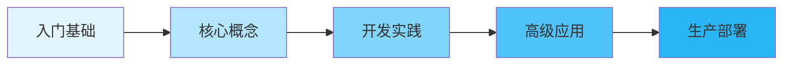

# LangGraph 学习指南 - 目录索引

## 📚 文档体系说明

本系列文档按照学习深度分为 5 个层次，包含 15 个核心文档，适合不同阶段的学习者：



## 🎯 学习路径

### 🌱 第一层：入门基础（1-2周）

| 文档 | 内容重点 | 适合人群 |
|-----|---------|---------|
| [01.快速入门指南](./01.快速入门指南.md) | 概念介绍、环境搭建、Hello World | 零基础入门 |
| [02.核心概念解析](./02.核心概念解析.md) | StateGraph、Node、Edge、State 详解 | 需要理解原理 |
| [03.基础案例实战](./03.基础案例实战.md) | 3个简单项目：计算器、待办事项、简单对话 | 动手实践 |

### 🌿 第二层：核心掌握（2-3周）

| 文档 | 内容重点 | 适合人群 |
|-----|---------|---------|
| [04.状态管理详解](./04.状态管理详解.md) | State设计、Reducer、数据流转 | 掌握状态管理 |
| [05.路由与控制流](./05.路由与控制流.md) | 条件路由、循环控制、中断机制 | 掌握流程控制 |
| [06.节点开发指南](./06.节点开发指南.md) | 节点类型、异步处理、错误处理 | 节点开发者 |

### 🌳 第三层：开发实践（3-4周）

| 文档 | 内容重点 | 适合人群 |
|-----|---------|---------|
| [07.项目开发实战](./07.项目开发实战.md) | 完整项目：智能客服、RAG系统、工作流引擎 | 项目开发者 |
| [08.测试与调试](./08.测试与调试.md) | 单元测试、集成测试、调试技巧 | 质量保证 |
| [09.性能优化指南](./09.性能优化指南.md) | 性能分析、优化策略、最佳实践 | 性能优化 |

### 🌲 第四层：高级应用（4-5周）

| 文档 | 内容重点 | 适合人群 |
|-----|---------|---------|
| [10.高级特性详解](./10.高级特性详解.md) | 子图、并行处理、流式执行、动态图 | 高级开发者 |
| [11.LangChain集成](./11.LangChain集成.md) | Agent、Chain、Tool、Memory集成 | 集成开发 |
| [12.多智能体系统](./12.多智能体系统.md) | 智能体协作、通信机制、任务分配 | 系统架构师 |

### 🏔️ 第五层：生产部署（4-6周）

| 文档 | 内容重点 | 适合人群 |
|-----|---------|---------|
| [13.生产部署实践](./13.生产部署实践.md) | Docker、K8s、CI/CD、监控运维 | 运维工程师 |
| [14.企业级案例](./14.企业级案例.md) | 真实企业项目架构和实现 | 架构师 |
| [15.API参考手册](./15.API参考手册.md) | 完整API文档、代码示例 | 所有开发者 |

## 📖 如何使用本文档

### 1. 初学者路线（6周）
```
第1周：01 → 02
第2周：03（实践）
第3周：04 → 05
第4周：06 → 07（部分）
第5周：08 → 09
第6周：复习 + 小项目
```

### 2. 快速上手路线（3周）
```
第1周：01 → 03（快速实践）
第2周：04 → 05 → 07（选择性）
第3周：08 → 13（准备部署）
```

### 3. 专家路线（8周）
```
第1-2周：快速过完 01-06
第3-4周：深入 07-09
第5-6周：掌握 10-12
第7-8周：实践 13-14
```

## 🛠️ 配套资源

### 代码仓库
- 示例代码：每个文档的完整示例
- 项目模板：快速启动模板
- 工具脚本：辅助开发工具

### 在线资源
- 官方文档：[langgraph.readthedocs.io](https://langgraph.readthedocs.io)
- GitHub：[github.com/langchain-ai/langgraph](https://github.com/langchain-ai/langgraph)
- 社区论坛：技术讨论和问题解答

## 💡 学习建议

1. **循序渐进**：不要跳级学习，基础很重要
2. **动手实践**：每个概念都要写代码验证
3. **项目驱动**：通过项目巩固知识
4. **社区交流**：遇到问题及时求助

## 🔄 文档维护

- 更新频率：每月更新
- 版本跟踪：与 LangGraph 版本保持同步
- 反馈渠道：Issue 和 Pull Request

---

**开始您的 LangGraph 学习之旅吧！** 🚀