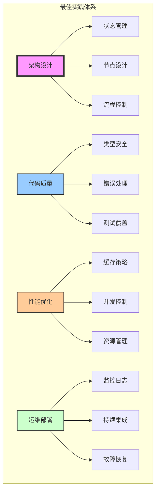

# LangGraph 最佳实践总结

## 概述

本文档总结了 LangGraph 开发过程中的最佳实践，帮助开发者避免常见陷阱，构建高质量的 AI 应用。



## 1. 架构设计最佳实践

### 1.1 工作流设计原则

```python
# ✅ 好的实践：模块化设计
class ModularWorkflow:
    """模块化工作流设计"""

    def __init__(self):
        self.workflow = StateGraph(State)
        self._setup_modules()

    def _setup_modules(self):
        """分模块设置工作流"""
        self._add_input_validation_module()
        self._add_processing_module()
        self._add_output_generation_module()
        self._add_error_handling_module()

    def _add_input_validation_module(self):
        """输入验证模块"""
        self.workflow.add_node("validate_input", self.validate_input_node)
        self.workflow.add_node("sanitize_input", self.sanitize_input_node)
        self.workflow.add_edge("validate_input", "sanitize_input")

    def _add_processing_module(self):
        """处理模块"""
        self.workflow.add_node("preprocess", self.preprocess_node)
        self.workflow.add_node("main_process", self.main_process_node)
        self.workflow.add_node("postprocess", self.postprocess_node)

# ❌ 不好的实践：单体设计
class MonolithicWorkflow:
    def __init__(self):
        self.workflow = StateGraph(State)
        # 所有逻辑混在一起
        self.workflow.add_node("do_everything", self.do_everything_node)

    def do_everything_node(self, state):
        # 验证、处理、输出全在一个节点
        # 难以维护和测试
        pass
```

### 1.2 职责分离

```python
# ✅ 好的实践：单一职责
class SingleResponsibilityNodes:
    """每个节点只负责一个职责"""

    @staticmethod
    def validation_node(state: State) -> Dict:
        """只负责验证"""
        if not state.get("required_field"):
            raise ValueError("Missing required field")
        return {"validated": True}

    @staticmethod
    def transformation_node(state: State) -> Dict:
        """只负责转换"""
        data = state["raw_data"]
        transformed = transform_data(data)
        return {"transformed_data": transformed}

    @staticmethod
    def persistence_node(state: State) -> Dict:
        """只负责持久化"""
        save_to_database(state["transformed_data"])
        return {"persisted": True}

# ❌ 不好的实践：职责混合
def mixed_responsibility_node(state: State) -> Dict:
    """节点职责过多"""
    # 验证
    if not state.get("data"):
        raise ValueError("No data")

    # 转换
    transformed = transform_data(state["data"])

    # 持久化
    save_to_database(transformed)

    # 通知
    send_notification(transformed)

    # 太多职责，难以测试和维护
    return {"done": True}
```

### 1.3 子图使用

```python
# ✅ 好的实践：使用子图分解复杂逻辑
class SubgraphPattern:
    """子图模式"""

    def create_main_workflow(self):
        main = StateGraph(MainState)

        # 使用子图处理复杂逻辑
        auth_subgraph = self.create_auth_subgraph()
        processing_subgraph = self.create_processing_subgraph()

        main.add_node("authenticate", auth_subgraph.compile())
        main.add_node("process", processing_subgraph.compile())

        main.set_entry_point("authenticate")
        main.add_edge("authenticate", "process")

        return main.compile()

    def create_auth_subgraph(self):
        """认证子图"""
        auth = StateGraph(AuthState)
        auth.add_node("check_token", check_token_node)
        auth.add_node("validate_permissions", validate_permissions_node)
        # ... 认证逻辑
        return auth

    def create_processing_subgraph(self):
        """处理子图"""
        process = StateGraph(ProcessState)
        # ... 处理逻辑
        return process
```

## 2. 状态管理最佳实践

### 2.1 状态设计

```python
# ✅ 好的实践：精简的状态设计
class WellDesignedState(TypedDict):
    """精心设计的状态"""
    # 必要字段
    request_id: str
    input_data: Dict

    # 使用Annotated定义更新策略
    processing_steps: Annotated[List[str], add]
    errors: Annotated[List[str], add]

    # 清晰的输出
    result: Optional[Dict]
    status: Literal["pending", "processing", "completed", "failed"]

# ❌ 不好的实践：臃肿的状态
class BloatedState(TypedDict):
    """臃肿的状态"""
    # 存储过多不必要的数据
    entire_request_object: Any
    all_intermediate_results: List[Any]
    debug_info: Dict
    temp_data1: Any
    temp_data2: Any
    # ... 太多临时字段
```

### 2.2 状态更新策略

```python
# ✅ 好的实践：明确的更新策略
class StateUpdateBestPractices:
    """状态更新最佳实践"""

    @staticmethod
    def immutable_update(state: State) -> Dict:
        """不可变更新"""
        # 返回新的更新，不修改原状态
        return {
            "processed_data": process(state["input_data"]),
            "processing_steps": ["data_processed"]
        }

    @staticmethod
    def partial_update(state: State) -> Dict:
        """部分更新"""
        # 只返回需要更新的字段
        return {"status": "completed"}

    @staticmethod
    def validated_update(state: State) -> Dict:
        """验证后更新"""
        # 更新前验证
        new_data = process(state["input_data"])

        if not validate_data(new_data):
            return {"errors": ["Validation failed"]}

        return {"validated_data": new_data}

# ❌ 不好的实践：直接修改状态
def bad_state_update(state: State) -> Dict:
    """错误的状态更新"""
    # 直接修改输入状态
    state["data"] = "modified"  # 错误！

    # 返回整个状态
    return state  # 错误！
```

### 2.3 状态大小控制

```python
# ✅ 好的实践：控制状态大小
class StateOptimization:
    """状态优化"""

    @staticmethod
    def use_references(state: State) -> Dict:
        """使用引用而非复制"""
        # 存储文件路径而非文件内容
        file_path = save_temp_file(state["large_data"])
        return {"data_path": file_path}

    @staticmethod
    def compress_data(state: State) -> Dict:
        """压缩大数据"""
        import zlib
        import base64

        compressed = base64.b64encode(
            zlib.compress(state["data"].encode())
        ).decode()
        return {"compressed_data": compressed}

    @staticmethod
    def paginate_results(state: State) -> Dict:
        """分页处理结果"""
        all_results = state["results"]
        page_size = 100
        current_page = state.get("page", 0)

        start = current_page * page_size
        end = start + page_size

        return {
            "page_results": all_results[start:end],
            "has_more": end < len(all_results),
            "page": current_page + 1
        }
```

## 3. 节点设计最佳实践

### 3.1 节点函数设计

```python
# ✅ 好的实践：纯函数节点
def pure_function_node(state: State) -> Dict:
    """纯函数节点"""
    # 1. 验证输入
    if not state.get("input"):
        return {"error": "Missing input"}

    # 2. 处理逻辑
    try:
        result = process_input(state["input"])
    except Exception as e:
        return {"error": str(e)}

    # 3. 返回更新
    return {
        "output": result,
        "processing_steps": [f"Processed by {pure_function_node.__name__}"]
    }

# ❌ 不好的实践：有副作用的节点
global_cache = {}  # 全局变量

def impure_node(state: State) -> Dict:
    """有副作用的节点"""
    # 修改全局状态
    global_cache[state["id"]] = state["data"]

    # 直接打印（应该用日志）
    print("Processing...")

    # 直接调用外部服务（未处理异常）
    response = requests.post("http://api.example.com", json=state)

    return {"result": response.json()}
```

### 3.2 错误处理

```python
# ✅ 好的实践：完善的错误处理
class RobustNode:
    """健壮的节点实现"""

    @staticmethod
    def with_retry(max_retries: int = 3):
        """重试装饰器"""
        def decorator(func):
            def wrapper(state: State) -> Dict:
                last_error = None
                for attempt in range(max_retries):
                    try:
                        return func(state)
                    except Exception as e:
                        last_error = e
                        if attempt < max_retries - 1:
                            time.sleep(2 ** attempt)  # 指数退避
                        continue
                return {"error": str(last_error), "status": "failed"}
            return wrapper
        return decorator

    @staticmethod
    @with_retry(max_retries=3)
    def resilient_node(state: State) -> Dict:
        """有重试机制的节点"""
        # 可能失败的操作
        result = external_api_call(state["data"])
        return {"api_result": result}

    @staticmethod
    def fallback_node(state: State) -> Dict:
        """带降级策略的节点"""
        try:
            # 尝试主要方法
            result = primary_method(state["data"])
        except Exception as e:
            logger.warning(f"Primary method failed: {e}")
            try:
                # 降级到备用方法
                result = fallback_method(state["data"])
            except Exception as fallback_error:
                logger.error(f"Fallback also failed: {fallback_error}")
                # 返回默认值
                result = get_default_result()

        return {"result": result}
```

### 3.3 异步节点

```python
# ✅ 好的实践：正确的异步节点
class AsyncNodePatterns:
    """异步节点模式"""

    @staticmethod
    async def async_batch_processing(state: State) -> Dict:
        """批量异步处理"""
        items = state["items"]

        # 并发处理所有项
        tasks = [process_item(item) for item in items]
        results = await asyncio.gather(*tasks, return_exceptions=True)

        # 分离成功和失败
        successful = []
        failed = []
        for item, result in zip(items, results):
            if isinstance(result, Exception):
                failed.append({"item": item, "error": str(result)})
            else:
                successful.append(result)

        return {
            "successful_results": successful,
            "failed_items": failed,
            "success_rate": len(successful) / len(items) if items else 0
        }

    @staticmethod
    async def async_with_timeout(state: State) -> Dict:
        """带超时的异步节点"""
        try:
            result = await asyncio.wait_for(
                long_running_operation(state["data"]),
                timeout=30.0
            )
            return {"result": result}
        except asyncio.TimeoutError:
            return {"error": "Operation timed out", "status": "timeout"}
```

## 4. 流程控制最佳实践

### 4.1 条件路由

```python
# ✅ 好的实践：清晰的路由逻辑
class RouterPatterns:
    """路由模式"""

    @staticmethod
    def explicit_router(state: State) -> str:
        """明确的路由函数"""
        # 清晰的条件判断
        if state.get("error"):
            return "error_handler"

        confidence = state.get("confidence_score", 0)
        if confidence >= 0.9:
            return "high_confidence_path"
        elif confidence >= 0.7:
            return "medium_confidence_path"
        else:
            return "low_confidence_path"

    @staticmethod
    def table_driven_router(state: State) -> str:
        """表驱动路由"""
        # 使用路由表
        routing_table = {
            "type_a": "handler_a",
            "type_b": "handler_b",
            "type_c": "handler_c",
        }

        request_type = state.get("request_type", "default")
        return routing_table.get(request_type, "default_handler")

# ❌ 不好的实践：复杂嵌套路由
def complex_nested_router(state: State) -> str:
    """过于复杂的路由"""
    if state.get("a"):
        if state.get("b"):
            if state.get("c"):
                return "path1"
            else:
                if state.get("d"):
                    return "path2"
                else:
                    return "path3"
        else:
            return "path4"
    else:
        return "path5"
    # 难以理解和维护
```

### 4.2 循环控制

```python
# ✅ 好的实践：受控的循环
class LoopControl:
    """循环控制最佳实践"""

    @staticmethod
    def bounded_loop(state: State) -> str:
        """有界循环"""
        max_iterations = 10
        current_iteration = state.get("iteration", 0)

        # 防止无限循环
        if current_iteration >= max_iterations:
            logger.warning(f"Max iterations ({max_iterations}) reached")
            return "max_iterations_exceeded"

        # 检查终止条件
        if state.get("converged"):
            return "success"

        # 检查早停条件
        if state.get("no_improvement_count", 0) >= 3:
            return "early_stop"

        return "continue"

    @staticmethod
    def exponential_backoff_loop(state: State) -> Dict:
        """指数退避循环"""
        iteration = state.get("iteration", 0)
        wait_time = min(2 ** iteration, 60)  # 最多等待60秒

        time.sleep(wait_time)

        return {
            "iteration": iteration + 1,
            "wait_time": wait_time
        }
```

## 5. 性能优化最佳实践

### 5.1 缓存策略

```python
# ✅ 好的实践：智能缓存
class CachingStrategies:
    """缓存策略"""

    def __init__(self):
        self.cache = {}
        self.cache_stats = {"hits": 0, "misses": 0}

    def cached_node(self, ttl: int = 3600):
        """缓存装饰器"""
        def decorator(func):
            def wrapper(state: State) -> Dict:
                # 生成缓存键
                cache_key = self._generate_cache_key(state)

                # 检查缓存
                if cache_key in self.cache:
                    cached_result, timestamp = self.cache[cache_key]
                    if time.time() - timestamp < ttl:
                        self.cache_stats["hits"] += 1
                        logger.debug(f"Cache hit for {cache_key}")
                        return cached_result

                # 缓存未命中
                self.cache_stats["misses"] += 1
                result = func(state)

                # 存储到缓存
                self.cache[cache_key] = (result, time.time())

                # 清理过期缓存
                self._cleanup_expired_cache(ttl)

                return result
            return wrapper
        return decorator

    def _generate_cache_key(self, state: State) -> str:
        """生成缓存键"""
        import hashlib
        import json

        # 只使用影响结果的字段
        relevant_fields = {
            k: v for k, v in state.items()
            if k in ["input_data", "parameters"]
        }

        serialized = json.dumps(relevant_fields, sort_keys=True)
        return hashlib.md5(serialized.encode()).hexdigest()

    def _cleanup_expired_cache(self, ttl: int):
        """清理过期缓存"""
        current_time = time.time()
        expired_keys = [
            k for k, (_, timestamp) in self.cache.items()
            if current_time - timestamp >= ttl
        ]
        for key in expired_keys:
            del self.cache[key]
```

### 5.2 批处理优化

```python
# ✅ 好的实践：批处理
class BatchProcessing:
    """批处理优化"""

    @staticmethod
    def batch_llm_calls(state: State) -> Dict:
        """批量LLM调用"""
        prompts = state["prompts"]
        batch_size = 10

        all_results = []
        for i in range(0, len(prompts), batch_size):
            batch = prompts[i:i + batch_size]

            # 批量调用
            results = llm.batch(batch)
            all_results.extend(results)

            # 避免速率限制
            if i + batch_size < len(prompts):
                time.sleep(0.1)

        return {"batch_results": all_results}

    @staticmethod
    def streaming_processing(state: State) -> Dict:
        """流式处理大数据"""
        def process_stream(data_stream):
            """流式处理生成器"""
            for chunk in data_stream:
                # 处理每个块
                processed = process_chunk(chunk)
                yield processed

        # 使用生成器避免内存溢出
        data_stream = read_large_file_in_chunks(state["file_path"])
        results = list(process_stream(data_stream))

        return {"processed_chunks": results}
```

## 6. 测试最佳实践

### 6.1 单元测试

```python
# ✅ 好的实践：全面的单元测试
class TestBestPractices:
    """测试最佳实践"""

    def test_node_with_mocking(self, mocker):
        """使用mock测试节点"""
        # Mock外部依赖
        mock_api = mocker.patch('module.external_api_call')
        mock_api.return_value = {"status": "success"}

        # 测试节点
        state = {"input": "test"}
        result = node_function(state)

        # 验证结果
        assert result["status"] == "success"
        mock_api.assert_called_once_with("test")

    def test_edge_cases(self):
        """测试边界情况"""
        # 空输入
        assert node_function({}) == {"error": "Missing input"}

        # 超大输入
        large_input = {"data": "x" * 1000000}
        result = node_function(large_input)
        assert result["status"] == "processed"

        # 特殊字符
        special_input = {"data": "';DROP TABLE users;--"}
        result = node_function(special_input)
        assert result["sanitized"] == True

    @pytest.mark.parametrize("input,expected", [
        ({"score": 0.9}, "high"),
        ({"score": 0.7}, "medium"),
        ({"score": 0.3}, "low"),
        ({}, "unknown"),
    ])
    def test_router_with_parameters(self, input, expected):
        """参数化测试路由"""
        assert router_function(input) == expected
```

### 6.2 集成测试

```python
# ✅ 好的实践：完整的集成测试
class IntegrationTestPatterns:
    """集成测试模式"""

    @pytest.fixture
    def test_workflow(self):
        """测试工作流fixture"""
        workflow = create_test_workflow()
        return workflow.compile()

    async def test_complete_workflow(self, test_workflow):
        """测试完整工作流"""
        # 准备测试数据
        test_input = {
            "request_id": "test_123",
            "data": {"value": 100}
        }

        # 执行工作流
        result = await test_workflow.ainvoke(test_input)

        # 验证结果
        assert result["status"] == "completed"
        assert "output" in result
        assert len(result["processing_steps"]) > 0

        # 验证副作用
        assert check_database_updated()
        assert check_notifications_sent()
```

## 7. 监控和日志最佳实践

### 7.1 结构化日志

```python
# ✅ 好的实践：结构化日志
import structlog

logger = structlog.get_logger()

class StructuredLogging:
    """结构化日志最佳实践"""

    @staticmethod
    def log_node_execution(node_name: str):
        """节点执行日志装饰器"""
        def decorator(func):
            def wrapper(state: State) -> Dict:
                # 绑定上下文
                log = logger.bind(
                    node=node_name,
                    request_id=state.get("request_id"),
                    user_id=state.get("user_id")
                )

                log.info("node_execution_started")
                start_time = time.time()

                try:
                    result = func(state)
                    duration = time.time() - start_time

                    log.info(
                        "node_execution_completed",
                        duration_ms=duration * 1000,
                        output_size=len(str(result))
                    )

                    return result

                except Exception as e:
                    log.error(
                        "node_execution_failed",
                        error=str(e),
                        error_type=type(e).__name__
                    )
                    raise

            return wrapper
        return decorator

    @log_node_execution("data_processor")
    def process_data_node(state: State) -> Dict:
        """带日志的节点"""
        # 处理逻辑
        return {"processed": True}
```

### 7.2 性能监控

```python
# ✅ 好的实践：性能监控
from prometheus_client import Counter, Histogram, Gauge

# 定义指标
node_executions = Counter(
    'langgraph_node_executions_total',
    'Total node executions',
    ['node_name', 'status']
)

node_duration = Histogram(
    'langgraph_node_duration_seconds',
    'Node execution duration',
    ['node_name']
)

active_workflows = Gauge(
    'langgraph_active_workflows',
    'Number of active workflows'
)

class MetricsCollection:
    """指标收集"""

    @staticmethod
    def monitored_node(node_name: str):
        """监控装饰器"""
        def decorator(func):
            def wrapper(state: State) -> Dict:
                # 增加活动工作流计数
                active_workflows.inc()

                # 记录执行时间
                with node_duration.labels(node_name=node_name).time():
                    try:
                        result = func(state)
                        # 记录成功
                        node_executions.labels(
                            node_name=node_name,
                            status='success'
                        ).inc()
                        return result
                    except Exception as e:
                        # 记录失败
                        node_executions.labels(
                            node_name=node_name,
                            status='failure'
                        ).inc()
                        raise
                    finally:
                        # 减少活动工作流计数
                        active_workflows.dec()

            return wrapper
        return decorator
```

## 8. 安全最佳实践

### 8.1 输入验证

```python
# ✅ 好的实践：严格的输入验证
from pydantic import BaseModel, validator
import bleach

class InputValidation:
    """输入验证最佳实践"""

    class SafeInput(BaseModel):
        """使用Pydantic验证输入"""
        text: str
        number: int
        email: str

        @validator('text')
        def sanitize_text(cls, v):
            """清理文本输入"""
            # 移除危险字符
            return bleach.clean(v, tags=[], strip=True)

        @validator('number')
        def validate_number(cls, v):
            """验证数字范围"""
            if not 0 <= v <= 1000000:
                raise ValueError('Number out of range')
            return v

        @validator('email')
        def validate_email(cls, v):
            """验证邮箱格式"""
            import re
            pattern = r'^[\w\.-]+@[\w\.-]+\.\w+$'
            if not re.match(pattern, v):
                raise ValueError('Invalid email format')
            return v

    @staticmethod
    def validate_input_node(state: State) -> Dict:
        """验证输入的节点"""
        try:
            # 使用Pydantic验证
            validated = InputValidation.SafeInput(**state["user_input"])
            return {"validated_input": validated.dict()}
        except Exception as e:
            return {"error": f"Validation failed: {str(e)}"}
```

### 8.2 敏感数据处理

```python
# ✅ 好的实践：安全处理敏感数据
class SecureDataHandling:
    """敏感数据处理"""

    @staticmethod
    def mask_sensitive_data(data: Dict) -> Dict:
        """掩码敏感数据"""
        sensitive_fields = ["password", "api_key", "token", "ssn"]
        masked_data = data.copy()

        for field in sensitive_fields:
            if field in masked_data:
                # 保留前后几位，中间用*替换
                value = str(masked_data[field])
                if len(value) > 4:
                    masked_data[field] = value[:2] + "*" * (len(value) - 4) + value[-2:]
                else:
                    masked_data[field] = "*" * len(value)

        return masked_data

    @staticmethod
    def encrypt_sensitive_fields(state: State) -> Dict:
        """加密敏感字段"""
        from cryptography.fernet import Fernet

        key = os.environ.get("ENCRYPTION_KEY")
        f = Fernet(key.encode())

        sensitive_fields = ["credit_card", "personal_id"]
        encrypted_data = {}

        for field in sensitive_fields:
            if field in state:
                encrypted = f.encrypt(state[field].encode())
                encrypted_data[f"{field}_encrypted"] = encrypted.decode()

        return encrypted_data
```

## 9. 部署最佳实践

### 9.1 配置管理

```python
# ✅ 好的实践：环境分离的配置
class ConfigurationManagement:
    """配置管理最佳实践"""

    @staticmethod
    def get_config():
        """根据环境获取配置"""
        env = os.getenv("ENVIRONMENT", "development")

        configs = {
            "development": {
                "debug": True,
                "log_level": "DEBUG",
                "cache_ttl": 60,
                "max_retries": 1
            },
            "staging": {
                "debug": False,
                "log_level": "INFO",
                "cache_ttl": 300,
                "max_retries": 2
            },
            "production": {
                "debug": False,
                "log_level": "WARNING",
                "cache_ttl": 3600,
                "max_retries": 3
            }
        }

        config = configs.get(env, configs["development"])

        # 验证必要的环境变量
        required_vars = ["API_KEY", "DATABASE_URL"]
        missing = [var for var in required_vars if not os.getenv(var)]
        if missing:
            raise ValueError(f"Missing required environment variables: {missing}")

        return config
```

### 9.2 优雅关闭

```python
# ✅ 好的实践：优雅关闭
import signal
import sys

class GracefulShutdown:
    """优雅关闭"""

    def __init__(self):
        self.shutdown = False
        signal.signal(signal.SIGINT, self._shutdown_handler)
        signal.signal(signal.SIGTERM, self._shutdown_handler)

    def _shutdown_handler(self, signum, frame):
        """处理关闭信号"""
        logger.info(f"Received shutdown signal: {signum}")
        self.shutdown = True

    def run_workflow(self):
        """运行工作流with优雅关闭"""
        while not self.shutdown:
            try:
                # 检查是否需要关闭
                if self.shutdown:
                    logger.info("Shutting down gracefully...")
                    break

                # 处理任务
                task = get_next_task()
                if task:
                    process_task(task)
                else:
                    time.sleep(1)

            except Exception as e:
                logger.error(f"Error in workflow: {e}")
                if self.shutdown:
                    break

        # 清理资源
        self._cleanup()

    def _cleanup(self):
        """清理资源"""
        logger.info("Cleaning up resources...")
        close_database_connections()
        flush_caches()
        logger.info("Cleanup completed")
```

## 10. 最佳实践检查清单

```python
"""
LangGraph 最佳实践检查清单
"""

best_practices_checklist = {
    "架构设计": [
        "✓ 使用模块化设计",
        "✓ 职责单一原则",
        "✓ 适当使用子图",
        "✓ 避免循环依赖"
    ],
    "状态管理": [
        "✓ 精简状态设计",
        "✓ 使用TypedDict",
        "✓ 定义清晰的更新策略",
        "✓ 控制状态大小"
    ],
    "节点设计": [
        "✓ 节点为纯函数",
        "✓ 完善错误处理",
        "✓ 添加重试机制",
        "✓ 实现超时控制"
    ],
    "流程控制": [
        "✓ 清晰的路由逻辑",
        "✓ 避免无限循环",
        "✓ 设置最大迭代次数",
        "✓ 实现早停机制"
    ],
    "性能优化": [
        "✓ 实现缓存策略",
        "✓ 使用批处理",
        "✓ 异步并发执行",
        "✓ 资源池化"
    ],
    "测试覆盖": [
        "✓ 单元测试覆盖80%+",
        "✓ 集成测试关键路径",
        "✓ 性能测试基准",
        "✓ 错误场景测试"
    ],
    "监控日志": [
        "✓ 结构化日志",
        "✓ 性能指标收集",
        "✓ 错误追踪",
        "✓ 业务指标监控"
    ],
    "安全措施": [
        "✓ 输入验证",
        "✓ 敏感数据加密",
        "✓ 访问控制",
        "✓ 审计日志"
    ],
    "部署准备": [
        "✓ 环境配置分离",
        "✓ 优雅关闭机制",
        "✓ 健康检查接口",
        "✓ 回滚策略"
    ],
    "文档完善": [
        "✓ API文档",
        "✓ 架构说明",
        "✓ 部署指南",
        "✓ 故障排查手册"
    ]
}

def evaluate_project(project_path: str) -> Dict[str, float]:
    """评估项目的最佳实践符合度"""
    scores = {}
    for category, items in best_practices_checklist.items():
        # 检查每个类别的符合度
        met = sum(1 for item in items if check_item(project_path, item))
        scores[category] = met / len(items) * 100
    return scores
```

## 总结

LangGraph 最佳实践的核心要点：

1. **架构设计**：模块化、职责分离、合理使用子图
2. **状态管理**：精简设计、明确策略、控制大小
3. **节点设计**：纯函数、错误处理、异步优化
4. **流程控制**：清晰路由、避免死循环、优雅退出
5. **性能优化**：缓存、批处理、并发执行
6. **测试策略**：全面覆盖、自动化、持续集成
7. **监控日志**：结构化、可追踪、实时告警
8. **安全防护**：输入验证、数据加密、访问控制
9. **部署运维**：配置管理、优雅关闭、故障恢复
10. **持续改进**：代码审查、性能调优、文档更新

遵循这些最佳实践，可以构建出高质量、可维护、可扩展的 LangGraph 应用。