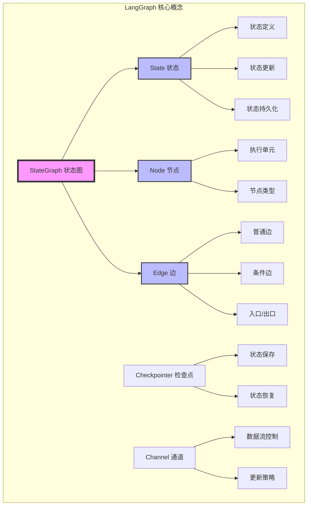
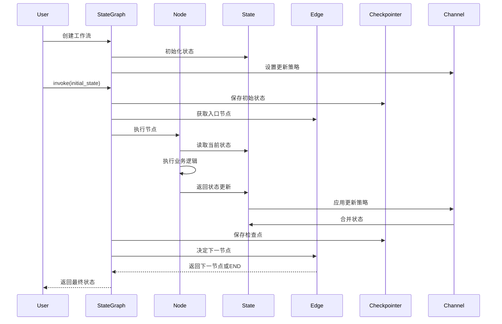

# LangGraph 的核心概念及其作用

## 核心概念总览



## 1. StateGraph（状态图）

### 概念定义
StateGraph 是 LangGraph 的核心容器，它将整个工作流组织成一个有向图结构。这是整个框架的基础，所有其他概念都围绕它展开。

### 核心作用
- **工作流编排**：定义和组织复杂的多步骤工作流
- **状态管理**：维护整个执行过程中的共享状态
- **执行控制**：管理节点的执行顺序和条件
- **生命周期管理**：控制工作流的启动、执行和结束

### 详细示例
```python
from langgraph.graph import StateGraph
from typing import TypedDict

class WorkflowState(TypedDict):
    input: str
    processing_result: str
    final_output: str

# 创建状态图 - 工作流的容器
workflow = StateGraph(WorkflowState)

# 添加节点 - 定义处理步骤
workflow.add_node("preprocess", preprocess_node)
workflow.add_node("process", process_node)
workflow.add_node("postprocess", postprocess_node)

# 定义执行流程
workflow.set_entry_point("preprocess")
workflow.add_edge("preprocess", "process")
workflow.add_edge("process", "postprocess")
workflow.add_edge("postprocess", END)

# 编译成可执行应用
app = workflow.compile()
```

### 实际应用场景
- **多步骤数据处理管道**
- **复杂的决策流程**
- **带有人工审批的工作流**
- **需要状态追踪的长时间运行任务**

## 2. State（状态）

### 概念定义
State 是在整个图执行过程中传递和共享的数据容器。它是节点之间通信的媒介，承载着工作流的所有数据。

### 核心作用
- **数据传递**：在节点间传递信息
- **上下文维护**：保持执行上下文
- **结果累积**：收集和合并各节点的输出
- **历史记录**：追踪执行过程

### 状态设计模式
```python
from typing import TypedDict, Annotated, List, Dict, Optional
from operator import add
from datetime import datetime

class AdvancedState(TypedDict):
    # 1. 简单覆盖 - 每次更新完全替换
    current_step: str
    user_id: str

    # 2. 累加更新 - 自动追加到列表
    messages: Annotated[List[str], add]
    errors: Annotated[List[str], add]

    # 3. 字典合并 - 合并新旧字典
    metadata: Annotated[Dict, lambda x, y: {**x, **y}]

    # 4. 计数器 - 自动累加
    retry_count: Annotated[int, lambda x, y: x + y]

    # 5. 时间戳 - 自动更新
    last_updated: Annotated[datetime, lambda x, y: datetime.now()]

    # 6. 可选字段 - 可能不存在
    optional_data: Optional[Dict]
```

### 状态更新机制
```python
def node_with_state_update(state: AdvancedState) -> Dict:
    """节点返回的是状态更新，而不是完整状态"""

    # ✅ 正确：返回要更新的字段
    return {
        "current_step": "processing",
        "messages": ["Processing started"],  # 会追加到列表
        "metadata": {"processed_at": datetime.now()}  # 会合并到字典
    }

    # ❌ 错误：直接修改并返回整个状态
    # state["current_step"] = "processing"
    # return state
```

## 3. Node（节点）

### 概念定义
节点是图中的执行单元，每个节点封装了特定的业务逻辑。节点是工作流的实际执行者。

### 核心作用
- **任务执行**：执行特定的处理任务
- **状态转换**：读取输入状态，产生输出更新
- **外部交互**：调用 API、数据库、工具等
- **决策逻辑**：实现业务规则和判断

### 节点类型详解
```python
from langchain_openai import ChatOpenAI
from langchain.tools import DuckDuckGoSearchRun

# 1. 数据处理节点
def data_processing_node(state: State) -> Dict:
    """处理数据的节点"""
    data = state["raw_data"]
    processed = clean_and_transform(data)
    return {"processed_data": processed}

# 2. LLM 调用节点
def llm_node(state: State) -> Dict:
    """调用大语言模型的节点"""
    llm = ChatOpenAI(model="gpt-4")
    prompt = state["prompt"]
    response = llm.invoke(prompt)
    return {"llm_response": response.content}

# 3. 工具调用节点
def search_tool_node(state: State) -> Dict:
    """调用搜索工具的节点"""
    search = DuckDuckGoSearchRun()
    query = state["search_query"]
    results = search.run(query)
    return {"search_results": results}

# 4. 决策节点
def decision_node(state: State) -> str:
    """做出决策但不修改状态的节点"""
    score = state["confidence_score"]
    if score > 0.8:
        return "high_confidence"
    elif score > 0.5:
        return "medium_confidence"
    else:
        return "low_confidence"

# 5. 验证节点
def validation_node(state: State) -> Dict:
    """验证数据的节点"""
    errors = []
    if not state.get("required_field"):
        errors.append("Missing required field")
    if len(state.get("data", [])) == 0:
        errors.append("Empty data")

    return {
        "is_valid": len(errors) == 0,
        "validation_errors": errors
    }

# 6. 聚合节点
def aggregation_node(state: State) -> Dict:
    """聚合多个结果的节点"""
    results = state.get("parallel_results", [])
    aggregated = {
        "total": sum(r.get("value", 0) for r in results),
        "average": sum(r.get("value", 0) for r in results) / len(results) if results else 0,
        "count": len(results)
    }
    return {"aggregated_result": aggregated}
```

## 4. Edge（边）

### 概念定义
边定义节点之间的连接和执行流程，决定了工作流的执行路径。

### 核心作用
- **流程控制**：定义执行顺序
- **条件路由**：基于条件选择不同路径
- **循环实现**：支持迭代和反馈循环
- **并行执行**：支持分支和合并

### 边的类型和使用
```python
from langgraph.graph import StateGraph, END

workflow = StateGraph(State)

# 1. 普通边 - 无条件顺序执行
workflow.add_edge("start", "process")
workflow.add_edge("process", "end")

# 2. 条件边 - 基于函数返回值路由
def routing_logic(state):
    """路由逻辑函数"""
    if state["error"]:
        return "error_handler"
    elif state["needs_review"]:
        return "human_review"
    else:
        return "auto_approve"

workflow.add_conditional_edges(
    "decision_point",
    routing_logic,
    {
        "error_handler": "handle_error",
        "human_review": "review_queue",
        "auto_approve": "complete"
    }
)

# 3. 入口边 - 定义起始点
workflow.set_entry_point("initialization")

# 4. 结束边 - 连接到结束
workflow.add_edge("finalization", END)

# 5. 循环边 - 创建迭代
workflow.add_conditional_edges(
    "iterate",
    lambda s: "continue" if s["iteration"] < s["max_iterations"] else "done",
    {
        "continue": "process",  # 回到处理节点
        "done": END
    }
)

# 6. 扇出边 - 并行执行
workflow.add_edge("split", "parallel_1")
workflow.add_edge("split", "parallel_2")
workflow.add_edge("split", "parallel_3")

# 7. 扇入边 - 汇聚结果
workflow.add_edge("parallel_1", "merge")
workflow.add_edge("parallel_2", "merge")
workflow.add_edge("parallel_3", "merge")
```

## 5. Checkpointer（检查点）

### 概念定义
Checkpointer 提供状态持久化和恢复机制，使工作流能够在中断后继续执行。

### 核心作用
- **故障恢复**：系统崩溃后恢复执行
- **长时间运行**：支持可中断的工作流
- **人工介入**：暂停等待人工审批
- **调试支持**：回放和检查执行历史

### 检查点实现
```python
from langgraph.checkpoint import MemorySaver, SqliteSaver
import pickle
import redis

# 1. 内存检查点 - 开发测试用
memory_checkpointer = MemorySaver()

# 2. SQLite 检查点 - 轻量级持久化
sqlite_checkpointer = SqliteSaver.from_conn_string("workflow.db")

# 3. 自定义 Redis 检查点
class RedisCheckpointer:
    def __init__(self, redis_client):
        self.redis = redis_client

    def save(self, thread_id: str, checkpoint: Dict):
        """保存检查点"""
        key = f"checkpoint:{thread_id}"
        value = pickle.dumps(checkpoint)
        self.redis.set(key, value)
        self.redis.expire(key, 3600)  # 1小时过期

    def load(self, thread_id: str) -> Optional[Dict]:
        """加载检查点"""
        key = f"checkpoint:{thread_id}"
        value = self.redis.get(key)
        return pickle.loads(value) if value else None

# 使用检查点
workflow = StateGraph(State)
# ... 添加节点和边 ...

# 编译时启用检查点
app = workflow.compile(checkpointer=sqlite_checkpointer)

# 执行with检查点
config = {"configurable": {"thread_id": "user_session_123"}}

# 第一次执行
result1 = app.invoke(initial_state, config)

# 如果中断，可以继续执行
result2 = app.invoke(None, config)  # 从检查点恢复
```

## 6. Channel（通道）

### 概念定义
Channel 定义状态字段的更新策略和数据流控制，决定了状态如何被合并和更新。

### 核心作用
- **更新控制**：定义如何合并状态更新
- **数据累积**：支持列表追加、字典合并等
- **历史维护**：保留执行历史
- **冲突解决**：处理并发更新

### 通道类型和自定义
```python
from langgraph.channels import LastValue, BinaryChannel, Topic, Context
from typing import Any

# 1. 内置通道类型
class ChannelState(TypedDict):
    # LastValue - 保留最新值
    current_status: Annotated[str, LastValue]

    # Context - 保留所有历史
    audit_log: Annotated[List[Dict], Context]

    # BinaryChannel - 二进制操作
    feature_flags: Annotated[int, BinaryChannel]

    # Topic - 发布订阅模式
    events: Annotated[List[str], Topic]

# 2. 自定义通道 - 滑动窗口
class SlidingWindowChannel:
    """只保留最近N条记录的通道"""
    def __init__(self, window_size: int = 10):
        self.window_size = window_size
        self.data = []

    def update(self, values: List) -> List:
        self.data.extend(values)
        if len(self.data) > self.window_size:
            self.data = self.data[-self.window_size:]
        return self.data

    def get(self) -> List:
        return self.data

# 3. 自定义通道 - 去重集合
class UniqueSetChannel:
    """自动去重的集合通道"""
    def __init__(self):
        self.items = set()

    def update(self, values: List) -> List:
        self.items.update(values)
        return list(self.items)

    def get(self) -> List:
        return list(self.items)

# 4. 自定义通道 - 优先级队列
class PriorityChannel:
    """按优先级排序的通道"""
    def __init__(self):
        self.queue = []

    def update(self, items: List[Tuple[int, Any]]) -> List:
        for priority, item in items:
            self.queue.append((priority, item))
        self.queue.sort(key=lambda x: x[0], reverse=True)
        return self.queue

    def get(self) -> List:
        return [item for _, item in self.queue]
```

## 核心概念协作关系



## 完整应用示例

```python
from typing import TypedDict, Annotated, List, Dict
from operator import add
from langgraph.graph import StateGraph, END
from langgraph.checkpoint import SqliteSaver
from langchain_openai import ChatOpenAI
import time

# 1. 定义状态 - 所有概念的数据基础
class ResearchState(TypedDict):
    topic: str
    research_questions: List[str]
    search_results: Annotated[List[Dict], add]  # 使用通道累积
    analysis: Dict
    iteration: int
    max_iterations: int
    quality_score: float
    is_complete: bool

# 2. 定义节点 - 实际的处理逻辑
def generate_questions_node(state: ResearchState):
    """生成研究问题"""
    llm = ChatOpenAI()
    questions = llm.invoke(f"Generate 5 research questions about {state['topic']}")
    return {"research_questions": questions.content.split('\n')}

def search_node(state: ResearchState):
    """执行搜索"""
    results = []
    for question in state["research_questions"]:
        # 模拟搜索
        result = {"question": question, "answer": f"Result for {question}"}
        results.append(result)
    return {"search_results": results}

def analyze_node(state: ResearchState):
    """分析结果"""
    llm = ChatOpenAI()
    all_results = state["search_results"]
    analysis = llm.invoke(f"Analyze these results: {all_results}")

    # 计算质量分数
    quality = len(all_results) * 0.1

    return {
        "analysis": {"summary": analysis.content, "timestamp": time.time()},
        "quality_score": min(quality, 1.0),
        "iteration": state["iteration"] + 1
    }

def check_quality_node(state: ResearchState):
    """检查质量决定是否继续"""
    if state["quality_score"] >= 0.8:
        return {"is_complete": True}
    if state["iteration"] >= state["max_iterations"]:
        return {"is_complete": True}
    return {"is_complete": False}

# 路由函数 - 决定流程走向
def quality_router(state: ResearchState):
    if state["is_complete"]:
        return "finish"
    return "continue"

# 3. 创建状态图 - 组装工作流
workflow = StateGraph(ResearchState)

# 4. 添加节点
workflow.add_node("generate_questions", generate_questions_node)
workflow.add_node("search", search_node)
workflow.add_node("analyze", analyze_node)
workflow.add_node("check_quality", check_quality_node)

# 5. 定义边 - 控制执行流程
workflow.set_entry_point("generate_questions")
workflow.add_edge("generate_questions", "search")
workflow.add_edge("search", "analyze")
workflow.add_edge("analyze", "check_quality")

# 条件边 - 基于质量决定是否继续
workflow.add_conditional_edges(
    "check_quality",
    quality_router,
    {
        "continue": "search",  # 继续搜索更多
        "finish": END
    }
)

# 6. 编译with检查点 - 支持持久化
checkpointer = SqliteSaver.from_conn_string("research.db")
app = workflow.compile(checkpointer=checkpointer)

# 7. 执行工作流
initial_state = {
    "topic": "AI in Healthcare",
    "research_questions": [],
    "search_results": [],
    "analysis": {},
    "iteration": 0,
    "max_iterations": 3,
    "quality_score": 0.0,
    "is_complete": False
}

# 使用检查点配置执行
config = {"configurable": {"thread_id": "research_001"}}
result = app.invoke(initial_state, config)

print(f"Research completed with quality score: {result['quality_score']}")
print(f"Total iterations: {result['iteration']}")
print(f"Analysis: {result['analysis']['summary']}")
```

## 概念对比总结

| 概念 | 作用 | 类比 | 使用场景 | 关键特性 |
|------|------|------|----------|----------|
| **StateGraph** | 工作流容器 | 流程图框架 | 组织整个工作流 | 节点和边的管理 |
| **State** | 数据载体 | 全局共享内存 | 节点间数据传递 | 类型安全、更新策略 |
| **Node** | 执行单元 | 函数/处理器 | 具体业务逻辑 | 无副作用、返回更新 |
| **Edge** | 流程控制 | 流程箭头 | 定义执行路径 | 条件路由、循环控制 |
| **Checkpointer** | 持久化机制 | 存档系统 | 故障恢复、长时运行 | 状态保存和恢复 |
| **Channel** | 更新策略 | 数据管道 | 控制状态合并 | 累加、覆盖、自定义 |

## 核心概念的设计原则

1. **关注点分离**：每个概念负责特定职责
2. **组合优于继承**：通过组合不同概念构建复杂系统
3. **声明式编程**：描述"做什么"而非"怎么做"
4. **不可变性**：状态更新返回新值而非修改原值
5. **可测试性**：每个节点都是独立可测试的单元
6. **可扩展性**：支持自定义通道、检查点等

## 最佳实践建议

1. **状态设计要精简**：只包含必要的共享数据
2. **节点要保持纯函数**：无副作用，便于测试
3. **合理使用条件边**：避免过于复杂的路由逻辑
4. **利用检查点**：为长时间运行的工作流启用持久化
5. **选择合适的通道**：根据数据特性选择更新策略
6. **监控和日志**：在关键节点添加监控点

通过深入理解这些核心概念及其相互关系，你可以构建出强大、灵活、可靠的 AI 工作流系统。