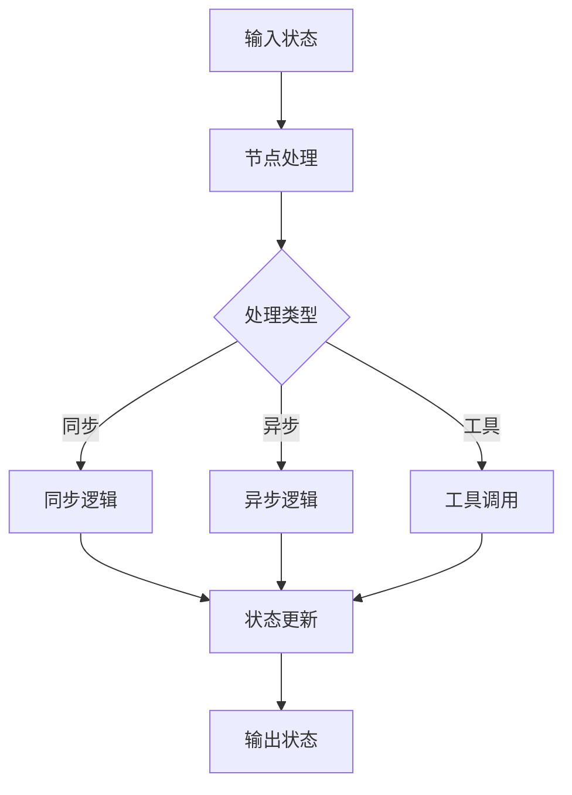

# LangGraph 节点开发指南

## 一、节点概述

节点是 LangGraph 中执行具体业务逻辑的基本单元，理解节点的开发模式是构建高质量工作流的关键。



## 二、节点类型详解

### 2.1 函数节点

```python
from typing import TypedDict, Dict, Any

class State(TypedDict):
    input: str
    output: str
    metadata: Dict[str, Any]

# 简单函数节点
def simple_node(state: State) -> State:
    """最基本的节点形式"""
    processed = state["input"].upper()
    return {
        "output": processed,
        "metadata": {"processed_by": "simple_node"}
    }

# 带验证的函数节点
def validated_node(state: State) -> State:
    """包含输入验证的节点"""
    # 输入验证
    if not state.get("input"):
        raise ValueError("输入不能为空")

    if len(state["input"]) > 1000:
        raise ValueError("输入长度超过限制")

    # 业务逻辑
    result = process_data(state["input"])

    # 输出验证
    assert result is not None, "处理结果不能为空"

    return {"output": result}

# 带日志的函数节点
import logging

logger = logging.getLogger(__name__)

def logged_node(state: State) -> State:
    """包含日志记录的节点"""
    logger.info(f"开始处理: {state.get('id')}")

    try:
        result = complex_processing(state)
        logger.info(f"处理成功: {state.get('id')}")
        return result
    except Exception as e:
        logger.error(f"处理失败: {state.get('id')} - {str(e)}")
        raise
```

### 2.2 类节点

```python
from abc import ABC, abstractmethod

class BaseNode(ABC):
    """节点基类"""

    def __init__(self, config: Dict[str, Any]):
        self.config = config
        self.setup()

    def setup(self):
        """初始化设置"""
        pass

    @abstractmethod
    def process(self, state: State) -> State:
        """处理逻辑"""
        pass

    def __call__(self, state: State) -> State:
        """使对象可调用"""
        return self.process(state)

class DataProcessorNode(BaseNode):
    """数据处理节点"""

    def setup(self):
        self.processor = DataProcessor(self.config)

    def process(self, state: State) -> State:
        data = state["input"]

        # 预处理
        cleaned = self.processor.clean(data)

        # 主处理
        result = self.processor.transform(cleaned)

        # 后处理
        formatted = self.processor.format(result)

        return {
            "output": formatted,
            "metadata": {
                "processor_version": self.processor.version,
                "processing_time": self.processor.elapsed_time
            }
        }

# 使用类节点
processor = DataProcessorNode({"batch_size": 100})
graph.add_node("processor", processor)
```

### 2.3 异步节点

```python
import asyncio
from typing import AsyncGenerator

async def async_node(state: State) -> State:
    """异步节点"""
    # 异步API调用
    result = await fetch_external_data(state["input"])

    # 异步处理
    processed = await process_async(result)

    return {"output": processed}

async def streaming_node(state: State) -> AsyncGenerator[State, None]:
    """流式异步节点"""
    async for chunk in stream_data(state["input"]):
        # 逐块处理并输出
        processed_chunk = await process_chunk(chunk)
        yield {"partial_output": processed_chunk}

    # 最终状态
    yield {"output": "完成", "status": "completed"}

# 并发异步节点
async def concurrent_node(state: State) -> State:
    """并发执行多个异步任务"""
    tasks = [
        fetch_api_1(state["input"]),
        fetch_api_2(state["input"]),
        fetch_api_3(state["input"])
    ]

    results = await asyncio.gather(*tasks)

    return {
        "api_results": results,
        "combined": combine_results(results)
    }
```

## 三、错误处理

### 3.1 基础错误处理

```python
def error_handling_node(state: State) -> State:
    """带错误处理的节点"""
    try:
        # 危险操作
        result = risky_operation(state["input"])
        return {"output": result, "status": "success"}

    except ValueError as e:
        # 处理特定错误
        logger.warning(f"值错误: {e}")
        return {
            "output": None,
            "status": "error",
            "error_message": str(e),
            "error_type": "validation"
        }

    except TimeoutError as e:
        # 超时处理
        logger.error(f"操作超时: {e}")
        return {
            "output": None,
            "status": "timeout",
            "should_retry": True
        }

    except Exception as e:
        # 通用错误处理
        logger.exception("未预期的错误")
        return {
            "output": None,
            "status": "fatal_error",
            "error_message": str(e)
        }
```

### 3.2 重试机制

```python
from typing import TypedDict
import time
from functools import wraps

class RetryState(TypedDict):
    attempt: int
    max_attempts: int
    retry_delay: float
    last_error: str

def with_retry(max_attempts=3, delay=1.0, backoff=2.0):
    """重试装饰器"""
    def decorator(func):
        @wraps(func)
        def wrapper(state: State) -> State:
            attempts = 0
            current_delay = delay

            while attempts < max_attempts:
                try:
                    return func(state)
                except Exception as e:
                    attempts += 1
                    if attempts >= max_attempts:
                        raise

                    logger.warning(
                        f"尝试 {attempts}/{max_attempts} 失败: {e}"
                        f"等待 {current_delay} 秒后重试"
                    )
                    time.sleep(current_delay)
                    current_delay *= backoff

            return state
        return wrapper
    return decorator

@with_retry(max_attempts=3, delay=1.0)
def retryable_node(state: State) -> State:
    """可重试的节点"""
    if random.random() < 0.5:
        raise Exception("随机失败")
    return {"output": "成功"}
```

### 3.3 断路器模式

```python
from datetime import datetime, timedelta
from threading import Lock

class CircuitBreaker:
    """断路器实现"""

    def __init__(self, failure_threshold=5, timeout=60):
        self.failure_threshold = failure_threshold
        self.timeout = timeout
        self.failure_count = 0
        self.last_failure_time = None
        self.state = "closed"  # closed, open, half_open
        self.lock = Lock()

    def call(self, func, *args, **kwargs):
        with self.lock:
            if self.state == "open":
                if self._should_attempt_reset():
                    self.state = "half_open"
                else:
                    raise Exception("断路器开启，服务不可用")

        try:
            result = func(*args, **kwargs)
            self._on_success()
            return result
        except Exception as e:
            self._on_failure()
            raise

    def _should_attempt_reset(self):
        return (
            self.last_failure_time and
            datetime.now() - self.last_failure_time > timedelta(seconds=self.timeout)
        )

    def _on_success(self):
        with self.lock:
            self.failure_count = 0
            self.state = "closed"

    def _on_failure(self):
        with self.lock:
            self.failure_count += 1
            self.last_failure_time = datetime.now()

            if self.failure_count >= self.failure_threshold:
                self.state = "open"

# 使用断路器
circuit_breaker = CircuitBreaker()

def protected_node(state: State) -> State:
    """受断路器保护的节点"""
    def actual_operation():
        # 实际的操作
        return external_service_call(state)

    result = circuit_breaker.call(actual_operation)
    return {"output": result}
```

## 四、性能优化

### 4.1 缓存优化

```python
from functools import lru_cache
import hashlib
import pickle

# 内存缓存
@lru_cache(maxsize=128)
def cached_computation(input_data: str) -> str:
    """缓存计算结果"""
    # 昂贵的计算
    return expensive_computation(input_data)

# 自定义缓存
class NodeCache:
    """节点级缓存"""

    def __init__(self, ttl=3600):
        self.cache = {}
        self.ttl = ttl

    def get_key(self, state: State) -> str:
        """生成缓存键"""
        # 使用状态的哈希作为键
        state_bytes = pickle.dumps(state)
        return hashlib.md5(state_bytes).hexdigest()

    def get(self, state: State) -> Optional[State]:
        """获取缓存"""
        key = self.get_key(state)
        if key in self.cache:
            entry = self.cache[key]
            if datetime.now() - entry["time"] < timedelta(seconds=self.ttl):
                return entry["value"]
        return None

    def set(self, state: State, result: State):
        """设置缓存"""
        key = self.get_key(state)
        self.cache[key] = {
            "value": result,
            "time": datetime.now()
        }

cache = NodeCache()

def cached_node(state: State) -> State:
    """带缓存的节点"""
    # 检查缓存
    cached = cache.get(state)
    if cached:
        return cached

    # 执行实际处理
    result = process_data(state)

    # 保存到缓存
    cache.set(state, result)

    return result
```

### 4.2 批处理优化

```python
from typing import List
import numpy as np

class BatchProcessor:
    """批处理器"""

    def __init__(self, batch_size=32):
        self.batch_size = batch_size
        self.buffer = []

    def add_to_batch(self, item: Any) -> Optional[List]:
        """添加到批次"""
        self.buffer.append(item)

        if len(self.buffer) >= self.batch_size:
            batch = self.buffer[:self.batch_size]
            self.buffer = self.buffer[self.batch_size:]
            return batch

        return None

    def flush(self) -> Optional[List]:
        """刷新剩余数据"""
        if self.buffer:
            batch = self.buffer
            self.buffer = []
            return batch
        return None

batch_processor = BatchProcessor(batch_size=32)

def batch_node(state: State) -> State:
    """批处理节点"""
    items = state["items"]
    results = []

    for item in items:
        batch = batch_processor.add_to_batch(item)
        if batch:
            # 批量处理
            batch_results = process_batch(batch)
            results.extend(batch_results)

    # 处理剩余数据
    remaining = batch_processor.flush()
    if remaining:
        batch_results = process_batch(remaining)
        results.extend(batch_results)

    return {"processed_items": results}
```

### 4.3 资源池化

```python
from queue import Queue
from contextlib import contextmanager

class ResourcePool:
    """资源池"""

    def __init__(self, factory, size=10):
        self.factory = factory
        self.pool = Queue(maxsize=size)

        # 初始化资源池
        for _ in range(size):
            resource = factory()
            self.pool.put(resource)

    @contextmanager
    def acquire(self):
        """获取资源"""
        resource = self.pool.get()
        try:
            yield resource
        finally:
            # 归还资源
            self.pool.put(resource)

# 数据库连接池
db_pool = ResourcePool(
    factory=lambda: create_db_connection(),
    size=10
)

def pooled_node(state: State) -> State:
    """使用资源池的节点"""
    with db_pool.acquire() as conn:
        # 使用连接
        result = conn.query(state["query"])
        return {"result": result}
```

## 五、工具节点

### 5.1 LangChain 工具集成

```python
from langchain.tools import Tool
from langgraph.prebuilt import ToolNode

# 定义工具
def search_tool(query: str) -> str:
    """搜索工具"""
    return f"搜索结果: {query}"

def calculator_tool(expression: str) -> float:
    """计算器工具"""
    return eval(expression)

# 创建 LangChain 工具
tools = [
    Tool(
        name="search",
        func=search_tool,
        description="搜索信息"
    ),
    Tool(
        name="calculator",
        func=calculator_tool,
        description="数学计算"
    )
]

# 创建工具节点
tool_node = ToolNode(tools)

# 在图中使用
graph.add_node("tools", tool_node)
```

### 5.2 自定义工具节点

```python
from typing import Dict, List, Callable

class CustomToolNode:
    """自定义工具节点"""

    def __init__(self, tools: Dict[str, Callable]):
        self.tools = tools

    def __call__(self, state: State) -> State:
        tool_name = state.get("tool_name")
        tool_args = state.get("tool_args", {})

        if tool_name not in self.tools:
            return {
                "tool_error": f"未知工具: {tool_name}",
                "tool_result": None
            }

        try:
            result = self.tools[tool_name](**tool_args)
            return {
                "tool_result": result,
                "tool_status": "success"
            }
        except Exception as e:
            return {
                "tool_error": str(e),
                "tool_status": "failed"
            }

# 使用自定义工具节点
custom_tools = CustomToolNode({
    "translate": translate_text,
    "summarize": summarize_text,
    "analyze": analyze_sentiment
})

graph.add_node("custom_tools", custom_tools)
```

## 六、节点组合模式

### 6.1 管道模式

```python
class Pipeline:
    """节点管道"""

    def __init__(self, nodes: List[Callable]):
        self.nodes = nodes

    def __call__(self, state: State) -> State:
        """顺序执行所有节点"""
        current_state = state

        for node in self.nodes:
            current_state = node(current_state)

        return current_state

# 创建管道
preprocessing_pipeline = Pipeline([
    validate_input,
    clean_data,
    normalize_data,
    extract_features
])

graph.add_node("preprocessing", preprocessing_pipeline)
```

### 6.2 分支聚合模式

```python
class ForkJoin:
    """分支聚合节点"""

    def __init__(self, branches: Dict[str, Callable], aggregator: Callable):
        self.branches = branches
        self.aggregator = aggregator

    def __call__(self, state: State) -> State:
        """并行执行分支，然后聚合结果"""
        import concurrent.futures

        results = {}

        with concurrent.futures.ThreadPoolExecutor() as executor:
            futures = {
                name: executor.submit(func, state)
                for name, func in self.branches.items()
            }

            for name, future in futures.items():
                results[name] = future.result()

        # 聚合结果
        aggregated = self.aggregator(results)

        return {"aggregated_result": aggregated}

# 使用分支聚合
fork_join = ForkJoin(
    branches={
        "nlp": nlp_analysis,
        "cv": image_analysis,
        "audio": audio_analysis
    },
    aggregator=combine_multimodal_results
)
```

### 6.3 装饰器模式

```python
def with_monitoring(node_func: Callable) -> Callable:
    """监控装饰器"""
    def wrapper(state: State) -> State:
        start_time = time.time()

        # 记录输入
        logger.info(f"节点开始: {node_func.__name__}")

        try:
            result = node_func(state)

            # 记录成功
            elapsed = time.time() - start_time
            logger.info(f"节点完成: {node_func.__name__} - {elapsed:.2f}秒")

            # 添加性能指标
            result["metrics"] = result.get("metrics", {})
            result["metrics"][node_func.__name__] = {
                "duration": elapsed,
                "status": "success"
            }

            return result

        except Exception as e:
            # 记录失败
            elapsed = time.time() - start_time
            logger.error(f"节点失败: {node_func.__name__} - {str(e)}")

            raise

    return wrapper

@with_monitoring
def monitored_node(state: State) -> State:
    """被监控的节点"""
    # 业务逻辑
    return process_data(state)
```

## 七、实战案例：智能数据处理节点

```python
from langgraph.graph import StateGraph
from typing import TypedDict, List, Dict, Optional
import pandas as pd
import numpy as np

class DataState(TypedDict):
    raw_data: pd.DataFrame
    processed_data: Optional[pd.DataFrame]
    features: Optional[np.ndarray]
    model_input: Optional[Dict]
    predictions: Optional[List]
    report: Optional[Dict]

class SmartDataProcessor:
    """智能数据处理器"""

    def __init__(self, config: Dict):
        self.config = config
        self.scaler = None
        self.encoder = None

    def validate_data(self, state: DataState) -> DataState:
        """数据验证节点"""
        df = state["raw_data"]

        # 检查必需列
        required_cols = self.config.get("required_columns", [])
        missing_cols = set(required_cols) - set(df.columns)

        if missing_cols:
            raise ValueError(f"缺少列: {missing_cols}")

        # 检查数据质量
        null_counts = df.isnull().sum()
        if null_counts.any():
            logger.warning(f"发现空值: \n{null_counts[null_counts > 0]}")

        # 检查数据类型
        for col, expected_type in self.config.get("column_types", {}).items():
            if col in df.columns:
                actual_type = df[col].dtype
                if not np.issubdtype(actual_type, expected_type):
                    logger.warning(f"列 {col} 类型不匹配: {actual_type} vs {expected_type}")

        return state

    def clean_data(self, state: DataState) -> DataState:
        """数据清洗节点"""
        df = state["raw_data"].copy()

        # 处理缺失值
        fill_strategy = self.config.get("fill_strategy", {})
        for col, strategy in fill_strategy.items():
            if col in df.columns:
                if strategy == "mean":
                    df[col].fillna(df[col].mean(), inplace=True)
                elif strategy == "median":
                    df[col].fillna(df[col].median(), inplace=True)
                elif strategy == "mode":
                    df[col].fillna(df[col].mode()[0], inplace=True)
                elif isinstance(strategy, (int, float, str)):
                    df[col].fillna(strategy, inplace=True)

        # 去除重复
        df.drop_duplicates(inplace=True)

        # 异常值处理
        for col in df.select_dtypes(include=[np.number]).columns:
            Q1 = df[col].quantile(0.25)
            Q3 = df[col].quantile(0.75)
            IQR = Q3 - Q1

            lower = Q1 - 1.5 * IQR
            upper = Q3 + 1.5 * IQR

            df[col] = df[col].clip(lower=lower, upper=upper)

        return {"processed_data": df}

    def extract_features(self, state: DataState) -> DataState:
        """特征提取节点"""
        df = state["processed_data"]

        features = []

        # 数值特征
        numeric_features = df.select_dtypes(include=[np.number]).values
        features.append(numeric_features)

        # 类别特征编码
        categorical_cols = df.select_dtypes(include=['object']).columns
        if len(categorical_cols) > 0:
            from sklearn.preprocessing import LabelEncoder

            if self.encoder is None:
                self.encoder = LabelEncoder()

            for col in categorical_cols:
                encoded = self.encoder.fit_transform(df[col])
                features.append(encoded.reshape(-1, 1))

        # 合并特征
        if features:
            feature_matrix = np.hstack(features)
        else:
            feature_matrix = np.array([])

        return {"features": feature_matrix}

    def prepare_model_input(self, state: DataState) -> DataState:
        """准备模型输入"""
        features = state["features"]

        # 标准化
        from sklearn.preprocessing import StandardScaler

        if self.scaler is None:
            self.scaler = StandardScaler()
            scaled_features = self.scaler.fit_transform(features)
        else:
            scaled_features = self.scaler.transform(features)

        # 构建模型输入
        model_input = {
            "features": scaled_features.tolist(),
            "batch_size": len(scaled_features),
            "feature_dim": scaled_features.shape[1]
        }

        return {"model_input": model_input}

    def generate_report(self, state: DataState) -> DataState:
        """生成报告节点"""
        report = {
            "data_shape": state["raw_data"].shape,
            "processed_shape": state["processed_data"].shape if state.get("processed_data") is not None else None,
            "feature_shape": state["features"].shape if state.get("features") is not None else None,
            "processing_steps": [
                "Data Validation",
                "Data Cleaning",
                "Feature Extraction",
                "Model Input Preparation"
            ]
        }

        # 添加统计信息
        if state.get("processed_data") is not None:
            df = state["processed_data"]
            report["statistics"] = df.describe().to_dict()

        return {"report": report}

# 创建数据处理流程
def create_data_pipeline():
    graph = StateGraph(DataState)

    processor = SmartDataProcessor({
        "required_columns": ["age", "income", "score"],
        "column_types": {
            "age": np.integer,
            "income": np.floating,
            "score": np.floating
        },
        "fill_strategy": {
            "age": "median",
            "income": "mean",
            "score": 0.5
        }
    })

    # 添加节点
    graph.add_node("validate", processor.validate_data)
    graph.add_node("clean", processor.clean_data)
    graph.add_node("features", processor.extract_features)
    graph.add_node("prepare", processor.prepare_model_input)
    graph.add_node("report", processor.generate_report)

    # 连接节点
    graph.add_edge("validate", "clean")
    graph.add_edge("clean", "features")
    graph.add_edge("features", "prepare")
    graph.add_edge("prepare", "report")
    graph.add_edge("report", END)

    graph.set_entry_point("validate")

    return graph.compile()

# 测试
def test_data_pipeline():
    pipeline = create_data_pipeline()

    # 生成测试数据
    test_data = pd.DataFrame({
        "age": [25, 30, None, 45, 50],
        "income": [30000, 45000, 50000, None, 80000],
        "score": [0.7, 0.8, 0.6, 0.9, None],
        "category": ["A", "B", "A", "C", "B"]
    })

    result = pipeline.invoke({"raw_data": test_data})

    print("处理报告:")
    print(result["report"])
```

## 八、最佳实践

### 8.1 节点设计原则

1. **单一职责**：每个节点只做一件事
2. **幂等性**：相同输入产生相同输出
3. **无副作用**：不修改外部状态
4. **可测试**：易于单元测试
5. **可复用**：设计通用的节点

### 8.2 性能优化建议

1. **异步优先**：I/O密集型操作使用异步
2. **批处理**：合并小任务为批次
3. **缓存结果**：避免重复计算
4. **资源池化**：复用昂贵资源
5. **并行处理**：充分利用多核

### 8.3 错误处理建议

1. **优雅降级**：提供默认值或备用方案
2. **详细日志**：记录足够的调试信息
3. **重试机制**：处理临时性错误
4. **断路器**：防止级联失败
5. **超时控制**：避免无限等待

## 九、总结

通过本章学习，你已经掌握了：

- ✅ 各种节点类型的实现
- ✅ 错误处理和重试机制
- ✅ 性能优化技巧
- ✅ 工具节点的集成
- ✅ 高级节点组合模式

---

**下一步：** 进入 [07.项目开发实战](./07.项目开发实战.md) 将所学知识应用到完整项目中！