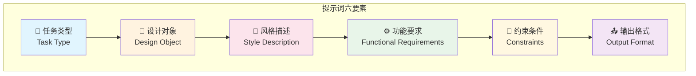
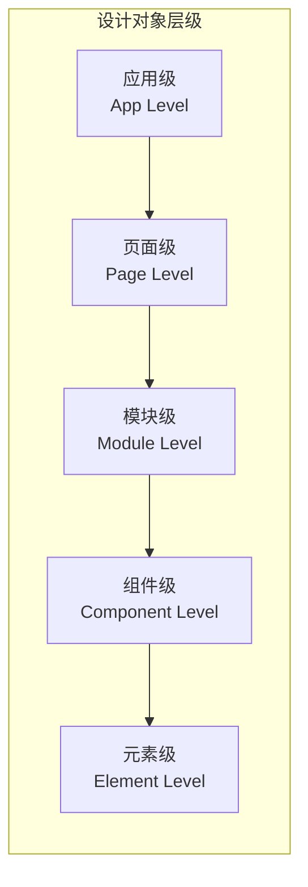
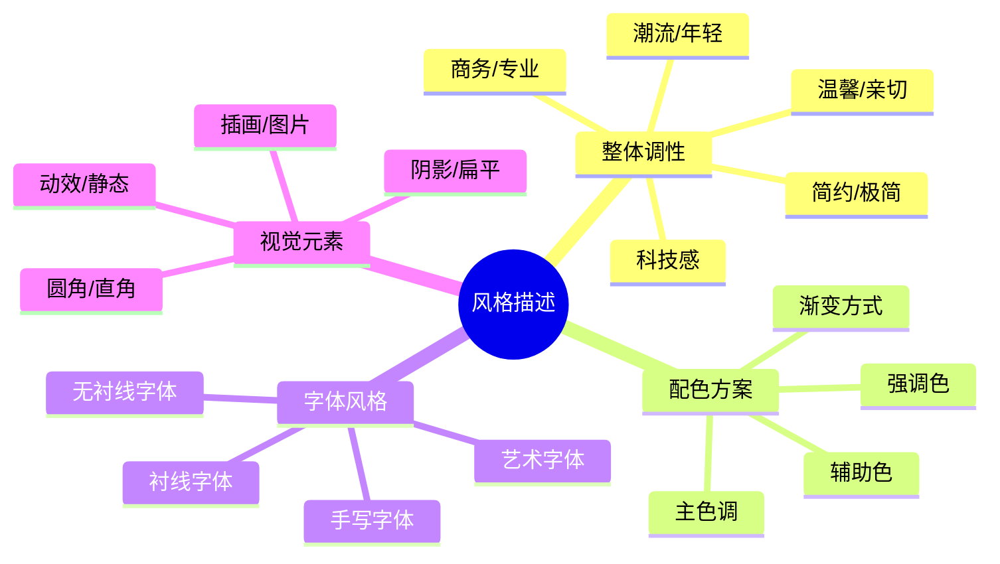
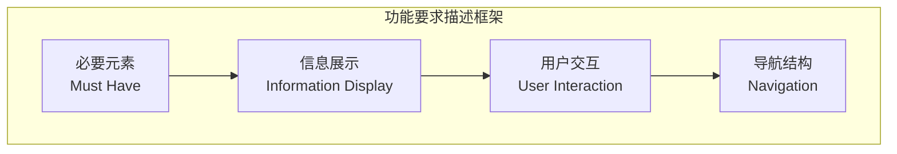
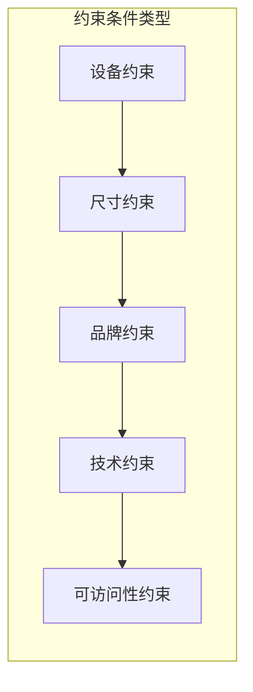

# 提示词基本结构

## 前言

提示词（Prompt）是与 AI 沟通的核心语言。无论是使用 Gemini、Midjourney 还是其他 AI 工具进行 UI 设计，掌握提示词的基本结构是获得高质量设计输出的第一步。

本文将详细解析 UI 设计提示词的六大核心要素，帮助你构建清晰、有效的 AI 沟通框架。

## 提示词的六要素模型

一个完整的 UI 设计提示词通常包含以下六个核心要素：



## 要素一：任务类型（Task Type）

### 什么是任务类型

任务类型明确告诉 AI **你希望它做什么**。这是提示词的起点，决定了 AI 的行动方向。

### 常见任务类型

| 任务类型 | 英文表达 | 适用场景 | 示例 |
|---------|---------|---------|------|
| **设计** | Design | 从零创建新界面 | "设计一个登录页面" |
| **生成** | Generate | 创建具体资源 | "生成一组图标" |
| **优化** | Optimize/Improve | 改进现有设计 | "优化这个按钮的视觉效果" |
| **分析** | Analyze | 评估设计方案 | "分析这个首页的用户体验问题" |
| **重构** | Redesign | 重新设计现有界面 | "重新设计这个旧版表单" |
| **转换** | Convert | 风格/平台转换 | "将 iOS 设计转换为 Android 风格" |

### 任务类型使用示例

```markdown
# 设计任务
请设计一个社交媒体应用的个人主页界面...

# 生成任务
请生成5种不同风格的导航栏设计方案...

# 优化任务
请优化以下表单设计，提升用户填写效率...

# 分析任务
请分析这个电商首页的信息架构是否合理...
```

### 最佳实践

1. **使用明确的动词**：避免模糊的表达如"帮我弄一个"，使用"设计"、"创建"、"优化"等具体动词
2. **任务范围要清晰**：明确是设计整个页面还是单个组件
3. **一次一个主要任务**：复杂任务可拆分为多个子任务依次执行

## 要素二：设计对象（Design Object）

### 什么是设计对象

设计对象明确 **要设计什么**，是提示词中的主体。

### 设计对象层级



| 层级 | 说明 | 示例 |
|-----|------|------|
| **应用级** | 整个应用的设计系统 | "一套完整的金融 App 设计" |
| **页面级** | 单个完整页面 | "登录页面"、"首页"、"个人中心" |
| **模块级** | 页面中的功能区域 | "商品推荐模块"、"用户评论区" |
| **组件级** | 可复用的UI组件 | "搜索框"、"商品卡片"、"标签页" |
| **元素级** | 最小设计单位 | "按钮"、"图标"、"输入框" |

### 设计对象描述技巧

#### 1. 明确所属平台

```markdown
❌ 设计一个登录页面
✅ 设计一个 iOS App 的登录页面
✅ 设计一个响应式 Web 的登录页面
```

#### 2. 说明业务场景

```markdown
❌ 设计一个首页
✅ 设计一个生鲜电商 App 的首页
✅ 设计一个在线教育平台的课程首页
```

#### 3. 指明用户群体

```markdown
❌ 设计一个健康管理应用
✅ 设计一个面向老年人的健康管理应用
✅ 设计一个面向健身爱好者的运动追踪应用
```

## 要素三：风格描述（Style Description）

### 什么是风格描述

风格描述定义设计的 **视觉调性和美学方向**，直接影响最终的设计呈现。

### 风格描述维度



### 风格关键词词库

| 风格类型 | 中文关键词 | 英文关键词 |
|---------|-----------|-----------|
| **简约风** | 极简、干净、留白、无装饰 | Minimal, Clean, Simple, Whitespace |
| **科技感** | 未来感、数字化、几何、渐变 | Tech, Futuristic, Digital, Gradient |
| **温馨风** | 温暖、柔和、亲切、舒适 | Warm, Cozy, Friendly, Soft |
| **商务风** | 专业、正式、稳重、可信 | Professional, Corporate, Formal |
| **年轻化** | 活力、动感、潮流、有趣 | Youthful, Vibrant, Playful, Energetic |
| **奢华风** | 高端、精致、优雅、品质 | Luxury, Premium, Elegant, Sophisticated |
| **复古风** | 怀旧、经典、复古、文艺 | Retro, Vintage, Classic, Nostalgic |
| **自然风** | 有机、清新、绿色、健康 | Organic, Fresh, Green, Natural |

### 风格描述示例

```markdown
【简约科技风】
整体风格：简约现代，科技感十足
配色方案：深蓝色（#0A1628）为主色，霓虹蓝（#00D9FF）为强调色
字体风格：细体无衬线字体，现代感
视觉元素：大量留白，几何线条装饰，微妙的渐变效果

【温馨亲子风】
整体风格：温暖亲切，活泼可爱
配色方案：奶油黄（#FFF8E7）为背景，珊瑚粉（#FF7F7F）为主色
字体风格：圆润的无衬线字体，亲和力强
视觉元素：圆角设计，可爱插画，柔和阴影
```

## 要素四：功能要求（Functional Requirements）

### 什么是功能要求

功能要求明确界面 **需要包含哪些交互元素和功能模块**。

### 功能要求描述框架



### 功能要求示例

```markdown
【登录页面功能要求】

必要元素：
- 品牌 Logo 和应用名称
- 登录表单区域
- 第三方登录入口
- 注册引导

信息展示：
- 欢迎语/品牌标语
- 用户协议和隐私政策链接
- 版本信息（可选）

用户交互：
- 手机号/邮箱输入框
- 密码输入框（带显示/隐藏切换）
- 「忘记密码」链接
- 「登录」主按钮
- 微信/支付宝/Apple 登录按钮

导航结构：
- 「返回」按钮（如从其他页面跳转）
- 「注册新账号」入口
```

### 功能描述的层次

| 层次 | 描述内容 | 示例 |
|-----|---------|------|
| **宏观功能** | 页面的主要功能目的 | "用户完成登录验证" |
| **模块功能** | 各区域的功能职责 | "表单区负责信息收集" |
| **组件功能** | 具体组件的交互行为 | "密码框支持明文/密文切换" |
| **状态功能** | 不同状态下的表现 | "登录按钮在表单未填完时置灰" |

## 要素五：约束条件（Constraints）

### 什么是约束条件

约束条件定义设计必须遵守的 **限制和规范**，确保设计符合实际需求。

### 常见约束类型



| 约束类型 | 具体内容 | 示例 |
|---------|---------|------|
| **设备约束** | 目标设备和平台 | iOS/Android/Web/平板 |
| **尺寸约束** | 画布大小和组件尺寸 | 375×812px、按钮高度44px |
| **品牌约束** | 品牌规范要求 | 使用品牌主色#FF6600、指定字体 |
| **技术约束** | 技术实现限制 | 需要支持暗色模式、图片压缩要求 |
| **可访问性约束** | 无障碍设计要求 | 对比度≥4.5:1、支持屏幕阅读器 |
| **性能约束** | 加载和渲染要求 | 首屏图片不超过3张、避免复杂动效 |

### 约束条件示例

```markdown
【设计约束条件】

设备约束：
- 主要设备：iPhone 14 Pro（iOS 16+）
- 需要同时考虑 iPhone SE 小屏适配

尺寸约束：
- 设计稿尺寸：390×844px（@2x）
- 安全区域：顶部59px，底部34px
- 最小点击区域：44×44px

品牌约束：
- 主色：品牌红 #E63946
- 辅助色：深灰 #1D3557、浅灰 #F1FAEE
- 字体：苹方-简（SF Pro 备选）
- Logo 最小尺寸：32px

技术约束：
- 需要提供深色模式设计稿
- 所有图标使用 SVG 格式
- 支持 Dynamic Type 字体缩放

可访问性约束：
- 文字与背景对比度 ≥ 4.5:1
- 重要操作需要有触觉反馈
- 色彩不能是传达信息的唯一方式
```

## 要素六：输出格式（Output Format）

### 什么是输出格式

输出格式指定 AI 应该以什么形式呈现设计结果。

### 常见输出格式

| 输出类型 | 适用场景 | 提示词示例 |
|---------|---------|-----------|
| **详细描述** | 概念探索、方案讨论 | "请详细描述设计方案的布局、颜色、字体选择" |
| **图像生成** | 视觉呈现、快速验证 | "请生成这个登录页面的 UI 设计图" |
| **代码实现** | 开发交付、原型制作 | "请提供 React 组件代码和 CSS 样式" |
| **设计规范** | 团队协作、设计系统 | "请输出完整的设计规范文档" |
| **对比方案** | 决策支持、多方案评估 | "请提供3个不同风格的设计方案对比" |

### 输出格式详细说明

#### 详细描述输出

```markdown
【输出要求】
请详细描述设计方案，包括：
1. 整体布局结构和各区域划分
2. 配色方案（具体色值）
3. 字体选择和字号规格
4. 关键组件的尺寸和间距
5. 交互状态说明
```

#### 代码实现输出

```markdown
【输出要求】
请生成完整的实现代码：
1. HTML 结构（语义化标签）
2. CSS 样式（使用 CSS 变量管理颜色）
3. 响应式断点处理
4. 基础交互效果（hover、active 状态）
```

#### 设计规范输出

```markdown
【输出要求】
请输出设计规范文档，包含：
1. 颜色系统（主色、辅助色、中性色、功能色）
2. 字体系统（字体家族、字号层级、行高）
3. 间距系统（基础单位、常用间距值）
4. 组件规范（按钮、输入框、卡片等）
5. 图标规范（尺寸、风格、使用场景）
```

## 六要素组合示例

下面是一个完整的六要素提示词示例：

```markdown
【任务类型】设计
【设计对象】一个美食分享 App 的「发布食谱」页面
【风格描述】
- 整体风格：温馨自然，清新美食感
- 配色方案：奶白色背景（#FFFEF7），橙色主色（#FF8C42），绿色点缀（#99C24D）
- 字体风格：圆润的无衬线字体，亲切感
- 视觉元素：柔和阴影，食物手绘插画装饰

【功能要求】
- 顶部导航：返回按钮、页面标题"发布食谱"、发布按钮
- 封面图上传区：支持拍照和相册选择
- 标题输入：单行文本，限制20字
- 食材输入：支持添加多个食材，每个包含名称和用量
- 步骤输入：支持添加多个步骤，每步可添加图片和文字描述
- 分类选择：早餐/午餐/晚餐/甜点/饮品
- 难度标签：简单/中等/困难
- 烹饪时间输入

【约束条件】
- 设备：iOS 移动端，iPhone 14（390×844px）
- 页面需要滚动，总高度不限
- 图片上传区显示 4:3 比例预览
- 需要考虑键盘弹出时的布局调整
- 表单验证提示使用 Toast 形式

【输出格式】
请提供：
1. 完整页面的布局描述和线框图说明
2. 关键组件的详细设计规格
3. 主要交互流程说明
```

## 总结

- **任务类型**：明确告诉 AI 你要做什么（设计/生成/优化/分析）
- **设计对象**：清晰定义要设计什么，包括平台、场景、用户
- **风格描述**：使用准确的风格关键词定义视觉调性
- **功能要求**：列出必要的功能元素和交互需求
- **约束条件**：设定设计必须遵守的限制和规范
- **输出格式**：指定期望的输出形式和详细程度

**建议**：可以练习拆解你常用的 UI 设计需求，用六要素框架重新组织描述，感受结构化思维带来的提升。