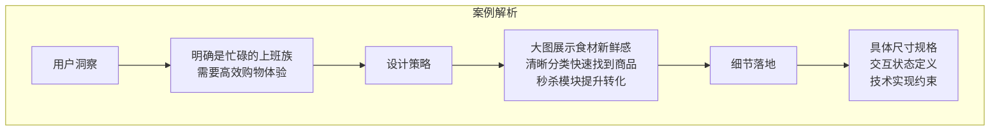
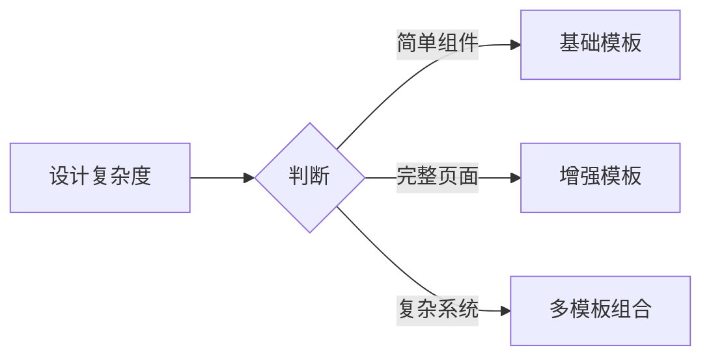

# 提示词模板与实战

## 前言

上一章我们学习了提示词的六要素结构，但在实际工作中，每次都从零开始构建提示词效率较低。本章将提供一套经过实战验证的**提示词模板库**，并通过详细的案例演示如何灵活运用这些模板。

## 通用提示词模板

### 基础模板 v1.0

```markdown
请为 [目标用户] 设计一个 [设计对象]，要求：

【风格】
- 整体风格：[风格描述]
- 配色方案：[颜色要求]
- 字体风格：[字体要求]

【功能】
- [功能点1]
- [功能点2]
- [功能点3]

【约束】
- 设备类型：[移动端/桌面端/响应式]
- 尺寸规格：[具体尺寸]
- 其他要求：[特殊要求]

【输出】
请生成 [输出类型]。
```

### 增强模板 v2.0

适用于更复杂的设计需求：

```markdown
## 设计任务
[动词] 一个 [设计对象]，用于 [业务场景]

## 目标用户
- 用户画像：[年龄、职业、习惯]
- 使用场景：[何时、何地、为何使用]
- 用户痛点：[需要解决的问题]

## 设计规格

### 视觉风格
- 品牌调性：[品牌关键词]
- 风格参考：[参考应用/网站]
- 设计原则：[核心设计理念]

### 配色方案
- 主色：[色值] - [使用场景]
- 辅助色：[色值] - [使用场景]
- 功能色：[成功/警告/错误/信息]
- 中性色：[背景/文字/边框]

### 字体规范
- 主字体：[字体名称]
- 标题：[字号/字重/行高]
- 正文：[字号/字重/行高]
- 辅助文字：[字号/字重/行高]

## 功能需求
### 核心功能
1. [功能描述] - [优先级]
2. [功能描述] - [优先级]

### 交互要求
- [交互描述]
- [状态说明]

## 技术约束
- 目标平台：[平台]
- 设计尺寸：[尺寸]
- 适配要求：[响应式/暗色模式等]
- 性能考量：[图片大小/动效复杂度]

## 输出要求
请提供：
1. [输出内容1]
2. [输出内容2]
```

## 场景化模板库

### 模板一：移动端页面设计

```markdown
## 📱 移动端页面设计模板

### 基本信息
- 页面名称：[页面名]
- 所属应用：[App名称] - [App类型]
- 目标平台：[iOS/Android/跨平台]

### 用户场景
[用户是谁]，在[什么情况下]，希望通过这个页面[完成什么目标]

### 页面结构
┌─────────────────────┐
│      状态栏          │
├─────────────────────┤
│      导航栏          │
│  [返回] [标题] [操作]  │
├─────────────────────┤
│                     │
│      内容区域        │
│    [详细描述]        │
│                     │
├─────────────────────┤
│      底部区域        │
│  [底部导航/操作栏]    │
└─────────────────────┘

### 视觉要求
- 风格：[风格关键词]
- 主色：[#XXXXXX]
- 背景：[#XXXXXX]
- 圆角：[Xpx]

### 组件清单
| 组件 | 规格 | 交互说明 |
|-----|------|---------|
| [组件名] | [尺寸/样式] | [点击/滑动行为] |

### 输出要求
- 生成 [宽度]×[高度] 的设计稿
- 包含 [亮色/暗色] 模式
- 标注关键尺寸和间距
```

### 模板二：Web 后台页面设计

```markdown
## 💻 Web 后台页面设计模板

### 页面信息
- 页面名称：[页面名]
- 页面类型：[列表页/详情页/表单页/数据看板]
- 用户角色：[管理员/运营/普通用户]

### 页面布局
┌──────────────────────────────────────────┐
│                 顶部导航                  │
├────────┬────────────────────────────────┤
│        │                                │
│        │                                │
│ 侧边栏  │          主内容区域             │
│        │                                │
│        │                                │
│        │                                │
└────────┴────────────────────────────────┘

### 功能模块
**顶部导航**
- Logo + 系统名称
- 全局搜索
- 消息通知
- 用户头像 + 下拉菜单

**侧边栏**
- 菜单分组
- 当前位置高亮
- 支持折叠

**主内容区**
- [具体内容描述]

### 设计规范
- 设计系统：[Ant Design/Element/自定义]
- 布局宽度：侧边栏 [240px]，内容区自适应
- 内容区内边距：[24px]
- 卡片间距：[16px]

### 数据展示
| 数据类型 | 展示方式 | 说明 |
|---------|---------|------|
| [数据名] | [表格/卡片/图表] | [补充说明] |

### 输出
- 设计稿尺寸：1440×900（可滚动）
- 关键交互状态
- 响应式断点方案
```

### 模板三：组件设计模板

```markdown
## 🧩 UI 组件设计模板

### 组件信息
- 组件名称：[组件名]
- 组件类型：[按钮/输入框/卡片/导航...]
- 使用场景：[在哪些页面/模块使用]

### 组件变体
| 变体 | 说明 | 使用场景 |
|-----|------|---------|
| [变体1] | [描述] | [何时使用] |
| [变体2] | [描述] | [何时使用] |

### 尺寸规格
| 尺寸 | 高度 | 内边距 | 字号 | 使用场景 |
|-----|------|-------|------|---------|
| Small | [Xpx] | [X Y] | [Xpx] | [场景] |
| Medium | [Xpx] | [X Y] | [Xpx] | [场景] |
| Large | [Xpx] | [X Y] | [Xpx] | [场景] |

### 状态设计
请设计以下状态：
- [ ] Default 默认状态
- [ ] Hover 悬停状态
- [ ] Active/Pressed 按下状态
- [ ] Focused 聚焦状态
- [ ] Disabled 禁用状态
- [ ] Loading 加载状态
- [ ] Error 错误状态
- [ ] Success 成功状态

### 颜色方案
- Primary：[#XXXXXX]
- Secondary：[#XXXXXX]
- Danger：[#XXXXXX]
- 各状态颜色变化规则：[亮度/透明度变化]

### 交互说明
- 点击效果：[描述]
- 动画时长：[Xms]
- 缓动函数：[ease-out/ease-in-out]

### 输出要求
- 所有变体 × 所有尺寸 × 所有状态的组合
- 组件规格说明
- CSS/代码实现（可选）
```

## 实战案例详解

### 案例一：电商首页设计

#### 设计需求

为一个生鲜电商 App 设计首页

#### 完整提示词

```markdown
## 设计任务
设计一个生鲜电商 App 的首页，帮助用户快速发现新鲜食材并完成购买

## 目标用户
- 用户画像：25-45岁的城市白领，注重生活品质，时间紧张
- 使用场景：通勤路上、午休时间、晚上在家，想要购买新鲜食材
- 用户痛点：
  - 没时间逛菜市场
  - 担心食材不新鲜
  - 需要快速找到想买的东西

## 设计规格

### 视觉风格
- 品牌调性：新鲜、自然、值得信赖
- 风格参考：叮咚买菜的清爽感 + 盒马的品质感
- 设计原则：
  - 突出食材的新鲜感（大图、高饱和度）
  - 清晰的信息层级
  - 高效的浏览体验

### 配色方案
- 主色：鲜活绿 #00B578 - 体现新鲜、健康
- 辅助色：暖阳橙 #FF8F1F - 促销、优惠标签
- 功能色：
  - 成功：#00B578
  - 警告：#FF8F1F
  - 错误：#FF3B30
  - 信息：#007AFF
- 背景色：#F5F6F7（浅灰）
- 卡片背景：#FFFFFF

### 字体规范
- 主字体：苹方-简
- 大标题：24px/Bold/32px行高
- 模块标题：18px/Medium/26px行高
- 正文：14px/Regular/22px行高
- 辅助文字：12px/Regular/18px行高

## 功能需求

### 页面结构（从上到下）

**1. 顶部区域**
- 定位信息（当前收货地址，可点击切换）
- 搜索框（带语音搜索图标）
- 消息图标（带红点提示）

**2. Banner 轮播区**
- 宽度占满屏幕
- 高度 160px
- 3-5张轮播图
- 圆点指示器

**3. 快捷分类入口**
- 横向滚动，一行展示
- 10个分类图标：蔬菜、水果、肉禽蛋、海鲜水产、乳品冷饮、粮油调味、酒水饮料、休闲零食、个护清洁、鲜花绿植
- 每个图标：48×48px，下方文字标签

**4. 限时秒杀模块**
- 标题栏：模块标题 + 倒计时 + "更多"入口
- 横向滚动商品列表
- 每个商品卡片：
  - 商品图 80×80px
  - 商品名（单行，超出省略）
  - 秒杀价（红色，大字号）
  - 原价（灰色，删除线）
  - 进度条（已抢 XX%）

**5. 品质专区**
- 2×2 网格布局
- 四个专区：有机蔬菜、进口水果、黑猪肉、活鲜海鲜
- 每个卡片：图标 + 标题 + 副标题

**6. 猜你喜欢**
- 瀑布流布局，2列
- 商品卡片内容：
  - 商品主图（1:1）
  - 商品标题（2行，超出省略）
  - 标签（新品/包邮/满减）
  - 价格信息
  - 已售数量
  - 加入购物车按钮

**7. 底部标签栏**
- 5个标签：首页、分类、购物车（带数量角标）、订单、我的
- 当前页高亮显示

### 交互要求
- 下拉刷新：自定义loading动画
- Banner 自动轮播：3秒切换
- 商品卡片点击：跳转商品详情
- 加购按钮：点击有加入动画

## 技术约束
- 目标平台：iOS（iPhone 14）
- 设计尺寸：390×844px（@2x 输出）
- 首屏高度控制在 844px 内
- 需要提供暗色模式方案

## 输出要求
请提供：
1. 完整首页设计的详细布局描述
2. 各模块的具体设计规格（尺寸、间距、颜色）
3. 关键组件的交互状态说明
4. 配色方案的具体色值表
```

#### 核心要点解析



### 案例二：社交 App 登录页

#### 完整提示词

```markdown
## 设计任务
设计一个面向年轻用户（18-30岁）的社交 App 登录页面

## 用户场景
年轻用户下载 App 后首次打开，或退出登录后重新登录

## 设计规格

### 视觉风格
- 品牌调性：年轻、活力、有趣、潮流
- 风格参考：小红书的活力感 + Soul 的设计感
- 设计原则：
  - 简洁不简单，有设计细节
  - 色彩大胆但不刺眼
  - 给用户轻松愉快的感觉

### 配色方案
- 主渐变色：#667eea → #764ba2（渐变角度 135°）
- 背景色：可以是纯色或带纹理的背景
- 按钮色：主渐变色
- 文字色：
  - 主要文字：#1A1A1A
  - 次要文字：#666666
  - 占位符文字：#999999
  - 链接文字：#667eea

### 页面结构
┌────────────────────────┐
│                        │
│    品牌 Logo + 标语     │
│    (顶部 1/4 区域)      │
│                        │
├────────────────────────┤
│                        │
│    登录表单区域         │
│    - 手机号/邮箱输入    │
│    - 密码输入          │
│    - 忘记密码链接       │
│    - 登录按钮          │
│                        │
├────────────────────────┤
│    第三方登录          │
│    微信 | QQ | Apple   │
├────────────────────────┤
│    注册引导            │
│    还没有账号？立即注册  │
│                        │
│    用户协议 & 隐私政策   │
└────────────────────────┘

### 组件详细设计

**1. 品牌区域**
- Logo 尺寸：64×64px
- App 名称：24px 粗体
- 品牌标语：14px，渐变色或次要文字色

**2. 输入框**
- 高度：52px
- 圆角：12px
- 边框：1px solid #E5E5E5
- 聚焦边框：2px solid #667eea
- 内边距：16px
- 图标：左侧 20×20px
- 密码可见切换：右侧眼睛图标

**3. 登录按钮**
- 高度：52px
- 圆角：12px（或 26px 全圆角）
- 背景：主渐变色
- 文字：16px 粗体白色
- 禁用态：透明度 50%
- 按压态：亮度降低 10%

**4. 第三方登录**
- 分割线样式："或使用以下方式登录"
- 图标尺寸：44×44px
- 图标间距：32px
- 图标背景：浅灰圆形底

**5. 底部链接**
- 文字：12px
- 协议链接可点击，主题色

### 交互状态
| 元素 | 默认 | 聚焦 | 错误 | 禁用 |
|-----|------|------|------|------|
| 输入框 | 灰色边框 | 主题色边框 | 红色边框+提示 | 灰色背景 |
| 按钮 | 渐变色 | - | - | 50%透明度 |
| 链接 | 主题色 | 下划线 | - | - |

## 约束条件
- 设备：iPhone X（375×812px）
- 安全区域：顶部 44px，底部 34px
- 键盘弹出时表单区域需要上移

## 输出要求
1. 完整登录页的视觉设计描述
2. 各组件的详细规格
3. 亮色模式和暗色模式的配色方案
4. 表单验证的错误状态展示
```

### 案例三：数据看板设计

#### 完整提示词

```markdown
## 设计任务
设计一个电商运营数据看板页面，帮助运营人员快速了解店铺经营状况

## 目标用户
- 电商运营人员
- 需要每天查看核心经营指标
- 关注数据变化趋势和异常

## 设计规格

### 视觉风格
- 品牌调性：专业、高效、数据驱动
- 风格参考：Ant Design Pro 的简洁专业感
- 设计原则：
  - 数据可读性第一
  - 信息密度适中
  - 重要指标突出显示

### 配色方案
- 主色：#1890FF（蓝色，专业可信）
- 辅助色：
  - 成功/增长：#52C41A
  - 警告/注意：#FAAD14
  - 错误/下降：#FF4D4F
- 背景色：#F0F2F5
- 卡片背景：#FFFFFF
- 文字色：
  - 标题：#262626
  - 正文：#595959
  - 辅助：#8C8C8C

### 页面布局
┌─────────────────────────────────────────────────┐
│ Logo    [日期选择器]  [对比周期]     🔔  👤      │
├─────────────────────────────────────────────────┤
│ 核心指标卡片区域（4列）                          │
│ ┌──────┐ ┌──────┐ ┌──────┐ ┌──────┐          │
│ │ 销售额 │ │ 订单数 │ │ 客单价 │ │ 转化率 │          │
│ │ ¥128万│ │ 3,256 │ │ ¥393 │ │ 4.2% │          │
│ │ ↑12%  │ │ ↑8%   │ │ ↑3%  │ │ ↓0.2%│          │
│ └──────┘ └──────┘ └──────┘ └──────┘          │
├─────────────────────────────────────────────────┤
│ ┌────────────────────┐ ┌────────────────────┐  │
│ │    销售趋势图       │ │    品类占比        │  │
│ │    (折线图)        │ │    (饼图)         │  │
│ │                    │ │                    │  │
│ └────────────────────┘ └────────────────────┘  │
├─────────────────────────────────────────────────┤
│ ┌────────────────────┐ ┌────────────────────┐  │
│ │   商品销售排行      │ │    实时订单        │  │
│ │   (表格)          │ │    (列表)         │  │
│ │                    │ │                    │  │
│ └────────────────────┘ └────────────────────┘  │
└─────────────────────────────────────────────────┘

### 组件设计

**1. 核心指标卡片**
- 卡片尺寸：宽度自适应（1/4 - 间距），高度 120px
- 内边距：20px
- 内容：
  - 指标名称：14px，#8C8C8C
  - 数值：32px，#262626，粗体
  - 同比变化：14px，增长绿色↑/下降红色↓
  - 迷你趋势图（可选）

**2. 图表卡片**
- 卡片圆角：8px
- 内边距：24px
- 标题区：标题 + 时间筛选 + 更多操作
- 图表区：根据数据类型使用合适的图表

**3. 数据表格**
- 表头：背景 #FAFAFA，文字 #8C8C8C
- 表格行：高度 54px
- 斑马纹：奇数行 #FFFFFF，偶数行 #FAFAFA
- 悬停效果：背景 #E6F7FF

### 数据规格
| 图表类型 | 使用场景 | 设计要点 |
|---------|---------|---------|
| 折线图 | 趋势变化 | 面积填充，多线对比 |
| 柱状图 | 数量对比 | 圆角柱，渐变色 |
| 饼图/环形图 | 占比分析 | 显示百分比，可交互 |
| 表格 | 明细数据 | 支持排序，分页 |

### 交互设计
- 日期选择：支持快捷选项（今日/昨日/近7天/近30天/自定义）
- 指标卡片：点击跳转详情页
- 图表：hover 显示详细数据
- 表格：支持列排序，点击行展开详情

## 约束条件
- 设计尺寸：1440×900px（最小宽度 1200px）
- 需要考虑不同分辨率下的响应式布局
- 数据更新频率：核心指标实时，图表 5 分钟刷新

## 输出要求
1. 完整页面布局设计
2. 各类图表的设计规范
3. 空状态和加载状态设计
4. 响应式适配方案
```

## 模板使用技巧

### 技巧一：根据需求精简模板

不是每次都需要使用完整模板，根据设计复杂度选择：



### 技巧二：建立个人模板库

```markdown
📁 我的提示词模板库
├── 📄 通用模板
│   ├── 基础模板.md
│   └── 增强模板.md
├── 📄 页面模板
│   ├── 移动端页面.md
│   ├── Web页面.md
│   └── 后台页面.md
├── 📄 组件模板
│   ├── 按钮组件.md
│   ├── 表单组件.md
│   └── 卡片组件.md
└── 📄 场景模板
    ├── 电商类.md
    ├── 社交类.md
    └── 工具类.md
```

### 技巧三：模板变量化

将模板中的可变部分用占位符标记：

```markdown
请为 {{TARGET_USER}} 设计一个 {{DESIGN_OBJECT}}

【风格】{{STYLE_DESCRIPTION}}
【主色】{{PRIMARY_COLOR}}
【尺寸】{{DESIGN_SIZE}}
```

使用时快速替换变量即可。

## 总结

- **模板是效率工具**：好的模板能大幅提升提示词编写效率
- **模板要灵活运用**：根据实际需求裁剪或扩展模板
- **建立个人模板库**：收集、优化、积累适合自己的模板
- **实战是最好的学习**：多练习，在实践中完善模板


