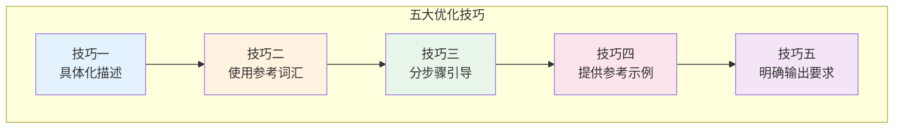
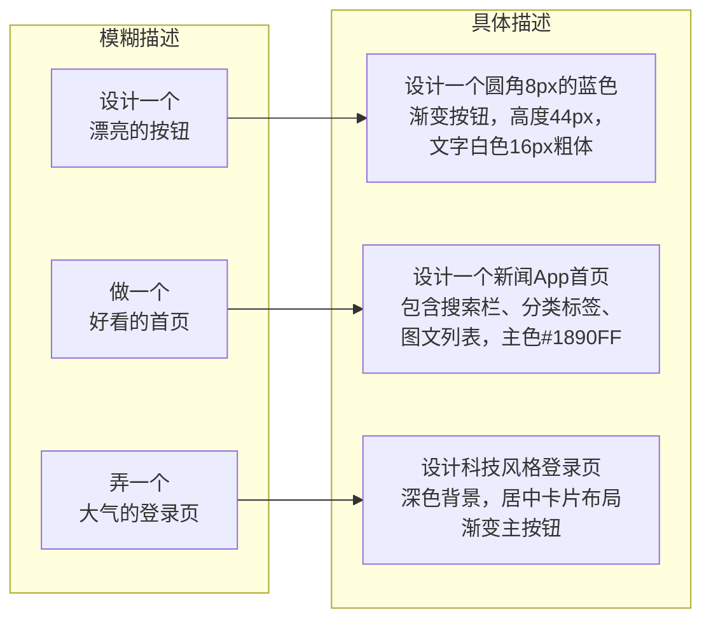
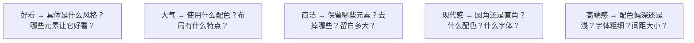
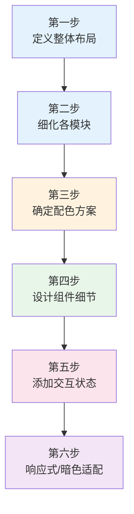
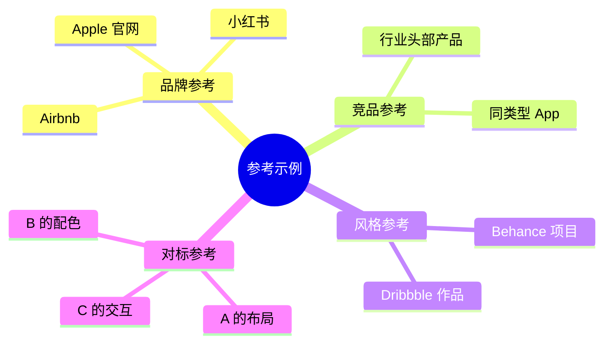
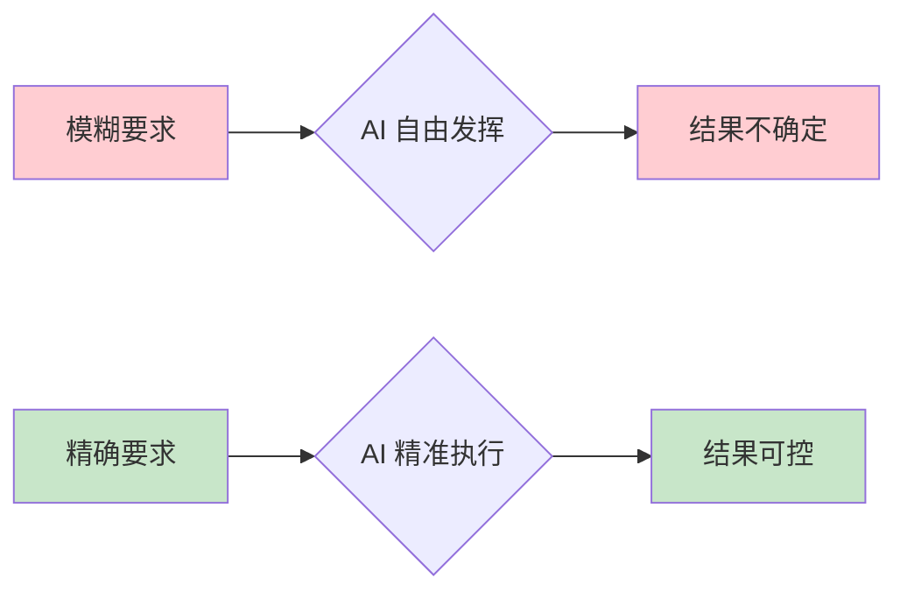

# 提示词优化技巧

## 前言

即使掌握了提示词的基本结构和模板，不同的表达方式仍会带来截然不同的设计结果。本章将深入讲解五大核心优化技巧，帮助你写出更精准、更高效的提示词。

## 优化技巧总览



## 技巧一：具体化描述

### 核心原则

用**精确的数值和明确的描述**替代模糊的形容词。

### 模糊 vs 具体对比



### 具体化维度清单

| 维度 | 模糊表达 | 具体表达 |
|-----|---------|---------|
| **尺寸** | "大一点的按钮" | "高度 52px，宽度占满屏幕宽度减去 32px 边距" |
| **颜色** | "蓝色" | "主蓝 #1890FF，悬停 #40A9FF，按压 #096DD9" |
| **间距** | "适当的间距" | "元素间距 16px，模块间距 24px，页边距 20px" |
| **圆角** | "圆润的效果" | "圆角 12px" 或 "全圆角（高度的一半）" |
| **字体** | "大标题" | "28px，字重 600，行高 40px" |
| **阴影** | "有点阴影" | "0 4px 12px rgba(0,0,0,0.08)" |
| **动效** | "有动画效果" | "300ms ease-out 过渡" |

### 实战示例

#### ❌ 模糊的描述

```markdown
设计一个好看的首页，要有搜索功能和一些商品展示。
```

#### ✅ 具体的描述

```markdown
设计一个电商 App 首页，具体要求如下：

## 搜索区域（顶部固定）
- 背景：白色，高度 56px
- 搜索框：
  - 背景：#F5F5F5
  - 高度：36px
  - 圆角：18px（全圆角）
  - 左侧：搜索图标 20×20px，灰色 #999
  - 占位文字："搜索商品"，14px，#999

## 分类导航（搜索下方）
- 布局：横向滚动，一行展示
- 每个分类项：
  - 图标：40×40px
  - 文字：12px，#333，图标下方 4px
  - 项间距：24px
  - 首尾边距：16px

## 商品列表
- 布局：2 列瀑布流
- 卡片间距：横向 8px，纵向 12px
- 商品卡片：
  - 宽度：(屏幕宽度 - 16×2 - 8) / 2
  - 图片：1:1 比例，圆角 8px
  - 标题：14px，#333，最多 2 行
  - 价格：18px，#FF4D4F，粗体
  - 卡片背景：白色
  - 卡片圆角：12px
  - 卡片阴影：0 2px 8px rgba(0,0,0,0.06)
```

### 具体化思维训练

当你想用模糊词汇时，问自己以下问题：



## 技巧二：使用参考词汇

### 为什么需要参考词汇

AI 对特定的设计术语有更好的理解，使用专业词汇能获得更精准的结果。

### 设计风格词汇库

#### 整体风格

| 中文描述 | 英文关键词 | 视觉特征 |
|---------|-----------|---------|
| 极简风 | Minimal, Minimalist | 大量留白，少装饰，单色或双色 |
| 扁平化 | Flat Design | 无阴影，纯色，几何形状 |
| 拟物化 | Skeuomorphic | 模拟真实材质，阴影，高光 |
| 玻璃拟态 | Glassmorphism | 毛玻璃效果，透明度，模糊 |
| 新拟态 | Neumorphism | 柔和阴影，凸起/凹陷效果 |
| 暗色主题 | Dark Mode | 深色背景，降低亮度，护眼 |
| 渐变风 | Gradient | 颜色过渡，流动感 |
| 3D 风格 | 3D, Isometric | 立体元素，等距视角 |
| 插画风 | Illustrated | 手绘插图，个性化 |
| 数据可视化 | Data-driven | 图表，信息图形 |

#### 情绪调性

| 调性 | 关键词 | 设计特征 |
|-----|-------|---------|
| 专业严肃 | Professional, Corporate, Formal | 深色调，无衬线字体，规整布局 |
| 活泼年轻 | Playful, Youthful, Vibrant | 高饱和度，圆润形状，活泼配色 |
| 温馨舒适 | Warm, Cozy, Friendly | 暖色调，柔和阴影，亲切感 |
| 科技未来 | Futuristic, Tech, Digital | 蓝紫色调，几何线条，渐变 |
| 奢华高端 | Luxury, Premium, Elegant | 金色/深色，精致细节，留白 |
| 清新自然 | Fresh, Natural, Organic | 绿色系，有机形状，自然元素 |

### 配色词汇参考

```markdown
## 常用配色方案表达

### 单色系
- Monochromatic：单色深浅变化
- 例：不同深浅的蓝色

### 互补色
- Complementary：色轮对面的颜色
- 例：蓝色 + 橙色

### 类似色
- Analogous：色轮相邻的颜色
- 例：蓝色 + 青色 + 绿色

### 三色系
- Triadic：色轮上等距的三种颜色
- 例：红 + 黄 + 蓝

### 常用表达
- "使用蓝紫渐变作为主色调"
- "采用互补色配色增强视觉冲击"
- "以中性灰为主，橙色作为强调色"
- "高对比度的深色主题配色"
```

### 使用参考词汇的示例

```markdown
## 风格描述示例

### 示例 1：科技感设计
设计风格：Futuristic + Minimal
- 使用深蓝渐变背景（#0A1628 → #1A365D）
- 霓虹蓝作为强调色（#00D9FF）
- 几何线条装饰
- 无衬线字体，字重偏细
- 微妙的玻璃拟态卡片效果

### 示例 2：温馨电商

设计风格：Warm + Friendly + Clean
- 奶白色背景（#FFFEF7）
- 暖橙色主色（#FF8C42）
- 圆润的组件形状
- 柔和的阴影效果
- 手绘风格小图标点缀

### 示例 3：专业后台
设计风格：Professional + Data-driven
- 参考 Ant Design 设计系统
- 中性灰色调为主
- 蓝色作为主操作色
- 清晰的信息层级
- 注重数据可读性
```

## 技巧三：分步骤引导

### 为什么需要分步骤

复杂的设计任务一次性描述容易遗漏细节，分步骤引导能让 AI 更好地理解每个环节。

### 分步骤流程



### 分步提示词实战

#### 第一步：定义整体布局

```markdown
【第一步】整体布局规划

我要设计一个电商 App 的商品详情页。

请先帮我规划整体布局结构：
1. 页面分为哪几个主要区域？
2. 各区域的大致比例和位置？
3. 哪些元素需要固定（悬浮）？
4. 页面的滚动行为是怎样的？

请用文字描述或简单的结构图说明。
```

#### 第二步：细化模块

```markdown
【第二步】模块细化

基于第一步的布局，现在请详细设计「商品图片区」：

- 图片展示方式（轮播/网格/其他）
- 图片尺寸和比例
- 指示器样式和位置
- 图片预览交互
- 视频播放按钮（如果有视频）
```

#### 第三步：确定配色

```markdown
【第三步】配色方案

现在请为这个商品详情页设计配色方案：

品牌调性：年轻时尚的潮流电商

请提供：
1. 主色：用于主要按钮、重点信息
2. 辅助色：用于次要操作、装饰元素
3. 功能色：成功/警告/错误/信息
4. 中性色：背景/文字/分割线/边框

每个颜色请给出具体色值（HEX）。
```

#### 第四步：组件细节

```markdown
【第四步】核心组件设计

请详细设计「立即购买」和「加入购物车」按钮：

需要定义：
- 按钮布局（并排/上下）
- 尺寸（高度、宽度、圆角）
- 颜色（背景、文字、边框）
- 图标（如果有）
- 各状态效果（默认、按压、禁用）
```

#### 第五步：交互状态

```markdown
【第五步】交互状态设计

请为商品详情页设计以下交互状态：

1. 图片轮播：
   - 自动播放设置
   - 手势操作反馈
   - 全屏预览效果

2. 规格选择：
   - 选中/未选中状态
   - 不可选（无货）状态
   - 已选规格的展示

3. 数量选择：
   - 加减按钮状态
   - 最小/最大限制提示

4. 页面滚动：
   - 顶部导航变化
   - 底部操作栏吸底
```

#### 第六步：适配方案

```markdown
【第六步】适配方案

最后，请提供：

1. 暗色模式适配：
   - 背景色调整
   - 文字颜色调整
   - 图片处理方式
   - 边框/分割线处理

2. 小屏适配（iPhone SE）：
   - 哪些元素需要调整
   - 字号/间距变化
   - 布局调整方案
```

### 分步引导的优势

| 优势 | 说明 |
|-----|------|
| **思路清晰** | 每一步都有明确目标，不会混乱 |
| **易于修正** | 发现问题可以针对特定步骤调整 |
| **减少遗漏** | 系统性覆盖各个设计环节 |
| **便于复用** | 每个步骤的输出可以独立保存 |

## 技巧四：提供参考示例

### 参考示例的类型



### 使用品牌参考

```markdown
## 示例：品牌参考

请参考 Apple 官网的设计风格，设计一个产品展示页面：

**借鉴要素：**
- 大图背景的视觉冲击力
- 极简的文字排版
- 充足的留白空间
- 突出的 CTA 按钮
- 流畅的滚动动效

**不需要借鉴的：**
- 具体的颜色（使用我们的品牌色）
- 产品拍摄角度
- 具体的文案内容
```

### 使用竞品对比

```markdown
## 示例：竞品对比参考

设计一个短视频 App 的首页，参考以下竞品的优点：

| 参考对象 | 借鉴要素 | 不借鉴的 |
|---------|---------|---------|
| **抖音** | 全屏沉浸式播放体验 | 底部导航位置 |
| **小红书** | 双列瀑布流布局 | 搜索框样式 |
| **B站** | 视频标签分类系统 | 顶部 Tab 设计 |

结合以上优点，设计一个具有差异化的首页方案。
```

### 使用对比说明

```markdown
## 示例：对比说明

设计一个阅读类 App 的阅读页面：

**风格要求：**
- ✅ 类似：微信读书的简洁感、Kindle 的专注阅读体验
- ✅ 借鉴：安静的配色、舒适的字体、清晰的进度显示
- ❌ 避免：过多的装饰元素、花哨的字体、复杂的手势操作
- ❌ 不要：弹窗打断、强制社交功能入口

**核心体验目标：让用户专注于内容本身**
```

### 参考示例的注意事项

```markdown
## 使用参考示例的最佳实践

1. **说明借鉴的具体方面**
   - ❌ "参考抖音设计"
   - ✅ "参考抖音的全屏沉浸式播放和双击点赞交互"

2. **说明不借鉴的方面**
   - 避免产生版权问题
   - 保持品牌差异化

3. **多个参考取长补短**
   - 结合不同产品的优点
   - 明确各自借鉴什么

4. **提供视觉参考（如果可能）**
   - 截图或链接
   - 标注重点区域
```

## 技巧五：明确输出要求

### 输出类型详解

| 输出类型 | 适用场景 | 详细说明 |
|---------|---------|---------|
| **文字描述** | 概念探索、方案讨论 | 布局、颜色、字体的文字说明 |
| **结构图** | 布局规划、信息架构 | 页面结构的可视化表示 |
| **设计稿** | 视觉呈现、评审沟通 | 完整的 UI 设计图 |
| **设计规范** | 团队协作、开发对接 | 详细的设计系统文档 |
| **代码实现** | 开发阶段、原型制作 | HTML/CSS/组件代码 |
| **对比方案** | 决策支持、多方案评估 | 多个方案的对比分析 |

### 输出要求模板

#### 文字描述输出

```markdown
【输出要求：文字描述】

请详细描述设计方案，包括：

1. **整体布局**
   - 页面结构划分
   - 各区域位置和比例
   - 主要内容流向

2. **视觉设计**
   - 配色方案（具体色值）
   - 字体选择（字体名称、字号、字重）
   - 组件样式（圆角、阴影、边框）

3. **关键组件**
   - 组件功能说明
   - 尺寸规格
   - 交互状态

4. **特殊处理**
   - 边界情况处理
   - 异常状态设计
   - 适配方案
```

#### 设计规范输出

```markdown
【输出要求：设计规范】

请输出完整的设计规范文档，包含：

## 1. 颜色系统
- 品牌色（主色、辅助色）
- 功能色（成功、警告、错误、信息）
- 中性色（背景、文字、边框、分割线）
- 颜色使用指南

## 2. 字体系统
- 字体家族
- 字号层级（H1-H6、正文、辅助）
- 行高规范
- 字重使用

## 3. 间距系统
- 基础间距单位
- 组件内间距
- 组件间间距
- 页面边距

## 4. 组件规范
每个组件包含：
- 组件名称和用途
- 所有变体
- 所有尺寸
- 所有状态
- 使用示例
- 注意事项
```

#### 代码实现输出

```markdown
【输出要求：代码实现】

请生成实现代码，要求：

## 技术栈
- 框架：React + TypeScript
- 样式：Tailwind CSS（或 CSS Modules）
- 组件库：可选使用 XXX

## 代码要求
- 组件化设计，可复用
- 类型定义完整
- 注释清晰
- 遵循最佳实践

## 输出内容
1. 组件代码（.tsx）
2. 样式代码（.css/.scss/.module.css）
3. 类型定义（.types.ts）
4. 使用示例

## 代码规范
- 缩进：2 空格
- 命名：camelCase 变量，PascalCase 组件
- 文件结构：按功能组织
```

#### 多方案对比输出

```markdown
【输出要求：多方案对比】

请提供 3 个不同风格的设计方案，每个方案包含：

## 方案概述
- 方案名称
- 设计理念
- 适用场景

## 方案详情
- 布局结构图
- 配色方案
- 关键组件设计
- 风格预览

## 方案对比

| 对比维度 | 方案 A | 方案 B | 方案 C |
|---------|-------|-------|-------|
| 视觉风格 | | | |
| 信息密度 | | | |
| 用户体验 | | | |
| 开发难度 | | | |
| 品牌契合度 | | | |

## 建议选择
基于 [具体原因]，建议选择方案 X
```

### 输出要求的精确度



**对比示例：**

```markdown
❌ 模糊的输出要求：
"请生成设计稿"

✅ 精确的输出要求：
"请生成设计稿，要求：
- 尺寸：390×844px（iPhone 14）
- 格式：提供亮色和暗色两个版本
- 标注：关键元素标注尺寸和颜色值
- 交互：展示默认态、悬停态、按压态
- 说明：附带设计决策说明"
```

## 综合实战：优化技巧组合应用

### 优化前的提示词

```markdown
设计一个社交 App 的发布页面，要好看，功能完整。
```

### 优化后的提示词

```markdown
## 设计任务
设计一个面向年轻用户（18-28岁）的图片社交 App 发布页面

## 设计参考
- 参考小红书的发布流程和清新感
- 参考 Instagram 的图片编辑体验
- 避免过于复杂的操作步骤

## 设计规格

### 视觉风格
- 风格关键词：Fresh, Clean, Youthful
- 整体感觉：轻松愉快，激发分享欲
- 圆角使用：12px 统一圆角

### 配色方案
- 主色：活力橙 #FF6B35 - CTA 按钮、重点元素
- 背景色：纯白 #FFFFFF
- 辅助背景：浅灰 #F8F9FA
- 文字颜色：
  - 主要：#1A1A1A
  - 次要：#666666
  - 占位符：#BFBFBF

### 页面结构
┌────────────────────┐
│ [×] 发布        [发布] │  ← 导航栏
├────────────────────┤
│   [图片编辑区域]      │  ← 图片预览/编辑
│   支持滤镜、裁剪     │
├────────────────────┤
│   [添加描述...]      │  ← 文字输入
│   @ 好友  # 话题    │
├────────────────────┤
│   [📍 添加位置]      │  ← 位置选择
│   [🏷 添加话题]      │  ← 话题添加
│   [👥 @好友]        │  ← @ 功能
├────────────────────┤
│   [🔒 隐私设置]      │  ← 可见范围
└────────────────────┘

## 分步设计

### 第一步：图片编辑区
- 预览图尺寸：宽度 100%，高度自适应
- 多图时显示轮播指示器
- 右下角：滤镜、编辑入口图标

### 第二步：文字输入区
- 输入框高度：自适应，最小 100px，最大 200px
- 占位符文案："分享你的精彩瞬间..."
- 字数限制：最多 1000 字，右下角显示剩余字数

### 第三步：功能入口
- 列表项高度：52px
- 左侧图标：24×24px，主色
- 右侧箭头：灰色 #BFBFBF

### 第四步：交互状态
- 发布按钮：内容为空时禁用（灰色）
- 图片上传：显示进度条
- 输入超限：文字变红提示

## 输出要求

请提供：
1. 完整页面布局的详细描述
2. 各组件的规格说明（尺寸、颜色、字号）
3. 关键交互流程说明
4. 异常状态处理方案
```

## 总结

| 技巧 | 核心要点 | 效果 |
|-----|---------|------|
| **具体化描述** | 用数值替代形容词 | 结果精准可控 |
| **参考词汇** | 使用专业设计术语 | AI 理解更准确 |
| **分步引导** | 复杂任务逐步拆解 | 避免遗漏，便于调整 |
| **提供参考** | 明确借鉴和避免点 | 方向明确，有的放矢 |
| **输出要求** | 指定格式和详细程度 | 输出符合预期 |
