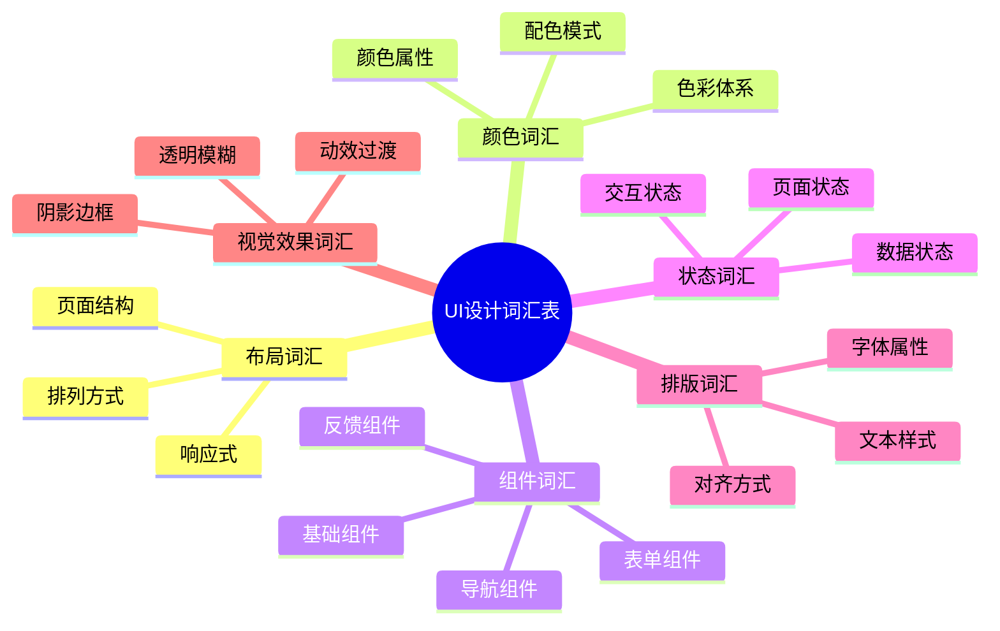

# UI 设计词汇表

## 前言

在与 AI 沟通 UI 设计需求时，使用准确的设计术语能显著提升沟通效率和结果质量。本章整理了 UI 设计中常用的专业词汇，涵盖布局、颜色、组件、状态、交互等多个维度，是你的提示词工具箱。

## 词汇表结构



## 一、布局词汇（Layout）

### 页面结构

| 中文 | 英文 | 说明 | 使用场景 |
|-----|------|------|---------|
| 页眉 | Header | 页面顶部区域 | "Header 高度 56px，背景白色" |
| 页脚 | Footer | 页面底部区域 | "Footer 固定在底部" |
| 侧边栏 | Sidebar | 页面侧边导航区 | "左侧 Sidebar 宽度 240px" |
| 内容区 | Content Area | 主要内容展示区 | "Content Area 自适应宽度" |
| 导航栏 | Navigation Bar / Navbar | 导航链接区域 | "顶部 Navbar 吸顶显示" |
| 工具栏 | Toolbar | 工具按钮区域 | "Toolbar 包含编辑操作按钮" |
| 状态栏 | Status Bar | 系统状态显示区 | "Status Bar 区域需要避让" |
| 安全区 | Safe Area | 内容安全显示区 | "底部 Safe Area 34px" |

### 排列方式

| 中文 | 英文 | 说明 | 使用场景 |
|-----|------|------|---------|
| 网格布局 | Grid Layout | 行列网格系统 | "使用 12 列 Grid Layout" |
| 弹性布局 | Flexbox / Flex Layout | 弹性容器布局 | "横向 Flex 布局，间距均分" |
| 瀑布流 | Waterfall / Masonry | 不等高卡片布局 | "商品使用 2 列 Masonry 布局" |
| 卡片布局 | Card Layout | 卡片式内容组织 | "信息以 Card Layout 展示" |
| 列表布局 | List Layout | 纵向列表排列 | "消息使用 List Layout" |
| 全屏布局 | Full-screen Layout | 占满整个屏幕 | "视频播放 Full-screen" |
| 分屏布局 | Split-screen | 左右或上下分屏 | "左边列表右边详情 Split" |
| 堆叠布局 | Stack Layout | 元素层叠排列 | "卡片 Stack 堆叠效果" |

### 定位与对齐

| 中文 | 英文 | 说明 | 使用场景 |
|-----|------|------|---------|
| 固定定位 | Fixed | 相对视口固定 | "底部操作栏 Fixed 定位" |
| 吸顶 | Sticky | 滚动到顶部固定 | "导航栏 Sticky 吸顶" |
| 浮动 | Floating | 浮于内容之上 | "Floating Action Button" |
| 居中 | Centered | 水平或垂直居中 | "内容 Centered 显示" |
| 左对齐 | Left-aligned | 靠左排列 | "文字 Left-aligned" |
| 右对齐 | Right-aligned | 靠右排列 | "时间 Right-aligned" |
| 两端对齐 | Justified | 两端对齐 | "按钮组 Justified 分布" |

### 响应式

| 中文 | 英文 | 说明 | 使用场景 |
|-----|------|------|---------|
| 响应式设计 | Responsive Design | 适配不同屏幕 | "需要 Responsive Design" |
| 断点 | Breakpoint | 布局切换临界点 | "768px Breakpoint 切换布局" |
| 自适应 | Adaptive | 根据容器调整 | "宽度 Adaptive" |
| 流式布局 | Fluid Layout | 百分比宽度 | "使用 Fluid Layout" |
| 移动优先 | Mobile-first | 优先设计移动端 | "Mobile-first 设计策略" |

## 二、颜色词汇（Color）

### 色彩体系

| 中文 | 英文 | 说明 | 使用场景 |
|-----|------|------|---------|
| 主色 | Primary Color | 品牌核心色 | "Primary Color: #1890FF" |
| 辅助色 | Secondary Color | 次要品牌色 | "Secondary Color 用于次级按钮" |
| 强调色 | Accent Color | 突出重点的颜色 | "Accent Color 用于重点提示" |
| 背景色 | Background Color | 页面/组件背景 | "Background Color: #F5F5F5" |
| 前景色 | Foreground Color | 内容颜色 | "Foreground Color 指文字颜色" |
| 功能色 | Functional Color | 表示状态的颜色 | "Functional Color 用于反馈" |
| 中性色 | Neutral Color | 灰度系列 | "Neutral Color 用于边框、分割线" |

### 功能色详细

| 中文 | 英文 | 常用色值 | 使用场景 |
|-----|------|---------|---------|
| 成功色 | Success | #52C41A | 成功状态、完成提示 |
| 警告色 | Warning | #FAAD14 | 警告提示、注意信息 |
| 错误色 | Error / Danger | #FF4D4F | 错误状态、删除操作 |
| 信息色 | Info | #1890FF | 信息提示、帮助说明 |
| 链接色 | Link | #1890FF | 可点击链接 |
| 禁用色 | Disabled | #BFBFBF | 禁用状态 |

### 配色模式

| 中文 | 英文 | 说明 | 使用场景 |
|-----|------|------|---------|
| 浅色模式 | Light Mode | 亮色背景 | "默认 Light Mode" |
| 深色模式 | Dark Mode | 深色背景 | "支持 Dark Mode 切换" |
| 高对比度 | High Contrast | 增强对比 | "High Contrast 无障碍模式" |
| 单色配色 | Monochromatic | 单一色系深浅变化 | "Monochromatic 配色方案" |
| 互补色 | Complementary | 色轮对面颜色 | "蓝橙 Complementary 搭配" |
| 类似色 | Analogous | 色轮相邻颜色 | "Analogous 配色更和谐" |

### 颜色属性

| 中文 | 英文 | 说明 | 使用场景 |
|-----|------|------|---------|
| 渐变 | Gradient | 颜色渐变效果 | "Linear Gradient 135°" |
| 透明度 | Opacity | 不透明度 | "Opacity: 0.8" |
| 饱和度 | Saturation | 颜色鲜艳程度 | "降低 Saturation" |
| 亮度 | Brightness/Lightness | 明暗程度 | "Hover 时增加 Brightness" |
| 色相 | Hue | 色彩种类 | "调整 Hue 角度" |
| 对比度 | Contrast | 颜色差异程度 | "Contrast ratio ≥ 4.5" |

## 三、组件词汇（Component）

### 基础组件

| 中文 | 英文 | 说明 | 常见属性 |
|-----|------|------|---------|
| 按钮 | Button | 点击触发操作 | size, variant, disabled |
| 图标 | Icon | 图形符号 | size, color, name |
| 图片 | Image | 图像展示 | src, alt, ratio |
| 头像 | Avatar | 用户头像 | size, shape, src |
| 徽章 | Badge | 数字/状态标记 | count, dot, status |
| 标签 | Tag | 分类/属性标记 | color, closable |
| 分割线 | Divider | 内容分隔 | direction, style |
| 卡片 | Card | 信息容器 | title, extra, hoverable |
| 空状态 | Empty State | 无数据展示 | image, description |

### 表单组件

| 中文 | 英文 | 说明 | 常见属性 |
|-----|------|------|---------|
| 输入框 | Input / Text Field | 文本输入 | placeholder, prefix, suffix |
| 文本域 | Textarea | 多行文本输入 | rows, maxLength, autoSize |
| 选择器 | Select / Dropdown | 下拉选择 | options, multiple, searchable |
| 复选框 | Checkbox | 多选 | checked, indeterminate |
| 单选按钮 | Radio Button | 单选 | checked, group |
| 开关 | Switch / Toggle | 开关切换 | checked, loading |
| 滑动条 | Slider | 数值滑动选择 | min, max, step |
| 日期选择器 | Date Picker | 日期选择 | format, range |
| 时间选择器 | Time Picker | 时间选择 | format, hourStep |
| 搜索框 | Search Box | 搜索输入 | placeholder, onSearch |
| 表单 | Form | 表单容器 | layout, rules, onSubmit |

### 导航组件

| 中文 | 英文 | 说明 | 常见属性 |
|-----|------|------|---------|
| 导航菜单 | Navigation Menu | 主导航 | mode, items, collapsed |
| 标签页 | Tabs | 内容切换 | items, activeKey, type |
| 面包屑 | Breadcrumb | 层级导航 | items, separator |
| 分页 | Pagination | 分页控制 | current, pageSize, total |
| 步骤条 | Steps | 步骤指示 | current, items, direction |
| 底部导航 | Tab Bar | 底部标签导航 | items, activeKey |
| 侧边导航 | Side Navigation | 侧边菜单 | items, collapsed |
| 锚点 | Anchor | 页内定位 | items, affix |

### 数据展示组件

| 中文 | 英文 | 说明 | 常见属性 |
|-----|------|------|---------|
| 表格 | Table | 数据表格 | columns, dataSource, pagination |
| 列表 | List | 数据列表 | dataSource, renderItem |
| 描述列表 | Descriptions | 字段描述 | items, column, bordered |
| 统计数值 | Statistic | 数据统计展示 | title, value, prefix |
| 树形结构 | Tree | 层级数据展示 | treeData, checkable |
| 时间轴 | Timeline | 时间线展示 | items, mode |
| 日历 | Calendar | 日历展示 | value, onSelect |
| 轮播图 | Carousel | 图片轮播 | autoplay, dots |

### 反馈组件

| 中文 | 英文 | 说明 | 常见属性 |
|-----|------|------|---------|
| 对话框 | Modal / Dialog | 模态弹窗 | visible, title, onOk |
| 抽屉 | Drawer | 侧边滑出面板 | visible, placement |
| 消息提示 | Message / Toast | 轻量提示 | type, content, duration |
| 通知 | Notification | 通知消息 | title, description, placement |
| 气泡提示 | Tooltip | 悬停提示 | title, placement |
| 气泡确认 | Popconfirm | 确认气泡 | title, onConfirm |
| 进度条 | Progress | 进度显示 | percent, status, type |
| 加载 | Loading / Spinner | 加载指示 | spinning, tip |
| 骨架屏 | Skeleton | 占位加载 | active, avatar, rows |
| 结果页 | Result | 结果反馈 | status, title, extra |

### 其他组件

| 中文 | 英文 | 说明 | 常见属性 |
|-----|------|------|---------|
| 返回顶部 | Back to Top | 快速回到顶部 | visibilityHeight |
| 悬浮按钮 | FAB (Floating Action Button) | 悬浮操作按钮 | icon, onClick |
| 折叠面板 | Collapse / Accordion | 可折叠内容 | items, accordion |
| 评分 | Rate | 星级评分 | value, allowHalf |
| 穿梭框 | Transfer | 双栏选择 | dataSource, targetKeys |
| 上传 | Upload | 文件上传 | action, accept, multiple |
| 颜色选择器 | Color Picker | 颜色选择 | value, presets |

## 四、状态词汇（State）

### 交互状态

| 中文 | 英文 | 说明 | 视觉变化 |
|-----|------|------|---------|
| 默认 | Default / Normal | 初始状态 | 基础样式 |
| 悬停 | Hover | 鼠标悬停 | 颜色变浅/深、阴影增强 |
| 按下 | Active / Pressed | 点击瞬间 | 颜色更深、缩放 |
| 聚焦 | Focused | 获得焦点 | 边框高亮、光晕 |
| 选中 | Selected | 已选择 | 背景色、勾选标记 |
| 禁用 | Disabled | 不可操作 | 灰色、透明度降低 |
| 只读 | Read-only | 仅可查看 | 无边框、背景变化 |

### 数据状态

| 中文 | 英文 | 说明 | 处理方式 |
|-----|------|------|---------|
| 加载中 | Loading | 数据加载 | Spinner、Skeleton |
| 空数据 | Empty | 无数据 | Empty State 插图 |
| 错误 | Error | 加载失败 | 错误提示、重试按钮 |
| 成功 | Success | 操作成功 | 成功图标、提示 |
| 警告 | Warning | 需要注意 | 警告图标、说明 |
| 待处理 | Pending | 等待处理 | 等待状态标识 |
| 已完成 | Completed | 已处理完 | 完成标识 |

### 页面状态

| 中文 | 英文 | 说明 | 设计要点 |
|-----|------|------|---------|
| 首次访问 | First Visit | 新用户首次访问 | 引导、教程 |
| 已登录 | Logged In | 用户已登录 | 显示用户信息 |
| 未登录 | Logged Out | 用户未登录 | 登录引导 |
| 刷新 | Refreshing | 下拉刷新 | 加载动画 |
| 加载更多 | Load More | 上拉加载 | 加载提示 |
| 无网络 | Offline | 网络断开 | 离线提示 |
| 维护中 | Maintenance | 系统维护 | 维护说明 |
| 404 | Not Found | 页面不存在 | 404 页面 |

## 五、排版词汇（Typography）

### 字体属性

| 中文 | 英文 | 说明 | 示例 |
|-----|------|------|------|
| 字体族 | Font Family | 字体名称 | "SF Pro, 苹方" |
| 字号 | Font Size | 文字大小 | "14px, 16px, 18px" |
| 字重 | Font Weight | 字体粗细 | "400 Regular, 600 Semibold" |
| 行高 | Line Height | 行间距 | "1.5, 24px" |
| 字间距 | Letter Spacing | 字符间距 | "0.5px, 1px" |
| 衬线字体 | Serif | 有衬线 | "Times, 宋体" |
| 无衬线字体 | Sans-serif | 无衬线 | "Helvetica, 苹方" |
| 等宽字体 | Monospace | 等宽 | "Consolas, 代码字体" |

### 文本样式

| 中文 | 英文 | 说明 | CSS 属性 |
|-----|------|------|---------|
| 粗体 | Bold | 加粗 | font-weight: bold |
| 斜体 | Italic | 倾斜 | font-style: italic |
| 下划线 | Underline | 下划线 | text-decoration: underline |
| 删除线 | Strikethrough | 删除线 | text-decoration: line-through |
| 大写 | Uppercase | 全大写 | text-transform: uppercase |
| 小型大写 | Small Caps | 小型大写 | font-variant: small-caps |

### 文本处理

| 中文 | 英文 | 说明 | 使用场景 |
|-----|------|------|---------|
| 省略号 | Ellipsis / Truncate | 文字超出省略 | "单行 Ellipsis" |
| 换行 | Line Break / Wrap | 文字换行 | "允许 Wrap" |
| 不换行 | No Wrap | 禁止换行 | "标题 No Wrap" |
| 首行缩进 | Text Indent | 段落首行缩进 | "首行缩进 2em" |

## 六、视觉效果词汇（Visual Effects）

### 阴影与边框

| 中文 | 英文 | 说明 | 示例 |
|-----|------|------|------|
| 阴影 | Shadow / Box Shadow | 元素阴影 | "0 4px 12px rgba(0,0,0,0.1)" |
| 投影 | Drop Shadow | 非矩形阴影 | "filter: drop-shadow()" |
| 内阴影 | Inset Shadow | 内部阴影 | "inset 0 2px 4px" |
| 边框 | Border | 元素边框 | "1px solid #E5E5E5" |
| 轮廓 | Outline | 外轮廓 | "2px solid #1890FF" |
| 圆角 | Border Radius | 圆角 | "8px, 12px, 50%" |

### 透明与模糊

| 中文 | 英文 | 说明 | 示例 |
|-----|------|------|------|
| 透明度 | Opacity | 整体透明 | "opacity: 0.8" |
| 半透明 | Semi-transparent | 部分透明 | "rgba(0,0,0,0.5)" |
| 模糊 | Blur | 模糊效果 | "blur(8px)" |
| 毛玻璃 | Frosted Glass / Glassmorphism | 背景模糊 | "backdrop-filter: blur()" |
| 蒙层 | Overlay / Mask | 覆盖层 | "黑色 50% 蒙层" |

### 动效与过渡

| 中文 | 英文 | 说明 | 示例 |
|-----|------|------|------|
| 过渡 | Transition | 属性变化过渡 | "transition: 0.3s ease" |
| 动画 | Animation | 关键帧动画 | "animation: fadeIn 0.5s" |
| 缓动 | Easing | 动画曲线 | "ease-out, ease-in-out" |
| 淡入 | Fade In | 透明度 0→1 | "fadeIn" |
| 淡出 | Fade Out | 透明度 1→0 | "fadeOut" |
| 滑入 | Slide In | 位移进入 | "slideInRight" |
| 缩放 | Scale | 大小变化 | "scale(0.95)" |
| 旋转 | Rotate | 旋转变化 | "rotate(180deg)" |
| 弹跳 | Bounce | 弹跳效果 | "bounceIn" |
| 脉冲 | Pulse | 脉冲效果 | "pulse" |
| 微动效 | Micro-interaction | 微小交互反馈 | "按钮点击缩放" |

## 七、快速查询表

### 按场景查词汇

#### 设计按钮时

```markdown
组件：Button
尺寸：Large (48px) / Medium (40px) / Small (32px)
变体：Primary / Secondary / Outline / Text / Link
状态：Default / Hover / Active / Disabled / Loading
圆角：Full-rounded / Rounded (8px) / Square
```

#### 设计表单时

```markdown
组件：Form / Input / Select / Checkbox / Radio / Switch
布局：Horizontal / Vertical / Inline
状态：Default / Focused / Error / Disabled / Read-only
验证：Required / Optional / Error Message / Helper Text
```

#### 设计卡片时

```markdown
组件：Card
布局：Horizontal / Vertical / Grid
阴影：None / Low / Medium / High
圆角：Small (4px) / Medium (8px) / Large (12px)
交互：Hoverable / Clickable / Selectable
```

#### 设计导航时

```markdown
组件：Navbar / Tabs / Breadcrumb / Pagination
位置：Top / Bottom / Left / Right
状态：Normal / Active / Disabled
行为：Fixed / Sticky / Scrollable
```

### 常用尺寸参考

```markdown
## 移动端常用尺寸

按钮高度：44px / 48px / 52px
输入框高度：44px / 48px
图标尺寸：16px / 20px / 24px / 32px
头像尺寸：32px / 40px / 48px / 64px
圆角：4px / 8px / 12px / 16px / 全圆角
间距：8px / 12px / 16px / 20px / 24px
页边距：16px / 20px

## Web 端常用尺寸

按钮高度：32px / 40px / 48px
输入框高度：32px / 40px
侧边栏宽度：200px / 240px / 280px
内容区最大宽度：1200px / 1440px
卡片间距：16px / 20px / 24px
```

## 总结

- **布局词汇**：Grid, Flex, Stack, Fixed, Sticky...
- **颜色词汇**：Primary, Secondary, Accent, Gradient...
- **组件词汇**：Button, Input, Modal, Toast...
- **状态词汇**：Default, Hover, Active, Disabled, Loading...
- **排版词汇**：Font Size, Font Weight, Line Height...
- **视觉效果**：Shadow, Blur, Transition, Animation...

将本章作为工具手册收藏，在编写提示词时随时查阅，逐步内化这些专业词汇。
