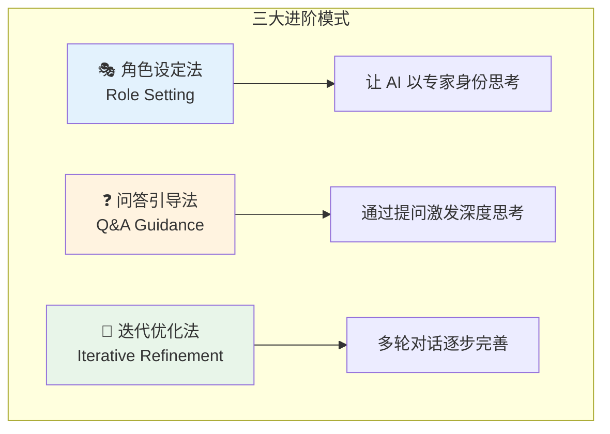
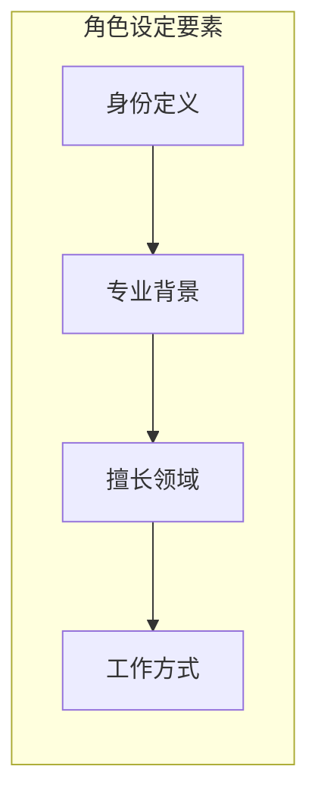
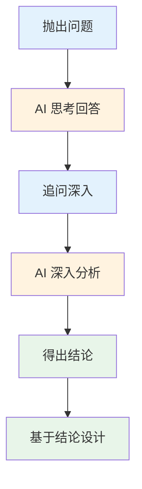
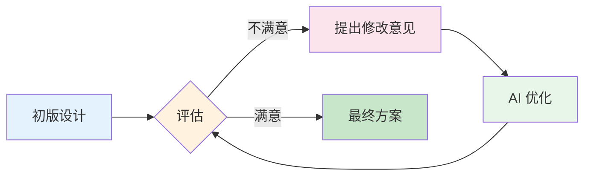
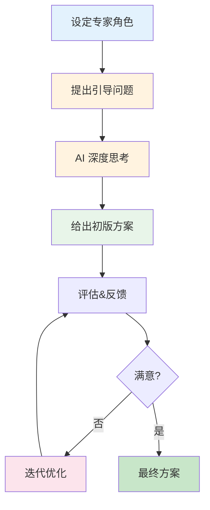

# 进阶提示词模式

## 前言

掌握了基础提示词技巧后，本章将介绍三种进阶提示词模式：**角色设定法**、**问答引导法**和**迭代优化法**。这些模式能帮助你与 AI 进行更深入的对话，获得更专业、更符合预期的设计结果。

## 进阶模式总览



## 一、角色设定法（Role Setting）

### 什么是角色设定法

角色设定法通过让 AI 扮演特定的专业角色，使其从该角色的专业视角思考和回应，从而获得更专业、更深入的设计建议。

### 角色设定的核心要素



| 要素 | 说明 | 示例 |
|-----|------|------|
| **身份定义** | 角色的职位和级别 | "高级 UI 设计师"、"UX 专家" |
| **专业背景** | 工作经验和行业 | "10年经验"、"专注移动端" |
| **擅长领域** | 核心能力和特长 | "擅长电商设计"、"精通设计系统" |
| **工作方式** | 思考和输出习惯 | "注重用户体验"、"数据驱动" |

### 常用角色模板

#### 角色 1：资深 UI 设计师

```markdown
## 角色设定

你是一位拥有 10 年经验的高级 UI 设计师，具备以下特质：

**专业背景**
- 曾在一线互联网公司（阿里、腾讯、字节）担任设计主管
- 主导过多款千万级用户产品的设计
- 擅长 iOS 和 Android 双平台设计

**核心能力**
- 深入理解移动端设计规范（iOS HIG、Material Design）
- 精通设计系统搭建和组件库建设
- 对用户体验有深刻洞察

**工作风格**
- 设计决策有理有据，能说明设计原因
- 注重设计的一致性和可扩展性
- 关注细节，追求像素级完美

---

现在，请以这个角色的身份，帮我设计一个 [具体设计任务]...
```

#### 角色 2：UX 研究专家

```markdown
## 角色设定

你是一位专注用户体验研究的 UX 专家：

**专业背景**
- 心理学背景，10年用户研究经验
- 擅长用户访谈、可用性测试、数据分析
- 曾为多个知名产品提供 UX 咨询

**核心能力**
- 能从用户心理角度分析设计问题
- 善于发现和定义用户痛点
- 精通用户旅程地图和体验优化

**工作风格**
- 以用户为中心，数据驱动决策
- 善于提出问题和假设
- 注重设计的可用性验证

---

请以这个角色的身份，分析以下设计方案的用户体验问题...
```

#### 角色 3：设计系统架构师

```markdown
## 角色设定

你是一位设计系统架构师：

**专业背景**
- 曾主导大型企业级设计系统搭建
- 精通 Atomic Design 原子设计方法论
- 有丰富的设计到开发交付经验

**核心能力**
- 组件抽象和复用设计
- 设计 Token 和变量管理
- 设计系统文档编写

**工作风格**
- 系统性思维，追求一致性
- 注重可扩展性和可维护性
- 设计与开发紧密协作

---

请以这个角色的身份，帮我规划一套设计系统...
```

### 角色设定实战示例

```markdown
## 角色设定

你是一位资深电商 UI 设计师，拥有以下经验：
- 8年电商行业设计经验
- 曾负责淘宝、京东同类竞品的页面设计
- 深谙电商用户购物心理和转化优化技巧
- 擅长促销活动页面设计

## 设计任务

现在请以这个角色的身份，设计一个「双11」大促会场首页：

**活动信息**
- 活动主题：11.11 全民狂欢节
- 活动时间：11.1 - 11.11
- 核心玩法：预售、满减、秒杀、直播

**设计要求**
- 营造热闹、紧迫的氛围
- 突出利益点，提升用户参与度
- 清晰的会场导流，引导用户深入浏览

**请你**
1. 先分析电商大促页面的设计要点
2. 然后提供详细的首页设计方案
3. 说明每个设计决策背后的原因
```

### 角色组合与切换

对于复杂项目，可以设定多个角色并切换：

```markdown
## 多角色协作模式

在接下来的设计过程中，请根据需要切换以下角色：

**角色 A：产品经理视角**
- 关注功能完整性和业务目标
- 评估需求优先级

**角色 B：UI 设计师视角**
- 关注视觉呈现和界面美观
- 设计具体的界面方案

**角色 C：UX 设计师视角**
- 关注用户体验和可用性
- 评估交互流程合理性

**角色 D：前端开发视角**
- 关注技术可行性
- 评估实现成本

---

首先，请以**产品经理视角**分析这个需求的核心目标...
```

## 二、问答引导法（Q&A Guidance）

### 什么是问答引导法

问答引导法通过向 AI 提出一系列问题，引导其进行深度思考后再给出设计方案。这种方法特别适合需要深入分析的复杂设计任务。

### 问答引导的核心思路



### 问答引导模板

#### 模板 1：用户分析引导

```markdown
## 用户分析问答

在设计这个 [产品名称] 的 [页面/功能] 之前，请先回答以下问题：

**用户画像**
1. 核心用户群体是谁？他们的年龄、职业、生活方式是怎样的？
2. 他们有什么样的使用习惯和偏好？
3. 他们的技术熟练度如何？

**使用场景**
4. 用户在什么情况下会使用这个功能？
5. 用户使用时的心理状态是怎样的？（急切/悠闲/焦虑...）
6. 用户期望通过这个功能解决什么问题？

**痛点与需求**
7. 用户在现有产品中遇到的主要问题是什么？
8. 哪些需求是必须满足的（Must Have）？
9. 哪些需求是锦上添花的（Nice to Have）？

---

基于以上分析，请提供设计方案...
```

#### 模板 2：设计决策引导

```markdown
## 设计决策问答

请在设计之前，思考并回答以下问题：

**布局决策**
1. 用户首先应该看到什么信息？
2. 如何组织信息的优先级？
3. 页面的信息密度应该如何把控？

**视觉决策**
4. 什么样的视觉风格最能传达品牌调性？
5. 如何通过颜色引导用户注意力？
6. 哪些元素需要视觉强调？

**交互决策**
7. 用户完成核心任务需要几步操作？
8. 如何减少用户的认知负担？
9. 出错时如何引导用户纠正？

---

基于这些思考，请给出设计方案...
```

#### 模板 3：竞品分析引导

```markdown
## 竞品分析问答

在设计之前，请分析市场上的类似产品：

**竞品识别**
1. 这个功能的主要竞品有哪些？
2. 各竞品的核心定位和特点是什么？

**优势分析**
3. 竞品中哪些设计值得借鉴？为什么？
4. 哪些设计做得特别出色？

**不足分析**
5. 竞品有哪些设计问题或不足？
6. 用户对竞品有哪些抱怨？

**差异化机会**
7. 我们可以在哪些方面做出差异化？
8. 如何避免竞品的问题？

---

基于以上分析，请设计一个差异化的方案...
```

### 问答引导实战示例

```markdown
## 设计任务
设计一个在线教育 App 的课程详情页

## 设计前思考（请逐一回答）

**用户视角**
1. 用户打开课程详情页时，最想了解的前 3 个信息是什么？
2. 用户决定购买课程的关键因素有哪些？
3. 用户可能有哪些顾虑阻碍购买？

**转化视角**
4. 如何在 5 秒内抓住用户注意力？
5. 哪些信息能增强用户的购买信心？
6. 「立即购买」按钮应该放在什么位置？

**内容视角**
7. 课程介绍应该展示哪些内容？
8. 用户评价如何展示才能增强可信度？
9. 试听/试看功能应该如何设计？

**体验视角**
10. 页面加载慢时如何处理？
11. 用户犹豫时如何提供帮助？
12. 购买后的引导流程是怎样的？

---

请基于以上思考，提供详细的课程详情页设计方案。
```

### 追问深入技巧

当 AI 的回答不够深入时，可以使用追问：

```markdown
## 追问模板

【针对布局】
你提到使用卡片布局，请进一步说明：
- 卡片的具体尺寸和间距是多少？
- 卡片内的信息如何排布？
- 为什么选择卡片而不是列表？

【针对颜色】
你建议使用蓝色作为主色，请详细说明：
- 具体使用哪个蓝色色值？
- 这个蓝色会应用在哪些元素上？
- 不同状态下颜色如何变化？

【针对交互】
你提到点击展开更多，请细化：
- 展开动画是怎样的？
- 展开后的内容如何布局？
- 收起的触发方式是什么？
```

## 三、迭代优化法（Iterative Refinement）

### 什么是迭代优化法

迭代优化法通过多轮对话，逐步完善设计方案。每一轮根据上一轮的结果提出改进意见，直到达到满意的效果。

### 迭代优化流程



### 迭代优化模板

#### 第一轮：获取初版

```markdown
## 初版设计请求

请设计一个音乐播放器的正在播放页面。

**基本要求**
- 移动端设计（iPhone 14）
- 包含：专辑封面、歌曲信息、播放控制、进度条
- 风格：简约现代

请先给我一个初版设计方案。
```

#### 第二轮：布局优化

```markdown
## 第一次迭代：布局优化

初版设计不错，但我希望优化以下方面：

**调整 1：专辑封面**
- 专辑封面太小了，请放大到屏幕宽度的 70%
- 添加唱片旋转的视觉效果

**调整 2：播放控制**
- 播放/暂停按钮要更突出，建议增大到 64px
- 上一曲/下一曲按钮适当变小

**调整 3：新增元素**
- 在底部添加歌词滚动显示区域
- 添加分享和收藏按钮

请基于以上意见优化设计。
```

#### 第三轮：细节打磨

```markdown
## 第二次迭代：细节打磨

布局已经很好了，现在请优化视觉细节：

**颜色调整**
- 背景使用专辑封面的主色调生成渐变
- 图标颜色统一为白色，透明度区分层级

**字体调整**
- 歌曲名：22px，粗体
- 歌手名：16px，透明度 70%
- 歌词：14px，当前行高亮放大

**动效添加**
- 封面添加轻微浮动动画
- 进度条添加发光效果
- 切换歌曲时有平滑过渡
```

#### 第四轮：适配方案

```markdown
## 第三次迭代：多场景适配

当前设计已经很完善，最后请提供适配方案：

**暗色模式**
- 提供暗色模式的配色方案
- 说明哪些元素需要调整

**横屏模式**
- 横屏播放时的布局调整
- 如何利用横向空间

**锁屏控制**
- 锁屏音乐控制卡片的设计
- 控制中心的显示方案

**小屏适配**
- iPhone SE 等小屏设备的布局调整
- 哪些元素需要缩小或隐藏
```

### 迭代优化的评估维度

每轮迭代后，可以从以下维度评估：

| 评估维度 | 评估问题 | 优化方向 |
|---------|---------|---------|
| **布局** | 信息层级是否清晰？ | 调整位置、大小、间距 |
| **颜色** | 配色是否和谐？重点是否突出？ | 调整色值、对比度 |
| **字体** | 可读性如何？层级感是否明显？ | 调整字号、字重 |
| **交互** | 操作是否便捷？反馈是否及时？ | 调整位置、增加状态 |
| **一致性** | 风格是否统一？ | 统一设计语言 |
| **完整性** | 是否覆盖所有场景？ | 补充边界情况 |

### 迭代优化实战示例

```markdown
## 设计任务
设计一个外卖 App 的订单详情页

---

## 第一轮：初版设计

请设计外卖 App 订单详情页的初版，包含：
- 订单状态显示
- 配送信息
- 商品清单
- 价格明细
- 底部操作按钮

---

【假设 AI 给出了初版设计】

---

## 第二轮：结构优化

感谢初版设计！请进行以下优化：

1. **订单状态区域**
   - 增加配送进度时间轴，显示「已接单→配送中→已送达」
   - 时间轴使用图标 + 文字，当前状态高亮

2. **配送信息区域**
   - 增加骑手实时位置地图（小地图预览）
   - 显示预计送达时间倒计时
   - 添加「联系骑手」快捷按钮

3. **商品清单**
   - 显示商品缩略图（40×40px）
   - 区分主商品和赠品/加购品

---

【假设 AI 优化后】

---

## 第三轮：细节完善

结构很好！现在优化细节：

1. **视觉层级**
   - 订单状态使用绿色主色调，增加状态感
   - 价格使用橙色突出，字号 18px
   - 模块之间使用 12px 的灰色分隔

2. **交互状态**
   - 「联系骑手」按钮添加呼吸动效（引起注意）
   - 地图区域点击可展开全屏查看
   - 复制订单号要有成功提示

3. **空状态处理**
   - 骑手未接单时的状态显示
   - 配送异常时的提示设计

---

【假设 AI 再次优化】

---

## 第四轮：最终确认

设计已经很完善！最后请提供：

1. 完整的设计规格文档
2. 所有状态的设计说明（待接单、配送中、已完成、异常）
3. 暗色模式适配方案
4. 关键交互的动效说明
```

## 三种模式的组合使用

在实际项目中，三种模式可以组合使用：



### 组合使用示例

```markdown
## 角色设定
你是一位拥有 8 年经验的金融 App UI 设计专家，擅长：
- 复杂数据的可视化呈现
- 安全感和信任感的视觉传达
- 金融类产品的合规设计

## 设计任务
设计一个银行 App 的理财产品详情页

## 设计前思考（问答引导）
请先回答以下问题：

1. 用户查看理财产品详情时，最关心的信息是什么？
2. 如何展示收益信息才能既清晰又符合监管要求？
3. 用户购买理财产品的顾虑主要有哪些？如何通过设计化解？
4. 风险提示应该如何展示，既满足合规又不影响体验？

---

请基于以上角色和思考，给出初版设计方案。
后续我会根据实际需要进行迭代优化。
```

## 总结

| 模式 | 核心特点 | 适用场景 |
|-----|---------|---------|
| **角色设定法** | 让 AI 以专家身份思考 | 需要专业深度的设计任务 |
| **问答引导法** | 通过提问引导深度分析 | 需要充分分析的复杂任务 |
| **迭代优化法** | 多轮对话逐步完善 | 追求高质量的精细设计 |

**建议**：选择一个你正在做的设计任务，尝试使用「角色设定 + 问答引导 + 迭代优化」的组合模式，体验进阶技巧带来的质量提升。
