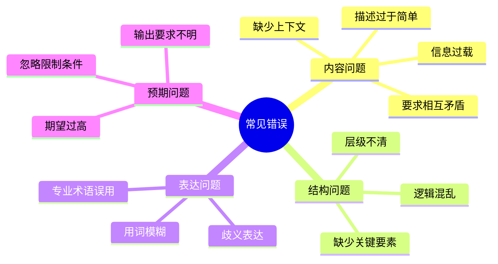
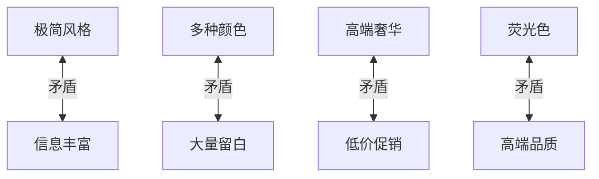
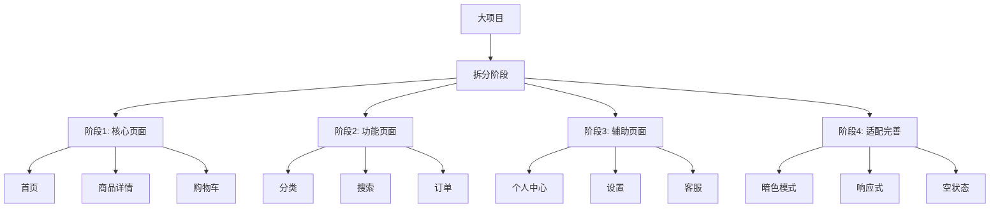
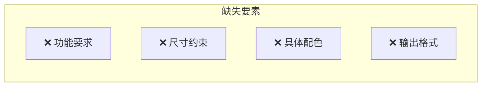
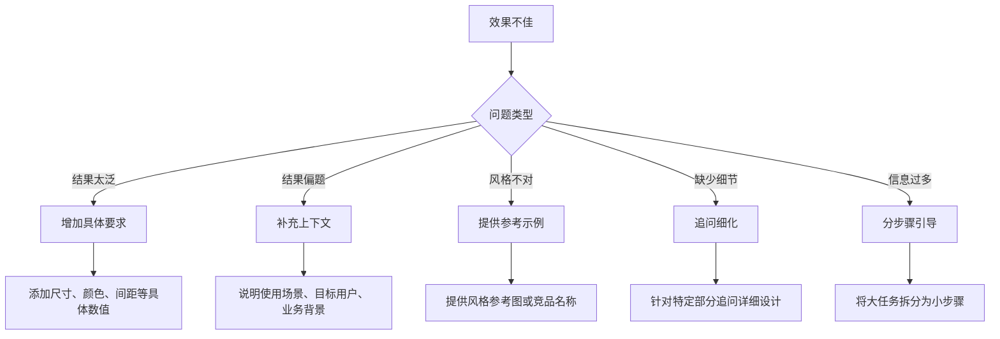

# 常见错误与修正

## 前言

在编写 UI 设计提示词的过程中，即使了解了基本技巧，仍然容易犯一些常见错误。本章将系统梳理最常见的提示词错误类型，并提供具体的修正方案和最佳实践。

## 错误分类总览



## 一、内容问题

### 错误 1：描述过于简单

这是最常见的错误，提示词过于简短导致 AI 无法准确理解需求。

#### ❌ 错误示例

```markdown
设计一个 App
```

```markdown
做一个登录页面
```

```markdown
画一个好看的首页
```

#### 问题分析

| 缺失要素 | 问题 | 后果 |
|---------|------|------|
| 设计对象不明 | 什么类型的 App？ | AI 只能猜测 |
| 用户群体不明 | 谁使用？ | 设计方向可能偏差 |
| 风格不明 | 什么视觉风格？ | 结果不符合预期 |
| 功能不明 | 需要哪些功能？ | 内容可能遗漏 |
| 约束不明 | 什么平台和尺寸？ | 输出格式不对 |

#### ✅ 修正后

```markdown
设计一个外卖订餐 App 的首页：

**目标用户**：城市上班族，25-40岁，追求便捷高效

**页面功能**：
- 搜索框（支持语音搜索）
- 定位和地址显示
- 分类导航（快餐、火锅、烧烤等）
- 优惠活动轮播
- 附近商家推荐列表

**设计风格**：
- 整体风格：简洁高效，突出美食
- 主色：橙红色 #FF6B35
- 风格参考：美团外卖的高效感

**技术约束**：
- 平台：iOS（iPhone 14）
- 尺寸：390×844px

**输出要求**：
请提供详细的布局描述和关键组件设计规格
```

---

### 错误 2：要求相互矛盾

多个要求之间存在逻辑冲突，让 AI 难以取舍。

#### ❌ 错误示例

```markdown
设计一个极简风格的页面，要求：
- 信息非常丰富，展示尽可能多的内容
- 使用多种颜色增加视觉丰富度
- 大量留白
- 页面元素要多
```

```markdown
设计一个高端奢华的界面：
- 使用鲜艳的荧光色
- 低价促销氛围
- 高端品质感
```

#### 问题分析



#### ✅ 修正后

```markdown
## 修正示例 1：平衡信息量和简洁性

设计一个信息展示页面，要求：

**信息层级**
- 核心信息突出展示（大字号、强调色）
- 次要信息适度收起（折叠/Tab 切换）
- 辅助信息按需查看（"更多"入口）

**视觉风格**
- 配色控制在 3 种以内
- 适当留白提升可读性
- 信息密度：中等（不密集也不空旷）

## 修正示例 2：明确风格定位

设计一个高端产品展示页面：

**风格定位**：高端精致（非促销低价风格）

**视觉特征**
- 配色：深色系为主（黑、深灰、金色点缀）
- 排版：大图少字，突出产品质感
- 留白：充足的呼吸空间
- 字体：优雅的细体字

**避免元素**
- ❌ 鲜艳的促销色（红、橙）
- ❌ 价格标签式的设计
- ❌ 密集的信息堆砌
```

---

### 错误 3：缺少上下文

孤立地描述某个组件，没有说明使用场景和上下文。

#### ❌ 错误示例

```markdown
设计一个按钮
```

```markdown
画一个搜索框
```

```markdown
做一个弹窗
```

#### 问题分析

| 缺失信息 | 问题 |
|---------|------|
| 所属页面 | 不知道整体风格 |
| 使用场景 | 不知道按钮用途 |
| 周围元素 | 不知道如何协调 |
| 用户操作 | 不知道交互需求 |

#### ✅ 修正后

```markdown
## 按钮设计需求

**使用场景**
为电商 App 的商品详情页设计「立即购买」主按钮

**页面上下文**
- 位置：页面底部固定区域
- 相邻元素：左侧是「加入购物车」次级按钮
- 页面主色：橙色 #FF6B35

**按钮规格**
- 尺寸：宽度 60%，高度 48px
- 圆角：24px（全圆角）
- 背景：橙红渐变 #FF4D4F → #FF7A45
- 文字：白色，16px，粗体

**交互状态**
请设计以下状态：
- 默认态
- 按压态（颜色加深 10%）
- 禁用态（商品下架时）
- 加载态（提交订单中）
```

---

### 错误 4：信息过载

一次性给出过多要求，超出 AI 处理能力。

#### ❌ 错误示例

```markdown
请设计一个完整的电商 App，包括：首页、分类页、搜索页、
商品详情页、购物车、订单确认页、支付页、订单列表、
订单详情、物流详情、评价页、个人中心、设置页、地址管理、
优惠券、会员中心、帮助中心、客服、消息中心...

每个页面都要包含完整的功能和所有交互状态，
还要有暗色模式、多语言、无障碍支持...
```

#### 问题分析

- 页面数量过多，无法在一次对话中完成
- 要求过于笼统，每个页面都没有具体说明
- AI 可能遗漏重要细节或给出泛泛的结果

#### ✅ 修正方案



```markdown
## 阶段 1：核心交易流程

本次请先设计电商 App 的核心交易页面：

### 1.1 首页
[详细的首页设计需求]

### 1.2 商品详情页
[详细的详情页设计需求]

### 1.3 购物车
[详细的购物车设计需求]

---

后续阶段将分别设计其他页面...
```

## 二、结构问题

### 错误 5：缺少关键要素

提示词结构不完整，缺少重要的设计要素。

#### ❌ 错误示例

```markdown
设计一个音乐 App 播放页面，要好看，有科技感。
```

#### 问题分析



#### ✅ 修正后（六要素完整版）

```markdown
## 任务类型
设计一个音乐播放 App 的正在播放页面

## 设计对象
- 应用类型：音乐流媒体 App
- 页面：正在播放（Now Playing）页面
- 平台：iOS（iPhone 14）

## 风格描述
- 整体风格：现代科技感，沉浸式体验
- 配色方案：
  - 背景：动态提取专辑封面主色生成渐变
  - 控制元素：白色/半透明白
  - 强调色：品牌绿 #1DB954
- 视觉效果：毛玻璃效果，微妙动效

## 功能要求
- 专辑封面展示（带旋转效果）
- 歌曲信息（歌名、歌手、专辑）
- 播放进度条（可拖动）
- 播放控制（上一曲/播放暂停/下一曲）
- 辅助功能（收藏、分享、歌词、播放列表）
- 音质和播放模式切换

## 约束条件
- 尺寸：390×844px
- 需要考虑歌词展开状态
- 需要提供横屏播放模式

## 输出格式
- 详细的布局描述
- 各组件尺寸和间距规格
- 颜色值和字体规格
- 关键交互说明
```

---

### 错误 6：逻辑混乱

提示词内容组织混乱，缺乏清晰的逻辑结构。

#### ❌ 错误示例

```markdown
我要做个登录页面，用蓝色，还要有注册入口，记住密码功能，
对了手机端的，圆角按钮，背景要好看，第三方登录也要，
字体用什么好？大概375宽度吧，还有忘记密码链接，
风格嘛简约一点，最好有图...
```

#### 问题分析

- 信息零散，没有分类组织
- 前后跳跃，难以理解完整需求
- 重要信息被淹没

#### ✅ 修正后（结构化表达）

```markdown
## 设计概述
设计一个移动端 App 的登录页面

## 基本信息
| 项目 | 说明 |
|-----|------|
| 平台 | iOS 移动端 |
| 尺寸 | 375×812px |
| 风格 | 简约现代 |
| 主色 | 蓝色系 |

## 功能清单

### 核心功能
- [ ] 账号输入框（手机号/邮箱）
- [ ] 密码输入框（带显示/隐藏）
- [ ] 登录按钮（主按钮，圆角）
- [ ] 记住密码选项

### 辅助功能
- [ ] 忘记密码链接
- [ ] 注册入口
- [ ] 第三方登录（微信、Apple）

### 视觉元素
- [ ] 品牌 Logo
- [ ] 背景装饰（插画或渐变）

## 设计要求
- 按钮样式：圆角（建议 24px 全圆角）
- 字体：系统默认（苹方）
- 背景：建议使用品牌蓝渐变或简约插画

## 输出要求
请提供完整的页面设计描述，包含具体尺寸和颜色值
```

## 三、表达问题

### 错误 7：用词模糊

使用主观、模糊的形容词，AI 难以准确理解。

#### ❌ 错误示例

| 模糊表达 | 问题 |
|---------|------|
| "大气一点" | 多大？什么风格算大气？ |
| "高级感" | 什么元素体现高级？ |
| "年轻态" | 什么视觉特征？ |
| "有调性" | 什么调性？ |
| "舒服的颜色" | 哪种颜色？什么感觉？ |
| "差不多的间距" | 具体多少 px？ |

#### ✅ 修正对照表

| 模糊表达 | 具体表达 |
|---------|---------|
| "大气一点" | "大面积留白（40%以上），大图展示，简洁排版" |
| "高级感" | "深色背景，金色点缀，细体字，充足留白" |
| "年轻态" | "高饱和度配色，圆润图形，活泼插画" |
| "有调性" | "统一的设计语言：8px圆角，16px间距，蓝色主色" |
| "舒服的颜色" | "低饱和度的莫兰迪色系，如 #B8C4BB、#D4C4B5" |
| "差不多的间距" | "元素间距 16px，模块间距 24px" |

---

### 错误 8：歧义表达

表达不够清晰，可能产生多种理解。

#### ❌ 错误示例

```markdown
按钮放在页面下面
```
→ "下面"是指底部固定？还是内容下方？还是折叠区域下方？

```markdown
大一点的字体
```
→ 比什么大？大多少？

```markdown
和旁边的一样
```
→ 哪个旁边？一样的是什么属性？

#### ✅ 修正后

```markdown
❌ "按钮放在页面下面"
✅ "按钮固定在页面底部安全区域上方，距底部 34px"

❌ "大一点的字体"
✅ "标题字号 24px（比正文 14px 大 10px）"

❌ "和旁边的一样"
✅ "与左侧「取消」按钮保持相同高度（44px）和圆角（8px）"
```

## 四、预期问题

### 错误 9：期望过高

对单次提示的输出期望过高，超出 AI 能力范围。

#### ❌ 错误示例

```markdown
请设计一个完美的、没有任何问题的、
所有用户都满意的电商 App 首页
```

```markdown
生成一个可以直接交付开发的、
包含所有像素级细节的设计稿
```

#### ✅ 合理期望设定

```markdown
## 合理的期望

**本次设计目标**
请设计电商 App 首页的初版方案，重点关注：
1. 整体布局结构
2. 核心模块设计
3. 主要配色方案

**后续迭代**
初版完成后，我们将针对以下方面进行细化：
- 组件细节打磨
- 交互状态补充
- 适配方案完善
- 异常状态处理
```

---

### 错误 10：输出要求不明确

没有说明期望的输出形式和详细程度。

#### ❌ 错误示例

```markdown
设计一个设置页面
（没有说明要输出什么）
```

AI 可能输出：
- 简单的文字描述？
- 详细的设计规格？
- 代码实现？
- 设计图？

#### ✅ 修正后

```markdown
设计一个 App 设置页面

## 输出要求

请提供以下内容：

### 1. 布局说明
- 页面结构图（文字描述或 ASCII 图）
- 各区域的功能说明

### 2. 设计规格
- 列表项高度、内边距
- 图标尺寸、颜色
- 字体大小、颜色
- 分组标题样式

### 3. 组件详情
- 开关组件的尺寸和颜色
- 箭头/展开指示器样式
- 头像区域设计

### 4. 交互说明
- 点击反馈效果
- 页面跳转动效

### 格式要求
- 颜色使用 HEX 色值
- 尺寸使用 px 单位
- 重要数据以表格形式呈现
```

## 五、错误自检清单

在提交提示词前，使用以下清单自检：

```markdown
## 提示词自检清单

### 内容完整性
- [ ] 明确了设计对象（什么 App、什么页面）
- [ ] 说明了目标用户
- [ ] 描述了设计风格
- [ ] 列出了功能要求
- [ ] 设定了约束条件
- [ ] 指定了输出格式

### 表达清晰度
- [ ] 没有模糊的形容词
- [ ] 数值都是具体的（尺寸、颜色、间距）
- [ ] 没有歧义表达
- [ ] 逻辑结构清晰

### 要求合理性
- [ ] 各要求之间没有矛盾
- [ ] 任务量适中，不过载
- [ ] 期望合理，符合 AI 能力
- [ ] 输出要求明确可执行

### 上下文完整
- [ ] 组件说明了使用场景
- [ ] 页面说明了所属应用
- [ ] 有必要的参考信息
```

## 六、快速修正技巧

当发现提示词效果不佳时，可以尝试以下修正：



### 快速修正模板

```markdown
## 上一轮结果不满意，本轮修正：

**问题 1**：[具体问题描述]
**修正**：[补充或修改的内容]

**问题 2**：[具体问题描述]
**修正**：[补充或修改的内容]

**新增要求**：
- [新的具体要求1]
- [新的具体要求2]

请基于以上修正重新设计。
```

## 总结

| 错误类型 | 典型表现 | 修正方法 |
|---------|---------|---------|
| 描述过简 | "设计一个 App" | 补充完整的六要素 |
| 要求矛盾 | "极简但信息丰富" | 明确优先级，取舍平衡 |
| 缺少上下文 | "设计一个按钮" | 说明使用场景和位置 |
| 信息过载 | 一次要求太多 | 分阶段、分步骤 |
| 用词模糊 | "好看、大气" | 使用具体数值 |
| 输出不明 | 没说要什么 | 明确输出格式和内容 |

