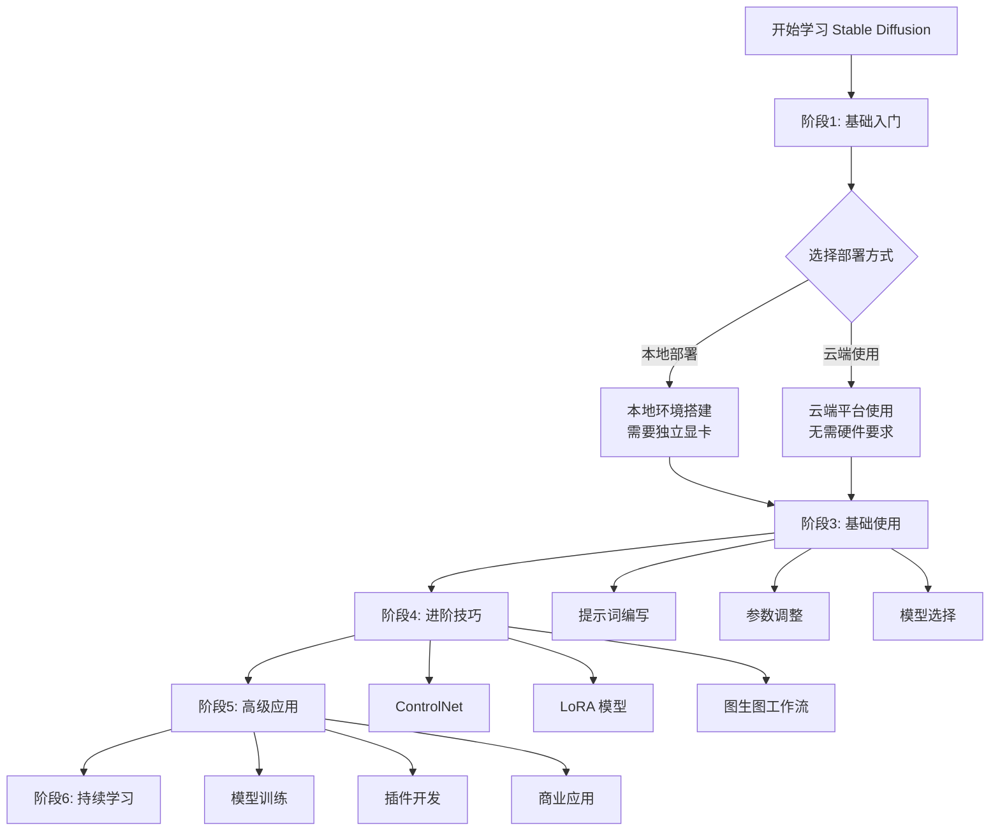
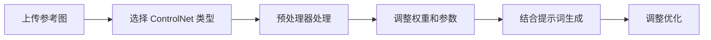
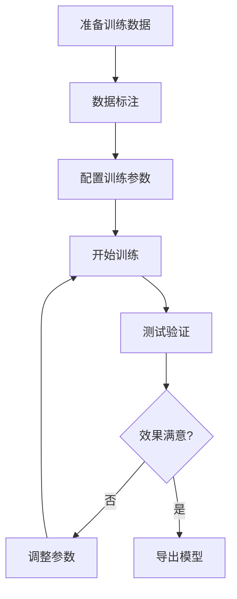

# Stable Diffusion 学习路线图

## 简介

Stable Diffusion 是目前最流行的开源 AI 绘画模型之一，能够根据文本描述生成高质量的图像。本学习路线图将帮助您从零基础开始，逐步掌握 Stable Diffusion 的使用技巧，直至能够进行高级应用和模型训练。

无论您是艺术创作者、设计师，还是对 AI 技术感兴趣的开发者，都可以通过这个路线图找到适合自己的学习路径。

## 学习路线总览



## 阶段1: 基础入门 (1-2周)

### 学习目标
- 理解 Stable Diffusion 的基本概念和工作原理
- 了解 AI 绘画的应用场景
- 认识相关术语和基础概念

### 核心知识点

#### 1.1 什么是 Stable Diffusion
- **Diffusion Model（扩散模型）**：通过逐步去噪的方式生成图像
- **Text-to-Image（文生图）**：根据文本描述生成图像
- **Latent Diffusion**：在潜在空间中进行扩散，大幅提升效率

#### 1.2 核心概念
- **Prompt（提示词）**：用于描述想要生成图像的文本
- **Negative Prompt（负面提示词）**：描述不想出现在图像中的元素
- **Checkpoint（检查点/大模型）**：训练好的完整模型文件
- **VAE（变分自编码器）**：负责图像的编码和解码
- **LoRA（Low-Rank Adaptation）**：轻量级的模型微调文件
- **Embeddings/Textual Inversion**：文本嵌入，用于特定风格或对象

#### 1.3 与其他 AI 绘画工具对比
| 特性 | Stable Diffusion | Midjourney | DALL-E |
|------|-----------------|------------|--------|
| 开源性 | 完全开源 | 闭源 | 闭源 |
| 部署方式 | 可本地部署 | 仅云端 | 仅云端 |
| 可控性 | 极高 | 中等 | 较低 |
| 成本 | 免费（需硬件） | 订阅制 | 按量付费 |
| 扩展性 | 丰富的插件生态 | 有限 | 有限 |

### 推荐资源
- [Stable Diffusion 官方 GitHub](https://github.com/Stability-AI/stablediffusion)
- [Hugging Face Stable Diffusion 介绍](https://huggingface.co/stabilityai)
- B站教学视频：搜索"Stable Diffusion 入门教程"

## 阶段2: 环境搭建 (3-7天)

### 学习目标
- 根据自己的硬件条件选择合适的部署方式
- 成功安装并运行 Stable Diffusion
- 熟悉操作界面

### 2.1 本地部署方案

#### 硬件要求
- **最低配置**：
  - GPU: NVIDIA GTX 1060 6GB 或以上
  - RAM: 16GB
  - 存储: 50GB 可用空间

- **推荐配置**：
  - GPU: NVIDIA RTX 3060 12GB 或以上
  - RAM: 32GB
  - 存储: 100GB SSD

#### 主流 WebUI 选择

**1. AUTOMATIC1111 WebUI（最流行）**
```bash
# 克隆仓库
git clone https://github.com/AUTOMATIC1111/stable-diffusion-webui.git
cd stable-diffusion-webui

# Windows 用户直接运行
webui-user.bat

# Linux/Mac 用户
./webui.sh
```

**优点**：
- 功能最全面
- 插件生态最丰富
- 社区支持最好

**2. ComfyUI（节点式工作流）**
- 适合高级用户
- 工作流可视化
- 性能优化更好

**3. SD.Next（现代化界面）**
- 界面更现代
- 性能优化
- 功能持续更新

### 2.2 云端使用方案

#### 免费/低成本选项
1. **Google Colab**
   - 免费 GPU 额度
   - 适合初学者体验
   - 存储空间有限

2. **Kaggle Notebooks**
   - 每周 30 小时免费 GPU
   - 稳定性较好

#### 付费云平台
1. **AutoDL**（国内）
   - 按时计费
   - 速度快
   - 价格实惠

2. **Vast.ai**（国际）
   - GPU 租赁平台
   - 价格灵活

### 2.3 模型下载
- **Civitai**：最大的模型分享平台
- **Hugging Face**：官方模型仓库
- **吐司网**（国内）：中文模型社区

### 实践任务
1. 成功安装并启动 WebUI
2. 下载并加载一个基础模型（如 Stable Diffusion v1.5）
3. 生成第一张图片

## 阶段3: 基础使用 (2-4周)

### 学习目标
- 掌握提示词编写技巧
- 理解并调整各项参数
- 能够稳定生成想要的图像

### 3.1 提示词编写技巧

#### 提示词结构
```
[主体描述], [细节描述], [风格描述], [质量词], [艺术家/参考]
```

#### 示例
**基础提示词**：
```
a beautiful girl, long hair, blue eyes, smiling,
standing in a garden, flowers, sunlight,
anime style, high quality, masterpiece
```

**进阶提示词**：
```
1girl, solo, beautiful detailed face, long flowing silver hair,
sapphire blue eyes, gentle smile, white dress,
standing in a magical garden, colorful flowers,
soft sunlight filtering through trees, floating petals,
anime style, by Makoto Shinkai, high detail, 8k,
masterpiece, best quality, highly detailed
```

#### 权重控制
- `(keyword)` - 增加权重 1.1 倍
- `((keyword))` - 增加权重 1.21 倍
- `(keyword:1.5)` - 精确控制权重
- `[keyword]` - 减少权重

#### 常用质量词
**正面提示词**：
- `masterpiece, best quality, high quality`
- `highly detailed, ultra detailed, 8k`
- `professional, photorealistic`
- `cinematic lighting, dramatic lighting`

**负面提示词**：
- `low quality, worst quality, bad quality`
- `lowres, bad anatomy, bad hands`
- `text, watermark, signature`
- `blurry, jpeg artifacts`

### 3.2 重要参数说明

#### 采样方法 (Sampling Method)
- **DPM++ 2M Karras**：速度快，质量好（推荐）
- **Euler a**：适合创意探索
- **DDIM**：稳定，适合图生图
- **LMS**：质量高，速度慢

#### 采样步数 (Sampling Steps)
- 20-30 步：快速预览
- 30-50 步：正常使用（推荐）
- 50+ 步：追求极致质量

#### CFG Scale（提示词相关性）
- 5-8：更有创意，可能偏离提示词
- 7-12：平衡（推荐 7-9）
- 12+：严格遵循提示词，可能过饱和

#### 图像尺寸
**SD 1.5 标准尺寸**：
- 512x512（正方形）
- 512x768（竖图）
- 768x512（横图）

**SDXL 标准尺寸**：
- 1024x1024
- 832x1216
- 1216x832

#### 随机种子 (Seed)
- -1：每次随机
- 固定数值：复现同样的图像

### 3.3 模型选择指南

#### Checkpoint 分类
1. **写实模型**
   - ChilloutMix
   - Realistic Vision
   - DreamShaper

2. **二次元模型**
   - Anything V5
   - AbyssOrangeMix
   - CounterfeitV3

3. **通用模型**
   - Stable Diffusion v1.5
   - SDXL 1.0

#### VAE 选择
- **vae-ft-mse-840000**：适合 SD 1.5
- **sdxl.vae**：SDXL 专用
- 作用：改善色彩和细节

### 实践项目
1. 用同一个提示词，尝试不同的采样方法，对比效果
2. 练习编写 10 个不同风格的提示词
3. 使用固定种子，调整不同参数观察变化
4. 尝试 3 种以上不同风格的模型

## 阶段4: 进阶技巧 (4-8周)

### 学习目标
- 掌握 ControlNet 的使用
- 学会使用 LoRA 和其他扩展
- 建立高效的创作工作流

### 4.1 ControlNet 入门与应用

#### 什么是 ControlNet
ControlNet 允许您通过提供参考图像来精确控制生成结果的构图、姿势、线条等。

#### 常用 ControlNet 类型

**1. Canny（边缘检测）**
- 用途：控制物体轮廓和线条
- 适用场景：建筑、产品设计、线稿上色

**2. Depth（深度图）**
- 用途：控制画面的空间深度
- 适用场景：保持场景构图，改变风格

**3. OpenPose（姿势检测）**
- 用途：控制人物姿势
- 适用场景：人物创作、动作参考

**4. Scribble（涂鸦）**
- 用途：通过简单涂鸦控制构图
- 适用场景：快速草图转精细图

**5. Lineart（线稿）**
- 用途：线稿上色
- 适用场景：动漫风格创作

**6. Tile（瓦片/细节增强）**
- 用途：高清放大
- 适用场景：图像超分辨率

#### ControlNet 使用流程



#### 实用技巧
- **权重控制**：0.5-1.0 为常用范围
- **多 ControlNet 组合**：可同时使用多个 ControlNet
- **预处理器选择**：影响检测精度

### 4.2 LoRA 模型使用

#### 什么是 LoRA
LoRA 是轻量级的模型微调文件（通常几十到几百 MB），可以快速为模型添加特定风格、人物或概念。

#### LoRA 分类
1. **角色 LoRA**：特定角色的外观
2. **风格 LoRA**：特定艺术风格
3. **概念 LoRA**：特定概念或元素
4. **服装 LoRA**：特定服装样式

#### 使用方法
```
<lora:lora_name:0.8>
```
- 权重范围：0.3-1.2
- 可同时使用多个 LoRA

#### LoRA 推荐
- **Add Detail**：增强细节
- **GoodHands**：改善手部生成
- **Blindbox**：盲盒风格

### 4.3 图生图 (Image-to-Image) 工作流

#### 基础图生图
- **重绘幅度 (Denoising Strength)**：
  - 0.3-0.5：微调
  - 0.5-0.7：中等改变
  - 0.7-1.0：大幅改变

#### 局部重绘 (Inpainting)
- 用途：修改图像的特定区域
- 技巧：
  - 遮罩羽化：边缘更自然
  - 配合 ControlNet：更精确控制

#### 超分放大 (Upscaling)
**方法1：简单放大**
- SD Upscale：2-4 倍放大
- Ultimate SD Upscale：支持大尺寸

**方法2：Tile ControlNet**
- 更好保留细节
- 可修复小瑕疵

### 4.4 常用插件推荐

1. **ControlNet**：精确控制生成
2. **Dynamic Prompts**：提示词随机化
3. **ADetailer**：人脸自动修复
4. **Cutoff**：防止提示词污染
5. **Regional Prompter**：区域化提示词

### 实践项目
1. 使用 Canny ControlNet 将线稿转为完整插画
2. 用 OpenPose 控制人物姿势创作一组角色图
3. 使用 LoRA 生成特定风格的作品集
4. 创建一个完整的图生图工作流（草图→精细图→高清放大）

## 阶段5: 高级应用 (持续学习)

### 学习目标
- 掌握模型训练技术
- 开发自定义工作流
- 探索商业应用

### 5.1 模型训练

#### LoRA 训练
**使用场景**：
- 训练特定角色
- 训练特定风格
- 训练特定概念

**训练工具**：
- **Kohya_ss**：功能最全面
- **sd-scripts**：命令行工具
- **LORA Easy Training Scripts**：简化版本

**训练流程**：



**数据准备**：
- 图片数量：15-50 张
- 图片质量：高清，统一主题
- 标注：准确描述图片内容

**关键参数**：
- **Learning Rate**：学习率，通常 1e-4 到 5e-4
- **Epoch**：训练轮数，通常 10-20
- **Batch Size**：批次大小，根据显存调整
- **Network Rank**：网络秩，通常 32-128

#### DreamBooth 训练
- 适合训练特定对象或人物
- 需要更多训练数据
- 训练时间更长

### 5.2 ComfyUI 工作流开发

#### 为什么用 ComfyUI
- 节点式可视化编程
- 工作流可复用和分享
- 性能优化更好
- 更灵活的控制

#### 常用节点
- **Load Checkpoint**：加载模型
- **CLIP Text Encode**：文本编码
- **KSampler**：采样器
- **VAE Decode**：图像解码
- **Save Image**：保存图片

#### 高级工作流示例
- 自动批处理工作流
- 多模型组合工作流
- 视频生成工作流

### 5.3 商业应用探索

#### 应用方向

**1. 设计行业**
- 概念设计参考
- 产品效果图
- UI/UX 设计素材

**2. 内容创作**
- 社交媒体配图
- 文章插图
- 故事配图

**3. 游戏开发**
- 角色设计
- 场景概念图
- 道具贴图

**4. 营销广告**
- 广告素材
- 产品宣传图
- 品牌视觉

#### 版权注意事项
- 了解使用的模型的许可协议
- 商业使用前检查授权
- 避免直接使用版权角色
- 生成内容的版权归属

### 5.4 插件和脚本开发

#### API 使用
```python
import requests
import base64

url = "http://127.0.0.1:7860/sdapi/v1/txt2img"

payload = {
    "prompt": "a beautiful landscape",
    "negative_prompt": "low quality",
    "steps": 30,
    "width": 512,
    "height": 512,
}

response = requests.post(url, json=payload)
result = response.json()
```

#### 自定义脚本
- 批量处理脚本
- 自动化工作流
- 与其他工具集成

### 实践项目
1. 训练一个个人风格的 LoRA 模型
2. 在 ComfyUI 中构建一个自动化工作流
3. 开发一个批量生成脚本
4. 创建一个商业项目作品集

## 阶段6: 持续学习

### 6.1 社区资源

#### 中文社区
- **Bilibili**：大量教程视频
- **吐司网**：模型和教程分享
- **知乎**：技术讨论
- **QQ/Discord 群组**：实时交流

#### 国际社区
- **Reddit r/StableDiffusion**：最新资讯和讨论
- **Civitai**：模型分享和交流
- **Discord 官方服务器**：官方支持
- **GitHub**：开源项目

### 6.2 关注技术发展

#### 最新模型
- **SDXL Turbo**：实时生成
- **Stable Cascade**：新架构
- **SD 3.0**：下一代模型

#### 新技术趋势
- **AnimateDiff**：图片转动画
- **IP-Adapter**：风格迁移
- **LCM LoRA**：加速生成
- **视频生成**：Stable Video Diffusion

### 6.3 学习建议

#### 实践为主
- 每天尝试新的提示词
- 定期挑战不同主题
- 参与社区活动和比赛

#### 保持好奇
- 订阅相关 YouTube 频道
- 关注技术博客
- 试用新发布的模型和工具

#### 建立作品集
- 记录学习过程
- 整理常用提示词
- 收藏优秀作品和参数

## 学习建议与时间规划

### 学习方法

**1. 由浅入深**
- 不要急于使用高级功能
- 先掌握基础再进阶
- 理解原理比记忆参数重要

**2. 多动手实践**
- 理论学习占 20%
- 实践操作占 80%
- 每个知识点都要亲自尝试

**3. 建立知识体系**
- 整理常用提示词库
- 记录有效参数组合
- 收集优秀案例分析

**4. 参与社区交流**
- 分享作品获得反馈
- 学习他人经验
- 帮助新手巩固知识

### 时间规划建议

**全职学习（2-3个月）**
- 第1月：阶段1-3，掌握基础使用
- 第2月：阶段4，深入进阶技巧
- 第3月：阶段5-6，探索高级应用

**业余学习（4-6个月）**
- 每周投入 10-15 小时
- 重点在实践和积累
- 不要急于求成

### 常见问题与解决

#### Q1: 显卡显存不足怎么办？
**解决方案**：
- 降低图像分辨率
- 减少 Batch Size
- 使用 `--medvram` 或 `--lowvram` 启动参数
- 考虑使用云端服务

#### Q2: 生成的图片质量不好？
**检查清单**：
- [ ] 提示词是否清晰准确
- [ ] 负面提示词是否完善
- [ ] 采样步数是否足够（建议 30+）
- [ ] CFG Scale 是否合适（建议 7-9）
- [ ] 模型选择是否匹配需求
- [ ] VAE 是否正确加载

#### Q3: 如何提高生成速度？
**优化方法**：
- 使用更快的采样器（DPM++ 2M）
- 减少采样步数（但会影响质量）
- 使用 LCM LoRA 加速
- 升级硬件（更好的 GPU）

#### Q4: 生成的人物手部畸形？
**解决方案**：
- 使用 GoodHands LoRA
- 启用 ADetailer 插件
- 使用 ControlNet OpenPose 控制
- 在负面提示词中加入 `bad hands, bad fingers`
- 使用局部重绘修复

#### Q5: 如何让生成结果更符合预期？
**技巧**：
- 提高提示词权重 `(keyword:1.3)`
- 使用 ControlNet 精确控制
- 固定 Seed 调整其他参数
- 使用参考图进行图生图
- 多次生成选择最佳结果

## 推荐资源整理

### 学习网站
- [Civitai](https://civitai.com/)：模型和教程
- [HuggingFace](https://huggingface.co/)：官方资源
- [Stable Diffusion Art](https://stable-diffusion-art.com/)：英文教程
- [吐司网](https://tusiart.com/)：中文社区

### 工具网站
- [Prompt Generator](https://promptomania.com/)：提示词生成
- [Lexica](https://lexica.art/)：提示词参考
- [OpenPose Editor](https://github.com/fkunn1326/openpose-editor)：姿势编辑
- [DeepDanbooru](https://github.com/KichangKim/DeepDanbooru)：图片反推标签

### 推荐 YouTube/B站 频道
- **Olivio Sarikas**：国际知名教程制作者
- **Aitrepreneur**：AI 工具评测
- **秋葉aaaki**：中文教程（B站）
- **琥珀青葉**：技术深度解析（B站）

## 结语

Stable Diffusion 是一个强大而灵活的工具，掌握它需要时间和实践。不要被复杂的参数和技术细节吓倒，从基础开始，逐步深入，享受创作的过程。

记住：
- **实践是最好的老师**：多生成、多尝试、多总结
- **保持耐心**：技能的提升需要时间积累
- **享受创作**：AI 是辅助工具，创意才是核心
- **持续学习**：技术快速发展，保持好奇心

祝您在 AI 绘画的旅程中收获满满，创作出令人惊艳的作品！

---

*最后更新：2025年1月*
