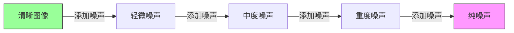
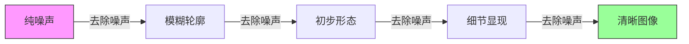
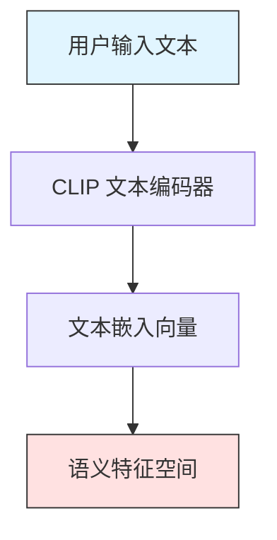
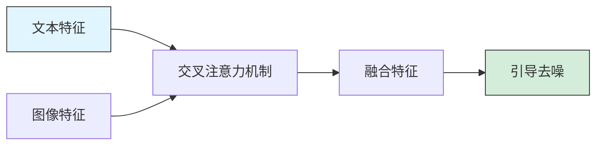
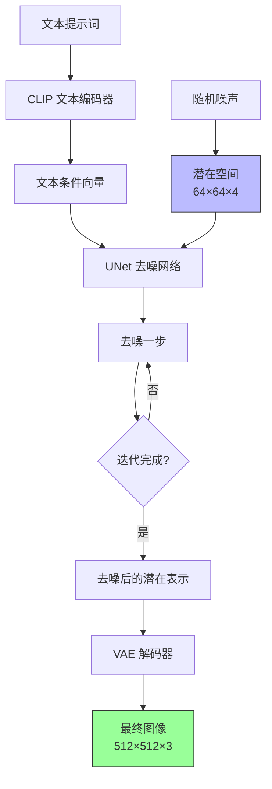
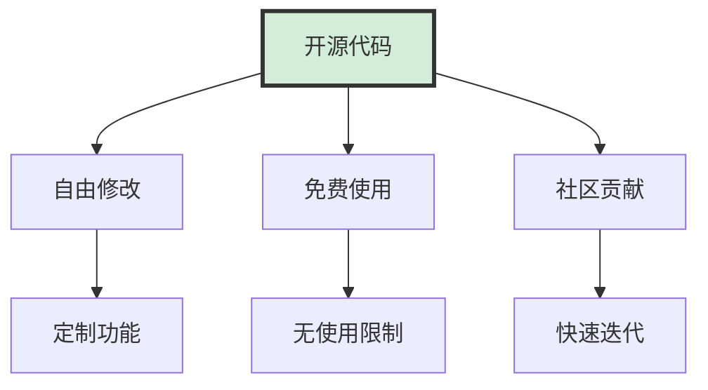
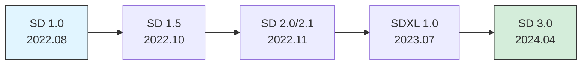

# 什么是 Stable Diffusion

## 概述

Stable Diffusion 是当前最流行的开源 AI 绘画工具之一，它能够根据文本描述自动生成高质量的图像。自 2022 年 8 月发布以来，Stable Diffusion 凭借其开源特性和强大的生成能力，迅速成为 AI 绘画领域的标杆。

**核心特点**：
- 🎨 **文本生成图像**：输入文字描述，AI 自动创作图像
- 💻 **开源免费**：完全开源，可免费使用和二次开发
- 🏠 **可本地部署**：可在个人电脑上运行，无需依赖云服务
- 🔧 **高度可控**：提供丰富的参数和插件，精确控制生成结果
- 🌍 **活跃社区**：拥有庞大的开发者和创作者社区

## 技术原理详解

### 1. 扩散模型（Diffusion Model）

扩散模型是 Stable Diffusion 的核心技术基础，它的工作原理受到物理学中扩散过程的启发。

#### 1.1 正向扩散过程

正向过程就像是"图像退化"的过程：

在这个过程中：
- 从一张清晰的图像开始
- 逐步添加高斯噪声
- 经过多次迭代后，图像变成完全的随机噪声
- 每一步添加的噪声量都是可控的

#### 1.2 反向去噪过程

反向过程是"图像生成"的关键：

在这个过程中：
- 从随机噪声开始
- 神经网络预测并去除噪声
- 逐步还原出清晰的图像
- 文本提示词引导去噪方向

**核心思想**：训练一个神经网络，让它学会如何从噪声中"猜测"原始图像应该是什么样子。

### 2. 文本到图像（Text-to-Image）

这是让 AI 能够"理解"你想要什么图像的关键技术。

#### 2.1 CLIP 文本编码

**工作流程**：
1. **输入文本**：例如 "a beautiful sunset over the ocean"
2. **文本编码**：CLIP 模型将文本转换为数学向量
3. **语义理解**：向量包含了文本的语义信息
4. **引导生成**：这个向量指导图像生成的方向

**CLIP 的优势**：
- 理解文本和图像之间的关联
- 支持自然语言描述
- 能够处理复杂的语义关系

#### 2.2 文本引导的图像生成

文本通过交叉注意力机制，在每一步去噪过程中都提供指导，确保生成的图像符合描述。

### 3. 潜在扩散（Latent Diffusion）

这是 Stable Diffusion 最关键的创新，也是它名字中 "Stable" 的来源。

#### 3.1 为什么需要潜在空间？

**传统扩散模型的问题**：
- ❌ 直接在像素空间操作
- ❌ 计算量巨大（例如 512×512 图像有 262,144 个像素）
- ❌ 需要高端 GPU 和大量显存
- ❌ 生成速度慢

**潜在扩散的解决方案**：
- ✅ 先将图像压缩到低维潜在空间
- ✅ 在压缩后的空间中进行扩散过程
- ✅ 大幅降低计算成本
- ✅ 保持高质量输出

#### 3.2 完整工作流程

**各组件详解**：

**VAE（变分自编码器）**：
- **编码器**：将 512×512×3 图像压缩为 64×64×4 潜在表示
- **压缩比例**：约为 8 倍压缩（空间维度从 512→64）
- **解码器**：将潜在表示还原为高分辨率图像
- **优势**：保留关键视觉信息，去除冗余细节

**UNet 去噪网络**：
- **架构**：U型对称结构，包含编码器和解码器
- **功能**：预测并去除噪声
- **输入**：噪声潜在表示 + 文本条件
- **输出**：去噪后的潜在表示
- **特点**：包含跳跃连接，保留细节信息

**迭代过程**：
- **步数**：通常 20-50 步
- **每步**：去除一部分噪声
- **调度器**：控制每步去噪的强度
- **引导**：文本条件在每步都参与指导

#### 3.3 潜在空间的优势

| 方面 | 像素空间扩散 | 潜在空间扩散 |
|-----|------------|------------|
| **计算量** | 极高 | 降低 8-10 倍 |
| **显存需求** | 24GB+ | 4-8GB |
| **生成速度** | 很慢 | 快 8-10 倍 |
| **硬件要求** | 企业级 GPU | 消费级 GPU |
| **图像质量** | 高 | 高（几乎无损） |

**实际意义**：
- 使得个人用户可以在家用电脑上运行
- 大幅降低了 AI 绘画的门槛
- 推动了 AI 绘画的普及和发展

## 与其他 AI 绘画工具对比

### 对比表格

| 维度 | Stable Diffusion | Midjourney | DALL-E 3 | 国产工具 |
|-----|-----------------|------------|----------|---------|
| **开源性** | ✅ 完全开源 | ❌ 闭源 | ❌ 闭源 | ❌ 多数闭源 |
| **部署方式** | ✅ 本地/云端 | ❌ 仅云端 | ❌ 仅云端 | ⚠️ 部分本地 |
| **可控性** | ⭐⭐⭐⭐⭐ | ⭐⭐⭐ | ⭐⭐ | ⭐⭐⭐ |
| **成本** | 免费（需硬件投入） | 💰 $10-60/月 | 💰 按量付费 | 💰 多数付费 |
| **扩展性** | ⭐⭐⭐⭐⭐ 插件生态丰富 | ⭐⭐ | ⭐⭐ | ⭐⭐⭐ |
| **学习曲线** | ⚠️ 较陡峭 | ✅ 简单 | ✅ 非常简单 | ✅ 简单 |
| **图像质量** | ⭐⭐⭐⭐ | ⭐⭐⭐⭐⭐ | ⭐⭐⭐⭐ | ⭐⭐⭐⭐ |
| **生成速度** | ⭐⭐⭐⭐ | ⭐⭐⭐ | ⭐⭐⭐⭐ | ⭐⭐⭐⭐ |
| **社区支持** | ⭐⭐⭐⭐⭐ | ⭐⭐⭐⭐ | ⭐⭐⭐ | ⭐⭐⭐ |
| **商业使用** | ✅ 无限制 | ⚠️ 需付费订阅 | ⚠️ 有限制 | ⚠️ 多数有限制 |
| **隐私性** | ✅ 本地无上传 | ❌ 全部云端 | ❌ 全部云端 | ⚠️ 视平台而定 |

### Stable Diffusion 的核心优势

#### 1. 开源自由

**意义**：
- 任何人都可以查看源代码
- 可以根据需求自由修改
- 不受商业公司限制
- 技术透明，可审计

#### 2. 本地部署

**优势**：
- 🔒 **隐私保护**：所有数据在本地处理，不上传云端
- 💰 **成本控制**：一次性硬件投入，无持续订阅费用
- 🚀 **无限生成**：不受次数限制，想生成多少就生成多少
- ⚡ **低延迟**：本地处理，无网络延迟

**适用场景**：
- 处理敏感或保密内容
- 大批量图像生成需求
- 长期频繁使用
- 网络环境不稳定

#### 3. 极高可控性

**控制维度**：
- 📝 **提示词控制**：精确描述想要的内容
- 🎛️ **参数调节**：采样步数、CFG Scale、种子等
- 🖼️ **图生图**：基于现有图像进行修改
- 🎨 **ControlNet**：通过边缘、姿态等精确控制
- 🔄 **局部重绘**：只修改图像的特定区域
- 🧩 **模型混合**：组合多个模型的特性

#### 4. 丰富的扩展生态

**插件类型**：
- **ControlNet**：精确控制图像结构
- **动态提示词**：随机化和组合提示词
- **批量处理**：自动化大量图像生成
- **高清修复**：提升图像分辨率和质量
- **风格转换**：在不同艺术风格间转换

**资源类型**：
- **Checkpoint 模型**：不同风格的基础模型
- **LoRA 模型**：轻量级风格和角色扩展
- **Embeddings**：特定概念和风格
- **VAE 模型**：优化色彩和细节

### 何时选择 Stable Diffusion？

**强烈推荐**：
- ✅ 你有一定的计算机使用基础
- ✅ 追求对生成结果的精确控制
- ✅ 需要长期大量使用 AI 绘画
- ✅ 希望深入学习 AI 技术原理
- ✅ 有隐私和数据安全需求
- ✅ 想要参与开源社区和二次开发

**可能不适合**：
- ❌ 完全零基础，不愿意学习
- ❌ 只是偶尔使用，不想投入硬件
- ❌ 追求最简单的使用体验
- ❌ 硬件条件不足（显存 < 4GB）

## 技术发展历程

### 版本演进

**主要版本特点**：

**SD 1.0/1.4**（2022年8月）：
- 首个公开版本
- 512×512 分辨率
- 基于 LAION-5B 数据集训练
- 开启 AI 绘画平民化时代

**SD 1.5**（2022年10月）：
- 最流行和成熟的版本
- 社区资源最丰富
- 插件和扩展最完善
- 至今仍被广泛使用

**SD 2.0/2.1**（2022年11月）：
- 支持 768×768 分辨率
- 改用 OpenCLIP 编码器
- 兼容性问题导致社区接受度有限

**SDXL 1.0**（2023年7月）：
- 支持 1024×1024 原生分辨率
- 双文本编码器架构
- 细节和质量显著提升
- 显存需求更高（8GB+推荐）

**SD 3.0**（2024年4月）：
- 引入 Diffusion Transformer 架构
- 多模态理解能力增强
- 文字渲染能力改善
- 生成质量进一步提升

## 硬件要求

### 最低配置

| 组件 | 最低要求 | 推荐配置 | 高端配置 |
|-----|---------|---------|---------|
| **GPU** | 4GB VRAM （GTX 1650） | 8GB VRAM （RTX 3060） | 12GB+ VRAM （RTX 4070+） |
| **内存** | 8GB | 16GB | 32GB |
| **存储** | 20GB 可用空间 | 100GB+ SSD | 500GB+ NVMe SSD |
| **CPU** | 4核心 | 6核心+ | 8核心+ |

### 配置与性能

**4GB 显存**（入门级）：
- ✅ 可以运行 SD 1.5
- ✅ 基础功能可用
- ⚠️ 需要优化设置（降低分辨率、减少批次）
- ⚠️ 生成速度较慢（30-60秒/张）
- ❌ 无法运行 SDXL

**8GB 显存**（主流级）：
- ✅ 流畅运行 SD 1.5
- ✅ 可运行 SDXL（需优化）
- ✅ 支持多数插件和扩展
- ✅ 合理的生成速度（10-20秒/张）

**12GB+ 显存**（专业级）：
- ✅ 完美运行所有版本
- ✅ 高分辨率生成（2K+）
- ✅ 同时使用多个模型和插件
- ✅ 快速生成（5-10秒/张）
- ✅ 批量处理

## 应用场景

### 1. 创意设计

**概念设计**：
- 快速生成多个设计方案
- 探索不同的视觉风格
- 为团队提供创意参考

**角色设计**：
- 游戏角色原画
- 动画人物设定
- 小说角色可视化

**场景设计**：
- 游戏场景概念图
- 影视场景预览
- 建筑可视化

### 2. 商业应用

**营销物料**：
- 社交媒体配图
- 广告创意素材
- 品牌视觉设计

**电商设计**：
- 产品场景图
- 营销海报
- 详情页素材

**内容创作**：
- 自媒体配图
- 文章封面
- 视频缩略图

### 3. 艺术创作

**数字艺术**：
- 探索新的艺术风格
- 创作独特的艺术作品
- 参与艺术展览

**插画**：
- 儿童绘本
- 漫画创作
- 概念插画

### 4. 学习研究

**技术学习**：
- 理解深度学习原理
- 研究生成模型
- 探索 AI 应用

**艺术教育**：
- 理解构图和色彩
- 学习不同艺术风格
- 提升审美能力

## 常见问题

### Q1: Stable Diffusion 生成的图像有版权吗？

**答**：这是一个复杂的法律问题，目前各国立场不一：

- **工具提供方**：Stability AI 声明生成图像的版权归使用者
- **训练数据**：模型使用公开数据集训练，存在争议
- **商业使用**：建议咨询法律专业人士
- **安全做法**：可以将生成图像作为参考，再进行人工创作

### Q2: 需要编程基础吗？

**答**：取决于你的使用方式：

- **基础使用**：❌ 不需要，使用 WebUI 界面即可
- **高级功能**：⚠️ 需要一定计算机基础
- **插件开发**：✅ 需要 Python 编程知识
- **模型训练**：✅ 需要深度学习知识

### Q3: 可以在 Mac 上运行吗?

**答**：可以，但有限制：

- **M1/M2/M3 芯片**：✅ 支持，但性能不如同级别 NVIDIA GPU
- **Intel Mac**：⚠️ 性能较差，不推荐
- **显存共享**：Mac 使用统一内存，16GB 内存推荐
- **安装方式**：支持 WebUI 和其他前端

### Q5: 学习周期需要多久？

**时间估算**：

- **基础上手**：1-2 周（能生成基本图像）
- **熟练使用**：1-2 月（掌握提示词和参数）
- **进阶应用**：3-6 月（使用 ControlNet 等高级功能）
- **专业水平**：6-12 月（模型训练和深度定制）

**建议**：
- 每天投入 1-2 小时练习
- 多看优秀作品，分析提示词
- 参与社区交流
- 循序渐进，不要急于求成

## 总结

Stable Diffusion 代表了 AI 绘画技术的一次重大突破，它通过巧妙的技术设计（潜在扩散）和开源策略，将原本只有大公司才能使用的技术普及到了个人用户。

**核心价值**：
- 🎨 **技术创新**：潜在扩散大幅降低计算成本
- 🌍 **开源精神**：推动 AI 技术民主化
- 🔧 **高度灵活**：满足从业余到专业的各种需求
- 📚 **学习价值**：理解前沿 AI 技术的绝佳机会

**适合人群**：
- 设计师和创意工作者
- 内容创作者
- AI 技术学习者
- 对艺术创作感兴趣的人

无论你是想要使用 AI 辅助创作，还是想要深入学习 AI 技术，Stable Diffusion 都是一个值得探索的强大工具。随着技术的不断发展，它的能力还在持续提升，现在正是入门的好时机。

> 💡 **关键启示**：Stable Diffusion 不仅是一个工具,更是理解现代 AI 技术的窗口。通过学习它，你将获得对生成式 AI 的深入理解。

> 🎯 **记住**：好的工具只是起点，创意和审美才是创作的核心。AI 是辅助，人类创造力才是主导。
