# Stable Diffusion 核心概念详解

## 前言

要熟练使用 Stable Diffusion，理解其核心概念是必不可少的。本文将详细讲解 Stable Diffusion 生态系统中的各个核心组件，帮助你从零开始建立完整的知识体系。

**学完本文你将掌握**：
- 🎯 各种模型类型的区别和使用场景
- 📝 如何编写有效的提示词
- ⚙️ 核心参数的含义和调节方法
- 🔄 完整的图像生成工作流程
- 💡 实用的技巧和最佳实践

## 一、基础术语详解

### 1.1 Prompt（提示词）

#### 什么是 Prompt？

Prompt 是你对 AI 描述想要生成图像的文本输入，它是与 AI 沟通的语言。好的 prompt 能够精确地引导 AI 生成符合预期的图像。

#### Prompt 的基本结构

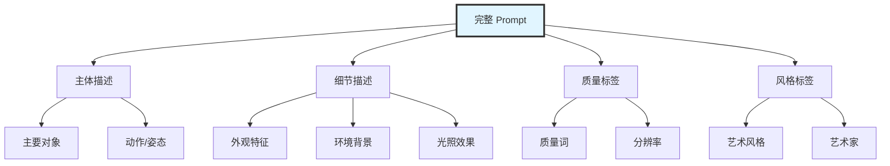

#### Prompt 编写范式

**基础格式**：
```
[质量标签], [主体], [细节], [环境], [光照], [风格]
```

**示例 1 - 人物肖像**：
```
masterpiece, best quality,
1girl, long flowing hair, blue eyes, gentle smile,
wearing white dress, standing in a garden,
soft natural lighting, golden hour,
photorealistic, detailed, 8k
```

**拆解说明**：
- `masterpiece, best quality` - 质量标签，提升整体质量
- `1girl` - 主体，指定一个女性角色
- `long flowing hair, blue eyes, gentle smile` - 外观细节
- `wearing white dress` - 服装描述
- `standing in a garden` - 环境背景
- `soft natural lighting, golden hour` - 光照效果
- `photorealistic, detailed, 8k` - 风格和质量

**示例 2 - 场景画面**：
```
best quality, highly detailed,
ancient Chinese temple, red pillars, golden roof,
surrounded by cherry blossom trees,
mountains in the background, misty atmosphere,
sunrise, warm light, cinematic composition,
concept art style, trending on artstation
```

#### Prompt 编写技巧

**1. 权重控制**

使用括号调整词语的重要性：

```
(word)          # 权重 1.1
((word))        # 权重 1.21
(word:1.5)      # 权重 1.5
[word]          # 权重 0.9
```

**实际应用**：
```
(beautiful face:1.3), detailed eyes, ((masterpiece)), [background]
```
- `beautiful face` 权重提升到 1.3
- `masterpiece` 权重提升到 1.21
- `background` 权重降低到 0.9

**2. 顺序很重要**

AI 对前面的词汇关注度更高：

```
✅ 好的顺序：
1girl, beautiful face, long hair, blue eyes, ...

❌ 不好的顺序：
... blue eyes, long hair, beautiful face, 1girl
```

**3. 使用逗号分隔**

每个概念用逗号分隔，让 AI 更好理解：

```
✅ 推荐：
red dress, long sleeves, white collar

❌ 不推荐：
red dress with long sleeves and white collar
```

**4. 具体 > 笼统**

越具体的描述，效果越可控：

```
✅ 具体：
Victorian era ballroom, crystal chandelier, marble floor,
elegant couples dancing waltz

❌ 笼统：
beautiful fancy room with people dancing
```

#### 常用 Prompt 模板

**人物肖像模板**：
```
[quality], [number]girl/boy, [age],
[hair: color + length + style], [eyes: color + expression],
[face: features], [expression],
[clothing: type + color + details],
[pose/action],
[background: location + details],
[lighting: type + mood],
[style: artistic style]
```

**场景风景模板**：
```
[quality], [location type],
[main elements: buildings/nature],
[atmosphere: weather + time],
[foreground elements],
[middle ground elements],
[background elements],
[lighting: direction + quality],
[color palette],
[artistic style]
```

**概念艺术模板**：
```
[quality], concept art,
[subject: character/vehicle/creature],
[key features],
[design elements],
[materials and textures],
[mood and atmosphere],
[artist style reference],
professional, trending on artstation
```

### 1.2 Negative Prompt（负面提示词）

#### 什么是 Negative Prompt？

Negative Prompt 告诉 AI 你**不想要**在图像中出现的元素。它可以有效避免常见问题，提升图像质量。

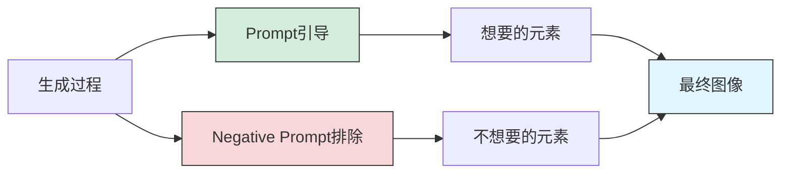

#### 常用 Negative Prompt

**基础质量排除**：
```
low quality, worst quality, lowres,
blurry, out of focus, bad anatomy,
ugly, bad proportions, deformed,
poorly drawn, bad composition
```

**人物常见问题排除**：
```
bad hands, missing fingers, extra fingers, fused fingers,
bad feet, extra limbs, missing limbs,
long neck, distorted face, asymmetric eyes,
cross-eyed, lazy eye,
bad teeth, open mouth (如果不想要张嘴)
```

**技术瑕疵排除**：
```
watermark, signature, text, logo, artist name,
jpeg artifacts, compression artifacts,
oversaturated, undersaturated,
overexposed, underexposed
```

**风格排除**：
```
cartoon, anime (如果要写实风格),
photorealistic (如果要二次元风格),
3d render, cgi (如果要手绘风格)
```

#### 完整的 Negative Prompt 模板

**通用模板**：
```
(worst quality:1.4), (low quality:1.4), (normal quality:1.4),
lowres, bad anatomy, bad hands, text, error, missing fingers,
extra digit, fewer digits, cropped, worst quality, low quality,
normal quality, jpeg artifacts, signature, watermark, username,
blurry, bad feet, ugly, duplicate, morbid, mutilated,
extra fingers, mutated hands, poorly drawn hands, poorly drawn face,
mutation, deformed, bad anatomy, bad proportions, extra limbs,
cloned face, disfigured, gross proportions, malformed limbs,
missing arms, missing legs, extra arms, extra legs
```

**写实风格专用**：
```
(添加通用模板) +
cartoon, anime, illustration, painting, drawing, 3d, render,
unrealistic, fantasy, fake
```

**二次元风格专用**：
```
(添加通用模板) +
realistic, photorealistic, photo, real life,
3d, cgi, render, sketch
```

### 1.3 Checkpoint（检查点模型）

#### 什么是 Checkpoint？

Checkpoint 是完整训练好的 Stable Diffusion 基础模型，决定了生成图像的基本风格和质量。它是整个生成系统的核心。

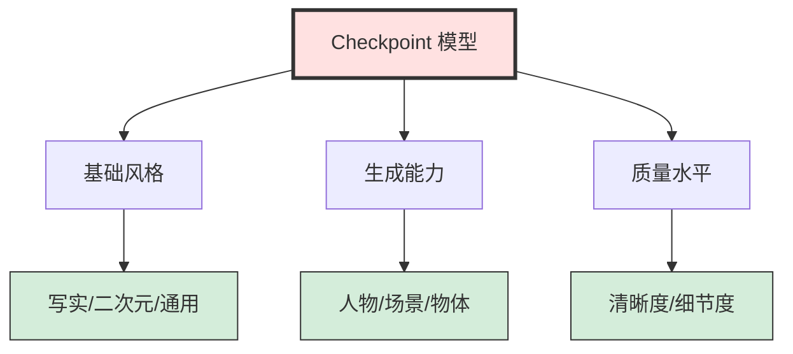

#### Checkpoint 的分类

**按风格分类**：

| 类型 | 特点 | 适用场景 | 代表模型 |
|-----|------|---------|---------|
| **写实模型** | 生成真实照片风格 | 人像摄影、商业广告 | Realistic Vision、ChilloutMix |
| **二次元模型** | 生成动漫风格 | 插画、游戏原画 | Anything、AbyssOrangeMix |
| **2.5D 模型** | 介于写实和二次元之间 | 游戏角色、概念设计 | Counterfeit、MeinaMix |
| **通用模型** | 可生成多种风格 | 实验和探索 | SD 1.5、SDXL Base |
| **艺术模型** | 特定艺术风格 | 艺术创作 | DreamShaper、Protogen |

**按版本分类**：

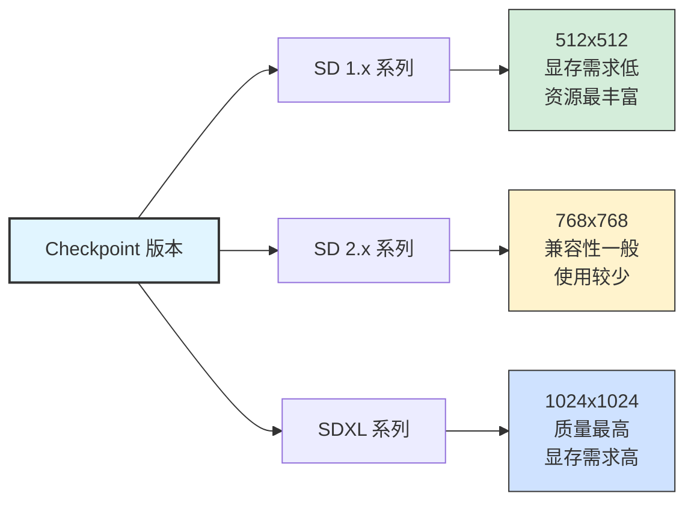

#### 文件格式

**两种主要格式**：

| 格式 | 扩展名 | 特点 | 安全性 | 加载速度 |
|-----|-------|------|-------|---------|
| **Checkpoint** | `.ckpt` | 传统格式，基于 PyTorch | ⚠️ 可能包含恶意代码 | 较慢 |
| **SafeTensors** | `.safetensors` | 新格式，更安全 | ✅ 只包含权重数据 | 快 |

**推荐**：优先使用 `.safetensors` 格式，更安全且加载更快。

#### 如何选择 Checkpoint？

**选择流程**：

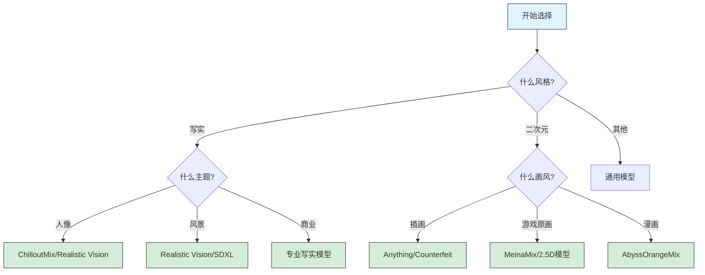

**新手推荐模型**：

**写实方向**：
- ✅ **Realistic Vision V5.1** - 综合表现优秀，易上手
- ✅ **DreamShaper** - 平衡质量和多样性
- ✅ **ChilloutMix** - 亚洲人像专长

**二次元方向**：
- ✅ **Anything V5** - 最流行的二次元模型
- ✅ **Counterfeit V3** - 2.5D 风格，可塑性强
- ✅ **MeinaMix** - 高质量游戏风格

**通用方向**：
- ✅ **SD 1.5** - 官方基础模型，兼容性最好
- ✅ **SDXL 1.0** - 新一代，质量更高

### 1.4 VAE（变分自编码器）

#### 什么是 VAE？

VAE（Variational Autoencoder）是负责图像编码和解码的关键组件，影响图像的色彩、对比度和细节表现。

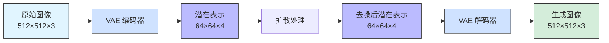

#### VAE 的作用

**1. 编码过程**：
- 将高分辨率图像（512×512）压缩到低维潜在空间（64×64）
- 压缩比约为 8:1
- 保留关键视觉信息，去除冗余

**2. 解码过程**：
- 将潜在表示还原为高分辨率图像
- 决定最终图像的色彩和细节
- 影响图像的整体视觉效果

#### 常用 VAE 模型

| VAE 模型 | 适用版本 | 特点 | 推荐场景 |
|---------|---------|------|---------|
| **vae-ft-mse-840000** | SD 1.4/1.5 | 色彩鲜艳，细节丰富 | ✅ 最常用 |
| **vae-ft-ema-560000** | SD 1.4/1.5 | 色彩平衡，稳定性好 | 备选方案 |
| **sdxl.vae** | SDXL | SDXL 专用 | SDXL 必备 |
| **Anything VAE** | Anything 系列 | 二次元优化 | 二次元模型 |
| **kl-f8-anime2** | 通用 | 二次元专用 | 动漫风格 |

#### VAE 问题诊断

**问题 1：图像发灰、对比度低**

```
原因：使用了不合适的 VAE 或没有使用 VAE
解决：添加 vae-ft-mse-840000.vae
```

**问题 2：色彩过于饱和**

```
原因：VAE 设置不当
解决：尝试切换到 vae-ft-ema-560000.vae
```

**问题 3：细节模糊**

```
原因：VAE 与模型不匹配
解决：使用模型推荐的 VAE
```

#### VAE 使用建议

**最佳实践**：

1. **检查模型说明**：
   - 很多 Checkpoint 已经内置了 VAE
   - 查看模型页面的说明文档
   - 避免重复加载 VAE

2. **SD 1.5 标准配置**：
   ```
   Checkpoint: 任意 SD 1.5 模型
   VAE: vae-ft-mse-840000.safetensors
   ```

3. **SDXL 标准配置**：
   ```
   Checkpoint: 任意 SDXL 模型
   VAE: sdxl.vae.safetensors (通常已内置)
   ```

4. **二次元模型配置**：
   ```
   Checkpoint: Anything/Counterfeit 等
   VAE: kl-f8-anime2.vae 或模型内置 VAE
   ```

### 1.5 LoRA（低秩适应）

#### 什么是 LoRA？

LoRA（Low-Rank Adaptation）是一种轻量级的模型微调技术，可以在不修改基础模型的情况下，添加特定的风格、角色或概念。

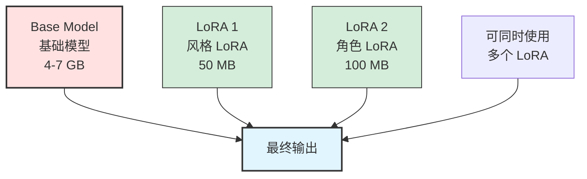

#### LoRA 的优势

| 特性 | Checkpoint | LoRA |
|-----|-----------|------|
| **文件大小** | 2-7 GB | 10-200 MB |
| **训练成本** | 高（需要大量资源） | 低（个人可完成） |
| **灵活性** | 单一风格 | 可叠加使用 |
| **切换成本** | 高（重新加载） | 低（快速切换） |
| **训练时间** | 数天到数周 | 数小时到数天 |
| **显存需求** | 完整显存 | 额外需求小 |

#### LoRA 的分类

**1. 角色 LoRA（Character LoRA）**

用于生成特定角色的外观：

```
示例：
- 游戏角色（云、2B、琴等）
- 动漫角色（初音未来、路飞等）
- 虚拟主播（Gura、Pekora等）
- 真实人物（需注意使用规范）
```

**使用示例**：
```
<lora:character_miku:0.8>, 1girl, hatsune miku,
twin tails, aqua hair, aqua eyes,
singing on stage, spotlight
```

**2. 风格 LoRA（Style LoRA）**

用于应用特定的艺术风格：

```
示例：
- 艺术家风格（宫崎骏、新海诚）
- 艺术流派（印象派、赛博朋克）
- 媒介风格（水彩、油画、素描）
- 时代风格（复古、未来）
```

**使用示例**：
```
<lora:ghibli_style:0.7>,
beautiful countryside, rolling hills,
warm colors, peaceful atmosphere,
studio ghibli style
```

**3. 概念 LoRA（Concept LoRA）**

用于添加特定概念或元素：

```
示例：
- 特效（光效、粒子效果）
- 服装（汉服、洛丽塔）
- 姿势（瑜伽、武术动作）
- 视角（鱼眼、广角）
```

**使用示例**：
```
<lora:hanfu:0.6>, 1girl,
traditional Chinese hanfu, flowing sleeves,
embroidered patterns, elegant
```

**4. 工具 LoRA（Tool LoRA）**

提供特定功能：

```
示例：
- 细节增强（add_detail）
- 光照控制（lighting_lora）
- 手部修复（hand_fix）
- 线稿生成（lineart）
```

#### LoRA 使用语法

**基础语法**：
```
<lora:lora_name:weight>
```

**参数说明**：
- `lora_name`：LoRA 文件名（不含扩展名）
- `weight`：权重值，范围通常 0-1.5
  - `0.5-0.7`：轻微影响
  - `0.7-1.0`：标准影响
  - `1.0-1.5`：强烈影响

**多个 LoRA 叠加**：
```
<lora:style_anime:0.8> <lora:character_miku:0.7> <lora:add_detail:0.5>,
1girl, hatsune miku, beautiful detailed face
```

#### LoRA 使用技巧

**1. 权重调节**

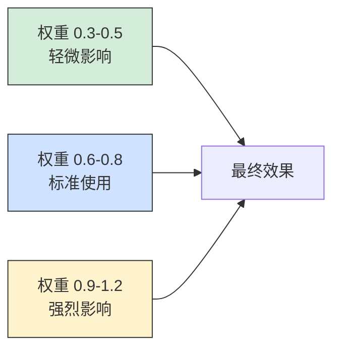

**推荐起始权重**：
- 角色 LoRA：0.7-0.9
- 风格 LoRA：0.5-0.7
- 概念 LoRA：0.4-0.6
- 细节 LoRA：0.3-0.5

**2. 避免过度叠加**

```
✅ 合理：2-3 个 LoRA
<lora:style:0.7> <lora:character:0.8> <lora:detail:0.4>

⚠️ 谨慎：4-5 个 LoRA
可能导致风格冲突

❌ 避免：6+ 个 LoRA
几乎肯定会出问题
```

**3. LoRA 冲突处理**

当多个 LoRA 产生冲突时：

1. **降低权重**：将冲突的 LoRA 权重降低
2. **移除冲突项**：去掉不必要的 LoRA
3. **调整顺序**：重要的 LoRA 放在前面
4. **使用 Negative Prompt**：排除不想要的特征

### 1.6 Embeddings / Textual Inversion

#### 什么是 Embeddings？

Embeddings（文本嵌入）是一种将特定概念、风格或对象编码为文本向量的技术，使用时就像普通词汇一样添加到 prompt 中。

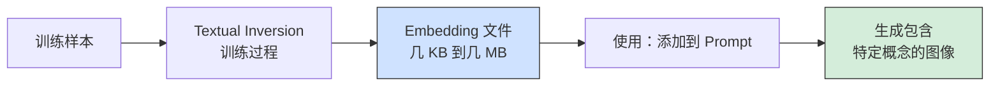

#### Embeddings 的特点

| 特性 | Embeddings | LoRA | Checkpoint |
|-----|-----------|------|-----------|
| **文件大小** | 几 KB - 几 MB | 10-200 MB | 2-7 GB |
| **训练难度** | ⭐ 简单 | ⭐⭐⭐ 中等 | ⭐⭐⭐⭐⭐ 困难 |
| **表达能力** | ⭐⭐ 有限 | ⭐⭐⭐⭐ 强 | ⭐⭐⭐⭐⭐ 最强 |
| **使用方式** | 直接写入 Prompt | 特殊语法 | 作为基础模型 |
| **资源消耗** | 几乎无 | 很小 | 大 |

#### Embeddings 的用途

**1. Negative Embeddings**

最常见的用途是作为负面提示词：

```
常用 Negative Embeddings：
- EasyNegative：通用负面词集合
- bad_prompt：排除常见问题
- ng_deepnegative_v1_75t：深度负面优化
- badhandv4：手部问题修复
```

**使用方式**：
```
Prompt: beautiful girl, detailed face
Negative Prompt: EasyNegative, bad_prompt, badhandv4
```

**2. 风格 Embeddings**

表示特定艺术风格或艺术家：

```
风格 Embeddings 示例：
- studio_ghibli
- cyberpunk_style
- oil_painting
- watercolor
```

**3. 概念 Embeddings**

表示特定对象或概念：

```
概念 Embeddings 示例：
- specific_character（特定角色）
- pose_sitting（坐姿）
- lighting_golden_hour（黄金时刻光照）
```

#### 使用方法

**基础语法**：

直接在 Prompt 中写入 Embedding 名称：

```
Positive Prompt:
masterpiece, best quality, embedding_name, 1girl

Negative Prompt:
EasyNegative, bad_prompt
```

**推荐配置**：

```
标准 Negative Embeddings 组合：
EasyNegative, ng_deepnegative_v1_75t, badhandv4, bad_prompt

适用于：
- 人物生成
- 提升整体质量
- 减少常见错误
```

## 二、核心参数详解

### 2.1 采样方法（Sampler）

#### 什么是采样方法？

采样方法决定了从噪声到清晰图像的去噪路径和策略，不同的采样器有不同的速度和质量特征。

#### 常用采样器对比

| 采样器 | 速度 | 质量 | 特点 | 推荐步数 |
|-------|------|------|------|---------|
| **Euler a** | ⭐⭐⭐⭐ | ⭐⭐⭐ | 创意性强，不稳定 | 20-30 |
| **Euler** | ⭐⭐⭐⭐ | ⭐⭐⭐ | 快速，稳定 | 20-30 |
| **DPM++ 2M Karras** | ⭐⭐⭐ | ⭐⭐⭐⭐⭐ | 质量高，推荐 | 20-30 |
| **DPM++ SDE Karras** | ⭐⭐ | ⭐⭐⭐⭐⭐ | 质量最高，慢 | 25-35 |
| **DDIM** | ⭐⭐⭐⭐ | ⭐⭐⭐ | 可预测性强 | 30-50 |
| **UniPC** | ⭐⭐⭐⭐⭐ | ⭐⭐⭐⭐ | 速度快，质量好 | 15-25 |

**推荐选择**：

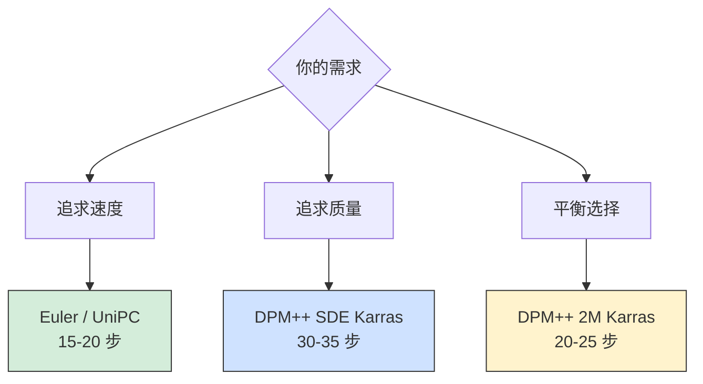

### 2.2 采样步数（Sampling Steps）

#### 作用

采样步数决定了去噪的迭代次数，步数越多，图像越精细，但生成时间也越长。

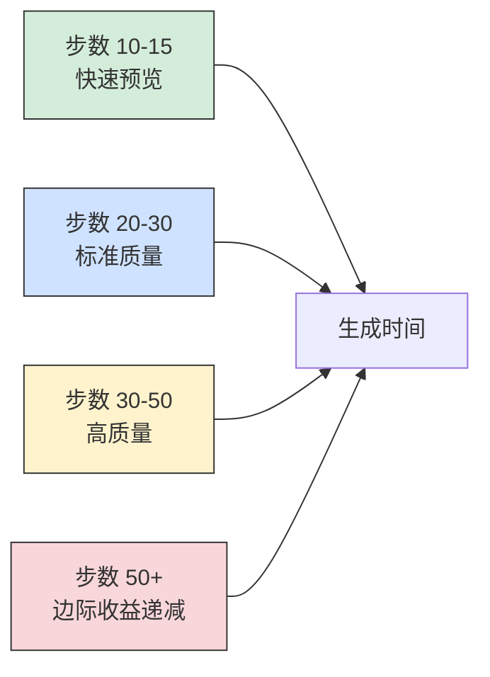

**推荐设置**：

| 用途 | 推荐步数 | 说明 |
|-----|---------|------|
| **快速测试** | 15-20 | 查看大致效果 |
| **日常使用** | 20-30 | 平衡质量和速度 |
| **精细作品** | 30-40 | 追求细节 |
| **不推荐** | 50+ | 收益很小，浪费时间 |

### 2.3 CFG Scale（提示词相关性）

#### 什么是 CFG Scale？

CFG（Classifier-Free Guidance）Scale 控制生成图像与提示词的匹配程度。

**数值影响**：

| 范围 | 效果 | 适用场景 |
|-----|------|---------|
| **3-5** | 创意性强，可能偏离提示词 | 艺术创作，探索风格 |
| **7-9** | 标准范围，平衡创意和遵循 | ✅ 日常使用 |
| **10-15** | 严格遵循提示词 | 精确控制，商业用途 |
| **15+** | 过度饱和，细节失真 | ❌ 不推荐 |

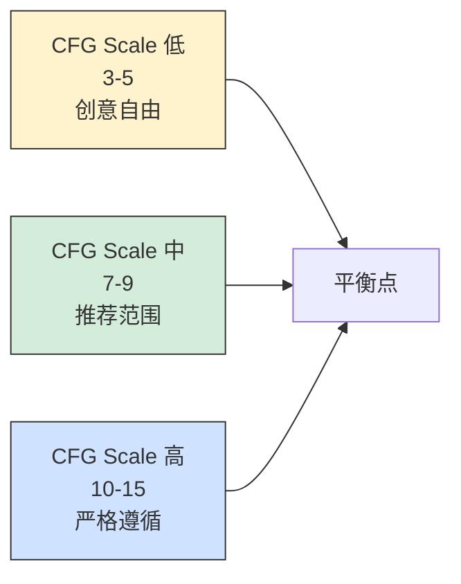

**推荐设置**：
- 写实风格：7-11
- 二次元风格：5-9
- 艺术创作：5-8
- 精确控制：9-13

### 2.4 Seed（随机种子）

#### 什么是 Seed？

Seed 是随机数生成器的初始值，相同的 seed + 相同的设置 = 相同的图像。

**用途**：

1. **复现结果**：
   ```
   使用固定 seed 可以：
   - 生成完全相同的图像
   - 只改变部分参数进行对比测试
   - 分享给他人复现你的作品
   ```

2. **迭代优化**：
   ```
   固定 seed，逐步调整：
   - Prompt
   - CFG Scale
   - 采样步数
   - LoRA 权重
   ```

3. **批量生成**：
   ```
   设置 seed = -1（随机）：
   - 每次生成不同结果
   - 探索更多可能性
   ```

**最佳实践**：

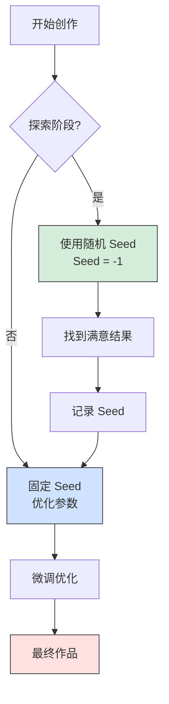

### 2.5 分辨率（Resolution）

#### 推荐分辨率

**SD 1.5 模型**：

| 用途 | 分辨率 | 宽高比 | 显存需求 |
|-----|--------|--------|---------|
| **标准** | 512×512 | 1:1 | 4GB |
| **竖屏** | 512×768 | 2:3 | 5GB |
| **横屏** | 768×512 | 3:2 | 5GB |
| **宽屏** | 768×432 | 16:9 | 4.5GB |

**SDXL 模型**：

| 用途 | 分辨率 | 宽高比 | 显存需求 |
|-----|--------|--------|---------|
| **标准** | 1024×1024 | 1:1 | 8GB |
| **竖屏** | 832×1216 | 2:3 | 9GB |
| **横屏** | 1216×832 | 3:2 | 9GB |
| **宽屏** | 1344×768 | 16:9 | 8.5GB |

**重要提示**：

```
⚠️ 不要使用非训练分辨率！

SD 1.5 在 512×512 训练：
✅ 512×512, 512×768, 768×512
❌ 800×800, 1024×1024 (会导致画面重复、变形)

SDXL 在 1024×1024 训练：
✅ 1024×1024, 832×1216, 1216×832
❌ 512×512 (浪费模型能力)
```

## 三、完整工作流程

### 3.1 文生图（Text-to-Image）工作流

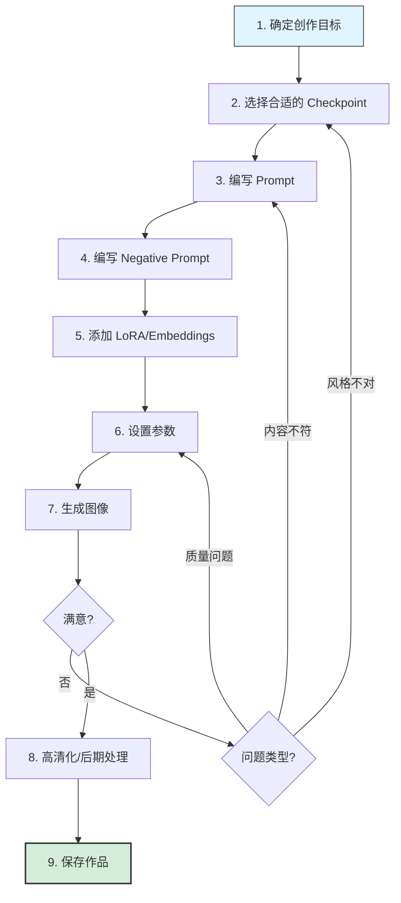

### 3.2 推荐参数配置

**新手友好配置**：

```
Checkpoint: Anything V5 (二次元) 或 Realistic Vision (写实)
Sampler: DPM++ 2M Karras
Steps: 25
CFG Scale: 7
Seed: -1 (随机)
Resolution: 512×512 (SD 1.5) 或 1024×1024 (SDXL)
VAE: 自动或 vae-ft-mse-840000
```

**高质量配置**：

```
Checkpoint: 根据需求选择专业模型
Sampler: DPM++ SDE Karras
Steps: 30-35
CFG Scale: 9-11
Seed: 固定 (迭代优化时)
Resolution: 适合模型的标准分辨率
VAE: 匹配模型的推荐 VAE
LoRA: 2-3 个相关 LoRA, 权重 0.6-0.8
Hires fix: 启用, 放大倍率 1.5-2.0
```

## 四、常见问题排查

### 问题诊断流程

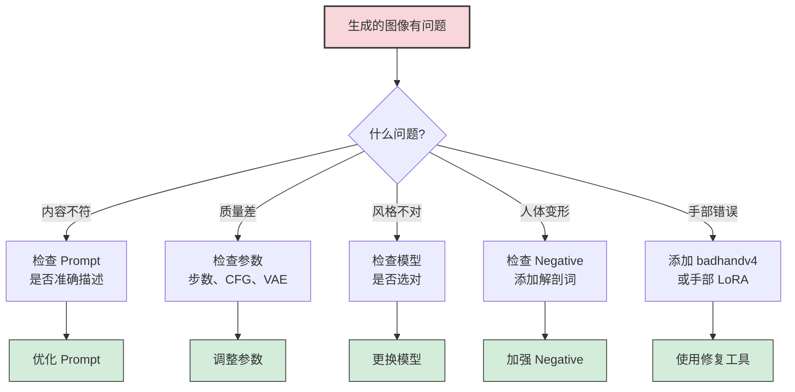

### 常见问题解决方案

| 问题 | 可能原因 | 解决方案 |
|-----|---------|---------|
| **画面模糊** | 步数太少、分辨率不当 | 增加步数到 25+，使用标准分辨率 |
| **色彩发灰** | 没有使用 VAE | 添加 vae-ft-mse-840000 |
| **内容不符** | Prompt 不准确、CFG 太低 | 优化 Prompt，提高 CFG 到 8-10 |
| **过度饱和** | CFG 太高 | 降低 CFG 到 7-9 |
| **手部畸形** | 模型通病 | 添加 badhandv4，使用 Inpaint 修复 |
| **重复元素** | 分辨率不当 | 使用模型训练的标准分辨率 |
| **风格混乱** | LoRA 冲突 | 减少 LoRA 数量，降低权重 |

## 五、进阶技巧

### 5.1 提示词模板库

**人物肖像高质量模板**：

```
(masterpiece:1.2), (best quality:1.2), (ultra detailed:1.2),
(photorealistic:1.4), (8k:1.1),
1girl, [age descriptor], [ethnicity if needed],
[hair: color, length, style], [eyes: color, expression],
[detailed face: skin texture, facial features],
[expression: smiling/serious/etc],
[clothing: detailed description],
[pose: specific pose description],
[setting: detailed environment],
[lighting: type and mood],
professional photography, bokeh, depth of field,
shot on [camera model], [lens type]
```

**场景风景高质量模板**：

```
(masterpiece:1.2), (best quality:1.2), (highly detailed:1.2),
[time of day], [weather condition],
[main subject: landscape type],
[foreground elements: detailed description],
[middle ground: composition elements],
[background: distant elements],
[lighting: natural/dramatic/etc],
[color palette: dominant colors],
[atmosphere: mood description],
cinematic composition, professional photography,
trending on artstation, award winning
```

### 5.2 权重组合技巧

**渐进权重**：

```
对于复杂场景，使用渐进权重：

((主要元素:1.4)), (重要元素:1.2), 普通元素, [次要元素:0.8]

示例：
((beautiful detailed face:1.4)), (elegant dress:1.2),
jewelry, flowers, [background:0.8]
```

**对比权重**：

```
突出主体，弱化背景：

(((main subject:1.5))), detailed, [background:0.7], [environment:0.6]
```

### 5.3 批量生成策略

**探索阶段**：

```
设置：
- Batch size: 4-8
- Seed: -1 (随机)
- Steps: 20 (快速)
- 快速生成多个选项
```

**优化阶段**：

```
设置：
- Batch size: 1
- Seed: 固定
- Steps: 30-35 (高质量)
- 精细调整参数
```

## 总结

掌握 Stable Diffusion 的核心概念是创作高质量 AI 图像的基础。通过本文，你应该已经理解了：

**关键要点**：
- ✅ **模型选择**：Checkpoint 决定基础风格，LoRA 添加特色
- ✅ **提示词技巧**：详细、具体、有结构的 Prompt 效果最好
- ✅ **参数调节**：不同参数影响不同方面，需要平衡
- ✅ **工作流程**：遵循科学的流程，逐步优化
- ✅ **问题解决**：识别问题类型，针对性解决

**学习建议**：

1. **从简单开始**：先用基础配置生成图像
2. **逐个实验**：每次只改变一个参数，观察效果
3. **记录心得**：记录有效的配置和技巧
4. **参考优秀作品**：学习他人的 Prompt 和参数
5. **持续实践**：多生成，多总结，多改进

记住：工具只是辅助，创意和审美才是核心。祝你在 AI 绘画的道路上不断进步！

---

> 💡 **关键启示**：理解原理比记住参数更重要。当你理解了每个概念的作用，就能灵活应对各种创作需求。