# AI 绘画的应用场景

## 前言

AI 绘画技术正在深刻改变创意产业的工作方式。从个人创作者到大型企业，越来越多的人开始将 AI 绘画融入到日常工作流程中。本文将全面介绍 Stable Diffusion 在各个领域的实际应用，并提供可操作的实施方案。

**本文内容**：
- 创作领域的深度应用
- 商业场景的实战案例
- 个人使用的创意玩法
- 各行业的最佳实践
- 实施建议和注意事项

## 应用场景总览

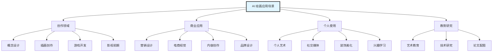

## 一、创作领域应用

### 1.1 概念设计

#### 应用价值

概念设计是创意项目的起点，AI 绘画可以极大提升概念设计的效率和探索空间。

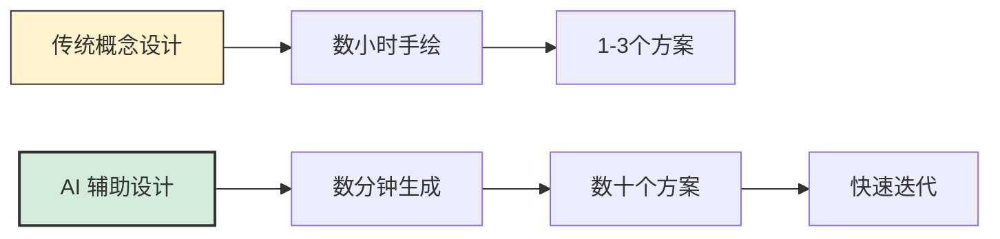

**传统 vs AI 辅助**：

| 维度 | 传统方式 | AI 辅助方式 | 提升倍数 |
|-----|---------|------------|---------|
| **时间成本** | 2-8 小时/方案 | 5-15 分钟/方案 | 10-20倍 ⬆️ |
| **方案数量** | 2-5 个 | 20-100 个 | 10-50倍 ⬆️ |
| **探索空间** | 受限于个人风格 | 海量风格探索 | 无限 ⬆️ |
| **修改成本** | 高（重画） | 低（调参） | 5-10倍 ⬇️ |
| **细节精度** | 高（手工） | 需人工精修 | - |

#### 实际应用场景

**1. 角色设计**

**工作流程**：
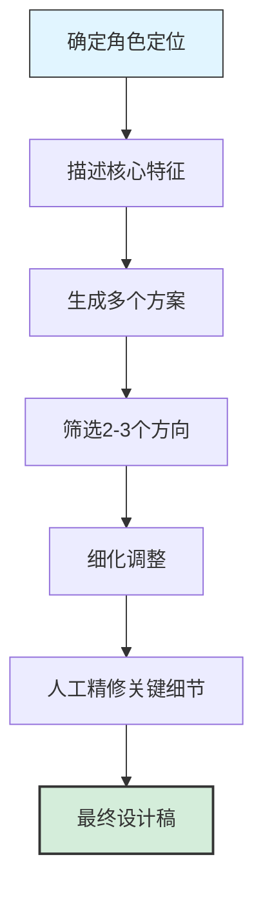

**Prompt 示例**：

```
角色：科幻战士

基础版本：
sci-fi warrior, futuristic armor, helmet with visor,
energy weapon, standing pose, full body,
concept art, professional, detailed

探索变体：
版本A（重装）：
heavy armor, bulky design, mechanical details,
(massive:1.3), powerful, intimidating

版本B（轻装）：
sleek armor, agile design, streamlined,
(lightweight:1.3), fast, nimble

版本C（混合）：
balanced design, modular armor, tactical gear,
versatile, practical
```

**实施建议**：

1. **第一阶段：广泛探索**
   - 生成 30-50 个不同方案
   - 尝试不同风格和流派
   - 使用随机 Seed
   - 快速参数（20步，CFG 7）

2. **第二阶段：方向确定**
   - 筛选 3-5 个有潜力的方向
   - 固定 Seed，调整细节
   - 使用 LoRA 强化特征
   - 提高质量参数（30步，CFG 9）

3. **第三阶段：精细化**
   - 局部重绘优化细节
   - ControlNet 控制姿态
   - 高清化处理
   - 导入 PS/Blender 精修

**2. 场景设计**

**应用类型**：
- 游戏关卡设计
- 影视场景概念
- 建筑可视化
- 展览空间设计

**Prompt 模板**：

```
环境类型：奇幻森林

(best quality:1.2), environment concept art,
ancient magical forest, giant trees with glowing runes,
ethereal mist, floating islands in the background,
bioluminescent plants, mysterious atmosphere,
fantasy style, cinematic lighting,
wide angle shot, epic scale,
trending on artstation, professional concept art

色彩方案可选：
- 暖色调：golden hour, warm lighting, amber tones
- 冷色调：moonlight, cool tones, blue and purple palette
- 对比色：dramatic lighting, high contrast, vibrant colors
```

**3. 产品设计**

**应用领域**：
- 工业设计外观
- 包装设计概念
- UI/UX 视觉探索
- 家具设计方案

**工作流程示例（智能手表设计）**：

```
第一轮：风格探索
futuristic smartwatch, sleek design, premium materials,
[style]: minimalist / luxury / sporty / tech-focused

第二轮：细节定义
smartwatch with [specific features],
[material]: titanium / ceramic / carbon fiber,
[display]: circular / rectangular / edge-to-edge,
[band]: metal / leather / fabric

第三轮：场景展示
smartwatch product photography, studio lighting,
on wrist, lifestyle shot, professional presentation
```

#### 成功案例分析

**案例1：独立游戏《幻境旅人》角色设计**

- **背景**：3人独立团队，预算有限
- **AI 应用**：使用 SD 生成 100+ 角色概念
- **成果**：
  - 设计阶段从 2 个月缩短到 2 周
  - 探索了 20+ 种风格方向
  - 最终采用 AI 生成 + 人工精修的 12 个角色
- **节省成本**：约 ¥50,000（外包设计费用）

**案例2：建筑事务所场景可视化**

- **背景**：需要为客户展示多种设计方案
- **AI 应用**：ControlNet + 线稿生成场景
- **成果**：
  - 方案展示从 1 周缩短到 1 天
  - 客户满意度提升 40%
  - 中标率提高 25%

### 1.2 插画创作

#### 应用价值

AI 绘画为插画师提供了强大的辅助工具，既能提升效率，又能激发创意。

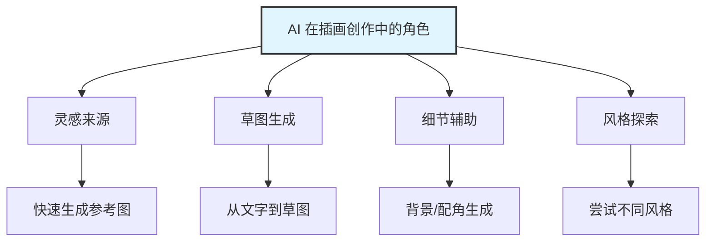

#### 实际应用场景

**1. 儿童绘本插画**

**工作流程**：

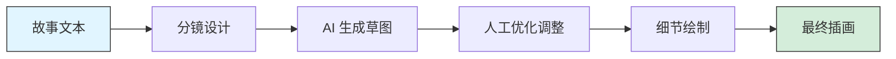

**Prompt 策略**：

```
绘本风格统一性：

基础设置：
Checkpoint: 选择儿童友好的模型（如 Protogen, DreamShaper）
LoRA: children book illustration style
固定 Seed: 保持角色一致性

主角描述（贯穿全书）：
little bear, brown fur, red scarf, friendly smile,
cute character design, children book illustration,
simple shapes, bright colors, warm atmosphere

场景变化（不同页面）：
页面1：little bear in his cozy house, morning light
页面2：little bear walking in the forest, sunny day
页面3：little bear meets friends, happy moment
...

技巧：
- 使用固定 Seed 保持角色一致
- 用 ControlNet OpenPose 统一角色姿态
- 批量生成同一角色不同场景
```

**2. 小说封面 / 文章配图**

**不同类型配图策略**：

| 类型 | 风格方向 | 关键词 | 推荐模型 |
|-----|---------|-------|---------|
| **科幻小说** | 未来感、宏大 | sci-fi, futuristic, epic | SDXL, DreamShaper |
| **奇幻小说** | 魔法、史诗 | fantasy, magical, epic | Anything, Protogen |
| **悬疑推理** | 神秘、紧张 | mystery, dark, dramatic | Realistic Vision |
| **言情小说** | 唯美、浪漫 | romantic, beautiful, soft | ChilloutMix, MeinaMix |
| **历史文学** | 古典、厚重 | historical, classical | SD 2.1, SDXL |

**快速配图流程**：

```
1. 提取关键词（5分钟）
   从文章/小说中提取：
   - 主要元素（人物/场景/物体）
   - 情绪氛围
   - 风格定位

2. 生成初稿（10分钟）
   - 批量生成 10-20 张
   - 快速参数（20步）
   - 尝试 2-3 个不同角度

3. 精修（15分钟）
   - 选择最佳 1-2 张
   - 提高质量参数（30步）
   - 高清化到目标尺寸
   - 简单后期调色

总耗时：30分钟
传统手绘：2-4小时
效率提升：4-8倍
```

**3. 社交媒体插画**

**平台适配**：

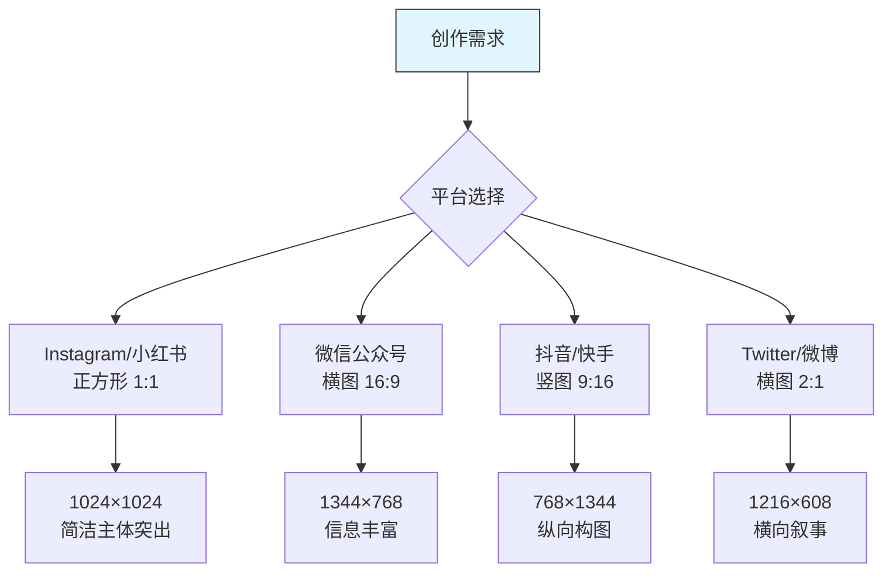

**爆款配图特征**：

- ✅ **主体明确**：一眼就能看出重点
- ✅ **色彩吸引**：高对比度或和谐配色
- ✅ **情绪传达**：清晰的情感表达
- ✅ **平台适配**：符合平台调性

**Prompt 模板（社交媒体风格）**：

```
小清新风格（适合生活方式内容）：
soft pastel colors, minimalist, aesthetic,
cozy atmosphere, warm lighting, dreamy mood,
instagram style, trending

科技感风格（适合科技/商业内容）：
modern, sleek design, tech aesthetic,
gradient colors, futuristic, professional,
clean composition, corporate style

情绪氛围风格（适合情感/故事内容）：
emotional, atmospheric, cinematic lighting,
dramatic mood, storytelling, artistic,
deep colors, expressive
```

#### 插画师使用建议

**AI 作为辅助，而非替代**：

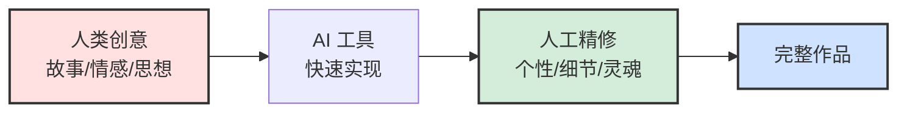

**最佳实践**：

1. **用 AI 做前期探索**
   - 快速生成多个构图方案
   - 探索不同配色和风格
   - 积累视觉参考素材

2. **人工把控核心表达**
   - 情感传达
   - 叙事逻辑
   - 细节打磨
   - 整体统一性

3. **建立个人风格**
   - 训练自己的 LoRA
   - 建立固定的 Prompt 模板
   - 形成独特的后期流程

### 1.3 游戏开发

#### 应用价值

游戏开发是 AI 绘画最具潜力的应用领域之一，能够显著降低美术成本，加速开发周期。

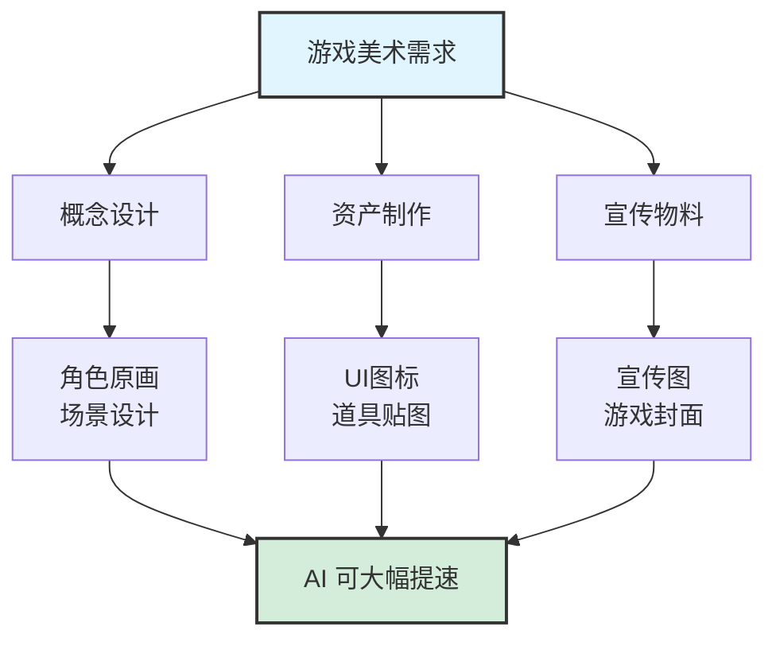

#### 实际应用场景

**1. 角色原画**

**从概念到成品**：

```
阶段1：风格定位
- 确定游戏美术风格（写实/二次元/像素/卡通）
- 选择对应的 Checkpoint
- 准备参考图和 ControlNet

阶段2：角色设计
- 职业/种族设定
- 外观特征描述
- 装备和道具
- 多角度展示（正面/侧面/背面）

阶段3：批量生成
- 不同职业角色
- 同角色不同皮肤
- NPC 和怪物设计
```

**Prompt 模板（游戏角色）**：

```
RPG 战士角色：
(best quality:1.2), game character design,
warrior class, heavy armor, sword and shield,
male, muscular build, battle-worn equipment,
fantasy RPG style, full body, character sheet,
front view, side view, back view,
professional game art, detailed

职业变体：
- Mage: wizard robes, staff, magical aura
- Archer: leather armor, bow, quiver
- Rogue: light armor, dual daggers, hood
- Cleric: holy armor, mace, religious symbols

稀有度变体：
- Common: basic equipment, simple design
- Rare: enhanced details, glowing effects
- Epic: elaborate design, (ornate:1.3), magical effects
- Legendary: (masterwork:1.4), unique design, dramatic
```

**2. 场景和关卡设计**

**应用类型**：

| 场景类型 | AI 应用 | 后期处理 | 适用游戏类型 |
|---------|---------|---------|------------|
| **概念图** | 100% AI | 调色、合成 | 所有类型 |
| **2D 背景** | 80% AI | 分层、动画 | 2D 游戏、视觉小说 |
| **3D 贴图** | 60% AI | 无缝化、PBR | 3D 游戏 |
| **像素场景** | 30% AI + 70% 人工 | 像素化 | 像素游戏 |

**工作流程（2D 横版游戏场景）**：

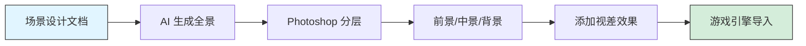

**3. UI/UX 素材**

**可用 AI 生成的 UI 元素**：

- ✅ **图标**：技能图标、道具图标、货币图标
- ✅ **按钮背景**：各种风格的按钮装饰
- ✅ **边框装饰**：对话框、面板边框
- ✅ **背景纹理**：界面背景、纹理填充
- ⚠️ **文字**：AI 生成的文字质量不佳，需人工添加

**快速生成 UI 图标**：

```
技能图标 Prompt 模板：

game UI icon, [skill type],
square frame, centered composition,
detailed illustration, glossy effect,
dark background, glowing edges,
mobile game style, professional UI design

示例：
- Fire skill: flame effect, red and orange, energy burst
- Ice skill: frost effect, blue and white, crystalline
- Heal skill: holy light, green and gold, divine glow
- Shield skill: protection aura, blue shield, defensive
```

**4. 宣传物料**

**应用场景**：
- 游戏封面 / Key Visual
- Steam 商店图
- 社交媒体宣传图
- 更新公告配图
- 活动海报

**高质量宣传图生成流程**：

```
1. 确定核心视觉（10分钟）
   - 主要角色/场景
   - 情绪和氛围
   - 构图和视角

2. 生成高质量底图（30分钟）
   - 使用 SDXL 或高质量模型
   - 高分辨率（1024×1024 或更大）
   - 多次迭代优化
   - 固定优秀 Seed

3. 后期合成（60分钟）
   - Photoshop 精修
   - 添加游戏 Logo
   - 添加文字信息
   - 特效和光效
   - 输出不同尺寸

总耗时：1.5-2小时
外包成本对比：¥500-2000/张
自制成本：¥0（已有硬件）
```

#### 游戏开发团队使用建议

**按团队规模调整策略**：

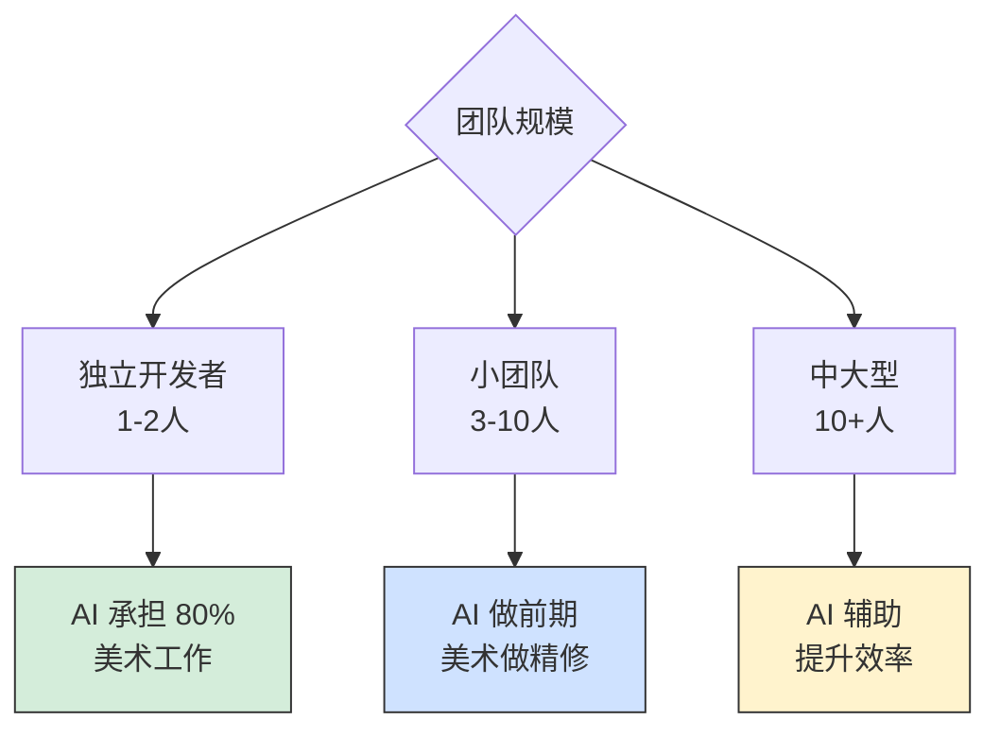

**独立开发者（1-2人）**：
- ✅ 大量使用 AI 生成资产
- ✅ 学习基础的后期处理
- ✅ 建立素材库和模板
- ⚠️ 注意版权和使用规范

**小团队（3-10人）**：
- ✅ AI 负责概念和草图
- ✅ 美术负责精修和统一
- ✅ 建立团队内部 LoRA 库
- ✅ 标准化工作流程

**中大型团队（10+人）**：
- ✅ AI 辅助提升效率
- ✅ 专人负责 AI 工具
- ✅ 训练专用模型
- ✅ 整合到完整工作流

### 1.4 影视前期

#### 应用场景

**1. 分镜草图**

传统分镜绘制耗时长，AI 可以快速生成分镜参考：

```
镜头描述 → AI 生成草图 → 导演审核 → 调整优化
```

**2. 场景概念**

为场景设计和布景提供视觉参考。

**3. 服装和道具设计**

快速探索不同时代、风格的服装和道具方案。

**4. 氛围板（Mood Board）**

为团队统一视觉风格和氛围方向。

## 二、商业应用

### 2.1 营销设计

#### 应用价值

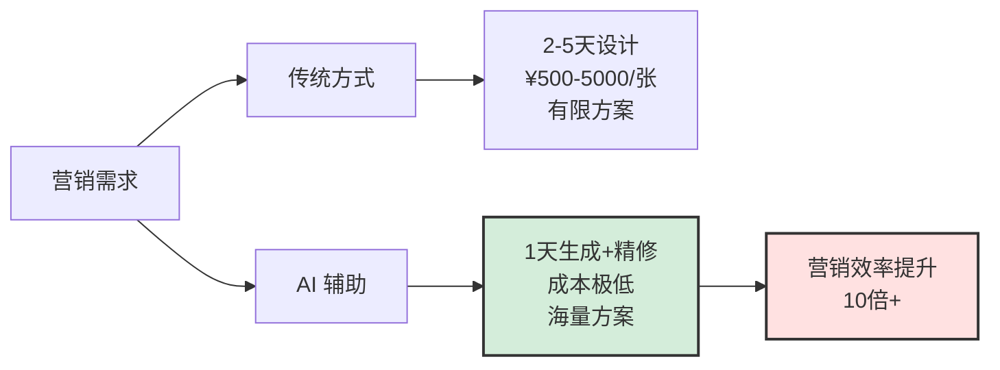

#### 实际应用场景

**1. 社交媒体广告**

**平台适配方案**：

| 平台 | 尺寸 | 风格特点 | Prompt 关键词 |
|-----|------|---------|-------------|
| **Instagram** | 1080×1080 | 精致、美学 | aesthetic, instagram style, trendy |
| **Facebook** | 1200×628 | 清晰、直接 | clear message, professional, engaging |
| **LinkedIn** | 1200×627 | 专业、商务 | professional, corporate, business style |
| **Twitter/X** | 1200×675 | 简洁、吸睛 | eye-catching, concise, modern |
| **TikTok/抖音** | 1080×1920 | 动感、年轻 | trendy, youthful, energetic, vibrant |
| **小红书** | 1242×1660 | 清新、种草 | lifestyle, aesthetic, chinese style |

**广告素材生成流程**：

```
阶段1：确定campaign主题
产品类型：[护肤品/科技产品/食品/服装...]
目标受众：[年龄/性别/兴趣/消费水平]
核心信息：[产品卖点]

阶段2：AI 生成底图
product photography, [product description],
[target mood], commercial advertising style,
high quality, professional lighting,
[platform style]

阶段3：设计合成
- 添加品牌元素
- 添加广告文案
- 调整符合平台规范
- A/B测试不同版本
```

**案例：护肤品社交媒体广告**

```
基础 Prompt：
luxury skincare product, elegant bottle,
soft pink and white color scheme,
on marble surface, rose petals,
natural lighting, soft shadows,
clean and minimal, commercial photography,
instagram aesthetic, high-end beauty

变体探索：
A版（简约）：minimalist, clean, white background
B版（奢华）：luxury, elegant, gold accents
C版（自然）：natural, organic, botanical elements
D版（现代）：modern, sleek, geometric shapes

生成30-40张 → 筛选5张 → 设计师合成 → 3个最终版本
耗时：半天
传统耗时：3-5天
成本节省：70-80%
```

**2. 产品宣传海报**

**设计流程**：

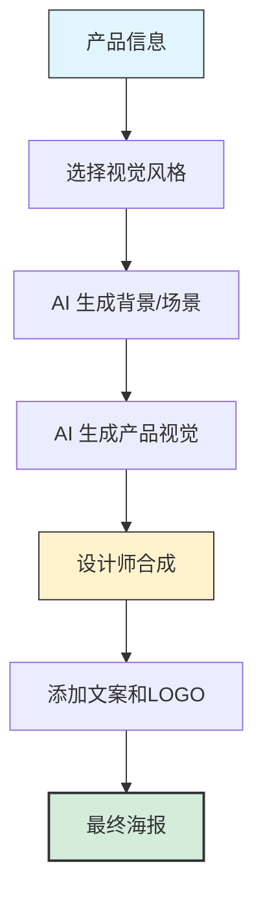

**不同产品类别策略**：

**科技产品**：
```
Prompt：
futuristic technology product, sleek design,
metallic surface, blue and white lighting,
modern minimalist background, tech aesthetic,
professional product photography, 8k, highly detailed
```

**食品饮料**：
```
Prompt：
delicious [food item], appetizing presentation,
natural ingredients, fresh and vibrant,
commercial food photography, professional lighting,
shallow depth of field, mouth-watering
```

**时尚服装**：
```
Prompt：
fashion photography, [clothing item], model wearing,
elegant pose, studio lighting, clean background,
high fashion, editorial style, professional, detailed fabric
```

**家居用品**：
```
Prompt：
modern interior design, [home product],
cozy atmosphere, natural light, scandinavian style,
lifestyle photography, clean and organized, warm tones
```

**3. 品牌视觉系统**

**应用场景**：
- 品牌形象探索
- VI 系统辅助设计
- 品牌故事视觉化
- 季度主题视觉

**工作流程**：

```
1. 品牌定位分析（1-2天）
   - 品牌核心价值
   - 目标受众画像
   - 竞品视觉分析
   - 差异化方向

2. AI 辅助视觉探索（2-3天）
   - 生成 100+ 视觉方向
   - 探索色彩、风格、氛围
   - 团队内部投票筛选
   - 确定 3-5 个方向

3. 精细化和系统化（5-7天）
   - 人工精修关键视觉
   - 建立视觉规范
   - 延展应用场景
   - 输出品牌指南

总周期：1.5-2周
传统周期：1-2月
效率提升：4-6倍
```

### 2.2 电商视觉

#### 应用价值

电商行业对视觉素材的需求量巨大，AI 绘画可以极大降低成本和提升效率。

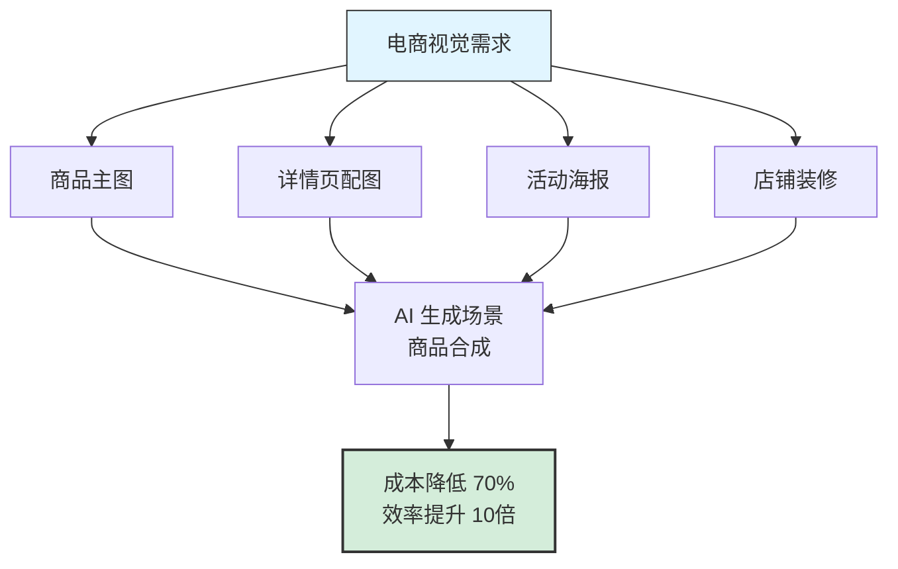

#### 实际应用场景

**1. 商品场景化展示**

**传统 vs AI 方式**：

| 维度 | 传统实拍 | AI 生成场景 | 优势 |
|-----|---------|------------|------|
| **成本** | 拍摄+场地+道具 | 仅算力成本 | 降低90% ⬇️ |
| **时间** | 1-3天（含筹备） | 1-2小时 | 提升10-20倍 ⬆️ |
| **灵活性** | 难以修改 | 随时调整 | 极高 ⬆️ |
| **场景丰富度** | 受限于实际条件 | 任意场景 | 无限 ⬆️ |
| **真实感** | 最真实 | 需要技巧 | - |

**工作流程**：

```
1. 商品抠图（10分钟）
   - 实拍商品照片
   - Photoshop 抠图
   - 去除背景
   - 调整光影

2. AI 生成场景（20分钟）
   - 描述理想场景
   - 生成多个背景选项
   - 筛选最佳场景
   - 调整色调匹配

3. 合成和精修（30分钟）
   - 将商品合成到场景
   - 调整光影一致性
   - 添加倒影/阴影
   - 整体调色

总耗时：1小时
传统拍摄：1-2天 + ¥2000-5000
AI 方案：1小时 + ¥0
```

**Prompt 模板（场景背景）**：

```
家居用品场景：
modern home interior, clean and bright,
minimalist design, natural lighting,
scandinavian style, cozy atmosphere,
white walls, wooden floor, green plants,
lifestyle photography, no people,
product placement space in center

美妆产品场景：
luxury beauty setting, elegant marble surface,
soft pink and white tones, rose petals,
natural daylight, soft shadows, clean aesthetic,
high-end cosmetic background, product space

数码产品场景：
modern tech workspace, clean desk,
white or gray background, professional setup,
ambient lighting, minimalist, contemporary,
product showcase, centered composition

服装配饰场景：
fashion lifestyle setting, elegant interior,
neutral tones, natural light, stylish atmosphere,
editorial photography style, clean and modern
```

**2. 详情页配图**

**AI 可生成的详情页素材**：

- ✅ **场景展示图**：商品在使用场景中的效果
- ✅ **氛围图**：营造品牌调性和情绪
- ✅ **对比图背景**：使用前后对比的背景
- ✅ **装饰元素**：边框、图案、纹理
- ⚠️ **文字信息图**：需要人工设计排版

**快速生成详情页配图流程**：

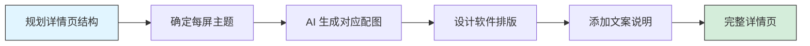

**3. 促销活动海报**

**常见活动类型**：

| 活动 | 视觉风格 | 关键元素 | Prompt 关键词 |
|-----|---------|---------|-------------|
| **双11/618** | 热烈、大促 | 红色、金色、礼物 | festive, sale, vibrant red, promotional |
| **新品上市** | 高级、精致 | 简约、聚焦产品 | new arrival, premium, elegant, spotlight |
| **清仓特卖** | 实惠、直接 | 明确折扣信息 | clearance, deals, eye-catching, bold |
| **节日活动** | 主题相关 | 节日元素 | [holiday name], festive, celebration |
| **会员专享** | 尊贵、专属 | 金色、黑色、VIP | exclusive, VIP, luxury, member only |

**快速生成活动海报**：

```
促销海报 Prompt 模板：

commercial poster design, [activity theme],
[color scheme], dynamic composition,
[key visual elements], festive atmosphere,
professional advertising design, eye-catching,
clean layout, space for text,
e-commerce style, chinese market

示例 - 双11海报背景：
shopping festival, red and gold colors,
festive atmosphere, gift boxes, confetti,
dynamic composition, celebratory mood,
commercial design, space for product and text
```

**4. 店铺装修素材**

**可用 AI 生成的素材**：
- Banner 背景图
- 分类导航背景
- 促销区块配图
- 品牌故事配图
- 客服背景图

### 2.3 内容创作

#### 应用价值

内容创作者（自媒体、UP主、博主）对配图需求量大，AI 绘画是完美的解决方案。

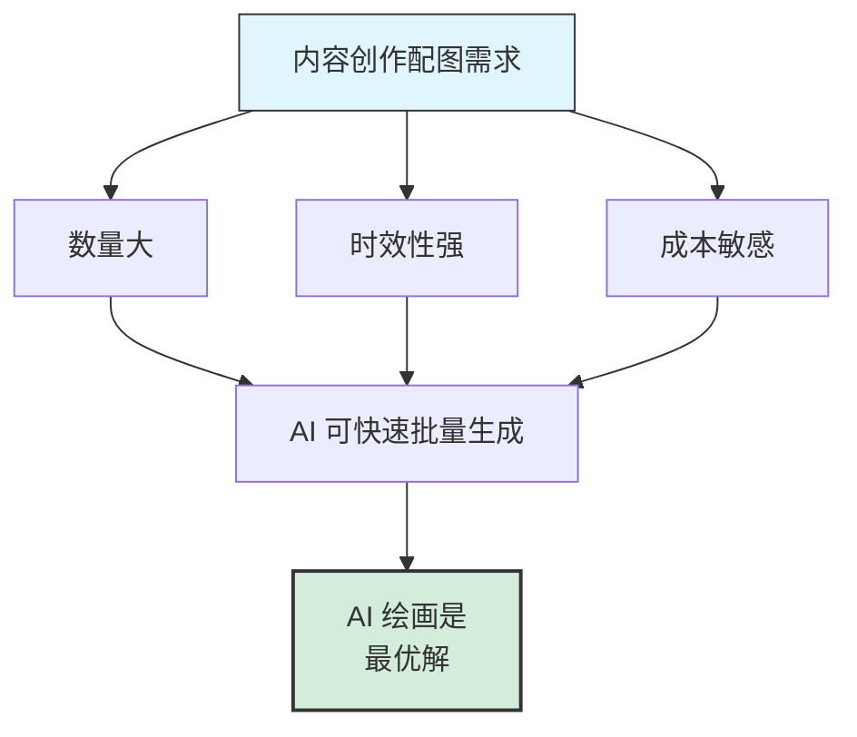

#### 实际应用场景

**1. 视频封面 / 缩略图**

**平台特点**：

| 平台 | 尺寸 | 风格特点 | 点击率关键 |
|-----|------|---------|-----------|
| **YouTube** | 1280×720 | 夸张、吸睛 | 对比强、表情丰富 |
| **B站** | 1146×717 | 二次元友好 | 可爱/酷炫、文字醒目 |
| **抖音/快手** | 1080×1920 | 竖屏、简洁 | 主体明确、色彩鲜明 |
| **微信视频号** | 1080×1260 | 接地气 | 真实感、共鸣 |

**爆款封面特征**：

```
✅ 3秒法则：3秒内能看懂主题
✅ 对比强烈：高对比度色彩
✅ 情绪明确：清晰的情感表达
✅ 文字配合：关键文字突出（人工添加）
✅ 好奇心：留悬念、提问题
```

**Prompt 策略**：

```
YouTube 科技频道封面：
tech review thumbnail, excited expression,
product in focus, vibrant colors,
dramatic lighting, dynamic composition,
professional YouTube style, eye-catching,
contrasting colors, [product] featured

B站知识区封面：
educational thumbnail, anime style, cute character,
holding [topic-related item], excited expression,
bright colors, clean composition, bilibili style,
chinese text space

情感类内容封面：
emotional scene, [specific emotion],
cinematic lighting, atmospheric, dramatic,
storytelling, expressive, detailed facial expression
```

**批量生成流程**：

```
制作周期（每期视频）：
传统方式：30-60分钟设计
AI 方式：10-15分钟（生成5分钟+修图5分钟+加字5分钟）

月产30期视频：
传统：15-30小时
AI：5-7.5小时
节省时间：10-22.5小时（可用来创作更多内容）
```

**2. 公众号 / 文章配图**

**配图类型**：

| 类型 | 用途 | 生成策略 | Prompt 特点 |
|-----|------|---------|-----------|
| **封面大图** | 吸引点击 | 高质量，主题明确 | dramatic, eye-catching |
| **内容配图** | 辅助理解 | 快速生成，主题相关 | illustrative, clear |
| **氛围图** | 情绪渲染 | 抽象，情感化 | atmospheric, emotional |
| **对比图** | 说明观点 | 并列，差异明显 | comparison, contrasting |
| **装饰图** | 美化版面 | 简约，不抢主题 | minimalist, decorative |

**文章配图工作流**：

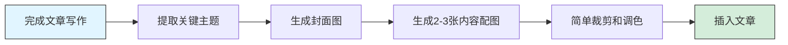

**快速配图 Prompt 公式**：

```
[文章主题] + [视觉元素] + [情绪氛围] + [风格] + [质量标签]

示例：

文章：《如何提升工作效率》
Prompt：
productivity concept, organized workspace,
laptop and notebook, minimalist setup,
bright and inspiring atmosphere, clean aesthetic,
professional illustration, modern style, high quality

文章：《冬日养生指南》
Prompt：
winter wellness concept, warm tea and blankets,
cozy interior, soft lighting, peaceful atmosphere,
hygge style, comforting mood, natural colors,
lifestyle photography, high quality

文章：《AI时代的机遇》
Prompt：
artificial intelligence concept, futuristic technology,
digital neural network, blue and purple colors,
innovative atmosphere, modern and sleek,
tech illustration, professional, high quality
```

**3. 社交媒体日常内容**

**内容类型**：

- **励志/鸡汤图**：美图 + 金句
- **知识卡片**：信息图底图
- **节日祝福**：节日主题配图
- **心情分享**：情绪化配图
- **每日问候**：早安/晚安图

**批量生成策略（小红书博主案例）**：

```
每周内容规划：
- 周一：励志图（开启新一周）
- 周三：知识分享（干货内容）
- 周五：轻松话题（周末氛围）
- 周日：生活分享（生活方式）

批量生成流程：
1. 周日花 1 小时批量生成下周所需图片
2. 按主题分类保存
3. 每天选择合适的图片发布
4. 添加文字和贴纸

效率：
- 日常找图：每天 15-30 分钟
- AI 批量生成：每周 1 小时
- 节省时间：每周 1-2 小时
```

## 三、个人使用应用

### 3.1 个人艺术创作

#### 应用场景

**1. 数字艺术作品**

AI 绘画为非专业艺术家打开了创作的大门：

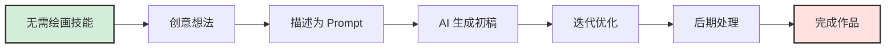

**创作方向**：
- 抽象艺术
- 超现实主义
- 概念艺术
- 数字拼贴
- 混合媒介

**分享平台**：
- Instagram
- ArtStation
- Behance
- DeviantArt
- 小红书艺术区

**2. 个性化定制**

**定制项目示例**：

| 项目 | 应用 | 制作方式 | 成本 |
|-----|------|---------|------|
| **自定义头像** | 社交媒体 | AI生成+修图 | 免费 |
| **宠物肖像** | 礼物/装饰 | 宠物照片+风格化 | 免费 |
| **壁纸/海报** | 家居装饰 | AI生成+打印 | 打印费 |
| **T恤图案** | 服装定制 | AI生成+转印 | ¥50-200 |
| **咖啡杯** | 礼品 | AI生成+定制 | ¥30-100 |
| **手机壳** | 日用品 | AI生成+定制 | ¥20-80 |

**制作流程（个性化T恤）**：

```
1. 创意构思（10分钟）
   - 确定主题和风格
   - 参考类似设计

2. AI 生成图案（20分钟）
   - 编写 Prompt
   - 生成多个选项
   - 选择最佳方案

3. 后期处理（20分钟）
   - 去除背景
   - 调整尺寸
   - 优化细节

4. 打印制作（外包）
   - 上传设计文件
   - 选择T恤款式
   - 下单制作

总成本：
- 设计成本：¥0（自己完成）
- 市场价格：¥200-500（设计师设计）
- 实际支出：¥80-150（T恤+打印）
```

### 3.2 社交媒体应用

#### 应用场景

**1. 个性化头像**

**流行风格**：

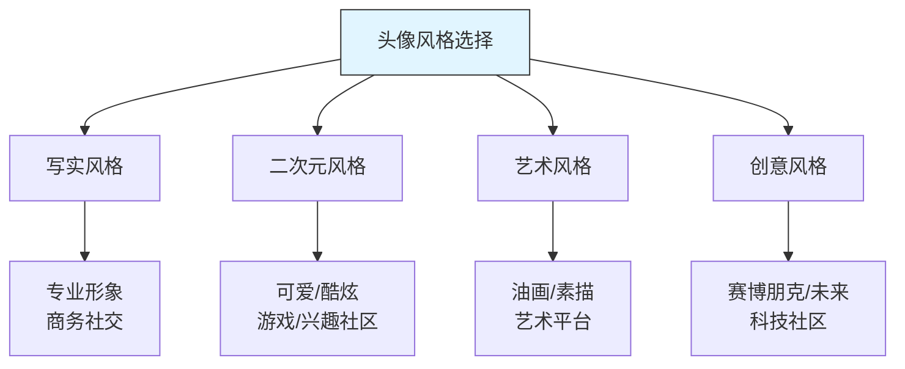

**生成技巧**：

```
头像 Prompt 模板：

写实风格：
portrait photo, professional headshot,
[gender], [age], [features],
clean background, natural lighting,
professional photography, linkedin style, 8k

二次元风格：
anime style portrait, cute [character],
[features], colorful, detailed eyes,
clean background, kawaii, digital art,
high quality, profile picture

艺术风格：
portrait in [art style] style,
[features], artistic interpretation,
[color palette], expressive, creative,
digital painting, high quality

使用建议：
- 分辨率：512×512 或 1024×1024（正方形）
- 构图：头部和肩部，居中
- 背景：简洁，不抢主体
- 表情：友好、自然
```

**2. 表情包制作**

**表情包工作流**：

```
1. 确定角色（自创或基于现有）
2. 生成基础表情（10-15个常用表情）
3. 添加文字（使用表情包制作工具）
4. 导出适合平台的格式

常用表情：
- 开心
- 难过
- 生气
- 惊讶
- 无语
- 点赞
- 加油
- 疑惑
- 害羞
- ...
```

**Prompt 示例**：

```
表情包角色（一致性很重要）：

基础设定：
cute cartoon [animal/character], simple design,
chibi style, expressive, clean lines,
white background, sticker style

不同表情（保持角色一致，只改变表情）：
- happy: big smile, excited, cheerful
- sad: tears, disappointed, gloomy
- angry: furious, steam from head, upset
- surprised: wide eyes, shocked, amazed
- confused: question mark, puzzled, thinking
...

技巧：
- 固定 Seed 保持角色一致
- 使用 LoRA 训练专属角色
- 简化细节，便于识别
```

**3. 朋友圈/动态配图**

**场景化配图**：

| 场景 | 配图风格 | Prompt 方向 |
|-----|---------|------------|
| **美食分享** | 诱人、精致 | food photography, delicious, appetizing |
| **旅行** | 风景、氛围 | landscape, beautiful scenery, travel |
| **心情** | 情绪化、艺术 | emotional, atmospheric, artistic |
| **节日祝福** | 主题、喜庆 | [holiday], festive, celebration |
| **日常生活** | 温馨、真实 | lifestyle, cozy, everyday moment |

### 3.3 学习和兴趣

#### 应用场景

**1. 学习 AI 技术**

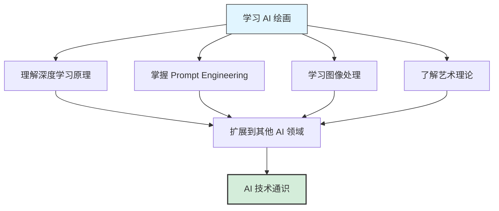

**学习路径**：
1. 基础操作（1-2周）
2. Prompt 技巧（2-4周）
3. 高级功能（1-2月）
4. 模型训练（2-3月）
5. 技术深入（持续学习）

**2. 艺术审美提升**

通过 AI 绘画学习：
- 色彩搭配
- 构图原理
- 光影表现
- 风格流派
- 艺术史

**3. 创意思维训练**

```
练习方式：
- 每日一图挑战
- 主题创作系列
- 风格模仿练习
- 概念具象化
- 随机词组合创作
```

## 四、教育研究应用

### 4.1 艺术教育

#### 应用场景

**1. 艺术风格教学**

```
传统方式：
- 展示历史画作
- 讲解风格特点
- 学生临摹练习

AI 辅助方式：
- 展示历史画作
- 讲解风格特点
- AI 生成相同风格的不同主题
- 学生实验不同风格组合
- 理解风格本质
```

**示例课程：印象派风格学习**

```
课程流程：
1. 介绍印象派历史和特点
2. 展示莫奈、雷诺阿等大师作品
3. 提取印象派关键词：
   - impressionist style
   - loose brushstrokes
   - natural light
   - outdoor scenes
   - vibrant colors

4. 使用 AI 生成印象派风格的不同主题：
   - 城市街景
   - 现代建筑
   - 日常物品
   - 学生自选主题

5. 讨论：什么是风格的本质？
```

**2. 创意思维培养**

**教学活动**：

```
活动1：文字到图像挑战
- 给定一个概念词
- 学生编写 Prompt
- 比较不同表达的结果
- 讨论如何精确表达创意

活动2：风格混搭实验
- 选择两种不同风格
- 尝试融合创作
- 分析效果
- 培养创新思维

活动3：故事视觉化
- 编写短篇故事
- 为故事生成配图
- 训练叙事能力
- 理解图文关系
```

### 4.2 技术研究

#### 研究方向

**1. 计算机视觉**

- 生成模型原理研究
- 图像生成质量评估
- 模型改进和优化
- 应用场景探索

**2. 人机交互**

- 自然语言到图像的交互
- Prompt Engineering 研究
- 用户体验优化
- 交互界面设计

**3. 艺术与科技**

- AI 在艺术创作中的角色
- 人类创造力与 AI 的关系
- 数字艺术理论
- 技术美学研究

### 4.3 学术论文配图

#### 应用场景

**1. 概念图示**

AI 可以快速生成论文中需要的概念示意图：

```
应用示例：

论文主题：智慧城市
需求：未来城市概念图

Prompt：
futuristic smart city, advanced technology,
interconnected systems, sustainable architecture,
clean energy, aerial view, concept illustration,
professional, detailed, technical drawing style

生成多个方向：
- 白天场景
- 夜景（展示照明系统）
- 特定区域特写
- 交通系统重点
```

**2. 场景模拟**

某些研究需要模拟特定场景：

- 历史场景重现
- 未来场景预测
- 虚拟实验环境
- 假设情境展示

**3. 数据可视化辅助**

为枯燥的数据图表创建吸引人的背景或装饰元素。

## 五、版权和使用规范

### 5.1 版权问题

**关键原则**：

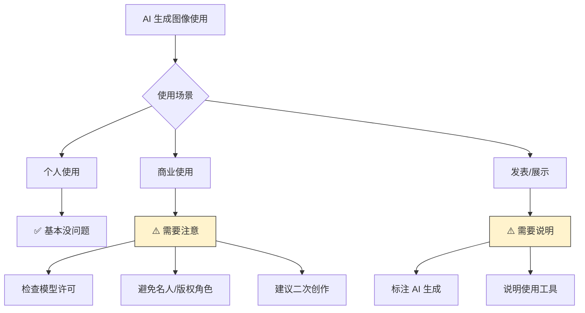

**安全使用建议**：

1. **个人使用**：✅ 自由使用
   - 学习、练习
   - 个人装饰
   - 非商业分享

2. **商业使用**：⚠️ 谨慎使用
   - 检查模型许可证
   - 作为参考，不直接使用
   - 进行充分的人工创作
   - 必要时咨询法律专业人士

3. **发表作品**：⚠️ 诚实说明
   - 标注"AI 辅助创作"
   - 说明使用的工具
   - 强调人类创作的部分

### 5.2 道德使用规范

**禁止**：
- ❌ 生成名人肖像用于商业
- ❌ 生成虚假信息/深度伪造
- ❌ 侵犯他人隐私
- ❌ 生成暴力、色情、仇恨内容
- ❌ 冒充他人作品

**推荐**：
- ✅ 作为创作辅助工具
- ✅ 激发创意灵感
- ✅ 提升工作效率
- ✅ 学习和研究
- ✅ 标注 AI 使用

## 六、实施建议

### 6.1 入门建议

```mermaid
graph TD
    A[开始使用 AI 绘画] --> B[个人创作]
    A --> C[商业应用]

    B --> B1[1. 从简单开始]
    B1 --> B2[2. 大量实践]
    B2 --> B3[3. 建立素材库]
    B3 --> B4[4. 形成个人风格]

    C --> C1[1. 小规模测试]
    C1 --> C2[2. 评估效果]
    C2 --> C3[3. 优化流程]
    C3 --> C4[4. 规模化应用]

    style A fill:#e1f5ff,stroke:#333
    style B4 fill:#d4edda,stroke:#333
    style C4 fill:#d4edda,stroke:#333
```

### 6.2 效率提升策略

**1. 建立 Prompt 库**

```
按场景分类保存常用 Prompt：
- 人物肖像类
- 场景风景类
- 商业设计类
- 产品展示类
- ...

每个分类包含：
- 基础模板
- 成功案例
- 参数设置
- 注意事项
```

**2. 批量化工作流**

```
集中时间批量生成：
- 每周固定时间生成素材
- 一次生成多个版本
- 建立素材库存
- 按需使用

优势：
- 提高效率
- 保持创作状态
- 减少重复劳动
```

**3. 自动化工具**

```
使用脚本和工具自动化：
- 批量处理
- 参数测试
- 格式转换
- 文件管理
```

### 6.3 质量保证

**质量检查清单**：

```
生成后检查：
□ 主体清晰，符合需求
□ 无明显瑕疵（手部、五官等）
□ 色彩和谐
□ 构图合理
□ 分辨率足够
□ 无不当内容

后期处理：
□ 基础修图（去瑕疵）
□ 色彩校正
□ 尺寸适配
□ 格式转换
□ 压缩优化
```

## 总结

AI 绘画的应用场景非常广泛，从个人创作到商业应用，从艺术创作到技术研究，AI 绘画正在改变我们创建和消费视觉内容的方式。

**关键启示**：

1. **工具定位**：AI 是辅助工具，不是替代人类创造力
2. **效率提升**：合理使用可以极大提升效率
3. **成本控制**：显著降低视觉内容制作成本
4. **创意激发**：帮助探索更多创意可能性
5. **技能要求**：降低专业门槛，但仍需学习

**实施步骤**：

1. **评估需求**：明确自己的应用场景
2. **学习基础**：掌握基本操作和概念
3. **小规模试验**：从简单项目开始
4. **优化流程**：总结经验，建立工作流
5. **规模应用**：扩大使用范围
6. **持续学习**：跟进新技术和方法

无论你是创作者、设计师、营销人员还是普通用户，AI 绘画都能为你的工作和生活带来价值。关键是找到适合自己的应用方式，并在实践中不断优化。

---

> 💡 **核心理念**：AI 绘画不是要取代人类创造力，而是要放大它。最好的作品永远来自 AI 工具与人类创意的完美结合。

> 🎯 **行动建议**：不要等到完全掌握才开始应用。从今天开始，在一个小项目中尝试 AI 绘画，你会发现比想象中更简单、更有用。

> ⚖️ **负责任使用**：技术没有对错，关键在于如何使用。让我们负责任地使用 AI 绘画技术，创造积极的价值。
