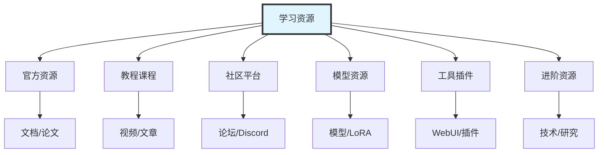
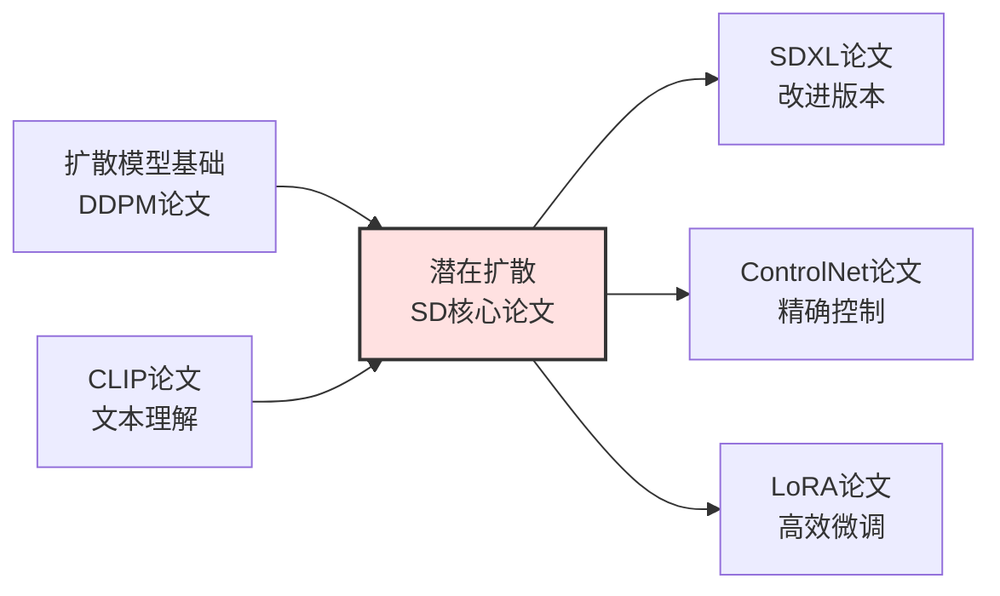
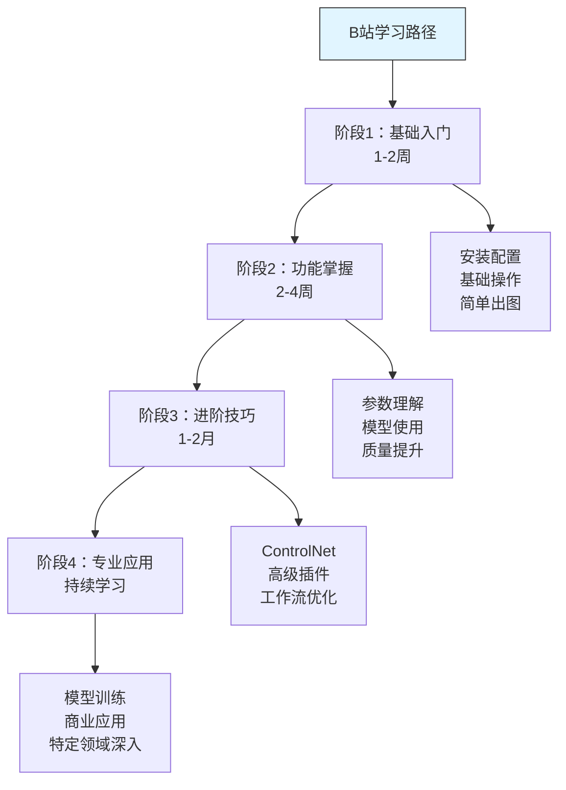
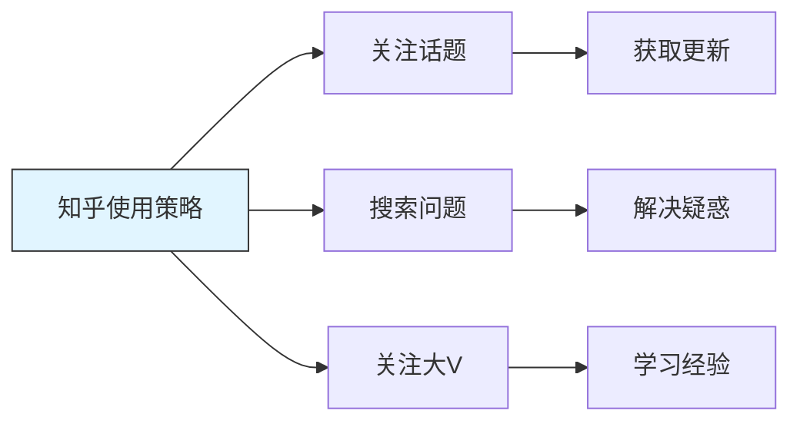
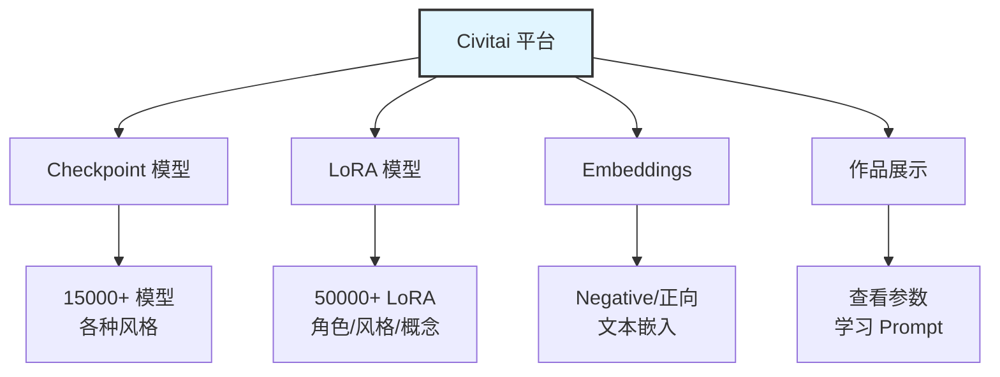
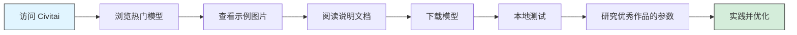
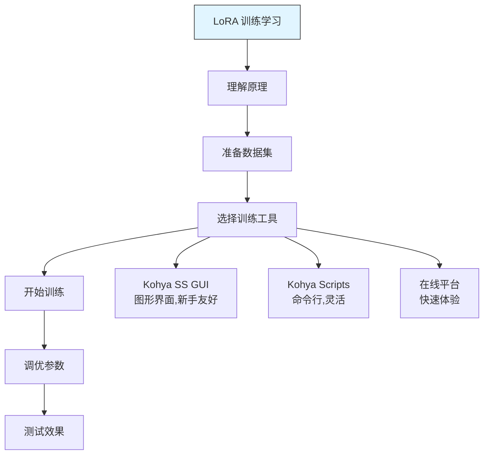
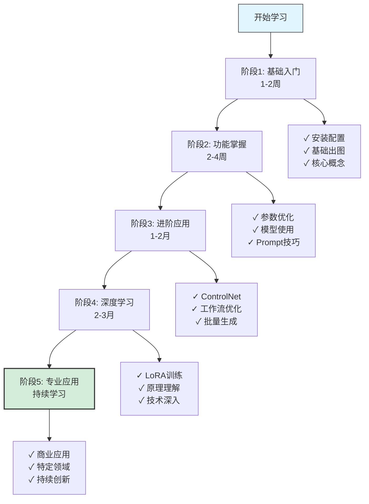
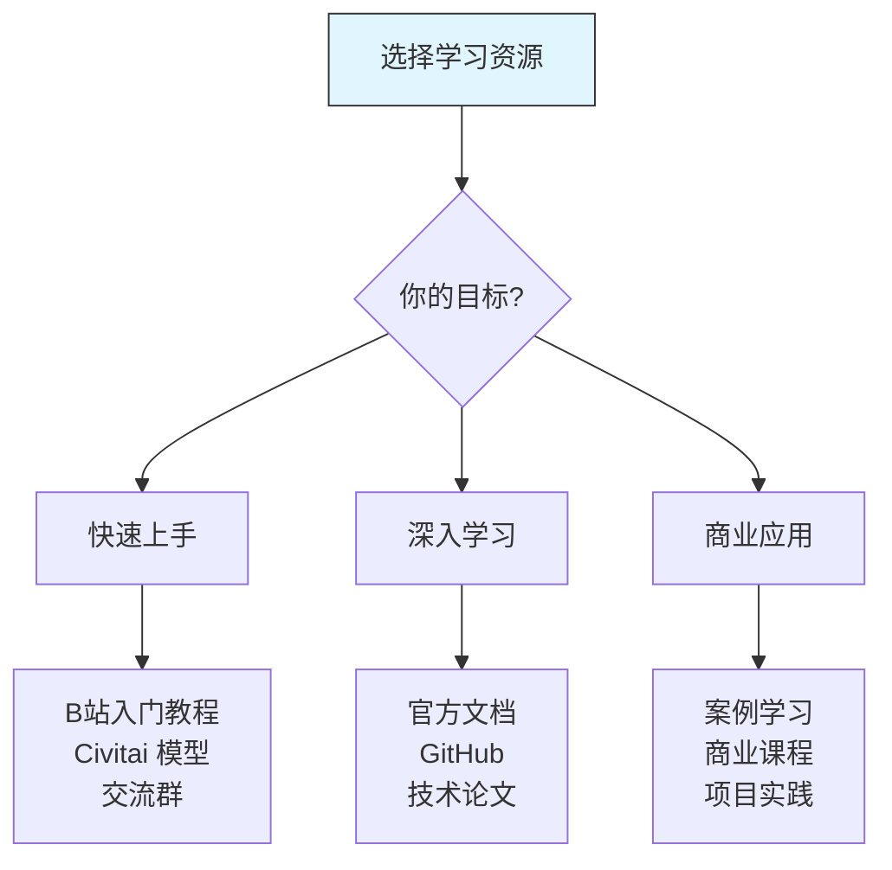

# Stable Diffusion 学习资源推荐

## 前言

学习 Stable Diffusion 是一个循序渐进的过程，选择合适的学习资源至关重要。本文将系统性地推荐各类学习资源，帮助你从零基础到精通，快速掌握 AI 绘画技能。

**本文包含**：
- 📚 官方文档和权威资源
- 🎓 优质教程和课程
- 🌐 活跃社区和论坛
- 🎨 模型和素材平台
- 🛠️ 实用工具和插件
- 📖 进阶学习资源
- 💡 学习方法和技巧

## 学习资源地图



## 一、官方资源

### 1.1 核心官方平台

#### Stability AI 官方

**网站**：[https://stability.ai/](https://stability.ai/)

**内容**：
- ✅ 最新模型发布
- ✅ 官方公告和新闻
- ✅ 技术白皮书
- ✅ 商业合作信息

**适合人群**：所有用户，了解最新动态

**推荐理由**：
- 第一手官方信息
- 权威技术文档
- 了解技术发展方向

#### Stable Diffusion GitHub

**仓库**：[https://github.com/Stability-AI/stablediffusion](https://github.com/Stability-AI/stablediffusion)

**内容**：
- ✅ 官方源代码
- ✅ 技术文档
- ✅ Issues 讨论
- ✅ 更新日志

**适合人群**：
- 开发者
- 技术深入学习者
- 希望了解底层原理的用户

**推荐使用方式**：
```
1. 阅读 README 了解基本架构
2. 查看 Issues 学习常见问题解决
3. 研究代码理解技术细节
4. 关注 Releases 获取更新
```

#### Hugging Face

**平台**：[https://huggingface.co/stabilityai](https://huggingface.co/stabilityai)

**内容**：
- ✅ 官方模型下载
- ✅ 模型卡片（技术细节）
- ✅ 在线演示
- ✅ API 文档

**核心模型**：
- `stable-diffusion-v1-5` - 最流行版本
- `stable-diffusion-2-1` - 第二代
- `stable-diffusion-xl-base-1.0` - SDXL 基础模型
- `stable-diffusion-3` - 最新版本

**推荐理由**：
- 官方模型发布地
- 详细的模型说明
- 技术规格完整

### 1.2 技术论文

#### 必读论文

**1. High-Resolution Image Synthesis with Latent Diffusion Models**

- **作者**：Robin Rombach et al.
- **发布**：CVPR 2022
- **链接**：[https://arxiv.org/abs/2112.10752](https://arxiv.org/abs/2112.10752)
- **重要性**：⭐⭐⭐⭐⭐
- **内容**：Stable Diffusion 的核心论文

**推荐阅读方式**：
```
入门级：阅读 Abstract 和 Introduction（了解核心思想）
中级：阅读 Method 部分（理解技术细节）
高级：深入研究数学公式和实验结果
```

**2. Denoising Diffusion Probabilistic Models**

- **作者**：Jonathan Ho et al.
- **发布**：NeurIPS 2020
- **链接**：[https://arxiv.org/abs/2006.11239](https://arxiv.org/abs/2006.11239)
- **重要性**：⭐⭐⭐⭐⭐
- **内容**：扩散模型的基础论文

**3. CLIP: Learning Transferable Visual Models**

- **作者**：Alec Radford et al.
- **发布**：OpenAI 2021
- **链接**：[https://arxiv.org/abs/2103.00020](https://arxiv.org/abs/2103.00020)
- **重要性**：⭐⭐⭐⭐
- **内容**：文本-图像理解的基础

#### 论文学习路径



## 二、视频教程资源

### 2.1 中文视频平台

#### Bilibili（B站）

**推荐频道/UP主**：

**1. 入门教程系列**

| UP主 | 内容特点 | 推荐视频 | 适合人群 |
|------|---------|---------|---------|
| **秋葉aaaki** | 系统全面，更新快 | 《AI绘画完整教程》 | ⭐⭐⭐⭐⭐ 零基础 |
| **青龙圣者** | 细节讲解，实战强 | 《SD从入门到精通》 | ⭐⭐⭐⭐ 有基础 |
| **琥珀川酒** | 风格化教学 | 《二次元AI绘画》 | ⭐⭐⭐⭐ 二次元方向 |
| **六尾魔狐** | 技术向，深度高 | 《原理与实践》 | ⭐⭐⭐ 技术深入 |

**搜索关键词**：
```
基础学习：
- Stable Diffusion 入门教程
- SD WebUI 安装教程
- AI绘画零基础

进阶学习：
- ControlNet 教程
- LoRA 训练教程
- Prompt 技巧

特定主题：
- 写实人像教程
- 二次元插画教程
- 商业设计应用
```

**学习建议**：



**推荐视频清单（入门必看）**：

```
1. 【秋葉aaaki】
   - "Stable Diffusion WebUI 整合包安装教程"
   - "AI绘画基础知识与核心概念"
   - "提示词编写技巧详解"

2. 【青龙圣者】
   - "从零开始的SD之旅"
   - "模型、LoRA、VAE详解"
   - "ControlNet完全指南"

3. 【琥珀川酒】
   - "二次元人物生成教程"
   - "如何训练自己的LoRA"

时长建议：
- 入门阶段：观看 5-10 个基础教程（总计 5-8 小时）
- 实践为主，视频为辅
- 遇到问题再针对性搜索教程
```

#### 抖音/快手

**特点**：
- ✅ 短平快，适合碎片时间
- ✅ 实用技巧分享
- ⚠️ 深度不足

**推荐关注**：
- AI绘画技巧类账号
- 效果展示和灵感
- 最新功能速览

**使用建议**：
```
✅ 适合：
- 获取灵感
- 快速学习单一技巧
- 了解最新功能

❌ 不适合：
- 系统性学习
- 深入技术理解
```

### 2.2 国际视频平台

#### YouTube

**推荐频道**：

**1. Olivio Sarikas**
- **语言**：英语
- **特点**：更新快，紧跟技术
- **内容**：新功能教程、技巧分享
- **推荐度**：⭐⭐⭐⭐⭐
- **适合**：有英语基础，追求前沿

**2. Aitrepreneur**
- **语言**：英语
- **特点**：商业应用导向
- **内容**：赚钱方法、商业案例
- **推荐度**：⭐⭐⭐⭐
- **适合**：商业应用者

**3. Nerdy Rodent**
- **语言**：英语
- **特点**：技术深度好
- **内容**：原理讲解、高级技巧
- **推荐度**：⭐⭐⭐⭐⭐
- **适合**：技术深入学习

**4. Sebastian Kamph**
- **语言**：英语
- **特点**：工作流导向
- **内容**：完整项目流程
- **推荐度**：⭐⭐⭐⭐
- **适合**：实战应用

**学习策略**：

```
如果英语基础好：
1. 优先看 YouTube（技术更新更快）
2. 开启字幕辅助理解
3. 关注 2-3 个核心频道

如果英语基础一般：
1. 主要看中文教程（B站）
2. YouTube 用来了解最新功能
3. 配合机器翻译和字幕
```

## 三、社区和论坛

### 3.1 中文社区

#### 1. 知乎

**平台**：[https://www.zhihu.com/](https://www.zhihu.com/)

**内容类型**：
- ✅ 技术文章和教程
- ✅ 经验分享
- ✅ 问题答疑
- ✅ 行业讨论

**推荐话题**：
```
关注话题：
- #Stable Diffusion
- #AI绘画
- #AIGC
- #人工智能绘画

推荐搜索：
- "Stable Diffusion 教程"
- "AI绘画经验分享"
- "ControlNet 使用技巧"
- "LoRA 训练心得"
```

**使用技巧**：



**推荐关注**：
- 技术类答主（看回答质量）
- 实战经验分享者
- 教程系列作者

#### 2. 小红书

**平台**：小红书 APP

**内容特点**：
- ✅ 效果展示为主
- ✅ 快速技巧分享
- ✅ 灵感来源
- ⚠️ 系统性不足

**推荐关注内容**：
```
笔记类型：
- 作品展示（获取灵感）
- 提示词分享
- 参数设置
- 效果对比
- 避坑指南

搜索关键词：
- "SD教程"
- "AI绘画参数"
- "提示词分享"
- "LoRA推荐"
```

**使用建议**：
- ✅ 快速获取灵感
- ✅ 看优秀作品
- ✅ 学习提示词
- ❌ 不适合系统学习

#### 3. 吐司网（TosAi）

**平台**：[https://tusiart.com/](https://tusiart.com/)

**特点**：
- ✅ 中文社区
- ✅ 模型分享平台
- ✅ 作品展示
- ✅ 教程资源

**核心功能**：
```
1. 模型下载
   - 中文化界面
   - 国内访问快
   - 中文模型为主

2. 社区交流
   - 作品分享
   - 技术讨论
   - 问题答疑

3. 教程学习
   - 中文教程
   - 实战案例
```

**推荐理由**：
- 国内访问友好
- 中文环境，交流方便
- 模型资源丰富

#### 4. QQ群/微信群

**特点**：
- ✅ 即时交流
- ✅ 问题快速解答
- ✅ 资源分享
- ⚠️ 信息碎片化

**如何找到优质群**：
```
途径：
1. B站UP主群（一般在视频简介）
2. 知乎大V组织的交流群
3. 线上课程配套群
4. 搜索"Stable Diffusion交流群"

筛选标准：
✅ 群人数适中（100-500人活跃度高）
✅ 有群规，管理规范
✅ 技术讨论为主
✅ 定期分享资源
❌ 避免广告群、灌水群
```

### 3.2 国际社区

#### 1. Reddit - r/StableDiffusion

**平台**：[https://www.reddit.com/r/StableDiffusion/](https://www.reddit.com/r/StableDiffusion/)

**特点**：
- ⭐⭐⭐⭐⭐ 最活跃的国际社区
- 技术讨论深度高
- 第一时间获取新闻
- 大量优秀作品和教程

**内容分类**：
```
Hot Posts（热门）：
- 最新技术突破
- 优秀作品展示
- 重大新闻

Tutorials（教程）：
- 详细教程帖
- 技巧分享
- 工作流展示

Discussion（讨论）：
- 技术讨论
- 问题答疑
- 经验交流
```

**使用建议**：
```
每日浏览：
1. 查看 Hot Posts（5分钟）
2. 筛选感兴趣的教程
3. 参与讨论（提升英语和技术）

收藏功能：
- 保存优质教程
- 收藏实用技巧
- 标记待学习内容
```

**推荐关注版块**：
- `/r/StableDiffusion` - 主社区
- `/r/sdforall` - 新手友好
- `/r/StableDiffusionTips` - 技巧分享

#### 2. Discord 服务器

**官方 Discord**：

**Stability AI Official**
- 官方技术支持
- 直接与开发团队交流
- 最新功能预告

**使用方式**：
```
频道导航：
#announcements - 官方公告
#general - 综合讨论
#help - 寻求帮助
#showcase - 作品展示
#tutorials - 教程分享
```

**社区 Discord**：

**推荐服务器**：
```
1. AUTOMATIC1111 WebUI Community
   - WebUI 用户聚集地
   - 插件讨论
   - 问题解决

2. Invoke AI Community
   - 另一个流行前端
   - 专业用户较多

3. AI Art Community
   - 综合AI艺术社区
   - 各种工具讨论
```

**Discord 使用技巧**：
```
✅ 高效使用：
1. 加入 2-3 个核心服务器（太多信息过载）
2. 设置通知为"仅@提及"
3. 使用搜索功能查找历史讨论
4. 保存重要信息到笔记

❌ 避免：
- 加入过多服务器
- 被信息流淹没
- 花太多时间闲聊
```

#### 3. GitHub

**用途**：
- ✅ 开源项目
- ✅ Issues 问答
- ✅ 代码学习
- ✅ 插件扩展

**推荐仓库**：

```
必看项目：
1. AUTOMATIC1111/stable-diffusion-webui
   ⭐ 最流行的 WebUI
   📦 丰富的扩展生态

2. CompVis/stable-diffusion
   ⭐ 官方实现

3. Mikubill/sd-webui-controlnet
   ⭐ ControlNet 扩展

4. lllyasviel/ControlNet
   ⭐ ControlNet 官方仓库

5. kohya-ss/sd-scripts
   ⭐ LoRA 训练脚本
```

**学习方式**：
```
入门阶段：
- 阅读 README 了解功能
- 查看 Wiki 学习使用

进阶阶段：
- 研究 Issues 学习问题解决
- 阅读代码理解实现
- 尝试贡献（提 PR）
```

## 四、模型和资源平台

### 4.1 Civitai

**平台**：[https://civitai.com/](https://civitai.com/)

**地位**：⭐⭐⭐⭐⭐ 最大的 Stable Diffusion 模型分享平台



**核心功能**：

**1. 模型下载**
```
分类筛选：
- 类型：Checkpoint / LoRA / Embedding / etc.
- 风格：Realistic / Anime / 2.5D / etc.
- 基础模型：SD 1.5 / SDXL / SD 2.1
- 排序：Most Downloaded / Highest Rated / Trending

推荐使用：
1. 新手从 "Most Downloaded" 开始
2. 查看模型页面的示例图片
3. 阅读使用说明和推荐参数
4. 注意版本兼容性
```

**2. 作品学习**
```
每个作品都显示：
✅ 完整的 Prompt（正向+负向）
✅ 使用的模型和 LoRA
✅ 所有生成参数
✅ 种子值（Seed）

学习方法：
1. 找到喜欢的作品
2. 点击"Generation Data"
3. 复制参数到本地尝试
4. 理解不同参数的影响
5. 形成自己的 Prompt 库
```

**3. 社区互动**
```
功能：
- 评论交流
- 点赞收藏
- 上传分享自己的作品
- 关注创作者
```

**推荐使用流程**：



**分类推荐**：

| 用途 | 推荐类型 | 热门模型示例 |
|-----|---------|-------------|
| **入门学习** | 通用 Checkpoint | Realistic Vision, Anything V5 |
| **写实人像** | 写实 Checkpoint | ChilloutMix, RealisticVision |
| **二次元** | 动漫 Checkpoint | Anything, CounterFeit, Meinamix |
| **角色生成** | 角色 LoRA | 各类动漫/游戏角色 |
| **风格化** | 风格 LoRA | Ghibli Style, Cyberpunk, etc. |
| **质量提升** | 工具类 | add_detail, hand fix, etc. |

**使用技巧**：
```
✅ 高效下载：
1. 注册账号（可收藏、下载历史）
2. 使用 "Collections" 功能整理模型
3. 阅读 "Reviews" 了解真实使用体验
4. 关注 "Creator" 获取更新

⚠️ 注意事项：
- 注意模型许可证（License）
- 部分模型仅限个人使用
- 下载前检查文件大小
- 优先选择 SafeTensors 格式
```

### 4.2 Hugging Face

**平台**：[https://huggingface.co/](https://huggingface.co/)

**特点**：
- ✅ 官方和研究机构发布地
- ✅ 模型卡片详细
- ✅ 技术文档完善
- ✅ API 支持

**推荐用途**：
```
1. 下载官方模型
   - SD 1.5, 2.1, SDXL 等

2. 研究模型细节
   - 阅读 Model Card
   - 了解训练数据
   - 查看技术参数

3. 使用在线演示
   - 快速测试功能
   - 无需本地安装

4. API 调用
   - 开发应用
   - 批量处理
```

### 4.3 其他资源平台

#### LiblibAI（哩布哩布AI）

**平台**：[https://www.liblib.ai/](https://www.liblib.ai/)

**特点**：
- ✅ 中文平台
- ✅ 国内访问快
- ✅ 在线生成功能
- ✅ 模型资源

**适合人群**：
- 国内用户
- 不想本地部署
- 快速尝试效果

#### Tensor.Art

**平台**：[https://tensor.art/](https://tensor.art/)

**特点**：
- ✅ 在线生成
- ✅ 工作流分享
- ✅ 社区作品
- ✅ 移动端友好

**推荐场景**：
- 移动端使用
- 快速出图
- 学习他人工作流

## 五、工具和插件

### 5.1 主要前端界面

#### AUTOMATIC1111 WebUI

**GitHub**：[https://github.com/AUTOMATIC1111/stable-diffusion-webui](https://github.com/AUTOMATIC1111/stable-diffusion-webui)

**地位**：⭐⭐⭐⭐⭐ 最流行的 WebUI

**优势**：
```
✅ 功能完善
✅ 扩展生态丰富
✅ 社区支持最好
✅ 更新频繁
✅ 中文化支持

推荐原因：
- 新手首选
- 资源最多
- 教程最全
- 问题容易解决
```

**整合包推荐**：
```
国内用户推荐：
1. 秋葉整合包
   - 一键安装
   - 已配置优化
   - 附带教程

2. 官方版本 + 手动配置
   - 更新及时
   - 完全掌控
   - 适合有经验用户
```

#### ComfyUI

**GitHub**：[https://github.com/comfyanonymous/ComfyUI](https://github.com/comfyanonymous/ComfyUI)

**特点**：
```
✅ 节点式工作流
✅ 性能优秀
✅ 灵活度极高
⚠️ 学习曲线陡峭

适合人群：
- 有一定基础
- 需要复杂工作流
- 追求性能优化
- 专业用户
```

**对比选择**：

| 维度 | AUTOMATIC1111 | ComfyUI |
|-----|---------------|---------|
| **学习难度** | ⭐⭐ 简单 | ⭐⭐⭐⭐ 困难 |
| **功能丰富度** | ⭐⭐⭐⭐⭐ | ⭐⭐⭐⭐ |
| **扩展生态** | ⭐⭐⭐⭐⭐ 最丰富 | ⭐⭐⭐⭐ 增长中 |
| **性能** | ⭐⭐⭐⭐ | ⭐⭐⭐⭐⭐ |
| **灵活性** | ⭐⭐⭐⭐ | ⭐⭐⭐⭐⭐ |
| **新手友好** | ✅ 推荐 | ❌ 不推荐 |
| **专业应用** | ✅ 可以 | ✅✅ 更优 |

**推荐策略**：
```
新手阶段（0-3月）：
→ AUTOMATIC1111 WebUI

进阶阶段（3-6月）：
→ 继续 A1111 或开始学习 ComfyUI

专业应用（6月+）：
→ 根据需求选择，或两者配合使用
```

### 5.2 必备插件扩展

#### ControlNet

**重要性**：⭐⭐⭐⭐⭐

**功能**：精确控制图像生成

**学习资源**：
```
官方仓库：
https://github.com/Mikubill/sd-webui-controlnet

教程推荐：
- B站搜索 "ControlNet 教程"
- YouTube "ControlNet Tutorial"

预处理器类型：
- Canny（边缘检测）
- Depth（深度图）
- OpenPose（姿态控制）
- Lineart（线稿）
- Scribble（涂鸦）
- Tile（超分辨率）
```

**学习路径**：
```
1. 理解基本概念（1天）
2. 尝试 Canny 边缘控制（2-3天）
3. 学习 OpenPose 姿态（3-5天）
4. 掌握其他预处理器（1-2周）
5. 组合使用多个 ControlNet（持续实践）
```

#### Dynamic Prompts

**功能**：提示词随机化和组合

**用途**：
```
批量生成多样化图像：
{red|blue|green} dress
{long|short} hair
{smile|serious} expression

结果：自动组合出多种变体
```

#### Additional Networks

**功能**：增强 LoRA 管理

**推荐理由**：
- 更好的 LoRA 预览
- 快速切换和组合
- 权重调节界面友好

#### Image Browser

**功能**：本地图像管理

**用途**：
- 浏览生成历史
- 查看图像参数
- 重新生成（发送到 txt2img）

#### Prompt Translator

**功能**：中文提示词自动翻译

**推荐理由**：
- 方便中文用户
- 自动翻译为英文
- 提升生成质量

### 5.3 辅助工具

#### NovelAI Tag Generator

**功能**：提示词生成和管理

**推荐工具**：
- 在线版：各类 Tag 生成器网站
- 插件版：WebUI 插件

#### Prompt 参考工具

**1. Lexica.art**
- **网址**：[https://lexica.art/](https://lexica.art/)
- **功能**：搜索 Prompt 示例
- **用途**：学习优秀 Prompt

**2. PromptHero**
- **网址**：[https://prompthero.com/](https://prompthero.com/)
- **功能**：Prompt 数据库
- **用途**：查找特定风格的 Prompt

#### 图像处理工具

**Photoshop + AI 插件**：
- Generative Fill（生成式填充）
- Remove Tool（去除工具）
- 与 SD 生成图配合使用

**在线工具**：
- Remove.bg - 背景去除
- Upscayl - AI 超分辨率
- Photopea - 在线PS替代

## 六、进阶学习资源

### 6.1 技术深度学习

#### 深度学习基础

**推荐课程**：

**1. 吴恩达深度学习课程**
- **平台**：Coursera / 网易云课堂
- **语言**：中英文
- **时长**：约 40 小时
- **推荐度**：⭐⭐⭐⭐⭐
- **内容**：深度学习基础理论

**2. 李宏毅机器学习**
- **平台**：YouTube / B站
- **语言**：中文
- **时长**：系列课程
- **推荐度**：⭐⭐⭐⭐⭐
- **内容**：包含生成模型专题

**学习建议**：
```
是否需要学习深度学习理论？

仅使用 SD：❌ 不是必需
- 掌握操作即可
- 理解基本概念
- 会调参数

深入研究：✅ 推荐学习
- 理解原理
- 模型训练
- 技术改进
- 学术研究
```

#### 计算机视觉

**推荐资源**：
```
课程：
- Stanford CS231n（图像识别）
- 李沐《动手学深度学习》

书籍：
- 《Deep Learning》（花书）
- 《Computer Vision: Algorithms and Applications》
```

### 6.2 模型训练

#### LoRA 训练

**学习路径**：



**教程资源**：
```
视频教程：
- B站搜索 "LoRA训练教程"
- 重点看：秋葉aaaki、青龙圣者

文档教程：
- Kohya SS GUI 官方文档
- Civitai 训练指南

推荐工具：
1. Kohya SS GUI（图形界面）
   ✅ 新手友好
   ✅ 可视化设置

2. Kohya Scripts（命令行）
   ✅ 灵活度高
   ✅ 适合批量训练
```

**数据集准备**：
```
关键步骤：
1. 收集图像（20-100张）
2. 筛选高质量图片
3. 统一分辨率
4. 打标签（自动或手动）
5. 整理文件结构

工具推荐：
- BLIP Captioning（自动打标）
- WD14 Tagger（动漫角色标签）
- TagEditor（手动编辑标签）
```

#### Checkpoint 训练

**难度**：⭐⭐⭐⭐⭐ 非常高

**要求**：
```
硬件：
- GPU：24GB+ VRAM（最好多卡）
- RAM：64GB+
- 存储：1TB+ 高速SSD

数据：
- 数万到数百万张图像
- 高质量数据集
- 精确标签

时间：
- 数天到数周
```

**推荐策略**：
```
个人开发者：
→ 不推荐从零训练 Checkpoint
→ 专注于 LoRA 训练
→ 或基于现有模型微调

研究机构/团队：
→ 参考官方训练代码
→ 使用大规模数据集
→ 多机多卡训练
```

### 6.3 商业应用学习

#### 商业化课程

**平台推荐**：
```
综合平台：
- 网易云课堂
- 腾讯课堂
- B站付费课程

专业平台：
- Udemy（英文为主）
- Domestika（创意设计）
- Skillshare（创意课程）
```

**课程选择建议**：
```
✅ 好课程特征：
- 有完整案例
- 提供素材和源文件
- 包含实战项目
- 持续更新
- 社群答疑

❌ 避免：
- 纯理论没实践
- 过时内容（超过6个月未更新）
- 承诺"轻松赚钱"
- 无差评无评价
```

#### 案例学习

**分析优秀作品**：
```
学习方法：
1. 在 Civitai 找优秀作品
2. 研究完整参数
3. 本地复现
4. 分析关键因素
5. 总结规律

重点关注：
- Prompt 结构
- 模型选择
- 参数设置
- 工作流程
```

## 七、学习方法和技巧

### 7.1 学习路径规划



### 7.2 高效学习技巧

#### 1. 理论与实践结合

**推荐比例**：
```
理论学习：20%
实践操作：80%

具体分配：
- 看教程：1 小时
- 实践练习：4 小时
```

**实践策略**：
```
✅ 有效实践：
1. 看完教程立即尝试
2. 重现教程案例
3. 在案例基础上改进
4. 尝试自己的创意
5. 记录过程和结果

❌ 低效实践：
- 只看不做
- 完全照搬不思考
- 随意乱试不总结
```

#### 2. 建立知识体系

**笔记方法**：
```
推荐工具：
- Notion（适合建立知识库）
- OneNote（适合快速记录）
- Obsidian（适合关联笔记）

记录内容：
1. 核心概念和原理
2. 常用 Prompt 模板
3. 参数配置方案
4. 问题和解决方法
5. 优秀案例分析
6. 个人心得体会
```

**知识体系结构**：
```
SD 知识库/
├── 01-基础概念/
│   ├── 核心术语
│   ├── 工作原理
│   └── 基础操作
├── 02-模型资源/
│   ├── Checkpoint 列表
│   ├── LoRA 收藏
│   └── 配置建议
├── 03-Prompt 库/
│   ├── 人物类
│   ├── 场景类
│   └── 风格类
├── 04-参数设置/
│   ├── 采样器选择
│   ├── CFG 调节
│   └── 最佳配置
├── 05-进阶技巧/
│   ├── ControlNet
│   ├── 工作流优化
│   └── 批量处理
└── 06-问题解决/
    ├── 常见问题
    ├── 错误处理
    └── 优化技巧
```

#### 3. 主动学习策略

**设定目标**：
```
阶段性目标示例：

第1周：
□ 成功安装 SD WebUI
□ 生成第一张图像
□ 理解基础参数

第2-4周：
□ 掌握 Prompt 编写
□ 使用 5 个不同模型
□ 生成 100 张不同风格图像

第2-3月：
□ 学会使用 ControlNet
□ 完成一个完整项目
□ 训练自己的 LoRA

第4-6月：
□ 建立个人工作流
□ 应用到实际项目
□ 分享作品和经验
```

**项目驱动学习**：
```
选择实际项目：
1. 为自己创作头像
2. 设计手机壁纸系列
3. 制作表情包
4. 生成小说配图
5. 创建游戏角色
6. 商业项目应用

好处：
✅ 目标明确
✅ 动力充足
✅ 成就感强
✅ 学以致用
```

#### 4. 社区互动学习

**参与方式**：
```
1. 提问（不要害怕问问题）
   - 描述清楚问题
   - 提供截图和参数
   - 说明尝试过的方法

2. 分享（输出是最好的学习）
   - 分享作品
   - 写教程
   - 回答他人问题

3. 交流（扩展视野）
   - 参与讨论
   - 关注大佬
   - 加入学习小组
```

### 7.3 避免常见陷阱

#### 学习陷阱

```
❌ 教程收藏家
症状：收藏大量教程，实际很少看完
解决：立即实践，不要囤积

❌ 工具沉迷
症状：不断尝试新工具，不深入学习任何一个
解决：选择一个主力工具，深入掌握

❌ 参数强迫症
症状：过度纠结参数，忽视创意本身
解决：找到合适参数后，专注创作

❌ 完美主义
症状：追求完美，不敢分享作品
解决：接受不完美，持续改进

❌ 盲目跟风
症状：追逐热门模型，没有自己方向
解决：明确目标，选择适合自己的路径
```

#### 技术陷阱

```
❌ 硬件焦虑
症状：认为设备不够好无法学习
解决：充分利用现有设备，逐步升级

❌ 模型囤积症
症状：下载大量模型，磁盘爆满
解决：精选常用模型，定期清理

❌ 只看不练
症状：看了很多教程，实际操作很少
解决：20%学习 + 80%实践

❌ 忽视基础
症状：直接学习高级技巧，基础不牢
解决：打好基础，循序渐进
```

## 八、学习资源汇总

### 8.1 新手学习清单

**第一周必做**：
```
□ 安装 AUTOMATIC1111 WebUI
□ 注册 Civitai 账号
□ 下载 1-2 个基础模型
□ 观看 3-5 个入门视频（B站）
□ 生成 20-50 张图像（尝试不同参数）
□ 加入 1-2 个交流群
□ 开始记录学习笔记
```

**第一月必做**：
```
□ 掌握基础参数调节
□ 学会编写有效 Prompt
□ 尝试 5+ 个不同风格模型
□ 学习使用 LoRA
□ 研究 10+ 个优秀作品的参数
□ 完成一个小项目（如系列头像）
□ 在社区分享作品
```

### 8.2 资源优先级

**高优先级（必学）**：
```
⭐⭐⭐⭐⭐ 必须掌握：
1. AUTOMATIC1111 WebUI 基础操作
2. Prompt 编写技巧
3. 常用参数理解
4. Civitai 使用
5. 1-2 个主力模型

⭐⭐⭐⭐ 强烈推荐：
6. ControlNet 基础
7. LoRA 使用
8. 图生图 (img2img)
9. 局部重绘 (inpaint)
10. B站优质教程

⭐⭐⭐ 建议学习：
11. ComfyUI（有基础后）
12. LoRA 训练
13. 批量处理
14. 工作流优化
```

**低优先级（按需学习）**：
```
可选内容：
- 深度学习理论（除非做研究）
- Checkpoint 训练（资源要求高）
- 其他小众工具
- 过于前沿的实验功能
```

### 8.3 持续学习建议

**保持更新**：
```
每周：
□ 浏览 Reddit r/StableDiffusion 热门
□ 查看 Civitai 新模型
□ 关注B站UP主更新

每月：
□ 学习一个新功能/插件
□ 完成一个新项目
□ 总结学习心得

每季度：
□ 回顾学习路径
□ 更新知识体系
□ 调整学习方向
```

**终身学习心态**：
```
AI 技术发展迅速：
✅ 保持好奇心
✅ 拥抱新技术
✅ 持续实践
✅ 分享交流
✅ 专注创造价值
```

## 九、总结

学习 Stable Diffusion 是一个持续的过程，选择合适的资源能够事半功倍。

**核心要点回顾**：

### 资源选择原则



### 学习建议

**1. 循序渐进**
- 先基础后进阶
- 打好基础再拓展
- 不要跳步学习

**2. 实践为主**
- 80% 时间用于实践
- 边学边做
- 及时应用

**3. 社区互动**
- 参与讨论
- 分享作品
- 互相学习

**4. 建立体系**
- 整理笔记
- 建立模板库
- 形成工作流

**5. 持续更新**
- 关注新技术
- 更新知识
- 保持学习

### 最重要的建议

> 💡 **不要只收藏资源，要实际使用它们**

> 🎯 **20% 的资源能解决 80% 的问题，精选比多选更重要**

> 🚀 **最好的学习方式是做项目，在实践中成长**

> 👥 **社区是宝贵的资源，积极参与会加速你的成长**

> ⚖️ **平衡学习与创作，技术服务于创意**

### 立即行动

不要等到"准备好了"才开始，现在就：

```
□ 选择 1-2 个核心资源开始学习
□ 设定第一个小目标
□ 加入一个社区
□ 生成你的第一张（或下一张）图像
□ 记录学习过程
□ 享受 AI 绘画的乐趣！
```

学习 Stable Diffusion 不仅是掌握一个工具，更是打开 AI 时代创作的大门。祝你学习顺利，创作出精彩的作品！

---

> 📌 **温馨提示**：本文档会持续更新，建议收藏并定期查看最新内容。

> 🌟 **记住**：最好的学习资源不是最多的，而是最适合你的。找到适合自己的学习路径，坚持下去，你一定能成为 AI 绘画高手！
